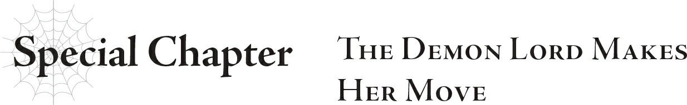

# Chương đặc biệt: Ma vương hành động
*(Special Chapter: The Demon Lord Makes Her Move)*

“Ha-ha-ha, nhìn xem! Con người cũng chỉ là rác rưởi mà thôi!”

“Cô Ariel, đó là lời thoại của kẻ phản diện mà...”

“Đúng thế thật, nhưng chúng ta cũng chẳng khác kẻ phản diện là mấy, đúng không?”

“...Cũng phải.”

“Balse!”

“Cô Ariel, không phải câu chú đó sẽ phá hủy con tàu này và thổi bay chúng ta vào không gian sao?”

“Ý tôi là, dù sao nó cũng là phi thuyền vũ trụ mà.”

“...Cũng phải.”

Khi chúng tôi bay vút qua bầu trời, tôi tận hưởng cuộc trò chuyện tẻ nhạt vô thưởng vô phạt với Wrath, lấy cảm hứng từ một lâu đài bay nào đó.

Tôi đã có thể vận hành phi thuyền này mà không gặp bất kỳ trở ngại nào.

Và hiện tại, chúng tôi đang hướng thẳng tới Mê cung Lớn Elroe, đồng thời quấy phá Thần Ngôn Giáo bằng cách phá hủy các nhà thờ mỗi khi đi ngang qua các thị trấn dọc đường.

Khi trận chiến giữa White và Gülie bắt đầu, và “tiến trình 2 của Nhiệm vụ Thế giới” được công bố, con đường phía trước của chúng tôi đã trở nên rõ ràng.

Tiến trình 2 đã thêm một tùy chọn Nhiệm vụ Thế giới vào menu Cấm Kỵ.

Bằng cách đọc nó, mọi người có thể biết được trận chiến này nói về cái gì và điều kiện để mỗi bên giành chiến thắng là gì.

Trước hết, đó là kết quả cuộc đối đầu giữa White và Gülie.

Thành thật mà nói, người chiến thắng trong trận chiến này gần như chắc chắn sẽ quyết định bên thắng cuộc.

White là người duy nhất có thể khởi động việc phá hủy hệ thống. Nếu con bé vẫn bình an vô sự, chúng tôi thắng; còn nếu con bé thua, chúng tôi sẽ không thể phá hủy hệ thống được nữa.

Chúng tôi không có cách nào để tác động đến kết quả của trận chiến này... ít nhất, ban đầu là như thế.

Nhưng “tiến trình 2” đã thay đổi tất cả những điều đó.

Bằng cách đưa vào khả năng can thiệp vào trận chiến thông qua lời cầu nguyện, “tiến trình 2” đã khiến trận đấu giữa hai thực thể này giờ đây liên đới đến toàn bộ thế giới.

Bạn cầu nguyện cho vị thần nào, vị thần đó sẽ trở nên mạnh hơn.

Tôi đoán sự thay đổi sẽ không đáng kể—ít nhất là từ lời cầu nguyện của một cá nhân riêng lẻ.

Nhưng nếu tích lũy những sự tăng cường sức mạnh nhỏ bé từ vô số lời cầu nguyện, nó có thể tạo thành một nguồn năng lượng khổng lồ.

Sức mạnh đó rất có thể sẽ quyết định người chiến thắng.

Giờ đây, dân chúng đã được trao quyền thay đổi kết quả của một cuộc chiến trên thượng giới, vốn là thứ bình thường nằm ngoài tầm ảnh hưởng của họ.

“Hóa ra họ đang bảo người dân thế giới này tự chọn lấy số phận của mình, thay vì phó mặc cho những kẻ ngoài cuộc. Một nước đi khôn ngoan đấy, dù cháu ghét phải thừa nhận điều đó.”

Sophia càu nhàu với vẻ mặt miễn cưỡng tỏ ý thán phục.

Với những quy luật này, ngay cả những con người không có sức mạnh chiến đấu cũng có thể can thiệp vào trận chiến giữa White và Gülie.

Nó mang lại cơ hội công bằng cho mỗi một người.

Đúng là phong cách của D khi ép buộc mọi người phải đưa ra một lựa chọn bất khả thi.

Điều đó đặc biệt giống cô ta ở chỗ những người đưa ra lựa chọn sẽ được phép thoát khỏi Cấm Kỵ.

Đúng thế: Nếu bạn cầu nguyện cho một trong hai vị thần, bạn có thể xóa bỏ Cấm Kỵ.

Mệnh lệnh “chuộc tội” mà Cấm Kỵ vang vọng trong tâm trí của một người là quá đủ áp lực để đẩy họ đến bờ vực tuyệt vọng.

Một vài người trong số chúng tôi đã quen với nó, như Dustin và tôi, nhưng nó có thể dễ dàng khiến một con người bình thường bị suy sụp tinh thần.

Vì vậy, nếu họ có thể thoát khỏi Cấm Kỵ và lời nguyền đi kèm của nó, tất nhiên họ sẽ cầu nguyện.

Nếu họ từ chối chọn cả hai, họ sẽ tiếp tục bị giày vò bởi Cấm Kỵ cho đến ngày nhắm mắt xuôi tay.

Sẽ cần một sự kiên cường đáng kể để trung thành với lựa chọn đó.

Liệu họ sẽ chọn một trong hai phương án đau đớn, hay giữ thái độ trung lập và cam chịu gánh chịu Cấm Kỵ?

Dù thế nào đi nữa, họ cũng đang ở trong địa ngục.

Quả không hổ danh là D.

Nhưng dù có đau đớn thế nào, tôi đoán hầu hết nhân loại rồi cũng sẽ đưa ra cùng một lựa chọn mà thôi.

Sau cùng thì, ai cũng sẽ ưu tiên bản thân mình lên hàng đầu khi mọi chuyện đi đến bước đường cùng.

Nếu bạn bị buộc phải cân nhắc giữa mạng sống của chính mình và của đấng cứu thế... ừm, bạn tự hiểu rồi đấy.

“Thật tình. Không thể tin nổi...”

Tôi muốn tin rằng White dù sao cũng sẽ chiến thắng.

Nhưng thành thật mà nói, rất khó để lạc quan.

“Dù sao thì, tất cả những gì chúng tôi có thể làm lúc này là thực hiện những gì trong khả năng của mình.”

Đó là phương án chiến thắng còn lại.

Ý tôi là, đối với phe bên kia.

Nếu một kẻ sở hữu đặc quyền Kẻ thống trị tiến vào lõi hệ thống bên trong Mê cung Lớn Elroe, họ có thể khởi động quy trình tắt khẩn cấp để ngăn chặn việc phá hủy hệ thống.

Chúng tôi phải đảm bảo điều đó không xảy ra.

Đó là lý do tại sao chúng tôi đang lao nhanh về phía mê cung trên chiếc phi thuyền này ngay lúc này.

Chúng tôi sẽ đến đó trước Dustin và người của ông ta, rồi chuẩn bị sẵn sàng để đánh đuổi họ.

Nếu chúng tôi thất bại trong việc bảo vệ căn phòng lõi, chúng tôi sẽ thua cuộc chiến này.

Con đường duy nhất dẫn đến chiến thắng của chúng tôi là White thắng trận và chúng tôi bảo vệ thành công lõi hệ thống.

Trong khi đó, họ chỉ cần Gülie giành chiến thắng hoặc có người đột phá qua hàng phòng ngự của chúng tôi để tắt quy trình phá hủy hệ thống.

Chúng tôi phải thực hiện được cả hai điều kiện, trong khi họ chỉ cần một điều kiện để giành chiến thắng.

Vì White đang chiến đấu hết mình ngoài kia, chúng tôi cũng phải hoàn thành vai trò của mình bằng cách bảo vệ lõi hệ thống bằng mọi giá.

Tôi hạ quyết tâm phải làm được điều đó.

`<Tiến trình 3 của Nhiệm vụ Thế giới. Đại diện của mỗi bên sẽ có bài phát biểu. Ma Vương Ariel.>`

“Hả?!”

Khi tiếng Thần ngôn đột ngột vang lên bên tai, tôi thốt lên một tiếng kêu đầy sửng sốt.

Điều này thậm chí còn đáng ngạc nhiên hơn, vì tôi đích danh bị gọi tên.

Và rồi, chính tiếng kêu kỳ lạ đó của tôi cũng vang vọng lại trong đầu tôi.

“Hả? Có chuyện gì thế này?”

Tiếng lẩm bẩm đầy bối rối của tôi cũng vang vọng trong đầu.

“Cháu nghe thấy tiếng của cô trong đầu đấy, cô Ariel.”

“Cái gì? Vậy không phải chỉ có mình tôi nghe thấy sao?”

“Đúng vậy ạ.”

Wrath gật đầu.

Tôi nhìn sang Sophia, và con bé cũng gật đầu.

Thôi xong. Tôi có một dự cảm cực kỳyyy chẳng lành về chuyện này rồi.

“Hả? Không lẽ tôi đang... phát sóng trực tiếp cho toàn nhân loại hay gì đó sao?”

Cho đến nay, các tiến trình của Nhiệm vụ Thế giới đều ảnh hưởng đến toàn bộ nhân loại á nhân.

Điều đó không có nghĩa là... họ cũng đang nghe thấy tất cả những điều này ngay lúc này đấy chứ...?

Họ đã nghe thấy tất cả, kể cả tiếng kêu kỳ lạ vừa rồi sao?!

“N-Nhưng... aaaaa!”

Khi khả năng đó lóe lên trong đầu, tôi vô tình phát ra một tiếng rên rỉ thậm chí còn đáng xấu hổ hơn nữa.

Ngay cả khi biết rằng mọi người trên thế giới có thể cũng đã nghe thấy tiếng rên rỉ đó...

---

* [◀ Chương trước: Đoạn phụ: Dustin](16_interlude_dustin.md)
* [Chương tiếp theo: Đoạn phụ: Bài phát biểu từ cả hai phía ▶](18_interlude_speeches_from_each_side.md)
