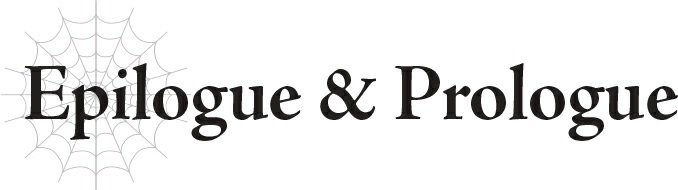
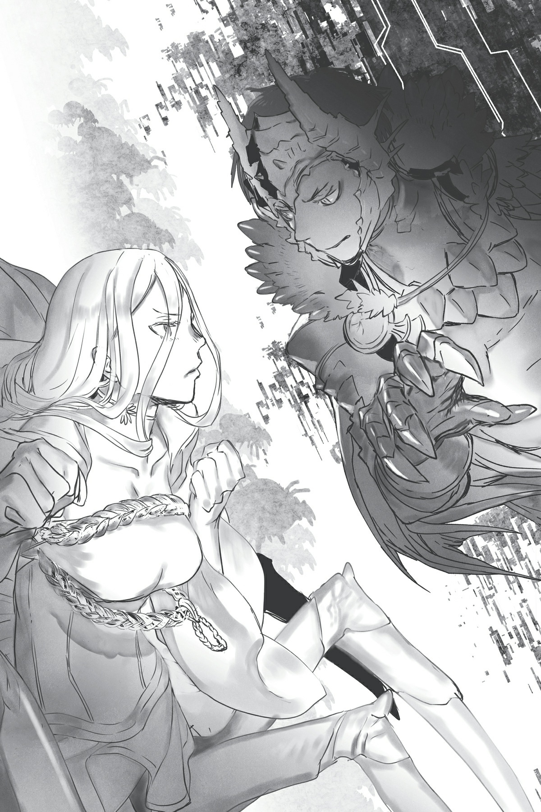

# Vĩ thanh & Mở đầu
*(Epilogue and Prologue)*

Bài phát biểu của cả Ma Vương lẫn Giáo hoàng cũng đã truyền đến tai tôi.

“Chúng ta mới là những kẻ chiến thắng cuối cùng,” cô ấy nói thế sao?

Mà đã nghe một câu như thế rồi thì làm sao tôi có thể thua được, phải không?

“Có vẻ như cả hai chúng ta đều không thể để thua nhỉ.”

Đối mặt với tôi, Hắc nở một nụ cười khổ.

Chắc anh ta cũng đã nghe thấy những lời phát biểu đó.

Với tôi, bài phát biểu của Giáo hoàng nghe giống như một tiếng khóc bi thương.

Khi nghe nó, tôi có thể nhận ra ông ta thực sự đã phải đau khổ rất nhiều, nhưng suốt thời gian qua lại chẳng thể lựa chọn con đường nào khác.

Rõ ràng qua bài phát biểu đó, ông ta không phải là một kẻ xấu—mà thực chất là một người vô cùng cao cả.

Nếu mọi chuyện diễn ra theo một chiều hướng khác, có lẽ chúng tôi đã có thể sát cánh bên nhau như những người đồng minh thay vì kẻ thù.

Điều tương tự cũng áp dụng cho Hắc lúc này.

Không phải chúng tôi căm ghét gì nhau.

Thành thật mà nói, tôi khá là thích anh ta.

Nhưng chúng tôi vẫn phải chiến đấu.

Bởi vì cả hai chúng tôi đều không thể lùi bước trước những gì mình tin tưởng.

Tất cả những gì còn lại là dốc toàn lực chiến đấu.

Vì thế, tôi đưa ra tuyên bố này như một sự tôn trọng dành cho đối thủ.

“Chúng tôi mới là những người sẽ chiến thắng.”

“Ta cũng không được phép để thua.”

Cả hai chúng tôi đều có những mục tiêu không thể từ bỏ.

Cả hai đều có lý tưởng và những người mà mình muốn bảo vệ.

Cả hai đều đang đặt lòng tự tôn của mình lên bàn cân.

Đối thủ của tôi là Quản trị viên Güliedistodiez.

Vị long thần đã luôn dõi theo thế giới này suốt bấy lâu nay, bị cấm không được phép can thiệp thêm bất kỳ điều gì.

Một người bảo hộ mang trên lưng mọi hy vọng của nhân loại.

Tôi không thể đòi hỏi một đối thủ xứng tầm hơn thế.

Nhưng dẫu vậy, chúng tôi mới là những người chiến thắng cuối cùng.

Ngay cả khi anh ta mang theo đức tin và sức mạnh của toàn thể nhân loại, tôi cũng sẽ xé toạc tất cả.

“Tôi đã sẵn sàng.”

“Đi thôi.”

Và cứ như thế, trận chiến giữa Güliedistodiez và tôi lại tiếp diễn.

---

* [◀ Chương trước: Đoạn phụ: Bài phát biểu từ cả hai phía](18_interlude_speeches_from_each_side.md)
* [Chương tiếp theo: Lời bạt](20_afterword.md)
