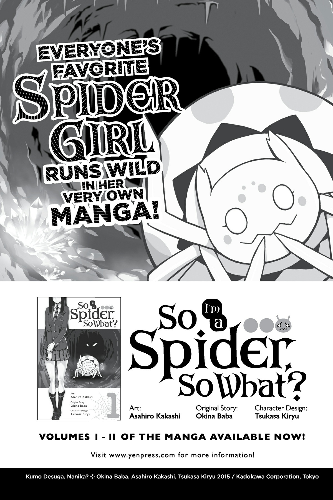
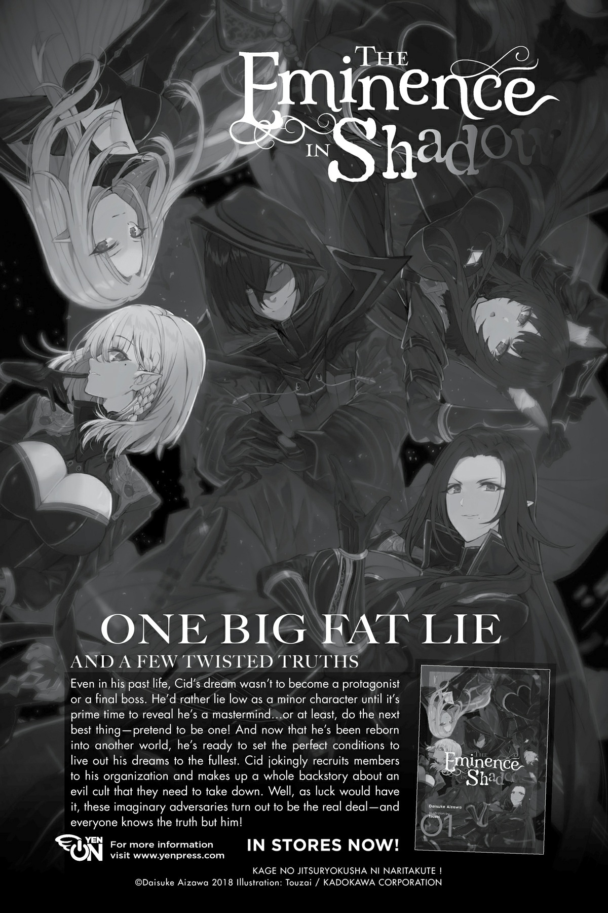
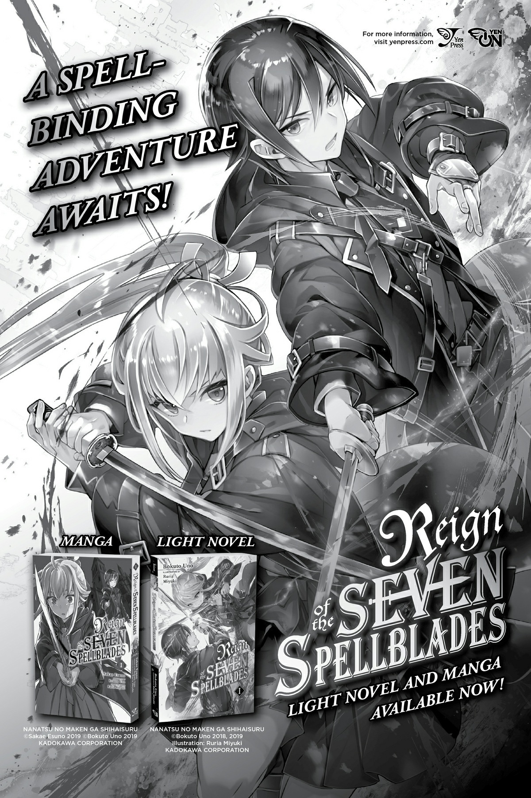

# Lời bạt
*(Afterword)*

Xin chào. Tôi là Okina Baba.

Lại một năm nữa sắp sửa trôi qua.

Và series này cũng sắp đi đến hồi kết rồi!

Tin được không, Tập 16—tập tiếp theo và cũng là tập cuối cùng của series—sẽ (hy vọng là) được ra mắt vào đầu năm sau!

Nói cách khác, hai tập liên tiếp trong vòng hai tháng.

Hai tập liên tiếp trong vòng hai tháng đấy!

Vì đây là chuyện quan trọng nên tôi phải nhắc lại hai lần liên tiếp.

Tại sao tôi lại tự dấn thân vào một việc điên rồ như xuất bản hai tập trong hai tháng liên tiếp cơ chứ?

Chuyện là, tất cả bắt đầu từ một cuộc họp với biên tập viên sau khi tôi viết xong Tập 14.

“Tôi nghĩ Tập 15 sẽ là bước đệm chuẩn bị cho trận chiến cuối cùng, còn Tập 16 sẽ là tập kết thúc, nhưng tôi cảm giác như vậy thì Tập 15 sẽ không đủ kịch tính.”

Đúng vậy.

Như các bạn có lẽ đã nhận ra khi vừa đọc xong Tập 15, hầu như không có trận chiến thực sự nào diễn ra trong tập này cả.

Mặc dù đúng là suýt thì có một trận chiến trên giường.

Tôi đoán về mặt kỹ thuật thì trận chiến giữa Hắc và Bạch đã bắt đầu, nhưng phải đến Tập 16 mọi chuyện mới thực sự trở nên nghiêm trọng...

Tất cả đều là những tình tiết cần thiết cho cốt truyện, nhưng điều đó vô tình biến Tập 15 thành một bước đệm thuần túy cho Tập 16.

Tập 14 xuất bản vào tháng Một, tức là gần một năm trước. Liệu độc giả có thực sự vui vẻ khi phải chờ đợi ròng rã suốt một năm trời chỉ để đọc một tập chuẩn bị hay không?

Đó chính là điều tôi lo lắng.

“Hay là cho ra mắt Tập 16 cùng lúc, hoặc chỉ muộn hơn một tháng nhỉ?”

Đúng thế, tôi đã nói câu đó đấy.

Tôi đã lỡ lời thốt ra như thế đấy!

“Vậy thì quyết định ra mắt hai tập trong hai tháng liên tiếp nhé.”

Và biên tập viên W của tôi đã chiến đấu vô cùng quả cảm để biến điều đó thành hiện thực.

Ha-ha-ha!

Kéo theo sau đó là chuỗi ngày viết lách không ngừng nghỉ để kịp tiến độ xuất bản hai tập trong hai tháng!

Biết bao nhiêu lần rồi?! Biết bao nhiêu lần tôi đã hối hận vì phát ngôn ngu ngốc đó của mình?!

Trước đây tôi cũng từng rất nhiều lần hối hận sau khi nói những câu kiểu như “Vâng, chắc chắn rồi, tôi làm được mà!”, nhưng rõ ràng là tôi chẳng bao giờ rút ra được bài học cả.

Tôi còn phải tự tròng dây vào cổ mình bao nhiêu lần nữa thì mới tỉnh ngộ đây?

Vì vậy, người bạn già Okina ở đây để khuyên các bạn rằng đừng có đi rêu rao những lời hứa hẹn ngốc nghếch với người khác khi chưa suy nghĩ kỹ càng. Hết truyện.

Ơ, vẫn chưa hết à?

Phải rồi.

Dù trong quá trình thực hiện tôi đã phải chịu đựng không ít khổ cực, nhưng ít nhất điều đó cũng giúp tôi mang Tập 15 và Tập 16 đến tay các bạn mà không phải chờ đợi quá lâu.

Xin hãy tiếp tục đón chờ tập cuối cùng nhé.

Giờ thì, cho phép tôi được gửi lời cảm ơn đến:

Tsukasa Kiryu-sensei, họa sĩ minh họa của tôi.

Vì quyết định dại dột của tôi mà Kiryu-sensei cũng bị cuốn vào một lịch trình làm việc cực kỳ khắc nghiệt!

Tôi thực sự xin lỗi... và cảm ơn cô rất nhiều!

Cảm ơn Asahiro Kakashi-sensei, họa sĩ vẽ bản chuyển thể manga, và Gratinbird-sensei, họa sĩ vẽ bản spinoff manga.

Tôi xin lỗi vì đã chậm trễ trong việc duyệt các bản phác thảo vẽ thu nhỏ (thumbnail) do năm nay bận rộn quá nhiều việc... và cảm ơn hai vị rất nhiều!

Gửi đến tất cả những ai đã tham gia vào quá trình sản xuất anime.

Nhờ vào nỗ lực phi thường của đạo diễn Shin Itagaki cùng vô số nhân sự khác mà cả hai phần (cour) của anime đã được phát sóng thành công tốt đẹp.

Tôi muốn nhân cơ hội này để bày tỏ lòng biết ơn chân thành nhất đến tất cả những người đã giúp đỡ dự án anime. Xin cảm ơn mọi người rất nhiều!

Gửi đến biên tập viên W của tôi. Nghe này, tôi biết mình đã gây ra cho cô rất nhiều rắc rối về lịch trình và mọi thứ khác vì đột nhiên đòi xuất bản hai tập liên tiếp... Tôi thực sự xin lỗi! Và cảm ơn cô rất nhiều!

Một nửa những lời cảm ơn này đi kèm với lời xin lỗi, nhưng ít nhất tôi có thể gửi lời cảm ơn thuần túy nhất đến tất cả những ai đã mua cuốn sách này, cũng như tất cả những ai đã theo dõi bộ anime.

Cảm ơn các bạn rất nhiều!

---

* [◀ Chương trước: Vĩ thanh & Mở đầu](19_epilogue_and_prologue.md)
* [Chương tiếp theo: Bản tin Yen Press](21_yen_newsletter.md)
