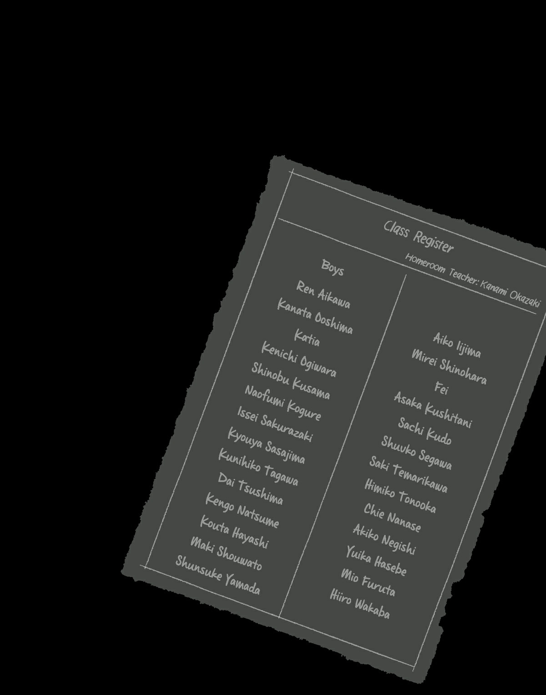
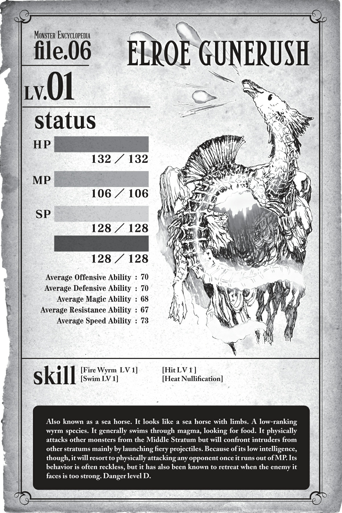

# Chương 1: Rõ ràng là Thượng đế ghét nhện

*(Clearly, God Hates Spiders)*

---

### --- TRANG 11 ---

Biết sao không, tôi vừa nhận ra mình cực kỳ xui xẻo.

Mà thực ra, nó có lẽ đã vượt xa cái mức gọi là "đen đủi" rồi. Cuộc đời nhện của tôi là một chuỗi biến cố điên rồ đến mức tôi buộc phải cho rằng Thượng đế chắc chắn ghét mình.

Ý tôi là, một người bình thường chẳng phải sẽ phát điên sao nếu tự dưng một ngày thức dậy đầu thai thành một con quái vật tám chân mà chẳng có lý do gì rõ ràng?

Chưa kể nơi chôn rau cắt rốn thứ hai của tôi lại là cái nơi này, "Mê cung Lớn Elroe" — hầm ngục lớn nhất ở dị thế giới này.

Đã vậy lũ quái vật ở đây con nào con nấy cũng mạnh đến phi lý.

Nơi này đúng nghĩa là một thế giới tàn khốc cá lớn nuốt cá bé, mạnh được yếu thua.

Tôi đã sống khá ổn áp được một thời gian khi tận dụng các kỹ năng nhện mới của mình để xây một tổ ấm nhỏ, nhưng rồi đột nhiên một lũ người xuất hiện và thiêu rụi nó.

Sau đó, tôi lang thang khắp mê cung trước khi vô tình rơi xuống Tầng Dưới, nơi có mức độ khó cao hơn gấp vạn lần so với Tầng Trên quen thuộc.

Tại đó, một thực thể quái dị gọi là địa long đã tấn công tôi, và tôi chỉ suýt soát giữ được cái mạng nhỏ để trốn thoát.

Rồi tôi phải bằng cách nào đó vượt qua một khu vực đầy rẫy lũ quái vật có thể dễ dàng tiễn tôi lên đường chỉ trong một nốt nhạc nếu tôi dám có ý định động vào chúng.

Và tiếp đến... là cái bầy khỉ đó.

Vì một lý do kỳ quái nào đó, một đàn khỉ đông nghịt đã lao vào tấn công tôi như thể tôi là kẻ thù truyền kiếp giết cha tụi nó vậy.

So với các quái vật khác ở Tầng Dưới thì chúng tương đối yếu, nhưng xét theo từng cá thể thì con nào cũng mạnh hơn tôi nhiều.

Thế mà cả một lũ hung hãn đó lại cùng lúc xông lên hội đồng tôi!

### --- TRANG 12 ---

Tôi kiểu: Giỡn mặt nhau hả trời?

Tôi đã thực sự phải chiến đấu để giành giật sự sống.

Chỉ cần đòn phản công thất bại một li thôi là tôi đã chầu diêm vương thật rồi.

Nói thật lòng, tôi nghĩ mình xứng đáng được tuyên dương vì đã sống sót qua cuộc khủng hoảng đó.

Làm tốt lắm, tôi ơi. Phải đó. Tôi đã nỗ lực hết mình rồi.

Thế thì tại sao tôi lại phải chịu sự đối xử như thế này cơ chứ?!

Tôi chẳng biết Thượng đế có tồn tại thật hay không, nhưng nếu có, tôi muốn gửi một lá đơn khiếu nại:

Thế này chẳng phải hơi quá đáng rồi sao?

Một biển dung nham đỏ rực, nóng bỏng đang sủi bọt sùng sục ngay trước mắt tôi.

Nhưng hãy quay ngược thời gian một chút nhé. Vừa tiêu diệt xong bầy khỉ đó thì tôi nhận thấy có gì đó hơi lạ.

Trời hơi nóng.

Ban đầu tôi tự hỏi liệu có phải do nhiệt độ cơ thể tăng lên sau trận chiến hay không, nhưng có vẻ không phải thế.

Mà nhện thì có vụ tăng thân nhiệt sau vận động mạnh không ta?

Thôi, không quan trọng. Vấn đề thực sự là nhiệt độ thay đổi đột ngột, điều mà tôi chưa từng trải qua kể từ khi đến đây.

Nó có vẻ không nguy hiểm cho lắm.

Xung quanh chỉ có xác của lũ khỉ nằm la liệt.

Có vẻ như không có con hỏa long nào xuất hiện tiếp nối sau con địa long kia cả.

Thế thì tại sao trời lại nóng hầm hập thế này?

Rồi khi nhìn dáo dác xung quanh, tôi phát hiện ra một thứ.

Một khu vực dốc hướng lên trên.

Phải, hướng lên trên. Để tôi nhắc lại lần nữa nhé: Hướng lên trên!

Sau cú rơi tự do từ Tầng Trên, tôi đã phải vật lộn một thời gian dài ở Tầng Dưới.

Và bây giờ đang có một con đường dẫn thẳng ngược lên.

Điều đó chỉ có thể nghĩa là đây là con đường thoát khỏi Tầng Dưới để tiến vào Tầng Trung!

Hura! Cơ hội thoát khỏi khu vực siêu nguy hiểm đây rồi!

Nghĩ là làm, tôi háo hức leo lên con dốc. Lên tới đỉnh, đập vào mắt tôi là một viễn cảnh đỏ rực bao la.

### --- TRANG 13 ---

Và thế là chúng ta quay lại với hiện tại.

Cái quái gì thế này?!

Chuyện gì đang xảy ra vậy?

Tôi không hiểu nổi.

Không, không, không thể nào!

Sao lại có dung nham ở đây?

Làm sao mà dưới lòng đất lại có dung nham như thế này được?

À thì, đây là hầm ngục nằm sâu dưới lòng đất, nên có lẽ thế cũng hợp lý, nhưng mà...

Thật không thể tin nổi.

Khoan đã, nóng đến mức HP của tôi đang tụt dần đều kìa.

Nhiệt độ này không phải chỉ hơi nóng bình thường đâu. Nó nóng như thiêu như đốt ấy!

Hửm? Hình như có cái gì đó nóng nóng ở gần mông.

Á?! Tơ thò ra từ mông tôi đang bốc cháy kìa?!

Dập mau! Dập mau! Hoặc ít nhất là cắt đứt nó đi!

Phù, suýt nữa thì mông tôi hóa tro rồi. Nguy hiểm thật.

Tôi đoán lỗi là do bản thân không nhận ra mình lại kéo lê tơ sau mông, nhưng tôi vẫn không thể ngờ được là nó lại bốc cháy dễ dàng như thế!

Không phải toàn bộ khu vực này đều là dung nham, vẫn có những mảng đất cứng để tôi bước đi—nhưng làm thế nào tôi có thể thám hiểm một nơi mà ngay cả lối vào đã nóng sôi sùng sục thế này chứ?

Ai đó làm ơn cho tôi xin cốc nước đá đi!

Hử? Có một con quái vật dưới lớp dung nham.

Trông nó như một con cá ngựa có cả tay lẫn chân, đang bơi lội tung tăng trong đống dung nham đó.

Ờ... được rồi.

Hơi rén chút, nhưng tốt hơn là tôi nên Thẩm định nó.

`<Gunerush Elroe Cấp 7 | Trạng thái: HP: 167/167 (lục) MP: 145/158 (lam) SP: 155/155 (vàng) : 156/165 (đỏ) | Thẩm định trạng thái thất bại>`

### --- TRANG 14 ---

Ồ, xem được chỉ số ngay từ lần đầu tiên luôn. May mắn ghê.

Hửm. Nhìn vào mấy con số này thì nó không hẳn là mạnh lắm. Cơ mà nó vẫn mạnh hơn tôi!

Có lẽ tôi nên điều tra sâu hơn bằng Thẩm định kép.

`<Gunerush Elroe: Loài quái vật dạng rồng hạ cấp sống ở Mê cung Lớn Elroe, Tầng Trung. Chúng thao túng ngọn lửa và được lửa bảo vệ.>`

Đây rồi! Mê cung Lớn Elroe, Tầng Trung! Vậy nơi này thực sự là Tầng Trung!

`<Mê cung Lớn Elroe, Tầng Trung: Khu vực nằm giữa Tầng Trên và Tầng Dưới. Toàn bộ địa hình của khu vực này nóng bỏng với dòng dung nham chảy tràn. Đây là nơi trú ngụ của nhiều loài quái vật có khả năng kháng lửa.>`

...Thật hả?

Trời ơi, không thể nào.

Cả Tầng Trung đều như thế này sao?

Và tôi phải băng qua nơi này để lên được Tầng Trên à?

Làm thế quái nào tôi có thể đi qua đây được chứ?

Địa hình chỉ cần dẫm chân lên là mất máu. Sông hồ dung nham chỉ cần sẩy chân ngã xuống là hóa thành tro bụi.

Đã vậy nếu quái vật sống ở đây kháng lửa, chẳng phải điều đó đồng nghĩa với việc chúng cũng có thể phun ra lửa luôn sao?

Mọi người có biết điểm yếu chí tử của tơ nhện là gì không? Biết rồi đúng không, vì nó vừa cháy rụi xong chứ đâu?

Là LỬA đó!!

Nghiêm túc đấy, tôi phải làm sao đây?

Tôi mà không có tơ nhện thì khác nào món natto thiếu đi vi khuẩn natto cơ chứ!

Như vậy thì chẳng còn là đậu lên men nữa, mà chỉ là đống rác thối rữa thôi!

Sự vô dụng của tôi khi thiếu đi tơ nhện cũng y chang như vậy đó.

Không hề quá lời khi nói tơ nhện là lý do duy nhất giúp tôi sống sót đến tận bây giờ.

Không có nó, tôi không thể giăng lưới, không thể bẫy kẻ địch — tôi chẳng làm được tích sự gì hết!

A, con cá ngựa đã phát hiện ra tôi trong lúc tôi đang mải suy nghĩ vẩn vơ. Mắt chúng tôi hoàn toàn chạm nhau rồi.

Cơ mà tôi vẫn đứng khá xa, chắc không sao đâu... Ủa, khoan đã?!

Nó vừa hít một hơi thật sâu rồi phun cái gì đó về phía tôi kìa?!

### --- TRANG 15 ---

À, một quả cầu lửa.

Ááááááá!!!

Phải né gấp thôi. Nếu thứ đó trúng vào người, tôi sẽ chỉ còn là đống tro tàn.

Trời đất ơi, giỡn chơi hoài! Làm thế nào mà một quả cầu lửa lại có thể bay vèo vèo trong không trung như thế hả? Nguyên lý vật lý gì ở đây vậy?

Đó là chiêu thức kỳ ảo kinh điển nhất tôi từng thấy kể từ đòn hơi thở của địa long.

Dù so với đòn đó thì chiêu này trông không bá đạo bằng.

Nhưng mà, thật bất công làm sao khi tên cá ngựa đó có thể đứng giữa biển dung nham xài đòn tấn công tầm xa như thế?

Quả cầu lửa thứ hai lại phóng thẳng về phía tôi, nhưng tôi cũng tránh được.

Không phải là tôi không né được. Nhưng thế này vẫn rất tệ.

Ý tôi là, đòn tấn công tầm xa duy nhất của tôi là ném tơ nhện.

Thử nghiệm một chút xem sao, tôi tạo ra vài sợi tơ rồi ném đi.

Nhưng thật không may, nó bốc cháy ngay trong không trung ngay khi tôi vừa ném ra.

Hừ, cách này không ăn thua rồi. Tôi vội vàng ngắt đứt sợi tơ.

Trong lúc tôi còn đang bận rộn với mớ tơ, con cá ngựa lại bắn phát thứ ba.

Tôi né được. Dẫu vậy, ngay cả khi không bị trúng đòn trực tiếp, HP của tôi vẫn đang sụt giảm liên tục vì sức nóng khủng khiếp ở đây.

Hự, dù ghét phải thừa nhận, nhưng chạy trốn là lựa chọn duy nhất của tôi lúc này.

Tôi quay lưng lại với con cá ngựa, nhanh chóng rút lui xuống con dốc vừa leo lên.

Rút lui một khoảng khá xa, tôi chỉ dừng lại khi đã về tới chỗ bao quanh bởi xác lũ khỉ.

Phù, giờ thì HP của tôi không bị tụt vì hơi nóng nữa rồi.

Tôi có Tự hồi phục HP, nên nghỉ ngơi một chút là máu sẽ đầy lại thôi.

Nhưng trời ạ, ức chế thật chứ!

Nếu chỉ xét trên các con số chỉ số đơn thuần, tôi có lẽ đã hạ được tên đó.

Chỉ số của con cá ngựa về cơ bản là cao hơn, đúng thế, nhưng chuyện đó vốn dĩ quá quen thuộc rồi.

Thế mà lần này, tôi thậm chí còn không chạm nổi một ngón chân — hay một cái chân nhện, một sợi tơ nào vào người nó cả.

Tôi phải thừa nhận rằng chuyện này cực kỳ nghiêm trọng.

Trước đây tôi toàn chiến thắng kẻ thù mạnh hơn nhờ giăng lưới, chứ chưa bao giờ đối đầu với kẻ vừa có lợi thế địa hình tuyệt đối lại vừa có chỉ số vượt trội thế này.

Kẻ thù này có thể biến mọi nỗ lực từ trước đến nay của tôi thành công cốc.

Trên hết, vũ khí mạnh nhất của tôi — tơ nhện — lại hoàn toàn vô dụng ở đây.

Hay là tôi thực sự tèo rồi hả trời?

### --- TRANG 16 ---

Để lên được Tầng Trên, tôi bắt buộc phải chinh phục được Tầng Trung.

Nhưng có vẻ chuyện đó bất khả thi rồi.

Hay là tôi nên đi tìm con đường khác?

Con đường duy nhất khác mà tôi biết là đi qua cái hố đầy ong kia.

Hơn nữa, đi đường đó chẳng phải đồng nghĩa với việc quay lại nơi con địa long hay lảng vảng sao?

Không, xin kiếu. Không đời nào.

Vậy tôi có nên tìm một lối đi thẳng đứng khác không? Liệu có đường thông lên nào tiện lợi như thế nữa không ta?

Không hẳn là không thể.

Lúc còn ở Tầng Trên, tôi từng bắt được ong bằng tơ của mình và có thấy một cái hố tương tự ở chỗ khác, nên có thể lũ ong cũng có tổ ở đó.

Nhưng chẳng có cách nào để xác thực chuyện đó cả.

Vậy rốt cuộc tôi nên cố gắng vượt qua Tầng Trung?

Hay là tiếp tục khám phá Tầng Dưới để tìm kiếm một đường hầm mà không biết là có tồn tại hay không?

Tôi nên làm gì đây...?

À thì, có lẽ tạm gác chuyện đó lại đã, tập trung vào việc tiến hóa trước tiên.

Nhờ lượng EXP khổng lồ kiếm được từ việc tiêu diệt đàn khỉ, cấp độ của tôi đã vọt lên một cách chóng mặt.

Không phải là tôi hoàn toàn quên mất chuyện này khi tìm thấy con dốc hướng lên rồi phấn khích thái quá đâu nhé, thật đấy!

Tôi chắc chắn là không quên đâu.

Tiến hóa đòi hỏi bản thân phải rơi vào trạng thái mất ý thức cưỡng chế, nên việc tiến hóa ngay tại Tầng Dưới đầy rẫy quái vật nguy hiểm rình rập thế này quả thực cần không ít can đảm. Nhưng không phải là tôi không dám thử.

Một phần là vì tôi lo ngại giới hạn cấp độ của mình đã bị kịch trần.

Dù đã giết cả đống khỉ như thế, cấp độ của tôi vẫn không thể vượt quá cấp 10.

Nếu đơn thuần là do chưa đủ EXP thì không nói, nhưng chuyện gì sẽ xảy ra nếu chủng tộc của tôi có giới hạn cấp độ bắt buộc phải tiến hóa mới có thể tăng tiếp?

Nếu đây chỉ là một trò chơi, tôi có thể kiểm chứng bằng cách thử lên thêm một cấp nữa trước khi tiến hóa, nhưng ở đây mạng sống của tôi đang bị đem ra đánh cược.

Tôi không muốn mạo hiểm mạng sống của mình chỉ để làm một cái thí nghiệm đâu.

### --- TRANG 17 ---

Dù sao thì tôi cũng đang có hai lựa chọn tiến hóa: taratect và tiểu taratect độc.

Hửm, nên chọn cái nào đây ta?

Vì từ "tiểu" trong tên hiện tại của tôi không có trong tùy chọn tiến hóa "taratect", tôi đoán lựa chọn đó sẽ biến tôi thành một con nhện to xác hơn.

Lần đầu tiên tiến hóa, tôi từng có lựa chọn nâng từ "tiểu taratect thứ cấp" lên "taratect thứ cấp", nên hoàn toàn có thể suy đoán rằng tôi sẽ chỉ to ra nếu chọn nhánh này.

Vấn đề thực sự nằm ở tùy chọn "tiểu taratect độc".

Vì nó thêm chữ "độc", chắc chắn nó sẽ cường hóa khả năng chuyên về độc tố của tôi đúng không?

Trời ạ, những lúc thế này tôi thực sự ước mình có thể Thẩm định các tùy chọn chủng tộc của mình...

Khoan đã... Thẩm định?

Liếc nhìn bảng trạng thái của mình, tôi nhận thấy có điều gì đó lạ lùng.

Ở phía dưới cùng của danh sách chỉ số, dòng chữ "Có thể tiến hóa" đang nhấp nháy liên tục.

Cái gì đây?

Tôi thử Thẩm định kép nó xem sao.

`<Các nhánh tiến hóa khả dụng: Taratect HOẶC tiểu taratect độc>`

Ồ! Thẩm định ơi, cưng nói thật đấy hả?!

Trời đất thiên địa ơi! Vì nó được hiển thị dưới dạng ký tự văn bản, đồng nghĩa với việc tôi có thể Thẩm định kép nó!

Giờ tôi có thể Thẩm định cả các chủng tộc mà mình có thể tiến hóa thành rồi!

Kỹ năng Thẩm định càng ngày càng trở nên hữu dụng đến mức bắt đầu làm tôi thấy rén rồi đấy.

Dù thế nào đi nữa, tôi phải tìm hiểu các lựa chọn của mình ngay lập tức.

`<Taratect: Chủng tộc trưởng thành tiêu chuẩn của loài quái vật dạng nhện taratect. Một loài ăn thịt sở hữu răng nanh chứa độc tố.>`

`<Tiểu taratect độc: Chủng tộc non trẻ quý hiếm thuộc loài quái vật dạng nhện taratect. Sở hữu độc tố cực kỳ mạnh mẽ.>`

Được rồi. Quyết định thế đi. Chắc chắn phải chọn con đường Độc rồi.

Ý tôi là, đây là chủng tộc quý hiếm đó! Quý hiếm cơ mà!

Làm gì có ai đi chọn chủng tộc "tiêu chuẩn" thay vì chủng tộc "hiếm", tôi nói có đúng không nào?

Nói xong, tôi vội vã xây một cái tổ nhỏ đơn sơ trên vách tường.

Đến giờ tiến hóa rồi! Chúc ngủ ngon.

### --- TRANG 18 ---

Và chào buổi sáng.

Hửm. Xem ra tôi đã thức dậy an toàn lành lặn.

Tôi quan sát xung quanh từ căn nhà nhỏ đơn sơ của mình.

Tất cả những gì tôi thấy chỉ là xác của lũ khỉ, không có quái vật nào khác. Tuyệt vời, tuyệt vời.

Vì tình hình có vẻ an toàn, cùng kiểm tra bảng trạng thái sau tiến hóa xem sao nào.

`<Tiểu Taratect Độc LV 1 | Không tên>`

| Chỉ số | Giá trị |
| :--- | :--- |
| **HP** | 56/56 (lục) `(tăng 2)` |
| **MP** | 1/56 (lam) `(tăng 2)` |
| **SP (vàng)** | 56/56 `(tăng 2)` |
| **SP (đỏ)** | 1/56 `(tăng 2)` |
| **Sức tấn công trung bình** | 38 `(tăng 2)` |
| **Sức phòng ngự trung bình** | 38 `(tăng 2)` |
| **Sức ma pháp trung bình** | 27 `(tăng 1)` |
| **Khả năng kháng tính trung bình** | 27 `(tăng 1)` |
| **Tốc độ trung bình** | 537 `(tăng 21)` |

**Kỹ năng:**
[Tự hồi phục HP LV 3] [Tấn công Độc LV 9 `(MỚI)`] [Tổng hợp Độc LV 3] [Tơ Nhện LV 9 `(tăng 1)`] [Tơ Cắt LV 4] [Điều khiển Tơ LV 8 `(tăng 1)`] [Ném LV 3] [Tập trung LV 5 `(tăng 1)`] [Đánh trúng LV 4] [Né tránh LV 2] [Thẩm định LV 8 `(tăng 1)`] [Phát hiện LV 4] [Ẩn mật LV 6] [Ma pháp Dị giáo LV 3 `(tăng 1)`] [Ma pháp Bóng tối LV 2] [Ma pháp Độc LV 2 `(tăng 1)`] [Phàm ăn LV 4] [Dạ nhãn LV 10] [Mở rộng Tầm nhìn LV 2] [Kháng Độc LV 8 `(tăng 1)`] [Kháng Tê liệt LV 3] [Kháng Hóa đá LV 3 `(tăng 1)`] [Kháng Axit LV 4] [Kháng Thối rữa LV 3] [Kháng Ngất LV 2 `(tăng 1)`] [Kháng Sợ hãi LV 6] [Kháng Ngoại đạo LV 2 `(tăng 1)`] [Vô hiệu Đau] [Giảm Đau LV 6] [Sinh mệnh LV 2] [Ma lượng LV 2] [Bộc phát lực LV 2] [Bền bỉ LV 2] [Cự lực LV 1] [Vững chãi LV 1] [Thần tốc LV 2] [Cấm kỵ LV 2] [n% I = W]

**Điểm kỹ năng:** 200

### --- TRANG 19 ---

Ồ. Có cả cái hiển thị chữ "tăng" (UP) mới kìa.

Cái này chắc chắn là do cấp độ kỹ năng Thẩm định của tôi đã tăng lên rồi đúng không?

Bây giờ còn có cả phần hiển thị điểm kỹ năng nữa chứ, và có vẻ Thẩm định đang hoạt động rất trơn tru.

Hay là chữ "tăng" đó là để so sánh với chỉ số trước khi tiến hóa nhỉ?

Tuyệt cú mèo! Chỉ số của tôi đã tăng lên rồi! Dù chỉ là một chút xíu...

Tôi cứ nghĩ chúng sẽ tăng lên một cách hoành tráng và đột biến hơn nhiều vì tôi đã tiến hóa thành chủng tộc hiếm chứ, cơ mà có vẻ không phải vậy.

Dù sao thì chỉ số tốc độ của tôi vẫn cao đến mức lố bịch như mọi khi.

Thôi thì sao cũng được. Bảng trạng thái của tôi từ trước đến nay cũng đâu có thay đổi gì nhiều.

Tuy nhiên, các kỹ năng của tôi thì chắc chắn là có đấy.

Chúng đã được cải thiện rất nhiều trong lúc tôi chiến đấu với bầy khỉ, thế nên tôi mới sở hữu thêm một đống kỹ năng mới.

Kỹ năng Răng Độc không biết bằng cách nào đã biến thành Tấn công Độc rồi?

Nhờ có Thẩm định, tôi có thể biết được những gì thay đổi chỉ trong một nốt nhạc, nhưng chuyện này xem ra vẫn khá là bất tiện.

Úi chà, chỉ số SP của tôi đã tụt dốc không phanh do tiến hóa và các thứ, nên tốt nhất là tôi nên lôi đống thịt khỉ dự trữ ra chén để nạp lại năng lượng.

Tôi vừa ăn vừa tiếp tục kiểm tra bảng trạng thái của mình.

Tôi biết là SP sẽ giảm, nhưng có vẻ ngay cả MP của tôi cũng tụt luôn.

Lần tiến hóa trước đâu có bị như vậy đâu, suýt chút nữa là tôi không nhận ra rồi.

Vì bây giờ tôi cần dùng MP cho Tổng hợp Độc, Điều khiển Tơ và các thứ tương tự, tôi sẽ phải bắt đầu chú ý hơn đến lượng MP của mình từ lúc này.

Trời ạ, kỹ năng Tổng hợp Độc thực sự đã cứu tôi một mạng trong trận chiến với bầy khỉ trước đó.

Lúc mới học được nó, tôi cứ nghĩ nó là một kỹ năng kỳ quặc, cơ mà không ngờ nó lại hữu dụng đến thế. Có lẽ từ giờ tôi sẽ phải dựa dẫm vào nó nhiều hơn rồi.

Nhắc đến Tổng hợp Độc, vì cấp độ kỹ năng đã tăng lên nên các mục như Sức sát thương và Thời gian duy trì đã được bổ sung.

Xem ra bây giờ tôi đã có thể tự mình kiểm soát độ mạnh yếu của độc tố cũng như thời gian phát tác của nó.

Thế nên nếu muốn kẻ thù phải chịu đau đớn giằng xé trong thời gian dài, tôi có thể kéo dài thời gian phát tác, còn nếu muốn dứt điểm nhanh gọn bằng lượng sát thương lớn ngay lập tức, tôi có thể tăng cường sức mạnh cho nó.

Về cơ bản là tôi có thể tùy biến độc tố của mình theo bất kỳ cách nào tôi muốn.

Tuy nhiên, mức độ tùy biến được bao nhiêu thì có vẻ lại phụ thuộc vào cấp độ kỹ năng.

Khi tôi thử tùy biến độc nhện của mình, sức mạnh và thời gian duy trì không thể vượt quá con số 9.

Cơ mà phải công nhận là độc nhện mạnh thật đấy.

Tiện thể nói về độc, cùng Thẩm định kỹ năng Tấn công Độc mới nhận được này xem sao.

Vì Răng Độc đã biến mất và thay thế bằng thứ này, nó chắc chắn phải là một biến thể của Răng Độc rồi đúng không?

`<Tấn công Độc: Thêm thuộc tính độc tố vào các đòn tấn công.>`

### --- TRANG 20 ---

Hả? Giải thích ngắn gọn vậy thôi á?

Hửm? Khoan đã, hiệu ứng này chẳng phải quá là bá đạo sao?

Điều đó có nghĩa là bây giờ tôi có thể thêm thuộc tính độc vào mọi đòn tấn công của mình à?

Nếu thế thì tôi có thể tẩm độc cả tơ nhện của mình luôn đúng không?

Quả là một kỹ năng đáng sợ. Tôi phải thử nghiệm ngay khi SP phục hồi mới được.

Áaaaa! Nhưng tơ của tôi sẽ bị cháy rụi ở Tầng Trung, nên đâu có dùng được đâu!

Khônggggg! Học được kỹ năng xịn sò thế này mà lại không dùng được à!

Hừm, thôi được rồi, tạm gác chuyện đó qua một bên đã.

Kỹ năng cuối cùng liên quan đến độc là Ma pháp Độc đúng không ta?

Mặc dù tôi khá chắc là mình vẫn chưa thể xài được nó, nhưng cấp độ kỹ năng của nó cũng đã tăng lên rồi.

Bây giờ tôi đã có phép thuật Phát bắn Độc. Đó là một câu chú cho phép bạn bắn ra một quả cầu độc.

Đây là đòn tấn công tầm xa đúng không nhỉ?

Tôi chợt nghĩ lại về con cá ngựa ở Tầng Trung.

Để hạ gục nó, tôi buộc phải kéo nó ra khỏi đống dung nham hoặc bắn nó bằng một đòn tấn công tầm xa.

Việc lôi đầu nó ra khỏi dung nham là điều hoàn toàn bất khả thi với những phương tiện tôi có lúc này.

Còn về tấn công tầm xa, vì không thể sử dụng tơ nhện ở đó, tất cả những gì tôi có thể làm là nhặt bất kỳ viên đá nào tìm thấy để ném.

Nhưng ngay cả khi có kỹ năng Ném, việc chọi đá với đống chỉ số cùi bắp của tôi chắc chắn sẽ không đủ để gãi ngứa cho lũ quái vật đó.

Vì lẽ đó, học một đòn tấn công tầm xa mới là lựa chọn duy nhất của tôi.

Dù sao thì, khả năng tấn công tầm xa mới này trông thực sự rất hấp dẫn.

Phải đó. Tôi thực sự không muốn lang thang khắp Tầng Dưới để chạm trán với lũ quái vật cỡ như địa long kia chỉ để tìm kiếm một lối thoát không biết có tồn tại thật hay không.

### --- TRANG 21 ---

Quyết định thế đi. Tôi sẽ thẳng tiến qua Tầng Trung.

Hơn nữa, việc hoàn toàn bất lực trước con cá ngựa dung nham đó vẫn làm tôi thấy ấm ức vô cùng.

Lòng kiêu hãnh của tôi không cho phép bản thân ngó lơ Tầng Trung để đi tìm con đường khác vào lúc này.

Tôi chắc chắn sẽ phục thù.

Nhưng trước tiên, tôi sẽ dành một chút thời gian ở đây để lên kế hoạch đối phó.

Tôi phải tìm cách để không bị mất máu bởi sức nóng khủng khiếp của Tầng Trung.

Sau đó, tôi sẽ lĩnh hội một đòn tấn công tầm xa.

Một khi đã vượt qua những trở ngại đó, công cuộc chinh phục Tầng Trung của tôi sẽ chính thức bắt đầu!

### --- TRANG 22 ---

