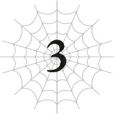

# Chương 3: Hành trình vượt Tầng Trung, bắt đầu!

*(Middle Stratum Play-Through, Start!)*

---

### --- TRANG 58 ---

Tôi đã đến được Tầng Trung rồi nè! Yê!

Hôm nay tôi sẽ bắt đầu thám hiểm nơi này! Yê!

Mặc dù tôi chưa hoàn thiện đòn tấn công tầm xa hay biện pháp chống nóng nào cả, nhưng tôi vẫn cứ đi thôi! Yê!

...Hự... Không đời nào tôi làm được chuyện này nếu không tự lên dây cót tinh thần cho bản thân.

Đã vài ngày trôi qua kể từ khi tôi lần đầu tiên phát hiện ra Tầng Trung.

Trong thời gian đó, tôi đã tích cực cày cuốc kỹ năng của mình và trở nên mạnh mẽ hơn hẳn.

Bảng trạng thái hiện tại của tôi trông như thế này đây.

`<Tiểu Taratect Độc LV 5 | Không tên>`

| Chỉ số | Giá trị |
| :--- | :--- |
| **HP** | 57/83 (lục) |
| **MP** | 181/181 (lam) |
| **SP (vàng)** | 51/82 `(tăng 2)` |
| **SP (đỏ)** | 82/82 `(tăng 2)` |
| **Sức tấn công trung bình** | 92 |
| **Sức phòng ngự trung bình** | 92 |
| **Sức ma pháp trung bình** | 135 |
| **Khả năng kháng tính trung bình** | 168 |
| **Tốc độ trung bình** | 830 `(tăng 1)` |

**Kỹ năng:**
[Tự hồi phục HP LV 5] [Tốc độ hồi phục MP LV 3] [Giảm tiêu hao MP LV 2] [Tốc độ hồi phục SP LV 2] [Giảm tiêu hao SP LV 3 `(tăng 1)`] [Tăng cường Hủy diệt LV 1] [Tăng cường Cắt LV 1] [Tăng cường Độc LV 1] [Tâm lý Chiến LV 1] [Truyền Năng lượng LV 2] [Tấn công Kịch độc LV 3] [Tổng hợp Độc LV 7] [Kỹ nghệ Tơ LV 3] [Tơ Nhện LV 9] [Tơ Cắt LV 6] [Điều khiển Tơ LV 8] [Ném LV 6] [Đánh trúng LV 7] [Né tránh LV 3] [Cơ động Không gian LV 3] [Ẩn mật LV 7] [Tập trung LV 9] [Dự đoán LV 8] [Tư duy Song song LV 4] [Xử lý Tính toán LV 6] [Thẩm định LV 8] [Phát hiện LV 6] [Ma pháp Dị giáo LV 3] [Ma pháp Bóng tối LV 2] [Ma pháp Độc LV 2] [Ma pháp Vực sâu LV 10] [Kháng Hủy diệt LV 1] [Kháng Tác động LV 2] [Kháng Cắt LV 3] [Kháng Lửa LV 1] [Kháng Bóng tối LV 1] [Kháng Kịch độc LV 2] [Kháng Tê liệt LV 3] [Kháng Hóa đá LV 3] [Kháng Axit LV 4] [Kháng Thối rữa LV 3] [Kháng Ngất LV 2] [Kháng Sợ hãi LV 7 `(tăng 1)`] [Kháng Ngoại đạo LV 3] [Vô hiệu Đau] [Giảm Đau LV 7] [Tăng cường Thị giác LV 8] [Dạ nhãn LV 10] [Mở rộng Tầm nhìn LV 2] [Tăng cường Thính giác LV 8] [Tăng cường Khứu giác LV 7] [Tăng cường Vị giác LV 4] [Tăng cường Xúc giác LV 6] [Sinh mệnh LV 7] [Ma lượng LV 8] [Bộc phát lực LV 8 `(tăng 1)`] [Bền bỉ LV 8 `(tăng 1)`] [Cự lực LV 3] [Vững chãi LV 3] [Bảo hộ LV 3] [Thần tốc LV 3] [Kiêu hãnh] [Phàm ăn LV 7] [Hades] [Cấm kỵ LV 4] [n% I = W]

**Điểm kỹ năng:** 180

### --- TRANG 59 ---

Trời ạ, tôi thực sự đã mạnh lên rất nhiều rồi.

Tôi cũng sở hữu thêm kha khá kỹ năng mới nữa.

Kể từ khi kỹ năng Thẩm định yêu quý của tôi bắt đầu hiển thị danh sách các kỹ năng chưa học được, tôi đã nhắm vào bất kỳ kỹ năng nào trông có vẻ ổn áp, rồi thực hiện các hành động liên quan đến kỹ năng đó để tích lũy độ thuần thục nhằm học được nó một cách tự nhiên.

Thế nên kho tàng kỹ năng của tôi giờ đã phong phú hơn nhiều, bao gồm cả vài kỹ năng mà tôi đã tăm tia từ lâu.

Dù tất cả những chuyện này có lẽ phần lớn là nhờ hiệu ứng bá đạo của Kiêu hãnh.

Tôi đã gom đủ bộ các kỹ năng liên quan đến MP và SP.

Cụ thể là Tốc độ Hồi phục và Giảm Tiêu hao.

### --- TRANG 60 ---

Tốc độ Hồi phục dĩ nhiên là đẩy nhanh tốc độ phục hồi tự nhiên, còn Giảm Tiêu hao giúp giảm bớt lượng năng lượng tiêu thụ.

Kỹ năng Giảm Tiêu hao SP xem ra cũng có tác dụng lên cả thể lực đỏ lẫn thể lực vàng luôn.

Cụ thể thì, tổng thanh thể lực đỏ của tôi đã khó bị sụt giảm hơn, còn thanh thể lực vàng thì tiêu hao ít hơn mỗi khi tôi chạy.

Tôi cũng tình cờ nhận được một kỹ năng mới gọi là Cơ động Không gian.

Tôi nghĩ là do tôi xây nhà ở sát trần hầm ngục, nên việc liên tục trèo lên bò xuống vách tường đã giúp tôi học được kỹ năng này.

Kết quả là bây giờ tôi đã có thể nhảy nhót loăng quăng các kiểu.

Cơ mà tôi cũng chẳng cần lắm, vì trước đó tôi vốn đã nhảy nhót như thế được rồi...

Chắc tôi sẽ giải thích các kỹ năng còn lại khi nào cần xài tới vậy.

Dù sao thì, các biểu tượng `tăng` nhỏ hình như là để chỉ các kỹ năng đã có sự thay đổi kể từ lần cuối tôi xem kết quả Thẩm định.

Lần này, Giảm Tiêu hao SP, Kháng Sợ hãi, Bộc phát lực, và Bền bỉ đều đã được cải thiện.

Bộc phát lực và Bền bỉ là phiên bản hệ SP tương tự như Sức mạnh vậy, với cái trước tác động lên SP vàng và cái sau tác động lên SP đỏ.

Có vẻ như các chỉ số tốc độ và SP của tôi cũng đã tăng lên luôn.

Trong vài ngày qua, tôi phát hiện ra rằng, cũng giống như kỹ năng, các chỉ số thực sự có thể gia tăng ngoài việc lên cấp nếu tôi tập trung rèn luyện chúng.

Tôi phát hiện ra điều này khi đang chạy vòng quanh để cày cấp cho kỹ năng Thần tốc, và nhận thấy chỉ số tốc độ của mình cũng tăng lên.

Tại sao trước đây khi bị lũ quái vật rượt đuổi trối chết thì chỉ số của tôi lại chẳng hề tăng lên tí nào nhỉ? Chắc là do lúc đó tôi chạy chưa đủ nhiều, hoặc là do tốc độ tăng trưởng của tôi đã được cường hóa nhờ có Kiêu hãnh.

Rất khó để nói đâu mới là lý do thực sự, nhưng có một điều chắc chắn là Kiêu hãnh đang hoạt động cực kỳ hiệu quả.

Vì tôi luôn bật Thẩm định mọi lúc mọi nơi, nên sự xuất hiện của ký tự `tăng` đồng nghĩa với việc kỹ năng hoặc chỉ số đó vừa mới tăng lên cách đây không lâu.

Ký tự này sẽ tự động biến mất một lúc sau khi tôi nhìn thấy, nghĩa là các kỹ năng và chỉ số tăng lên lần này chắc chắn là kết quả từ một hành động quyết định nào đó mà tôi vừa thực hiện.

Hắc hắc hắc. Thật đáng kinh ngạc khi các kỹ năng và chỉ số của tôi lại tăng vọt chỉ trong một lượt đúng không?

À thì, đúng thế thật.

### --- TRANG 61 ---

Bởi vì lúc đó tôi đang vắt chân lên cổ mà chạy. Chạy bán mạng đấy.

`<Địa Long Kagna Cấp 26 | Trạng thái: HP: 4.198/4.198 (lục) MP: 3.339/3.654 (lam) SP: 2.798/2.798 (vàng) : 2.995/3.112 (đỏ) | Thẩm định trạng thái thất bại>`

Là rồng đó.

So với con tôi thấy trước đây, Địa Long Alaba, con này trông có vẻ hơi thấp và mập mạp hơn một chút. Và rõ ràng, sức mạnh của nó cũng tỷ lệ thuận với vẻ ngoài đô con đó.

Đôi cánh của nó cũng khác hẳn với Alaba.

Gã này đột nhiên xuất hiện từ hư không.

Ngay khi tôi đang chuẩn bị đi săn như thường lệ, tổ ấm sau lưng tôi bỗng dưng bị thổi bay mất dạng.

Chỉ riêng dư chấn thôi cũng đủ để hất tôi ngã nhào, và rồi tôi bắt gặp hình bóng của con địa long ở rìa tầm nhìn của mình.

Sau đó, tôi cắm đầu cắm cổ chạy trốn với tốc độ bàn thờ, lao thẳng vào Tầng Trung, và đó chính là lý do thực sự khiến tôi đang ở đây vào lúc này.

Ha ha ha. Đúng thế, tôi đã chạy trốn trối chết để giữ cái mạng nhỏ của mình đấy.

Nhưng ít nhất thì sự tuyệt vọng đó cũng đủ để giúp tôi tăng cấp kỹ năng và chỉ số!

Mà tức thật chứ, tại sao lũ rồng cứ hễ nhìn thấy mạng nhện của tôi là lại phá hủy ngay lập tức thế hả?

Đáng sợ quá đi mất.

Hay là Tầng Dưới thực chất chính là hang ổ của địa long bấy lâu nay mà tôi không hề hay biết?

Thế thì lại càng đáng sợ hơn nữa.

Không, không, không đời nào. Làm sao mà lại có nhiều sinh vật kinh khủng như thế lảng vảng quanh đây được.

Bây giờ tôi mới nhớ lại cái nhìn thoáng qua từ kết quả Thẩm định trạng thái của con quái vật đó.

Toàn là những con số có bốn chữ số. Thật là phi lý quá sức tưởng tượng. Tôi không cách nào thắng nổi thứ đó được.

Đã vậy, ngay cả sau khi tung ra đòn tấn công cực mạnh thổi bay cả căn nhà của tôi, lượng MP và SP của nó cũng chỉ giảm đi một chút xíu không đáng kể.

Trong trường hợp đó, nó hoàn toàn có thể spam đòn tấn công đó liên tục nếu muốn.

### --- TRANG 62 ---

Tôi chịu thua rồi. Đúng là một con quái vật kinh hoàng. Địa long đáng sợ thật đấy.

Dẫu vậy, con này vẫn có điểm khác biệt so với con Địa Long Alaba mà tôi thấy trước đây.

Dù cấp độ của con này thấp hơn, nhưng lúc trước tôi không thể Thẩm định được Alaba, nên cũng chẳng biết con nào mạnh hơn nữa.

Nhưng bất kể thế nào thì tôi cũng chẳng có cửa thắng khi đối đầu với cả hai con, nên nghĩ nhiều cũng vô ích.

Tôi tự hỏi liệu có mối liên hệ nào giữa hai con không, khi chúng đều được gọi là địa long?

Có lẽ ban đầu chúng thuộc cùng một chủng tộc rồi tiến hóa theo các nhánh khác nhau chăng?

Ồ, rất có thể là thế đấy.

Rồng vốn là định nghĩa của một chủng tộc thượng đẳng mà, nên việc chúng sở hữu nhiều lựa chọn tiến hóa đa dạng cũng không có gì đáng ngạc nhiên.

Hoặc giả, có khi mỗi con địa long lại là một chủng tộc độc nhất vô nhị? Cũng có khả năng lắm chứ.

Kiểu như vì thuộc hàng tinh anh nên số lượng của chúng cực kỳ ít ỏi, nhưng mỗi cá thể đều mạnh mẽ đến mức điên rồ? Kiểu kiểu thế đó.

Ý tôi là, từ "mạnh mẽ đến mức điên rồ" thậm chí còn chưa đủ để lột tả sức mạnh của tụi nó.

Nếu đúng là vậy thì ít nhất khả năng tôi chạm trán thêm các con khác sẽ cực kỳ thấp...

Ủa, khoan đã.

Thế thì có nghĩa là tôi đã bị tấn công hai lần bởi những sinh vật mà lẽ ra cơ hội gặp được là siêu nhỏ sao?

Như vậy chẳng phải đồng nghĩa với việc tôi có số đen như nhọ nồi à?

Ch... ch-ch-ch-chuyện đó không thể nào là thật được, đ-đ-đ-đúng không...?

Tôi đã trải qua vô số tình huống cận kề cái chết, nhưng cuối cùng tôi vẫn sống sót, nên có lẽ tôi là người may mắn đấy chứ.

Nhưng chờ chút. Nếu là người may mắn thì ngay từ đầu đã chẳng phải liên tục đùa giỡn với tử thần nhiều lần như thế rồi đúng không?

Hửm?

...Thôi bỏ đi. Tôi không nên nghĩ ngợi về chuyện này nữa.

Thật lòng mà nói, lần này tôi thoát chết trong gang tấc là nhờ may mắn đã chuẩn bị rời đi từ trước rồi.

Cái vận đen này vẫn chưa hoàn toàn buông tha cho tôi đâu.

Ừ, cứ coi là vậy đi.

### --- TRANG 63 ---

Làm ơn đi, ai đó hãy nói là tôi đoán đúng rồi đi.

`<Độ thuần thục đã đạt mức yêu cầu. Kỹ năng [Dự đoán LV 8] đã trở thành [Dự đoán LV 9].>`

Này, tôi có hỏi cưng đâu hả!!

Cái căn thời gian chuẩn không cần chỉnh này là sao vậy hả?!

Bộ cưng đang rình rập chờ thời cơ nhảy vào họng tôi nói đấy à?!

Cưng nghĩ mình là diễn viên hài hay gì thế, Giọng nói của Thần (tạm gọi)?!

Phù. Được rồi, tôi hơi nóng nảy vô cớ một chút.

Phải rồi. Tôi sẽ ngó lơ cái sự khởi đầu xui xẻo đầy điềm gở này và bắt đầu từ từ thám hiểm Tầng Trung.

Tôi nhất định phải tạo khoảng cách xa nhất có thể với con địa long kia.

Dù sao thì, cùng kiểm tra tình hình hiện tại xem sao.

Hai bên đường đi của tôi đang được bao quanh bởi dung nham sôi sùng sục. Tỷ lệ đất cứng và dung nham gần như tương đương nhau.

Nãy giờ tôi chỉ cắm đầu chạy trong hoảng loạn thôi. Không biết mình có đang đi đúng hướng không nữa?

À thì, cũng chẳng có cách nào để biết, nên tôi cứ tiếp tục tiến bước như thế này vậy.

Do chịu ảnh hưởng từ dư chấn đòn tấn công của địa long cộng với việc chạy vượt quá giới hạn chịu đựng của bản thân, HP của tôi đã bị sụt giảm một chút.

Không nhiều lắm, nhưng vì hơi nóng xung quanh đây liên tục gây ra lượng sát thương đủ để triệt tiêu hiệu quả hồi máu của Tự hồi phục HP, tôi không nghĩ mình có thể sớm phục hồi đầy máu được.

Ít nhất thì tôi cũng đã học được Kháng Lửa nhờ việc chạy qua chạy lại giữa Tầng Trung và Tầng Dưới, cơ mà nó mới chỉ ở cấp 1.

Hiện tại, với Kháng Lửa cấp 1 và Tự hồi phục HP cấp 5, lượng máu của tôi vừa vặn cân bằng với lượng sát thương mất đi do sức nóng.

Điều này tuy tuyệt vời, nhưng cũng đồng nghĩa với việc nếu tôi chịu thêm bất kỳ vết thương nào khác, sẽ rất khó để tôi tự chữa lành cho mình.

Lựa chọn duy nhất của tôi là hồi phục hoàn toàn bằng cách lên cấp, hoặc nâng cấp một trong hai kỹ năng đó để lượng hồi phục vượt qua lượng sát thương nhận vào từ môi trường.

### --- TRANG 64 ---

Nhưng vì dung nham đang ở sát sạt như thế này, cũng có khả năng đáng sợ là sát thương từ nhiệt độ sẽ tăng lên và áp đảo hoàn toàn.

Tôi rất muốn tránh những nơi nóng bức như thế này nếu có thể, nhưng biết làm sao được bây giờ?

Nhìn vào những tầng tôi từng đi qua, tốt nhất nên giả định rằng Tầng Trung cũng cực kỳ khổng lồ.

Dù sao thì đây cũng là mê cung lớn nhất thế giới mà.

It kết nối cả hai lục địa với nhau cơ mà, nên có khi phải mất nhiều ngày trời tôi mới băng qua được Tầng Trung.

Một chặng đường dài đang chờ đón tôi phía trước, vậy mà tôi lại bị ép phải bắt đầu hành trình này trong vội vã. Quả là điềm chẳng lành mà.

Thôi thì, cứ tiếp tục đi tiếp vậy.

Phù. Nhưng mà nóng thật sự đấy.

Kể từ khi đầu thai thành nhện, tôi đã luôn được sống trong môi trường có nhiệt độ khá dễ chịu. Chưa bao giờ quá nóng hay quá lạnh luôn ấy.

Việc môi trường đột ngột thay đổi thế này đúng là một cú sốc lớn.

Tuy không đến mức không chịu nổi nhờ có công luyện tập chạy qua chạy lại để lấy kỹ năng Kháng Lửa trước đó, nhưng mà...

Tôi thậm chí còn không dám nghĩ đến việc cả cái Tầng Trung này đều nóng bức thế này. Ôi trời.

Đặc biệt là cho đôi chân tội nghiệp của tôi.

Ý tôi là, dung nham đang chảy ngay kế bên kìa!

Tất nhiên là mặt đất phải nóng bỏng chân rồi.

Mấy cái mặt đường nhựa bị nung nóng bởi mặt trời mùa hè tuổi gì mà so sánh được.

Đừng nói là rán trứng trên đất, ở cái nơi này, quả trứng sẽ bốc cháy ngay lập tức luôn ấy chứ.

Mà tôi lại đang đi chân trần trên cái nền đất này nữa!

Nóng đến mức đau đớn vô cùng.

Nếu không có Giảm Đau và Tự hồi phục HP thì chắc tôi chịu không thấu mất.

Ồ, kìa, một con quái vật.

`<Gunerush Elroe Cấp 5 | Trạng thái: HP: 159/159 (lục) MP: 145/148 (lam) SP: 145/145 (vàng) : 116/145 (đỏ) | Sức tấn công trung bình: 83 Sức phòng ngự trung bình: 81 Sức ma pháp trung bình: 79 Khá năng kháng tính trung bình: 77 Tốc độ trung bình: 88 | Thẩm định trạng thái thất bại>`

### --- TRANG 65 ---

Hắc hắc hắc. Giờ kỹ năng Thẩm định đã tăng cấp cao hơn, tôi thậm chí còn xem được cả sức tấn công của kẻ thù nữa kìa!

Aaa, tuyệt cú mèo luôn!

Dù tỷ lệ thành công vẫn chưa cao lắm...

Con quái vật kia cùng loại với con tôi thấy khi mới đặt chân tới Tầng Trung.

Cái con trông giống cá ngựa ấy.

Y hệt con tôi gặp ngày đầu tiên, con mồi của tôi đang bơi lội tung tăng trong dòng dung nham. Thật không thể tin nổi.

Trông nó có vẻ chưa phát hiện ra tôi, nên tôi cũng hơi muốn ngó lơ nó đi tiếp, cơ mà tôi bắt buộc phải đi ngang qua chỗ nó.

Nên làm gì đây ta? Hửm...

Ồ. Trong lúc tôi còn đang mải suy nghĩ đắn đo, xem ra nó đã phát hiện ra tôi rồi.

Lại giống lần trước, một quả cầu lửa phóng ra từ dòng dung nham.

A lê hấp! Tôi né được rồi.

Hừm. Thứ tốc độ rùa bò đó không đời nào bắn trúng tôi được.

Nhớ hồi xưa tôi còn chẳng né nổi đòn phun nước bọt của lũ ếch kia, nhưng giờ tôi đã mạnh mẽ hơn xưa rất nhiều rồi — tốc độ của tôi cao hơn hẳn, lại có thêm kỹ năng Né tránh các thứ.

Bây giờ tôi sở hữu sự nhanh nhẹn thần thánh khiến bất kỳ nhân vật game nào cũng phải ghen tị!

Kể cả khi chỉ trúng một đòn duy nhất cũng đủ biến tôi thành tro bụi do chỉ số phòng ngự mỏng như giấy, cơ mà chuyện đó cũng chẳng sao miễn là tôi không bị bắn trúng!

Nhưng dẫu thế...

Cứ đà này thì chẳng bên nào chiếm được thế thượng phong cả.

Ý tôi là, mấy quả cầu lửa đó không bắn trúng tôi được.

But vì tôi không thể sử dụng tơ nhện ở đây, tôi cũng chẳng có cách nào để tấn công nó.

Kết quả là rơi vào thế bế tắc.

Ủa, khoan đã. Tên kia sắp cạn MP rồi kìa. Xem ra mấy quả cầu lửa đó tiêu tốn khá nhiều ma lực.

Nên một khi MP cạn sạch, nó sẽ không thể bắn thêm quả cầu lửa nào nữa.

Kỹ năng Thẩm định đúng là như hack game vậy. Ý tôi là, tôi biết tuốt thông tin của đối thủ ngay trong lúc chiến đấu luôn.

### --- TRANG 66 ---

Được rồi, né được quả cầu lửa cuối cùng rồi. Vậy là nó đã hết sạch MP.

Động thái tiếp theo của con cá ngựa sẽ quyết định cục diện trận chiến, nhưng nó sẽ làm gì đây?

Ồ, nó bò ra khỏi dung nham kìa.

Và đang lao thẳng về phía tôi.

Đúng là đồ ngốc. Nếu là tôi mà hết MP thì tôi đã lập tức thực hiện rút lui chiến thuật ngay và luôn rồi.

Dưới góc nhìn của tôi, cú lao tới của nó chậậậm rì, nên tôi dễ dàng luồn lách né tránh.

Rồi tôi bám chặt lấy lưng con cá ngựa, đâm móng vuốt tẩm độc vào người nó.

Nhắc mới nhớ, cơ thể con này nóng điên cuồng luôn! HP của tôi thậm chí đã bị sụt giảm một chút! HP quý giá của tôi!

Dù sao thì, độc tố kịch độc đã kết liễu con cá ngựa trong nháy mắt.

Phù. Tôi đã thắng trận đấu đầu tiên thành công mỹ mãn.

Các quả cầu lửa vút qua bên cạnh tôi, vẽ nên những đường vòng cung trên không trung.

Hai quả cùng lúc luôn. Nhưng kể cả vậy, việc né tránh chúng vẫn cực kỳ đơn giản.

Liếc nhìn về phía trước, tôi thấy hai con cá ngựa.

Có vẻ như cái chỗ này đầy rẫy lũ tụi nó.

Chúng không tụ tập thành bầy — chỉ lảng vảng riêng lẻ làm theo ý thích của mình. Dẫu vậy, thỉnh thoảng chúng lại vô tình ở gần nhau và cùng tấn công tôi một lúc.

À thì, miễn là chúng không kéo cả đàn xông vào hội đồng tôi như lũ khỉ kia thì chẳng có vấn đề gì cả.

Tôi né thêm một cặp cầu lửa đang bay tới.

Chúng phối hợp không ăn ý cho lắm, chắc là vì bình thường tụi này toàn đi lẻ. Cứ như thể chúng chỉ đang bắn cầu lửa một cách ngẫu nhiên vậy.

Nếu không thì đây chắc chắn sẽ là một trận chiến cam go rồi.

Tất cả những gì tôi phải làm là tránh bị bắn trúng, cơ mà nói đi cũng phải nói lại, nếu tôi mà trúng đòn...

Tôi cực kỳ yếu với lửa, nên nếu dính phải một đòn đó, tôi nghi là mình không chỉ bị trầy da tróc vảy thông thường đâu.

Chưa kể, việc luồn lách né tránh đống đạn pháo đó tuy đơn giản, nhưng tôi lại đang thực hiện ngay giữa một bãi dung nham.

Nếu lỡ chân ngã xuống đó, tôi chắc chắn cơ thể mình thậm chí còn chẳng kịp bốc cháy nữa. Nó sẽ

### --- TRANG 67 ---

tan chảy ngay lập tức.

Thế nên ngay cả khi né tránh các quả cầu lửa, tôi vẫn phải quan sát kỹ lưỡng nền đất dưới chân mình.

Cảm giác cứ như tôi đang chơi game né đạn (bullet hell) mà chỉ còn lại đúng một giọt máu duy nhất vậy.

Ngoại trừ việc đây chính là mạng sống thật sự của tôi.

Thật là ức chế khi hiện tại tôi chẳng có cách nào để đánh trả cả.

Cứ hễ tôi tạo ra tơ nhện là nó lại bốc cháy và biến mất ngay lập tức, nhất là khi tôi đang đứng sát dòng dung nham thế này.

Cho nên trong khi chúng có thể thoải mái tấn công tôi bao nhiêu tùy thích, tất cả những gì tôi làm được chỉ là né tránh.

Đúng nghĩa là làm bia tập bắn cho tụi nó.

Nhưng chuyện đó chỉ kéo dài cho đến khi chúng cạn MP thôi.

Một khi điều đó xảy ra, lũ cá ngựa sẽ tự mò lên bờ.

Đúng thế. Chúng quyết định từ bỏ lợi thế địa hình tuyệt đối và tự nguyện bước xuống ngang hàng với tôi.

Thật là những quý ông lịch thiệp. Đúng là lũ ngốc. Lũ đầu đất.

Ngay lúc này, con cá ngựa đầu tiên đã hết MP và đang lững thững tiến về phía tôi.

Tôi vội vàng tẩm độc vào móng vuốt và kết liễu nó nhanh gọn.

Cũng nhờ tôi học được các kỹ năng mới là Tăng cường Hủy diệt và Tăng cường Cắt trong công cuộc tìm kiếm tri thức trước đó.

Tăng cường Hủy diệt, đúng như tên gọi, giúp gia tăng sức hủy diệt của tôi. Định nghĩa có vẻ hơi mơ hồ, nhưng tôi giả định rằng đây là kỹ năng giúp tăng lực tấn công nói chung.

Tăng cường Cắt cũng tương tự như vậy, chỉ là giới hạn ở các đòn tấn công dạng chém.

Con cá ngựa thứ hai bò lên khỏi dung nham vào thời điểm cực kỳ hoàn hảo, thế nên tôi kết liễu nó bằng phương thức y hệt.

`<Kinh nghiệm đã đạt mức yêu cầu. Cá thể Tiểu Taratect Độc đã tăng từ LV 5 lên LV 6.>`

`<Tất cả các chỉ số cơ bản đều tăng.>`

`<Nhận được điểm thưởng độ thuần thục kỹ năng do lên cấp.>`

`<Độ thuần thục đã đạt mức yêu cầu. Kỹ năng [Tăng cường Độc LV 2] đã trở thành [Tăng cường Độc LV 3].>`

`<Độ thuần thục đã đạt mức yêu cầu. Kỹ năng [Né tránh LV 3] đã trở thành [Né tránh LV 4].>`

### --- TRANG 68 ---

`<Đã nhận được điểm kỹ năng.>`

Ồ! Tôi lên cấp rồi này!

Tôi thực sự cực kỳ biết ơn chuyện này luôn, vì HP của tôi đang hơi thấp. Sau khi hoàn thành quá trình lột xác, HP của tôi đã được phục hồi hoàn toàn.

Tôi có thể hạ gục lũ cá ngựa đó khá dễ dàng, cơ mà cứ hễ chạm vào cơ thể tụi nó là tôi lại bị mất máu.

Nếu chỉ đối đầu với một hai con thì không sao, nhưng sau khi chiến đấu với cả bầy, lượng sát thương tích tụ bắt đầu tăng lên mức nguy hiểm.

Vì lên cấp là cách hồi máu duy nhất của tôi vào lúc này, nên tôi không muốn phải chịu thêm bất kỳ vết thương nào khác, dù là nhỏ nhất.

Nhân tiện, cơ thể chúng sẽ nguội đi sau một lúc, nên tôi thường đợi chuyện đó xảy ra rồi mới ăn thịt chúng.

Giá như Kháng Lửa hoặc Tự hồi phục HP của tôi tăng cấp cùng với đợt lên cấp vừa rồi thì tốt biết mấy, nhưng dĩ nhiên đời không như là mơ.

Kháng Lửa vẫn ở cấp 1, và Tự hồi phục HP cũng chẳng có tiến triển gì.

Mà thôi, việc Kháng Lửa không tăng cấp cũng chẳng có gì lạ. Có vẻ chủng tộc của tôi vốn dĩ cực kỳ yếu với lửa, nên không đời nào tôi khắc phục được điểm yếu đó chỉ trong một ngày được.

Còn Tự hồi phục HP là một kỹ năng siêu tiện lợi, nên dĩ nhiên là tốn rất nhiều thời gian để tăng cấp rồi.

Ý tôi là, khả năng tự động hồi phục vốn dĩ là thứ mà bạn thường chỉ có được ở giai đoạn cuối game thôi.

Tôi đã may mắn có được nó mà không phải tiêu tốn điểm kỹ năng nào. Chắc là đòi hỏi nó tăng cấp nhanh vào lúc này là hơi quá tham lam rồi.

Tôi phải tự nhắc nhở bản thân rằng việc sở hữu nó đã là một hồng ân trời ban rồi.

Trên thực tế, nếu không có Tự hồi phục HP, tôi thậm chí còn chẳng dám nghĩ đến chuyện đi qua Tầng Trung.

Ý tôi là, làm sao mà đi nổi chứ?

Bước vào một khu vực liên tục bị mất máu mà không có kỹ năng tự hồi phục thì khác nào đi tự sát đâu chứ.

Tôi thì không muốn tự sát chút nào, nên nếu thiếu đi Tự hồi phục HP, có lẽ giờ này tôi vẫn đang lảng vảng ở Tầng Dưới để tìm kiếm một con đường thông thẳng đứng khác để leo lên.

### --- TRANG 69 ---

Ở Tầng Dưới cùng với lũ rồng kia á? Khôôông đời nào. Tôi sẽ bay màu trong nháy mắt mất.

Thực ra tôi đang tiến bước khá thuận lợi trong công cuộc chinh phục Tầng Trung.

Ngoài lũ cá ngựa kia ra, tôi cũng đụng độ vài chủng loại quái vật khác, cơ mà con nào cũng bình thường cả.

Nếu tôi không bị bất lợi về địa hình ở đây, tôi có thể hạ gục tất cả bọn chúng một cách dễ dàng.

Tuy nhiên, cái điểm bất lợi ở đây lại cực kỳ phiền phức.

Đầu tiên là dung nham. Đúng là phiền phức quá đi mà.

Nếu đối đầu với một con quái vật đang ngâm mình dưới dung nham, tất cả những gì tôi có thể làm là ném đá.

Vì tôi có kỹ năng Ném, tôi đã nghĩ đến việc thử bắt chước lũ khỉ kia, cơ mà sát thương gây ra chẳng thấm tháp vào đâu cả.

Rốt cuộc, trừ phi kẻ địch tự mò lên bờ, bằng không tôi hoàn toàn bất lực.

Sẽ thật tốt nếu con quái vật nào cũng hành xử như lũ cá ngựa và bò lên bờ ngay khi hết MP, nhưng có vài con cứ ngoan cố ở lỳ dưới dung nham hoặc bỏ chạy mất dạng.

Tệ nhất là những con ban đầu đứng trên đất cứng, nhưng khi bị tôi dồn vào chân tường thì lại nhảy tọt xuống dung nham.

Và việc không thể sử dụng tơ nhện cũng khiến tôi khá là ức chế.

Chuyện này xảy ra ngay sau khi tôi vừa nhận được kỹ năng Kỹ nghệ Tơ giúp tăng cường sức mạnh cho các chiêu thức liên quan đến tơ nữa chứ...

Ít nhất tôi cũng có thể dùng tơ nhặt đá rồi ném đi, cơ mà nếu để tơ ở ngoài quá lâu, nó sẽ bốc cháy ngay cả trên những mảng đất tương đối an toàn.

Vấn đề thực sự nằm ở những sợi tơ mà tôi thường vô thức tạo ra.

Mỗi khi di chuyển, tôi tự động nhả tơ sau mông, nhưng ở Tầng Trung này thì nó sẽ lập tức bắt lửa.

Sợi tơ đang cháy hoạt động y như một ngòi nổ chậm, cho đến khi phần mông của tôi bắt đầu nóng rát.

Lần đầu tiên bị như thế tôi đã hoảng hồn thực sự. Đúng nghĩa đen là có một ngọn lửa đang đốt dưới đít tôi luôn.

HP của tôi đã bị sụt giảm kha khá điểm vì vụ đó, và việc dùng Tổng hợp Độc để dập lửa lại càng khiến HP của tôi tụt sâu hơn.

Ý tôi là, đó là cách duy nhất tôi nghĩ ra được để dập tắt ngọn lửa lúc đó.

Cuối cùng, lựa chọn duy nhất của tôi là phải liên tục cắt đứt sợi tơ ngay khi vừa nhả ra.

Tôi bắt buộc phải làm thế, nếu không thì sẽ gặp họa sát sườn theo đúng nghĩa đen luôn.

### --- TRANG 70 ---

Chỗ ngủ cũng là một vấn đề nan giải.

Nếu tôi thử giăng lưới ở đây, nó chắc chắn sẽ bốc cháy và thiêu rụi tôi cùng với nó.

Thế nên tôi quyết định ngủ tạm bợ dưới bóng râm của vài tảng đá.

Mà nói thế chứ tôi đâu có thực sự ngủ được.

Ở cái nơi địa ngục trần gian này, nơi tôi luôn bị mất máu thụ động và phải liên tục cảnh giác cao độ trước quái vật.

Tôi tuy gan dạ thật đấy, cơ mà cái gì cũng có giới hạn của nó thôi.

Dẫu vậy, tôi vẫn phải ngủ.

Như mọi người có thể hình dung, tôi không ngủ thường xuyên cho lắm, nhưng tôi luôn cố gắng nghỉ ngơi bất cứ khi nào tìm được một chỗ ẩn nấp thích hợp.

Tuy nhiên, mặc dù khu vực này tệ hơn Tầng Dưới về nhiều mặt, điểm sáng duy nhất là lũ quái vật ở đây yếu hơn nhiều.

Xét về mức độ đe dọa, chúng không khác biệt mấy so với lũ quái vật ở Tầng Trên.

Chắc là cũng có vài con tương đối mạnh ở đây, như lũ rắn sống ở tầng trên chẳng hạn, cơ mà cho đến nay, những sinh vật tôi chạm trán đều không có gì đáng ngại.

Sự khác biệt lớn nhất giữa mối đe dọa ở đây và Tầng Trên là cách chúng tận dụng môi trường xung quanh.

Điều đó khiến những con quái vật vốn dĩ yếu đuối này trở nên nguy hiểm.

Vì tôi không có nhiều phương án hồi phục, chỉ cần bị đòn tấn công sượt qua thôi cũng đủ khiến tôi gặp rắc rối lớn.

Vả lại, cho đến nay mọi thứ vẫn nằm trong tầm kiểm soát vì chúng quá yếu ớt, nhưng vẫn có khả năng xuất hiện những con quái vật tầm cỡ Tầng Dưới ở đây.

Chỉ riêng địa hình thôi đã là thử thách cực đại đối với tôi rồi, nên nếu loại đối thủ như thế xuất hiện...

Ồ thì, tôi chỉ biết cầu mong là không có con nào thôi.

Trời ạ, giá như tôi có thể sử dụng ma pháp, tình thế chắc chắn sẽ đảo ngược hoàn toàn.

But để xài được ma pháp, tôi phải chế ngự được Phát hiện, thứ có khi còn là một đối thủ đáng gờm hơn cả cái địa hình quái quỷ này.

Dù sao thì, tôi không nghĩ mình có thể giải quyết được bất kỳ vấn đề nào trong hai cái đó một sớm một chiều đâu.

Ááá, tôi thực sự muốn dùng ma pháp quá đi mất!
