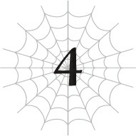
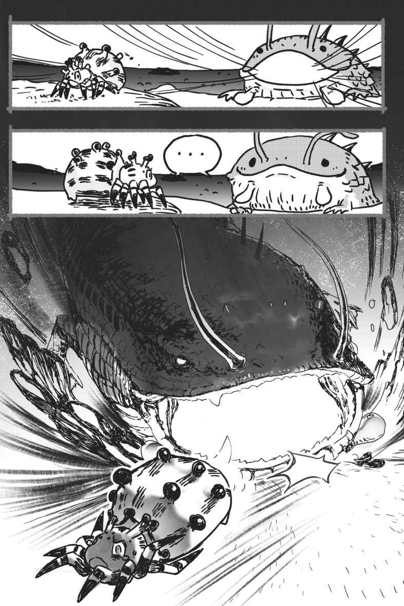
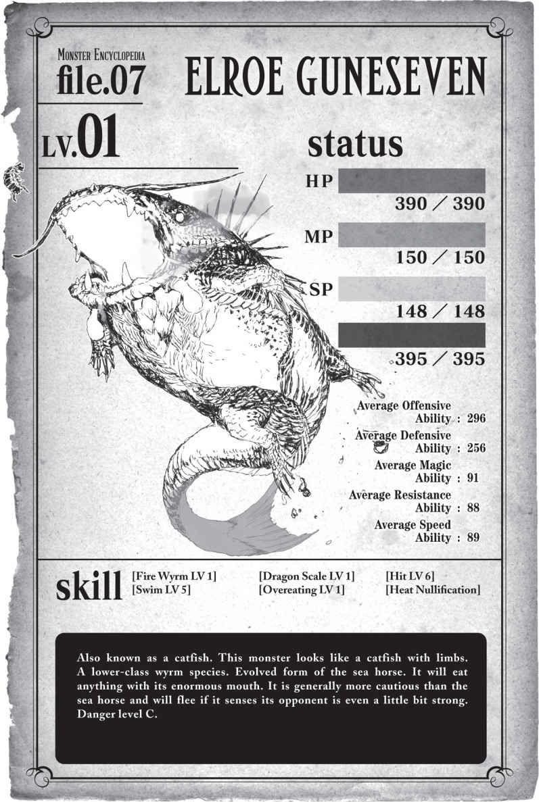

# Chương 4: Phi long? Không phải cá sao?

*(Wyrm? Not Fish?)*

---

### --- TRANG 80 ---

Ôi trời, tôi biết ngay là mình có linh cảm chẳng lành mà.

Bởi vì có vẻ như mấy con cá ngựa đó thực chất lại là phi long (wyrm).

`<Phi long: Một chủng loại quái vật được cho là phân loài cấp thấp của loài rồng. Bất chấp định nghĩa đó, một số loài phi long vẫn sở hữu sức mạnh ngang ngửa với rồng thực thụ.>`

Đúng thế thật. Nó là một phiên bản cấp thấp của chủng tộc địa long kia.

Vậy thì chắc con này là một kiểu hỏa phi long nhỉ?

Ý tôi là, nếu địa long có tồn tại, thì hỏa long cũng phải có chứ...

Hy vọng là không có con hỏa long nào lảng vảng ở Tầng Trung này.

Cầu mong là vậy.

Thôi, tôi lại hơi lạc đề rồi. Giờ là lúc phải nghiêm túc tập trung giải quyết rắc rối ngay trước mắt này đã.

| Chỉ số | Giá trị |
| --- | --- |
| **Chủng tộc** | Guneseven Elroe LV 7 |
| **HP** | 461/461 (Xanh lá) |
| **MP** | 223/223 (Xanh dương) |
| **SP (Vàng)** | 218/218 |
| **SP (Đỏ)** | 451/466 |
| **Sức tấn công trung bình** | 368 |
| **Sức phòng ngự trung bình** | 311 |
| **Sức ma pháp trung bình** | 161 |
| **Kháng tính trung bình** | 158 |
| **Tốc độ trung bình** | 155 |
| **Thẩm định Trạng thái** | Thất bại |

`<Guneseven Elroe: Một loài quái vật dạng phi long cấp thấp sinh sống ở Mê cung Lớn Elroe, Tầng Trung. Là sinh vật ăn tạp, cái miệng khổng lồ của nó có thể nuốt chửng mọi thứ.>`

Đó chính là con quái vật đang bơi lội chậm rãi trong dòng dung nham lúc này.

Đối với một con phi long cấp thấp, hình dáng của nó trông chẳng khác gì một con cá trê khổng lồ.

### --- TRANG 81 ---

Cái tên "seven" (số bảy) nghe cũng chẳng ăn nhập gì với nó cả.

Mà thôi, có phàn nàn về hệ thống đặt tên của thế giới này thì cũng chẳng giải quyết được gì.

Cái miệng khổng lồ như cá trê kia chắc chắn là đặc điểm nổi bật nhất của nó.

Nếu bị cái miệng đó ngoạm phải thì... eo ôi. Với kích thước hiện tại của tôi, nó chắc chắn sẽ nuốt chửng tôi trong một nốt nhạc.

Nhưng mà thật may là Thẩm định trạng thái đã thành công.

Xác suất thành công bình thường chỉ khoảng một phần ba thôi.

Nên lần này tôi thực sự may mắn đấy.

Sẽ cực kỳ nguy hiểm nếu cố vượt qua thứ này mà không biết rõ các chỉ số chính xác của nó.

Tất cả quái vật ở Tầng Trung tôi từng gặp từ trước đến nay đều khá yếu, nhưng con này chắc chắn là con mạnh nhất cho đến thời điểm hiện tại.

Nếu có thể, tôi chỉ muốn ngó lơ nó rồi đi tiếp.

Nhưng nó cứ bơi lảng vảng ngay sát lối đi của tôi.

Dựa vào kinh nghiệm xương máu từ trước đến nay, khả năng cao là nó sẽ tấn công tôi.

Hửm. Nên làm gì đây ta...?

Ý tôi là, nếu tôi cố bỏ chạy, tôi khá tự tin là mình có thể bỏ xa nó nhờ chỉ số tốc độ vượt trội, nhưng sẽ rất phiền phức nếu bị thứ đó đuổi theo dai dẳng với thanh thể lực đỏ dài ngoằng điên rồ kia.

Và ngay cả khi thanh thể lực vàng của nó nhỏ hơn, nó vẫn gấp mấy lần của tôi.

Quan trọng nhất là tôi không thể nhìn thấy kỹ năng của nó.

Nếu con cá trê đó sở hữu kỹ năng Giảm tiêu hao SP cấp cao hay gì đó tương tự, tôi có khi chẳng thể chạy thoát nổi nó đâu.

Tôi không nghĩ là thế, nhưng mà vẫn nên cẩn thận...

Nó có vẻ hơi mạnh để tôi có thể trực diện đối đầu.

Vậy cuối cùng tôi có nên chạy trốn không?

Phải rồi. Tôi không muốn liều mạng vô ích.

Dạo gần đây mọi chuyện diễn ra khá suôn sẻ, nhưng mỗi lần tôi bắt đầu tự mãn là y như rằng kết cục lại cực kỳ thê thảm.

Thấy chưa, tôi cũng đã khôn ra rồi đấy chứ. Tôi biết tự lượng sức mình hơn rồi.

Tôi phải tiến bước với sự cẩn trọng tối đa!

Thế nên, tôi sẽ bắt đầu di chuyển thật chậậậm...

### --- TRANG 82 ---

Nếu nó phát hiện ra tôi, tôi sẽ lập tức co giò chạy với tốc độ tối đa.

Ủa... khoan đã. Một con cá trê khác vừa nhô lên từ dòng dung nham gần đó.

Ủa?

Cái gì cơ?! Chuyện này đâu có nằm trong kế hoạch!

Lần này tôi đâu có tự mãn đâu, thế mà vẫn gặp rắc rối là sao?!

Con cá trê khóa chặt tầm mắt vào tôi. Sau khi đờ đẫn nhìn một lúc, nó mở cái miệng khổng lồ ra.

Nhảy lùi!

Cái miệng khổng lồ của con cá trê táp mạnh vào ngay vị trí tôi vừa đứng vài giây trước.

Nó tiếp tục tiến lên, bò trườn lên cạn.

Cái con quỷ này có chân. Lúc nó ở dưới dung nham tôi không để ý thấy.

Không chỉ thế, toàn thân nó còn được bao phủ bởi lớp vảy cứng như vảy rồng.

Nhìn bề ngoài thì có vẻ nó được bảo vệ cực kỳ kiên cố.

Phải rồi. Chạy thôi.

Geh?!

Khi tôi quay đầu về hướng đường lui mà tôi đã vạch sẵn từ trước, tôi thấy con cá trê còn lại cũng đang bò lên cạn.

Khoan đã, giờ tôi bị kẹp sườn từ cả hai phía rồi! Chạy đường nào bây giờ?!

Làm gì bây giờ?!

Ôi trời đất ơi, lựa chọn duy nhất của tôi là tiên hạ thủ vi cường với con trước mặt thôi!

Tôi quấn tơ độc quanh cơ thể con cá trê.

Trong quá trình luyện tập trước đó, tôi đã xác nhận rằng Tấn công Độc cho phép tôi truyền thuộc tính độc vào tơ của mình.

Dù ở đây nó cũng chẳng giúp ích được mấy, vì tơ sẽ bốc cháy ngay lập tức!

Nhưng dù vậy, hy vọng là quá trình đó vẫn kịp truyền chút độc tố lên người gã này!

Tất nhiên, sợi tơ bắt lửa ngay lập tức.

Tôi kiểm tra HP của con cá trê xem chất độc có tác dụng gì không.

Có tác dụng rồi! HP của nó đã giảm đi một chút.

Trong trường hợp đó, tôi chỉ cần đầu độc nó một cách tử tế là được.

Con cá trê há to miệng.

Và lao thẳng về phía tôi.

Khônggg! Đáng sợ quá đi mất!

Nhưng tôi phải cắn răng chịu đựng đến giây phút cuối cùng!

Ngay khi nó chuẩn bị nuốt chửng tôi, tôi lập tức kích hoạt Tổng hợp Độc!

Rồi né tránh vào phút chót!

### --- TRANG 83 ---

Thay vì nuốt chửng tôi, con cá trê hứng trọn một họng đầy Độc Nhện vừa được tổng hợp.

Kỹ năng Tấn công Độc của tôi đã đạt cấp 10 trong quá trình luyện tập và tiến hóa thành phiên bản cao cấp: Tấn công Kịch độc.

Thế nên Độc Nhện của tôi, thứ vốn đã đủ mạnh để hạ gục cả một bầy khỉ khổng lồ, nay đã tiến hóa thành Kịch Độc Nhện.

Ngay khoảnh khắc con cá trê nuốt phải thứ hỗn hợp độc hại đó, HP của nó bắt đầu tụt dốc không phanh.

Nhanh như chớp luôn ấy.

Kết quả là con cá trê quằn quại đau đớn dữ dội trên mặt đất.

Oa, tôi không ngờ chất độc của mình lại trở nên đáng sợ đến mức này...

Tôi biết là nó sẽ mạnh, nhưng thế này thì chính bản thân tôi cũng thấy rùng mình nữa là.

Được rồi, còn con kia thì sao?

Quay đầu lại nhìn, tôi thấy con cá trê còn lại đang hơi chùn bước sợ hãi trước tình cảnh thảm thương của đồng bọn.

Ồ... ra vậy. Ý tôi là, nhìn thấy đồng loại của mình quằn quại đau đớn như thế thì sợ hãi cũng là lẽ đương nhiên thôi.

Tôi cứ tưởng loài rồng không bao giờ bỏ chạy, nhưng hóa ra đó chỉ là đặc tính của lũ cá ngựa thôi chăng.

Con cá trê vẫn còn lành lặn quay đầu bỏ chạy mất dép, cứ thế mà lủi đi.

Trời ạ, thật luôn đó hả? Tôi cứ tưởng mình mới là đứa phải vắt chân lên cổ chạy trước chứ.

Không ngờ tôi lại lật ngược thế cờ ngoạn mục như vậy.

Xem ra thỉnh thoảng tôi tự mãn một chút cũng không sao nhỉ?

Tôi thực chất cũng mạnh mẽ lắm chứ bộ?

Trước mắt, tôi sẽ giúp con cá trê đang quằn quại kia giải thoát khỏi nỗi đau đớn.

Tôi phun thêm độc vào thẳng mặt sinh vật đang giãy giụa đó.

Sau một cú co giật cuối cùng, con cá trê ngừng cử động.

`<Kinh nghiệm đã đạt mức yêu cầu. Cá thể tiểu taratect độc đã tăng từ LV 6 lên LV 7.>`

`<Tất cả các chỉ số cơ bản đều tăng.>`

`<Nhận được điểm thưởng độ thuần thục kỹ năng do lên cấp.>`

`<Độ thuần thục đã đạt mức yêu cầu. Kỹ năng [Tập trung LV 9] đã trở thành [Tập trung LV 10].>`

`<Điều kiện thỏa mãn. Kỹ năng [Gia tốc Tư duy LV 1] đã được phái sinh từ kỹ năng [Tập trung].>`

`<Độ thuần thục đã đạt mức yêu cầu. Kỹ năng [Né tránh LV 1] đã trở thành [Né tránh LV 2].>`

### --- TRANG 84 ---

`<Độ thuần thục đã đạt mức yêu cầu. Kỹ năng [Sinh mệnh LV 1] đã trở thành [Sinh mệnh LV 2].>`

`<Đã nhận được điểm kỹ năng.>`

Hửm? Hóa ra tôi đã nâng cấp tối đa kỹ năng Tập trung với đợt lên cấp vừa rồi.

Tập trung. Tôi vốn khá kỳ vọng vào kỹ năng này.

Dù là một kỹ năng cơ bản, nhưng nó đã luôn âm thầm hỗ trợ tôi phía sau hậu trường suốt thời gian qua.

Nên tôi rất mong chờ vào kỹ năng kế thừa của nó.

Trước hết cứ Thẩm định kỹ năng mới này xem sao đã.

`<Gia tốc Tư duy: Đẩy nhanh quá trình tư duy của trí óc, kéo dài nhận thức của người dùng về thời gian trôi qua.>`

...Ồ.

Nghiêm túc đấy, cái này có bá đạo quá không vậy?

Ý tôi là, nó có đúng như những gì tôi đang nghĩ không?

Kiểu như tôi có thể tự làm chậm thời gian đối với bản thân mình á?

Cái này giống như trải nghiệm của các vận động viên đỉnh cao khi họ thấy quả bóng di chuyển như thể đang tua chậm đúng không?

Vậy là bây giờ tôi có thể sử dụng khả năng đó bất cứ lúc nào mình muốn sao?

Đỉnh của chóp luôn!

Tôi phải thử ngay lập tức mới được.

Hửm. Xem ra tôi có thể kích hoạt nó một cách trơn tru mà không gặp vấn đề gì.

Vậy nó hoạt động thế nào đây?

Ơ? Dòng dung nham có vẻ đang chuyển động chậm hơn một chút?

Ngoài ra, cảm giác có gì đó hơi kỳ lạ.

Giống như các giác quan trên cơ thể tôi đang di chuyển vừa quá nhanh lại vừa quá chậm cùng một lúc. Rất khó để diễn tả bằng lời.

Để thử nghiệm, tôi cố cử động cơ thể của mình.

Cảm giác nặng nề vô cùng, cứ như thể tôi đang di chuyển dưới nước vậy.

Việc không thể điều khiển cơ thể theo ý muốn đúng là rất khó chịu.

Đây là trạng thái mặc định của Gia tốc Tư duy sao?

Tôi từng chịu khổ vì tốc độ quá nhanh của bản thân trước đây rồi, nên có lẽ tôi nên kích hoạt kỹ năng này mỗi khi chạy nước rút.

Ủa? Khoan đã, cái này không tiêu tốn cái gì sao?

### --- TRANG 85 ---

Cả MP lẫn SP của tôi đều không hề sụt giảm một chút nào.

Vậy đây là một kỹ năng thụ động có thể duy trì kích hoạt liên tục sao?

Tôi có vẻ vẫn bật tắt nó theo ý muốn được, nhưng bật nó suốt 24/7 thì cũng chẳng có bất lợi gì đúng không?

Oa, cái này không phải là quá bá đạo rồi sao? Tôi cứ tưởng nó phải ngốn MP hay gì đó tương tự chứ.

Kiểu như phải tốn MP để kích hoạt trong vòng vài giây ngắn ngủi chẳng hạn.

Nhưng tôi lại được sử dụng nó bất kỳ lúc nào mà không tốn một cắc phí nào?

Kỹ năng này đúng là vô lý đùng đùng mà.

Hầu như chẳng có điểm trừ nào cả.

Ngoại trừ cảm giác hơi khó chịu một chút cho đến khi tôi quen dần với nó.

Có khi tôi vừa vớ được một kỹ năng gian lận siêu khủng rồi cũng nên!

`<Độ thuần thục đã đạt mức yêu cầu. Kỹ năng [Dự đoán LV 9] đã trở thành [Dự đoán LV 10].>`

`<Điều kiện thỏa mãn. Kỹ năng [Dự đoán LV 10] đã tiến hóa thành kỹ năng [Tiên kiến LV 1].>`

Ồ, chào cưng, Tiên kiến. Có chuyện gì thế?

Hóa ra tôi cũng đã nâng cấp tối đa kỹ năng Dự đoán luôn rồi.

À thì, nó chưa bao giờ là một kỹ năng thực sự cần thiết, nhưng giờ đã tiến hóa rồi, có khi nó sẽ hữu ích hơn chăng?

`<Tiên kiến: Gia tăng hiệu quả của dự đoán. Ngoài ra, cho phép người dùng nhìn thấy những hình ảnh thoáng qua về các tương lai có thể xảy ra.>`

Hửm? Tương lai có thể xảy ra? Thế nghĩa là sao?

Được rồi, thử nghiệm thôi nào.

Ok. Xem ra tôi cũng kích hoạt được kỹ năng này một cách bình thường.

Nhưng có vẻ như chẳng có gì thay đổi cả?

Ồ, khoan đã. Dòng dung nham đang chuyển động hơi kỳ lạ.

Cảm giác như có vài chỗ bị nhòe đi?

Không, đúng hơn là tầm nhìn của tôi đang bị chồng chéo lên nhau.

Có phải những phần hình ảnh chồng chéo đó là đang hiển thị cho tôi thấy những gì có khả năng sẽ xảy ra không?

Nói cách khác, bây giờ tôi có thể nhìn thấy tương lai rồi sao?

À thì, đó chỉ là những khả năng có thể xảy ra thôi, nên tôi cũng không nên tin tưởng tuyệt đối, nhưng kỹ năng này sẽ cực kỳ hữu ích nếu tôi tiếp tục nâng cấp nó lên cao.

### --- TRANG 86 ---

Mặc dù hiện tại nó chưa giúp ích được gì nhiều, vì tất cả những gì tôi thấy chỉ là vài vệt dung nham chồng chéo lên nhau.

Ủa? Khoan đã. Kỹ năng này cũng không tiêu tốn năng lượng luôn sao?

Lại thêm một kỹ năng thụ động nữa à?

...Điên rồ thật sự.

Ai mà ngờ được kỹ năng Dự đoán vô dụng như trẻ con thuở nào lại có thể tiến hóa thành thứ tuyệt vời như thế này chứ?

Tôi xin lỗi nhé, Dự đoán. Hóa ra ngay cả những đứa trẻ vô dụng cũng có thể trở nên tài giỏi nếu chúng cố gắng hết sức.

`<Độ thuần thục đã đạt mức yêu cầu. Kỹ năng [Thẩm định LV 8] đã trở thành [Thẩm định LV 9].>`

Nhắc mới nhớ đến những đứa trẻ vô dụng thuở nào!

Thẩm định! Cưng có tận hưởng đợt lên cấp gần đây nhất này không vậy?

Để xem lần này cưng đã học được thêm trò trống gì nào!

`<Tiểu Taratect Độc LV 7 | Không tên>`

| Chỉ số | Giá trị |
| --- | --- |
| **HP** | 88/88 (Xanh lá) |
| **MP** | 185/185 (Xanh dương) |
| **SP (Vàng)** | 88/88 |
| **SP (Đỏ)** | 88/88 `+612` |
| **Sức tấn công trung bình** | 109 |
| **Sức phòng ngự trung bình** | 108 |
| **Sức ma pháp trung bình** | 139 |
| **Kháng tính trung bình** | 173 |
| **Tốc độ trung bình** | 956 |

**Kỹ năng:**
[Tự hồi phục HP LV 5] [Tốc độ hồi phục MP LV 3] [Giảm tiêu hao MP LV 2] [Tốc độ hồi phục SP LV 2] [Giảm tiêu hao SP LV 3] [Tăng cường Hủy diệt LV 1] [Tăng cường Cắt LV 1] [Tăng cường Độc LV 3] [Ý chí chiến đấu LV 1] [Truyền Năng lượng LV 2] [Tấn công Kịch độc LV 3] [Tổng hợp Độc LV 7] [Tơ nghệ LV 3] [Tơ Nhện LV 9] [Tơ Cắt LV 6] [Điều khiển Tơ LV 8] [Ném LV 7] [Cơ động Không gian LV 4] [Đánh trúng LV 8] [Né tránh LV 5] [Ẩn mật LV 7] [Tập trung LV 10] [Gia tốc Tư duy LV 1] [Tiên kiến LV 1] [Tư duy Song song LV 4] [Xử lý Tính toán LV 6] [Thẩm định LV 9] [Phát hiện LV 6] [Ma pháp Dị giáo LV 3] [Ma pháp Bóng tối LV 2] [Ma pháp Độc LV 2] [Ma pháp Vực sâu LV 10] [Kháng Hủy diệt LV 1] [Kháng Tác động LV 2] [Kháng Cắt LV 3] [Kháng Lửa LV 1] [Kháng Bóng tối LV 1] [Kháng Kịch độc LV 2] [Kháng Tê liệt LV 3] [Kháng Hóa đá LV 3] [Kháng Axit LV 4] [Kháng Thối rữa LV 3] [Kháng Ngất LV 2] [Kháng Sợ hãi LV 7] [Kháng Ngoại đạo LV 3] [Vô hiệu Đau] [Giảm Đau LV 7] [Tăng cường Thị giác LV 8] [Dạ Nhãn LV 10] [Mở rộng Tầm nhìn LV 2] [Tăng cường Thính giác LV 8] [Tăng cường Khứu giác LV 7] [Tăng cường Vị giác LV 5] [Tăng cường Xúc giác LV 6] [Sinh mệnh LV 8] [Ma lượng LV 8] [Bộc phát lực LV 8] [Bền bỉ LV 8] [Cự lực LV 3] [Vững chãi LV 3] [Bảo hộ LV 3] [Thần tốc (Skanda) LV 3] [Kiêu hãnh] [Phàm ăn LV 7] [Hades] [Cấm kỵ LV 4] [n% I = W]

**Điểm kỹ năng:** 220

**Danh hiệu:**
[Kẻ ăn tạp] [Kẻ ăn thịt đồng tộc] [Sát thủ] [Kẻ diệt quái vật] [Người dùng Độc thuật] [Người dùng Tơ] [Kẻ Vô tình] [Kẻ tàn sát quái vật] [Kẻ Thống Trị Kiêu Hãnh]

### --- TRANG 87 ---

Ồ, oa! Bây giờ tôi có thể nhìn thấy danh hiệu của mình rồi!

Tôi đã thắc mắc về chuyện này suốt bấy lâu nay.

Ngoài ra, có phải con số mới bên cạnh thanh thể lực đỏ của tôi là lượng dự trữ từ kỹ năng Phàm ăn không?

Tôi không ngờ mình lại tích lũy được nhiều đến thế.

Chỗ đó chắc chắn sẽ không thể cạn kiệt trong một thời gian dài nữa rồi.

Được rồi, nhân tiện cũng nên Thẩm định các danh hiệu của mình xem sao.

Vì Thẩm định đã cho phép tôi kiểm tra các danh hiệu, nên tôi sẽ lướt qua xem toàn bộ một lượt luôn.

`<Danh hiệu: Mã cường hóa nhận được khi thỏa mãn một số điều kiện nhất định. Có thể nhận được tối đa hai kỹ năng tại thời điểm đạt được danh hiệu mới. Một số danh hiệu sở hữu hiệu ứng đặc biệt, giúp gia tăng các chỉ số nhất định, v.v.>`

### --- TRANG 88 ---

Ồ. Hóa ra danh hiệu không chỉ đơn thuần là tặng thêm kỹ năng.

Tôi cứ tưởng chuyện đó là tất cả rồi chứ.

Điều này nghĩa là một số danh hiệu của tôi có thể sở hữu các hiệu ứng đặc biệt mà tôi chưa từng nhận ra.

Giờ tôi thực sự phấn khích muốn Thẩm định chúng quá đi mất.

Bắt đầu thôi!

`<Kẻ ăn tạp: Đã nhận các kỹ năng [Kháng Độc LV 1] [Kháng Thối rữa LV 1]. Điều kiện đạt được: Tiêu thụ một lượng lớn chất độc hoặc các chất tương tự trong một khoảng thời gian nhất định. Hiệu ứng: Hệ tiêu hóa trở nên khỏe mạnh hơn. Mô tả: Danh hiệu dành cho những kẻ ăn cả chất độc.>`

Ồ, ra vậy. Rất hợp lý, vì tôi đã phải ăn quái vật có độc kể từ khi mới chào đời mà.

Nên tôi cũng chẳng thể phàn nàn gì khi bị gọi là "ăn tạp".

Vậy là nó giúp hệ tiêu hóa của tôi khỏe mạnh hơn...

Tôi đã nuốt hàng tấn chất độc, nên có lẽ hiệu ứng này đã âm thầm giúp đỡ tôi mà tôi không hề hay biết.

Nếu tôi không nhận được Kháng Thối rữa nhờ danh hiệu này, có lẽ tôi đã thăng thiên ngay khi cắn thử một miếng của con bọ ốc sên kia rồi, nên xem ra nó đã cứu mạng tôi đấy chứ. Dù tôi vẫn ước cái tên danh hiệu nghe dễ lọt tai hơn một chút.

`<Kẻ ăn thịt đồng tộc: Đã nhận các kỹ năng [Cấm kỵ LV 1] [Ma pháp Dị giáo LV 1]. Điều kiện đạt được: Tiêu thụ huyết thống đồng tộc. Hiệu ứng: Không có. Mô tả: Danh hiệu dành cho kẻ ăn thịt người thân.>`

Không có hiệu ứng gì.

Vậy việc nhận danh hiệu này có ích lợi gì không ta?

Ý tôi là, nó tặng cho tôi kỹ năng Cấm kỵ, thứ rõ ràng mang lại ảnh hưởng tiêu cực, nên có lẽ người ta vốn dĩ không nên đạt được danh hiệu này?

Và vì tôi không dùng được Ma pháp Dị giáo, nên cũng chẳng được lợi lộc gì từ đó cả.

Hiện tại thì nó hoàn toàn chỉ mang lại điểm trừ đối với tôi...

`<Sát thủ: Đã nhận các kỹ năng [Ẩn mật LV 1] [Ma pháp Bóng tối LV 1]. Điều kiện đạt được: Thực hiện thành công một số lượng vụ ám sát nhất định bằng phương thức tấn công bất ngờ. Hiệu ứng: Cộng thêm sát thương cho các đòn đánh lén bất ngờ. Mô tả: Danh hiệu dành cho những kẻ liên tục hoàn thành các vụ ám sát.>`

Ồ. Giống như các kỹ năng nhận được từ nó, hiệu ứng của danh hiệu này hoàn toàn mang phong cách của một ninja thực thụ.

Đây chắc chắn là kỹ năng của ninja rồi.

Ninja thỉnh thoảng cũng hoạt động như sát thủ mà, nên tôi đoán không sai đâu.

Thế có nghĩa là sau này tôi sẽ làm được mấy trò kiểu như bẻ cổ đối thủ bằng một đòn đánh lén tay không sao?

À, tôi nghĩ bây giờ mình cũng làm được rồi, vì tôi có móng vuốt sắc bén chứ đâu phải bàn tay người bình thường đâu.

`<Kẻ diệt quái vật: Đã nhận các kỹ năng [Sức mạnh LV 1] [Cứng cáp LV 1]. Điều kiện đạt được: Tiêu diệt một số lượng quái vật nhất định. Hiệu ứng: Gia tăng nhẹ sát thương gây ra lên đối thủ là quái vật. Mô tả: Danh hiệu dành cho những kẻ hạ gục một lượng lớn quái vật.>`

### --- TRANG 89 ---

À. Ra là nó thực sự liên quan đến số lượng quái vật tôi đã giết.

Tôi không biết chính xác "một số lượng nhất định" là bao nhiêu, nhưng tôi đã nhận được danh hiệu này sau khi tiêu diệt khá nhiều tụi nó.

Hiệu ứng của nó cũng khá ngon nghẻ, nên tôi rất vui vì đã có được danh hiệu này.

`<Người dùng Độc thuật: Đã nhận các kỹ năng [Tổng hợp Độc LV 1] [Ma pháp Độc LV 1]. Điều kiện đạt được: Sử dụng một lượng độc tố nhất định. Hiệu ứng: Cường hóa thuộc tính độc. Mô tả: Danh hiệu dành cho những kẻ sử dụng độc.>`

Đây có lẽ là danh hiệu hữu dụng nhất từ trước đến nay của tôi.

Tôi thực sự mắc nợ kỹ năng Tổng hợp Độc rất nhiều.

Hiệu ứng đó cũng thật tuyệt vời. Cứ như thể danh hiệu này được tạo ra là để dành riêng cho tôi vậy.

Mặc dù, sẽ tốt hơn nhiều nếu tôi thực sự sử dụng được Ma pháp Độc...

Vì nó chỉ yêu cầu một lượng nhất định, nên độ mạnh yếu của chất độc không có liên quan gì sao?

Chất độc của tôi cực kỳ mạnh, nên tôi cảm thấy thực ra mình không sử dụng quá nhiều về mặt số lượng.

Có lẽ đó là lý do tại sao tôi phải mất nhiều thời gian mới nhận được danh hiệu này, dù tôi đã sử dụng độc tố kể từ khi mới chào đời.

`<Người dùng Tơ: Đã nhận các kỹ năng [Điều khiển Tơ LV 1] [Tơ Cắt LV 1]. Điều kiện đạt được: Sử dụng tơ để tấn công một số lần nhất định. Hiệu ứng: Gia tăng uy lực của các đòn tấn công bằng tơ. Mô tả: Danh hiệu dành cho những kẻ sử dụng tơ như một vũ khí.>`

Và đây là danh hiệu hữu ích thứ hai của tôi.

Danh hiệu này đã cường hóa món vũ khí đắc lực còn lại của tôi — tơ nhện.

Khổ nỗi là tôi chẳng có cơ hội thể hiện nó ở cái Tầng Trung chết tiệt này!

Nhưng tôi không hề biết hiệu ứng của nó chỉ giới hạn ở các đòn tấn công bằng tơ cho đến khi đọc được phần mô tả này.

Trong trường hợp của tôi, tơ dính đã là trụ cột chính trong một thời gian dài.

Tôi nghĩ đó là cách sử dụng mang tính hỗ trợ hơn là tấn công.

Nên chắc đó là lý do tại sao tôi phải mất khá nhiều thời gian mới đạt được danh hiệu này.

### --- TRANG 90 ---

Chắc chắn tơ dính không được tính vào số lần tấn công bằng tơ rồi.

Có lẽ chỉ khi tôi bắt đầu sử dụng Morning Spider, lưới quăng và các chiêu tương tự thì mới được tính chăng?

Nếu tôi biết điều kiện đạt được sớm hơn, có lẽ tôi đã dễ dàng có được nó từ lâu rồi.

`<Kẻ Vô tình: Đã nhận các kỹ năng [Ma pháp Dị giáo LV 1] [Kháng Ngoại đạo LV 1]. Điều kiện đạt được: Hành vi vô tình, tàn nhẫn. Hiệu ứng: Triệt tiêu mọi cảm giác tội lỗi. Mô tả: Danh hiệu dành cho những cá thể tàn nhẫn.>`

Thôi đi giùm cái. Bộ không thể giải thích chi tiết hơn một chút được sao?

Cái điều kiện đạt được kiểu này thì làm sao cung cấp nổi thông tin hữu ích nào chứ?

Hừm. Hiệu ứng của nó cũng khá kỳ quặc, tóm lại là một danh hiệu rất kỳ lạ.

`<Kẻ tàn sát quái vật: Đã nhận các kỹ năng [Cự lực LV 1] [Vững chãi LV 1]. Điều kiện đạt được: Tiêu diệt một số lượng quái vật nhất định. Hiệu ứng: Gia tăng sát thương gây ra lên đối thủ là quái vật. Mô tả: Danh hiệu dành cho những kẻ hạ gục một số lượng cực kỳ lớn quái vật.>`

Phải rồi. Đây chắc chắn là phiên bản nâng cấp của danh hiệu Kẻ diệt quái vật.

Bạn chắc chắn sẽ nhận được nó khi tiêu diệt nhiều quái vật hơn mức của Kẻ diệt quái vật.

Hiệu ứng lẫn phần mô tả đều hoàn toàn khớp với suy luận đó.

`<Kẻ Thống Trị Kiêu Hãnh: Đã nhận các kỹ năng [Ma pháp Vực sâu LV 10] [Hades]. Điều kiện đạt được: Sở hữu kỹ năng [Kiêu hãnh]. Hiệu ứng: Gia tăng các chỉ số MP, Ma lực và Kháng tính. Cộng thêm hiệu chính vào độ thuần thục của các kỹ năng tinh thần. Trao đặc quyền của kẻ thống trị. Mô tả: Danh hiệu dành cho kẻ đã chế ngự được Kiêu hãnh.>`

Khoan đã. Chờ chút coi.

Cái hiệu ứng này là sao thế hả?

Hóa ra cưng chính là lý do khiến các chỉ số của tôi đột ngột tăng vọt lên tận mây xanh như thế sao?!

Và trên hết, nó còn cộng thêm điểm thưởng vào cấp độ thuần thục của kỹ năng nữa chứ?!

Cộng thêm vào tất cả những điểm thưởng vốn có từ Kiêu hãnh luôn hả?

Thảo nào mà Dự đoán và các kỹ năng khác lại thăng cấp nhanh đến thế!

Mà khoan, "đặc quyền của kẻ thống trị" là cái gì thế?

`<Đặc quyền Kẻ thống trị: Quyền hạn được trao cho những kẻ thống trị để kiểm soát một phần của thế giới.>`

Hử? Thế nghĩa là sao? Tôi cũng xài được cái đó luôn hả?

`<Yêu cầu thực thi đặc quyền đặc biệt của Kẻ Thống Trị Kiêu Hãnh đã được tiếp nhận. Hiện tại, Kẻ Thống Trị Kiêu Hãnh không có quyền hạn nào khả dụng để sử dụng.>`

### --- TRANG 91 ---

Ý cưng là sao chứ, không có quyền hạn khả dụng là thế nào?!

Nghiêm túc đấy, chuyện gì đang xảy ra ở đây thế này?

Kỹ năng Kiêu hãnh này đúng là quá sức bí ẩn mà.

Thôi, ít nhất thì tôi cũng đã biết thêm được nhiều điều về các danh hiệu rồi.

Thẩm định lúc nào cũng là chỗ dựa vững chắc của tôi.

Con cá trê đã nguội đi trong lúc tôi bận Thẩm định các thứ, nên giờ tôi có thể ăn nó được rồi.

Ăn quái vật ở Tầng Trung đúng là một cực hình khi cứ phải đợi chúng nguội đi một lúc như thế này...

Chưa kể, một nửa số trường hợp là chỉ có bề mặt bên ngoài nguội đi thôi, còn bên trong thì vẫn nóng hầm hập.

Nó thậm chí có thể làm giảm HP của tôi nếu không cẩn thận, và tôi thì không muốn phải chịu đau đớn khi đang ăn chút nào.

Ồ. Con cá trê này... ngon tuyệt cú mèo!

Cái gì, thật luôn hả?!

Đây là lần đầu tiên tôi được ăn một món ngon lành như thế này trong suốt cuộc đời làm nhện của mình!

Trời đất ơi. Biết thế tôi đã không để con kia chạy mất rồi.

Không biết bây giờ tôi đuổi theo thì có kịp bắt được nó không nhỉ?

Lũ này di chuyển khá chậm chạp, nên có lẽ tôi vẫn còn cơ hội.

Aaa, nhưng chắc là chịu chết một khi nó đã lặn sâu xuống dòng dung nham rồi.

Tiếc thật chứ, đúng là một sai lầm tai hại mà.

Thôi kệ đi. Giờ tôi sẽ thưởng thức trọn vẹn con cá trê ở đây vậy.

`<Độ thuần thục đã đạt mức yêu cầu. Kỹ năng [Tăng cường Vị giác LV 5] đã trở thành [Tăng cường Vị giác LV 6].>`

Nó ngon quá xá luôn! Đúng là làm tôi cảm thấy thật hạnh phúc khi được sinh ra trên đời mà. Thực sự đấy, ngon kinh khủng.

Ý tôi là, nó vẫn chưa thể so sánh được với những gì tôi được ăn ở kiếp trước làm người, nhưng tất cả những gì tôi ăn ở thế giới này từ trước đến nay đều dở tệ, nên là...

Cuối cùng, cuối cùng thì tôi cũng đã tìm được thứ gì đó mà mình có thể thành thật khen là ngon lành.

Mặc dù kiếp trước làm người tôi cũng chẳng mấy khi bận tâm về chuyện ăn uống...

Tôi đã không nhận ra mình may mắn đến thế nào cho đến khi đầu thai thành nhện.

Tôi đã quá ngấy việc phải ăn lũ quái vật dở tệ kia rồi.

Tôi muốn được ăn đồ ăn ngon!

### --- TRANG 92 ---

Được rồi. Mục tiêu tiếp theo của tôi sẽ là đi săn cá trê.

Chúng tuy hơi mạnh một chút, nhưng ai thèm quan tâm chứ?

Tôi không phiền việc phải đặt cược mạng sống của mình để thỏa mãn ham muốn này đâu.

Thực sự đấy, hoàn toàn xứng đáng.

Cứ đợi đấy, lũ cá trê kia. Tôi sẽ ăn sạch sành sanh không chừa một con nào đâu!

Cá trêeee! Cá trê ơi! Cá trê đang ở đâu thế, cá trê ơiii?

Tôi lăng xăng đi khắp mê cung để tìm kiếm cá trê.

Nhưng chẳng thấy con nào cả.

Lúc tôi không muốn thấy thì chúng cứ bu đầy xung quanh, giờ tôi muốn tìm thì lại chẳng thấy bóng dáng đâu cả là sao?

Mau mau xuất hiện đi chứ. Mau ra đây để tôi ăn thịt nào.

Hừ. Quả nhiên là mấy thứ khác lại xuất hiện vào những lúc thế này.

`<Gunerush Elroe LV 8 | Trạng thái: HP: 170/170 (green) MP: 161/161 (blue) SP: 158/158 (yellow) : 156/167 (red) | Sức tấn công trung bình: 87 Sức phòng ngự trung bình: 84 Sức ma pháp trung bình: 84 Kháng tính trung bình: 81 Tốc độ trung bình: 91 | Kỹ năng: [Hỏa Phi Long LV 1] [Đánh trúng LV 4] [Bơi lội LV 4] [Vô hiệu Nhiệt] >`

Có tổng cộng ba con cá ngựa.

Và có một điều mới mẻ đã xảy ra khi tôi Thẩm định một con trong số chúng.

Ồ, tuyệt vời!

Vì kỹ năng Thẩm định của tôi đã tăng cấp, nên bây giờ tôi thậm chí có thể nhìn thấy cả kỹ năng của đối thủ nữa kìa!

Oa! Cuối cùng thì nó cũng bắt đầu hoạt động giống như một kỹ năng gian lận thực thụ rồi!

Nhưng mà nè, con cá ngựa kia ơi, bộ kỹ năng của cưng đâu hết rồi hả? Sao chỉ có vỏn vẹn bốn cái thế kia?

Như thế là quá ít luôn đấy. Thảo nào mà cưng trông có vẻ yếu hơn hẳn so với các chỉ số thực tế của mình.

Hơn nữa, các kỹ năng đó đều ở cấp độ thấp ngoại trừ Vô hiệu Nhiệt, thứ rõ ràng là phiên bản tối đa của Kháng Lửa.

### --- TRANG 93 ---

Tôi nên Thẩm định thử những kỹ năng mà mình chưa từng thấy trước đây xem sao.

`<Hỏa Phi Long: Một kỹ năng đặc trưng sở hữu bởi các chủng loài hỏa phi long. Nó mang lại các hiệu ứng đặc biệt tùy thuộc vào cấp độ của kỹ năng. LV 1: Hơi thở Cầu lửa.>`

`<Bơi lội: Hiệu chính tích cực cho các chuyển động bơi lội.>`

Hửm. Vậy Hỏa Phi Long là một kỹ năng đặc trưng của chủng tộc mà chỉ hỏa phi long mới sở hữu.

Giống như Tơ Nhện của tôi vậy.

Tôi đoán ở cấp 1 thì nó chỉ bắn ra được mấy quả cầu lửa đó thôi.

Mà khoan, tại sao kỹ năng Hỏa Phi Long của nó lại mới ở cấp 1 trong khi bản thân con cá ngựa đã đạt cấp 8 rồi?

Là do việc nâng cấp kỹ năng đó quá khó khăn, hay là do gã này lười biếng không chịu tích lũy độ thuần thục thế?

Còn Bơi lội chỉ đơn thuần là kỹ năng giúp bạn bơi lội giỏi hơn.

Hừm. Giờ đã nhìn thấu kỹ năng của đối phương rồi, tôi lại càng thêm tự tin.

Không đời nào tôi lại thua một đối thủ như thế này được.

Nên hãy nhanh chóng kết liễu nó thôi... dù xem ra cũng không được trơn tru cho lắm.

Ý tôi là, lũ này vẫn đang ở dưới dung nham mà.

Hiện tại tất cả những gì tôi làm được chỉ là chọi mấy viên đá nhỏ về phía bọn chúng mà thôi.

Hửm. Liệu tôi có thể thử tẩm độc vào mấy viên đá không nhỉ?

Tôi đã thử làm thế, nhưng nó cũng không gây ra nhiều sát thương hơn trước là mấy.

Kịch Độc Nhện của tôi gây ra hai loại sát thương khác nhau: sát thương tiếp xúc và sát thương thẩm thấu (nuốt phải).

Sát thương tiếp xúc xảy ra khi chất độc chạm trực tiếp vào da hoặc các bộ phận bên ngoài, trong khi sát thương thẩm thấu xảy ra khi chất độc thâm nhập sâu vào bên trong cơ thể của đối thủ.

Giữa hai loại này, sát thương thẩm thấu cao hơn rất nhiều.

Sát thương tiếp xúc ban đầu không hiệu quả cho lắm, nhưng nếu chất độc tồn tại đủ lâu trên cơ thể đối thủ, lượng sát thương sẽ tăng lên một cách chóng mặt.

Đó là bởi vì chất độc sẽ ngấm dần vào bên trong cơ thể sau một thời gian.

Nói cách khác, sát thương tiếp xúc cuối cùng cũng sẽ chuyển hóa thành sát thương thẩm thấu.

Tất nhiên là trừ khi nó bị rửa trôi hoặc bị lau sạch trước đó.

Thế nên khi chiến đấu với một con quái vật không có khả năng rửa sạch chất độc, tôi không cần phải tốn công nhắm thẳng vào miệng nó làm gì. Tôi chỉ cần bôi chất độc lên bất kỳ vị trí nào trên cơ thể nó là được.

Nếu muốn kết liễu nhanh chóng thì nhắm vào miệng hoặc mắt là tốt nhất, nhưng để đảm bảo an toàn, tốt hơn hết là cứ bôi độc lên càng nhiều nơi trên cơ thể nó càng tốt.

Mọi thứ đều tùy thuộc vào tình huống thực tế thôi.

### --- TRANG 94 ---

Một khi lũ cá ngựa cạn sạch MP và phải bò lên bờ, tôi dội độc lên toàn bộ người bọn chúng. Miệng của tụi này nhỏ quá nên khó nhắm trúng lắm. Cứ dội thẳng lên người cho nhanh gọn lẹ.

Cá trêeee! Tôi đã tìm kiếm cưng khắp nơi rồi đó, cá trê ơi! Cuối cùng tôi cũng tìm thấy cưng rồi, cá trê ơiii!

Giờ thì, dâng hiến thịt của cưng cho tôi nào! Mau dâng ra đây ngay lập tức!

Tôi không còn lựa chọn nào khác ngoài việc tiêu diệt cưng và ngấu nghiến lớp thịt thơm ngon đó thôi! Cuối cùng tôi cũng được đoàn tụ với con cá trê yêu dấu của mình rồi!

Con cá trê đang vô tư bơi lội tung tăng trong dòng dung nham.

Đầu tiên, tôi phải dụ nó lên cạn đã.

Nhân tiện, tôi cũng đã Thẩm định được các kỹ năng của con cá trê này.

Các chỉ số của nó cũng không khác biệt mấy so với con lần trước.

Kỹ năng của con cá trê này là [Hỏa Phi Long LV 2], [Long Lân LV 1], [Đánh trúng LV 7], [Bơi lội LV 6], [Vô hiệu Nhiệt], và [Phàm ăn LV 2].

Khả năng mà nó có thể sử dụng với kỹ năng Hỏa Phi Long cấp 2 được gọi là Quấn Nhiệt. Đúng như tên gọi, con cá trê sẽ bao bọc cơ thể mình trong nhiệt lượng tỏa ra xung quanh.

Tôi cứ tưởng đó là một kỹ năng phòng ngự, nhưng theo giải thích của Thẩm định, nó chủ yếu hoạt động để gia tăng tốc độ di chuyển khi sử dụng.

Tuy nhiên, vì nó làm nóng cơ thể lên, nên nó sẽ thực sự gây ra sát thương cho chính người dùng nếu họ không sở hữu Kháng Lửa. Khổ nỗi điều đó chẳng có nghĩa lý gì trong trường hợp này, vì con cá trê vốn có Vô hiệu Nhiệt rồi.

Long Lân là một kỹ năng giúp lớp vảy đặc biệt mọc lên bao phủ toàn bộ cơ thể sinh vật.

Chúng đặc biệt ở chỗ, bên cạnh việc sở hữu khả năng phòng ngự cao vật lý, chúng còn có thể triệt tiêu ma pháp ở một mức độ nhất định.

Kiểu như, thay vì chỉ đơn thuần là chặn lại, lớp vảy này hình như còn can thiệp vào cấu trúc của ma pháp và làm suy giảm uy lực của nó thì phải.

Dù sao thì tôi cũng chẳng dùng được ma pháp, nên đối với tôi chúng cũng chỉ là một lớp vảy cứng thông thường mà thôi.

Còn các kỹ năng còn lại thì chúng ta đều đã biết tác dụng của chúng rồi.

Nhưng tôi bỗng nảy ra một suy nghĩ. Liệu có khả năng con cá trê này thực chất là dạng tiến hóa của con cá ngựa kia không?

Cả hai đều là loài hỏa phi long, và con cá trê sở hữu các kỹ năng là phiên bản nâng cấp của con cá ngựa.

### --- TRANG 95 ---

Nó chỉ có cấp độ kỹ năng cao hơn — cộng thêm sự xuất hiện của Long Lân và Phàm ăn.

Xét từ góc độ đó kết hợp với tên gọi của từng chủng tộc, điều này hoàn toàn khả thi.

Nhưng nếu đúng là vậy, nghĩa là nó tiến hóa từ hình dáng kia thành hình dáng này sao?

Xét về mặt sinh học, chẳng phải cá ngựa về mặt lý thuyết trông tiến hóa hơn cá trê sao?

À thì, tôi cũng không thực sự am hiểu về lĩnh vực này để mà tranh luận làm gì, nhưng mà...

Trông chúng khá là khác biệt, nhưng tôi đoán... nếu bạn kéo giãn cái miệng của con cá ngựa ra thật rộộng và làm cho cơ thể nó to ra và nặng nề hơn, có khi trông nó cũng giống một con cá trê thật chăng?

Hừm. Tôi chịu đấy.

Mà chuyện đó cũng chẳng quan trọng gì vào lúc này.

Mối bận tâm duy nhất của tôi hiện tại là được gặm nhấm lớp thịt thơm ngon của con cá trê kia mà thôi.

Thế nên hãy bắt đầu cuộc vui bằng một cú ném đá tẩm độc nào!

Viên đá nảy ra khỏi lưng con cá trê.

Đúng như dự đoán, đòn này chẳng gây ra được mấy sát thương. Không nằm ngoài dự liệu.

Xem ra tôi vẫn phải trung thành với chiến thuật dội độc bằng Tổng hợp Độc mỗi khi nó lao tới tấn công.

Tôi cứ tưởng là thế. Nhưng giờ con cá trê ngốc nghếch kia lại đang bắn cầu lửa về phía tôi ngay từ dưới lòng dung nham.

Thật luôn hả? Quả cầu này to hơn và bay nhanh hơn nhiều so với cầu lửa của lũ cá ngựa.

Nhưng còn lâu mới bắn trúng được tôi nhé. Tôi nhẹ nhàng nhảy sang một bên để né tránh đòn đánh.

Về cơ bản, Gia tốc Tư duy chỉ giúp kéo dài nhận thức của tôi về thời gian trôi qua thêm một chút xíu, nhưng nó thực sự khiến mọi thứ xung quanh trông có vẻ di chuyển chậm hơn bình thường.

Nhờ có chỉ số tốc độ cao đến mức điên rồ của mình, tôi vẫn có thể di chuyển khá nhanh so với phần còn lại của thế giới ngay cả trong trạng thái nhận thức bị chậm lại này.

Tôi đoán là khi Gia tốc Tư duy tăng cấp, thời gian sẽ còn trôi chậm hơn nữa, nên tôi cũng không chắc chuyện gì sẽ xảy ra lúc đó.

Hiện tại thì có vẻ như 1 giây được kéo dài thành 1.1 giây chăng?

Tôi không rõ các thông số kỹ thuật cụ thể, nhưng cảm giác của tôi là như thế.

Con cá trê bắn tiếp loạt đạn thứ hai.

Không thể tin nổi gã này. Lại dùng chung một bài như lũ cá ngựa.

Tôi đoán có lẽ cá trê thực sự là dạng tiến hóa của cá ngựa rồi.

Hay là cái con quyết định nhảy lên cạn lúc trước chỉ là một trường hợp ngoại lệ cá biệt thôi? Bộ bình thường bọn chúng đều sử dụng chiến thuật giống cá ngựa sao?

### --- TRANG 96 ---

À, nhưng bây giờ chúng sở hữu thêm cả khả năng Quấn Nhiệt nữa, nên có lẽ chúng sẽ thay đổi chiến thuật tùy thuộc vào hoàn cảnh.

Có khi con trước đó phản ứng kiểu như: "Ồ, mình vừa thò mặt lên đã thấy ngay một đứa đứng lù lù trước mặt rồi. Thôi cứ tấn công nó luôn cho tiện," hay gì đó tương tự.

Tôi né tránh quả cầu lửa tiếp theo của con cá trê.

Nó sắp cạn MP rồi kìa. Xem ra nó cũng sẽ sớm dừng tay thôi.

Lũ cá ngựa sẽ bò lên cạn khi hết MP, còn cá trê thì sao?

Tôi thực sự muốn nó bò lên cạn, nhưng nhìn vào những gì xảy ra lần trước, có vẻ như chúng sẽ bỏ chạy nếu cảm thấy nguy hiểm.

Tôi không cho phép chuyện đó xảy ra đâu nhé, biết chưa? Tôi sẽ đuổi theo cưng tới tận chân trời góc bể luôn đấy, rõ chưa hả?

Mặc kệ những lo lắng của tôi, con cá trê bỗng dừng đòn tấn công lại.

Hửm? Nhưng nó vẫn còn lại một chút MP mà...

À, nó lặn xuống rồi. Có phải nó vừa sử dụng Quấn Nhiệt không?

Thật là tiện lợi khi tôi biết được những thông tin này về đối thủ. Thẩm định đúng là một kỹ năng gian lận tuyệt vời.

Ơ? Con cá trê đang há to miệng sao?

Nó định làm gì thế?

Ngay khi miệng nó mở ra hoàn toàn, tôi nghe thấy một âm thanh phát ra từ trong bụng nó mà chỉ có thể miêu tả là một tiếng gầm rú ầm ĩ.

Hử? Nó đang làm trò gì thế?

Tôi đâu có nhớ là mình từng thấy kỹ năng nào như thế này đâu?

Trong lúc tôi còn đang đứng ngơ ngác đờ đẫn, tôi bỗng cảm thấy có luồng gió thổi mạnh lên cơ thể mình.

Khoan đã, tôi đang bị hút về phía miệng của cái con kia sao?!

Cưng nghĩ mình là cái nhân vật tròn vo màu hồng đến từ các vì sao (Kirby) đấy à?!

Đây là một cách sử dụng mới của kỹ năng Phàm ăn hay gì đó tương tự sao?!

Nguy rồi, tôi sẽ bị hút vào trong và kéo tuột qua dòng dung nham mất... à, hóa ra không phải.

Ồ. Âm thanh nghe thì rất lớn, gió thổi cũng mạnh thật đấy, nhưng thực ra nó chẳng đủ lực để làm tôi suy suyển lấy một phân.

Con cá trê dừng việc hút bụi lại. Chắc nó cũng tự nhận ra rồi.

Thế rồi mắt chúng tôi chạm nhau.

Tình huống này... hơi ngại ngùng nha...

Có lẽ nó đang hơi bối rối — hoặc cũng có thể đó chỉ là biểu cảm đờ đẫn

### --- TRANG 97 ---

mà loài cá trê lúc nào cũng trưng ra, nhưng cái gã này, có phải là linh vật thân thiện của Tầng Trung này không thế?

Tiếp theo, con cá trê ngoe nguẩy bò ra khỏi dòng dung nham. Phải thừa nhận là nhìn nó cũng có chút đáng yêu thật.

Thế rồi nó há cái miệng khổng lồ ra và lao thẳng về phía tôi.

Ồ, thôi đi, thế này thì chẳng đáng yêu chút nào cả. Nhưng đó chính là thời cơ mà tôi đã kiên nhẫn chờ đợi nãy giờ!

Ngay khi nó tiếp cận đủ gần, tôi lập tức sử dụng Tổng hợp Độc.

Đồng thời, tôi nhanh nhẹn nhảy tránh sang một bên.

Con cá trê nuốt chửng lượng kịch độc cực mạnh khi di chuyển thẳng về phía trước theo quán tính.

Tôi đứng ở bên cạnh quan sát. Ồ, nó ngã nhào rồi kìa.

Giờ thì đang flopping (giãy đành đạch) trên mặt đất.

Kịch Độc Nhện đúng là siêu mạnh mà.

Tôi không nghĩ bất kỳ loại nọc độc thông thường nào lại có thể mang lại hiệu quả to lớn đến mức này. Khi bạn kết hợp Tổng hợp Độc với nọc độc nhện bẩm sinh của tôi, có vẻ như nó đã tạo ra một thứ hỗn hợp cực kỳ đáng sợ.

Thực sự, kỹ năng này sinh ra là để dành cho tôi.

Dù sao thì, tôi sẽ phun thêm độc lên con cá trê đang quằn quại kia.

Gã khổng lồ co giật một cái cuối cùng rồi chết hẳn.

Bây giờ tôi chỉ cần kiên nhẫn chờ đợi các hiệu ứng từ dung nham, Quấn Nhiệt và các thứ tương tự biến mất để nó nguội đi.

Thế rồi sẽ đến giờ ăn tối!

Từ trước đến nay, tôi phải ăn thịt quái vật hoàn toàn là vì mục đích sinh tồn, nhưng lần này thì khác rồi!

Tôi thực sự có thể tận hưởng hương vị thơm ngon của nó.

Aaa, thật là một cảm giác hạnh phúc khi được sống trên đời mà!

Hy vọng là nó sẽ mau chóng nguội đi.

Tôi không thể chờ đợi thêm để được thưởng thức nó nữa rồi!

### --- TRANG 98 ---

### --- TRANG 99 ---

