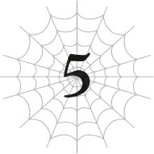
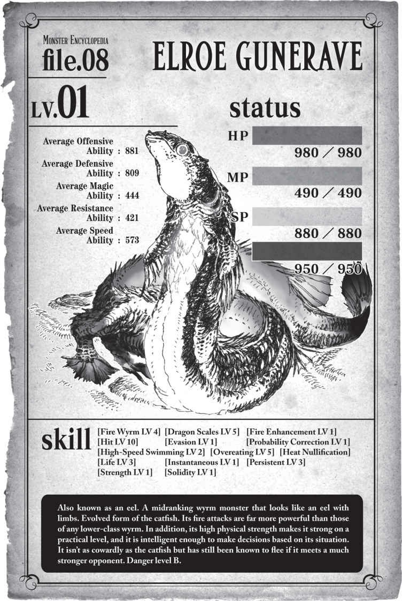

# Chương 5: Nhện đối đầu Hỏa Phi Long

*(Spider vs Fire Wyrm)*

---

### --- TRANG 107 ---

Món cá trê đó ngon tuyệt cú mèo luôn. Quả là một bữa đại tiệc.

Kỹ năng Tăng cường Vị giác của tôi thậm chí đã tăng lên cấp 7.

Có vẻ tôi đã quá tập trung vào việc ăn uống rồi nhỉ?

Nhưng làm sao trách tôi được chứ!

Tất cả mọi thứ tôi từng ăn từ trước đến nay đều dở tệ hại!

Dĩ nhiên là tôi muốn nhâm nhi thưởng thức thật kỹ mỗi khi được ăn món gì đó ngon rồi!

Bên cạnh đó, Phàm ăn đã tăng lên cấp 8.

Tôi vẫn còn dư dả lượng dự trữ từ trước, nhưng vì kỹ năng này có vẻ giúp tăng lượng năng lượng có thể tích trữ, nên việc nâng cấp nó chắc chắn chỉ có lợi chứ không có hại.

Thêm vào đó, tôi cũng rất tò mò muốn biết khi Phàm ăn đạt cấp 10 thì kỹ năng tiến hóa hoặc phái sinh của nó sẽ là gì.

Nó vốn dĩ đã là một kỹ năng siêu tiện lợi rồi, nên tôi đang cực kỳ kỳ vọng đây.

Cơ mà vẫn có một chuyện khác khiến tôi thấy hơi lo lắng.

Đó chính là kỹ năng Kiêu hãnh.

Kiêu hãnh là một trong bảy tội lỗi chết người (thất tội).

Và trong bảy tội đó cũng có một tội gọi là Phàm ăn (Gluttony).

Còn kỹ năng của tôi hiện tại là Phàm ăn (Overeating). Cả hai từ này đều có nghĩa tương tự nhau.

Nên tôi không khỏi thấy e ngại.

Lỡ như dạng tiến hóa của Phàm ăn (Overeating) lại biến thành Phàm ăn (Gluttony) thì sao?

Hiệu ứng của Kiêu hãnh đã mạnh đến mức đáng sợ rồi, nên nếu Phàm ăn (Overeating) thực sự tiến hóa thành Phàm ăn (Gluttony), khả năng cao là nó cũng sẽ sở hữu hiệu ứng bá đạo tương đương với một kỹ năng khác thuộc dòng "thất tội".

Trong trường hợp đó, tôi chắc chắn sẽ thấy lo sốt vó giống như đối với Kiêu hãnh vậy.

Mà thôi, giờ nó mới ở cấp 8. Lo nghĩ sớm thế cũng chẳng để làm gì.

Với lại, đằng nào thì nó cũng tự động tăng cấp dù tôi có muốn hay không, nên lo lắng cũng có giải quyết được gì đâu.

### --- TRANG 108 ---

Được rồi, giờ là lúc tiếp tục thám hiểm và tìm kiếm thêm cá trê nào.

Cá trê ơiii!

Tôi đi vất vưởng khắp Tầng Trung để lùng sục cá trê.

Nhưng chẳng thấy mống nào cả.

Hừm. Tôi đoán nếu bọn chúng lặn sâu dưới dòng dung nham thì tôi cũng chẳng cách nào phát hiện ra được.

Lần đầu tiên chạm trán là do con đó vô tình thò đầu lên khỏi dòng chảy dung nham mà thôi.

Nếu bình thường bọn chúng đều ở sâu dưới đó thì sẽ cực kỳ khó tìm.

Thực ra, lẽ ra tôi phải sở hữu một kỹ năng phát hiện kẻ địch hữu dụng nào đó rồi chứ nhỉ.

Nghĩ lại thì, có vẻ như tôi luôn phát hiện ra các mối hiểm nguy một cách chính xác hơn nhiều so với việc chỉ đơn thuần dựa vào trực giác thông thường.

Ý tôi là, tôi chưa từng bị đánh úp bất ngờ bao giờ, và mỗi khi tôi có linh cảm xấu thì y như rằng linh cảm đó đều đúng.

Đây chỉ là suy đoán thôi, nhưng tôi nghĩ đó có lẽ là bản năng nhện tự nhiên của mình.

Tôi có vẻ đã phát hiện ra những thay đổi nhỏ như luồng không khí chuyển động mà chính bản thân tôi cũng không nhận ra.

Nếu vậy thì việc trước đó tôi không nhận ra có một con cá trê ở sát sạt bên cạnh cũng là dễ hiểu.

Nếu các giác quan của tôi phụ thuộc vào luồng chuyển động của không khí, thì dĩ nhiên tôi không thể phát hiện ra các mối đe dọa ở dưới dung nham rồi.

Và tôi cũng không thể phát hiện ra các đòn đánh lén đến từ dưới nước hoặc dưới lòng đất nữa.

Thế nên việc đi quá gần dung nham là cực kỳ nguy hiểm.

Nếu có thứ gì đó đột ngột nhảy xổ ra kéo tuột tôi xuống dưới thì coi như xong đời cô Lựu luôn.

Chưa kể, việc ở gần dung nham nói chung vốn đã rất rủi ro rồi, nên tôi luôn cố gắng tránh xa nó.

Từ giờ trở đi, tôi phải đứng cách xa dòng dung nham một khoảng đủ an toàn phòng trường hợp có quái vật xuất hiện.

Giống như ngay lúc này đây chẳng hạn.

Nếu phải mô tả cái sinh vật vừa phóng ra khỏi dòng dung nham kia, tôi sẽ gọi nó là... Hừm, một con lươn?

Phải rồi. Một con quái vật dạng lươn có vảy và có cả chân tay nữa.

### --- TRANG 109 ---

| Chỉ số | Giá trị |
| --- | --- |
| **Chủng tộc** | Gunerave Elroe LV 2 |
| **HP** | 1.001/1.001 (Xanh lá) |
| **MP** | 511/511 (Xanh dương) |
| **SP (Vàng)** | 899/899 |
| **SP (Đỏ)** | 971/971 `+57` |
| **Sức tấn công trung bình** | 893 |
| **Sức phòng ngự trung bình** | 821 |
| **Sức mạnh ma pháp trung bình** | 454 |
| **Kháng tính trung bình** | 433 |
| **Tốc độ trung bình** | 582 |

**Kỹ năng:**
[Hỏa Phi Long LV 4] [Long Lân LV 5] [Tăng cường Lửa LV 1] [Đánh trúng LV 10] [Né tránh LV 1] [Hiệu chỉnh Xác suất LV 1] [Bơi tốc độ cao LV 2] [Vô hiệu Nhiệt] [Sinh mệnh LV 3] [Bộc phát lực LV 1] [Bền bỉ LV 3] [Sức mạnh LV 1] [Cứng cáp LV 1] [Phàm ăn LV 5]

`<Gunerave Elroe: Chủng tộc quái vật phi long tầm trung sinh sống tại Mê cung Lớn Elroe, Tầng Trung. Là loài ăn tạp, nhưng đặc biệt thích ăn thịt các loài quái vật khác.>`

Nguy to rồi. Con lươn này mạnh khủng khiếp luôn ấy.

Mạnh thế này mà chỉ được xếp vào hàng "tầm trung" thôi sao?

Mà nhìn vào bộ kỹ năng của nó, tôi tự hỏi liệu con lươn này có phải cũng là một nhánh tiến hóa từ loài cá trê kia không nhỉ?

Không, giờ không phải lúc để bận tâm về chuyện đó.

Con lươn đang đứng cách tôi khoảng năm mươi feet.

Nó đã phát hiện ra tôi và khóa chặt mục tiêu vào tôi rồi.

Tôi tuy sở hữu chỉ số tốc độ cao hơn, nhưng các chỉ số còn lại của nó hoàn toàn đè bẹp tôi không thương tiếc.

Tệ nhất là thanh thể lực đỏ của nó dài gấp bội phần của tôi, kể cả khi đã tính cả lượng dự trữ từ Phàm ăn.

Dù tôi có chạy nhanh hơn nó, khả năng cao là nó vẫn sẽ đuổi kịp khi tôi cạn kiệt thể lực.

Hy vọng là nó sẽ mất hứng trước khi chuyện đó xảy ra, nhưng mà...

Thanh thể lực vàng của tôi vốn đã thấp rồi, nên tôi chỉ có thể duy trì tốc độ tối đa trong những khoảng thời gian cực kỳ ngắn ngủi.

Một khi thể lực bộc phát cạn sạch, tôi sẽ bị hụt hơi, và lúc đó tôi cũng sẽ bị tóm thôi.

Tôi có thể chạy thoát được không đây?

### --- TRANG 110 ---

Ngay khi câu hỏi đó vừa hiện lên trong đầu, tầm nhìn của tôi đối với con lươn bỗng tách làm đôi.

Là Tiên kiến đang kích hoạt.

Hình ảnh nhòe đi của con lươn cho thấy nó đang chuẩn bị phun ra thứ gì đó.

Vài giây sau, cơ thể thực sự của nó cũng thực hiện y hệt, phun ra một quả cầu lửa.

Hóa ra chiến thuật cơ bản của bọn chúng đều giống nhau.

Nhưng quả cầu lửa này bay nhanh hơn và to hơn nhiều so với những quả cầu của lũ cá ngựa hay cá trê!

Tôi vội vàng nhảy tránh sang một bên.

Gia tốc Tư duy đang hoạt động, nhưng tốc độ bay của quả cầu lửa nhanh đến mức tôi suýt chút nữa là không nhận ra.

Nó nổ tung ngay vị trí tôi vừa đứng với một tiếng "bùm" chói tai.

Dù đã có sự trợ giúp của Tiên kiến và Gia tốc Tư duy, tôi vẫn chỉ suýt soát né được đòn đó.

Cái gì thế này? Tôi cứ tưởng mình đã né tránh nhanh hơn thế nhiều chứ.

`<Hiệu chỉnh Xác suất: Cộng thêm hiệu chỉnh tích cực cho bất kỳ kỹ năng nào có uy lực phụ thuộc vào xác suất.>`

Thì ra là do cái kỹ năng quỷ quái này. Có vẻ nó đã giúp gia tăng độ chính xác cho các cú bắn của con lươn.

Trong trường hợp đó, việc liên tục né tránh sẽ cực kỳ khó khăn ngay cả đối với tôi.

Lần này tôi thực sự gặp rắc rối lớn rồi.

Tôi tiếp tục né thêm một quả cầu lửa nữa.

Nhưng quả tiếp theo đã lập tức lao tới trước khi tôi kịp lấy lại thăng bằng.

Cứ đà này thì tôi thậm chí còn chẳng có cơ hội để chạy trốn nữa.

Dư chấn từ vụ nổ sượt qua đã lấy đi của tôi một chút HP.

Nếu tôi di chuyển với tốc độ tối đa thì chắc chắn sẽ né được, nhưng thanh thể lực vàng sẽ tụt dốc không phanh.

Nếu cứ phải liên tục chạy nước rút, thanh thể lực vàng của tôi sẽ cạn sạch trong nháy mắt, khiến tôi rơi vào trạng thái hụt hơi.

Lúc đó thì coi như tôi xong đời.

Tiên kiến và Gia tốc Tư duy giúp tôi dự đoán đường bay của các quả cầu lửa để né tránh.

Nhưng con lươn cũng có thể đoán trước hướng di chuyển của tôi để điều chỉnh quỹ đạo bắn.

Ai sẽ là người outplay đối phương đây? Cảm giác cứ như đang chơi một ván cờ tốc độ cao với tiền cược chính là mạng sống của mình vậy.

Điểm khác biệt duy nhất là nếu con lươn bắn trượt thì nó chẳng mất mát gì nhiều, còn tôi chỉ cần đi sai một nước là sẽ bay màu ngay lập tức.

### --- TRANG 111 ---

`<Độ thuần thục đã đạt mức yêu cầu. Kỹ năng [Gia tốc Tư duy LV 1] đã trở thành [Gia tốc Tư duy LV 2].>`

`<Độ thuần thục đã đạt mức yêu cầu. Kỹ năng [Tiên kiến LV 1] đã trở thành [Tiên kiến LV 2].>`

Tôi thực sự cực kỳ biết ơn khi các kỹ năng tăng cấp vào đúng thời điểm ngàn cân treo sợi tóc thế này.

Tốc độ bay của các quả cầu lửa lao tới có vẻ đã chậm đi một chút xíu.

Dẫu vậy, nhận thức của tôi về tốc độ di chuyển của chính mình cũng bị chậm lại, nên tôi phải hết sức cẩn thận.

Tôi tiếp tục né tránh các quả cầu lửa.

Thế rồi, nhờ có Tiên kiến, tôi thấy con lươn đang chuẩn bị thực hiện một chiêu thức khác.

Trông nó vẫn có vẻ như chuẩn bị phun lửa, nhưng lần này nó đang hút vào một lượng không khí lớn hơn nhiều so với trước.

Đến lúc phải giải phóng tốc độ tối đa mà tôi đã ém nãy giờ rồi.

Tôi lao vút đi với tốc độ xé gió làm nhòe nhoẹt cả cảnh vật xung quanh.

Ngay phía sau lưng tôi, ngọn lửa dữ dội thiêu rụi mọi thứ thành tro bụi.

`<Flame Breath: Phun lửa bao phủ một phạm vi rộng lớn.>`

Đây là chiêu thức có thể sử dụng khi kỹ năng Hỏa Phi Long đạt cấp 4.

Tôi không bị trúng đòn trực tiếp, nhưng phần lưng vẫn cảm thấy nóng rát khủng khiếp chỉ do tác động nhiệt tỏa ra xung quanh.

HP của tôi bắt đầu tụt dần từng chút một.

Cứ đà này thì tình hình sẽ chỉ ngày càng tồi tệ hơn, và nếu dính đòn trực tiếp dù chỉ một lần, tôi chắc chắn sẽ chết.

Nhưng tôi không nghĩ ra nổi một kế hoạch khả thi nào cả.

Tất cả những gì tôi làm được lúc này chỉ là liên tục né tránh và kiên nhẫn chờ đợi thời cơ.

Cảm giác sinh mạng của mình đang bị bào mòn dần khiến tôi nóng hết cả ruột gan, theo cả nghĩa đen lẫn nghĩa bóng.

Một quả cầu lửa khác lại bay tới.

Sự kết hợp giữa kỹ năng Đánh trúng cấp 10 và Hiệu chỉnh Xác suất của con lươn khiến những cú bắn của nó chuẩn xác đến kinh ngạc.

Nếu không có Né tránh, Gia tốc Tư duy và Tiên kiến hỗ trợ, tôi nghi là mình không thể nào né nổi.

`<Độ thuần thục đã đạt mức yêu cầu. Kỹ năng [Né tránh LV 5] đã trở thành [Né tránh LV 6].>`

### --- TRANG 112 ---

Tuyệt vời! Dù bấy nhiêu vẫn chưa đủ để lật ngược tình thế, nhưng có thêm chút lợi thế nào là tốt chút đó.

Tôi kiểm tra lượng MP còn lại của con lươn trong lúc né tránh quả cầu lửa.

Nó chắc chắn đã giảm đi, nhưng vẫn còn lại hơn một nửa.

Vì chiêu Flame Breath có phạm vi tấn công rất rộng, nên có vẻ nó tiêu tốn nhiều MP hơn nhiều so với Fireball.

Điều đó thật tốt, vì nghĩa là nó không thể spam chiêu đó liên tục được, nhưng tôi vẫn hy vọng nó sẽ tiết kiệm ma lực bằng cách không thèm xài chiêu đó nữa.

Không có gì đảm bảo Tiên kiến sẽ cứu tôi mọi lúc mọi nơi, nên tôi không chắc mình có thể tiếp tục né được nó hay không.

Tôi phải theo dõi sát sao từng cử động của con lươn.

Trước khi tôi kịp dứt suy nghĩ, Tiên kiến đã hiển thị hình ảnh con lươn đang chuẩn bị tích tụ cho một cú Flame Breath khác.

Tôi lại cắm đầu chạy với tốc độ tối đa một lần nữa.

Nhưng lần này, thay vì phun thẳng về phía trước, con lươn lại ngoảnh đầu sang một bên và quét ngọn lửa theo chiều ngang!

Flame Breath vốn đã có phạm vi tấn công cực rộng, nay ngọn lửa quét qua lại càng lan rộng đến mức điên rồ.

Chết tiệt! Tôi bị sượt qua một chút rồi.

Dù chỉ chạm nhẹ, HP của tôi vẫn bị sụt đi 10 điểm.

Một phần lưng và một trong những chiếc chân sau của tôi đã bị trúng đòn.

Chiếc chân sau đang khá đau đớn, nhưng tôi nghĩ mình vẫn cử động nó bình thường được.

Dẫu vậy, việc này có lẽ sẽ làm giảm tốc độ của tôi đi một chút. Nguy thật.

`<Độ thuần thục đã đạt mức yêu cầu. Kỹ năng [Kháng Lửa LV 1] đã trở thành [Kháng Lửa LV 2].>`

Vào thời khắc sinh tử này, kỹ năng Kháng Lửa cứng đầu của tôi cuối cùng cũng chịu tăng cấp.

Thật là đúng lúc.

Với Kháng Lửa cấp cao hơn, tốc độ của Tự hồi phục HP của tôi lẽ ra phải vượt qua tốc độ mất máu do sát thương nhiệt độ xung quanh gây ra.

Lượng hồi phục có lẽ rất nhỏ, nhưng có vẫn hơn không rất nhiều.

Tôi kiểm tra lại lượng MP của con lươn.

Tốt rồi. Giờ nó đã giảm xuống dưới một nửa.

Tốc độ tiêu hao MP có vẻ là khoảng 10 điểm cho mỗi quả Fireball và 50 điểm cho

### --- TRANG 113 ---

mỗi chiêu Flame Breath.

Nhưng kể cả khi đã mất đi một nửa MP, tôi đoán con lươn vẫn có thể sử dụng Flame Breath thêm khoảng bốn lần nữa nếu nó muốn.

Tình hình không khả quan chút nào.

Tôi di chuyển để tạo khoảng cách xa nhất có thể với con quái vật.

Để ngăn cản tôi làm việc đó, con lươn vừa đuổi theo vừa bắn cầu lửa liên tục.

Đúng như tôi mong đợi.

Tôi nghi ngờ nó có thể tích tụ ma lực cho chiêu Flame Breath trong lúc đang di chuyển.

Nếu tôi cứ liên tục luồn lách để dụ nó phun thêm nhiều quả cầu lửa, nó cuối cùng cũng sẽ cạn sạch MP.

Nếu tôi có thể cầm cự được cho đến lúc đó, tôi sẽ có cơ hội phản công. Hy vọng là vậy.

Trước mắt thì cứ tiếp tục né tránh đã.

Tôi đang cố gắng hết sức để chạy xa nhất có thể, nhưng việc tránh bị dính đòn vẫn là ưu tiên hàng đầu.

Tôi cẩn thận lựa chọn đường chạy để không bị dồn vào chân tường sát dòng dung nham.

Chỉ cần sẩy chân một cái thôi là tôi sẽ biến thành tro bụi ngay.

Cảm giác giống như đang đi trên dây vậy.

`<Độ thuần thục đã đạt mức yêu cầu. Kỹ năng [Tự hồi phục HP LV 5] đã trở thành [Tự hồi phục HP LV 6].>`

QUÁ ĐÃ!

Các kỹ năng của tôi liên tục tăng cấp, có lẽ là do tôi đang tập trung cao độ vào trận chiến sinh tử này.

Kháng Lửa và Tự hồi phục HP là hai kỹ năng tôi luôn mong mỏi tăng cấp, và giờ chuyện đó đang xảy ra!

Tôi chỉ vui mừng trong tích tắc. Nhưng cái tích tắc đó suýt chút nữa đã khiến tôi phải trả giá bằng mạng sống.

Con lươn đột ngột kích hoạt Flame Breath.

Chuyện này hoàn toàn ngoài dự kiến của tôi. Tiên kiến thậm chí còn không kịp cảnh báo.

Không đời nào tôi né kịp đòn này bằng cách chạy thông thường.

Ngọn lửa cuồn cuộn phun ra từ miệng con lươn.

Ngay lập tức, tôi dùng hết sức bình sinh đạp mạnh xuống đất, nhảy vọt lên không trung.

Luồng lửa nóng bỏng thiêu rọi các chân của tôi.

### --- TRANG 114 ---

Nén lại cơn đau đớn dữ dội, tôi kích hoạt Truyền Năng lượng đồng thời phóng một sợi tơ hướng thẳng lên trần mê cung.

Truyền Năng lượng tiêu hao thể lực đỏ để cường hóa mọi thứ.

Nhờ kỹ năng này, tôi có thể tạo ra một sợi tơ đủ bền để chống chịu sức nóng của Tầng Trung trong một khoảng thời gian ngắn.

Dẫu vậy, nó cũng chỉ kéo dài được một chốc lát, nên tôi vội vàng đu người theo sợi tơ để kéo cơ thể lên sát trần nhà.

Rồi tôi cắt đứt sợi tơ trước khi nó bị thiêu rụi hoàn toàn.

`<Độ thuần thục đã đạt mức yêu cầu. Kỹ năng [Cơ động Không gian LV 4] đã trở thành [Cơ động Không gian LV 5].>`

Từ trên trần nhà, tôi cúi đầu nhìn xuống con lươn.

Nó cũng đang trừng mắt nhìn tôi từ dưới dòng dung nham.

Việc chạy thoát lên trần nhà tuy rất tuyệt, nhưng nhìn chung, tình thế hiện tại vẫn cực kỳ bất lợi cho tôi.

Khi bám trên trần nhà, tôi chắc chắn sẽ di chuyển chậm hơn nhiều so với khi ở dưới mặt đất.

Lúc ở dưới đất tôi đã phải chật vật lắm mới né được các đòn tấn công của nó rồi.

Nên không đời nào tôi có thể tiếp tục cầm cự được khi ở trên trần nhà thế này.

Tôi phải đáp xuống đất ngay lập tức, nếu không thì sẽ bị bắn rụng như chim mất.

Tuy nhiên, tình cảnh của con lươn cũng chẳng khá khẩm hơn là bao.

Lượng MP của nó đã sụt giảm đáng kể.

Có vẻ nó chỉ còn đủ ma lực để thi triển thêm ba lần Flame Breath hoặc mười sáu lần Fireball nữa thôi.

So với lúc bắt đầu trận chiến thì con số đó đã là rất thấp rồi.

Nhưng bấy nhiêu vẫn là quá đủ để bắn rụng tôi khỏi trần nhà.

Liệu tôi có thể đáp xuống đất an toàn trước khi bị nó bắn trúng không?

Đây không phải lúc để tiếc nuối kỹ năng nữa rồi.

Ý chí chiến đấu, kích hoạt!

Ý chí chiến đấu là kỹ năng tiêu hao thể lực đỏ để tạm thời gia tăng các chỉ số vật lý.

Thể lực đỏ chính là sinh mệnh của tôi, nên tôi chưa từng kích hoạt kỹ năng này bao giờ. Nhưng trong tình thế ngặt nghèo này, tôi không thể do dự việc tiêu tốn SP được nữa.

Tôi lập tức di chuyển, hướng về phía vách tường gần nhất.

Nhưng có vẻ như con lươn đã đoán trước được ý đồ của tôi.

### --- TRANG 115 ---

Nó bắn ra một quả cầu lửa để chặn đường rút của tôi, như thể biết chính xác vị trí tôi muốn hướng tới vậy.

Đòn này sẽ cực kỳ khó né khi tôi đang phải bám chặt vào trần nhà thế này.

Tôi phải tạm thời quẳng cái thanh thể lực đỏ ra sau đầu thôi.

Tôi né tránh quả cầu lửa đang lao tới bằng tốc độ nhanh nhất có thể huy động được.

Lựa chọn duy nhất của tôi là gồng mình chịu đựng lượng tiêu hao từ Ý chí chiến đấu, và hy vọng rằng Giảm tiêu hao SP cùng Tốc độ hồi phục SP sẽ bù đắp lại phần nào lượng năng lượng mất đi.

Tôi phải tiếp cận được vách tường trước khi thanh thể lực vàng cạn kiệt.

Nó vẫn liên tục bắn, còn tôi thì vẫn liên tục né.

Nhưng việc này khiến tôi rất khó để tiếp cận vách tường.

Trong lúc mải mê thực hiện các động tác nhảy nhót né tránh, thanh thể lực vàng của tôi cứ thế vơi dần.

Chết tiệt. Nếu nó cạn sạch, việc bám vào trần nhà sẽ càng trở nên khó khăn hơn nữa.

Tôi phải tránh kết cục đó bằng mọi giá.

Nhưng vô ích. Những cú bắn chuẩn xác không một vết xước của con lươn khiến tôi không cách nào tiến lên được.

Cuối cùng, thanh thể lực vàng cũng chạm đáy.

Sự mệt mỏi lập tức ập đến bao trùm lấy cơ thể tôi. Trước khi tôi kịp suy nghĩ, một quả cầu lửa khác đã lù lù lao tới không một chút khoan nhượng.

Khốn kiếp! Tôi nhận ra mình không thể né được nữa, nên đã chủ động buông chân, buông mình rơi tự do vào không trung.

Quả cầu lửa nổ tung ngay sát sườn tôi, luồng dư chấn nóng bỏng sượt qua cơ thể.

Tôi cố gắng giữ thăng bằng để không bị xoay mòng mòng trên không, một lần nữa kích hoạt Truyền Năng lượng.

Sợi tơ được cường hóa phóng ra, bám chặt vào vách tường, và tôi lập tức bò nhanh dọc theo nó.

Một cú bắn khác quét qua ngay vị trí tôi vừa rời đi.

Đu người trên không trung như một quả lắc đồng hồ, tôi suýt soát tránh được việc rơi thẳng xuống dung nham và đáp xuống mặt đất cứng thành công.

Không để tôi kịp thở, một quả cầu lửa khác đã lao thẳng về phía tôi.

Tôi tận dụng đà đáp đất để lăn lộn tránh sang một bên.

Thực sự quá mệt mỏi rồi. Việc ép buộc cơ thể phải tiếp tục di chuyển sau khi thanh thể lực vàng đã cạn kiệt khiến tôi thở không ra hơi, còn cơ thể thì đau nhức rã rời.

Tôi cắn răng phớt lờ cơn đau nhờ vào sức mạnh của Vô hiệu Đau và Giảm Đau...

...bởi vì tôi có thể thấy con lươn đang chuẩn bị tung ra một cú Flame Breath khác.

### --- TRANG 116 ---

Vắt kiệt chút sức lực cuối cùng của cơ thể rã rời, tôi cắm đầu chạy với tốc độ tối đa.

Tầm nhìn của tôi bị bao phủ bởi ngọn lửa đỏ rực. Sức nóng ập tới từ phía sau lưng rõ ràng đến mức cảm nhận được.

Tôi cứ thế cắm đầu chạy, cố gắng cắt đuôi ngọn lửa.

Bằng cách nào đó, tôi đã né được cú Flame Breath đó.

`<Độ thuần thục đã đạt mức yêu cầu. Kỹ năng [Né tránh LV 6] đã trở thành [Né tránh LV 7].>`

Tôi thở hắt ra luồng khí mà nãy giờ bản thân vô thức nín chặt trong lồng ngực.

Thanh thể lực vàng bắt đầu hồi phục dần.

Sẽ không còn quả cầu lửa nào nữa đâu.

Con lươn cuối cùng đã cạn sạch MP.

Không còn phương thức tấn công tầm xa nào nữa, con lươn lững thững bò lên cạn.

Hóa ra, cái đầu của nó là thứ duy nhất giống lươn.

Phần còn lại của cơ thể nó trông giống hệt như một con rồng Trung Hoa vậy.

Dù đã hết sạch MP, đôi mắt của nó vẫn khóa chặt vào tôi.

Cái gã này chắc chắn đã xác định tôi là kẻ thù không đội trời chung rồi.

Lúc đầu, cảm giác như nó chỉ muốn nghiền nát tôi vì trông tôi hơi ngứa mắt thôi, nhưng dần dần, những quả cầu lửa của nó bắt đầu mang sát khí thực sự.

Vào lúc nó bắt đầu sử dụng Flame Breath, nó chắc chắn đang muốn lấy mạng tôi bằng mọi giá.

Có vẻ nó không mấy vui vẻ khi các đòn tấn công của mình liên tục bị né tránh.

Dù bây giờ tôi có muốn chạy trốn, tôi nghi là nó cũng sẽ không buông tha cho tôi đâu.

MP của nó có thể đã hết sạch, nhưng thể lực SP của nó thì vẫn còn rất dồi dào.

Trong khi đó, thể lực của tôi đã bị bào mòn đi rất nhiều.

Vì tôi vẫn tiếp tục di chuyển sau khi thanh thể lực vàng cạn kiệt, thanh thể lực đỏ của tôi cũng đã tụt xuống mức đáng báo động.

Tôi vẫn còn lượng dự trữ từ Phàm ăn, nên không đến mức hoàn toàn bất động hay gì, nhưng nếu kéo nhau vào một trận chiến tiêu hao thể lực, con lươn chắc chắn sẽ là kẻ giành chiến thắng.

Tôi không thể chạy trốn.

Nghĩa là tôi chỉ còn một lựa chọn duy nhất. Tôi phải chiến đấu và giành chiến thắng.

Nếu chỉ so sánh dựa trên các thông số chỉ số thuần túy, tôi hoàn toàn không có cửa thắng.

### --- TRANG 117 ---

Nhưng những con số không phải là tất cả.

Nếu có một điều tôi học được từ những trận chiến sinh tử ở nơi này, thì đó là kỹ năng chính là yếu tố quyết định lớn nhất, dù là tốt hay xấu.

Ý tôi là, xét đến sự chênh lệch chỉ số khổng lồ giữa hai bên, việc tôi có thể sống sót cho đến lúc này quả thực là một phép màu rồi.

Nguồn gốc của "phép màu" đó chắc chắn nằm ở bộ kỹ năng của tôi.

Chính nhờ tận dụng tối đa chúng mà tôi mới có thể bù đắp lại sự chênh lệch sức mạnh bẩm sinh, thậm chí còn ép được con lươn phải bò lên cạn.

Khoảng cách chỉ số tuy rất lớn, nhưng bấy nhiêu vẫn chưa đủ để định đoạt kết quả trận đấu.

Nếu tôi đi đúng nước cờ, tôi hoàn toàn có thể san lấp khoảng cách đó.

Chưa kể, tôi còn có thể nhìn thấy toàn bộ kỹ năng của con lươn nữa chứ.

Vì nó đã hết MP, thứ duy nhất tôi cần phải dè chừng lúc này là sự kết hợp giữa Đánh trúng, Né tránh và Hiệu chỉnh Xác suất của nó.

Thêm vào đó là khả năng phòng ngự đáng gờm từ Long Lân, và năng lực cấp 3 nhận được từ kỹ năng Hỏa Phi Long.

Mối đe dọa cuối cùng chính là kích thước cơ thể khổng lồ của con lươn.

Chỉ riêng cái cơ thể đồ sộ đó thôi đã đủ biến nó thành một đối thủ cực kỳ đáng gờm rồi.

Nhưng tôi vẫn còn vài quân bài tẩy trong tay. Cụ thể là phương thức tấn công mạnh nhất của tôi: Kịch Độc.

Lớp phòng ngự của đối thủ chẳng có nghĩa lý gì trước nọc độc cực mạnh của tôi.

Nó có thể ăn mòn cả Long Lân, gặm nhấm dần lớp thịt bên dưới.

Cuối cùng, kỹ năng vẫn là thứ duy nhất tôi có thể tin tưởng vào lúc này.

Đó là lĩnh vực duy nhất mà tôi vượt trội hơn con lươn.

Dù điều đó còn tùy thuộc vào việc tôi sử dụng chúng hiệu quả đến đâu.

Cả hai chúng tôi đều đang ở trong tình trạng phòng ngự cực kỳ mỏng manh.

Đây sẽ là một trận tử chiến, nơi kẻ nào ra đòn trúng trước sẽ là kẻ chiến thắng.

Nghĩa là nước đi quyết định chiến thắng của tôi sẽ là...

Trận hiệp hai trên mặt đất bắt đầu mà không cần tiếng chuông báo hiệu.

Cơ thể dài ngoằng của con lươn cuộn tròn lại rồi duỗi ra liên tục.

Sau những màn giao tranh trước đó, xem ra nó cũng đang cực kỳ cảnh giác tôi.

### --- TRANG 118 ---

Con lươn này khá thông minh so với hầu hết các loài quái vật khác, dù vẫn chưa bằng lũ khỉ kia.

Điều đó chỉ làm cho công việc của tôi thêm phần khó khăn mà thôi.

`<Độ thuần thục đã đạt mức yêu cầu. Kỹ năng [Gia tốc Tư duy LV 2] đã trở thành [Gia tốc Tư duy LV 3].>`

`<Độ thuần thục đã đạt mức yêu cầu. Kỹ năng [Tiên kiến LV 2] đã trở thành [Tiên kiến LV 3].>`

Con lươn bắt đầu chuyển động như thể bắt nhịp với Giọng nói của Thần (tạm gọi).

Cơ thể nó duỗi thẳng ra, quất mạnh chiếc đuôi về phía tôi.

Tôi dĩ nhiên là né được, nhưng đòn tấn công của con quái vật không dừng lại ở đó.

Chiếc đuôi quét ngang qua, một lần nữa nhắm thẳng vào tôi.

Tôi lùi lại thêm một chút để tránh đòn.

Lần này, đầu của con lươn bỗng lao thẳng tới, tráo đổi vị trí với chiếc đuôi của nó.

Đó chính là thời cơ mà tôi đã kiên nhẫn chờ đợi nãy giờ.

Khi thế giới xung quanh chuyển động chậm đi một chút nhờ có Gia tốc Tư duy, tôi khóa chặt tầm mắt vào cái miệng đang lao tới của con lươn.

Ngay khi nhận định rằng nó đã tiến quá gần để có thể né tránh bình thường, tôi lập tức kích hoạt Tổng hợp Độc.

Rồi nhanh chóng nhảy lùi ra xa!

Chiêu thức tương tự như khi đối phó với con cá trê. Tuy nhiên, hiệu quả mang lại là cực kỳ to lớn.

Chất độc trôi tuột xuống cổ họng con lươn, hoàn toàn đúng như kế hoạch của tôi.

HP của nó bắt đầu sụt giảm nhanh chóng.

Đau đớn tột cùng, cơ thể con lươn quằn quại quất loạn xạ dữ dội.

Tôi lùi lại xa hơn để nằm ngoài phạm vi giãy giụa của nó.

Đúng là khi cả hai bên đều sở hữu sức mạnh đủ để kết liễu đối phương chỉ bằng một đòn duy nhất, người chiến thắng sẽ là kẻ ra đòn trúng trước.

Mà kẻ ra đòn trúng trước sẽ là kẻ vạch ra được chiến thuật tốt hơn để tung ra đòn đánh đó.

Chưa kể, khả năng né tránh của tôi hoàn toàn áp đảo độ chính xác của con lươn.

Dù sở hữu Đánh trúng cấp 10 và Hiệu chỉnh Xác suất, nó vẫn không thể vượt qua sự kết hợp giữa Né tránh, Gia tốc Tư duy và Tiên kiến của tôi.

### --- TRANG 119 ---

Nên ngay khi con lươn bị dụ lên cạn, cơ hội chiến thắng của tôi đã tăng vọt.

Nhưng mọi chuyện vẫn chưa kết thúc.

Dù tôi có nói về một đòn kết liễu duy nhất, đòn tấn công đó có lẽ vẫn chưa đủ để giết chết nó ngay lập tức.

Đến cả con cá trê còn không chết sau một đòn độc, nên không đời nào một chủng tộc mạnh hơn thế này lại dễ dàng gục ngã như vậy.

Hơn nữa, con lươn vẫn còn một kỹ năng khác hỗ trợ.

HP của nó đang hồi phục nhanh chóng ngay trước mắt tôi.

`<Life Exchange: Hồi phục HP bằng cách tiêu hao SP.>`

Đó là năng lực cấp 3 nhận được từ kỹ năng Hỏa Phi Long.

Nó tiêu tốn thể lực SP, và lượng HP sẽ được phục hồi tương ứng.

Dù nó không thể hồi phục hoàn toàn do giới hạn của lượng SP hiện có, nhưng bấy nhiêu vẫn là đủ để chống cự lại nọc Kịch Độc của tôi.

Thêm vào đó, khi tôi Thẩm định kết quả của con lươn, nó vừa nhận thêm Kháng Độc cấp 1 và Tự hồi phục HP cấp 1.

Chất độc trong cơ thể vẫn đang bào mòn HP của nó từng chút một, nhưng đỉnh điểm của lượng sát thương lớn nhất đã trôi qua rồi.

Nhưng tôi đâu có ngu gì mà đứng im nhìn nó tự chữa lành vết thương cho mình chứ.

Tôi tạo ra sợi tơ chắc chắn nhất có thể và quấn chặt lấy cơ thể con lươn.

Nó sẽ bốc cháy ngay lập tức, nhưng chuyện đó không quan trọng.

Tất cả những gì tôi cần là cố định nó lại dù chỉ trong một tích tắc ngắn ngủi.

Thật may mắn, tôi đã làm được chính xác điều đó.

Vào tích tắc đó, tôi nhắm thẳng vào mặt con lươn và liên tiếp kích hoạt Tổng hợp Độc liên tục.

Những bãi độc liên tiếp trút xuống xối xả.

Con lươn gầm rú bứt đứt lớp tơ trói buộc và giãy giụa điên cuồng.

Nhưng chất độc đã ngấm vào mắt và miệng của nó, bào mòn lượng HP của nó một cách tàn nhẫn.

Tốc độ mất máu là quá cao để kỹ năng Tự hồi phục HP mới tinh của nó có thể bù đắp nổi.

Và lượng sát thương cũng quá mạnh để kỹ năng Kháng Độc mới học được của nó có thể chống cự.

Một chiếc khiên được dựng lên vội vã vào phút chót làm sao chống đỡ nổi thứ vũ khí hủy diệt mà tôi đã dành cả đời nhện của mình để hoàn thiện chứ.

Không còn đủ SP để tiêu hao cho việc hồi phục nữa, đòn tấn công dồn dập đã vượt quá giới hạn chịu đựng của con lươn.

### --- TRANG 120 ---

`<Kinh nghiệm đã đạt mức yêu cầu. Cá thể tiểu taratect độc đã tăng từ LV 7 lên LV 8.>`

`<Tất cả các chỉ số cơ bản đều tăng.>`

`<Nhận được điểm thưởng độ thuần thục kỹ năng do lên cấp.>`

`<Độ thuần thục đã đạt mức yêu cầu. Kỹ năng [Tư duy Song song LV 4] đã trở thành [Tư duy Song song LV 5].>`

`<Độ thuần thục đã đạt mức yêu cầu. Kỹ năng [Tốc độ hồi phục SP LV 2] đã trở thành [Tốc độ hồi phục SP LV 3].>`

`<Đã nhận được điểm kỹ năng.>`

`<Kinh nghiệm đã đạt mức yêu cầu. Cá thể tiểu taratect độc đã tăng từ LV 8 lên LV 9.>`

`<Tất cả các chỉ số cơ bản đều tăng.>`

`<Nhận được điểm thưởng độ thuần thục kỹ năng do lên cấp.>`

`<Độ thuần thục đã đạt mức yêu cầu. Kỹ năng [Bộc phát lực LV 8] đã trở thành [Bộc phát lực LV 9].>`

`<Độ thuần thục đã đạt mức yêu cầu. Kỹ năng [Bền bỉ LV 8] đã trở thành [Bền bỉ LV 9].>`

`<Đã nhận được điểm kỹ năng.>`

`<Kinh nghiệm đã đạt mức yêu cầu. Cá thể tiểu taratect độc đã tăng từ LV 9 lên LV 10.>`

`<Tất cả các chỉ số cơ bản đều tăng.>`

`<Nhận được điểm thưởng độ thuần thục kỹ năng do lên cấp.>`

`<Độ thuần thục đã đạt mức yêu cầu. Kỹ năng [Xử lý Tính toán LV 6] đã trở thành [Xử lý Tính toán LV 7].>`

`<Độ thuần thục đã đạt mức yêu cầu. Kỹ năng [Tăng cường Thị giác LV 8] đã trở thành [Tăng cường Thị giác LV 9].>`

`<Độ thuần thục đã đạt mức yêu cầu. Kỹ năng [Sinh mệnh LV 8] đã trở thành [Sinh mệnh LV 9].>`

`<Đã nhận được điểm kỹ năng.>`

`<Điều kiện thỏa mãn. Cá thể tiểu taratect độc hiện đã có thể tiến hóa.>`

`<Có nhiều nhánh tiến hóa khả dụng. Vui lòng lựa chọn từ danh sách sau.>`

### --- TRANG 121 ---

*   `Taratect Độc (Poison taratect)`
*   `Zoa Ele`

Ồ, tiến hóa kìa.

Khoan đã, tiến hóa á?! Lại nữa hả?! Chẳng phải thế này là hơi nhanh quá sao?! Lần trước vụ đám khỉ cũng diễn ra cực kỳ nhanh chóng luôn!

Thôi, chuyện đó để sau hãy tính.

Còn bây giờ, tôi muốn tận hưởng chiến thắng ngọt ngào này đã.

TÔI THẮNG RỒI!

Yê yê yê! Tôi thắng rồi, tôi thắng rồi! Con lươn đó mạnh khủng khiếp luôn, thế mà tôi vẫn hạ gục được nó!

Đáng kinh ngạc đúng không?! Tôi có phải là siêu mạnh hay không chứ hả?!

Hắc. Hắc hắc hắc.

Tôi đã đối đầu trực diện, thậm chí còn hầu như chẳng cần dùng đến tơ nhện nữa, thế mà vẫn thắng oanh liệt.

Điều này nghĩa là tôi không còn yếu đuối nữa đúng không? Tôi siêuuu mạnh luôn ấy chứ!

Yê yê yê!

Con lươn đó quả là một đối thủ đáng gờm. Không đùa được đâu. Đúng nghĩa là một trận tử chiến luôn.

Nhưng cuối cùng, chiến thắng vẫn thuộc về tôi!

Tôi là số một! Hắc hắc hắc hắc.

Tôi làm được rồi! Người chiến thắng chính là tôi! Ha ha ha!

### --- TRANG 122 ---

