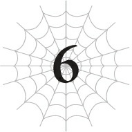

# Chương 6: Zoa Ele

*(Zoa Ele)*

---

### --- TRANG 129 ---

Hộc... Hộc...

Tôi phấn khích đến mức thở không ra hơi luôn. Có vẻ tôi hơi quá đà trong việc ăn mừng chiến thắng trước đối thủ đáng gờm kia rồi.

Phù. Được rồi, thế là đủ rồi. Giờ tôi nên làm gì tiếp theo đây?

Trước hết là tôi đã tăng một đống cấp cùng một lúc.

Cảm ơn nhé, bạn lươn. Quả nhiên không hổ danh là thuộc dòng dõi loài rồng mà.

Nếu chỉ tính riêng chỉ số thì cậu ta hoàn toàn vượt xa đẳng cấp của tôi. Cộng thêm hiệu ứng của Kiêu hãnh nữa thì thảo nào tôi lại đạt cấp tối đa chỉ trong một nốt nhạc.

Các kỹ năng của tôi cũng phát triển vượt bậc sau trận chiến này. Đúng là một mẻ điểm kinh nghiệm bội thu.

Dù thực lòng mà nói, có những lúc tôi còn chẳng chắc mình có thể thắng nổi hay không.

Chỉ cần sẩy chân một nước thôi là giờ tôi đã hóa thành tro bụi rồi.

Con lươn đó mạnh đến mức như thế đấy.

Nói thật, nếu chỉ nhìn vào chỉ số của hai bên thì không một ai nghĩ tôi có cửa thắng cả.

Hết trận đó rồi lại đến vụ lũ khỉ, tôi thấy mình có vẻ hơi bị thường xuyên lao đầu vào những trận chiến quá tầm rồi đấy...

Dù sao thì, kỹ năng tăng cấp khiến tôi vui sướng nhất có lẽ là Tự hồi phục HP và Kháng Lửa.

Cho đến nay, tốc độ hồi phục của tôi chỉ vừa đủ để triệt tiêu sát thương từ cái địa hình nóng như thiêu như đốt này, nhưng giờ đây nó chắc chắn phải vượt trội hơn thế để giúp tôi hồi phục thêm chút máu.

Nhưng lúc này thì tôi chưa kiểm tra được, vì HP của tôi đã hồi phục đầy sau khi lên cấp rồi.

Dẫu vậy, hy vọng là từ giờ trở đi nếu có bị thương nhẹ thì tôi vẫn có thể tự hồi phục theo thời gian.

### --- TRANG 130 ---

Việc phải cố gắng để không dính dù chỉ một vết xước nhỏ suốt thời gian qua thực sự quá mệt mỏi, nhưng giờ tôi đã có thể thở phào nhẹ nhõm một chút rồi.

Dù vậy, nếu dính đòn trực tiếp từ một cú đánh mạnh thì tôi vẫn sẽ bay màu như thường thôi.

Bên cạnh đó, tôi đã đạt cấp 10.

Nghĩa là tôi lại có thể tiến hóa.

Nhưng tôi có nên tiến hóa không? Có thực sự an toàn khi tiến hóa ở một nơi như thế này không?

Bản thân việc tiến hóa vốn dĩ đã đi kèm với kha khá rủi ro rồi.

Đầu tiên là khi tiến hóa, tôi sẽ hoàn toàn bất tỉnh nhân sự.

Việc đó sẽ khiến tôi hoàn toàn không có khả năng tự vệ trong một khoảng thời gian, nên nếu bị quái vật khác tấn công thì tôi coi như xong đời.

Lần trước — và lần trước nữa — tôi đã tự dệt cho mình một cái kén tơ để làm nơi trú ẩn an toàn khi tiến hóa, nhưng lần này thì không thể làm thế được rồi.

Bởi vì ở đây tôi đâu có dùng tơ được.

Nếu tôi cố dệt một cái kén tơ trong cái địa ngục dung nham nóng bỏng này, tơ sẽ bốc cháy trước khi tôi kịp hoàn thành nó.

Tiến hóa giữa biển lửa ư? Cho tôi xin kiếu.

Chưa hết đâu nhé.

Vì tiến hóa đòi hỏi một lượng năng lượng khổng lồ, MP và SP của tôi sẽ bị hút cạn kiệt.

MP cạn sạch thì không sao, nhưng nếu SP hết thì tôi có thể sẽ đói đến mức không lết đi nổi nữa.

Trong trường hợp tệ nhất, tôi có thể sẽ bị chết đói.

Cho đến nay, tôi luôn có sẵn một kho lương thực khổng lồ để ăn ngấu nghiến ngay sau khi tiến hóa, nhưng tình thế hiện tại thì hơi khác một chút.

Thì đúng là còn xác con lươn đấy, nhưng tôi không nghĩ cái đống xác này đủ để giúp tôi hồi phục hoàn toàn SP đâu.

Tôi không lo bị chết đói, nhưng tôi nghĩ mình sẽ phải chủ động đi săn mồi một thời gian sau đó.

Ồ, thế còn lượng dự trữ của Phàm ăn thì sao nhỉ?

Hai lần tiến hóa trước tôi chưa có kỹ năng Phàm ăn...

Trong trận chiến với con lươn tôi có dùng một chút, nhưng lượng tích lũy còn lại vẫn rất lớn.

Nếu tôi có thể dùng lượng dự trữ đó làm nhiên liệu cho quá trình tiến hóa, biết đâu tôi sẽ không rơi vào tình trạng đói lả sau khi tỉnh dậy.

Hừm. Nhưng có lẽ tôi không nên hành động chỉ dựa vào những suy nghĩ lạc quan quá mức nhỉ?

### --- TRANG 131 ---

Về mặt cảm xúc thì tôi cực kỳ muốn tiến hóa — nhưng xét từ góc độ an toàn, có lẽ lúc này chưa nên vội vàng thì hơn?

Dù vậy tôi lại lo rằng nếu không tiến hóa thì mình sẽ không thể lên cấp được nữa.

Liệu các sinh vật nhỏ bé có bị giới hạn ở cấp 10 hay không?

Nếu đúng như thế, mọi điểm kinh nghiệm tôi nhận được trong hình dạng này sẽ đổ sông đổ biển hết, trong khi tôi chắc chắn vẫn còn một chặng đường dài phải đi ở Tầng Trung này.

Phải, tôi ghét chuyện đó lắm.

Trong trường hợp đó, có lẽ tôi nên tiến hóa luôn thì hơn? Hừm.

Dù sao thì có vẻ lần này tôi cũng có nhiều lựa chọn tiến hóa, nên cứ xem xét trước đã.

Được rồi, Thẩm định ơi, trông cậy cả vào bạn đấy.

`<Các nhánh tiến hóa khả dụng: Taratect Độc HOẶC Zoa Ele>`

Hửm? Taratect Độc thì không có gì ngạc nhiên rồi, nhưng cái Zoa Ele này là cái gì thế?

Nó thậm chí còn không thuộc dòng Taratect luôn sao?

`<Zoa Ele: Điều kiện tiến hóa: Quái vật dạng nhện cỡ nhỏ có chỉ số đạt mức quy định, sở hữu danh hiệu [Thích khách]. Mô tả: Một loài quái vật dạng nhện cỡ nhỏ bị khiếp sợ như một điềm báo xấu. Sở hữu khả năng chiến đấu và ẩn mình cực kỳ cao.>`

Ồ, Thẩm định ơi!

Bạn đã cập nhật thêm cả điều kiện tiến hóa nữa cơ đấy! Cho tôi sao?

Đúng là Thẩm định của tôi có khác! Lúc nào cũng đáng tin cậy!

Hừm. Nghĩa là tôi có thể tiến hóa thành loài này vì chỉ số của tôi đã vượt qua yêu cầu tối thiểu.

Điều đó có nghĩa là từ trước đến nay chỉ số của tôi có lẽ luôn thấp hơn yêu cầu đó.

Và khoan đã, các danh hiệu cũng có liên quan đến tiến hóa nữa sao?

Tôi tự hỏi liệu lần trước tôi có thể tiến hóa thành Tiểu Taratect Độc là vì tôi sở hữu danh hiệu Người dùng Độc thuật hay không?

Khả năng cao là như vậy rồi.

`<Taratect Độc: Điều kiện tiến hóa: Tiểu Taratect Độc LV 10. Mô tả: Một phân chủng non hiếm gặp thuộc loài quái vật dạng nhện Taratect. Sở hữu kịch độc cực kỳ mạnh mẽ.>`

Vậy là lựa chọn còn lại của tôi: Taratect Độc.

Nhưng nếu đã tiến hóa, tôi chắc chắn phải chọn cánh cửa số một rồi.

Zoa Ele. Điều kiện để tiến hóa thành chủng tộc này khá ngặt nghèo, và như người bạn Thẩm định đáng quý đã thông báo, nó sở hữu năng lực chiến đấu cực kỳ cao.

Việc nó vẫn thuộc kích thước "nhỏ" cũng là một điểm cộng rất lớn.

Dù tôi vẫn hơi lo lắng một chút, vì dựa vào tên gọi và mô tả thì nó có vẻ là một nhánh hoàn toàn khác biệt so với loài Taratect thông thường.

Nếu tiếp tục tiến hóa theo dòng Taratect, tôi chắc chắn sẽ mạnh lên.

### --- TRANG 132 ---

Tôi biết rõ điều này vì tôi đã tận mắt chứng kiến dạng tiến hóa của nó bằng không-biết-bao-nhiêu con mắt của mình.

Con nhện khổng lồ được cho là mẹ của tôi mà tôi thấy ở Tầng Dưới: Taratect Vĩ đại.

Thật khó hình dung nổi nếu so sánh với sự yếu ớt của tôi từ trước đến nay, nhưng tôi biết chắc chắn rằng nếu tiếp tục tiến hóa, tôi rồi cũng sẽ đạt đến cấp độ đó.

Tôi biết điều đó, nhưng đồng thời, nó cũng có nghĩa là kích thước cơ thể của tôi sẽ ngày càng to ra.

Tôi biết to hơn thì tốt hơn thật, nhưng suy cho cùng, tôi nghĩ mọi công nghệ tiên tiến đều hướng tới sự tối giản hóa cơ bản.

Kích thước nhỏ gọn nhưng hiệu năng cực cao. Đó mới là thứ tôi khao khát!

Và quan trọng hơn là nếu cơ thể quá lớn, tôi thậm chí sẽ không thể di chuyển tự do được nữa.

Ý tôi là, với kích thước khổng lồ đó thì làm sao mẹ tôi có thể lách qua những lối đi chật hẹp chứ?

Tôi không muốn bỗng dưng mất đi khả năng di chuyển linh hoạt trong những đường hầm vốn chưa từng là trở ngại đối với mình.

Chưa kể, hãy tưởng tượng xem nếu cơ thể quá lớn ở Tầng Trung này thì sao chứ?

Chỉ cần sẩy chân một cái trên những lối đi nhỏ hẹp là sẽ dẫm thẳng chân vào dung nham ngay!

Chuyện này không giống như dẫm vào vũng nước đâu nhé! Tôi sẽ chết đấy!

Tôi không biết kích thước của mình khi trưởng thành sẽ ra sao, nhưng trong trường hợp của tôi, việc cơ thể quá lớn sẽ mang lại những bất lợi cực kỳ nghiêm trọng.

Không chỉ về khả năng di chuyển mà còn trong cả chiến đấu nữa.

Ý tôi là, né tránh chính là sở trường của tôi mà. Cơ thể lớn hơn chỉ đồng nghĩa với việc trở thành một bia đỡ đạn di động to hơn mà thôi.

Đối với một kẻ sinh tồn bằng né tránh như tôi thì cơ thể nhỏ bé mới là lợi thế tuyệt đối.

Ngoài ra, to hơn thì sẽ nặng hơn.

Nặng nề thì chỉ làm tôi chậm chạp đi mà thôi.

Bắt một con quái vật tốc độ như tôi phải chậm đi á? Mơ đi nhé.

Tổng hợp tất cả những điều trên lại, tôi không muốn tiếp tục tiến hóa theo dòng Taratect nữa.

Nên nếu giờ có một lựa chọn mở ra một con đường khác biệt, dĩ nhiên là tôi muốn chọn nó rồi.

Tất nhiên là không phải tôi không có chút đắn đo nào.

Dạng tiến hóa của dòng Taratect chắc chắn sẽ rất mạnh, nhưng tôi không thể chắc chắn điều tương tự đối với Zoa Ele.

Trong trường hợp xấu nhất, Zoa Ele thậm chí có thể là điểm cuối của nhánh tiến hóa đó luôn rồi.

Nếu thế thì thà tôi cứ bám theo loài Taratect cho lành.

Nhưng nếu chuyện đó có xảy ra thì thôi vậy, tôi đành chấp nhận vậy.

Tôi vẫn có thể gia tăng chỉ số bằng cách tăng cấp và rèn luyện các kỹ năng khác mà.

Ngay cả quái vật yếu nhất cũng có thể trở nên mạnh mẽ nếu được nuôi dưỡng cẩn thận. Cứ nhìn tôi mà xem.

Ý tôi là, thực sự đấy, so với lúc mới bắt đầu thì tôi đã mạnh lên rất nhiều rồi.

Mỗi khi nhớ lại khoảng thời gian mình yếu ớt đến mức bất kỳ thứ gì cũng có thể tiễn mình lên đường chỉ bằng một cú hích nhẹ, tôi lại thấy hầu hết các vấn đề khác đều trở nên dễ giải quyết hơn nhiều.

Quyết định thế nhé, tôi sẽ tiến hóa thành Zoa Ele.

Vấn đề duy nhất lúc này là làm sao để tiến hóa một cách an toàn, nhưng tôi nghĩ mình đã có ý tưởng rồi.

Không thể chắc chắn nó an toàn 100%, nhưng có còn hơn không.

Thế nên... Lại đây nào, bạn lươn quá cố của tôi!

Đã đến giờ cho chương trình dạy nấu ăn ba phút hôm nay rồi.

Thứ tôi có ở đây là xác của một con lươn. Chỉ sử dụng nguyên liệu chất lượng cao nhất thôi nhé.

Đầu tiên, chúng ta sẽ kéo thẳng nó ra.

Tiếp theo, chúng ta sẽ cuộn nó lại, bắt đầu từ phần đuôi.

Nhớ cuộn thật đều tay xung quanh nhé.

Giờ thì, chúng ta cần chừa lại một khoảng trống ở chính giữa.

Khi đã tạo được một vòng tròn cơ bản, hãy xếp chồng con lươn lên chính nó và tiếp tục cuộn vòng tiếp theo.

Thay vì cuộn từ ngoài vào trong, chúng ta sẽ cuộn từ trong ra ngoài.

Lặp lại quá trình này thêm vài lần nữa, rồi đặt cái đầu của nó lên trên cùng.

Tèn ten! Ngôi nhà trú ẩn bằng lươn của chúng ta đã hoàn thành.

Chà, trông tuyệt vời ông mặt trời luôn!

Được rồi. Vì con lươn sở hữu Long Lân, cái tổ này chắc chắn sẽ cực kỳ vững chãi.

Tuy không thể sánh bằng kén tơ, nhưng tôi nghĩ nó sẽ đóng vai trò phòng thủ khá tốt đấy.

Tiến hóa ở trong này chắc là sẽ an toàn thôi.

Được rồi, thử thôi nào.

`<Cá thể Tiểu Taratect Độc sẽ tiến hóa thành Zoa Ele.>`

### --- TRANG 134 ---

Phải rồi. Và thế là ý thức của tôi dần chìm vào bóng tối.

Chào buổi sáng.

Dù tôi cũng chẳng biết lúc này có thực sự là buổi sáng hay không.

Xem ra tôi đã thức dậy một cách an toàn một lần nữa. Ít nhất thì đó cũng là điều tốt.

Tôi nghĩ lần tiến hóa này có mức độ rủi ro cao kỷ lục luôn ấy.

Thật may là tôi không tỉnh dậy ở trên thiên đàng hay nơi nào tương tự như thế.

Hử? Ý bạn là địa ngục á?

Làm sao một công dân lương thiện, chính trực như tôi lại có thể xuống địa ngục được chứ! Ha ha ha.

Dù sao thì, đến lúc Thẩm định bản thân như thường lệ rồi... À, sau khi tôi đảm bảo an toàn cho bản thân đã.

Ngôi nhà bằng lươn có vẻ vẫn còn nguyên vẹn, nhưng biết đâu bên ngoài đang bị bao vây bởi lũ quái vật thì sao.

Được rồi, ngó ra ngoài một chút xíu xem nào.

Tuyệt vời. Có vẻ như xung quanh hoàn toàn trống trải. Tốt lắm, tốt lắm.

Được rồi, giờ vừa gặm xác con lươn vừa... Ơ kìa, khoan đã.

Giống hệt như lần với con rắn, tôi không thể ăn thịt con lươn cho đến khi lột sạch vảy của nó.

Chán thật chứ. Thôi kệ vậy.

Dù sao tôi cũng không đói đến mức không lết đi nổi hay gì cả. Có vẻ lượng dự trữ từ Phàm ăn đã cứu cánh tôi đúng như mong đợi rồi chăng?

Được rồi, tôi sẽ vừa lột vảy vừa kiểm tra trạng thái của mình vậy.

### --- TRANG 135 ---

| Chỉ số | Giá trị | Thay đổi |
| --- | --- | --- |
| **Chủng tộc** | Zoa Ele LV 1 | — |
| **HP** | 195/195 (Xanh lá) | `Tăng 100` |
| **MP** | 1/291 (Xanh dương) | `Tăng 100` |
| **SP (Vàng)** | 195/195 | `Tăng 100` |
| **SP (Đỏ)** | 195/195 `+43` | `Tăng 100` |
| **Sức tấn công trung bình** | 251 | `Tăng 118` |
| **Sức phòng ngự trung bình** | 251 | `Tăng 118` |
| **Sức mạnh ma pháp trung bình** | 245 | `Tăng 100` |
| **Kháng tính trung bình** | 280 | `Tăng 101` |
| **Tốc độ trung bình** | 1.272 | `Tăng 100` |

**Kỹ năng:**
[Tự hồi phục HP LV 6] [Tốc độ hồi phục MP LV 4 (Tăng 1)] [Giảm tiêu hao MP LV 3] [Tốc độ hồi phục SP LV 3] [Giảm tiêu hao SP LV 3] [Tăng cường Hủy diệt LV 2 (Tăng 1)] [Tăng cường Cắt LV 2 (Tăng 1)] [Tăng cường Độc LV 4 (Tăng 1)] [Ý chí chiến đấu LV 2 (Tăng 1)] [Truyền Năng lượng LV 2] [Tấn công Kịch Độc LV 3] [Hủ thực Công kích LV 1 (MỚI)] [Tổng hợp Độc LV 8 (Tăng 1)] [Tơ nghệ LV 3] [Tơ Đa Năng LV 1 (MỚI)] [Điều khiển Tơ LV 8] [Ném LV 7] [Cơ động Không gian LV 5] [Ẩn mình LV 7 (Tăng 1)] [Vô thanh LV 1 (MỚI)] [Tập trung LV 10] [Gia tốc Tư duy LV 3] [Tiên kiến LV 3] [Tư duy Song song LV 6] [Xử lý Tính toán LV 7] [Đánh trúng LV 8] [Né tránh LV 7] [Thẩm định LV 9] [Phát hiện LV 6] [Dị giáo Ma pháp LV 3] [Ảnh Ma pháp LV 3 (Tăng 1)] [Độc Ma pháp LV 3 (Tăng 1)] [Vực sâu Ma pháp LV 10] [Kháng Hủy diệt LV 2 (Tăng 1)] [Kháng Va chạm LV 2] [Kháng Cắt LV 3] [Kháng Lửa LV 2] [Kháng Tối LV 2 (Tăng 1)] [Kháng Kịch Độc LV 2] [Kháng Tê liệt LV 4 (Tăng 1)] [Kháng Hóa đá LV 3] [Kháng Axit LV 4] [Kháng Hủ thực LV 3] [Kháng Ngất LV 3 (Tăng 1)] [Kháng Sợ hãi LV 7] [Kháng Dị giáo LV 3] [Vô hiệu Đau] [Giảm Đau LV 7] [Tăng cường Thị giác LV 9] [Thị giác ban đêm LV 10] [Mở rộng Thị giác LV 2] [Kháng Độc LV 8] [Tăng cường Khứu giác LV 7] [Tăng cường Vị giác LV 7] [Tăng cường Xúc giác LV 7 (Tăng 1)] [Sinh mệnh LV 9] [Lượng Ma lực LV 8] [Bộc phát lực LV 9] [Bền bỉ LV 9] [Cự lực LV 4 (Tăng 1)] [Vững chãi LV 4 (Tăng 1)] [Bảo hộ LV 4 (Tăng 1)] [Thần tốc LV 3] [Kiêu hãnh] [Phàm ăn LV 8] [Hades] [Cấm kỵ LV 5 (Tăng 1)] [n% I = W]

**Điểm kỹ năng:** 500

**Danh hiệu:**
[Kẻ Ăn Uế Tạp] [Kẻ Ăn Đồng Loại] [Thích khách] [Kẻ diệt quái vật] [Người dùng Độc thuật] [Người dùng Tơ] [Kẻ Vô tình] [Kẻ tàn sát quái vật] [Kẻ Thống Trị Kiêu Hãnh]

### --- TRANG 136 ---

Hả? Hửm? Khoan đã.

Để tôi nhìn lại cái này cái đã. Có khi nào mắt tôi đang hoa lên không.

Tôi cẩn thận rà soát lại các con số chỉ số của mình.

Hả? Cái gì cơ—?! Cái-cái-cái gì thế này?! Cái... cái gì thế này?

Chúng đã tăng vọt. Tăng vọt một cách điên rồ luôn ấy!

Có thật thế không? Chỉ số của tôi thực sự tăng nhiều đến mức này sao?

Chà. Cái dòng mô tả chủng tộc đó đúng là không hề chém gió chút nào khi nói "khả năng chiến đấu cao"...

Ủa, thế này có hơi quá đà không ta?

Việc tôi trở nên mạnh mẽ quá nhanh thế này thực sự có ổn không đấy?

Mọi người thừa biết tôi sẽ trở nên cực kỳ kiêu ngạo nếu sở hữu sức mạnh thế này mà, đúng không?

Chuyện đó vẫn ổn chứ hả? Đúng không?

...Hắc, hắc hắc hắc. Tôi đang ở thời kỳ đỉnh cao của cuộc đờiii mình!

Việc này đã giải quyết triệt để cái vấn đề chỉ số thảm hại trước đây của tôi chỉ trong một nốt nhạc!

Tuy chúng vẫn còn thấp nếu so sánh với những con thú khổng lồ như con lươn kia, nhưng ít nhất giờ đây tôi đã đủ mạnh để không bị tiễn lên đường chỉ bằng một cú hích nhẹ từ lũ quái vật tép riu xung quanh nữa rồi!

Suốt thời gian qua, tôi luôn phải hoạt động dưới giả định rằng chỉ cần dính một đòn duy nhất là coi như xong đời.

Nhưng giờ đây, cuối cùng, CUỐI CÙNG thì tôi cũng sở hữu những chỉ số ra dáng ra hình rồi!

Hắc hắc hắc. Hì hì hì.

Thế này nghĩa là chỉ số của tôi hiện tại đã vượt qua lũ cá ngựa — và cả lũ khỉ nữa — rồi đúng không?

Cấp độ kỹ năng của tôi cũng tăng lên rất nhiều. Trông ngon lành cành đào lắm.

Khoan đã, Cấm kỵ lại tăng cấp nữa sao?!

Này! Ý các người là gì khi bảo nó đã lên cấp 5 chứ?!

Nghĩa là tôi đã đi được một nửa chặng đường để đạt cấp tối đa rồi sao?!

Nếu dự đoán của tôi là chính xác, tôi khá chắc chắn là sẽ có chuyện gì đó kinh khủng xảy ra một khi nó đạt cấp 10.

Nguy to rồi.

Mà thôi, mới đi được một nửa thôi mà. Giờ thì tôi vẫn ổn. Tôi nghĩ vậy.

Xem nào, còn gì nữa không? Tôi cũng học thêm được vài kỹ năng mới.

Hủ thực Công kích? Thật luôn hả?

Ý các người "Hủ thực" ở đây chính là cái thuộc tính đáng sợ đó đúng không?

### --- TRANG 137 ---

Cái thuộc tính mà lúc trước tôi Thẩm định đã thấy nó đáng sợ đến mức nổi da gà ấy?

Tôi bây giờ có thể sử dụng nó rồi sao? Chà, tôi đúng là thiên tài mà.

Kỹ năng xa lạ tiếp theo chính là Vô thanh.

Tôi cảm giác mình có thể đoán hờ hờ được công dụng của nó rồi, nhưng cứ Thẩm định thử cho chắc ăn vậy.

`<Vô thanh: Triệt tiêu âm thanh phát ra.>`

Phải rồi. Đúng y như tôi nghĩ.

Tuyệt vời! Kỹ năng ninja của tôi lại tiếp tục thăng tiến rồi!

Biết đâu từ giờ trở đi tôi có thể kết liễu đối thủ chỉ bằng một đòn ám sát đơn độc thì sao?

Bên cạnh đó, còn có một tình huống kỹ năng cực kỳ kỳ lạ ở đây.

Tơ Nhện và Tơ Cắt đã hoàn toàn biến mất. Thay vào đó, có một kỹ năng mới gọi là Tơ Đa Năng.

Nó có lẽ là dạng tiến hóa của Tơ Nhện, nhưng Tơ Cắt đã biến đi đâu mất rồi?

`<Tơ Đa Năng: Tạo ra các sợi tơ có thể tùy chỉnh thuộc tính. Các thuộc tính có thể tùy chỉnh: Độ dính; Độ đàn hồi; Độ dẻo dai; Bề mặt; Sức bền; Kích thước; Phụ trợ thuộc tính bao gồm "Cắt", "Va chạm", "Giật điện"; Kháng tính thuộc tính.>`

Giờ đây tôi đã có thể bổ sung thêm nhiều thuộc tính khác nhau hơn so với Tơ Nhện thông thường.

Có vẻ như thuộc tính Cắt có tác dụng tương đương với Tơ Cắt trước đây, Va chạm thì bổ sung thêm thuộc tính va đập thông thường, còn Giật điện thì bổ sung thuộc tính sốc điện.

Va chạm chỉ đơn giản là một đòn đánh vật lý thông thường.

Và có vẻ như thuộc tính Giật điện có thể tạm thời tạo ra một loại sóng xung kích điện chạy dọc theo sợi tơ.

Nếu kẻ địch chạm vào sợi tơ trong trạng thái đó, chúng sẽ bị giật và chịu sát thương.

Trời ạ, nếu không phải đang ở Tầng Trung thì cái kỹ năng này chắc chắn sẽ siêu cấp hữu dụng luôn ấy!

Aaa, tôi thực sự muốn thoát khỏi cái nơi này thật nhanh để được thử nghiệm nó quá đi mất!

Dù sao thì, tôi cũng đã lột sạch vảy con lươn xong xuôi trong lúc kiểm tra đống thông tin đó rồi.

Được rồi, để xem bữa ăn thịt lươn này có thực sự ngon như lời đồn không nào.

Cắn thử một miếng xem sao.

...Ngon tuyệt cú mèo luôn.

Hương vị hoàn toàn khác biệt so với con cá trê trước đó.

Tôi phải nhắc lại lần nữa: Quá ngon!

Lần này, khi tiến hóa, tôi không bị mất đi lượng thể lực SP của mình.

Thay vào đó, nó đã rút cạn hầu hết lượng tích lũy trong Phàm ăn của tôi.

Điều đó chứng minh kỹ năng Phàm ăn đã hoạt động vô cùng hiệu quả.

### --- TRANG 138 ---

Như vậy, chỉ cần tôi tiếp tục tích lũy năng lượng dự trữ bằng Phàm ăn, tôi vẫn sẽ ổn ngay cả khi không có sẵn đống thức ăn bên cạnh lúc tiến hóa.

Nên tôi chỉ cần ăn thật nhiều để tích trữ càng nhiều càng tốt là được.

Dựa trên lượng tích lũy trước đây, có vẻ như tôi có thể dự trữ khoảng 100 SP cho mỗi cấp kỹ năng, nên hiện tại tôi có thể tích trữ khoảng 800 SP.

`<Độ thuần thục đã đạt mức yêu cầu. Kỹ năng [Phàm ăn LV 8] đã trở thành [Phàm ăn LV 9].>`

Vừa nhắc tào tháo là tào tháo tới liền.

Giờ tôi lại có thể tích trữ nhiều hơn nữa rồi!

Nhắc đến chuyện tích trữ, tôi đột nhiên sở hữu lượng điểm kỹ năng nhiều hơn hẳn so với trước.

Tôi cứ nghĩ mỗi cấp chỉ tăng 20 điểm thôi chứ, nhưng hiện tại tôi lại có nhiều hơn 280 điểm so với lần cuối cùng tôi kiểm tra.

Nếu 60 điểm trong số đó đến từ việc tăng ba cấp, thì 220 điểm còn lại là từ đâu ra thế nhỉ?

Hay là việc tiến hóa cũng đi kèm với điểm thưởng nữa chăng?

Nếu đúng như vậy thì nó sẽ giải thích được lý do tại sao các tính toán điểm kỹ năng trước đây của tôi lại không khớp nhau.

Dù sao thì, có thêm điểm là tốt rồi, tôi nhận hết.

Hiện tại tôi có tổng cộng 500 điểm luôn, nên biết đâu tôi có thể tìm được kỹ năng nào đó thật xịn sò thì sao.

Tôi sẽ phải xem xét kỹ danh sách các kỹ năng có thể học sau vậy.

Nhưng trước đó, vẫn còn một chuyện khác khiến tôi bận tâm.

Hình dáng cơ thể của tôi đã thay đổi một chút. Tôi nhận ra điều này trong lúc lột vảy con lươn.

Hai chiếc chân trước vốn có hình dạng móng vuốt sắc nhọn, giờ đây trông giống như những lưỡi hái mỏng hơn.

Và mấy cái lưỡi hái này lại có vẻ cắt extreeemely ngọt luôn ấy.

Lần trước tôi đã phải mất cả buổi trời mới lột được vảy con rắn, nhưng lần này tôi đã giải quyết nó cực kỳ nhanh chóng.

Tôi không thể cắt trực tiếp chiếc vảy, nhưng tôi có thể dễ dàng lách lưỡi hái vào giữa vảy và da của nó để lột ra.

Là do sức tấn công của tôi tăng lên hay là do mấy cái lưỡi hái này quá sắc bén đây nhỉ?

### --- TRANG 139 ---

Thêm vào đó, cơ thể tôi giờ đã chuyển sang màu đen. Trước đây nó vốn đã khá tối màu rồi, nhưng giờ thì chắc chắn là màu đen rồi.

Tôi nói thật đấy, đen xì lì luôn! Cái kiểu màu đen huyền bí không hề phản chiếu chút ánh sáng nào ấy.

Tôi không tự nhìn thấy phần còn lại của cơ thể mình vì không có gương, nhưng tôi đoán đó là những thay đổi lớn nhất.

Kích thước cơ thể thì tôi không thấy có gì khác biệt cả.

Nhưng tôi cá là vẫn còn những chi tiết nhỏ nhặt khác đã thay đổi mà chính tôi cũng chưa nhận ra.

Cho đến nay, vì tôi vẫn bám theo dòng Taratect, hình dáng cơ thể của tôi dường như không hề thay đổi chút nào mỗi khi tiến hóa.

Nhưng với lần tiến hóa này, chủng tộc của tôi đã thay đổi hoàn toàn.

Nếu có thể nhìn kỹ, tôi cá là sẽ có rất nhiều điểm khác biệt.

Vào những lúc thế này, tôi thực sự ước gì mình có một tấm gương. Đến cả vẻ ngoài của mình trông thế nào tôi cũng chẳng biết nữa.

Tuy nhiên, dựa trên những gì cảm nhận được khi di chuyển xung quanh, tôi không thấy có gì bất thường cả.

Cấu trúc tổng thể của các bộ phận cơ bản không có nhiều thay đổi, nên tôi vẫn có thể di chuyển như bình thường mà không gặp trở ngại gì.

Tôi cũng chưa bao giờ thực sự cảm nhận được bất kỳ thay đổi cơ thể nào trước khi tiến hóa cả.

Nên việc lần này không có nhiều thay đổi lớn khiến tôi thấy khá nhẹ nhõm.

Dù tôi đoán mấy chiếc lưỡi hái này là một sự thay đổi khá lớn đấy chứ.

Trông chúng cứ như sẽ phát ra âm thanh "xoảng xoảng!" mỗi khi vung vẩy xung quanh vậy.

Nghĩ lại thì, chúng chắc chắn sẽ khiến người ta liên tưởng ngay đến thần chết đúng không?

Dòng mô tả chủng tộc này đúng là có nhắc đến chuyện "điềm báo xấu" hay gì đó mà, cộng thêm việc tôi sở hữu cả Hủ thực Công kích nữa thì cũng hợp lý thôi.

Tôi dĩ nhiên vẫn đang đi theo phong cách ninja, nhưng trong những trường hợp đặc biệt, tôi hoàn toàn có thể hóa thân thành hình ảnh thần chết nữa đấy chứ.

Tôi cũng nên kiểm tra lại các kỹ năng vừa tăng cấp nữa nhỉ.

Tôi luôn rất vui mỗi khi thấy Cự lực và Vững chãi được cải thiện.

Nó cũng sẽ giúp gia tăng điểm cộng cho sự phát triển chỉ số liên quan từ giờ trở đi.

Chỉ số của tôi chắc chắn đã mạnh lên rất nhiều, nhưng chúng vẫn còn khá thấp nếu so với đối thủ cỡ như con lươn kia.

Xem nào... Tổng hợp Độc, Độc Ma pháp và Ảnh Ma pháp đều

### --- TRANG 140 ---

tăng cấp nữa kìa.

Tôi vẫn chưa sử dụng được các kỹ năng ma pháp, nhưng tôi thực sự muốn kiểm tra xem mình có nhận được thêm hiệu ứng gì mới cho Tổng hợp Độc hay không.

`<Phụ trợ thuộc tính "Tê liệt": Bổ sung thuộc tính Tê liệt.>`

Cái gì? Cái-cái-cái gì thế này?!

Tôi nghĩ mình vừa mới nhận được một thứ cực kỳ bá đạo luôn ấy!

Tổng hợp Độc, kỹ năng đã hoạt động vô cùng tuyệt vời hỗ trợ tôi ở Tầng Trung này, vừa mới tiến thêm một bước tiến khổng lồ nữa!

Trời đất ơi. Tôi phải thử nghiệm nó ngay lập tức mới được.

Thế nên, tôi muốn thử nghiệm việc bổ sung thuộc tính Tê liệt vào Kịch Độc Nhện của mình.

Tôi sẽ xem hiệu ứng của nó ra sao ngay khi có cơ hội thử nghiệm trên thực tế.

À, nhưng Kịch Độc Nhện khả năng cao là sẽ tiễn hầu hết kẻ địch lên đường ngay lập tức mất...

Được rồi, cứ thêm thuộc tính này vào Độc Yếu trước đã.

Lần tới gặp kẻ địch, tôi sẽ bắt đầu bằng việc phun cái đống Độc Yếu tẩm Tê liệt này vào người chúng xem sao.

Aaa, tôi không thể chờ đợi thêm được nữa rồi!

Còn về ma pháp... Mà thôi, ai thèm quan tâm chứ? Đằng nào thì tôi cũng có xài được đâu.

Hử? Không, khoan đã. Tôi thực sự vẫn chưa dùng được ma pháp sao?

Kỹ năng Tư duy Song song và Xử lý Tính toán của tôi đều đã tăng lên khá nhiều rồi mà.

Chẳng phải điều đó có nghĩa là tôi có thể sử dụng được Phát hiện ngay lúc này sao?

Cũng đã lâu rồi kể từ lần thử cuối cùng của tôi, nên tôi nghĩ mình nên thử lại một lần xem sao.

Hộc... Phù. Được rồi!

Phát hiện, kích hoạt!

Á! Hự! Oải quá!

`<Độ thuần thục đã đạt mức yêu cầu. Kỹ năng [Xử lý Tính toán LV 7] đã trở thành [Xử lý Tính toán LV 8].>`

`<Độ thuần thục đã đạt mức yêu cầu. Kỹ năng [Tư duy Song song LV 5] đã trở thành [Tư duy Song song LV 6].>`

`<Độ thuần thục đã đạt mức yêu cầu. Kỹ năng [Phát hiện LV 6] đã trở thành [Phát hiện LV 7].>`

`<Độ thuần thục đã đạt mức yêu cầu. Kỹ năng [Kháng Dị giáo LV 3] đã trở thành [Kháng Dị giáo LV 4].>`

### --- TRANG 141 ---

Tắt đi!

Phù. Mệt mỏi thật đấy.

But tôi chắc chắn đã có thể chịu đựng nó lâu hơn so với trước đây.

Việc đối phó với nó vẫn ngốn sạch sự tập trung của tôi, nhưng đó vẫn là một bước tiến lớn rồi.

Có vẻ như hướng tiếp cận của tôi không hề sai lầm.

Có thể sẽ mất thêm một thời gian nữa để thực sự làm chủ được nó, nhưng tôi nghĩ mình đã nhìn thấy ánh sáng ở cuối đường hầm rồi chăng?

Tôi lại tiếp tục lang thang khắp Tầng Trung.

Cơ thể tôi hiện tại đang khá no nê sau khi ăn thịt con lươn, nên có vẻ tôi không cần phải lo lắng về việc đó đói lả đến mức bất tỉnh nhân sự hay gì cả.

Vì lúc này không cần phải chủ động đi săn thêm mồi, tôi có thể thong thả tiến bước theo ý muốn.

Cảm giác lúc này khá là thoải mái. Tôi thậm chí còn có thể chịu đựng được cái nóng ngu ngốc này nữa cơ.

Ư. Nhưng cái khí hậu này vẫn dở tệ hại như cũ.

Xung quanh lúc này không có con quái vật nào cả, nên có lẽ tôi sẽ kiểm tra tình hình điểm kỹ năng của mình một chút xem sao.

Tôi đã nhận được khá nhiều điểm sau lần tiến hóa này, nên biết đâu tôi lại khám phá ra một vài kỹ năng thú vị thì sao.

Tất cả các kỹ năng tôi học được từ trước đến nay đều thuộc hàng cực phẩm ngoại trừ cái Phát hiện ra, nên hy vọng vận may sẽ tiếp tục mỉm cười với tôi.

Cho đến nay, ngoài việc làm gia tăng cấp độ Cấm kỵ ra, Kiêu hãnh có vẻ không mang lại bất kỳ tác dụng phụ bất lợi nào cả.

Và ngay cả Cấm kỵ lúc này cũng chưa gây ra tác hại gì, nên thực sự là nó chẳng có điểm trừ nào luôn đúng không?

Xét đến những hiệu ứng bá đạo điên rồ của nó, những điểm cộng hoàn toàn đè bẹp mọi điểm trừ tiềm tàng.

Tại sao tôi lại có thể học được cái kỹ năng này chỉ với 100 điểm thì đối với tôi vẫn là một bí ẩn hoàn toàn.

Với những hiệu ứng thế này, nếu nó có giá 1.000 điểm tôi cũng chẳng thấy ngạc nhiên chút nào.

Có lẽ hơi quá kỳ vọng để tìm kiếm thêm một món hời bá đạo thứ hai tương đương với Kiêu hãnh, nhưng nếu có kỹ năng nào trông ngon lành thì tôi cứ việc học thôi.

Dù sao thì việc cố giữ khư khư điểm kỹ năng cũng chẳng để làm gì cả.

### --- TRANG 142 ---

Mấy cái điểm này cứ như đang đốt cháy túi áo tôi vậy.

Tích lũy thêm điểm để chờ đợi mở khóa những kỹ năng cấp cao hơn xem ra cũng cực kỳ kém hiệu quả.

Được rồi, Thẩm định ơi, làm việc đi nào!

Đầu tiên, tôi Thẩm định kép lượng điểm kỹ năng của mình.

Rồi tôi lướt qua danh sách một lượt.

Hừm. Vẫn còn rất nhiều kỹ năng có thể học được với giá 100 điểm.

Tôi không chọn học cái nào trong số chúng vì trông chúng chẳng mấy quan trọng, nhưng biết đâu tôi nên thử rèn luyện độ thuần thục của vài kỹ năng trong lúc rảnh rỗi chăng?

Nhưng tôi đoán nếu có thời gian cho việc đó, tôi thà dùng nó để cải thiện những kỹ năng hữu dụng hơn còn hơn.

À, nhưng khoan đã, biết đâu có những kỹ năng giống như Dự đoán, bỗng dưng trở nên siêu hữu dụng sau khi tiến hóa thì sao...

Hừm. Tôi chịu đấy.

Ồ, nhưng trước hết, tôi thực sự nên xem xét những kỹ năng có giá trên 200 điểm xem sao, vì lần trước tôi đâu có nhìn thấy được chúng.

Oa, oa, oa. Tôi tìm thấy một cái rồi. Một kỹ năng bá đạo lỗi game y hệt như Kiêu hãnh vậy.

`<Kiên trì (500): n% sức mạnh để chạm tới thần giới. Mở rộng lĩnh vực thần tính của người sở hữu. Chỉ cần duy trì được MP, người sở hữu sẽ sống sót với đúng 1 HP bất kể lượng sát thương nhận vào lớn đến đâu. Ngoài ra, người sở hữu sẽ nhận được khả năng vượt qua hệ thống W và can thiệp vào lĩnh vực MA.>`

Lại một kỹ năng ngập tràn những thuật ngữ thần bí nữa rồi...

Và rồi còn có cái năng lực phi lý, nực cười đến mức không tưởng kia nữa chứ.

Nó hoạt động bằng cách liên tục tiêu hao MP, hay sao?

Tôi không biết nó ngốn bao nhiêu MP, nhưng chuyện này có nghĩa là tôi có thể tiếp tục chiến đấu như một xác sống chỉ cần tôi còn MP đúng không?

Tôi chịu đấy. Nghe có vẻ kỳ quặc thật.

Nhưng lần này tôi sẽ không do dự chút nào đâu. Nhấp chọn luôn.

`<Số lượng điểm kỹ năng hiện đang sở hữu: 500. Số điểm kỹ năng yêu cầu để học [Kiên trì]: 500. Tiến hành học?>`

Vâng, làm ơn đi.

`<Đã học được [Kiên trì]. Số điểm kỹ năng còn lại: 0.>`

### --- TRANG 143 ---

Với Kiêu hãnh vốn đã có sẵn trong tay, tôi giờ đây không còn biết đến định nghĩa của từ "rút lui" nữa rồi!

Cứ có kỹ năng bá đạo nào là tôi hốt hết!

Đến đây đi, Cấm kỵ hay cái gì đi chăng nữa, cứ việc nhào vô!

`<Độ thuần thục đã đạt mức yêu cầu. Kỹ năng [Cấm kỵ LV 5] đã trở thành [Cấm kỵ LV 7].>`

Được rồi, tôi xin lỗi. Tôi thực sự không hề muốn bạn làm thế chút nào đâu.

`<Điều kiện thỏa mãn. Đạt được danh hiệu [Kẻ Thống Trị Kiên Trì].>`

`<Đã nhận được các kỹ năng [Vô hiệu Dị giáo LV 1] [Phán xét] do đạt được danh hiệu [Kẻ Thống Trị Kiên Trì].>`

`<Kỹ năng [Kháng Dị giáo LV 4] đã được tích hợp vào [Vô hiệu Dị giáo].>`

Trời ạ, quả nhiên Cấm kỵ lại tăng cấp đúng như tôi nghĩ. Lại còn tăng hẳn hai cấp nữa chứ. Thôi thì biết làm sao bây giờ?

Việc để nó tăng cấp thế này xem ra không phải điềm lành gì, nhưng tôi cũng đâu có cách nào để ngăn cản nó đâu.

Nên xin đừng tiễn tôi đi ngay lập tức hay đánh sét xuống đầu tôi đấy nhé, được không?

Ư, điều tồi tệ nhất của việc không biết gì là nó luôn khiến trí tưởng tượng của tôi bay quá xa, mọi người hiểu ý tôi chứ?

Nhưng quan trọng hơn cả, hãy nhìn vào cái danh hiệu kia xem.

Tôi không có thời gian để đứng đây lo lắng nữa rồi! Tôi phải kiểm tra cái danh hiệu này ngay lập tức!

`<Kẻ Thống Trị Kiên Trì: Nhận được kỹ năng [Vô hiệu Dị giáo], [Phán xét]. Điều kiện đạt được: Sở hữu kỹ năng [Kiên trì]. Hiệu ứng: Gia tăng chỉ số phòng ngự và kháng tính. Mở khóa dòng kỹ năng Tà Nhãn. Cộng thêm điểm thưởng vào độ thuần thục của các kỹ năng kháng tính. Cấp đặc quyền Kẻ thống trị. Mô tả: Danh hiệu dành cho kẻ đã chinh phục được sự kiên trì.>`

Ừm. Tôi biết ngay mà. Đây lại là một cái danh hiệu hack game khác rồi.

Chỉ số phòng ngự và kháng tính của tôi đã được gia tăng!

Cả hai đều tăng thêm 100 điểm, nên hiện tại phòng ngự của tôi là 351 và kháng tính là 380.

Trời đất ơi, thực sự đấy, chuyện gì đang xảy ra thế này? Thế này chẳng phải là quá lỗi game rồi sao?

Việc các kỹ năng loại kháng tính của tôi sẽ dễ dàng thăng cấp hơn từ giờ trở đi cũng là một lợi thế

### --- TRANG 144 ---

cực kỳ to lớn nữa.

Vì tôi chuyên về né tránh, tôi hầu như chẳng bao giờ bị trúng đòn tấn công cả, nghĩa là các kỹ năng kháng tính của tôi rất ít khi có cơ hội thay đổi.

Nhưng giờ đây điều này sẽ bù đắp hoàn toàn cho điểm yếu đó. Tôi đang cực kỳ phấn khích đây.

Mọi người sẽ tự hỏi làm sao tôi có thể kiếm được độ thuần thục cho các kỹ năng kháng tính mà tôi có được trong quá trình rèn luyện đúng không?

Lý thuyết của tôi là độ thuần thục của các kỹ năng kháng tính đối với các thuộc tính mà tôi sở hữu sẽ tự động tăng lên mỗi khi tôi lên cấp, hoặc đại loại thế.

Ý tôi là, tôi đã tự dưng nhận được Kháng Tối mà chẳng cần làm gì cả, nên chuyện đó coi như đã chứng minh giả thuyết của tôi rồi.

Phải rồi. Nó hoàn toàn hợp lý, vì tôi sở hữu cả Vực sâu Ma pháp nữa mà.

Còn các kháng tính khác thì tôi có được bằng cách tự dùng tơ nhện và các thứ khác để làm bản thân bị thương.

Ý tôi là, nếu biết mình có thể có được kỹ năng chỉ bằng cách tự hành hạ bản thân một chút, ai mà chẳng làm chứ. Nên tôi đã làm thế thôi.

Hử? Ý bạn là chỉ có mỗi mình tôi làm thế thôi á? Thôi đi, không đúng đâu nhé. Chuyện đó hoàn toàn bình thường mà.

Tôi cũng đang cực kỳ tò mò về cái dòng "Tà Nhãn" kia nữa đấy.

Tôi muốooon có nó quá đi mất.

Ý tôi là, sở hữu một kỹ năng dạng Tà Nhãn thì chẳng phải tôi sẽ được nói những câu thoại kiểu như "Con mắt bên phải của ta... đang rực cháy!" hay "Ngươi vốn đã rơi vào ảo thuật của ta từ trước rồi!" hay sao chứ?

Trời ạ, lúc đó trông tôi sẽ ngầu lòi y hệt như một nhân vật phản diện xịn sò trong game luôn ấy.

Ư, tôi muốn có nó lắm, nhưng giờ tôi lại hết sạch điểm kỹ năng rồi!

Thôi kệ vậy. Tôi chỉ cần nhanh chóng lên cấp để tích lũy thêm điểm kỹ năng cho nó là được.

Cuối cùng nhưng không kém phần quan trọng, tôi vừa nhận được các kỹ năng Vô hiệu Dị giáo và Phán xét.

Vô hiệu Dị giáo có vẻ là cấp độ cao nhất của Kháng Dị giáo.

Kháng Dị giáo giúp gia tăng khả năng phòng ngự trước các đòn tấn công trực tiếp tác động vào linh hồn, nên tôi đoán Vô hiệu Dị giáo chắc chắn phải triệt tiêu hoàn toàn chúng rồi.

Nên giờ đây, ngay cả khi đụng độ kẻ địch sử dụng Dị giáo Ma pháp hay thứ gì tương tự, tôi chắc chắn vẫn sẽ bình an vô sự mà thôi.

`<Phán xét: Gây sát thương không thể kháng cự lên mục tiêu sở hữu tội lỗi trong hệ thống nằm trong linh hồn của chúng, sát thương tỷ lệ thuận với tổng lượng tội lỗi tích lũy.>`

Oa. Nghĩa là đòn tấn công này sẽ gây ra nhiều sát thương hơn đối với những kẻ có tội sao? Cái dòng "không thể kháng cự" kia nghe có vẻ đáng sợ thật đấy.

### --- TRANG 145 ---

Hửm? Khoan đã.

Liệu chuyện này có liên quan gì đến Cấm kỵ hay không nhỉ?

Kiểu như, cấp độ Cấm kỵ càng cao thì lượng sát thương nhận vào sẽ càng lớn ấy?

Chắc chắn là như vậy rồi!

Eo ôi, nếu có kẻ nào khác cũng sở hữu kỹ năng Phán xét này, tôi chắc chắn sẽ gặp rắc rối to cho mà xem.

Hừm, nhưng cái này đâu có nằm trong danh sách các kỹ năng có thể học bằng điểm kỹ năng đâu, nên...

Nếu nó là một kỹ năng đặc biệt chỉ có thể nhận được thông qua danh hiệu kẻ thống trị, có lẽ chỉ có một số rất ít những kẻ khác ngoài tôi sở hữu nó mà thôi.

Đây chỉ là suy nghĩ lạc quan của tôi thôi, nhưng hy vọng điều đó là sự thật.

Nếu đúng như vậy thì tôi đang nắm giữ một kỹ năng cực kỳ giá trị đấy chứ.

Nhưng chuyện này lại khiến tôi liên tưởng đến cái kỹ năng Hades kia. Tôi cá là mình cũng chẳng xài được nó đâu.

Tôi thử thi triển thử xem sao, nhưng chẳng có chuyện gì xảy ra cả.

Nó có vẻ chỉ là bị xịt do tôi không có mục tiêu để thi triển thôi, nhưng tôi lại có cảm giác là mình hoàn toàn không thể dùng được nó chút nào.

Dù sao thì, kể cả khi không dùng được Phán xét, đợt này vẫn là một món hời lớn đối với tôi rồi.

Thì đúng là Cấm kỵ lại tăng cấp thật, nhưng tôi chẳng thấy có cách nào để tránh được chuyện đó vào lúc này cả.

Chỉ cần tôi không bị đột tử hay gặp phải bất kỳ kịch bản "game over" nào tương tự, tôi đành phải chấp nhận bất cứ hình phạt nào mà nó mang lại mà thôi.

Dẫu vậy, trời đất ơi. Chỉ số của tôi đã tăng vọt, và các kỹ năng của tôi cũng vậy.

Tôi bây giờ có phải là đã siêu cấp mạnh mẽ rồi không chứ hả?

### --- TRANG 146 ---

---

[◀ Chương trước: Đoạn phụ: Con gái Công tước và Địa Phi Long](interlude_the_dukes_daughter_and_the_earth_wyrm.md) | [Chương tiếp theo: Chương S4: Cuộc sống học đường ▶](s4_school_life.md)
