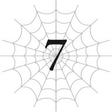

# Chương 7: Bóng tối của Quản trị viên

*(The Administrator’s Shadow)*

---

### --- TRANG 157 ---

Ồ, kể từ khi Kháng Ngoại đạo thăng cấp thành Vô hiệu Dị giáo, liệu việc kích hoạt Phát hiện có còn làm tôi bị đau đầu nữa không nhỉ?

Về bản chất, nó là một đòn tấn công thuộc tính Dị giáo, đúng không? Tôi gọi đó là một đòn tấn công thì có sao không nhỉ?

Ý tôi là, làm gì có chuyện cơn đau dữ dội đến mức xuyên thủng cả Giảm Đau của tôi lại chỉ là một cơn đau đầu thông thường cơ chứ?

Thế nên, nếu tôi có thể triệt tiêu đòn tấn công Dị giáo thường đi kèm với Phát hiện, biết đâu tôi sẽ không còn bị đau đầu nữa?

Rất đáng để thử đấy chứ.

Hùuu… Phùuu. Bắt đầu nào!

Kích hoạt Phát hiện!

…Ồ. Cái này… cái này thực sự quá kinh khủng.

Trước đây tôi chưa từng biết cảm giác này, vì lúc nào cũng bận rộn chống chọi với cơn đau, nhưng…

Hóa ra đây là những gì Phát hiện mang lại khi không gây đau đầu sao?

Lần này, đầu tôi không còn cảm giác như muốn vỡ đôi khi kích hoạt nó nữa.

À, về mặt kỹ thuật thì vẫn có một chút ong ong nhẹ, nhưng nhờ có Giảm Đau, nó nhỏ tới mức không đáng để bận tâm.

Tôi nghĩ cảm giác hiện tại chỉ là một cơn đau đầu thông thường do não bộ phải hoạt động quá công suất mà thôi.

Bởi lượng thông tin mà Phát hiện truyền về cùng một lúc là quá khổng lồ.

`<Độ thuần thục đã đạt mức yêu cầu. Kỹ năng [Xử lý Tính toán LV 8] đã trở thành [Xử lý Tính toán LV 9].>`

`<Độ thuần thục đã đạt mức yêu cầu. Kỹ năng [Tư duy Song song LV 6] đã trở thành [Tư duy Song song LV 7].>`

`<Độ thuần thục đã đạt mức yêu cầu. Kỹ năng [Phát hiện LV 7] đã trở thành [Phát hiện LV 8].>`

### --- TRANG 158 ---

`<Độ thuần thục đã đạt mức yêu cầu. Đạt được kỹ năng [Mở rộng Thần giới LV 1].>`

Có vẻ như tôi vừa nhận được một kỹ năng mới. Cơ mà để lát nữa kiểm tra sau vậy.

Lúc này, tôi chỉ muốn tận hưởng cảm giác tuyệt vời này thêm một chút nữa.

Tôi sướng phát điên vì cuối cùng cũng đã sử dụng thành công Phát hiện.

Nhưng hơn cả thế, tôi hoàn toàn bị choáng ngợp bởi lượng thông tin khổng lồ mà Phát hiện cung cấp.

Nó giống như việc thu thập toàn bộ dữ liệu có sẵn của mọi thứ trong phạm vi nhận thức hiện tại của tôi vậy.

Dòng chảy ma lực, cấu trúc vật chất của vạn vật, luồng chuyển động của không khí… Tất cả đều truyền thẳng vào não tôi.

Cảm giác này gần giống như mình là một đấng toàn tri vậy.

Tôi hiểu rõ mọi thứ xung quanh mình.

Ngay cả những thông tin mà bình thường tôi không thể hiểu nổi, nay cũng trở nên có lý ở một mức độ nào đó khi sử dụng kỹ năng này.

Nhưng bản thân điều đó cũng giống như một đại dương thông tin vậy. Cứ như thể tôi vừa hé mắt nhìn vào một chân lý vũ trụ nào đó.

Và đây mới chỉ là một khoảng không gian nhỏ bé mà tôi đang nhận thức được thôi đấy.

Nó khiến tôi một lần nữa nhận ra quy mô rộng lớn và sự vĩ đại của thế giới xung quanh mình.

Trời ạ, tự dưng tôi lại thấy muốn khóc vì lý do nào đó. Mặc dù tôi cũng không biết loài nhện có khóc được thật không nữa.

Được rồi. Tạm thời tắt Phát hiện đi một chút đã.

Phùuu. Thật là điên rồ. Tôi thậm chí còn không biết cảm xúc này từ đâu ra nữa.

Nếu phải so sánh, tôi sẽ nói nó giống như việc bạn đột nhiên trở nên xúc động khi ngước nhìn lên bầu trời đầy sao vậy. Kiểu kiểu như thế.

A, tôi muốn chìm đắm trong mớ cảm xúc đó lâu hơn chút nữa. Cơ mà tôi vẫn nên tiếp tục di chuyển thì hơn.

Vậy là Phát hiện đã thành công mỹ mãn.

Điều đó có nghĩa là tôi nên duy trì kích hoạt nó liên tục từ giờ trở đi không?

Hừm. Vấn đề là, tôi lo rằng hiệu suất của nó quá cao đến mức có thể gây ra bất tiện.

Ý tôi là, có quá nhiều thông tin đầu vào cùng lúc có thể khiến tôi bị phân tâm và khó tập trung khi chiến đấu hoặc đại loại thế.

### --- TRANG 159 ---

Nhưng biết đâu tôi sẽ quen dần với nó thì sao?

Đúng là bây giờ khi kích hoạt nó tôi thấy hơi ngợp thật, nhưng hồi mới đầu dùng Thẩm định tôi cũng từng bị chóng mặt như say rượu đó thôi. Nếu tôi đã thích nghi được với chuyện đó, thì chắc chắn việc làm quen với cái này cũng dễ như ăn kẹo thôi.

Nên tôi nghĩ mình sẽ luôn bật Phát hiện liên tục, dù ban đầu có thể hơi nguy hiểm một chút.

Nó cũng sẽ giúp tăng cấp độ cho các kỹ năng khác của tôi nữa, nên tôi nghĩ làm vậy là tốt nhất.

Được rồi, bật Phát hiện lên nào.

Ồ. Cái này điên rồ thật sự.

Nhưng tôi không được phép xúc động nữa.

Có lẽ tôi nên bắt đầu bằng việc kiểm tra kỹ năng mình vừa nhận được.

`<Độ thuần thục đã đạt mức yêu cầu. Kỹ năng [Tư duy Song song LV 7] đã trở thành [Tư duy Song song LV 8].>`

`<Độ thuần thục đã đạt mức yêu cầu. Kỹ năng [Mở rộng Thần giới LV 1] đã trở thành [Mở rộng Thần giới LV 2].>`

…Hoặc có lẽ nó sẽ lên cấp trước đã…

Chính xác thì kỹ năng này là gì vậy nhỉ?

Phần mô tả của Kiên trì có nhắc đến một thứ gọi là trường thần giới.

Tôi nhớ hình như Kiên trì cũng giúp mở rộng cái đó đúng không? Vậy đây là phần cộng dồn thêm vào sao?

Có nghĩa là trường thần giới gì đó của tôi đang bành trướng ra khắp mọi nơi rồi hả?

Dù sao thì cứ Thẩm định nó thử xem sao.

`<Mở rộng Thần giới: Mở rộng trường thần giới>`

Nói huề vốn ghê? Cảm ơn nhiều nha.

Đây là lúc để mi trổ tài rồi đó, Thẩm định! Thẩm định kép, xin mờiii!

`<Trường Thần giới: Nơi sâu thẳm nhất trong linh hồn của một sinh vật sống. Đó là nền tảng của mọi sự sống, đồng thời là lãnh vực nương tựa cuối cùng của bản ngã.>`

Hửm? Vẫn không hiểu gì cả.

Thì tôi biết nó là một phần quan trọng của linh hồn hay gì đó rồi, nhưng chuyện gì sẽ xảy ra khi bạn mở rộng nó chứ?

Hừm. Vậy là tôi vẫn chịu chết, không biết nó có tác dụng gì.

### --- TRANG 160 ---

Nhiều hơn thì thường tốt hơn, nhưng theo những gì tôi có thể thấy thì nó chẳng mang lại hiệu quả thực tế nào cả…

`<Độ thuần thục đã đạt mức yêu cầu. Kỹ năng [Xử lý Tính toán LV 9] đã trở thành [Xử lý Tính toán LV 10].>`

`<Điều kiện thỏa mãn. Kỹ năng [Xử lý Tính toán LV 10] đã tiến hóa thành kỹ năng [Xử lý Tốc độ cao LV 1].>`

`<Độ thuần thục đã đạt mức yêu cầu. Kỹ năng [Phát hiện LV 8] đã trở thành [Phát hiện LV 9].>`

Oa, chúng lên cấp nhanh thật đấy!

Tôi đã max cấp Xử lý Tính toán rồi cơ à?

Và giờ nó tiến hóa thành Xử lý Tốc độ cao. Nghe chuẩn bài nâng cấp rồi đấy.

Mà vốn dĩ tôi lấy Phát hiện là với hy vọng dò tìm kẻ địch cơ mà nhỉ?

Nhưng khả năng nhận biết mối nguy hiểm bẩm sinh của tôi vốn đã đủ nhạy bén để giúp tôi sống sót khỏe re mà không cần đến Phát hiện suốt thời gian qua rồi.

Phải nói rằng, việc kết hợp bản năng thiên bẩm đó với sức mạnh của Phát hiện sẽ giúp kỹ năng dò tìm kẻ địch của tôi trở nên hoàn hảo không tì vết.

Giờ thì đố kẻ nào có thể đánh úp được tôi nữa! Thử nhào vô xem nào!

Được rồi, tiếp theo, tôi từng hy vọng Phát hiện sẽ cho tôi khả năng Nhận biết Ma lực.

Nếu những dự đoán của tôi là chính xác, thì khi kết hợp kỹ năng đó với Thao tác Ma lực, cuối cùng tôi sẽ có thể sử dụng được ma pháp. Tôi đoán thế.

Như vậy có nghĩa là cuối cùng tôi cũng có thể khai hỏa các kỹ năng mà mình đã phải đắp chiếu bấy lâu nay, như Ma pháp Vực sâu và Ma pháp Dị giáo!

Nhưng… tôi không còn điểm kỹ năng nào cả! Chết tiệt thật!

Tôi không hề hối hận vì đã chọn Kiên trì, nhưng việc cạn sạch điểm kỹ năng lúc này vẫn thật là cay đắng.

Trời ạ, tôi còn đang tính dành đống điểm tiếp theo để lấy Tà Nhãn nữa chứ!

Giờ phải làm sao đây? Tôi muốn cả hai cơ! Aaaa!

Tôi biết đây là một kiểu rắc rối hơi ngớ ngẩn, nhưng dù vậy, tôi nên chọn cái nào trước đây?!

### --- TRANG 161 ---

`<Độ thuần thục đã đạt mức yêu cầu. Kỹ năng [Phát hiện LV 9] đã trở thành [Phát hiện LV 10].>`

`<Độ thuần thục đã đạt mức yêu cầu. Kỹ năng [Tư duy Song song LV 8] đã trở thành [Tư duy Song song LV 9].>`

Hử? Thật luôn hả? Phát hiện đã max cấp rồi sao?

Ủa? Nhưng sao nó không tiến hóa hay mở khóa thêm kỹ năng mới gì hết vậy?

Thôi nào. Thế này là sao chứ?

Sau bao nhiêu công sức tôi bỏ ra để kích hoạt được nó…

Ý tôi là, nó chắc chắn đã mang lại quả ngọt, nhưng nói thật là tôi còn muốn nhiều hơn thế nữa cơ.

Dù không thể mạnh lên đến mức đánh bại được một con địa long, ít nhất tôi cũng muốn có thể trốn thoát một cách an toàn chứ!

Tôi thực sự không nhận được thêm gì sao?

`<Rèèè…… rèèè…>`

Hửm? Tiếng gì thế?

…Hay là tôi nghe nhầm ta?

Mà thôi kệ đi, than vãn cũng chẳng ích gì.

Giải pháp đơn giản nhất là tiếp tục mạnh lên.

Nếu tôi cứ tiếp tục cố gắng cải thiện bản thân, ít nhất tôi có thể đạt đến cảnh giới trốn thoát thành công trước những kẻ thù cực mạnh. Tôi quyết định rồi: Tôi sẽ nỗ lực hết mình để mạnh lên.

Bước một là lên cấp.

Từ giờ tôi sẽ tích cực đi săn quái vật.

Bước hai là kỹ năng.

Có vẻ như tôi có thể nâng cấp kỹ năng chỉ bằng cách di chuyển xung quanh.

Chẳng hạn như Thẩm định, Phát hiện, Tiên kiến và Gia tốc Tư duy.

Tôi đã max cấp Phát hiện rồi thật, nhưng việc duy trì nó vẫn giúp rèn luyện các kỹ năng khác.

Nên tôi sẽ luôn bật nó cho đến khi tất cả các kỹ năng kia đạt mức tối đa.

Đồng thời, tôi cũng nên bắt đầu rèn luyện các kỹ năng khác có thể tăng cấp khi di chuyển.

Lựa chọn an toàn nhất chắc là năm kỹ năng tăng cường giác quan.

Nếu tôi cứ nheo mắt quan sát hay khịt mũi ngửi ngửi lung tung khi đang đi bộ, chúng chắc chắn sẽ tăng cấp trong nháy mắt thôi.

### --- TRANG 162 ---

Tôi có vài kỹ năng có vẻ sắp đạt mức tối đa rồi, nên tôi sẽ bắt đầu với chúng trước.

Và còn một việc nữa.

Tôi không muốn vừa đi vừa làm việc này. Tôi muốn dừng lại ở đâu đó và dành toàn bộ sự chú ý cho nó.

Đó chính là luyện tập Thao tác Ma lực.

Nghĩ kỹ thì, tôi hoàn toàn có thể sở hữu các kỹ năng mà không cần tốn điểm kỹ năng nếu tích lũy đủ độ thuần thục.

Trong trường hợp đó, tôi nên tiết kiệm điểm kỹ năng của mình để mua Tà Nhãn, vì tôi hoàn toàn mù tịt không biết làm sao để tăng độ thuần thục cho nó cả, và cố gắng tự mình luyện tập Thao tác Ma lực.

Nhờ có Ngài Phát hiện, giờ tôi đã có thể cảm nhận được ma lực.

Nếu tôi đủ tập trung, tôi có thể nắm bắt được dòng chảy của ma lực.

Chỉ cần tôi tìm ra cách để thao túng thứ chất lỏng đó bằng cách nào đó (hoặc ít nhất là cố gắng làm vậy đủ lâu), tôi sẽ có thể đạt được kỹ năng này thông qua việc tích lũy độ thuần thục một cách tự nhiên. Hy vọng thế.

Một khi làm được điều đó, cuối cùng tôi cũng có thể bắt tay vào luyện tập ma pháp.

Nói đi cũng phải nói lại, tôi phải luôn khắc cốt ghi tâm rằng mục tiêu chính của mình vẫn là vượt qua Tầng Trung và quay trở lại Tầng Thượng.

Lên cấp và nâng cấp kỹ năng hay mấy thứ tương tự chỉ là những việc tôi làm trên đường đi mà thôi.

Nên tôi không được phép dừng bước chỉ để tập trung vào những thứ đó.

Bất cứ việc gì tôi làm cũng phải là thứ có thể thực hiện được ngay cả khi đang di chuyển.

Tôi không định cắm rễ ở Tầng Trung này. Tôi chỉ là khách qua đường mà thôi.

Không được quên điều đó.

`<Độ thuần thục đã đạt mức yêu cầu. Kỹ năng [Gia tốc Tư duy LV 3] đã trở thành [Gia tốc Tư duy LV 4].>`

`<Độ thuần thục đã đạt mức yêu cầu. Kỹ năng [Tiên kiến LV 3] đã trở thành [Tiên kiến LV 4].>`

Tốt lắm, tốt lắm. Nhờ danh hiệu Kẻ Thống Trị Kiêu Hãnh, các kỹ năng tinh thần của tôi lên cấp nhanh như gió vậy.

Cứ thế mà phát huy thôi.

Vì tôi cũng có danh hiệu Kẻ Thống Trị Kiên Trì nữa, nên các kỹ năng kháng tính của tôi

### --- TRANG 163 ---

cũng sẽ thăng cấp tương đối dễ dàng, nhưng hầu hết chúng không phải là thứ tôi có thể luyện tập khi đang di chuyển.

Về mặt kỹ thuật, tôi chắc chắn có thể tích lũy độ thuần thục cho rất nhiều loại kháng tính bằng các đòn tấn công tự bạo: Kháng Kịch độc và Kháng Tê liệt bằng Tổng hợp Độc; còn Kháng Cắt, Kháng Tác động, Kháng Hủy diệt, Kháng Thối rữa và Kháng Sốc (tôi cá là có tồn tại cái này) bằng cách sử dụng Tơ Đa Năng. Nhưng có lẽ tôi nên để dành chuyện đó cho đến khi định cư ổn định ở một nơi nào đó an toàn đã.

Tầng Trung, nơi tốc độ hồi phục của tôi siêu chậm và không có lấy một chỗ tử tế để nghỉ ngơi, hoàn toàn không phải là nơi thích hợp cho trò tự bạo đó.

Tôi muốn tăng các kỹ năng cường hóa chỉ số của mình càng nhanh càng tốt, nhưng đó cũng là chuyện tốt nhất nên làm khi tôi có thể dừng chân ở đâu đó.

Chúng có lẽ sẽ tự lên cấp trong chiến đấu thôi, nhưng ngoài ra, tôi sẽ phải tự tập thể dục cường độ cao hoặc đại loại thế nếu muốn tự nâng cấp chúng.

Nếu tôi có thời gian và sức lực để làm việc đó, thì thà tôi dùng nó để tiếp tục di chuyển còn hơn.

Trước mắt, tốt nhất là cứ tập trung vào năm kỹ năng giác quan có thể rèn luyện một cách thụ động kia.

Tăng cường Thị giác đang ở level 9, gần max rồi, nên tôi sẽ bắt đầu với nó trước.

Đã được một thời gian kể từ khi tôi tiến hóa và bắt đầu hành trình vượt qua Tầng Trung.

Tôi đã quét sạch mọi con quái vật lọt vào tầm mắt của mình, nhờ thế mà cấp độ của tôi đã tăng vọt.

Không ai có thể tin nổi các chỉ số của tôi đang tăng trưởng nhanh đến mức nào đâu.

Cái phần mô tả chủng tộc quả thực không hề nói khoác khi bảo tôi có "năng lực chiến đấu cao".

Trung bình, mỗi chỉ số của tôi tăng khoảng hai mươi điểm sau mỗi lần lên cấp.

Ngay cả khi đã tính đến tỉ lệ tăng trưởng được cộng thêm từ Kiêu hãnh và các kỹ năng tăng chỉ số riêng lẻ, tốc độ tăng trưởng chỉ số của tôi vẫn vô cùng điên rồ.

Nếu cứ tiếp tục tiến bộ thế này, đống chỉ số thảm hại ngày xưa của tôi sẽ hoàn toàn chỉ còn là quá khứ mà thôi.

Bên cạnh cấp độ và chỉ số, các kỹ năng của tôi cũng đã có những bước tiến vượt bậc.

Mặc dù vậy, tôi đã cố gắng dán mắt vào đủ thứ mọi nơi, nhưng kỹ năng Tăng cường Thị giác vẫn chưa hề nhúc nhích.

Tôi đoán việc nâng cấp một kỹ năng từ level 9 lên level 10 đúng là cần phải có thời gian rồi.

### --- TRANG 164 ---

Nhưng tôi đã gặt hái được những thành công vang dội ở các kỹ năng khác!

Đầu tiên, Vô thanh hiện tại đã lên level 3. Sức mạnh ninja được nâng cấp!

Gia tốc Tư duy và Tiên kiến đều đã đạt level 5, giúp khả năng né tránh của tôi cũng được tăng cường!

Đến cả Kháng Lửa cuối cùng cũng có tiến triển, đạt mốc level 3.

Theo lý thuyết, Kiên trì sẽ giúp việc tích lũy độ thuần thục cho các kỹ năng kháng tính trở nên dễ dàng hơn, nhưng cảm giác vẫn cứ như phải mất cả thế kỷ vậy.

Rốt cuộc là tôi yếu với lửa đến mức nào thế hả trời? Mà thực ra, bây giờ tôi đã là một chủng tộc khác rồi, liệu chuyện đó có còn đúng không nhỉ?

Không biết các kháng tính khác của tôi ngoài lửa có thay đổi gì không nữa…

Nhưng tôi chẳng có cách nào để kiểm tra cả, nên suy đoán cũng vô ích.

Dẫu sao thì, ngay từ đầu tôi cũng đâu phải kiểu tanker phòng ngự trâu bò gì, nên kháng tính có thay đổi một chút chắc cũng chẳng làm nên trò trống gì đâu.

Tuy nhiên, vì khả năng phòng ngự của tôi đang bắt đầu được cải thiện, việc nắm rõ các kháng tính của mình cũng là điều tốt.

Biết đâu ngoài lửa ra tôi còn có những điểm yếu khác thì sao. Khổ nỗi tôi không có cách nào để tìm hiểu chuyện đó cả…

Cuối cùng nhưng chắc chắn không kém phần quan trọng là Tư duy Song song.

Kỹ năng này đã đạt level 10 và tiến hóa.

Hình thái mới của nó được gọi là Phân thân Tư duy!

Đây thực sự là một kỹ năng siêu cấp tiện lợi.

Đúng như tên gọi của nó, về cơ bản là giờ tôi đang sở hữu nhiều tâm trí khác nhau.

Với Tư duy Song song, cảm giác giống như tôi đang dùng một bộ não duy nhất để suy nghĩ về nhiều việc khác nhau cùng một lúc; nhưng với Phân thân Tư duy, bộ não của tôi thực sự đã được phân tách thành các phân khu độc lập. Gần giống như việc chia tách nhân cách vậy.

Cả hai đều là tôi, nhưng mỗi bên là một thực thể ý thức riêng biệt với những suy nghĩ độc lập của riêng mình.

Và điều đó được cộng dồn trên nền tảng những gì Tư duy Song song vốn đã cho phép tôi làm.

Nó đã giúp nhân đôi năng lực nhận thức của tôi một cách hiệu quả. Siêu cấp tiện lợi luôn.

Kỹ năng này giống như một phần hiện thực hóa điều ước mà lũ trẻ con thường ước, và cả người lớn cũng vậy mỗi khi họ bị dí deadline ngập đầu: "Ước gì có thêm một tôi nữa..."

Kiểu như, một "tôi" sẽ làm việc và học tập chăm chỉ trong khi "tôi" kia tha hồ đi chơi bời phá phách vậy.

Mặc dù vì cả hai đều là tôi như nhau, nên hễ một bên muốn lười biếng ham chơi, bên kia chắc chắn sẽ nổi điên lên cho mà xem.

### --- TRANG 165 ---

Dù vậy, điều đó có nghĩa là tôi có thể chia đôi công việc vốn phải tự mình gánh vác cho hai phiên bản của tôi, nên thế vẫn tốt hơn nhiều.

Khi cấp độ kỹ năng tăng lên, biết đâu tôi sẽ còn tạo ra được nhiều phân thân hơn nữa thì sao.

Tuy nhiên, tại một thời điểm nhất định, chỉ có một trong hai phân thân có thể điều khiển cơ thể của tôi mà thôi.

Chính vì thế, tôi quyết định một nửa sẽ chịu trách nhiệm vận hành cơ thể, trong khi nửa còn lại phụ trách xử lý thông tin từ Thẩm định và Phát hiện, v.v.

Bằng cách phân công công việc thế này, tôi có thể giảm bớt gánh nặng cho mỗi nửa, giúp mỗi bên có thể tập trung tối đa vào nhiệm vụ của mình.

Các bạn biết đấy, khi đang chiến đấu, tầm nhìn của chúng ta thường có xu hướng bị thu hẹp lại rất nhiều đúng không? Những người từng học võ chắc chắn sẽ hiểu tôi đang nói gì chứ?

Cá nhân tôi nghĩ đó là hệ quả của trạng thái vô cùng căng thẳng và tập trung cao độ.

Tuy nhiên, giờ đây tôi đã có một tâm trí riêng chuyên trách việc xử lý thông tin, tôi sẽ không còn phải lo lắng về vấn đề đó nữa.

Bằng cách đó, tôi có thể tập trung vào việc thu thập thông tin và giao phần việc nặng nhọc cho não cơ thể.

Trông cậy cả vào cậu đấy, não cơ thể!

Rõ như ban ngày, não thông tin!

Thấy chưa? Giờ tôi thậm chí còn có thể tự trò chuyện với chính mình nữa cơ.

Và vì cả hai đều là tôi, việc chia sẻ dữ liệu được thực hiện một cách tuyệt đối an toàn và tức thì.

Không có phân biệt bản gốc hay bản phụ trong thiết lập này cả. Cả hai đều là tôi. Tôi là tôi, thế nên tôi chính là tôi!

Vâng, tôi biết chứ. Nghe chẳng có lý gì cả.

Kiểu như, tôi thì vẫn sống khỏe re đấy thôi, nhưng tôi cá là một số người sẽ bắt đầu nghi ngờ định nghĩa về bản ngã của chính mình nếu họ làm điều tương tự như thế này.

Các bạn biết đấy, kiểu như bị mất phương hướng không biết đâu mới là bản thể thực sự rồi hóa điên hóa dại luôn ấy.

Tôi hoàn toàn có thể hình dung ra viễn cảnh đó. Nếu thế thật, thì phải chăng tôi là một kẻ siêu cấp đặc biệt mới có thể xử lý chuyện này một cách bình thường như cân đường hộp sữa sao? Ồ, chắc là không phải đâu.

Oa. Trong lúc não thông tin của tôi còn đang mải suy nghĩ vẩn vơ về mấy chuyện đó, não cơ thể của tôi đã tiện tay tiễn một con quái vật lên đường rồi.

Làm tốt lắm, tôi ơi.

Chuyện nhỏ thôi mà, tôi ơi!

Lần này, tôi đã thử nghiệm kỹ năng Hủ thực Công kích mới của mình, nhưng quả thực là không thể dùng nổi.

Ý tôi là, nó không phải là phế vật. Sức sát thương của đòn đánh thực sự vô cùng kinh hoàng.

Kiểu như, quá mạnh so với một kỹ năng level 1.

### --- TRANG 166 ---

Nó mạnh một cách thái quá. Ý tôi là, nó biến con quái vật thành tro bụi chỉ bằng một đòn duy nhất! Chẳng phải thế là quá dị hợm sao?

Đó thực sự là ý nghĩa của từ "hủ thực" (thối rữa/phân hủy) sao? Nó không phải kiểu ăn mòn hay gì đó à?

Cái này đã vượt xa định nghĩa về thức ăn bị ôi thiu rồi, nó đi thẳng một mạch vào lãnh vực phân rã vật chất luôn. Không đời nào tôi muốn dây dưa với một thuộc tính "chi phối sự thối rữa của cái chết" đâu.

Mới level 1 mà đã quá bá đạo rồi.

Không biết chuyện gì sẽ xảy ra khi nó tăng cấp nữa đây?

Dù sao thì, có hai lý do khiến tôi không thể sử dụng nó thường xuyên.

Thứ nhất, nó không để lại bất kỳ mảnh xác nào. Nói cách khác, không có thức ăn.

Đúng là tôi vẫn nhận được điểm kinh nghiệm như thường, nhưng điều đó hoàn toàn triệt tiêu một nửa động lực đi săn quái vật của tôi rồi còn đâu.

Không có thịt để bỏ bụng. Cả nghĩa đen lẫn nghĩa bóng.

Lý do thứ hai còn tồi tệ hơn nhiều.

Chính tôi cũng phải chịu sát thương từ nó.

Hãy nhìn vào cái chân lưỡi hái mà tôi vừa dùng để tung ra đòn Hủ thực Công kích xem. Phần lưỡi dao đang vỡ ra từng mảnh kìa! Và tôi đã bị mất HP…

Đòn tấn công này chẳng khác nào một quả bom tự sát cả!

Nên dù uy lực của nó cực kỳ cao, cái giá phải trả cũng đắt đỏ không kém.

Nếu tôi rơi vào tình huống thập tử nhất sinh, bắt buộc phải dốc toàn lực để sinh tồn, có lẽ tôi sẽ dùng đến nó, nhưng ngoài ra thì việc lãng phí nó lên lũ tép riu này hoàn toàn vô nghĩa.

Đặc biệt là khi tôi đang ở Tầng Trung, nơi tốc độ tự hồi phục của tôi chậm như rùa bò.

Trời ạ, không biết cái lưỡi hái này khi nào mới lành lại đây?

Tôi chắc cũng sắp lên cấp rồi, nên chắc chắn nó sẽ tự sửa chữa lúc đó thôi, nhưng trong lúc này, tôi sẽ không thể sử dụng cái chân này trong trận chiến tiếp theo được nữa.

Dù sao thì tôi vẫn còn Tổng hợp Độc, nên đó không phải vấn đề gì quá lớn miễn là tôi không đụng độ phải mấy con thú dữ như con lươn kia.

Dù sao thì tôi cũng mới bắt đầu sử dụng chân lưỡi hái gần đây thôi. Vũ khí chính của tôi ở Tầng Trung vẫn là Tổng hợp Độc.

Suy cho cùng, chỉ riêng việc chạm vào lũ quái vật Tầng Trung thôi cũng đủ làm tôi bị thương rồi.

Nếu tôi sử dụng lưỡi hái, tôi có thể nâng cấp các kỹ năng như Tăng cường Chém cắt, nhưng điều đó vẫn đồng nghĩa với việc phải chịu sát thương phản chấn.

Chưa kể, khi tôi chém quái vật bằng lưỡi hái, nội tạng của chúng sẽ rơi vãi lung tung, khiến việc ăn uống trở nên khó khăn hơn nhiều.

Thế nên, não cơ thể này, nhớ sử dụng Tổng hợp Độc cho con mồi tiếp theo đấy nhé, rõ chưa?

### --- TRANG 167 ---

Rồi rồi, rõ rồi thưa não thông tin.

Trời ạ, Phân thân Tư duy quả thực là tiện lợi vô cùng.

Nếu tôi có thêm hai cơ thể đi kèm nữa thì tôi đã có thể chơi trò phân thân chi thuật rồi! Đó mới đúng là giấc mơ của mọi game thủ chứ.

Ồ, nhưng vì cả hai đều là bản thể chính của tôi, nên sẽ đau đớn lắm nếu một trong hai bị tiêu diệt cho xem.

Trời ạ, thế thì tệ thật đấy.

Miễn là còn một cơ thể sống sót thì tôi vẫn sẽ tồn tại, nhưng chẳng phải như thế có nghĩa là tôi sẽ thực sự trải nghiệm cảm giác cái chết hay sao?

Hừm. Đó không phải là thứ tôi thực sự muốn thử nghiệm chút nào.

Thực ra, về mặt kỹ thuật thì tôi đoán mình đã từng trải qua nó một lần rồi, nhưng vì tôi hoàn toàn không có ký ức gì về chuyện đó nên coi như không tính đi.

Nên là đừng có làm gì khiến chúng ta mất mạng đấy nhé, não cơ thể?

Thôi nào, não thông tin. Cậu biết thừa là tớ không bao giờ làm thế mà!

Cậu nói phải, cậu nói phải.

`<Độ thuần thục đã đạt mức yêu cầu. Kỹ năng [Tăng cường Thị giác LV 9] đã trở thành [Tăng cường Thị giác LV 10].>`

`<Điều kiện thỏa mãn. Kỹ năng [Thị giác Viễn vọng LV 1] đã được rút ra từ kỹ năng [Tăng cường Thị giác LV 10].>`

Tuyệt vời! Cuối cùng tôi cũng đã max cấp kỹ năng Tăng cường Thị giác.

Vậy là phần thưởng là một kỹ năng mới sao?

Tiện tay Thẩm định nó ngay lập tức xem công dụng thế nào nào.

`<Thị giác Viễn vọng: Cho phép người dùng phóng to hình ảnh của các vật thể ở xa>`

Được rồi, vậy là đúng như tên gọi của nó nhỉ?

Hừm. Không biết có nên cơm cháo gì không đây.

Năm kỹ năng tăng cường giác quan vốn là những cải thiện khá cơ bản, nhưng các kỹ năng phái sinh từ chúng xem ra cũng có vẻ khá giản dị.

Mà thôi, cứ thử dùng xem sao đã.

Được rồi, não cơ thể, kích hoạt Thị giác Viễn vọng xem nào!

Nhận lệnh. Kích hoạt Thị giác Viễn vọng!

Ồ? Ồ hử? Ồồồ?!

Oa, cái này đỉnh thật sự. Tôi xin lỗi vì đã chê mi giản dị nhé.

Trường nhìn của tôi lúc này hiển thị một hình ảnh phóng to giống như kính viễn vọng, đồng thời vẫn giữ nguyên phạm vi quan sát ban đầu của tôi cùng một lúc.

Tôi cứ tưởng toàn bộ tầm nhìn của mình sẽ bị phóng to lên, giống như khi nhìn qua một ống nhòm, nhưng hóa ra tôi có thể chỉ kích hoạt nó ở một mắt duy nhất.

Bình thường, việc tiếp nhận hai luồng hình ảnh hoàn toàn khác nhau cùng lúc thế này sẽ cực kỳ gây lú lẫn, nhưng các bạn nghĩ các bạn đang nói chuyện với ai cơ chứ? Tôi vốn đã là một gói combo "hai trong một" rồi mà.

Nếu tôi phân chia công việc giữa hai phân khu tư duy, chuyện đó hoàn toàn không có gì khó khăn cả.

Vì hiện tại nó mới chỉ ở level 1, nên phạm vi và mức độ phóng đại vẫn còn khá thấp, nhưng nó có thể sẽ cực kỳ hữu dụng một khi được nâng cấp lên cao hơn.

Chẳng hạn như, tôi có thể sử dụng Phát hiện để xác định vị trí kẻ địch đang ẩn nấp, sau đó dùng Thị giác Viễn vọng để zoom cận cảnh vào vị trí đó trong khi các mắt còn lại vẫn canh chừng những gì diễn ra ngay trước mặt.

Ừm, ừm. Và đây dường như cũng là một kỹ năng thụ động khác, vì nó không hề tiêu hao MP hay gì cả.

Tôi sẽ luôn bật nó liên tục để tăng cấp độ cho nó, vì biết đâu nó sẽ có rất nhiều tiềm năng trong tương lai đấy.

Này, não thông tin ơi, xin lỗi vì đã cắt ngang lúc cậu đang hứng chí nhé, nhưng mà…

Có chuyện gì thế, não cơ thể?

Tớ vừa phát hiện ra con mồi thông qua góc nhìn của Thị giác Viễn vọng rồi này.

Trông kìa! Thành viên mới vừa gia nhập đã lập công ngay rồi đấy.

Có muốn thịt nó luôn không?

Chuyện đó còn phải hỏi sao?

Rõ, thưa sếp! Lên đường thôi anh em!

Tôi lập tức lẻn đến gần kẻ địch.

Vì tôi không thể sử dụng một bên lưỡi hái sau đòn Hủ thực Công kích tự sát vừa rồi, tôi sẽ chỉ đơn giản là tẩm quất cho nó một trận bằng Kịch Độc Nhện bằng cách sử dụng Tổng hợp Độc.

HP của con quái vật tụt không phanh trong nháy mắt. Như thường lệ, độc của tôi mạnh đến mức đáng sợ.

`<Cấp độ kinh nghiệm đã đạt mức yêu cầu. Cá thể Zoa Ele đã tăng từ LV 2 lên LV 3.>`

`<Tất cả các chỉ số cơ bản đều tăng.>`

`<Đã nhận được điểm thưởng tăng cấp độ thuần thục kỹ năng.>`

`<Độ thuần thục đã đạt mức yêu cầu. Kỹ năng [Mở rộng Tầm nhìn LV 2] đã trở thành [Mở rộng Tầm nhìn LV 3].>`

`<Độ thuần thục đã đạt mức yêu cầu. Kỹ năng [Sinh mệnh LV 9] đã trở thành [Sinh mệnh LV 10].>`

### --- TRANG 169 ---

`<Điều kiện thỏa mãn. Kỹ năng [Sinh mệnh LV 10] đã tiến hóa thành kỹ năng [Trường thọ LV 1].>`

`<Đã nhận được điểm kỹ năng.>`

Ồ, tuyệt quá, tôi lên cấp rồi.

Có nghĩa là tôi được lột xác, vậy là cái chân lưỡi hái của tôi đã hồi phục như mới!

Thêm vào đó, một trong các kỹ năng tăng chỉ số của tôi cuối cùng cũng đã tiến hóa.

Làm việc đi nào, Thẩm định.

`<Trường thọ: Tăng HP thêm 10 lần số cấp độ của kỹ năng. Đồng thời, lượng tăng trưởng của chỉ số này mỗi khi lên cấp tăng thêm bằng số cấp độ của kỹ năng.>`

Đúng như tôi nghĩ, nó thuộc cùng một danh mục với Cự lực.

Có nghĩa là nếu các kỹ năng chỉ số còn lại của tôi tiến hóa, tỉ lệ tăng trưởng của chúng cũng sẽ tăng lên theo sao?

Điều đó thực sự khiến tôi muốn nâng cấp chúng ngay lập tức, nhưng chuyện đó đành phải gác lại cho đến khi tôi vượt qua được Tầng Trung đã.

Tôi chắc chắn muốn tìm một nơi nào đó an toàn càng sớm càng tốt.

Và khoan đã, nhìn xem nào!

Lên cấp đồng nghĩa với việc tôi hiện tại đang có 100 điểm kỹ năng! Tuyệt vời ông mặt trời!

Kể từ khi tiến hóa, số điểm kỹ năng tôi nhận được sau mỗi cấp đã tăng lên thành 50 điểm.

Trước đây chỉ có 20 điểm thôi, nên đây thực sự là một cú nâng cấp lớn.

Có nghĩa là chỉ cần lên cấp hai lần sau khi tiến hóa, tôi đã có 100 điểm rồi.

Giờ thì, không biết đống kỹ năng Tà Nhãn mà tôi hằng ao ước đã được thêm vào danh sách chưa nhỉ?

`<Nguyền Rủa Tà Nhãn (100): Gây sát thương thuộc tính nguyền rủa lên bất kỳ thứ gì trong tầm nhìn của người sở hữu>`

`<Hủy Diệt Tà Nhãn (100): Gây sát thương thuộc tính thối rữa/phân hủy lên bất kỳ thứ gì trong tầm nhìn của người sở hữu>`

`<Tê Liệt Tà Nhãn (100): Gây sát thương thuộc tính tê liệt lên bất kỳ thứ gì trong tầm nhìn của người sở hữu>`

`<Hóa Đá Tà Nhãn (100): Gây sát thương thuộc tính hóa đá lên bất kỳ thứ gì trong tầm nhìn của người sở hữu>`

`<Khó Chịu Tà Nhãn (100): Gây hiệu ứng ngoại đạo "Khó chịu" lên bất kỳ thứ gì trong tầm nhìn của người sở hữu>`

`<Ảo Ảnh Đau Đớn Tà Nhãn (100): Gây hiệu ứng ngoại đạo "Ảo đau" lên bất kỳ thứ gì trong tầm nhìn của người sở hữu>`

`<Phát Điên Tà Nhãn (100): Gây hiệu ứng ngoại đạo "Phát điên" lên bất kỳ thứ gì trong tầm nhìn của người sở hữu>`

### --- TRANG 170 ---

`<Mê Hoặc Tà Nhãn (100): Gây hiệu ứng ngoại đạo "Mê hoặc" lên bất kỳ thứ gì trong tầm nhìn của người sở hữu>`

`<Thôi Miên Tà Nhãn (100): Gây hiệu ứng ngoại đạo "Thôi miên" lên bất kỳ thứ gì trong tầm nhìn của người sở hữu>`

`<Sợ Hãi Tà Nhãn (100): Gây hiệu ứng ngoại đạo "Sợ hãi" lên bất kỳ thứ gì trong tầm nhìn của người sở hữu>`

Oa. Tôi thực sự có thể mua chúng rồi này.

Mấy kỹ năng này chắc chắn trước đây không hề có trong danh sách.

Lại còn có cả đống loại khác nhau nữa chứ. Làm sao tôi có thể chọn chỉ một cái bây giờ? Ca này khó đây.

Này, não thông tin ơi.

Có chuyện gì thế, não cơ thể?

Chẳng phải sẽ tốt hơn nếu chúng ta mua nhiều hơn một cái sao?

Hử? Ý cậu là sao?

Ý tớ là, cậu biết chúng ta có tám mắt đúng không?

Thì sao?

Thế thì chẳng phải có nghĩa là chúng ta có thể sử dụng Tà Nhãn ở cả tám mắt cùng một lúc sao?

?! Cậu là cái kiểu thiên tài gì thế hả?!

Hắc hắc hắc. Đúng thế, tớ là thiên tài mà lị.

Trời ạ. Hóa ra tôi là một thiên tài! Thế thì tôi có thể làm mưa làm gió ở cái thế giới này rồi!

Đúng vậy đấy. Chẳng phải sẽ cực kỳ bá đạo nếu sử dụng tám loại Tà Nhãn khác nhau cùng một lúc sao?

Úi chà. Cái này điên rồ thật sự. Nó giống như việc mở ra cả một chân trời cơ hội mới vậy.

Mặc dù, một mắt đang bận dùng Thị giác Viễn vọng rồi, nên chỉ còn lại bảy mắt thôi.

Chúng ta cũng nên chừa lại mắt để quan sát bình thường nữa chứ, nên chắc là sáu mắt nhỉ?

Tớ nghĩ vậy. Nên trước mắt chúng ta cứ chọn một cái trước, rồi tích thêm điểm kỹ năng để mua thêm năm cái nữa sau nhé?

Nghe được đấy. Vậy thì não cơ thể ơi, chúng ta nên lấy loại Tà Nhãn nào đầu tiên đây?

Tớ nghĩ chúng ta nên chọn một thuộc tính mà mình chưa sở hữu, nên là Nguyền rủa hoặc Hóa đá đi. Mấy loại thuộc tính Ngoại đạo kia có vẻ thích hợp để dùng lên con người hơn là để chiến đấu với quái vật.

Lập luận sắc bén đấy. Vậy tôi nghĩ tôi sẽ chọn Nguyền rủa. Hóa đá có vẻ cần khá nhiều thời gian để phát huy tác dụng, dựa trên kinh nghiệm của chúng ta với con thằn lằn đáng ghét ở Tầng Thượng kia.

### --- TRANG 171 ---

Nhưng bù lại thì nó sẽ mạnh hơn tương ứng với thời gian tích tụ. Nhưng cậu nói đúng đấy. Nguyền rủa sẽ an toàn hơn.

Tôi quả thực là sáng suốt mà. Tôi luôn biết mình đang nói gì.

Vậy tôi sẽ lấy Nguyền Rủa Tà Nhãn nhé.

`<Nguyền rủa: Làm suy yếu tất cả các giá trị chỉ số và gây sát thương lên HP, MP và SP>`

Đã sở hữu Nguyền Rủa Tà Nhãn level 1! Quá đã.

Rõ ràng là tôi phải đi tìm một con quái vật để test hàng ngay lập tức rồi!

Biết đâu thông tin từ Ngài Phát hiện có thể giúp tôi việc này đấy.

Hừm. Hừm, hừm, hừm. Có vẻ như có thứ gì đó ở đằng kia.

Hiện tại khoảng cách vẫn còn quá xa để có được thông tin chi tiết, nhưng dù nó là gì đi nữa thì có vẻ như nó đang ở trên cạn.

Hoàn hảo. Tôi đã tìm thấy con chuột bạch cho mình rồi.

Ồ, đó là một con ếch tiến hóa.

Trời đất, đúng là gợi nhớ kỷ niệm xưa mà. Gã này trông giống như phiên bản nâng cấp của mấy con ếch tôi vẫn thường ăn ngày xưa vậy.

Trông nó có vẻ không mạnh hơn lũ hồi đó là bao, nhưng tôi đoán nó tiến hóa là để thích nghi với môi trường Tầng Trung. Nó thậm chí còn có Vô hiệu Nhiệt nữa cơ.

Bên cạnh đó, việc nó có Dạ Nhãn bất kể ánh sáng đỏ rực liên tục từ dung nham xung quanh khiến tôi phải giả định rằng nó vốn đến từ Tầng Thượng.

Dù sao thì ở Tầng Thượng và Tầng Hạ cũng đều là một màu tối tăm cả mà.

Biết đâu nó bị lạc đường rồi không tìm thấy lối về, nên đành phải tiến hóa để sinh tồn.

Tôi hy vọng không có con quái vật Tầng Hạ nào đi lạc vào đây giống như thế này.

Nếu một trong những sinh vật đáng sợ đó tiến hóa để thích nghi với môi trường Tầng Trung thì… Ôi thôi, xin kiếu.

Ngoài ra, bây giờ khi nhìn thấy các kỹ năng của con ếch, có vẻ như đống "đòn phun độc" của nó thực chất là Tổng hợp Độc, giống hệt của tôi.

Có vẻ như nó sử dụng kỹ năng Phóng ra để bắn độc qua không trung.

Ồ… Tôi cũng muốn tự mình sở hữu kỹ năng đó quá đi mất.

Khi đó tôi có thể bắn ra những bãi độc khiến đống đòn tấn công yếu ớt của con ếch này phải hít khói.

Không biết tôi có thể tích lũy độ thuần thục cho kỹ năng đó bằng cách bắn tơ ra từ mông hay gì đó tương tự không nhỉ?

Này não thông tin ơi. Trong lúc cậu còn đang bận rộn với mấy cái suy nghĩ

### --- TRANG 172 ---

ngớ ngẩn đó, tớ đã tiện tay chế ra độc tê liệt và trói chặt con ếch lại rồi nhé.

Ồ, làm tốt lắm não cơ thể.

Giờ chúng ta có thể thử nghiệm Nguyền Rủa Tà Nhãn rồi.

Được rồi, kích hoạt Tà Nhãn!

Ừm. Có vẻ như nó đang hoạt động trơn tru đấy chứ.

Vậy cơ chế hoạt động của cái này thế nào đây? Ồ… Ồ!

HP, MP và SP của con ếch đang giảm dần một cách chậm rãi.

Vì hiện tại nó mới chỉ ở level 1, nên tốc độ chậm như vậy cũng là hợp lý thôi.

Cả thanh SP màu vàng và màu đỏ của nó đều đang giảm xuống, nhưng thanh màu vàng tự hồi phục nhanh hơn lượng sát thương gây ra, nên coi như không có tác dụng gì ở đó cả.

Liệu một khi kỹ năng tăng cấp, lượng sát thương gây ra có vượt qua tốc độ hồi phục không nhỉ?

Khi đó tôi có thể khiến đối thủ rơi vào trạng thái thở dốc liên tục không ngừng sao?

Ồ, nghe đáng sợ thật đấy.

Nhưng tôi đoán nó sẽ cạn sạch HP và lăn ra chết trước khi điều đó kịp xảy ra mất thôi.

Dù sao thì lượng HP và SP thường cũng tương đương nhau mà.

Ồ, các chỉ số của nó cũng đang giảm xuống kìa.

Có một ô nhỏ bên cạnh các giá trị số hiển thị chữ "đang giảm".

Nó cũng hiển thị giá trị tối đa bình thường của mỗi chỉ số trong ngoặc đơn bên cạnh các con số hiện tại nữa.

Ồ-hô-hô. Thì ra đây là giao diện khi bạn đánh trúng đối thủ bằng một đòn tấn công giảm chỉ số sao.

Nhìn thế này quả thực rất dễ để nhận biết tác dụng của lời nguyền.

Thẩm định thân yêu của tôi lúc nào cũng đáng tin cậy nhất.

Dù sao thì, có vẻ như Tà Nhãn không phải là kỹ năng thụ động, điều mà tôi vốn đã biết là không nên mơ mộng hão huyền rồi. MP của tôi đang giảm xuống.

Nhưng tốc độ tiêu hao không nhanh cho lắm. Khoảng 1 điểm mỗi mười giây.

Còn con ếch thì có vẻ cứ mỗi năm giây lại chịu 1 điểm sát thương, nên tôi đoán thế này là khá hiệu quả đấy chứ?

Với lượng MP hiện tại của mình, tôi có thể duy trì kích hoạt nó trong khoảng năm mươi phút, nên đối với tôi thế là cực kỳ kinh tế rồi.

Thêm vào đó, một khi nó thăng cấp, tôi chắc chắn nó sẽ gây sát thương nhanh hơn nhiều.

Ồ, có vẻ như hiệu ứng tê liệt đang dần biến mất kìa.

…Không, khoan đã, não cơ thể đã nhanh tay bồi thêm một phát Tổng hợp Độc nữa rồi. Tuyệt vời tôi ơi. Lúc nào cũng phản xạ nhanh như chớp.

Hừm. HP của nó và các thứ khác vẫn đang giảm đều đặn, nhưng tốc độ đã

### --- TRANG 173 ---

chậm lại.
Các chỉ số đều giảm cùng tốc độ với HP của nó cho đến khi chạm mốc một nửa, nhưng giờ thì chúng không giảm thêm nữa.
Vậy ra có giới hạn đối với việc giảm chỉ số sao?
Ừm, nghĩ kỹ thì chuyện đó cũng hợp lý thôi.
Nếu cứ tiếp tục giảm vô hạn, đối thủ có thể sẽ rơi vào trạng thái phòng ngự bằng 0 mất.
Thế thì mỏng manh dễ vỡ quá. Thực ra, như thế thì đến cả tờ giấy nghe chừng cũng còn cứng cáp hơn nhiều.
Nhưng dù vậy, chỉ riêng việc kéo chỉ số của đối thủ xuống còn một nửa thôi đã là một lợi thế cực kỳ to lớn rồi.
Đối với lũ tép riu như con ếch này thì không khác biệt là mấy, nhưng nếu tôi có thể cắt đôi chỉ số của những con quái vật cực mạnh như con lươn kia thì sao…
Quái vật đôi khi phụ thuộc vào chỉ số của chúng nhiều hơn cả kỹ năng trong chiến đấu, nên việc làm suy yếu chỉ số đồng nghĩa với việc năng lực chiến đấu của chúng sẽ bị tụt dốc thảm hại.
Chẳng hạn như nếu chỉ số của con lươn bị giảm một nửa, trông nó chắc cũng chẳng mạnh hơn con cá trê là bao.
Đây thực sự có thể là một con bài tẩy lợi hại chống lại những con quái vật sừng sỏ.
Tôi sẽ phải đặt việc nâng cấp cấp độ của nó lên ưu tiên hàng đầu mới được.
Hửm? Ủa? Con ếch chết rồi sao?!
Cái quái gì thế? Tôi cứ tưởng nó vẫn còn lại chút HP chứ…
Lượng HP còn lại của nó bốc hơi trong nháy mắt. Nhưng tại sao?
À, nó đã cạn sạch thanh SP màu đỏ trước khi kịp hết HP.
Ra là vậy. Có vẻ như khi bạn hết SP đỏ, HP của bạn sẽ bắt đầu tụt dốc không phanh cực kỳ nhanh.
CÁI GÌ CƠ?!
Úi chà. Vậy ra tôi cũng đã từng có vài lần suýt chết sau khi tiến hóa này kia rồi nhỉ.
May mà lúc đó tôi luôn có sẵn thức ăn bên cạnh.
Nhờ có Phàm ăn, thanh SP đỏ của tôi hầu như không bao giờ bị giảm xuống, nhưng tôi sẽ phải cực kỳ cẩn thận từ giờ trở đi mới được.
Dù sao thì, Nguyền Rủa Tà Nhãn xem ra cũng khá hữu dụng đấy.
Có lẽ khi nào dư dả MP, tôi sẽ bật nó lên để cày thêm độ thuần thục.
Đúng vậy. Tôi sẽ đảm bảo luôn giữ lại ít nhất một nửa lượng MP của mình phòng trường hợp khẩn cấp, phần còn lại sẽ dùng để luyện tập Tà Nhãn.
Việc đó khá dễ dàng, vì tôi hoàn toàn có thể duy trì kích hoạt nó ngay cả khi đang đi bộ.
Được rồi, nhưng cái Tà Nhãn này hoàn toàn là ma pháp đúng không nhỉ?
Ý tôi là, nó tiêu hao MP, và nó rõ ràng là một hiện tượng siêu nhiên phớt lờ mọi định luật vật lý.

### --- TRANG 174 ---

Mặc dù, điều đó dường như cũng đúng với rất nhiều kỹ năng khác…
Vậy sự khác biệt giữa ma pháp và các kỹ năng khác đó là gì chứ?
Tôi không biết. Chắc là do vẻ bề ngoài chăng?
Tôi đoán Tà Nhãn khá là âm thầm lặng lẽ vì bạn không thể nhìn thấy hiệu ứng của nó trừ khi sử dụng Thẩm định toàn tri toàn năng.
Nhắc đến ma pháp, người ta thường nghĩ đến thứ gì đó ồn ào và hào nhoáng hơn một chút đúng không?
Đúng vậy đấy. Việc có một chút thần thái là rất quan trọng. Tôi thực sự rất muốn học ma pháp mà.
Đành rằng Nguyền Rủa Tà Nhãn về mặt kỹ thuật là một đòn tấn công tầm xa, nhưng nó không mang lại hiệu quả tức thì như tôi mong đợi ban đầu.
Thứ tôi thực sự muốn là một đòn tấn công tầm xa thẳng thắn, dễ hiểu, kiểu ngắm-bắn-bùm cơ.
Nguyền Rủa Tà Nhãn vốn đã rất hữu dụng rồi, nhưng các bạn thử tưởng tượng xem nó sẽ mạnh đến mức nào nếu kết hợp với mấy quả tên lửa ma pháp chứ?
Trời ạ, được thế thì còn gì bằng.
Hừm. Hành trình học ma pháp của tôi xem ra vẫn còn dài phía trước.

Tôi là não cơ thể.
Hiện tại, tôi vẫn chưa có tên riêng.
Này, tôi phải xả cục tức về cái con não thông tin này một chút mới được, được chứ?
Đúng là đồ ngốc mà.
Chẳng hạn như chuyện cách đây không lâu ấy. Cô nàng muốn học kỹ năng bắn súng gì đó, thế là cô nàng bảo: "Bắn tơ ra từ mông đi!" Thế là tôi cũng thử làm theo, cơ mà lực bắn ra mạnh hơn tôi tưởng, và— Bép! Sợi tơ bay thẳng vào dòng dung nham.
Dĩ nhiên là nó bắt lửa ngay lập tức rồi.
Nếu tôi không nhanh tay cắt đứt sợi tơ kịp thời, thì có khi lúc này cả lũ chúng tôi đã biến thành heo quay rồi cũng nên.
Thế nên về cơ bản là cô nàng toàn đưa ra mấy cái gợi ý ngu ngốc, còn tôi luôn là người phải đi dọn bãi chiến trường.
Tôi thấy hình như chưa có một ý tưởng nào của cô nàng hoạt động hiệu quả cả.
Mặc dù, tôi đoán chính mình cũng là đứa luôn ngu ngơ làm theo đống ý tưởng đó mỗi lần…
Nhưng dù vậy, tôi vẫn ước cô nàng nghĩ ra được cái gì đó khả thi hơn một chút.
Không thể suy nghĩ thấu đáo hơn một chút được sao hả?

### --- TRANG 175 ---

Tại sao cái đứa được cho là bộ não của cả chiến dịch này lại có thể ngớ ngẩn đến mức khó tin thế nhỉ?
Bộ cậu bị ngốc à?
Ừ, tôi nghĩ chắc chắn cô nàng bị ngốc rồi.
Đó là lý do tại sao tôi, não cơ thể, phải luôn tỉnh táo để chèo lái mọi việc.
Suy cho cùng, hành động của tôi quyết định sự sống còn của cả hai đứa mà.

Não cơ thể ơi, não cơ thể ơi!
Có chuyện gì thế, não thông tin?
Cậu nghĩ chúng ta có thể kết hợp Tà Nhãn với Thị giác Viễn vọng được không?
?! Cậu là cái kiểu thiên tài gì thế hả?!
Hắc hắc hắc. Đúng thế, tớ là thiên tài mà lị.
Trời đất ơi. Hóa ra tôi là một thiên tài! Thế thì tôi có thể làm mưa làm gió ở cái thế giới này rồi!
Đúng vậy đấy. Sử dụng Tà Nhãn từ khoảng cách siêu xa chẳng phải sẽ cực kỳ bá đạo hay sao?
Úi chà. Cái này điên rồ thật sự. Nó giống như một chân trời cơ hội mới vậy.
Được rồi, thế thì đi tìm con mồi thôi nào!
Hú hu!

Tôi là não thông tin.
Hiện tại, tôi vẫn chưa có tên riêng.
Kết quả là việc kết hợp Thị giác Viễn vọng và Tà Nhãn cùng nhau đã thất bại thảm hại. Hừm.
Tôi đoán chuyện tốt như vậy quả thực là không có thật nhỉ?
Ít nhất thì việc duy trì kích hoạt Thị giác Viễn vọng liên tục đã giúp nó tăng lên level 5 rồi.
Khoảng cách và mức độ phóng đại của nó đã tăng lên khá nhiều so với hồi level 1.
Nếu tôi có thể áp dụng Tà Nhãn vào góc nhìn này, tôi đã có thể tấn công từ một khoảng cách khá an toàn rồi, nhưng có vẻ như chuyện đó không phải là một lựa chọn khả thi.
Mà thôi kệ đi. Tà Nhãn dẫu sao vẫn rất hữu ích.
Vì tôi luôn sử dụng nó bất cứ khi nào dư dả MP, nên giờ nó đã đạt level 3 rồi.
Có vẻ như nó lên cấp khá là chậm.
Nhưng dù sao tôi cũng đâu dùng đến MP mấy ở Tầng Trung này, nên thế cũng được.

### --- TRANG 176 ---

Đến một lúc nào đó, tôi nhận ra việc sử dụng Tà Nhãn không hề gây ảnh hưởng đến tầm nhìn của mình.
Tôi không thể kết hợp nó với Thị giác Viễn vọng thật, nhưng nó lại hoàn toàn tương thích với Tăng cường Thị giác và các kỹ năng tương tự.
Nếu tôi vẫn có thể quan sát bình thường khi đang sử dụng nó, thì không có lý do gì để phải chừa lại một mắt trống cho nó cả.
Giờ thì tôi đã tiến gần hơn một bước đến giấc mơ sở hữu tám loại tà nhãn khác nhau cùng một lúc rồi.
Ngoài ra, có vẻ như bạn không thể áp dụng bất kỳ kỹ năng thêm thuộc tính nào lên Tà Nhãn cả.
Tôi đã thử kết hợp nó với Tấn công Độc, nhưng không thành công. Thôi thì đành chịu vậy.
Giống như việc kết hợp nó với Thị giác Viễn vọng, chuyện đó chắc cũng quá bá đạo nên hệ thống không cho phép rồi.
Nếu tôi có thể kết hợp chất kịch độc của mình với Tà Nhãn, tôi sẽ giống như mấy nhân vật anime có thể giết người chỉ bằng một cái liếc mắt vậy.
Chỉ riêng việc có thể làm suy yếu đối thủ và gây sát thương đơn giản bằng cách nhìn vào kẻ địch đã đủ lỗi game lắm rồi, nên đòi hỏi nhiều hơn nữa thì đúng là quá tham lam.
Tôi từng nghĩ mình có lẽ sẽ không thể kích hoạt đống kỹ năng này ở cả tám mắt cùng một lúc, nhưng hóa ra việc đó hoàn toàn khả thi.
Tuy nhiên, nó không làm thay đổi hiệu ứng.
Vì tôi sử dụng nó ở cả tám mắt cùng lúc, tôi đã hy vọng hiệu ứng sẽ được nhân lên gấp tám lần, nhưng đời không như là mơ.
Mặc dù vậy, cái trò sử dụng nhiều mắt cùng lúc hóa ra lại cực kỳ hữu ích cho Thị giác Viễn vọng.
Tùy thuộc vào cách sử dụng, tôi có thể giám sát nhiều địa điểm cùng một lúc và zoom cận cảnh vào bất kỳ chỗ nào khi cần thiết.
Cơ mà nhân tiện chuyển chủ đề một chút, chúng ta có thể nói về con não cơ thể một giây được không?
Đúng là đồ ngốc mà.
Chẳng hạn như chuyện cách đây không lâu ấy. Tôi muốn cố gắng lấy được kỹ năng Phóng ra, nên tôi đề xuất thử bắn tơ ra từ mông. Thế là cô nàng hùa vào ngay: "Ý kiến hay đấy! Thử luôn và ngay nào!" rồi tiến hành bắn tơ tại chỗ. Hướng thẳng về phía dung nham.
Cô nàng bao biện là "lực mạnh hơn tớ tưởng" hay gì đó, nhưng có đứa ngốc nào lại đi bắn tơ về phía dung nham ngay từ đầu cơ chứ?
Dĩ nhiên là sợi tơ bay thẳng vào lò bát quái với một tiếng bép và

### --- TRANG 177 ---

bắt lửa cháy đùng đùng rồi.
Ngọn lửa men theo sợi tơ lao thẳng về phía tôi như một sợi dây cháy chậm vậy! Đáng sợ phát khiếp.
May mắn là não cơ thể đã cắt đứt sợi tơ vào phút chót, nhưng tí nữa thôi là cái mông của tôi đã biến thành đuốc sống rồi.
Về cơ bản là cô nàng cứ hùa theo đống gợi ý của tôi như một kẻ ngốc rồi đẩy chúng đi quá xa.
Hay đúng hơn là đẩy chúng đi hoàn toàn sai hướng?
Ý tôi là, tôi đưa ra những đề xuất thiên tài để làm gì cơ chứ nếu con não cơ thể quá kém cỏi để thực thi chúng một cách tử tế?
Không thể suy nghĩ thấu đáo hơn một chút được sao hả?
Vận hành cơ thể suốt thời gian qua đã biến cậu thành một kẻ chỉ biết động chân động tay rồi à?
Bộ cậu bị ngốc à?
Ừ, tôi nghĩ chắc chắn cô nàng bị ngốc rồi.
Đó là lý do tại sao tôi, não thông tin, phải luôn tỉnh táo để chèo lái mọi việc.
Chỉ thị của tôi quyết định sự sống còn của cả hai đứa mà.

Não thông tin ơi, não thông tin ơi!
Có chuyện gì thế, não cơ thể?
Tớ đang nghịch Thị giác Viễn vọng thì phát hiện ra một con quái vật này.
Thật luôn hả? Nó còn chưa lọt vào phạm vi Phát hiện của tớ nữa cơ.
Hắc hắc. Có vẻ như cậu sắp lỗi thời rồi đấy nhỉ, não thông tin?
Câm miệng đi, não cơ thể. Cậu có mọc thêm một trăm con mắt nữa thì lượng thông tin cung cấp cũng chẳng bằng một góc của tớ đâu.
Ha ha ha, cứ gáy đi khi còn có thể! Liệu hồn mà nhìn lại phía sau đi bạn hiền!
Hừ, tớ không rảnh để tâm đến mấy lời đe dọa suông đó đâu. Thử đuổi kịp tớ xem nào!
Hắc hắc hắc.
Ha ha ha.
Thế giờ chúng ta nên làm gì đây?
Săn nó chứ còn gì nữa.
Tuân lệnh sếp. Đi thôi anh em! Vào vị trí chiến đấu nào!
Hú hu!

Lại một ngày nữa rong ruổi khắp Tầng Trung.
Hừm. Tôi đã ở đây khá lâu rồi, nhưng vẫn chưa thấy điểm dừng ở đâu cả.

### --- TRANG 178 ---

Tôi đoán đây quả thực là mê cung lớn nhất thế giới rồi.
Nếu một con người cố gắng vượt qua nó, chắc họ phải chuẩn bị tinh thần cống hiến cả cuộc đời cho nỗ lực này mất nhỉ?
Nhưng dĩ nhiên chuyện đó chỉ là muỗi đối với tôi!
Đúng vậy, tôi là số một mà!
Việc tiến hóa giúp các chỉ số của tôi tốt hơn rất nhiều, và các kỹ năng của tôi cũng đang phát triển vô cùng thuận lợi.
Liệu còn có kẻ địch nào ở Tầng Trung này đủ sức làm khó tôi nữa không ta?
Và nếu không có, chẳng phải điều đó có nghĩa là tôi sẽ hoàn toàn xưng hùng xưng bá một khi quay trở lại Tầng Thượng sao?
Hắc hắc hắc. Tôi đã phải dành rất nhiều thời gian chật vật chỉ để sinh tồn, nhưng giờ thì mọi chuyện đang diễn ra vô cùng suôn sẻ theo ý tôi rồi!
Một khi bạn không còn liên tục ở thế chỉ cách cái chết đúng một đòn đánh, cái thế giới giống như trò chơi này thực ra cũng khá là vui đấy chứ.
`<Độ thuần thục đã đạt mức yêu cầu. Kỹ năng [Thẩm định LV 9] đã trở thành [Thẩm định LV 10].>`
Ồ? Ồ hử? Ồồồ?!
Cuối cùng. Cuối cùng tôi cũng đã max cấp Thẩm định!
Trời đất ơi, tôi sướng phát điên mất!
Thẩm định, kỹ năng đầu tiên tôi sở hữu, kỹ năng đã cùng tôi đi qua bao thăng trầm hoạn nạn, cuối cùng cũng đã đạt đến hình thái tối thượng của mình rồi!
Tôi vẫn còn nhớ hồi đầu nó vô dụng đến mức kinh khủng thế nào.
Thế rồi, mỗi lần nó lên cấp, lại có những cải tiến nhỏ tinh tế.
Tôi đã cảm thấy vui sướng biết bao khi nó dần trở nên hữu ích hơn!
Đặc biệt là khi nó trút bỏ lớp vỏ bọc chỉ ở mức tạm chấp nhận được để trở nên thực sự tuyệt vời.
Thẩm định thân yêu của tôi. Dù tôi có phàn nàn về mi nhiều thế nào, mi vẫn luôn chăm chỉ làm việc và trưởng thành.
Và giờ đây, mi đã phát triển thành một kỹ năng mà bất kỳ ai cũng phải tự hào khi sở hữu.
Cuối cùng mi cũng làm được rồi! Oa oa!
Cuối cùng. Cuối cùng thì. Tôi xúc động quá đi mất!

### --- TRANG 179 ---

Cảm ơn vì tất cả mọi thứ, Thẩm định! Tôi và mi mới chỉ bắt đầu mà thôi!
…Mặc dù vậy, không có tiến hóa hay kỹ năng phái sinh nào sao?
Không, không sao cả.
Chỉ riêng việc Thẩm định đạt mức cấp độ tối đa đã là quá tuyệt vời rồi.
Tôi đoán chỉ là tôi hơi kỳ vọng vào một kiểu tiến hóa ban tặng trí tuệ nào đó mà thôi.
Không có gì sao? Vì đó là mi, Thẩm định, nên tôi thế nào cũng được, nhưng… thực sự không có gì hết à?
Tôi bị sốc đấy.
…Thực sự là không có gì sao?
`<Rèèè…… rè, rè, rè……>`
…Tiếng gì thế này? Nghe như tiếng nhiễu sóng radio ấy…
`<Rèèè… yêu cầu… rèèè… giới hạn quyền hạn quản trị thượng cấp… rèèè…>`
Hử? Có chuyện gì đang xảy ra thế?
`<Rèèè…… quản trị viên Sari… rèèè… bị từ chối, rèèè…>`
Thôi xong, cái này tệ rồi.
Tôi không biết cái gì tệ hay tại sao, nhưng chuyện này chắc chắn là rất tệ.
`<Rèèè… Bính!>`
So với các âm thanh khác, tiếng *bính!* vang lên rõ ràng đến mức làm tôi giật nảy mình.
`<Quản trị viên Thượng cấp D đã chấp nhận yêu cầu.>`
`<Đang tiến hành kiến tạo kỹ năng [Trí Tuệ].>`
`<Kiến tạo hoàn thành.>`
`<Điều kiện thỏa mãn. Đạt được kỹ năng [Trí Tuệ].>`
`<Kỹ năng [Thẩm định LV 10] đã được tích hợp vào [Trí Tuệ].>`
`<Kỹ năng [Phát hiện LV 10] đã được tích hợp vào [Trí Tuệ].>`
`<Độ thuần thục đã đạt mức yêu cầu. Kỹ năng [Cấm kỵ LV 7] đã trở thành [Cấm kỵ LV 8].>`

### --- TRANG 180 ---

`<Điều kiện thỏa mãn. Đạt được danh hiệu [Kẻ Thống Trị Trí Tuệ].>`
`<Đã nhận được các kỹ năng [Cực đỉnh Thần bí] [Thiên lực] do đạt được danh hiệu [Kẻ Thống Trị Trí Tuệ].>`
`<Kỹ năng [Tốc độ hồi phục MP LV 4] đã được tích hợp vào [Cực đỉnh Thần bí].>`
`<Kỹ năng [Giảm tiêu hao MP LV 3] đã được tích hợp vào [Cực đỉnh Thần bí].>`
`<Kỹ năng [Lượng Ma lực LV 9] đã được tích hợp vào [Thiên lực].>`
`<Kỹ năng [Bảo hộ LV 4] đã được tích hợp vào [Thiên lực].>`
Cái gì? Cái gì cơ? Cái gì thế nàyyyyyy?
Được rồi, chờ một chút đã. Có gì đó không đúng. Có gì đó cực kỳ không đúng ở đây.
Chuyện gì đang xảy ra thế này? Làm sao chuyện này lại xảy ra được chứ? Giờ tôi phải làm gì đây?
Tôi phải bình tĩnh lại đã. Não cơ thể ơi, hít thở sâu nào.
Hùuu… Phùuu.
Được rồi. Hãy xem xét từng bước một xem nào.
Đầu tiên, tôi bắt đầu nghe thấy cái tiếng động kỳ lạ đó.
Nó là cái gì thế? Tôi chịu chết không biết.
Bình thường thì tôi sẽ chỉ bảo là chẳng có ích gì khi vắt óc suy nghĩ về những thứ mình không thể hiểu nổi, nhưng chuyện này thì hơi quá tầm để có thể cứ thế bỏ qua rồi.
Ý tôi là, đây rõ ràng là một tình huống bất thường ở đây.
Đúng vậy. Bất thường.
Từ trước đến nay tôi vẫn luôn mặc định chấp nhận việc đạt được các kỹ năng và các thứ khác dưới giả định rằng đó chỉ là cách thế giới này vận hành mà thôi.
Tất nhiên nếu đây vẫn là Nhật Bản, sự tồn tại của chúng dĩ nhiên là bất thường rồi.
Nhưng liệu có thực sự ổn không khi cứ thế ngây thơ chấp nhận rằng các kỹ năng tồn tại ở đây chỉ vì "thế giới này nó vốn thế"?
Cho đến tận gần đây, tôi vẫn nghĩ thế là ổn. Nhưng giờ thì tôi không chắc nữa rồi.
Tôi chắc chắn đã nghe thấy Giọng nói Thiêng liêng (tạm thời) nói thế này:
`<Quản trị viên Thượng cấp D đã chấp nhận yêu cầu.>`
`<Đang tiến hành kiến tạo kỹ năng [Trí Tuệ].>`
`<Kiến tạo hoàn thành.>`
Nó cứ như thể có ai đó đang theo dõi tôi và tạo ra một kỹ năng mới để phản hồi trực tiếp cho những lời phàn nàn của tôi vậy.
Nếu điều đó là sự thật, thủ phạm chắc chắn phải là cái người tên Quản trị viên D này.

### --- TRANG 181 ---

Và thuật ngữ "thượng cấp" có nghĩa là cái người tên D này không phải là quản trị viên duy nhất.
Vậy chính xác thì những "quản trị viên" này quản lý cái gì chứ?
Câu trả lời rõ như ban ngày. Các kỹ năng.
Đó là lời giải thích duy nhất tôi có thể nghĩ ra.
Điểm mấu chốt là, các kỹ năng ở thế giới này được ban tặng bởi một nhóm người tự xưng là quản trị viên.
Nhưng bằng cách nào chứ? Và tại sao?
Đương nhiên là tôi hoàn toàn chịu chết, không biết gì cả.
Nhưng tôi biết chắc một điều này.
Có gì đó rất không ổn với thế giới này.
Một cơn ớn lạnh chạy dọc sống lưng tôi.
Tôi bị choáng ngợp bởi nỗi sợ hãi, một kiểu sợ hãi hoàn toàn khác biệt so với những gì tôi cảm nhận được khi đụng độ với con rồng kia.
Liệu những quản trị viên đó có đang cười nhạo tôi vào lúc này, khi chứng kiến tôi hoảng loạn thế này không?
Đáng sợ quá.
Các kỹ năng tôi hằng tin tưởng và dựa dẫm suốt thời gian qua lúc này lại trở thành một bí ẩn đáng lo ngại đối với tôi.
Tôi có sai không?
Nếu các kỹ năng của tôi được ban tặng bởi những quản trị viên này, thì tôi đã luôn nhảy múa trong lòng bàn tay của họ suốt bấy lâu nay.
Bởi vì suốt thời gian qua tôi luôn phải phụ thuộc vào những kỹ năng này để sinh tồn.
"Giống như trò chơi"? "Khá là vui"? Tôi đúng là một kẻ ngu ngốc.
Làm sao tôi có thể nói ra điều đó một cách nhẹ tênh như vậy được, khi rõ ràng toàn bộ hệ thống này đã được cố tình xây dựng theo cách này bởi những kẻ được gọi là quản trị viên chứ?
Nếu những quản trị viên này thực sự quản lý hệ thống kỹ năng, điều đó có nghĩa là họ đang theo dõi những gì diễn ra ở thế giới này giống như thể đây thực sự chỉ là một trò chơi đối với họ sao?
Và nếu vậy, chẳng phải điều đó biến tôi thành một nhân vật trong game sao?
Nghe họ cứ như là những vị thần vậy.
Giờ tôi phải làm gì đây, sau khi đã biết tất cả những chuyện này?
Tôi phải làm gì đây?
