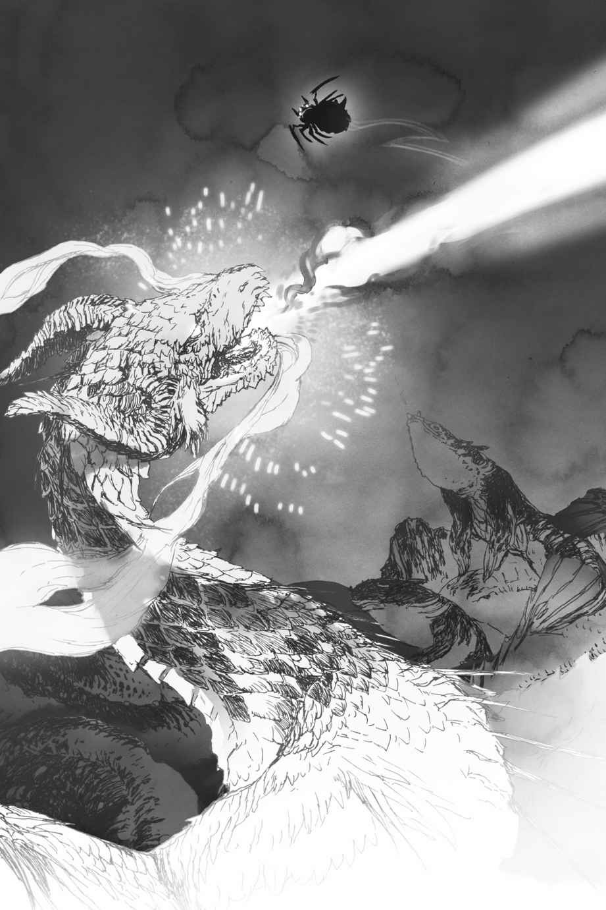
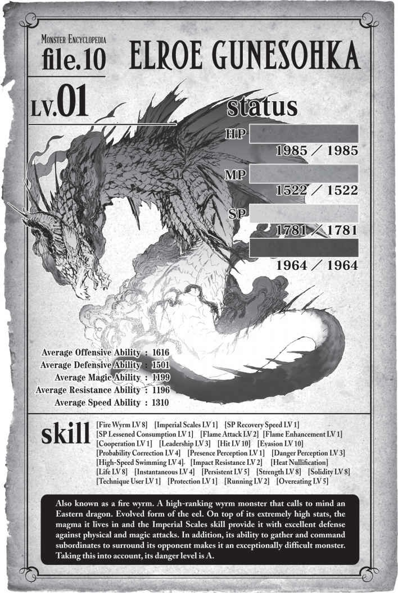

# Chương 9: Kẻ Thống Trị Hỏa Hải

Oa. Tình hình tồi tệ thật đấy.

Một hồ dung nham khổng lồ trải dài trước mắt tôi xa tít tắp đến tận chân trời. Và lần này, hoàn toàn không có bất kỳ con đường nào băng qua nó cả.

Tôi có đi nhầm đường ở chỗ nào không nhỉ?

Tôi không nghĩ chuyện đó khả thi. Bản đồ của Tầng Trung về cơ bản chỉ là một lối đi đơn độc, khá rộng lớn trải dài về phía trước.

Tuy nhiên, chiều rộng của nó lên tới hơn nửa dặm, nên tôi không biết gọi nó là “lối đi” có thực sự chính xác không nữa.

Dẫu sao thì, điều đó có nghĩa là tôi bắt buộc phải băng qua hồ dung nham này để tiếp tục tiến lên.

May mắn thay, dù không có đường đi, ít nhất vẫn có vài hòn đảo nhỏ nằm rải rác khắp nơi.

Với sức nhảy của mình, tôi có thể nhảy từ đảo này sang đảo khác, hoặc thậm chí bám lên trần hang di chuyển nếu cần thiết.

Nhưng mà, con người làm sao mà vượt qua được nơi này cơ chứ?

Tôi cá là họ chỉ có thể sinh tồn ở Tầng Trên mà thôi.

Ý tôi là, xét về mặt logic, làm sao có ai chinh phục nổi một mê cung rộng lớn hơn cả vùng Hokkaido chứ?

Họ phải là một vị anh hùng hoặc sở hữu một loại sức mạnh huyền thoại nào đó mới làm được.

Tôi không biết liệu thứ sức mạnh kiểu đó có tồn tại ở thế giới này hay không.

Biết đâu một quản trị viên nào đó đem lòng yêu thích một cậu thanh niên đẹp trai rồi ban cho cậu ta một năng lực đặc biệt thì sao?

Oa, như thế thì bất công quá.

Thay vào đó hãy ban nó cho tôi đi chứ!

Không có cửa sao? Được rồi, tớ nghĩ chuyện đó cũng hợp lý.

Úi chà. Tôi hơi lạc đề một chút rồi.

Dù sao thì, về mặt kỹ thuật, tôi có thể vượt qua chuyện này, nhưng có một vấn đề lớn.

Có vô số quái vật đang ẩn nấp bên dưới.

Hồ dung nham này không chỉ rộng lớn khủng khiếp mà còn cực kỳ sâu nữa.

Ở điểm sâu nhất, nó có thể sâu tới sáu trăm feet.

Với lượng dung nham khổng lồ như thế, đáng lẽ nó phải nguội đi và đông cứng lại chứ nhỉ?

Xem ra là không. Nó tạo thành một hồ nước nóng rực khổng lồ.

Và trong cái hồ sâu thẳm rộng lớn này, có hàng tá quái vật sinh sống.

Tôi phải băng qua thứ này sao?

Cái mê cung này bị làm sao thế không biết?

Tôi chẳng hiểu làm sao có ai có thể phá đảo được nơi này.

Ngoạm. Dù sao thì cũng chẳng còn lựa chọn nào khác, nên tôi đành phải băng qua thôi.

Mọi chuyện rồi sẽ ổn thỏa bằng cách nào đó thôi, đúng không?

Hơn nữa, tôi còn hạ gục được cả con lươn đó, nên tôi nghi ngờ việc có thứ gì khác có thể gây ra nhiều đe dọa cho mình. Tôi không nghĩ quanh đây có nhiều quái vật mạnh ngang ngửa con đó đâu.

Ngay cả khi có, tôi cũng sẽ dạy cho chúng một bài học ngay trên sân nhà của chúng.

Tôi đã tiến hóa kể từ trận chiến với con lươn, cả nghĩa đen lẫn nghĩa bóng. Chỉ số của tôi đã tăng lên một cách điên rồ, kỹ năng được cải thiện, và quan trọng nhất là bây giờ tôi đã có thể sử dụng phép thuật!

Hắc hắc hắc, trước đây tôi không thể chạm tới lũ quái vật khi chúng trốn dưới dung nham, nhưng giờ đã biết ma pháp rồi, chiến thuật “ru rú trong nhà” không còn tác dụng với tôi nữa đâu!

Tôi sẽ bắn tỉa các ngươi bằng ma pháp của mình! Ha ha ha!

Tôi còn có những kỹ năng mới bên cạnh ma pháp nữa.

Trước hết là Tà Nhãn.

Tôi đã nhận được kỹ năng Tà Nhãn thứ hai của mình. Lần này, tôi chọn *Tê Liệt Tà Nhãn* (Paralyzing Evil Eye).

*Hóa Đá Tà Nhãn* cũng rất hấp dẫn, nhưng nó mất quá nhiều thời gian để phát huy tác dụng, và tệ hơn nữa là tôi không thể ăn một thứ đã bị hóa đá.

Thế nên tôi chọn tê liệt, thứ giúp đối thủ bất động nhanh hơn nhiều trong khi vẫn giữ nguyên trạng thái hoàn hảo để ăn được.

Tôi cũng học được một kỹ năng gọi là *Ma đấu pháp* (Magic Warfare).

Bạn có thể sử dụng nó để tiêu hao MP nhằm đổi lấy việc gia tăng các chỉ số. Tôi vô tình học được nó chỉ nhờ tập trung lưu chuyển ma lực khắp cơ thể.

Về cơ bản, đây là phiên bản tiêu tốn MP của *Ý chí chiến đấu* (Mental Warfare) vốn tiêu hao SP. Nhưng nhờ có *Cực đỉnh Thần bí* (Height of Occultism), tôi không cần phải lo lắng về lượng tiêu hao MP của mình.

Ngay cả khi tôi duy trì kích hoạt nó liên tục, tốc độ hồi phục vẫn nhanh hơn tốc độ tiêu thụ.

Vì vậy hiện tại, tôi đang giữ nó kích hoạt mọi lúc mọi nơi.

Kết quả là, giờ đây các chỉ số của tôi còn cao hơn nữa.

Tôi cũng thỉnh thoảng kích hoạt *Ý chí chiến đấu* trong khi để mắt đến lượng năng lượng tích trữ của *Phàm ăn*, từ từ nâng cấp độ kỹ năng của nó lên.

Nếu tôi kích hoạt cả hai cùng lúc, các chỉ số của tôi sẽ tăng lên một cách chóng mặt, đây chắc chắn sẽ là một quân bài tẩy lợi hại của tôi.

Hóa ra *Phàm ăn* là một kỹ năng vô cùng tuyệt vời.

Ý tôi là, nó thậm chí còn tích trữ cả lượng hồi phục tự động nữa cơ.

Nhờ vậy, lượng tích trữ HP và MP của tôi đã được gia tăng đáng kể chỉ trong nháy mắt.

Đặc biệt là MP của tôi đang đạt đến mức mà tôi không tài nào tiêu thụ hết được.

Tôi có thể vừa kích hoạt *Ma đấu pháp*, vừa duy trì cả hai Tà Nhãn không ngừng nghỉ—và thậm chí là luyện tập ma pháp—mà vẫn còn dư thừa rất nhiều MP.

*Cực đỉnh Thần bí* mạnh mẽ đến mức điên rồ. Kỹ năng *Phàm ăn* giúp tích trữ lượng dư thừa cũng đỉnh không kém.

Mặc dù, tôi không thể tiết kiệm được nhiều MP như trước do phải chịu sát thương từ dung nham.

Giờ đây tôi đã có ma pháp làm phương thức tấn công tầm xa và các chỉ số đã được nâng cao vượt bậc, tôi tin chắc mình có thể hạ gục một con lươn mà không cần tốn một giọt mồ hôi nào.

Điều đó nghĩa là chẳng có lý do gì để phải sợ hãi một cái hồ dung nham nhỏ nhoi này cả!

Nếu có bất kỳ con tép riu nào dám tấn công tôi, tôi sẽ hạ gục chúng và đánh chén ngay lập tức.

Đến lúc thực hiện cú nhảy đầu tiên rồi!

Tôi nhảy vọt qua dòng dung nham và đáp xuống một hòn đảo nhỏ.

Có chút đáng sợ thật, nhưng tôi luôn có thể rút lui lên trần hang nếu cần, nên tôi nghĩ mọi chuyện sẽ ổn thôi.

Tôi vẫn đang tiếp tục nhảy qua nhảy lại.

Hửm. Mọi chuyện diễn ra suôn sẻ đến mức thực sự có chút nhàm chán.

Tôi chưa bị tấn công bởi bất kỳ con quái vật nào cả.

Thật lòng mà nói, tôi đã chuẩn bị tinh thần chiến đấu kỹ lưỡng đến mức chuyện này mang lại cảm giác thất vọng nhiều hơn là nhẹ nhõm.

Không, thế cũng tốt mà. Hòa bình là một điều tuyệt vời.

Nhưng nếu yên bình quá, tôi có thể sẽ cạn kiệt SP mất, nên thỉnh thoảng có quái vật tấn công cũng tốt. Thuần túy là để làm nguồn thức ăn thôi, dĩ nhiên rồi.

Nếu đó là một con quái vật ngon lành thì càng tốt. Như cá trê, hoặc cá trê, hoặc có thể là cá trê.

Thôi nào, không có con nào thò cái đầu nhỏ của nó ra khỏi dung nham cho tôi à?

*Tõm.*

### 📊 Chỉ số Gunesohka Elroe (LV 17)

| Thuộc tính cơ bản | Chỉ số |
| --- | --- |
| **HP** | 2.331 / 2.331 |
| **MP** | 1.894 / 1.894 |
| **SP (Vàng)** | 2.119 / 2.119 |
| **SP (Đỏ)** | 2.315 / 2.315 (+264) |
| **Sức tấn công trung bình** | 1.999 |
| **Sức phòng ngự trung bình** | 1.876 |
| **Sức ma pháp trung bình** | 1.551 |
| **Kháng tính trung bình** | 1.528 |
| **Tốc độ trung bình** | 1.657 |

* **Kỹ năng**: `[Hỏa Phi Long LV 9]` `[Long Lân Đế Vương LV 2]` `[Tự hồi phục HP LV 2]` `[Tự hồi phục MP LV 1]` `[Giảm tiêu hao MP LV 1]` `[Tốc độ hồi phục SP LV 3]` `[Giảm tiêu hao SP LV 3]` `[Hỏa Công Kích LV 5]` `[Tăng cường Hỏa thuộc tính LV 3]` `[Tăng cường Hủy diệt LV 2]` `[Tăng cường Chấn động LV 4]` `[Hiệp Lực LV 5]` `[Thống Lãnh LV 7]` `[Đánh trúng LV 10]` `[Né tránh LV 10]` `[Hiệu chỉnh Xác suất LV 8]` `[Cảm nhận Hiện diện LV 4]` `[Cảm nhận Nguy hiểm LV 7]` `[Bơi tốc độ cao LV 7]` `[Phàm ăn LV 8]` `[Kháng Chấn động LV 6]` `[Vô hiệu Nhiệt]` `[Trường Thọ LV 1]` `[Bộc phát lực LV 8]` `[Bền bỉ LV 9]` `[Cự lực LV 1]` `[Vững chãi LV 1]` `[Người dùng Đấu kỹ LV 4]` `[Bảo hộ LV 4]` `[Chạy LV 5]`
* **Điểm kỹ năng**: 11.250
* **Danh hiệu**: `[Kẻ diệt quái vật]` `[Kẻ tàn sát quái vật]` `[Thống Lĩnh]`

Có thứ gì đó vừa ngoi lên kìa?!

Đó là một con phi long.

Nó trông uy nghi và xịn sò hơn nhiều so với con lươn kia. Một con phi long thực sự, hàng thật giá thật 100%.

Dựa vào bộ kỹ năng của nó, đây có thể là một dạng tiến hóa cấp cao hơn nữa của loài lươn.

Người ta thậm chí không thể gọi thứ này là cá nữa. Nó là một con Hỏa Phi Long, rõ ràng và đơn giản.

A, chuyện này không ổn chút nào rồi!

*Long Lân Đế Vương* là phiên bản nâng cấp cao cấp của *Long Lân*, mang lại hiệu quả vượt trội hơn rất nhiều.

Trước đây tôi không mấy bận tâm đến hiệu ứng can thiệp cấu trúc ma pháp và làm yếu đi uy lực phép thuật của nó, nhưng giờ đây đó lại là một vấn đề cực kỳ nan giải.

Lớp *Long Lân* của con lươn có lẽ không đủ mạnh để vô hiệu hóa ma pháp được gia cường bởi *Cực đỉnh Thần bí* của tôi, nhưng lớp *Long Lân Đế Vương* của con Hỏa Phi Long này thì hoàn toàn có thể làm được điều đó.

Hơn nữa, combo *Đánh trúng* / *Hiệu chỉnh Xác suất* từng gây cho tôi rất nhiều khó khăn khi đối đầu với con lươn vẫn còn nguyên vẹn.

Chưa kể, hiện tại nó thậm chí còn sở hữu cả kỹ năng *Né tránh*.

Và nó được trang bị đầy rẫy các đòn tấn công thuộc tính hỏa, điểm yếu lớn nhất của tôi.

Nhưng điều nguy hiểm nhất trong số đó có lẽ là các kỹ năng *Hiệp Lực* và *Thống Lãnh* của nó.

Kỹ năng *Phát hiện* của tôi đang cảnh báo liên tục về những con quái vật đang liên tiếp ngoi lên khỏi dung nham.

*Hiệp Lực* và *Thống Lãnh* sở hữu các hiệu ứng hoàn toàn xứng đáng với tên gọi của chúng.

*Hiệp Lực* giúp tăng cường khả năng phối hợp tác chiến cùng nhau, còn *Thống Lãnh* giúp thuộc hạ tuân theo các mệnh lệnh được đưa ra.

Cả hai đều là những kỹ năng nhận được từ danh hiệu *Thống Lĩnh*, đây quả là một lớp khó chịu nữa.

Danh hiệu này có hiệu ứng gia tăng nhẹ các chỉ số cho thuộc hạ.

Tôi hoàn toàn bị bao vây bởi một đàn quái vật đông đúc.

Và con Hỏa Phi Long kia chính là thủ lĩnh của chúng.

Tôi biết mình từng nói mình có thể hạ gục một con lươn không mấy khó khăn, nhưng chẳng có ai nói với tôi rằng sẽ có một thứ mạnh mẽ như thế này xuất hiện cả!

*Não bộ!*

*Đúng thế, chuồn thôi!*

Quyết định của chúng tôi được đưa ra ngay lập tức. Tôi không nghĩ mình có thể đánh bại con quái thú này trong trận chiến một chọi một, chưa nói đến việc phải đối đầu với cả một đội quân tay sai đông đảo của nó.

Trong tình huống này, chạy trốn là con đường sống duy nhất của tôi.

Chỗ đứng ở đây rất tệ—không, phải nói là tệ nhất—nhưng đó vẫn là lựa chọn tốt nhất của tôi.

Tôi nhảy sang một hòn đảo đối diện với con Hỏa Phi Long.

Ngay sau khi tôi vừa di chuyển, *Phát hiện* báo cho tôi biết hòn đảo tôi đứng trước đó đã chìm trong biển lửa.

Ôi trời đất ơi! Tôi biết nó rất nhỏ, nhưng mà, nó đã bị nuốt chửng hoàn toàn luôn kìa!

Tôi không nghĩ mình có thể thoát thân bằng cách nhảy qua các hòn đảo này đâu.

Những quả cầu lửa mà con phi long đó phun ra quá to và quá mạnh.

Ngay cả với các chỉ số đã được nâng cấp của mình, nếu tôi bị trúng một đòn như thế, chắc chắn sẽ chẳng còn lại mảnh xương vụn nào.

Tôi đáp xuống hòn đảo tiếp theo, rồi ngay lập tức nhảy vọt sang hòn đảo kế tiếp.

Nhưng khi tôi đang ở trên không trung, một đàn cá ngựa bỗng ngoi lên khỏi dung nham và bắn liên tiếp các quả cầu lửa vào tôi.

Cứ như là pháo phòng không vậy.

Vô số loạt đạn bay thẳng về phía tôi với độ chính xác chuẩn từng milimet, như thể lũ cá ngựa đã cùng nhau luyện tập cho khoảnh khắc này từ trước vậy.

Tôi từng thấy cá ngựa đi theo bầy trước đây nhưng chưa bao giờ thấy chúng phối hợp ăn ý như thế này.

Tuy nhiên, dưới sự lãnh đạo của con Hỏa Phi Long, chúng đang tấn công một cách vô cùng đồng bộ.

Tôi có cảm giác như mình đang chiến đấu với cả một đội quân thực sự.

Không có lý do gì để nương tay nữa.

Bên cạnh *Ma đấu pháp*, tôi kích hoạt luôn cả *Ý chí chiến đấu*.

Sau đó, tôi phóng một sợi tơ được gia cường bằng *Truyền Năng lượng* về phía trần hang, dùng nó để đu mình trốn lên trần trước khi sợi tơ biến tính của tôi bị bắt lửa.

Vô số quả cầu lửa sượt qua ngay phía dưới, suýt chút nữa đã liếm trúng chân tôi.

Nhưng ngay lập tức, một quả cầu lửa lớn hơn nhiều đã nhắm thẳng vào vị trí của tôi trên trần hang.

Đó là đòn tấn công của con Hỏa Phi Long.

Tôi chạy thục mạng dọc theo trần hang và kịp thời né tránh quả cầu lửa đó.

Khi va chạm, quả cầu lửa phá hủy một góc hang động, bắn tung tóe lửa và các mảnh đá vụn khắp nơi.

Nếu bị trúng đòn đó khi đang ở trên không trung, ngay cả khi tôi vẫn còn HP, tôi cũng sẽ bị rơi thẳng xuống hồ dung nham.

Lũ cá ngựa lại bắn thêm một loạt đạn khác.

Tôi né tránh hầu hết chúng và dập tắt số còn lại bằng *Độc Đạn* (Poison Shot).

*Độc Đạn* sở hữu một phần sức mạnh tấn công vật lý.

Nếu nó va chạm với thứ gì đó đang bay trên không trung, nó có thể triệt tiêu đòn tấn công đó.

Và vì *Độc Đạn* là một phép thuật đơn giản, lại có *Cực đỉnh Thần bí* hỗ trợ cộng với một phần tâm trí chuyên trách về ma pháp, tôi thậm chí có thể bắn nó liên tục như súng liên thanh.

Tất nhiên, tôi không thể tạo ra chúng đủ nhanh để cản lại từng quả cầu lửa mà đội quân cá ngựa này ném vào mình, nhưng ít nhất tôi có thể dùng nó để triệt tiêu những quả mà tôi không thể né tránh.

Cho đến khi một quả cầu lửa khổng lồ mà tôi không thể phá hủy lao thẳng về phía tôi.

Một quả cầu lửa thực sự, thực sự cực kỳ khổng lồ.

Và nó bay tới từ hướng tôi đang định chạy đi.

Tôi không thể né tránh nó nếu cứ bám trên trần hang, nên tôi thả mình rơi tự do xuống một hòn đảo gần đó.

Ngay lập tức, một bông hoa đỏ rực nở rộ trên trần hang.

Tôi nhìn về phía trước.

Đó không phải là quả cầu lửa của con phi long.

Thay vào đó, đường đi phía trước của tôi đã bị chặn đứng bởi lũ lươn.

Không chỉ một con, mà tận ba con.

Tôi lâm vào thế bí rồi.

Lươn chặn ở cửa trước. Hỏa Phi Long đuổi ở cửa sau.

Nếu chỉ có một con lươn, tôi có thể tìm cách đột phá, nhưng vượt qua một nhóm ba con thì gần như là điều không tưởng.

Vì vậy, tôi quay đầu lại đối mặt với con Hỏa Phi Long, vì hướng đó chỉ có một đối thủ lớn, nhưng nó đang tiến lại gần tôi cùng với đội quân cá ngựa đông vô kể.

Hơn thế nữa, đi bên cạnh nó là con lươn thứ tư.

Tình hình rất tệ.

Cách duy nhất để tôi sinh tồn là né tránh các đòn tấn công của kẻ địch và cắt giảm số lượng của chúng.

Ngay cả những con tép riu như cá ngựa cũng có thể gây ra rắc rối lớn khi chúng tụ tập với số lượng đông đảo như vậy.

Tôi phải giảm bớt quân số của chúng nếu muốn có cơ hội chiến thắng.

Chẳng có gì vui vẻ khi bị tấn công bởi một bức tường lửa cầu cả!

Ngay lúc này, điều may mắn duy nhất là sự thống lãnh của con Hỏa Phi Long thực chất lại quá hoàn hảo.

Về cơ bản, các đòn tấn công nhắm vào tôi có phần quá chính xác.

Chúng đông đến mức chỉ cần rải thảm toàn bộ khu vực là tôi sẽ không còn đường lui, nhưng thay vào đó, tất cả bọn chúng đều nhắm thẳng vào vị trí của tôi.

Chừng nào tôi vẫn còn không gian để né tránh, tôi vẫn có thể tránh được chúng.

Tôi chạy nước rút sang một bên, cố gắng phá vỡ vòng vây của con Hỏa Phi Long và lũ lươn.

Vừa chạy, tôi vừa kích hoạt ma pháp.

Ma pháp Độc cấp 6: *Độc Vụ* (Poison Fog).

Đúng như tên gọi của nó, đây là phép thuật tạo ra một đám mây độc tố.

Sẽ thật tuyệt nếu tôi sở hữu một phép thuật có thể tấn công trực tiếp trên diện rộng trong một đòn, nhưng đây là món vũ khí duy nhất trong kho vũ khí của tôi có khả năng gây ảnh hưởng lên nhiều mục tiêu cùng một lúc.

Nó không mạnh bằng *Kịch Độc Nhện* (Deadly Spider Poison) của tôi, nên nó không thể rút sạch HP của chúng ngay lập tức, nhưng nếu chúng liên tục hít phải, chất độc sẽ dần dần gặm nhấm cơ thể chúng.

Nếu tôi có thể tiếp tục chạy trốn, màn sương độc này sẽ làm giảm đáng kể số lượng kẻ địch!

Nhưng dĩ nhiên mọi chuyện sẽ không dễ dàng như thế.

Vài con cá ngựa bò lên bờ để chặn đường tôi.

Gừ, tránh đường mau!

Tôi vung đôi lưỡi hái của mình về phía lũ cá ngựa đang đứng chắn đường.

Mỗi đường chém chia đôi một con cá ngựa ở bên trái và bên phải tôi.

Đó là sức mạnh đòn chém từ lưỡi hái của tôi sau khi các chỉ số được nâng cao.

Vung đôi chân trước ra phía sau, tôi hạ gục thêm hai con cá ngựa nữa.

Đồng thời, tôi nhảy thẳng lên không trung!

Một quả cầu lửa đập mạnh xuống mặt đất nơi tôi vừa đứng chưa đầy một phần mười giây trước.

Vụ nổ đẩy cơ thể tôi bay cao hơn nữa, giúp tôi tiếp cận trần hang mà không cần dùng đến tơ.

Nhưng chỉ riêng dư chấn từ vụ nổ cũng đủ khiến HP của tôi tụt giảm đáng kể.

Bắt gặp một con lươn đang chuẩn bị phun cầu lửa, tôi tổng hợp *Kịch Độc Nhện* trong sự tuyệt vọng.

Không thèm bận tâm đến lượng MP tiêu hao là bao nhiêu, tôi tối đa hóa số lượng chất độc tạo ra.

Ngay lập tức, một quả cầu độc khổng lồ to hơn cả cơ thể tôi xuất hiện và rơi xuống.

Quả cầu độc khổng lồ va chạm với cầu lửa của con lươn và phát nổ giữa không trung.

Phần lớn chất độc đã bị bốc hơi, nhưng lượng còn lại rơi xuống như mưa độc.

Dù không còn nhiều, nhưng đó vẫn là *Kịch Độc Nhện* của tôi.

Ngay cả một lượng nhỏ đó cũng đủ để hạ gục vài con cá ngựa yếu ớt.

Hoàn hảo.

Tôi nhanh chóng di chuyển dọc theo trần hang trước khi quả cầu lửa tiếp theo bay tới.

Vừa di chuyển, tôi vừa tiếp tục tổng hợp *Kịch Độc Nhện*, phun nó khắp mọi nơi.

Con Hỏa Phi Long và lũ lươn thoáng do dự. Có lẽ chúng e ngại việc làm phát tán chất độc chết người này bằng các quả cầu lửa của mình.

Chúng hỗn loạn tìm cách né tránh những giọt độc đang rơi xuống.

Thuật *Độc Vụ* cũng đang phát huy tác dụng; từng con cá ngựa một liên tiếp ngã gục.

Này, mọi chuyện đang tiến triển khá tốt đấy chứ. Nếu tôi cứ tiếp tục rải chất độc khi đang chạy, có lẽ tôi sẽ trốn thoát được.

`<Độ thông thạo đã đạt đến mức yêu cầu. Cá thể Zoa Ele đã tăng từ LV 6 lên LV 7.>`

`<Tất cả các thuộc tính cơ bản đều gia tăng.>`

`<Nhận được phần thưởng tăng cấp độ thông thạo kỹ năng.>`

`<Độ thông thạo đã đạt đến mức yêu cầu. Kỹ năng [Tơ nghệ LV 3] trở thành [Tơ nghệ LV 4].>`

`<Nhận được điểm kỹ năng.>`

Cái gì cơ...?!

Hỏng rồi. Tôi đang lột da.

Nếu chuyện này xảy ra khi tôi đang bám trên trần hang, nó sẽ làm tốc độ của tôi chậm đi đáng kể.

Đúng như dự đoán, ngay khi lớp da thừa khiến tôi khựng lại, một con lươn đã bắn trúng tôi bằng một quả cầu lửa.

Á! Nóng quá! Tôi sắp chết mất!

Tôi đang bị rơi xuống.

May mắn thay, ngay phía dưới tôi là một hòn đảo nhỏ.

An toàn rồi! Tôi đã tránh được việc rơi xuống dung nham. Thật là may mắn quá đi.

Cũng may là đòn tấn công đó đến từ con lươn chứ không phải con Hỏa Phi Long. Nếu không, tôi đã biến thành tro bụi ngay tại chỗ rồi.

Tuy nhiên, chỉ một đòn cầu lửa của con lươn cũng đủ khiến tôi phải duy trì sự sống bằng *Kiên trì*.

Nó đã rút cạn một nửa lượng MP tích trữ vốn dư thừa của tôi.

Tôi chưa bao giờ tưởng tượng rằng việc lột da, thứ đã cứu mạng tôi vô số lần trước đây, lại có thể làm hại tôi một vố đau đớn như vậy.

Nhưng tôi đã sống sót!

Một bóng hình khổng lồ tiến lại gần, cắt ngang sự nhẹ nhõm của tôi.

Một trong những con lươn đang lao thẳng về phía tôi, cơ thể nó bao phủ trong ngọn lửa rực cháy.

Tôi muốn chạy trốn, nhưng không còn thời gian nữa.

Tôi kích hoạt *Hủ thực Công kích* (Rot Attack) lên một bên lưỡi hái của mình.

Ngay lập tức, một cơn đau buốt chạy dọc theo chân, nhưng tôi phớt lờ nó.

Chỉ vừa vặn né sang một bên đường lao tới của con lươn, tôi vung chiếc lưỡi hái mang thuộc tính phân hủy lên chém mạnh.

Bất chấp lớp *Long Lân* của con lươn, lưỡi hái chém qua cơ thể nó mà không gặp bất kỳ lực cản nào.

*Hủ thực Công kích* thực sự là một kỹ năng vô cùng đáng sợ.

`<Độ thông thạo đã đạt đến mức yêu cầu. Cá thể Zoa Ele đã tăng từ LV 7 lên LV 8.>`

`<Tất cả các thuộc tính cơ bản đều gia tăng.>`

`<Nhận được phần thưởng tăng cấp độ thông thạo kỹ năng.>`

`<Nhận được điểm kỹ năng.>`

`<Độ thông thạo đã đạt đến mức yêu cầu. Cá thể Zoa Ele đã tăng từ LV 8 lên LV 9.>`

`<Tất cả các thuộc tính cơ bản đều gia tăng.>`

`<Nhận được phần thưởng tăng cấp độ thông thạo kỹ năng.>`

`<Độ thông thạo đã đạt đến mức yêu cầu. Kỹ năng [Ý chí chiến đấu LV 3] trở thành [Ý chí chiến đấu LV 4].>`

`<Nhận được điểm kỹ năng.>`

Tôi không thể tin được mình đã tiêu diệt một con lươn chỉ bằng một đòn duy nhất.

Những mảnh xác của nó chìm xuống dung nham.

Tất nhiên một phần cơ thể của nó vẫn còn nguyên vẹn, nhưng những phần bị chém trúng thì vỡ vụn như thể chúng biến thành cát bụi.

Trong khi đó, nhờ việc lột da khi lên cấp, chiếc lưỡi hái tự hủy của tôi đã hoàn toàn hồi phục.

Giờ đây chỉ còn lại ba con lươn và con Hỏa Phi Long.

Nhờ thuật *Độc Vụ*, hầu hết lũ cá ngựa đã bị tiêu diệt.

`<Độ thông thạo đã đạt đến mức yêu cầu. Cá thể Zoa Ele đã tăng từ LV 9 lên LV 10.>`

`<Tất cả các thuộc tính cơ bản đều gia tăng.>`

`<Nhận được phần thưởng tăng cấp độ thông thạo kỹ năng.>`

`<Độ thông thạo đã đạt đến mức yêu cầu. Kỹ năng [Ma pháp Độc LV 6] trở thành [Ma pháp Độc LV 7].>`

`<Độ thông thạo đã đạt đến mức yêu cầu. Kỹ năng [Tăng cường Độc tố LV 6] trở thành [Tăng cường Độc tố LV 7].>`

`<Nhận được điểm kỹ năng.>`

`<Điều kiện thỏa mãn. Nhận được danh hiệu [Kẻ diệt Phi Long].>`

`<Nhận được các kỹ năng [Mạng Sống LV 1] [Phi Long Lực LV 1] từ danh hiệu [Kẻ diệt Phi Long].>`

`<Kỹ năng [Mạng Sống LV 1] đã được tích hợp vào [Trường Thọ LV 1].>`

Ồ. Khi con cá ngựa cuối cùng ngã xuống, tôi đã lên cấp và nhận được một danh hiệu nào đó.

Biết đâu tôi có thể làm được chuyện này?

Tôi kích hoạt *Nguyền Rủa Tà Nhãn* và *Tê Liệt Tà Nhãn* bằng bốn con mắt cho mỗi loại kỹ năng.

Số lượng trùng khớp hoàn hảo với số đối thủ còn lại.

Xem ra điều này khiến con hỏa long và lũ lươn khó chịu vô cùng, khi chúng bắt đầu điên cuồng bắn cầu lửa về phía tôi.

Tôi chạy.

Hai con lươn đuổi theo sau.

Đó là một đòn gọng kìm, mỗi con áp sát từ một phía.

Chiêu đó không còn tác dụng với tôi nữa đâu!

Tôi né tránh bằng một cú nhảy thẳng đứng lên cao.

Nhưng dường như con hỏa long đã dự đoán trước được điều đó.

Một quả cầu lửa bay thẳng về phía tôi khi tôi đang lơ lửng trên không trung.

Có vẻ như quy luật chuyển động của tôi đã bị bắt bài rồi.

Tệ thật đấy, nhưng chẳng có ai nói là tôi không thể di chuyển khi đang ở trên không cả!

Tôi tạo ra vài sợi tơ được gia cường bằng chấn động và tự quất vào mình trước khi sợi tơ bị đốt cháy.

Chấn động chạy khắp cơ thể tôi.

Lực tác động đẩy cơ thể tôi bay vọt đi.

Ha! Với mẹo nhỏ này, tôi thực tế đã có thể bay—

—miễn là tôi không bận tâm đến việc mất đi một lượng HP đáng kể của bản thân!

Mất đi mục tiêu, quả cầu lửa bay vô dụng qua khoảng không trống rỗng.

Tôi dõi theo nó với sự thỏa mãn ngay cả khi đang xoay vòng trên không, rồi dùng tơ để đáp xuống trần hang một cách chuẩn xác lần này.

Vào lúc này, lũ lươn đã trở thành nạn nhân của *Tê Liệt Tà Nhãn* của tôi, cơ thể chúng nổi lềnh bềnh, hoàn toàn cứng đờ dưới nước.

Giờ chỉ còn lại duy nhất con hỏa long.

Có lẽ trong nỗ lực tuyệt vọng cuối cùng, ngọn lửa bùng lên bao phủ toàn thân con hỏa long khi nó lao thẳng về phía tôi.

Tôi đáp trả bằng ma pháp của mình.

Phép thuật ma pháp Độc cấp 7 mới học của tôi: *Tê Liệt Đạn* (Paralysis Shot).

Trận đấu kết thúc.

Một khi hiệu ứng của *Tê Liệt Tà Nhãn* đã phát huy tác dụng, nạn nhân sẽ tiếp tục bị tê liệt chừng nào tôi còn nhìn chăm chú vào chúng.

Mặt khác, *Tê Liệt Đạn* sẽ dần dần mất đi tác dụng theo thời gian, nhưng chuyện đó không thành vấn đề miễn là tôi vẫn duy trì *Tê Liệt Tà Nhãn* lên người chúng.

Bây giờ tôi đã làm tê liệt con hỏa long, tôi đã thắng. Tôi có thể luộc, nghiền, hầm nó... hay làm bất cứ thứ gì tùy thích.

Bất kể chỉ số của nó có cao đến mức nào, chúng cũng không thể so sánh được với khả năng gây ra các trạng thái bất thường của tôi.

Bây giờ tôi đã bắt giữ được nó một cách hoàn hảo thế này, sẽ thật lãng phí nếu cứ để nó chìm xuống dung nham.

Tôi không thể làm gì với lũ cá ngựa và con lươn đã bị chìm trước đó, nhưng tôi không thể để thêm bất kỳ nguồn thức ăn giá trị nào bị lãng phí nữa.

Sử dụng vài sợi tơ nhện và rất nhiều sức lực, tôi thành công kéo con mồi lên bờ.

Thật là phiền phức. Sợi tơ cứ liên tục bị bắt lửa, khiến tôi phải liên tục tạo thêm tơ mới và lặp lại quá trình này nhiều lần.

Bây giờ thì, tôi nghĩ mình nên kết liễu những kẻ bại trận này thôi.

Trước hết là lũ lươn.

Vì chúng đã bị tê liệt sẵn, tôi trực tiếp đổ *Kịch Độc Nhện* vào thẳng trong họng con đầu tiên.

Bất chấp tình trạng tê liệt, con lươn co giật một cái cuối cùng trước khi cạn kiệt sức lực.

`<Độ thông thạo đã đạt đến mức yêu cầu. Cá thể Zoa Ele đã tăng từ LV 10 lên LV 11.>`

---

---

`<Tất cả các thuộc tính cơ bản đều gia tăng.>`

`<Nhận được phần thưởng tăng cấp độ thông thạo kỹ năng.>`

`<Độ thông thạo đã đạt đến mức yêu cầu. Kỹ năng [Cơ động Không gian LV 8] trở thành [Cơ động Không gian LV 9].>`

`<Nhận được điểm kỹ năng.>`

Chứng kiến cảnh tượng này, gương mặt của những con lươn còn lại co rúm lại vì sợ hãi.

Đừng lo lắng. Sự đau đớn sẽ chỉ kéo dài trong chốc lát thôi.

Tôi tiếp tục đổ chất độc vào miệng con lươn thứ hai.

`<Độ thông thạo đã đạt đến mức yêu cầu. Cá thể Zoa Ele đã tăng từ LV 11 lên LV 12.>`

`<Tất cả các thuộc tính cơ bản đều gia tăng.>`

`<Nhận được phần thưởng tăng cấp độ thông thạo kỹ năng.>`

`<Độ thông thạo đã đạt đến mức yêu cầu. Kỹ năng [Né tránh LV 8] trở thành [Né tránh LV 9].>`

`<Nhận được điểm kỹ năng.>`

`<Điều kiện thỏa mãn. Nhận được danh hiệu [Kẻ gieo rắc kinh hoàng].>`

`<Nhận được các kỹ năng [Uy Hiếp LV 1] [Ngoại Đạo Công Kích LV 1] từ danh hiệu [Kẻ gieo rắc kinh hoàng].>`

Tôi lại có một danh hiệu mới. Trời ạ, lại là một danh hiệu nghe có vẻ rùng rợn khác.

Cứ đà này, chỉ dựa vào danh hiệu thôi, mọi người sẽ nghĩ tôi là loại quái vật điên khùng nào đó mất.

Ồ chờ đã, tôi là nhện chứ đâu phải là người.

Thôi, tôi sẽ kiểm tra nó sau vậy.

Cả cái danh hiệu *Kẻ diệt Phi Long* này nữa.

Hiện tại, tôi phải hoàn thành công việc với những tên này đã.

Thế nên ở đây, con lươn thứ ba ơi, ta có một món quà đặc biệt dành cho ngươi đây.

Ta đã tốn rất nhiều công sức để tạo ra thứ này đấy, nên ngươi tốt nhất là hãy biết ơn đi. Thôi nào, mở miệng ra và nói “A” đi.

Thế nào? Ngon đến mức chết luôn à? Đáng yêu thật đấy.

*Não thông tin ơi, cậu đáng sợ thật đấy!*

*Hay lắm! Phát huy tiếp đi!*

Ồ, các cậu quay lại rồi đấy à?

*Ừ. Tớ nghĩ chúng ta không cần phải duy trì mức độ đồng bộ tối đa nữa rồi.*

“Mức độ đồng bộ tối đa” là cái tên tớ tự đặt cho kỹ năng của *Phân thân Tư duy*.

Đúng như tên gọi, nó cho phép tớ đồng bộ hóa tất cả các tâm trí độc lập của mình để chúng ta có thể hoạt động như một thể thống nhất mà không có bất kỳ độ trễ nào.

Về cơ bản, nó giống như việc sở hữu một bộ não duy nhất có thể làm ba việc khác nhau cùng một lúc.

Tớ đoán nhược điểm thực sự duy nhất là tớ không thể tự trò chuyện với chính mình khi đang ở trạng thái đồng bộ này.

*Chúng ta chiến thắng dễ dàng hơn tớ tưởng nhiều đấy.*

*Ừ, tớ cũng không nghĩ mọi chuyện lại diễn ra suôn sẻ đến thế.*

Biết đâu tôi đã trở nên mạnh mẽ hơn nhiều so với những gì mình nghĩ thì sao.

Nhờ có các phương thức tấn công mới mà ma pháp mang lại, phạm vi chiến thuật tôi có thể áp dụng đã rộng hơn rất nhiều.

Trên hết, giờ đây tôi đã biết các trạng thái bất thường như độc và tê liệt có thể lợi hại đến mức nào.

*Đáng nể thật đấy.*

*Tớ đoán chẳng có cách nào tránh được tê liệt cho dù cậu có mạnh đến mức nào đi nữa.*

Giống như con Hỏa Phi Long này đây.

*Cũng may là con Hỏa Phi Long đó quá ngốc.*

*Ừ, nếu tớ là nó, tớ đã bỏ chạy khi tình hình trở nên tồi tệ rồi.*

*Hoàn toàn đồng ý. Tại sao lại không rút lui khi tổn thất của phe mình bắt đầu nặng nề như thế chứ?*

Tôi đoán nó là một kẻ đầu óc toàn cơ bắp không biết khi nào nên rút lui, giống hệt lũ cá ngựa vậy.

*Có lẽ là vì nó chưa từng lâm vào thế bí như thế này bao giờ chăng?*

*Ồ, có lẽ vậy đấy.*

*Ừ, nó chắc chắn đã không nghĩ rằng mình sẽ thua.*

*Đúng vậy. Bây giờ tớ thấy hơi tội nghiệp cho nó rồi đấy, nên kết liễu nó thôi nào.*

Và thế là tôi ban cho con Hỏa Phi Long thứ có lẽ là thất bại đầu tiên (và chắc chắn là cuối cùng) trong cuộc đời nó.

`<Độ thông thạo đã đạt đến mức yêu cầu. Cá thể Zoa Ele đã tăng từ LV 12 lên LV 13.>`

`<Tất cả các thuộc tính cơ bản đều gia tăng.>`

`<Nhận được phần thưởng tăng cấp độ thông thạo kỹ năng.>`

`<Độ thông thạo đã đạt đến mức yêu cầu. Kỹ năng [Tăng cường Hủy diệt LV 2] trở thành [Tăng cường Hủy diệt LV 3].>`

`<Độ thông thạo đã đạt đến mức yêu cầu. Kỹ năng [Kháng Hủy diệt LV 3] trở thành [Kháng Hủy diệt LV 4].>`

`<Nhận được điểm kỹ năng.>`

`<Độ thông thạo đã đạt đến mức yêu cầu. Cá thể Zoa Ele đã tăng từ LV 13 lên LV 14.>`

`<Tất cả các thuộc tính cơ bản đều gia tăng.>`

`<Nhận được phần thưởng tăng cấp độ thông thạo kỹ năng.>`

`<Độ thông thạo đã đạt đến mức yêu cầu. Kỹ năng [Kháng Thối Rữa LV 3] trở thành [Kháng Thối Rữa LV 4].>`

`<Nhận được điểm kỹ năng.>`

`<Độ thông thạo đã đạt đến mức yêu cầu. Cá thể Zoa Ele đã tăng từ LV 14 lên LV 15.>`

`<Tất cả các thuộc tính cơ bản đều gia tăng.>`

`<Nhận được phần thưởng tăng cấp độ thông thạo kỹ năng.>`

`<Độ thông thạo đã đạt đến mức yêu cầu. Kỹ năng [Kháng Chấn động LV 2] trở thành [Kháng Chấn động LV 3].>`

`<Nhận được điểm kỹ năng.>`

`<Độ thông thạo đã đạt đến mức yêu cầu. Nhận được kỹ năng [Ma Vương LV 1].>`

Được rồi, *não cơ thể* ơi!

*Rõ rồi, rõ rồi. Tôi lại chuẩn bị có một đống công việc nhàm chán phía trước đây.*

*Ừ. Trông cậy cả vào cậu trong việc lột vảy lũ này đấy.*

Thật tuyệt khi giờ đây có thể đùn đẩy những công việc kiểu này cho người khác làm hộ.

Trong lúc đó, tôi sẽ xem qua các hiệu ứng của các kỹ năng và danh hiệu mới nhận được.

Bắt đầu với kỹ năng *Ma Vương* này trước.

Trời ạ, thứ này có ý nghĩa gì thế nhỉ?

*Ma Vương: Gia tăng mỗi chỉ số thêm cấp độ kỹ năng x 100. Đồng thời gia tăng tất cả các kháng tính.*

Ồ. Đó là một kỹ năng khá ngọt ngào đấy chứ. Cảm ơn nhé, Ma Vương.

Tiếp theo, hãy kiểm tra các danh hiệu xem sao.

*Kẻ diệt Phi Long: Nhận được các kỹ năng [Mạng Sống LV 1] [Phi Long Lực LV 1]. Điều kiện nhận: Tiêu diệt một số lượng nhất định quái vật dạng phi long. Hiệu quả: Gia tăng nhẹ sát thương gây ra cho các đối thủ hệ phi long và long. Mô tả: Danh hiệu được trao cho những kẻ đã hạ gục một lượng lớn phi long.*

*Kẻ gieo rắc kinh hoàng: Nhận được các kỹ năng [Uy Hiếp LV 1] [Ma pháp Ngoại đạo LV 1]. Điều kiện nhận: Gây ra một lượng độ thông thạo Kháng Sợ hãi nhất định cho những kẻ khác. Hiệu quả: Gây ra hiệu ứng thuộc tính ngoại đạo “Sợ hãi” lên bất kỳ ai nhìn thấy người sở hữu danh hiệu. Mô tả: Danh hiệu được trao cho những kẻ là hiện thân của sự kinh hoàng.*

Oa! *Kẻ diệt Phi Long* thì cũng tốt thôi, nhưng hiệu quả của *Kẻ gieo rắc kinh hoàng* thì quá đỗi điên rồ!

Vậy là chỉ cần nhìn vào tôi là sẽ bị sợ hãi sao?

Như thế không ổn chút nào cả!

Ý tôi là, đối với kẻ thù thì rất tuyệt vời, nhưng làm cho tất cả những người khác sợ hãi tôi thì chẳng có lợi ích gì cả!

Chẳng lẽ không có cách nào bật tắt danh hiệu sao chứ?

Trời ạ. Liệu điều này có nghĩa là những con quái vật nhút nhát như cá trê sẽ lập tức quay đầu bỏ chạy ngay khi chúng nhìn thấy tôi không?

Trời đất ơi. Thôi thì, đoán là cũng chẳng làm gì được nữa vì tôi lỡ nhận nó mất rồi.

Được rồi, giũ bỏ nó đi nào. Đến lúc xem xét các kỹ năng khác.

Tôi khá chắc chắn mình đã từng nhìn thấy chúng trong danh sách kỹ năng trước đây, nhưng tôi hoàn toàn không nhớ hiệu ứng của chúng là gì.

Trời ạ. Trí nhớ của tôi đúng là tệ hại nhất thế giới.

Hay là tôi nên học kỹ năng *Trí Nhớ* gì đó nhỉ? Ồ, sao cũng được đi.

*Phi Long Lực: Tạm thời nhận được sức mạnh của phi long.*

Hửm? Hửm. Tôi không hiểu lắm.

Xem ra đây là loại kỹ năng cần phải chủ động kích hoạt, nên tôi sẽ dùng thử xem sao.

Ồ? Có vẻ như các chỉ số của tôi đã tăng lên một chút.

Và tôi bị tiêu hao một ít MP và SP.

Đoán là kỹ năng này tiêu tốn một lượng MP và SP để gia tăng các chỉ số của tôi.

Không giống như *Ma đấu pháp* và *Ý chí chiến đấu*, nó còn gia tăng cả các chỉ số ma pháp của tôi nữa.

Vì nó chỉ mới cấp 1 nên không tăng nhiều lắm, nhưng nó có thể trở nên cực kỳ mạnh mẽ nếu tôi tăng cấp cho nó bằng cách giữ nó kích hoạt mọi lúc.

Sự kết hợp của *Ma đấu pháp* và *Ý chí chiến đấu* vốn đã mang lại hiệu ứng rất mạnh rồi, nay nếu cộng thêm cả *Phi Long Lực* vào nữa...

Tuyệt cú mèo. Đúng vậy chứ còn gì nữa.

*Uy Hiếp: Gây ra hiệu ứng thuộc tính ngoại đạo “Sợ hãi” lên khu vực xung quanh.*

Cả ngươi nữa hả?

Không giống như danh hiệu, ít nhất tôi cũng có thể bật tắt kỹ năng này, nhưng chẳng phải sự kết hợp của cả hai sẽ khiến hầu như bất kỳ con quái vật nào nhìn thấy tôi cũng sẽ lập tức vắt chân lên cổ chạy trốn ngay lập tức sao?

Thôi kệ đi. Dù sao thì tôi cũng không thể tắt danh hiệu được, nên tôi cứ bật luôn kỹ năng này mọi lúc cho rồi.

Dù sao thì nó dường như cũng không tốn năng lượng gì cả.

*Ngoại Đạo Công Kích: Ban thuộc tính ngoại đạo “Xé rách Linh hồn” vào các đòn tấn công.*

Ồ, tuyệt vời.

*Thuộc tính ngoại đạo “Xé rách Linh hồn”: Một thuộc tính trực tiếp phá hủy linh hồn.*

Cái này không còn là một đòn “tấn công tinh thần” đơn thuần nữa rồi!

Cái này đáng sợ hơn nhiều đấy.

Tôi phải sớm dùng thử nó mới được. Đúng vậy.

Tóm lại là *Kẻ diệt Phi Long* cuối cùng chỉ mang lại một chút gia tăng chỉ số nhẹ.

Còn *Kẻ gieo rắc kinh hoàng*... tôi không chắc liệu đó là điều tốt hay điều xấu nữa, xét trên phương diện tổng thể.

Nó có thể cực kỳ tốt, nhưng cũng có thể cực kỳ tồi tệ.

Thôi, thế là xong phần danh hiệu.

Hiện tại tôi đang có rất nhiều điểm kỹ năng.

Vì tôi đã lên cấp rất nhiều lần nên số lượng thu được kha khá.

Bây giờ tôi đã có thể nhận được kỹ năng mà mình hằng mong ước rồi!

Hi hi. Tôi không nghĩ mình lại có thể sở hữu nó sớm đến thế.

*Ma pháp Không gian (500): Ma pháp thao túng không gian.*

Nó đây rồi. *Ma pháp Không gian* chính là kỹ năng cơ bản của các kẻ hack game.

Tôi tin chắc mình chưa thể sử dụng những phép thuật như ý ngay lập tức vì nó chỉ mới bắt đầu ở cấp 1, nhưng nhờ có *Kẻ Thống Trị Trí Tuệ*, các kỹ năng ma pháp của tôi sẽ tăng cấp cực kỳ nhanh chóng.

Nếu tôi nỗ lực luyện tập, nó sẽ sớm đạt đến cấp độ hữu dụng trong nháy mắt thôi.

Hắc hắc hắc. Tôi đặt kỳ vọng rất cao vào cậu đấy, *Ma pháp Không gian*. Tớ hy vọng phép *Dịch Chuyển* (Teleport) sẽ xuất hiện trên bàn làm việc của tớ trước ngày thứ Hai đấy nhé!

Ý tôi là, nó chắc chắn phải tồn tại đúng không?

*Ma pháp Không gian* mà không có những thứ như *Dịch Chuyển*, *Kho Đồ Không Gian* (Item Box), hay xây dựng một căn biệt thự ở dị chiều không gian thì còn gọi gì là ma pháp không gian nữa chứ?!

Có thể tồn tại một kỹ năng dạng *Kho Đồ Không Gian* cho phép cất giữ đồ vật ở một chiều không gian khác, nhưng ngay từ đầu tôi đã không có thói quen mang theo đồ đạc bên mình, nên nó sẽ không có nhiều tác dụng với tôi lắm.

Một căn biệt thự thì sẽ rất tuyệt, nhưng vì thứ đó có lẽ thuộc cấp độ rất cao nếu nó thực sự tồn tại, tôi không nghĩ mình có thể sớm sở hữu nó được.

Nhưng còn có phép *Dịch Chuyển*. Một phép thuật tuyệt vời giúp bạn di chuyển đến một khu vực khác chỉ trong nháy mắt.

Nếu tôi có thể sở hữu *Dịch Chuyển*, tôi sẽ không cần phải lết đôi chân đi khắp Tầng Trung này nữa!

Nhờ có Giáo sư Trí Tuệ, tôi đã có bản đồ của Tầng Trên rồi!

Nếu tôi có thể kết hợp nó hoạt động cùng bản đồ, tớ cá là mình có thể dịch chuyển đến đó chỉ trong chớp mắt!

Được rồi, Giọng nói Thần thánh (tạm thời) ơi!

Cho tớ *Ma pháp Không gian* đi!

`<Số lượng điểm kỹ năng hiện có: 500. Số lượng điểm kỹ năng yêu cầu để nhận kỹ năng [Ma pháp Không gian LV 1]: 500. Nhận kỹ năng chứ?>`

Chắc chắn rồi!

`<Đã nhận [Ma pháp Không gian LV 1]. Số điểm kỹ năng còn lại: 0.>`

Được rồi. Hãy dùng thử phép thuật cấp 1 ngay lập tức nào.

*Não ma pháp ơi!*

*Có mặt đây, sếp!*

*Não ma pháp* nhanh chóng kích hoạt phép thuật *Ma pháp Không gian* cấp 1.

Phép thuật cấp 1 có tên gọi là *Chỉ định Tọa độ* (Coordinate Designation).

Một khối lập phương được tạo thành bởi các đường kẻ màu xanh lá cây xuất hiện.

*Não ma pháp* có thể làm nó to ra hoặc thu nhỏ lại, thay đổi hình dạng của nó, và di chuyển nó sang trái sang phải.

Xem ra nó không có thực thể vật lý vì nó có thể chìm xuống đất cũng như chìm dưới dung nham.

Nó làm tôi liên tưởng đến việc bôi đen khoanh vùng các tệp tin trên máy tính. Thực tế, tôi nghĩ đó chính xác là những gì nó đang làm.

Có vẻ như tất cả những gì phép thuật này làm được chỉ là khoanh vùng chỉ định một không gian.

Vậy thì thứ này có ích lợi gì chứ?

Biết đâu đây là bước thiết lập tiền đề chuẩn bị cho các phép thuật cấp cao hơn chăng?

Đúng vậy, nghe rất hợp lý.

Nên tôi đoán đây lại là một kỹ năng khác sẽ không có nhiều tác dụng cho đến khi nó đạt cấp độ cao hơn, giống như *Ma pháp Bóng tối* vậy.

Đúng thế.

Hửm.

Dẫu sao thì, tôi cũng không mong đợi nó sẽ hữu ích ngay trong chiến đấu từ lúc đầu, nên điều thực sự quan trọng là hiện tại tôi đã sở hữu được nó rồi.

Chúng ta chỉ cần nhanh chóng tăng cấp cho nó thôi.

Cậu biết phải làm gì rồi đúng không, *não ma pháp*?

*Tập trung vào ma pháp này hơn các ma pháp khác đúng không?*

*Ừ. Nhân tiện, hiện tại cậu có thể kích hoạt bao nhiêu loại ma pháp khác nhau cùng một lúc?*

*Còn tùy thuộc vào loại ma pháp nữa. Nhưng Chỉ định Tọa độ có vẻ không quá khó, nên tớ nghĩ mình có thể sử dụng đồng thời hai phép thuật khác miễn là chúng thuộc loại đơn giản.*

*Hiểu rồi. Vậy hãy cố gắng tích lũy độ thông thạo trong lúc chúng ta di chuyển nhiều nhất có thể nhé, rõ chưa?*

*Rõ thưa sếp.*

*Não cơ thể* vẫn đang bận rộn với công việc lột vảy.

Cũng phải thôi, vì có tận ba con lươn, còn con hỏa long thì có kích thước to gấp đôi một con lươn bình thường.

Xem ra phải mất một lúc nữa chúng tôi mới có thể thực hiện thử nghiệm hương vị của con Hỏa Phi Long.

Nhưng mà, tôi thực sự không thể tin được mình đã đánh bại cả một đàn quái vật được dẫn dắt bởi một con phi long siêu mạnh.

Xét về mặt chỉ số, con Hỏa Phi Long mạnh hơn tôi rất nhiều.

Cơ hội chiến thắng của tôi lúc đầu trông không mấy khả quan.

Nhưng tôi đã giành được chiến thắng bằng cách làm tê liệt chúng và dội chất độc lên người chúng.

Điều này lại chứng minh một lần nữa rằng chỉ số không phải là yếu tố duy nhất quyết định chiến thắng.

Ví dụ, một con nhện chuyên về các hiệu ứng trạng thái bất thường có thể là một con quái vật cực kỳ khó đối phó, nếu tôi tự mình đánh giá như vậy.

Nếu chỉ số của tôi tiếp tục tăng lên và tôi tiếp tục cải thiện khả năng sử dụng ma pháp, biết đâu tôi sẽ trở thành một con siêu quái vật toàn năng sở hữu sức mạnh hủy diệt lớn chăng?

Hắc hắc hắc.

Và tôi còn nhận được cả kỹ năng *Ma Vương* nữa chứ. Biết đâu một lúc nào đó tôi thực sự nên bắt đầu tự xưng là ma vương nhỉ?

Tôi đã có danh hiệu *Kẻ gieo rắc kinh hoàng* rồi, nên tớ cá là nó sẽ rất hợp với mình đấy.

Ta chính là Ma Vương Nhện!

Chỉ là đùa thôi.

Vào thời điểm đó, tôi hoàn toàn không hề hay biết.

Khi tôi đùa giỡn về việc trở thành một ma vương...

...Tôi đã không hề nhận thức được ý nghĩa sâu xa đằng sau những ngôn từ đó.

---

