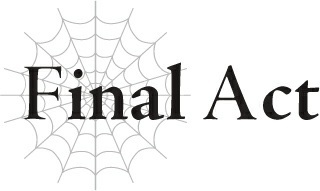

# Chương kết: Thượng đế yêu thương loài Nhện

Có vẻ như cô nhóc đã thích kỹ năng Trí Tuệ rồi.

Thật vui khi thấy món quà được đón nhận nồng nhiệt.

Không thể không cảm thấy hài lòng trước phản ứng kịch liệt như thế.

Chúng ta chắc chắn phải lưu lại hình ảnh cô nhóc tự thiêu rồi cuống cuồng hoảng loạn lên mới được.

Chắc chắn rồi, cô nhện nhỏ đặc biệt của chúng ta sẽ sử dụng Trí Tuệ một cách hiệu quả.

Ngay cả khi tư duy bị chia nhỏ, cô nhóc vẫn có thể giữ bình tĩnh đến kinh ngạc.

Vì cô nhóc đã có hai kỹ năng của Kẻ Thống Trị là Kiêu hãnh và Kiên trì, tôi tin chắc cô nhóc có thể quản lý thêm một kỹ năng nữa.

Và một ngày nào đó, tôi hy vọng cô nhóc sẽ biết đến sự tồn tại của tôi.

Tôi đặt kỳ vọng rất cao vào cô nhóc đấy.

Tôi chắc chắn cô nhóc có thể mua vui cho tôi trong một thời gian dài nữa.

Bởi vì tôi là một quản trị viên, và là một tà thần.

Vậy thì, tiếp theo cô nhóc sẽ cho tôi thấy điều gì đây?

Cô nhóc sẽ tương tác với thế giới này thế nào?

Cô nhóc sẽ thay đổi nó ra sao?

Tôi thực sự rất mong đợi được biết đấy.

---

[◀ Chương trước: Đoạn phụ: Ma Vương Nhện](interlude_spider_demon_lord.md) | [Chương tiếp theo: Lời bạt của tác giả ▶](afterword.md)
