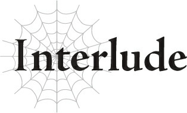

# Đoạn phụ: Con gái Công tước và Em gái Hoàng tử

*(The Duke’s Daughter and the Prince’s Sister)*

---

### --- TRANG 105 ---

“Katia, tại sao chị lại dập tắt sự phấn khích của mọi người trước thành công của hoàng huynh tôi?”

“Sue này, em thực sự nghĩ Shun muốn như vậy sao?”

“Thì... không, em đoán là không... Chị quả là một người lọc lõi đấy, Katia. Rốt cuộc quan hệ giữa chị và anh trai tôi là gì thế?”

“Ý em là sao? Tất nhiên chúng tôi là bạn bè rồi. Chuyện đó thì có gì sai sao?”

“Nói dối. Chị với anh ấy đâu phải chỉ là bạn bè bình thường, đúng không? Cả người tộc Elf mà các người gọi là 'cô giáo' cũng vậy. Rồi cả Thánh nữ tương lai và Kiếm Vương nữa. Rốt cuộc giữa các người có chuyện gì thế?”

“Em thực sự nghĩ người nên trả lời câu hỏi đó cho em là chị sao?”

“Ý chị là sao?”

“Thì, em thực sự muốn nghe câu trả lời từ chị, hay là muốn nghe từ một người nào khác?”

“Thì, em—”

“Em nên trực tiếp hỏi Shun về những chuyện kiểu này thì hơn.”

“Nhưng—”

“Chị dĩ nhiên không ngại giải thích nếu em muốn. Nhưng liệu em có thực sự thỏa mãn khi nghe câu trả lời đó từ miệng chị không?”

“Có chứ.”

“Chị nghĩ là không đâu. Hay là em thực sự coi nhẹ Shun đến mức không thèm quan tâm câu trả lời của anh ấy ra sao?”

“Hoàn toàn không phải thế!”

“Vậy thì, em nên đi hỏi Shun chứ không phải chị. Như vậy sẽ tốt hơn cho cả hai người, đúng không?”

### --- TRANG 106 ---

“...Có lẽ vậy.”

“Chị nghĩ mình phần nào hiểu được cảm xúc hiện tại của em. Và chính vì thế, chị tin tốt nhất là em nên đối diện trực tiếp với nguồn cơn của những cảm xúc đó.”

“...Em hiểu rồi. Em xin lỗi. Và... cảm ơn chị.”

“Không có gì đâu. À, nhân tiện thì, đúng là chúng tôi có một mối quan hệ đặc biệt, nhưng hoàn toàn không có bất kỳ tình cảm nam nữ nào ở đây cả. Nên em không cần phải bận tâm về chuyện đó đâu.”

“Đ-Đúng vậy...”

“Sao thế? Sao lại trả lời một cách hời hợt thế kia?”

“Ồ, không có gì. Có vẻ chị vẫn chưa nhận ra đâu, nên tôi nghĩ người nói ra không nên là tôi.”

“? Cái gì cơ...?”

“Dù sao thì, tại sao tôi phải tiếp thêm động lực cho một kẻ có khả năng trở thành tình địch của mình chứ?”

“Hả? Em vừa nói gì cơ?”

“Không có gì hết.”

Có vẻ mình chỉ đang đổ trách nhiệm lên đầu người khác, nhưng thế thì sao chứ? Dù gì thì đây cũng là chuyện giữa hai anh em bọn họ. Mình không muốn bị kéo vào rắc rối chẳng liên quan gì đến mình đâu. Phải rồi, đây không phải việc của mình. Không hề... Có lẽ ngày mai mình nên nói trước với Shun một tiếng đề phòng.

---

[◀ Chương trước: Chương S2: Tiết học ma pháp](s2_magic_lesson.md) | [Chương tiếp theo: Chương 5: Nhện đối đầu Hỏa Phi Long ▶](05_spider_vs_fire_wyrm.md)
