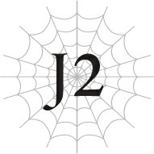

# Chương J2: Tàn tích của Cơn Ác Mộng

*(The Nightmare’s Vestige)*

---

### --- TRANG 71 ---

Vài ngày sau khi tiến vào Mê cung Lớn Elroe, cuối cùng chúng tôi cũng tới được nơi mà một nhà mạo hiểm báo cáo đã nhìn thấy một con Taratect dị thường.

Từ đây, chúng tôi nhờ sự trợ giúp của Goyef để tìm kiếm khu vực xung quanh nhằm phát hiện và tiêu diệt mục tiêu.

“Xin mọi người hãy cẩn thận. Vì các lối đi trong khu vực này rất rộng, những con quái vật khổng lồ như địa long đôi khi sẽ xuất hiện.”

Địa long sao? Loài rồng nói chung rất mạnh. Các phân loài rồng (wyrm) cấp thấp thường không nguy hiểm hơn các loài quái vật cùng cấp là mấy, nhưng thứ cấp của chủng loài càng cao thì mức độ nguy hiểm càng tăng.

Chúng thậm chí có thể ngang ngửa với các chỉ số của tôi, bất chấp việc tôi sở hữu danh hiệu Anh hùng — hoặc thậm chí còn vượt trội hơn cả tôi.

“Xung quanh đây im ắng quá.”

Tôi gật đầu trước nhận xét của Jeskan.

Việc bắt đầu cuộc đi săn là tốt, nhưng chúng tôi chưa chạm trán bất kỳ con quái vật nào kể từ khi đến đây.

Và đây lại là Mê cung Lớn Elroe, nơi nổi tiếng là tràn ngập quái vật.

Chắc chắn có điều gì đó bất thường đang diễn ra.

Đột nhiên, tôi cảm thấy một cảm giác nhói buốt sắc lạnh trên da mình.

Tôi lập tức tuốt kiếm.

Hyrince giơ khiên lên chắn, còn Yaana tập trung tinh thần để có thể thi triển ma pháp bất cứ lúc nào.

Jeskan và Hawkin cảnh giác nhìn quanh.

Tôi có thể thấy mồ hôi lạnh chảy dài trên mặt Goyef.

“Anh hùng đến rồi.”

### --- TRANG 72 ---

Một giọng nói bỗng vang vọng trong tâm trí tôi.

Nó không phát ra âm thanh, mà truyền đến như một luồng suy nghĩ.

Tôi quay phắt người lại.

Ở đó, tôi thấy mình đang đối mặt với một con quái vật nhện khổng lồ.

“T... Taratect Vĩ đại...”

Goyef nói với giọng gần như rên rỉ.

Một con Taratect Vĩ đại có thể mạnh ngang ngửa một con wyrm cấp cao.

Và ở đây có tận ba con.

Nhưng ánh mắt tôi lập tức lướt qua ba con quái vật khổng lồ đó, bị thu hút hoàn toàn bởi một bóng dáng nhỏ bé.

Một sinh vật nhỏ màu trắng, đang ẩn nấp phía sau các con Taratect Vĩ đại, cứ như đang lẩn trốn vậy.

“N-Nó kia rồi! Đó chính là mục tiêu của chúng ta! Tàn tích của Cơn Ác Mộng! Đây là con quái vật được đồn đại là do Cơn Ác Mộng của Mê cung để lại!”

Cơn Ác Mộng của Mê cung. Một con quái vật xuất hiện từ khoảng mười năm trước.

Nó mạnh mẽ đến mức không thể tả xiết, thế nên mới có danh hiệu đó.

Một con nhện nghiền nát con người như cỏ rác.

Và cũng là con quái vật đầu tiên dạy cho tôi biết thế nào là nỗi đau của thất bại.

Mục tiêu lần này của chúng tôi là Tàn tích của Cơn Ác Mộng, một con Taratect đột biến — được cho là do Cơn Ác Mộng để lại, mạnh hơn cả một con wyrm cấp cao hay thậm chí là một con rồng.

Nghe nói nó đã tấn công một nhóm mạo hiểm giả và tiêu diệt phần lớn bọn họ, đó là lý do chúng tôi được phái đến đây để tiêu diệt nó.

“Chết đi, anh hùng.”

Tàn tích của Cơn Ác Mộng biến mất khỏi tầm mắt.

Hoặc ít nhất, nó di chuyển với tốc độ kinh hoàng đến mức trông cứ như đã biến mất.

Ngay lập tức, tôi túm lấy Yaana bên cạnh và nhảy sang một bên.

Một thứ gì đó chém ngang qua khoảng không nơi chúng tôi vừa đứng chỉ vài giây trước.

Hai trong số tám chiếc chân trước của sinh vật đó đã biến đổi thành một cặp lưỡi hái.

Tôi ngã nhào xuống đất, kéo Yaana theo cùng.

Rồi tôi tận dụng đà lăn để đứng dậy, đỡ Yaana dậy theo.

“Yaana, làm ơn hỗ trợ tụi anh bằng ma pháp nhé. Tốt nhất là hãy giả định rằng các đòn tấn công thông thường sẽ không trúng được nó đâu.”

### --- TRANG 73 ---

“Em rõ rồi!”

Tốc độ thật kinh khủng. Nếu không có ma pháp tăng độ chính xác mạnh mẽ, tôi nghi ngờ không đòn đánh nào có thể trúng được nó.

Sư phụ của tôi có lẽ làm được chuyện này, nhưng tôi không thể mong đợi kết quả tương tự từ Yaana.

Dù sao thì, Sư phụ vốn là người vượt ngoài quy chuẩn thông thường về mọi mặt rồi.

Các đồng đội của tôi di chuyển theo chỉ thị, và ba con Taratect Vĩ đại cũng đồng loạt xông lên cùng lúc.

Các con Taratect Vĩ đại có chỉ số trung bình vào khoảng 2.000.

Nhưng con quái vật nguy hiểm nhất ở đây chắc chắn chính là Tàn tích của Cơn Ác Mộng đi cùng chúng.

“Anh sẽ lo lũ Taratect Vĩ đại! Mọi người còn lại, hãy tập trung tiêu diệt Tàn tích của Cơn Ác Mộng!”

Tôi hét lớn ra lệnh khi lao về phía những con Taratect Vĩ đại đang tiến lại gần.

Jeskan nhắm chiếc xích liêm của mình về phía Tàn tích của Cơn Ác Mộng.

Con quái vật nhảy vọt lên cao để né tránh.

Khi chạm tới trần hang, nó bám chặt và treo ngược cơ thể.

Hawkin lập tức ném một con dao, nhưng Tàn tích của Cơn Ác Mộng chạy dọc theo trần hang với tốc độ kinh hoàng, biến nó thành một mục tiêu bất khả thi.

Con dao ném chỉ đơn thuần nảy ra khỏi bề mặt đá của vách hang với một tiếng động trầm đục.

“Làm thế quái nào mà nó có thể chạy nhanh như thế trên trần hang chứ?”

Giọng Hawkin hơi lạc đi, nhưng tôi không thể trách ông ấy được.

Tốt nhất là tôi nên nhanh chóng kết liễu lũ Taratect Vĩ đại rồi quay lại hỗ trợ mọi người.

Thanh kiếm của tôi ngập tràn ánh sáng thánh khiết.

lũ Taratect Vĩ đại phun tơ dưới chân tôi, cố gắng làm chậm bước tiến.

Lưỡi kiếm tỏa sáng của tôi dễ dàng cắt đứt chúng.

Tơ của quái vật nhện tuy nguy hiểm, nhưng không phải là đối thủ của ánh sáng thánh khiết của tôi.

Tôi tận dụng lợi thế để thu hẹp khoảng cách với con Taratect Vĩ đại gần nhất.

Con quái vật cố dùng chân trước để đỡ, nhưng thanh kiếm của tôi chém ngọt đôi các chi của nó, cùng với cái đầu bay khỏi cổ.

Chất dịch phun ra từ cơ thể con nhện đầu tiên khi nó ngã xuống.

con Taratect Vĩ đại thứ hai lập tức phản công, nhảy vọt qua cái xác khổng lồ.

### --- TRANG 74 ---

Nhưng tôi đã chuẩn bị sẵn ma pháp để hạ gục nó.

Quang Cầu Thánh. Quả cầu ánh sáng nhỏ trôi nổi thổi bay kẻ thù thứ hai.

Đòn tấn công xé xác con Taratect Vĩ đại thành trăm mảnh trước khi nó kịp chạm đất.

Còn một con nữa!

Khi trận chiến tiếp diễn, hiệu lực ma pháp của Yaana bắt đầu phát huy tác dụng.

Ma pháp tăng cường toàn bộ chỉ số của chúng tôi, đồng thời gia tăng khả năng kháng độc.

Khi chiến đấu với quái vật nhện, những thứ quan trọng nhất cần phải dè chừng chính là độc... và tơ!

Liếc nhìn ra sau, tôi thấy một cơn mưa tơ trút xuống từ trần hang hướng về phía các đồng đội.

Jeskan vung chiếc xích liêm giờ đã rực lửa của mình.

Tơ nhện rất sợ lửa. Một nhà mạo hiểm dày dạn kinh nghiệm như Jeskan không dễ gì bị dính bẫy như thế.

Chiếc xích liêm vẽ một đường vòng cung lao về phía Tàn tích của Cơn Ác Mộng.

But trước khi vũ khí chạm tới trần hang, con quái vật đã biến mất khỏi đó.

Tàn tích của Cơn Ác Mộng lao thẳng về phía Jeskan.

Hyrince nhảy vào giữa hai bên, dùng khiên chặn đứng đòn tấn công của Tàn tích của Cơn Ác Mộng.

Tiếng va chạm chát chúa từ cặp lưỡi hái của sinh vật đó với tấm khiên của Hyrince làm tai tôi đau nhói.

Hyrince lùi lại một bước trước sức nặng khủng khiếp của đòn đánh, và Tàn tích của Cơn Ác Mộng cũng lập tức nhảy lùi lại để tạo khoảng cách.

Ngay lúc đó, Hawkin chém một nhát đoản kiếm vào con quái vật.

Tàn tích của Cơn Ác Mộng né tránh lưỡi kiếm của Hawkin trong gang tấc, cố gắng lùi xa hơn một chút.

Trong những khoảnh khắc ngắn ngủi này, trận chiến diễn ra giằng co như một cuộc kéo co.

Tôi chỉ dành ra một giây để đánh giá tình hình chiến đấu của họ.

con Taratect Vĩ đại coi đây là sơ hở và lao tới.

Cặp răng nanh độc khổng lồ của nó bổ nhào xuống tôi.

Thật ngu xuẩn.

Răng nanh của con nhện đâm sầm vào một bức tường ánh sáng ngay trước mắt tôi.

Đó là một phép thuật Quang Ma pháp có tên là Quang Mạc.

### --- TRANG 75 ---

Thông thường, đó chỉ là một tấm lá chắn mỏng chỉ có tác dụng chống lại các đòn tấn công yếu như tên bắn.

But với các chỉ số của tôi chống đỡ phía sau, lớp phòng ngự đó trở nên kiên cố hơn nhiều.

Một quả Quang Cầu Thánh phát nổ ngay trên đầu con Taratect Vĩ đại đang bị chặn lại.

Tôi nhanh chóng xoay người.

Tàn tích của Cơn Ác Mộng đang không nhìn về phía tôi.

Nghĩ rằng đây là cơ hội tốt, tôi tung đòn tấn công từ phía sau nó.

Tàn tích của Cơn Ác Mộng phản ứng với đòn tấn công của tôi nhanh đến mức nó dễ dàng né tránh đường kiếm của tôi, cứ như thể nó có mắt sau lưng vậy.

Tuy nhiên, tôi đã chuẩn bị trước cho khả năng này.

Nhắm vào Tàn tích của Cơn Ác Mộng khi nó đang nhảy lùi lại, tôi thi triển Quang Ma pháp.

Đòn này — cùng với Lôi Ma pháp — là một trong những đòn tấn công ma pháp nhanh nhất.

Bất kể Tàn tích của Cơn Ác Mộng có nhanh đến đâu, nó cũng không cách nào né được.

Tôi tự tin mình sẽ đánh trúng đích, nhưng một thứ gì đó đã chặn đòn đánh của tôi lại.

Nó đã bị triệt tiêu bởi một phép Hắc Ma pháp do chính Tàn tích của Cơn Ác Mộng thi triển.

“Cái gì?!”

Tôi không thể giấu nổi sự kinh ngạc.

Bản thân việc sinh vật này sử dụng được ma pháp không có gì đáng ngạc nhiên.

Ngay khi nhận ra nó hiểu được tiếng người, tôi đã biết nó cực kỳ thông minh.

Đã vậy thì việc nó dùng được phép thuật cũng là lẽ đương nhiên.

But làm sao nó có thể hóa giải ma pháp của một Anh hùng chứ? Hơn nữa lại là đối phó với một kỹ thuật kích hoạt tức thì?

Nó chắc chắn phải có các chỉ số ngang ngửa với một con wyrm cấp cao — hoặc thậm chí có khi là một con rồng.

Mồ hôi tuôn ra nhễ nhại trên trán tôi.

Tàn tích của Cơn Ác Mộng né tránh con dao ném của Hawkin nhưng lại chạm trán Jeskan, người đang vung một thanh kiếm rực lửa về phía nó.

Jeskan có thể sử dụng đủ loại vũ khí khác nhau tùy thuộc vào tình huống.

Bình thường ông ấy thích dùng một cây rìu khổng lồ hơn, nhưng trong trường hợp này ông ấy chọn dùng kiếm để bắt kịp tốc độ của đối thủ.

Tuy nhiên, Tàn tích của Cơn Ác Mộng tránh được cả lưỡi kiếm của Jeskan, rồi dùng đôi chân trước như lưỡi hái chém vào người đồng đội tôi.

### --- TRANG 76 ---

“Ngh!”

Jeskan khụy một gối xuống đất với tiếng rên rỉ ngắn.

Tàn tích của Cơn Ác Mộng quay lại định tấn công ông ấy tiếp, nhưng Hyrince đã đứng chắn đường.

“Yaana!”

“Em biết rồi!”

Yaana đáp lại tiếng gọi của Hyrince.

Cô nhanh chóng chạy về phía Jeskan để chữa trị cho ông.

Nhắm vào thời điểm Hyrince dùng khiên chặn đòn tấn công của Tàn tích của Cơn Ác Mộng, tôi thi triển một phép thuật khác.

Lần này, con quái vật không buồn hóa giải ma pháp nữa, nó chỉ đơn giản đọc vị chuyển động của tôi rồi cúi người né tránh đòn đánh.

But tôi cũng đã chuẩn bị cho tình huống đó.

Tôi lại thi triển phép một lần nữa, nhắm vào hướng Tàn tích của Cơn Ác Mộng đang nhảy tới, sử dụng ma pháp mà tôi đã chuẩn bị song song từ trước.

Quang Ma pháp cấp 10 — Quang Vực.

Đối mặt với một kẻ thù nhanh nhẹn thế này, phương án tốt nhất là một đòn tấn công có phạm vi ảnh hưởng rộng để mục tiêu không có đường lui.

Quang Vực chính xác là loại phép thuật như vậy. Nó bao phủ một vùng rộng lớn bằng ánh sáng thánh khiết và gây sát thương.

Ngay cả Tàn tích của Cơn Ác Mộng cũng không thể tránh khỏi nếu không có cơ hội trốn thoát.

Dẫu vậy, với tốc độ tối đa, sinh vật đó vẫn có khả năng xoay xở được.

Đó là lý do tại sao tôi ép con mồi phải né tránh đòn tấn công ban đầu của mình — nhằm làm nó mất thăng bằng trước khi tôi thi triển phép thuật này.

Ánh sáng bao trùm lấy Tàn tích của Cơn Ác Mộng, đúng như kế hoạch của tôi.

Đó là một chiến thuật hoàn hảo.

Thế nhưng, một làn sương độc bỗng lan tỏa ra, che mờ cả ánh sáng. Độc Ma pháp.

Tàn tích của Cơn Ác Mộng đã tung đòn phản công ngay cả khi đang bị ánh sáng thiêu đốt.

“Ư khự!”

Cơn đau buốt tấn công toàn bộ cơ thể tôi.

Tôi có thể cảm thấy HP của mình đang tụt dốc không phanh.

Chất độc thật đáng sợ. Lẽ ra kháng độc của tôi đã được tăng cường nhờ ma pháp của Yaana rồi chứ, vậy mà...

“Julius!”

### --- TRANG 77 ---

Đột nhiên, cơn đau dịu hẳn đi. Không phải là Yaana. Goyef sao?

“Tôi chỉ làm được đến thế này thôi, nhưng độc dược là sở trường của tôi. Cứ giao cho tôi!”

Hóa ra Goyef đã cứu tôi bằng một loại ma pháp giải độc nào đó.

May mắn quá.

Tôi nhìn lại phía trước. Tàn tích của Cơn Ác Mộng đang bò ra khỏi vùng ánh sáng.

Nó chắc chắn đã bị thương, nhưng vết thương còn lâu mới chí mạng.

Không chỉ có vậy, con quái vật dường như đang dần dần tự chữa lành. Có lẽ nó sở hữu Tự hồi phục HP hoặc một loại ma pháp hồi phục nào đó?

Dù thế nào đi nữa, có vẻ những phương thức thông thường sẽ không đủ để hạ gục Tàn tích của Cơn Ác Mộng.

“Trời ạ. Đòn tấn công của chúng ta hiếm khi trúng đích, mà hễ trúng thì cũng chẳng xi-nhê gì mấy. Đúng là làm người ta nản lòng mà?”

Lời nhận xét thản nhiên của Hyrince khiến tôi mỉm cười.

Thực tế, tình hình đang quá đỗi cam go cho những lời bông đùa nhẹ nhàng như vậy. Hyrince chắc chắn biết điều đó, nên anh ấy chỉ đang cố gắng khuấy động để giữ cho bầu không khí của cả nhóm không bị rơi vào tuyệt vọng.

Nếu đòn Quang Ma pháp có phạm vi ảnh hưởng rộng nhất cũng không thể kết liễu được nó, thì lựa chọn duy nhất của tôi là sử dụng các phép thuật mạnh hơn nữa.

Tôi thực sự có thứ mạnh hơn Quang Vực.

Phép thuật mạnh nhất trong kho lưu trữ của tôi: Thánh Quang Ma pháp cấp 7 — Thánh Quang Pháo.

Tuy nhiên, dù phép thuật này vô cùng mạnh mẽ nhưng nó chỉ bắn theo một đường thẳng.

Làm sao tôi có thể bắn trúng đây...?

But tôi không chiến đấu đơn độc.

Các đồng đội sẽ tạo ra thời cơ cho tôi.

Đặt trọn niềm tin vào các đồng đội, tôi bắt đầu chuẩn bị thi triển phép thuật, thì bỗng nhận thấy có điều gì đó bất thường.

Tàn tích của Cơn Ác Mộng đang hành xử kỳ lạ.

Nó đang sợ hãi điều gì đó sao?

Bất kể nguyên nhân là gì, đây chính là thời cơ hoàn hảo.

Jeskan dùng chiếc xích liêm của mình trói chặt Tàn tích của Cơn Ác Mộng đang đứng bất động.

Như thể vừa sực tỉnh, con quái vật bắt đầu cựa quậy trở lại, vùng vẫy cố thoát ra.

Đúng lúc đó, nó bị một con dao ném của Hawkin găm trúng.

Vũ khí của Hawkin mang thuộc tính gây tê liệt lên nạn nhân.

### --- TRANG 78 ---

Tàn tích của Cơn Ác Mộng co giật rồi ngừng giãy giụa.

Đó là lúc tôi giải phóng phép thuật đã chuẩn bị sẵn — Thánh Quang Pháo.

“Làm tốt lắm.”

Lời khen ngợi của Goyef dường như truyền đến từ nơi xa xăm nào đó.

Nhìn quanh, tôi chỉ thấy các thành viên trong nhóm của chúng tôi.

Rốt cuộc điều gì đã khiến Tàn tích của Cơn Ác Mộng bỗng dưng khựng lại như thế?

Nếu chuyện đó không xảy ra, có lẽ chúng tôi đã thất bại trong trận chiến này rồi.

“Julius, tớ biết cậu có thể đang lo lắng, nhưng chúng ta thắng rồi. Hiện tại cứ tập trung vào chuyện đó đã.”

Tôi chậm rãi gật đầu trước những lời của Hyrince.

Anh ấy nói đúng. Chẳng ích gì khi cứ bận tâm về những điều tôi không hiểu rõ.

Tại sau Tàn tích của Cơn Ác Mộng lại nhắm vào tôi, một Anh hùng?

Tại sao nó đột nhiên dừng lại?

Tại sao tôi lại cảm thấy bất an đến thế, mặc dù chúng tôi đã giành chiến thắng?

Tôi không có cách nào để giải mã những bí ẩn này, nên nghĩ ngợi nhiều cũng bằng thừa.

Suy cho cùng, bất kể điều gì xảy ra tiếp theo, tôi vẫn sẽ phải tiếp tục chiến đấu với tư cách là một Anh hùng.

“Ồ, có vẻ công việc của chúng ta ở đây xong xuôi rồi.”

“Đúng vậy. Chúng ta hãy mau chóng rời khỏi nơi này thôi.”

“Á, có một con nhện ở sau lưng em kìa!”

“Cái gì?! Đâu? Nó ở đâu?!”

“Xin lỗi nha, anh nhìn nhầm ấy mà.”

Yaana phồng má tức giận trước sự trêu chọc của Hyrince.

Jeskan nhìn với vẻ mặt thờ ơ, còn Hawkin nở một nụ cười khô khốc.

Họ đều vẫn là chính mình như thường ngày.

Phải rồi. Tôi có thể không cảm thấy an tâm một trăm phần trăm, nhưng mọi chuyện đều ổn thỏa cả.

Giờ đây Tàn tích của Cơn Ác Mộng không thể gây hại thêm được nữa.

Bảo vệ sự an toàn của người dân là nghĩa vụ của Anh hùng.

Thế nên thành tựu của chúng tôi đáng lẽ phải là một dịp để ăn mừng.

Sau trận chiến, chúng tôi có thể rời khỏi Mê cung Lớn Elroe mà không gặp thêm bất kỳ rắc rối nào khác.

### --- TRANG 79 ---

“Có đúng như ý của ngài không?”

“Hửm? À thì, có vẻ như một đứa trong số chúng đã có khởi đầu sai lầm, nên ta sẽ phải tự mình xử lý chuyện đó...”

“Sao cơ ạ?”

“À, không có gì đâu. Không liên quan gì đến ngươi, nên đừng bận tâm làm gì.”

“Nếu ngài đã nói vậy...”

“Quan trọng hơn, điều thực sự khiến ta vui lòng là nếu ngươi chịu đẩy nhanh tiến độ công việc của mình đấy, biết chưa?”

“Tuân lệnh ngài, thưa Ma Vương đại nhân.”

---

[◀ Chương trước: Chương 3: Hành trình vượt Tầng Trung, bắt đầu!](03_middle_stratum_play_through_start.md) | [Chương tiếp theo: Chương 4: Phi long? Không phải cá sao? ▶](04_wyrm_not_fish.md)
