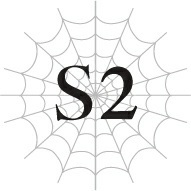

# Chương S2: Tiết học ma pháp

*(Magic Lesson)*

---

### --- TRANG 100 ---

Hôm nay là tiết học thực hành ma pháp.

Sau khi đã học xong những phần lý thuyết cơ bản, chúng tôi được phép tham gia các buổi thực hành để thực sự sử dụng ma pháp.

“Bây giờ chúng ta sẽ phát gậy ma pháp dùng cho việc huấn luyện. Để đảm bảo an toàn, tiết học hôm nay chúng ta sẽ sử dụng những cây gậy ma pháp được yểm thuộc tính thủy.”

Giảng viên của chúng tôi, Thầy Oriza, vừa phát gậy ma pháp cho học sinh vừa nói với giọng điệu có phần thờ ơ.

Các học sinh nhao nhao tranh nhau để được nhận gậy sớm nhất.

“Tất cả các em đều đã sở hữu kỹ năng Cảm nhận Ma lực và Thao tác Ma lực rồi, đúng không? Bởi vì những học sinh không có hai kỹ năng đó sẽ không thể tham gia tiết học này. Nếu có ai chưa đạt yêu cầu, xin vui lòng bước lên phía trước ngay.”

Tất nhiên, tất cả học sinh trong lớp đều đã có Cảm nhận Ma lực và Thao tác Ma lực.

Thực tế thì chính Thầy Oriza đã tự mình dạy chúng tôi những kỹ năng đó trong buổi học trước.

“Nào, các em hãy tập trung ma lực lại.”

Tuân theo chỉ dẫn của thầy, tôi tập trung tinh thần để tích lũy ma lực của mình.

“Sau khi đã làm xong bước đó, hãy thử truyền dòng ma lực đó vào cây gậy của mình. Lúc đó ma pháp được yểm sẵn trong gậy sẽ tự động kích hoạt.”

Hả? Chỉ vậy thôi sao?

“Những cây gậy này đã được yểm ma pháp hệ Thủy cấp 1 là Thủy Cầu. Đó là một phép thuật đơn giản giúp bắn ra các quả cầu nước, nhưng tuyệt đối không được chĩa gậy vào người khác. Phía trước đã có sẵn các tấm bia mục tiêu cho các em luyện tập.”

Thầy Oriza chỉ tay về phía khu vực đã được thiết lập sẵn vài tấm bia mục tiêu.

Không để mất thời gian, các học sinh bắt đầu thi triển ma pháp ngay lập tức.

Hầu hết bọn họ đều không có đủ ma lực, hoặc cấu trúc ma pháp được tạo ra không hoàn chỉnh, hoặc gặp phải một số vấn đề khác, khiến phép thuật của họ bị tiêu tan

### --- TRANG 101 ---

trước khi kịp chạm tới tấm bia.

“Các em có thể sử dụng ma pháp bao nhiêu tùy thích trong suốt tiết học này. Nếu sử dụng đủ nhiều, các em thậm chí có thể tự mình học được kỹ năng Thủy Ma pháp. Tuy nhiên, xin vui lòng chú ý đến lượng ma lực còn lại của bản thân và dừng lại ngay khi nó chạm mức nguy hiểm. Bằng không, đừng có mà đến than khóc với ta nếu các em quá đà dẫn đến ngất xỉu đấy nhé.”

Thật là vô trách nhiệm mà.

Nhưng tôi đoán là năm nào cũng có người bị ngất xỉu như vậy.

Rất nhiều học sinh ở đây mới chỉ sử dụng ma pháp lần đầu tiên trong đời, và một vài người trong số họ tỏ ra cực kỳ phấn khích.

Nên cũng không có gì đáng ngạc nhiên nếu có một hai người hưng phấn quá đà mà vượt qua giới hạn chịu đựng của bản thân.

“Thủy Ma pháp sao? Cá nhân tớ thì vẫn thích Thổ Ma pháp hơn.”

Fei phàn nàn từ vị trí nằm trên vai tôi.

Fei là một con địa phi long, nên cô nàng có lẽ có thiên hướng tương thích với Thổ Ma pháp hơn là Thủy Ma pháp.

Tôi cũng biết rõ thiên hướng tương thích của bản thân, nhờ vào kết quả từ buổi Lễ Thẩm định lúc trước.

Quang Ma pháp là cao nhất, tiếp theo là Thủy Ma pháp.

Xét theo khía cạnh đó, có thể nói tiết học này rất có giá trị đối với tôi.

Tuy nhiên, trên đời này chỉ có một số lượng cực kỳ ít ỏi các viên Đá Thẩm định đủ mạnh để hiển thị mức độ tương thích của một người với các hệ thuộc tính khác nhau.

Thay vào đó, những người không có cơ hội tiếp xúc với các ma cụ cao cấp như vậy sẽ sử dụng các công cụ được yểm sẵn ma pháp để kích hoạt phép thuật và học kỹ năng theo cách đó, tương tự như những gì chúng tôi đang làm lúc này.

Bạn có thể tự mình nhận biết bản thân có năng khiếu với hệ ma pháp đó hay không dựa trên tốc độ học được kỹ năng đó nhanh hay chậm.

Dẫu vậy, phương án đó chỉ khả thi nếu bạn có cơ hội tiếp cận với các công cụ ma pháp đa thuộc tính. Trong nhiều trường hợp, các gia đình sử dụng ma pháp nghèo khó chỉ sở hữu duy nhất một loại công cụ ma pháp gia truyền dưới tên tuổi của dòng họ mình.

Trong tình cảnh đó, bạn không còn lựa chọn nào khác ngoài việc phải sử dụng hệ thuộc tính đó, bất kể bạn có năng khiếu với nó hay không.

Nhưng ở ngôi trường này, nơi đây có sẵn công cụ ma pháp của tất cả các hệ thuộc tính, nên rắc rối đó hoàn toàn không tồn tại.

“Tớ đơn giản là không có chút năng khiếu nào với Thủy cả. Ngược lại, tớ có vẻ thiên về hệ Hỏa hơn.”

### --- TRANG 102 ---

“Thật trùng hợp. Tớ cũng không giỏi hệ Thủy và tương thích tốt với hệ Hỏa đây.”

Tôi tình cờ nghe được cuộc trò chuyện giữa Katia và Hugo.

Dù ngoài miệng nói vậy, nhưng những quả cầu nước do Katia tạo ra vẫn đang bắn trúng các bia mục tiêu một cách hoàn hảo.

Xét đến việc hầu hết các học sinh khác còn chưa thể bắn phép thuật chạm tới đích, tôi phải thừa nhận rằng những cú bắn chuẩn xác của cậu ấy đã là rất cừ khôi rồi.

Nhìn quanh một lượt, những người duy nhất bắn trúng mục tiêu thành công mà tôi thấy là Katia, Hugo, và Yuri, tức Hasebe kiếp trước.

Yuri đang tập trung cao độ để liên tục nã các quả cầu nước vào các tấm bia.

Tôi tự hỏi liệu bắn liên thanh như thế có an toàn không, nhưng tôi nghi ngờ dù mình có gọi Yuri vào lúc này thì cậu ấy cũng chẳng nghe thấy gì đâu.

Cậu ấy chắc chắn đang dự định sẽ kiên trì bắn cho đến khi học được kỹ năng mới chịu thôi, bất kể lượng MP có cạn kiệt đi chăng nữa.

Nhắc mới nhớ, Cô Oka không có ở đây.

Cô ấy thích đến lớp hay không là tùy vào tâm trạng.

Và cô ấy cũng chẳng bao giờ hé răng nửa lời về việc mình làm gì mỗi khi vắng mặt.

Dù sao thì, tôi cảm thấy Sue hoàn toàn có thể làm được nếu con bé chịu thử, nhưng con bé chỉ lẳng lặng đứng sau lưng tôi, không hề có ý định sử dụng ma pháp chút nào.

“Sue, em không muốn thực hành sao?”

“Ồ, em không thể đi trước hoàng huynh được. Thay vào đó, em sẽ kiên nhẫn chờ đợi cho đến khi anh thể hiện năng lực ma pháp thần sầu của mình, rồi em mới tranh thủ thực hành trong lúc mọi người đang vây quanh tán dương anh.”

Trời ạ. Đúng là biết cách tạo áp lực mà.

Tôi tuy luôn muốn trở thành một người anh trai khiến em gái mình tự hào, nhưng dạo gần đây, mong muốn đó lại chuyển hóa thành một lượng áp lực cực kỳ khủng khiếp.

Trong lúc đó, một vài học sinh đã cạn sạch ma lực và bắt đầu ngồi nghỉ ngơi.

Nghĩa là đã có vài tấm bia mục tiêu trống chỗ, nên chắc tôi cũng sẽ thử xem sao.

Nghĩ lại thì, đây là lần đầu tiên tôi thực sự trải nghiệm việc sử dụng ma pháp.

Từ trước đến nay, Anna luôn ngăn cản tôi luyện tập bất cứ thứ gì khác ngoài việc kiểm soát dòng chảy ma lực, nên tôi chưa bao giờ thực sự thi triển phép thuật cả.

Giờ tôi đang thấy hơi phấn khích rồi đây.

Nhưng đồng thời, áp lực từ em gái cũng làm tôi thấy có chút căng thẳng.

“Hừ, tớ không thấy có ích lợi gì khi phải luyện tập thứ ma pháp mà mình biết chắc là sẽ dở tệ cả.” Như thể để dập tắt sự phấn khích của tôi, Hugo ném cây gậy ma pháp của mình sang một bên. “Việc tập trung cải thiện những thứ mình giỏi sẽ hiệu quả hơn nhiều so với việc tốn công rèn luyện điểm yếu.”

Hugo tập trung ma lực của mình lại. Cậu ta định làm gì thế?

Ngay khoảnh khắc tiếp theo, cậu ta thi triển phép thuật. Không cần dùng đến gậy ma pháp.

Kết quả là một phép thuật hệ hỏa xuất hiện. Hóa ra cậu ta vốn đã sở hữu Hỏa Ma pháp từ trước rồi sao?!

Ngọn lửa thiêu rụi toàn bộ dãy bia mục tiêu phía trước.

Sức tàn phá thật đáng kinh ngạc.

Đối với những học sinh còn chưa thể bắn trúng bia, đây rõ ràng là một màn phô diễn sức mạnh vượt trội của cậu ta.

Thực tế thì, đây quả là thời điểm hoàn hảo để thể hiện. Hugo chắc chắn đã nhận ra điều đó và cố tình tạo ra màn biểu diễn này để khẳng định thực lực của bản thân.

Nhưng thế này thì quá đà rồi!

Ngọn lửa dữ dội vẫn đang cuộn xoáy xung quanh khu vực đặt bia mục tiêu lúc trước.

ếu không có ai dập lửa, ngọn lửa có thể sẽ lan rộng và bao trùm toàn bộ lớp học mất.

Tôi dồn toàn bộ ma lực của mình vào cây gậy đang cầm trên tay và giải phóng nó hướng về phía ngọn lửa.

Cây gậy ma pháp hấp thụ dòng ma lực của tôi, kích hoạt phép thuật Thủy Ma pháp được yểm bên trong, và bắn ra một quả cầu nước.

Quả cầu nước lao thẳng vào giữa đám cháy và nổ tung, tạo ra một cơn mưa nước xối xả.

...Khá là ấn tượng đấy chứ, nếu tôi tự mình đánh giá.

Quả cầu nước được tạo ra từ lượng ma lực khổng lồ của tôi có kích thước cực kỳ lớn. Đủ để tạo ra một cột nước phun trào khi phát nổ.

Ngọn lửa hoàn toàn bị nuốt chửng bởi lượng nước khổng lồ đó và dập tắt hoàn toàn.

`<Độ thuần thục đã đạt mức yêu cầu. Đã nhận kỹ năng [Thủy Ma pháp LV 1].>`

Tôi vừa mới học được kỹ năng Thủy Ma pháp.

Có lẽ thiên hướng tương thích cực kỳ cao của tôi là lý do giúp tôi học được nó chỉ sau một lần thi triển duy nhất.

Hoặc cũng có thể là do quy mô của phép thuật vừa rồi quá lớn? Chắc là cả hai lý do cộng lại rồi.

“Quả nhiên là hoàng huynh của em! Còn ai có thể dập tắt phép thuật Hỏa Ma pháp cấp 5 chỉ bằng một đòn Thủy Ma pháp cấp 1 cơ chứ?”

### --- TRANG 104 ---

Như thể để kéo tôi trở lại thực tại, Sue cất tiếng ca ngợi tôi với một giọng điệu đặc biệt lớn.

Thì ra đó là phép Hỏa Ma pháp cấp 5 sao?

Mà khoan, Sue ơi, em cố tình làm vậy đúng không? Bình thường em đâu có nói to như thế đâu.

Quả nhiên, Hugo đang trừng mắt nhìn tôi đầy giận dữ vì đã cướp đi hào quang của cậu ta.

Tuy nhiên, trước khi cậu ta kịp làm bất cứ điều gì, Thầy Oriza đã đột nhiên xuất hiện lù lù sau lưng cậu ta.

“Ta có thể nói chuyện riêng một chút không, Hugo?”

“Cái gì? Tại sao tôi phải nói chuyện với thầy?”

“Cứ đi theo ta một lát đi.”

Thầy Oriza gần như là cưỡng chế lôi Hugo đi, bỏ lại phía sau những mảnh tàn tích cháy sém của đống bia mục tiêu cùng một đám học sinh đang vô cùng ngơ ngác.

“Trời ạ, Natsume trông thảm hại thật đấy.”

Fei thì thầm bên tai tôi.

Ở rìa tầm mắt, tôi thấy Katia đang nhanh chóng ổn định lại đám học sinh đang ồn ào xung quanh. Cảm ơn cậu nhiều nhé, Katia!

Đây chính là ngày mà Hugo bắt đầu xem tôi như một kẻ thù không đội trời chung.

