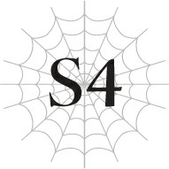

# Chương S4: Cuộc sống học đường

*(School Life)*

---

### --- TRANG 147 ---

Cuộc sống học đường của tôi đang diễn ra khá suôn sẻ.

Tôi vốn đã biết hầu hết những nội dung được giảng dạy trên lớp, nhưng tôi vẫn chú ý lắng nghe như một cách để ôn tập lại kiến thức.

Những lúc bài học quá nhàm chán đến mức không thể chịu đựng nổi, tôi luôn có thể giết thời gian bằng cách âm thầm rèn luyện để nâng cao cấp độ kỹ năng của mình.

Nếu chỉ nhìn vào các lớp học, mọi thứ có vẻ như đang diễn ra vô cùng tuyệt vời, nhưng tôi lại đang gặp phải kha khá rắc rối trong các mối quan hệ cá nhân.

Chuyện này liên quan nhiều đến địa vị xã hội của tôi và cả sự cố trong tiết học ma pháp hôm nọ nữa.

Vì trên danh nghĩa tôi là hoàng tộc, nên mặc dù điều đó không nên gây ảnh hưởng đến tư cách học sinh của tôi ở trường, nó vẫn là một vấn đề khá nan giải.

Dù tôi có cố gắng khuyên họ thả lỏng thế nào đi chăng nữa, những người đến từ vương quốc này dường như vẫn không thể tránh khỏi việc tỏ ra khép nép trước mặt tôi.

Ngay cả các quý tộc đến từ các quốc gia khác cũng gặp khó khăn trong việc trò chuyện thân mật với tôi.

Có vẻ như chỉ có hoàng tộc hoặc những người có địa vị tương đương, chẳng hạn như người thừa kế của một gia tộc Công tước, mới có thể tiếp cận tôi một cách bình đẳng.

Trong số đó, có vài người chỉ đơn thuần cố gắng nịnh bợ tôi, nhưng Katia đã nhanh chóng giải quyết gọn gàng bọn họ trong nháy mắt.

Thú thật, vì tôi thường có xu hướng hơi nhu nhược trong những tình huống như vậy, nên tôi rất biết ơn khi có một người như Katia ở bên cạnh.

Dẫu vậy, giữa chuyện đó và sự cố trong tiết học ma pháp, tôi vẫn cảm thấy có chút cô đơn.

Mặt khác, Hugo lại thu thập được khá nhiều môn đồ kể từ sau tiết học đó.

### --- TRANG 148 ---

Hiện tại, gần một nửa số nam sinh trong năm học của chúng tôi đã trở thành người ủng hộ cậu ta. Cậu ta đang dần trở thành thủ lĩnh tự phong của bọn họ, giống hệt như ở kiếp trước vậy.

Và cũng giống như ở kiếp trước, tôi đang cố gắng hết sức để tránh dính líu đến nhóm người đó.

Rõ ràng là Hugo luôn coi tôi là kẻ thù kể từ sau sự cố ma pháp đó.

Tôi không thấy có lý do gì để cố gắng tiếp cận một người vốn đã ghét bỏ mình cả.

Tại sao phải tự rước thêm rắc rối vào người chứ?

Vì vậy, hiện tại tôi chủ yếu dành thời gian của mình với Katia, Sue, Fei, và giờ có thêm cả Yuri nữa.

Katia và Sue rất thấu hiểu tôi, và dù Fei thỉnh thoảng hơi quá đà một chút, chúng tôi vẫn đã dành nhiều thời gian bên nhau.

Còn về phần Yuri, ừm, tôi cũng không biết phải nói sao nữa.

Đúng là chúng tôi là những người bạn tái sinh của nhau, nhưng đôi khi tôi thấy rất khó để đối phó với cô ấy, mặc dù theo một cách hoàn toàn khác so với Natsume.

Tên mới của Hasebe là Yurin Ullen.

Có vẻ như họ của cô ấy là tên của giáo hội đã nhận nuôi cô ấy thay vì một cô nhi viện bình thường.

Hasebe, hay Yuri, đã phải tự mình bươn chải để sinh tồn ngay từ khi còn là một đứa trẻ.

Hóa ra, đó là chuyện hết sức bình thường ở thế giới này.

Tất nhiên, trẻ mồ côi cũng tồn tại ở thế giới cũ của chúng tôi, nhưng ở thế giới này, nơi nền văn minh chưa mấy phát triển và quái vật hoành hành khắp nơi, điều đó lại càng xảy ra thường xuyên hơn.

Rất nhiều đứa trẻ bị bỏ rơi từ khi còn là trẻ sơ sinh và được nuôi dưỡng trong giáo hội.

Tuy nhiên, hoàn cảnh của Yuri lại khác biệt so với những đứa trẻ mồ côi khác.

Cô ấy sở hữu ký ức của kiếp trước từ rất sớm sau khi sinh ra, nên cô ấy hoàn toàn nhận thức được những gì đang diễn ra xung quanh mình.

Hãy thử tưởng tượng việc đột ngột tỉnh dậy trong hình dạng một đứa trẻ sơ sinh xem.

Chuyện đó cũng từng xảy ra với tôi. Nó thực sự rất sốc.

Hoàn toàn hoang mang và trên hết là vô cùng sợ hãi.

Mình đã chết rồi sao? Chuyện gì sẽ xảy ra với mình từ giờ đây?

Và chuyện gì đã xảy ra với kiếp trước của mình rồi?

Chỉ riêng ngần ấy lo âu thôi cũng đủ để kéo dài suốt cả cuộc đời rồi.

Nhưng trên hết, Yuri lại bị bỏ rơi trong chính trạng thái đó. Sự kinh hoàng mà tôi trải qua chắc chắn không thể nào sánh bằng cô ấy được.

### --- TRANG 149 ---

Thú thật, tôi thậm chí còn không thể tưởng tượng nổi Yuri đã cảm thấy thế nào vào thời điểm đó.

Giữa muôn vàn đau khổ đó, Yuri chỉ có một thứ duy nhất để bấu víu vào.

Đó chính là Thần ngôn.

Thần Ngôn Giáo là tổ chức tôn giáo đã nhận nuôi Yuri, và đây là một trong những tôn giáo phổ biến nhất trong loài người.

Nói một cách ngắn gọn, giáo lý cơ bản của họ là "cải thiện kỹ năng để chúng ta có thể nghe thấy Thần ngôn."

Thần ngôn. Tôi hiện tại vẫn chưa thực sự hiểu rõ ý nghĩa của nó là gì.

Nó có phần giống như các thông báo hệ thống trong một trò chơi điện tử, nhưng ở thế giới này, mọi người đều đã quá quen thuộc với việc nghe thấy nó.

Có lẽ những người tái sinh chúng tôi là những kẻ duy nhất cảm thấy chuyện đó kỳ lạ.

Việc nghe thấy giọng nói này là điều hiển nhiên. Có kỹ năng cũng là chuyện bình thường. Ở thế giới này, đó chỉ là lẽ thường tình.

Thần Ngôn Giáo thuyết giảng rằng giọng nói đó thực sự là của Thượng đế, và việc nâng cao kỹ năng cũng như cấp độ của bản thân để giọng nói đó trò chuyện với bạn thường xuyên hơn sẽ giúp bạn đến gần hơn với Thần.

Dưới góc nhìn của tôi thì chuyện đó nghe có vẻ rất nhảm nhí, nhưng không hiểu vì lý do gì, nó lại là chân lý phổ biến ở thế giới này.

Và Yuri, mặc dù là một người tái sinh giống như tôi, lại hoàn toàn bị cuốn vào đó.

“Shun, kỹ năng của cậu rất cao đúng không? Tớ nghĩ điều đó thật tuyệt vời. Hãy tiếp tục nâng cao kỹ năng của chúng ta để có thể nghe thấy Thần ngôn nhiều hơn nữa nhé.”

“Shun, cậu không chịu tăng cấp sao? Thế là không được đâu! Khi cậu tăng cấp, Thần ngôn sẽ trò chuyện với cậu rất lâu đấy. Chúng ta phải tiếp tục lên cấp để lắng nghe giọng nói của Thượng đế.”

“Shun, cậu sử dụng được Thẩm định đúng không? Vậy thì, nếu cậu nhìn thấy ai sở hữu kỹ năng gọi là Cấm kỵ, hãy báo ngay cho tớ nhé. Việc sở hữu một kỹ năng bị Thượng đế gán cho cái danh Cấm kỵ là điều hoàn toàn không thể chấp nhận được. Dù có chuyện gì đi chăng nữa cậu cũng không được bỏ qua cho họ, vì kỹ năng Cấm kỵ đồng nghĩa với việc kẻ sở hữu đã phạm phải một tội lỗi mà ngay cả Thượng đế cũng không muốn gọi tên. Không có lý do gì để cho một kẻ như thế được sống cả. Tiêu diệt họ chính là thánh vụ của chúng ta. Nên nhớ báo cho tớ biết nhé, được không? Hứa với tớ đi.”

“Shun, hôm nay một kỹ năng của tớ đã lên cấp, và tớ lại được nghe giọng nói của Thượng đế rồi! Ôi, giọng nói thiêng liêng của Thượng đế đã vang lên bên tai tớ. Hôm nay chắc chắn sẽ là một ngày ngập tràn phước lành.”

Tôi chịu thôi. Thực sự không thể chịu nổi.

Ý tôi là, tôi chắc chắn Yuri không thể kiềm chế được việc đôi mắt mình sẽ trở nên vô hồn mỗi khi nói về vị "Thượng đế" này.

Nhưng tôi không nghĩ kiếp trước cô ấy lại là người như thế này.

Cô ấy chỉ là một nữ sinh trung học bình thường mà thôi.

Chắc hẳn hoàn cảnh đặc biệt của cô ấy đã khiến cô ấy thay đổi nhiều đến thế.

Nỗi khiếp sợ khi bị tái sinh. Sự tuyệt vọng khi bị cha mẹ bỏ rơi.

Mối lo âu khi bị ép buộc phải sinh tồn trong một thế giới xa lạ mới.

Xét đến tất cả những điều đó, không có gì ngạc nhiên khi Thần ngôn, cất lên bằng tiếng Nhật — ngôn ngữ mà cô ấy luôn nhớ nhung da diết — lại mang đến cho cô ấy sự an ủi.

Chưa kể cô ấy còn bị bao quanh bởi những người tôn thờ giọng nói đó.

Việc cô ấy bấu víu vào giáo lý của Thần Ngôn Giáo thậm chí có thể là điều không thể tránh khỏi.

Dẫu vậy, tôi vẫn không thể hiểu nổi việc cô ấy cuồng tín đến mức trở thành một ứng cử viên thánh nữ.

Ngoài ra, tôi ước gì cô ấy dừng việc liên tục quấy rối người khác để thuyết phục họ cải đạo đi.

Ý tôi là, cách chào hỏi của cô ấy luôn là, “Cậu đã mở lòng đón nhận Thần ngôn chưa?”

Xin lỗi nhé, nhưng tôi không phải là kiểu người sùng đạo cho lắm.

Dù vậy, bất kể tôi có lịch sự từ chối bao nhiêu lần đi chăng nữa, Yuri vẫn không hề có dấu hiệu bỏ cuộc.

Thậm chí cô ấy còn tiếp cận tôi một cách quyết liệt hơn nữa.

Chuyện này diễn ra thường xuyên đến mức tôi đã quá quen thuộc với cảnh tượng Sue giận dữ lao vào để xua đuổi cô ấy đi, rồi Katia sẽ xuất hiện để hòa giải.

Nhắc đến Sue, dạo gần đây em ấy cũng có những biểu hiện khá kỳ lạ.

Có vẻ như em ấy muốn hỏi tôi điều gì đó nhưng lại không biết phải mở lời như thế nào.

Dù vậy, tôi cũng có một chút linh cảm về câu hỏi của em ấy là gì.

Hay nói đúng hơn, tôi khá chắc chắn mình biết, vì Katia đã kể hết cho tôi nghe rồi.

“Sue đã cố gắng hỏi tớ về mối quan hệ giữa chúng ta.”

“Hử? Ý cậu là sao?”

“Thì... kiếp trước của chúng ta ấy. Em ấy chắc hẳn đã đoán ra có điều gì đó bất thường khi nhìn thấy chúng ta nói chuyện với cô Oka.”

“À... Đúng là chúng ta đã nói tiếng Nhật trước mặt em ấy nhỉ?”

“Ừ, chính xác. Ý tớ là, nếu cậu có một người anh trai vốn đã ở bên cạnh cậu từ lúc mới sinh ra, thế rồi một ngày nọ cậu ta đột nhiên bắt đầu trò chuyện với những người hoàn toàn xa lạ bằng một thứ ngôn ngữ xa lạ nào đó, dĩ nhiên là cậu sẽ thấy kỳ quặc rồi.”

“Phải rồi... Chết thật chứ.”

“Thế nên, nếu em ấy hỏi cậu, việc nói ra sự thật hay nghĩ ra một lời nói dối thuyết phục hoàn toàn phụ thuộc vào cậu.”

“Hả? Tớ đâu thể kể cho em ấy sự thật được đúng không?”

“Tớ đang bảo chuyện đó là tùy cậu quyết định mà. Cậu muốn tiếp tục nói dối em gái mình hay sẽ thành thật với em ấy? Bất kể cậu quyết định thế nào, tốt nhất là cậu nên sẵn sàng chịu trách nhiệm hoàn toàn với câu trả lời của mình. Đó là điều tối thiểu cậu có thể làm cho em ấy, cậu không nghĩ vậy sao?”

“Hự... Được rồi, tớ hiểu rồi.”

Vì vậy, tôi đoán Sue đang muốn hỏi tôi về mối quan hệ giữa tôi và những người khác.

Thú thật, tôi hoàn toàn chưa sẵn sàng chút nào cả.

Kể cho Sue nghe sự thật ư?

Chúng tôi tuy chỉ là anh em cùng cha khác mẹ, nhưng vẫn là anh em ruột thịt.

Nhưng kiếp trước của tôi lại hoàn toàn không liên quan gì đến Sue cả. Tôi của ngày xưa là một người hoàn toàn xa lạ đối với em ấy.

Tôi vốn luôn coi Sue là em gái ruột của mình, nhưng một khi biết được sự thật, liệu em ấy có còn xem tôi là anh trai của mình nữa không?

Trên hết, tôi đã có được lợi thế từ những ký ức và kinh nghiệm ở kiếp trước trong quá trình trưởng thành ở thế giới này.

Đối với Sue, người đã đi được đến tận đây mà không có bất kỳ lợi thế nào như vậy, chuyện đó có thể giống như gian lận.

Liệu em ấy có nhìn tôi bằng nửa con mắt khi phát hiện ra chuyện đó không?

Tôi không nghĩ Sue là kiểu người như vậy, nhưng... chỉ cần tưởng tượng đến điều đó thôi cũng đủ khiến tôi sợ hãi không dám nói ra rồi.

Như vậy chỉ còn lựa chọn là nghĩ ra một lý do nào đó để che giấu, nhưng ý nghĩ lừa dối em ấy như vậy cũng khiến tôi đau lòng.

Xét đến việc em gái tôi đang phải đấu tranh tâm lý nhiều thế nào mới dám hỏi tôi chuyện đó, thật không phải khi cứ thế nói dối em ấy một khi em ấy đã lấy hết can đảm để tiếp cận tôi.

Nếu tôi định nói dối em ấy lúc này, tôi sẽ phải chuẩn bị tâm lý để tiếp tục nói dối suốt phần đời còn lại của mình.

Tôi hiện tại vẫn chưa quyết định được mình sẽ làm gì.

Nhưng tôi biết rằng khi em ấy thực sự hỏi tôi, tôi sẽ phải cân nhắc câu trả lời của mình một cách cực kỳ nghiêm túc.

Nếu không phải vì những lời Katia nói với tôi, có lẽ tôi đã chỉ đơn thuần cười trừ cho qua chuyện mà không suy nghĩ sâu sắc như vậy.

Tôi phải cảm ơn cậu ấy vì đã đưa ra lời khuyên cho tôi từ trước.

Vì vậy, về cơ bản là lúc này tôi đang có đủ thứ vấn đề phải lo nghĩ.

Hugo thì ghét bỏ tôi, Yuri thì cố gắng lôi kéo tôi cải đạo, và tôi thì phải nghĩ xem mình sẽ nói gì với Sue.

Trên hết tất cả những chuyện đó, cô Oka vẫn bí ẩn như mọi khi.

Đôi khi, cô ấy sẽ vắng mặt lâu đến mức chúng tôi tưởng cô ấy đã đi đâu đó rồi, thế rồi đúng lúc đó cô ấy lại thong thả bước vào lớp học.

Khi tôi cố gắng hỏi cô ấy về chuyện đó, cô ấy thường chỉ né tránh câu hỏi của tôi.

Tôi cảm thấy điều này đặc biệt rõ ràng mỗi khi tôi hỏi cô ấy về nơi ở của Kyouya.

Kyouya là một người bạn mà Katia và tôi đặc biệt thân thiết ở kiếp trước.

Nhưng cô Oka lại không chịu hé răng nửa lời về cậu ấy với tôi.

Rõ ràng là cô ấy biết gì đó, nhưng cậu ấy có vẻ như không nằm dưới sự bảo hộ của cô ấy.

Tôi muốn biết cậu ấy đang ở đâu và làm gì, nhưng có vẻ như cô ấy sẽ không sớm kể cho tôi nghe chuyện đó đâu.

Mọi người đều đã thay đổi quá nhiều ở thế giới này.

Yuri đã trở thành một kẻ cuồng tín tôn giáo.

Cái tôi vốn đã mạnh mẽ của Hugo lại càng trở nên dữ dội hơn, và ham muốn làm tâm điểm chú ý của cậu ta dường như đang vượt quá tầm kiểm soát.

Cô Oka thì dường như đã mất đi sự kiểm soát đối với mọi việc.

Có lẽ đây là điều không thể tránh khỏi.

Nơi đây là một môi trường rất khác biệt so với Nhật Bản, và chúng tôi cũng đã ở đây một thời gian dài rồi.

Thực tế thì việc giữ nguyên như cũ mới là điều khó khăn hơn. Nhưng tôi sợ sự thay đổi.

Ý tôi là, hãy nhìn những gì đã xảy ra với Yuri và Hugo xem. Trông họ cứ như sắp phát điên đến nơi rồi ấy.

“Katia, hứa với tớ là cậu sẽ không thay đổi nhé.”

Bị cuốn vào những suy nghĩ đó, tôi đã vô tình buột miệng nói ra một câu kỳ quặc với Katia.

Bởi vì khi tôi tưởng tượng đến việc ngay cả Katia cũng thay đổi so với một Kanata mà tôi hằng biết, tôi thực sự rất sợ hãi.

Thú thật, tôi nghĩ việc có Katia ở đây để giữ kết nối giữa tôi và kiếp trước đóng một vai trò vô cùng to lớn trong việc giúp tôi giữ được sự thăng bằng tâm lý.

### --- TRANG 153 ---

Nên dĩ nhiên là tôi cũng không muốn Katia thay đổi chút nào rồi.

---

[◀ Chương trước: Chương 6: Zoa Ele](06_zoa_ele.md) | [Chương tiếp theo: Đoạn phụ: Con gái Công tước và Thánh nữ tương lai ▶](interlude_the_dukes_daughter_and_the_future_saint.md)
