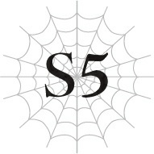

# Chương S5: Lớp học thống trị

*(Ruling Class)*

---

### --- TRANG 182 ---

Hôm nay chúng tôi có hoạt động ngoại khóa.

Hoạt động của tôi, lớp học thám hiểm, được tổ chức trên một ngọn núi nhỏ nằm gần học viện.

Mặc dù từ "gần" ở đây chỉ mang tính tương đối, vì phải mất nửa ngày đi bộ để đến được đó và cũng chừng ấy thời gian để quay về.

Chỉ những học sinh đã vượt qua kỳ thi do học viện tổ chức mới được tham gia.

Trong số các học sinh năm nhất chúng tôi, tổng cộng có mười hai người được phép tham gia lớp học thám hiểm này.

Chúng tôi rời trường từ sáng sớm và đến chân núi ngay trước khi trời trưa.

Tại đây, chúng tôi có một buổi phổ biến quy chế cuối cùng trong căn nhà gỗ ở chân núi và ăn trưa.

Sau bữa trưa, chúng tôi được chia thành các nhóm nhỏ và bắt đầu leo núi.

Chúng tôi sẽ dành cả ngày để khám phá ngọn núi, cắm trại qua đêm tại đó, và đi xuống núi vào sáng hôm sau.

Về mức độ nguy hiểm, khu vực này chỉ có những loài quái vật yếu nhất, cấp thấp nhất sinh sống.

Trước buổi thám hiểm, học viện đã cử nhân viên đến điều tra và xác nhận không có quái vật mạnh nào xuất hiện.

Ngay cả những quái vật yếu thỉnh thoảng cũng tiến hóa và trở nên mạnh mẽ, nên có vẻ như họ luôn kiểm tra kỹ lưỡng trước mỗi buổi học.

Buổi dã ngoại này có một số mục tiêu:
Học các kỹ năng sinh tồn cơ bản.
Trải nghiệm môi trường có quái vật thực sự sinh sống.
Thu thập thảo dược và tích lũy thêm kiến thức về núi rừng.

### --- TRANG 183 ---

Mục tiêu chung là tích lũy tất cả những trải nghiệm đó.

Lý tưởng nhất là chúng tôi phải thực hiện điều đó trong khi vẫn đảm bảo an toàn tuyệt đối suốt chuyến đi.

Thậm chí còn có hình phạt nếu ai đó cố tình trực tiếp đối đầu với quái vật.

Nếu bạn bị tấn công, bạn có thể nhận được điểm dựa trên cách bạn xử lý tình huống, nhưng việc cố tình đi săn tìm để tấn công quái vật là hoàn toàn bị nghiêm cấm.

Lớp học được chia thành các nhóm, mỗi nhóm gồm bốn học sinh và một giáo viên.

Thành phần của các nhóm này được quyết định bằng cách bốc thăm, và trừ khi có vấn đề nghiêm trọng về cân bằng lực lượng, sẽ không có chuyện đổi nhóm.

Thật không may, Sue, Katia và Yuri đều bị chia vào các nhóm khác tôi.

Và xui xẻo hơn nữa là tôi lại chung nhóm với Hugo.

Nhóm của chúng tôi gồm có tôi, Hugo, cô Oka (tức Filimøs), và Parton, con trai một kỵ sĩ. Giáo viên phụ trách nhóm là Giáo sư Oriza, giáo viên hướng dẫn ma pháp của chúng tôi.

Parton và tôi tuy không xa lạ gì nhau, nhưng cũng chưa đến mức là bạn bè thân thiết.

Cha của Parton trước đây là một nam tước, nhưng ông đã nỗ lực lập nhiều chiến công quân sự để được thăng lên hàng bá tước.

Ông cũng huấn luyện con trai mình vô cùng nghiêm khắc, nên Parton chuyên về các kỹ năng thiên về vật lý.

Sức mạnh của cậu ấy cũng thuộc hàng top trong khối lớp chúng tôi.

Có vẻ như điều đó vẫn chưa đủ để làm cậu ấy thỏa mãn, nên Parton luôn cực kỳ nghiêm túc luyện tập hàng ngày.

Cậu ấy thường tỏ ra rất cung kính trước mặt tôi, nên dù thỉnh thoảng có trò chuyện, tôi không nghĩ chúng tôi đặc biệt thân thiết.

Giáo sư Oriza là một giáo viên dạy ma pháp trung niên.

Thầy ấy có vẻ khá thiếu động lực so với các giáo viên khác. Việc thầy ấy có mặt ở đây chỉ vì nghĩa vụ công việc là điều hết sức rõ ràng.

Thấy rõ thầy ấy không thích dính dáng đến rắc rối, nên khi Hugo và tôi được phân vào nhóm của thầy, thầy ấy chẳng thèm che giấu sự khó chịu của mình.

Có vẻ như việc Hugo căm ghét tôi đã là điều ai ai cũng biết.

Tuy nhiên, vì Giáo sư Oriza là giáo viên, năng lực chiến đấu của thầy ấy chắc chắn là đủ cao để xử lý bất kỳ sự cố nào.

Dù chuyên về ma pháp, thầy ấy cũng sở hữu các kỹ năng cận chiến, và các chỉ số của thầy ấy dĩ nhiên là vượt trội so với bất kỳ học sinh nào.

Nếu có chuyện bất ngờ xảy ra, giáo viên có nhiệm vụ bảo vệ học sinh, nên việc cử một giáo viên yếu đi cùng chúng tôi trong chuyến dã ngoại này là hoàn toàn vô lý.

### --- TRANG 184 ---

Điều khiến tôi ngạc nhiên là Filimøs, tức cô Oka trước đây, cũng thực sự tham gia chuyến đi này.

Cô ấy thường xuyên biến mất không lời báo trước.

Tôi có cảm giác cô ấy đang âm thầm hoạt động ở hậu trường, nhưng cô ấy không bao giờ kể cho chúng tôi biết mình đang làm gì.

Nếu việc đó buộc cô ấy phải cúp học không phép, chắc hẳn cô ấy phải cực kỳ bận rộn.

Nên tôi không ngờ cô ấy lại xuất hiện trong một chuyến đi kéo dài gần hai ngày trời thế này.

Mặc dù vậy, cân nhắc đến tình hình giữa tôi và Hugo, tôi thấy khá an lòng khi có cô ấy bên cạnh.

Bằng cách này, nếu Hugo định kiếm chuyện với tôi, cô Oka chắc chắn sẽ can thiệp.

“Được rồi, phần phổ biến quy chế đến đây là hết. Sau khi mọi người ăn trưa xong, hãy tập hợp theo nhóm và xuất phát.”

Giáo viên phụ trách chuyến dã ngoại kết luận buổi họp.

Sau khi ăn xong, chúng tôi sẽ lên đường cùng nhóm của mình.

“Anh trai yêu quý, chúng ta phải tạm chia tay một lát rồi. Em sẽ cô đơn lắm đây.”

“Sue, chỉ có một ngày thôi mà.”

“Dù chỉ một ngày cũng là quá dài để chịu đựng. Nghĩ đến những chuyện có thể xảy ra với anh khi không có em bên cạnh, chắc đêm nay em không ngủ nổi mất.”

“Sẽ không sao đâu mà, được chứ? Họ đã xác nhận ngọn núi này an toàn rồi. Sẽ không có chuyện gì xảy ra đâu.”

I xoa đầu Sue để trấn an em ấy.

“Shun, hãy cẩn thận với Hugo đấy, được chứ? Cậu ta có vẻ đã hoàn toàn phát điên ở thế giới này rồi.”

“…Tớ biết rồi.”

Lời cảnh báo thì thầm của Katia trước khi chúng tôi chia tay cứ văng vẳng mãi trong tâm trí tôi.

Phát điên sao…?

Cậu ta quả thực trông có vẻ ám ảnh với việc đạt được sức mạnh hơn bao giờ hết.

Bằng việc lôi kéo rất nhiều nam sinh trẻ tuổi triển vọng làm thuộc hạ, cậu ta về cơ bản đang xây dựng nền móng cho một đội quân trong tương lai.

Tôi xin lỗi, nhưng cậu ta cứ như một đứa trẻ đang chơi trò xưng vương xưng bá trên đỉnh đồi vậy.

Kiếp trước cậu ta vốn đã hơi tự phụ và trẻ con rồi, nhưng từ khi tái sinh, chuyện đó lại càng trở nên tồi tệ hơn.

Thôi thì tôi sẽ phải cẩn thận để tránh chọc giận cậu ta chỉ vì một sơ suất nhỏ.

### --- TRANG 185 ---

Gác lại những mối lo ngại cá nhân của tôi, buổi thám hiểm của chúng tôi đã diễn ra vô cùng suôn sẻ.

Chúng tôi đến điểm cắm trại được chỉ định mà không đụng độ bất kỳ con quái vật nào.

“Điện hạ Schlain, đây có phải là điểm cắm trại không ạ?”

“Tôi nghĩ vậy. Có vẻ chúng ta đến sớm hơn dự kiến rồi.”

“Ôi chao, tụi nhóc trẻ tuổi đúng là tràn trề năng lượng thật nhaaa. Một quý cô yếu đuối như cô giáo đã phải vất vả lắm mới đuổi kịp các em đấyy!”

“Thôi đi cô. Chỉ số của cô cao ngất ngưởng đúng không cô Oka? Mấy cái trò cỏn con này sao làm khó cô được.”

“Nếu em hỏi côoo, thì một quý ông lịch thiệp sẽ giả vờ như không biết chuyện đó và cư xử nhẹ nhàng với phụ nữ chứ nhỉ!”

“Em không rảnh để đi nịnh bợ phụ nữ đâu, cảm ơn cô.”

“A ha, cô đoán là cũng có mấy đứa con gái thích kiểu con trai nổi loạn thế này đấy chứ.”

Trong khi Hugo đang tranh cãi với cô Oka, Parton và tôi bắt đầu dựng lều trại.

Giáo sư Oriza chỉ im lặng đứng nhìn chúng tôi làm việc.

“Điện hạ Schlain, người có thể giữ giúp tôi cái này được không ạ?”

“Được chứ. Như thế này phải không?”

“Chính xác ạ. Tiếp theo chúng ta làm thế này và thế này…”

“Hiểu rồi. Xong rồi này. Cảm ơn nhé, Parton.”

“Không có gì đâu ạ. Trái lại, tôi phải xin lỗi vì đã làm phiền người giúp đỡ. Đáng lẽ tôi nên tự mình làm hết mới phải, nhưng…”

“Parton này. Ở học viện thì địa vị xã hội không quan trọng đâu. Nên cậu không cần phải bận tâm nhiều quá thế đâu, được chứ?”

“Đúng là như vậy thật, nhưng, thưa Điện hạ Schlain, tôi tôn trọng người vì chính con người của người nữa. Tôi làm những việc này hoàn toàn tự nguyện. Nếu có gì thì người không cần phải tỏ ra áy náy như vậy đâu.”

Tôi hơi bất ngờ trước ánh mắt thẳng thắn của Parton.

Tại sao cậu ấy và những người khác—như em gái tôi, Sue—lại cứ phải tỏ ra cung kính và chăm sóc tôi nhiều đến thế?

Tôi thực sự không hiểu nổi.

Sau khi dựng trại xong, chúng tôi vẫn còn dư dả thời gian trước lịch trình, nên có một chút thời gian rảnh rỗi để giết thời gian.

Chúng tôi quyết định đi thám hiểm xung quanh một chút.

Mỗi người sẽ hoạt động độc lập, khám phá trong một phạm vi nhỏ và không đi quá xa.

Tôi hơi phản đối ý kiến đó, nhưng chúng tôi đồng ý sẽ ở trong phạm vi có thể nghe thấy tiếng gọi của nhau.

Bằng cách đó, nếu có chuyện gì xảy ra, các thành viên khác sẽ đủ gần để chạy đến ứng cứu kịp thời.

Và thế là tôi chỉ còn lại một mình trên núi.

Nếu bạn tự mình thu thập được thảo dược và các loại cây ăn quả khác, bạn có thể nhận được thêm điểm cộng.

Thế là tôi kích hoạt Thẩm định và bắt đầu tìm kiếm thảo dược.

Đột nhiên, tôi nghe thấy tiếng binh khí va vào nhau.

Nó phát ra từ hướng gần đó, nơi Parton đáng lẽ đang thám hiểm.

Âm thanh khá nhỏ, như thể một trong các thanh kiếm đã được rèn đặc biệt hoặc người sử dụng đang dùng kỹ năng Vô thanh.

Nhưng nhờ có Tăng cường Thính giác, tai tôi vẫn bắt được tiếng động đó một cách rõ ràng.

Tôi định lao nhanh về phía Parton thì đột ngột có người chặn đường tôi.

Đó là Hugo.

“Chào nhé.”

“Cậu đang làm gì ở đây thế, Hugo… không, Natsume?”

Hugo chào tôi bằng một giọng khá thân thiện, nhưng điều đó chẳng thể làm giảm bớt sự cảnh giác của tôi.

“Ồ, cậu biết đấy, tớ chỉ đang nghĩ đây là thời điểm không thể tốt hơn để tiễn cậu đi một đoạn.”

Giọng của Hugo rất bình thản, nhưng tôi gần như không tin vào tai mình.

Tôi không thể kiềm chế được việc nuốt nước bọt cái ực.

“Cậu đang đùa đúng không?”

“Trông tớ giống đang đùa lắm à? Cậu là một cái gai trong mắt tớ, và tớ phát ngấy vì điều đó rồi.”

Ngay khoảnh khắc đó, nụ cười nửa miệng đầy vẻ giễu cợt biến mất hoàn toàn trên khuôn mặt Hugo.

“Nghe này, thế giới này tồn tại chỉ để dành cho tớ thôi… Tớ sẽ trở thành kẻ mạnh nhất và thống trị toàn bộ nơi này. Thế nên làm gì có lý do để cho một kẻ có thực lực ngang hàng với tớ, hoặc thậm chí có thể mạnh hơn tớ, tồn tại nữa chứ đúng không?”

“Cậu đang nói cái quái gì thế? Thế giới này không thuộc về bất kỳ ai cả. Tỉnh lại đi.”

“Tỉnh lại sao? Nhưng cậu có thể làm bất cứ điều gì ở thế giới này nếu có kỹ năng phù hợp mà. Cứ như một giấc mơ vậy! Rõ ràng là nó tồn tại chỉ dành cho tớ. Nhưng một thế giới như thế không cần những kẻ thua cuộc như cậu xuất hiện làm gì. Nên là, chết đi.”

Hugo tuốt kiếm ra khỏi vỏ. Tôi không còn lựa chọn nào khác ngoài việc phải làm điều tương tự.

Tôi không thể tin nổi chuyện này. Cậu ta bị điên rồi sao?

### --- TRANG 187 ---

Tôi biết cậu ta ghét tôi, và tôi cũng đoán trước được có chuyện gì đó có thể xảy ra trong chuyến đi này, nhưng tôi chưa bao giờ ngờ được cậu ta lại thực sự muốn giết tôi, đặc biệt là vì một lý do nực cười đến thế.

Cậu ta hoàn toàn nghiêm túc, đúng không?

Ý tôi là, tôi biết đây không phải là trò đùa, nhưng…

Nó vẫn có cảm giác cực kỳ phi thực tế.

Dẫu vậy, tôi vẫn nghe thấy tiếng tim mình đập thình thịch như đánh trống bên tai vô cùng rõ ràng, và đôi tay tôi run lên bần bật khi nắm chặt chuôi kiếm.

Tôi cố gắng nuốt trôi sự hỗn loạn và hoảng loạn để kiểm tra trạng thái của Hugo.

| Thuộc tính | Chi tiết |
|------------|----------|
| **Chủng tộc** | Loài người LV 31 |
| **Tên** | Hugo Baint Renxandt |
| **Trạng thái** | HP: 628/628 (Xanh lá)   MP: 566/566 (Xanh dương)   SP: 609/609 (Vàng) / 502/611 (Đỏ) |
| **Sức tấn công trung bình** | 608 |
| **Sức phòng ngự trung bình** | 599 |
| **Sức mạnh ma pháp trung bình**| 546 |
| **Kháng tính trung bình** | 522 |
| **Tốc độ trung bình** | 583 |
| **Kỹ năng** | [Tự hồi phục HP LV 4] [Tốc độ hồi phục MP LV 4] [Giảm tiêu hao MP LV 4] [Tốc độ hồi phục SP LV 8] [Giảm tiêu hao SP LV 8] [Tăng cường Hủy diệt LV 7] [Tăng cường Cắt LV 7] [Tăng cường Va chạm LV 4] [Tăng cường Hỏa diệm LV 4] [Nhận biết Ma lực LV 8] [Thao tác Ma lực LV 5] [Ma pháp Chiến đấu LV 5] [Truyền Ma lực LV 4] [Tấn công Ma lực LV 2] [Tinh thần Chiến đấu LV 7] [Truyền Năng lượng LV 7] [Tấn công Năng lượng LV 7] [Tấn công Hỏa diệm LV 3] [Tấn công Tê liệt LV 2] [Kiếm thuật LV 6] [Ném LV 5] [Cơ động Không gian LV 6] [Đánh trúng LV 8] [Né tránh LV 8] [Ẩn mình LV 3] [Vông thanh LV 1] [Hoàng đế] [Tập trung LV 9] [Dự đoán LV 3] [Xử lý Tính toán LV 3] [Hỏa Ma pháp LV 5] [Kháng Hủy diệt LV 2] [Kháng Va chạm LV 2] [Kháng Cắt LV 3] [Kháng Lửa LV 3] [Kháng Độc LV 2] [Kháng Tê liệt LV 1] [Kháng Đau LV 1] [Tăng cường Thị giác LV 10] [Thị giác Viễn vọng LV 1] [Tăng cường Thính giác LV 10] [Mở rộng Thính giác LV 1] [Tăng cường Khứu giác LV 8] [Tăng cường Vị giác LV 7] [Tăng cường Xúc giác LV 8] [Trường thọ LV 5] [Tích trữ Ma lực LV 4] [Thân thể Tức thời LV 5] [Bền bỉ LV 5] [Cự lực LV 5] [Vững chãi LV 5] [Tăng lữ LV 4] [Hộ mệnh LV 3] [Gia tốc LV 5] [n% I = W] |
| **Điểm kỹ năng** | 350 |
| **Danh hiệu** | [Kẻ tàn sát quái vật] |

Cậu ta rất mạnh. Khác với tôi, các chỉ số của cậu ta thiên vị khá nhiều về mặt vật lý.

Và không giống như tôi, cậu ta đã tích cực sử dụng điểm kỹ năng để mua thêm kỹ năng mới.

Kỹ năng đáng lo ngại nhất chính là Hoàng đế.

`<Hoàng đế: Gia tăng hiệu quả của các kỹ năng. Đồng thời, có thể gây ra hiệu ứng ngoại đạo "Sợ hãi" lên đối thủ thông qua việc đe dọa.>`

Tôi có thể kháng lại hiệu ứng Sợ hãi.

Nhưng việc gia tăng hiệu quả của tất cả các kỹ năng khác của cậu ta là một vấn đề cực kỳ nan giải.

Hugo vung kiếm lao vào tôi.

Tôi đỡ đòn kiếm của cậu ta bằng thanh kiếm của mình.

Hự, nặng quá!

“Này, đoán xem? Tớ biết cậu chưa từng sử dụng một điểm kỹ năng nào cả. Cậu thậm chí còn chưa chịu tăng cấp nữa cơ. Điểm kỹ năng tồn tại là để dùng đấy, cậu biết mà! Giống như thế này này!”

Thanh kiếm của Hugo bắt đầu phun ra những luồng lửa dữ dội.

Tôi chỉ vừa vặn né tránh kịp thời.

“Làm nhanh lên rồi chết đi cho khuất mắt tớ được không? Nếu chuyện này kéo dài quá, các nhóm khác có thể sẽ nhận ra mất.”

“Cậu thực sự nghĩ mình có thể thoát tội sau khi làm chuyện này sao?”

“Sao lại không chứ? Tớ là vị vua kiếm trong tương lai của thế giới này. Dĩ nhiên tớ có thể làm bất cứ điều gì tớ muốn! Hơn nữa, tớ đã lên kế hoạch cực kỳ hoàn hảo rồi. Lũ thuộc hạ của tớ chắc lúc này đã giải quyết gọn gẽ những đứa khác rồi. Sau khi tống khứ cậu xong, tụi tớ chỉ việc thả lũ quái vật mang theo ra thôi. Những con cực mạnh vốn bình thường không bao giờ xuất hiện ở khu vực này ấy. Thế rồi tụi tớ chỉ việc báo cáo là quái vật đột ngột xuất hiện và

### --- TRANG 189 ---

nuốt chửng một lũ học sinh và giáo viên xấu số, hiểu chưa? Và tớ là người đã tiêu diệt chúng để sống sót.”

“Cậu không nghĩ là người ta sẽ nghi ngờ cậu với một kế hoạch nửa mùa như thế sao?”

“Ai chứ? Họ định nói gì đây? Đây đâu phải là Nhật Bản. Tớ là vị vua kiếm trong tương lai! Ai dám hé răng phản đối tớ chỉ vì có chút nghi vấn nhỏ nhặt cơ chứ? Cậu nghĩ họ muốn khơi mào một cuộc xung đột quốc tế sao? Đúng thế đấy. Thế giới này vận hành như vậy đấy. Làm gì có cái hệ thống công lý tốt đẹp nào ngăn cản được tớ ở đây đâu!”

Những lời nói của cậu ta làm tôi rúng động. Cậu ta không còn suy nghĩ giống như một người Nhật Bản nữa rồi.

Và cậu ta chấp nhận điều đó như thể là một lẽ tự nhiên hiển nhiên vậy.

“Tạm biệt nhé. Đừng lo. Tớ sẽ lưu giữ hình bóng cậu trong một góc nhỏ ký ức của mình.”

Thanh kiếm của cậu ta tụ tụ những ngọn lửa khổng lồ khi vung thẳng xuống.

Tuy nhiên, nó đã không thể chạm tới tôi.

Cơ thể của Hugo đột ngột bị thổi bay ngược về phía sau.

“Natsume. Em đã đi quá giới hạn rồi đấy.”

Một giọng nói lạnh lùng, uy lực đến đáng sợ, hoàn toàn không còn chút ngữ điệu kéo dài thường ngày nữa.

Một áp lực áp đảo hoàn toàn không tương xứng với một tộc Elf bé nhỏ.

Cô Oka.

“Kế hoạch của em thất bại rồi, Natsume. Tất cả thuộc hạ của em đều đã bị bắt giữ. Và tôi cũng đã tự tay xử lý đống quái vật em mang tới rồi.”

“Cá-cái gì cơ?!”

“Có vẻ như em quá bận tâm đến Shun mà đánh giá tôi quá thấp rồi nhỉ. Tôi xin lỗi, nhưng tôi không thể tiếp tục nhắm mắt làm ngơ trước trò nổi loạn này của em được nữa.”

Cô giáo của chúng tôi bước lại gần Hugo đang nằm dưới đất.

Cậu ta cố gắng tung ra một đòn tấn công bất ngờ vào cô, nhưng—

“Hự?!”

—một lực lượng vô hình nào đó đã đè chặt cậu ta xuống mặt đất một lần nữa.

Tôi đoán đó chính là lực lượng đã thổi bay cậu ta cách đây một phút.

Chắc hẳn đó là một loại ma pháp hệ phong nào đó.

Bàn tay cô Oka nắm lấy đỉnh đầu Hugo. Sau đó, tôi cảm nhận được một dòng chảy ma lực vô cùng mạnh mẽ.

Cô ấy có vẻ như đang thi triển một loại thuật chú nào đó lên cậu ta.

### --- TRANG 190 ---

“Kích hoạt quyền hạn kẻ thống trị. Kích hoạt kỹ năng độc quyền của kẻ thống trị theo yêu cầu. Chấp thuận kích hoạt?”

“Chấp thuận.”

Một giọng nói đều đều vô hồn phát ra từ miệng Hugo. Nghe hoàn toàn không giống giọng của cậu ta.

Liệu cô ấy có đang thôi miên cậu ta bằng thứ Ma pháp Dị giáo bị cấm đoán hay không?!

Sự ngạc nhiên của tôi vẫn chưa dừng lại ở đó. Thực tế, đó mới chỉ là khởi đầu.

Trước mắt tôi, Thẩm định hiển thị các chỉ số của Hugo đang tụt dốc không phanh cực kỳ nhanh.

Trên hết, các kỹ năng của cậu ta đang lần lượt biến mất.

Chỉ trong vòng vài giây ngắn ngủi, tất cả các kỹ năng của Hugo đã biến mất hoàn toàn, ngoại trừ kỹ năng bí ẩn với đống chữ cái bị lỗi ký tự kia.

“Cái gì?! Mụ đã làm cái quái gì với tôi thế này?!”

Hugo gầm lên ngay khi vừa tỉnh táo lại.

“Tôi đã hạ chỉ số của em xuống và thu hồi toàn bộ kỹ năng.”

“Cái gì?! Chuyện đó là bất khả thi!”

“Shun, Thẩm định hiển thị thế nào?”

“…Đúng như cô nói thưa cô. Tất cả chỉ số của cậu ta đã giảm xuống còn ba mươi. Thêm vào đó, các kỹ năng đã biến mất sạch sẽ.”

“Cái…? Làm sao…?”

“Thế giới này không thuộc về em. Tôi khuyên em nên nghiêm túc kiểm điểm hành vi của mình và bắt đầu cố gắng sống một cuộc đời bình thường đi. Đằng nào thì việc em sở hữu kỹ năng và trở nên mạnh mẽ hơn cũng chẳng mang lại điều gì tốt đẹp cả đâu…”

Hugo hoàn toàn chết lặng. Tôi cũng vô cùng hoang mang.

Sau sự cố đó, lớp học thám hiểm lập tức bị đình chỉ.

Parton, Giáo sư Oriza và những người khác đều an toàn.

Có vẻ như tình hình lúc đó vô cùng ngàn cân treo sợi tóc, nhưng nhờ có sự can thiệp kịp thời của cô Oka, không có ai bị thương nặng.

Tất cả thuộc hạ của Hugo âm mưu tấn công mọi người đều đã bị bắt giữ.

Tuy nhiên, không một ai trong số họ thừa nhận mối liên hệ với Hugo, và bản thân cậu ta cũng lập tức cắt đứt mọi quan hệ với bọn họ.

Rõ ràng là một cuộc điều tra chi tiết hơn sẽ được tiến hành tại học viện, nhưng đánh giá qua tình hình hiện tại, tôi nghi ngờ liệu có kết quả gì to tát hay không.

Hugo có vẻ rất tự tin rằng mình có thể dùng tài ăn nói để lấp liếm mọi chuyện, nên cậu ta có lẽ đã chuẩn bị sẵn một kế hoạch đối phó nào đó rồi.

Mọi người, kể cả tôi, hiện tại đều đang tập trung hoàn toàn vào Hugo.

Thế nên không một ai chú ý đến con quái vật, vốn được thả ra một cách bí mật, đang lặng lẽ bám theo chúng tôi quay trở lại học viện.
