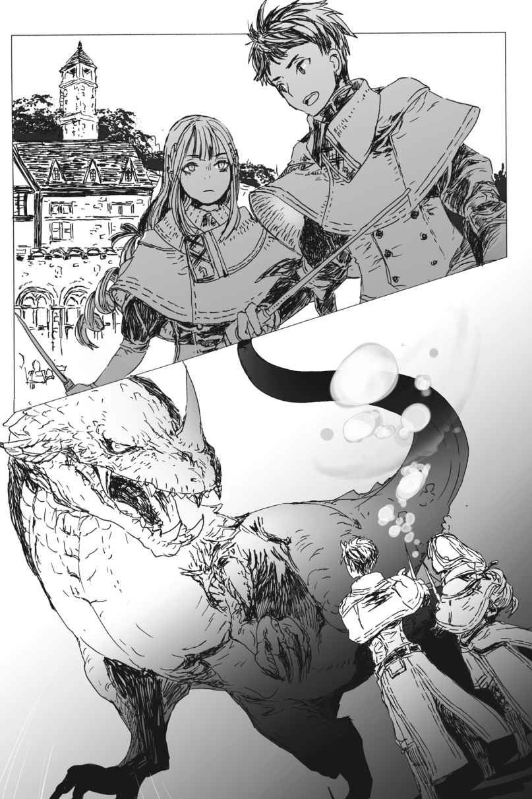

# Chương S6: Địa Long tấn công

Không lâu sau khi chúng tôi quay lại học viện, nó đột nhiên xuất hiện.

Nói chính xác hơn, nó hẳn đã bám theo chúng tôi suốt chặng đường.

“C-Cái gì thế kia...?”

Tôi nghe thấy tiếng ai đó rên rỉ đầy khó tin.

Bởi lẽ áp lực hiện diện của nó quá đỗi đáng sợ.

Một con Địa Long.

Một con quái vật sở hữu sức mạnh hủy thiên diệt địa đáng lẽ ra không bao giờ được phép xuất hiện ở một nơi như thế này.

Thế mà lúc này, nó lại đang nhe nanh múa vuốt đe dọa chúng tôi ngay trên khuôn viên học viện.

“Natsume! Lại là một phần trong âm mưu của cậu nữa đúng không?!”

Cô Oka tức giận chất vấn Hugo.

“Đ-Đừng có nhìn tôi như thế! Nếu bọn họ lên kế hoạch cho chuyện này, tôi thề là chẳng có ai báo trước cho tôi cả!”

Hugo trông thực sự hoảng loạn. Tôi không nghĩ cậu ta đang nói dối.

“Này, các người làm cái quái gì thế hả?!”

Hugo quay sang quát nhóm tội phạm bị bắt giữ vì đồng lõa với mình.

“Nó vốn được chuẩn bị như một quân bài tẩy cho kế hoạch của chúng ta.”

“Vậy ra các người đã chuẩn bị thứ này sao?!”

“Đúng vậy. Một triệu hồi sư đã lập khế ước với nó. Nhưng xem ra hiện tại, nó không còn chịu sự kiểm soát nữa rồi.”

“Cái gì? Kẻ nào đã làm việc đó?!”

“Là tôi, nhưng bây giờ tôi không thể dừng nó lại được nữa. Ngay từ đầu nó đã quá mạnh để tôi có thể khống chế rồi. Lúc mới bắt và lập khế ước thì nó còn khá ngoan ngoãn, nhưng giờ nó hoàn toàn không nghe lời tôi nữa!”

Nhóm tội phạm, tất cả đều đang hoảng loạn tột độ, tranh nhau trả lời những câu hỏi của Hugo.

Tôi phải cố gắng lắm mới kiềm chế được mong muốn vỗ tay lên trán.

Cái loại ngu ngốc nào lại đi triệu hồi một con quái vật mà mình không thể kiểm soát nổi cơ chứ?

Trong thời gian đồng hành cùng Fei, tôi cũng đã học được *Thuần Thú* (Creature Training), kỹ năng cần thiết đối với một triệu hồi sư.

But nó chỉ cho phép tôi điều khiển những con quái vật yếu hơn bản thân mà thôi.

Việc lập khế ước với một con quái vật mạnh hơn là hoàn toàn có thể nếu chúng tự nguyện đồng ý.

Nhưng điều đó chỉ xảy ra khi có sự tin tưởng lẫn nhau giữa hai bên.

Bằng không, việc con quái vật phản bội lại triệu hồi sư là điều hoàn toàn có thể xảy ra.

Giống hệt như những gì đang diễn ra ngay trước mắt lúc này.

Con địa long giương những móng vuốt sắc nhọn và quất mạnh chiếc đuôi khổng lồ to như thân cây gỗ.

Các học viên cùng các tiền bối tham gia buổi ngoại khóa đang cố gắng ngăn chặn con quái thú, nhưng chênh lệch sức mạnh quá rõ ràng.

Cũng phải thôi. Thẩm định nó, tôi thấy các chỉ số của nó đều dao động quanh mức 2.000. Đó là một mức sức mạnh vô cùng khủng khiếp, ngay cả đối với loài rồng mặt đất.

“Chà, nhìn không ổn chút nào rồi nhỉ!”

Fei, vốn đã bay ra để đón tôi, truyền đạt sự lo lắng của mình qua *Thần giao cách cảm* (Telepathy).

“Cứ đà này tất cả sẽ bị giết sạch mất. Tôi phải ra giúp một tay!”

“Chờ một chút đã! Cô không cho phép chuyện đó. Quá nguy hiểm!”

Cô Oka cố gắng ngăn cản chúng tôi.

Nhưng tôi không thể trơ mắt đứng nhìn mọi người bị thương ngay trước mắt mình được!

Tôi gạt tay cô Oka ra và lao về phía con địa long.

“Đã thế thì đành chịu vậy!”

“Em sẽ đi cùng hoàng huynh!”

“Để em trị thương cho mọi người!”

Katia, Sue và Yuri lập tức đuổi theo sau.

Tôi vừa chạy vừa bắt đầu chuẩn bị ma pháp—phép thuật hệ Thủy mà tôi đã học trên lớp.

Kích hoạt! Một quả cầu nước bay thẳng về phía con địa long.

Nhưng ngay trước khi va chạm, đòn tấn công bỗng tan biến như thể bị bốc hơi.

“Nó có *Long Lân Đế Vương* (Imperial Scales)!”

*Long Lân Đế Vương*, một phiên bản nâng cấp cao cấp của *Long Lân* (Dragon Scales) mà loài địa long cấp cao sở hữu.

Ngoài việc tăng mạnh khả năng phòng ngự vật lý, nó còn can thiệp và phá vỡ cấu trúc của các thuật thức ma pháp.

Kỹ năng khó chịu này khiến cho việc tung cả đòn ma pháp lẫn vật lý trúng đích trở nên vô cùng gian nan.

“Các học viên, lùi lại mau!”

Một giáo viên hét lớn hướng về phía chúng tôi, nhưng chúng tôi không thể dừng lại vào lúc này!

Tôi thuộc nhóm những người mạnh nhất ở đây.

Tôi không thể rút lui chỉ vì mình là một học viên được.

“Sue! Hỗ trợ anh!”

“Vâng!”

Sue và tôi đồng thời giải phóng ma pháp hệ Thủy.

Hai phép thuật hòa làm một giữa không trung.

Giống như tôi, hệ tương thích cao nhất của Sue cũng là ma pháp hệ Thủy.

Nếu kết hợp sức mạnh của cả hai, có lẽ sẽ đủ...!

Lần này, đòn *Thủy Đạn* (Water Shot) đã bắn trúng thân hình con địa long mà không bị tiêu tán.

Con địa long rống lên một tiếng đầy khó chịu.

Cách này có tác dụng! Dù lượng sát thương gây ra không nhiều, nhưng ít nhất chúng tôi đã xuyên thủng được lớp phòng ngự của nó!

Học theo chúng tôi, các giáo viên và học viên khác bắt đầu kết hợp các phép thuật của họ lại với nhau.

Katia và Giáo sư Oriza cùng phối hợp dội một cơn mưa ma pháp hệ Hỏa lên con địa long.

Sau đó, khi nó đang co rúm người lại tránh né, những người chuyên cận chiến liền lao vào tấn công áp sát.

Sát thương gây ra vẫn không đáng kể, nhưng ít nhất cũng không phải là vô dụng.

Nhưng ngay khi tôi vừa nhen nhóm hy vọng, con địa long bỗng vươn dài cổ ra.

Nó đang chuẩn bị tung ra một đòn hơi thở.

“Rút lui mau!”

Ai đó hét lên, nhưng không kịp nữa rồi!

Thay vào đó, tôi tiến lên một bước, kích hoạt *Ma đấu pháp* (Magic Warfare) và *Ý chí chiến đấu* (Mental Warfare) ở công suất tối đa.

Đồng thời, tôi tiêu tốn điểm kỹ năng để học thuộc tính *Quang Công Kích* (Light Attack).

Được bao phủ bởi ánh sáng rực rỡ, thanh kiếm của tôi chặn đứng đòn hơi thở của con địa long.

“Aaaaagh!”

Cố chịu đựng đi, cơ thể tôi ơi! Thôi nào!

“Thật tình! Cậu liều lĩnh quá đấy!”

Tôi nghe thấy tiếng Fei.

Cùng lúc đó, đòn tấn công hơi thở đột ngột dừng lại.

Thanh kiếm của tôi vung về phía chiếc cổ đang để hở của con địa long và chém đứt lìa nó.

---

---

* * *

“Đừng cử động nhé? Em sẽ chữa trị cho anh ngay bây giờ.”

Khi giọng nói của Thần ngôn thông báo rằng tôi đã lên cấp, Yuri sử dụng ma pháp hồi phục để chữa trị cho cơ thể tôi.

Hai cánh tay của tôi bị tổn thương đặc biệt nghiêm trọng. Nếu đòn hơi thở kéo dài thêm chút nữa, có lẽ chúng đã bị thổi bay mất rồi.

Nghĩ đến đó, cơ thể tôi muộn màng run lên bần bật.

Sue và Katia muốn chạy lại kiểm tra tình trạng của tôi, nhưng trước khi kịp làm vậy, họ đã bị kéo đi hỗ trợ chăm sóc cho những người bị thương khác.

Dù sao thì tôi cũng không muốn họ nhìn thấy mình trong bộ dạng thảm hại thế này.

Khi mọi chuyện diễn ra, tôi chỉ biết tập trung hết sức vào trận chiến.

Nhưng giờ khi mọi thứ đã kết thúc, nỗi sợ hãi tột cùng rằng mình suýt chút nữa đã chết mới bắt đầu ập đến và ngấm sâu vào tâm trí.

Cùng lúc đó, thanh kiếm vẫn đang bị nắm chặt cứng trong lòng bàn tay lạnh ngắt của tôi giờ đây trông thật đáng sợ.

Cảm giác khi lưỡi kiếm chém đứt đầu con địa long vẫn còn nguyên vẹn và sống động đến gai người.

Đây chính là ý nghĩa của việc tước đoạt một mạng sống. Đây mới là chiến đấu thực sự.

Tôi từng tự tin rằng mình có thể chiến đấu nhờ các chỉ số và kỹ năng cao ngất ngưởng.

Và trên lý thuyết, tôi đã làm đúng như vậy.

Nhưng sau khi trận chiến kết thúc, tôi mới nhận ra một điều.

Tôi chẳng hiểu một chút gì về ý nghĩa thực sự của việc chiến đấu cả.

Chiến đấu lúc nào cũng đáng sợ thế này sao?

Giết chóc...?

Từ từ, tôi buông thanh kiếm ra.

Những ngón tay tôi cử động một cách cứng đờ, như thể chúng bị tê dại vì cái lạnh giá.

Chỉ đến khi Yuri hoàn thành việc trị liệu, chúng mới hoàn toàn buông lỏng ra.

Sau khi trấn an tôi rằng mọi chuyện giờ đã ổn, Yuri được cử đi chữa trị cho những người khác.

Vết thương thể chất của tôi đã lành lặn. Nhưng tâm lý của tôi thì hoàn toàn ngược lại.

Thật lòng mà nói, trông tôi thật thảm hại.

Đành rằng tôi không ngờ trận chiến thực tế đầu tiên của mình lại phải đối đầu với một thứ khổng lồ đến vậy, nhưng tôi không nên hoảng loạn đến mức này.

Nhất là khi cuộc chiến đã kết thúc rồi.

Hoàng huynh Julius của tôi phải chiến đấu trong những trận chiến như thế này gần như mỗi ngày.

Nếu tôi muốn đuổi kịp anh ấy, tôi phải có khả năng vượt qua những chuyện thế này mà không gặp chút khó khăn nào mới đúng.

Và nhìn xem—hiện tại có vài người đang nhìn tôi với ánh mắt lo lắng.

Tôi phải mỉm cười và trấn an họ rằng mình vẫn ổn.

Tôi tin chắc đó là những gì anh trai tôi sẽ làm. Thôi nào. Mỉm cười đi!

…Tôi không thể làm được.

Tôi sợ hãi. Sợ rằng mình suýt nữa đã bị giết. Sợ rằng mình đã tước đi mạng sống của một sinh vật sống.

Làm thế nào mà anh trai tôi, hay bất kỳ cư dân nào ở thế giới này, có thể làm một việc khủng khiếp như vậy một cách dễ dàng đến thế?

Làm thế nào mà Hugo lại có thể nhẫn tâm tìm cách giết tôi như vậy?

Nếu việc tiêu diệt một con quái vật buộc phải hạ gục đã khiến tôi dằn vặt đến mức này, thì làm sao một người có thể giữ được lý trí bình thường sau khi giết chết một đồng loại?

Tại sao lại có kẻ có thể nghĩ đến việc làm như vậy cơ chứ?

Hay đơn giản là Hugo đã hóa điên từ lâu rồi?

Chuyện đó hoàn toàn có khả năng.

Hugo sở hữu danh hiệu *Kẻ diệt quái vật* (Monster Slayer).

Đó là danh hiệu nhận được sau khi tiêu diệt một lượng lớn quái vật.

Điều đó có nghĩa là Hugo đã giết chóc rất nhiều lần.

Rằng cậu ta đã lặp đi lặp lại việc tôi vừa làm vô số lần.

Có lẽ ở một thời điểm nào đó, cậu ta đã dần quen với việc đó.

Trở nên vô cảm trước hành vi sát hại.

Liệu một ngày nào đó, tôi cũng sẽ trở nên giống như vậy sao?

Tôi vô cùng sợ hãi. Chỉ cần tưởng tượng đến viễn cảnh đó thôi cũng khiến tôi nghẹt thở.

Tôi hít một hơi thật sâu và cố gắng bình tĩnh lại.

Tôi vẫn chưa thể sắp xếp lại mớ cảm xúc hỗn độn này của mình.

Nhưng nếu người được cho là sẽ dẫn dắt mọi người đến chiến thắng lại ở trong tình trạng thảm hại thế này, những người khác sẽ khó lòng mà ăn mừng được.

Dù chưa thể nở một nụ cười vào lúc này, ít nhất tôi cũng phải cố gắng tỏ ra đĩnh đạc và tôn nghiêm.

Ngay cả khi cảm giác hành động đó lúc này có phần hơi muộn màng.

Nhất là khi Fei đang ở gần đó, đứng nhìn xác con địa long đã gục ngã.

Fei chính là người đã cứu mạng tôi.

Vào khoảnh khắc quyết định đó, cô ấy đã cắn vào cổ con địa long, làm gián đoạn đòn hơi thở của nó.

Nếu cô ấy không làm vậy, có lẽ tôi đã mất mạng rồi.

“Fei, cậu đã cứu mạng tớ. Cảm ơn cậu nhé.”

Tôi đè nén nỗi sợ hãi đang chực chờ trỗi dậy để đưa ra lời cảm ơn muộn màng.

“Không có gì. Đừng bận tâm.”

Fei tiếp tục nhìn chăm chú vào xác con địa long với vẻ thất thần.

“Có chuyện gì vậy?”

“Cậu xem thử bảng chỉ số của tớ đi.”

Đầy thắc mắc, tôi ngoan ngoãn sử dụng *Thẩm định* lên cô bạn đồng hành trông có vẻ hơi trầm uất của mình.

Và rồi, tôi nhận ra danh hiệu mới của cô ấy.

[Kẻ Ăn Đồng Loại]

Giống như tên gọi của nó, đó là một danh hiệu tồi tệ được ban cho những kẻ đã ăn thịt đồng tộc của mình.

“Chuyện này... không thể nào...”

“Tớ không thấy có lời giải thích nào khác cả, đúng không?”

Fei chắc chắn đã cắn rách cổ con địa long.

Nếu vậy, việc cô ấy nhận được danh hiệu này là hoàn toàn hợp lý.

Thực tế, đó là cách duy nhất khả thi để giải thích cho chuyện này.

“Tớ tự hỏi liệu con địa long đó đến đây... là để tìm tớ sao?”

Chuyện đó... không phải là không thể.

Quả trứng của Fei được tìm thấy ở Mê cung Lớn Elroe, một hầm ngục nằm cách rất xa nơi này. Nếu con địa long đó không phải là cha hoặc mẹ của Fei, tôi không thể nghĩ ra lý do nào khác khiến nó lặn lội đường xá xaôi đến tận đây.

Nếu đúng là như vậy, thì một người cha hoặc người mẹ lặn lội đi tìm đứa con bị bắt cóc của mình, cuối cùng lại bị giết hại dưới tay chính đứa con đó.

Điều đó có nghĩa là tôi đã chém đầu một trong những đấng sinh thành của cô ấy ngay trước mặt cô ấy...

“Ugh... oẹ...!”

Tôi nôn sạch mọi thứ trong dạ dày ra ngoài.

Trận chiến thực sự đầu tiên của tôi đã trở thành một ký ức đắng ngắt vĩnh viễn khắc sâu vào tâm trí tôi.
