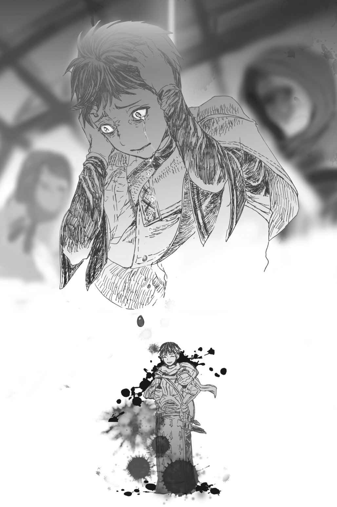

# Chương S7: Âm Thanh Báo Hiệu Sự Diệt Vong

“Được rồi, cả lớp, hôm nay chúng ta sẽ tìm hiểu về phi long và rồng.”

Giáo sư Oriza bắt đầu buổi học bằng chất giọng thờ ơ như thường lệ.

Phi long và rồng…

Nghe đến đó, tôi không thể không nhớ lại sự cố năm ấy.

Âm mưu ám sát tôi của Hugo, và cuộc tấn công của con phi long vào trường học.

Vài năm đã trôi qua kể từ ngày đó.

Mặc dù không có nhiều người bị thương trong cả hai vụ tấn công, nhưng nó vẫn là một cú sốc lớn đối với học viện.

Tuy nhiên, Hugo chưa bao giờ bị trừng phạt một cách chính thức.

Trước khi bất kỳ ai có thể thực thi công lý, cậu ta đã biến mất hoàn toàn khỏi trường học.

Giả thuyết phổ biến nhất là có sự can thiệp của *Ma pháp Không gian* trong cuộc đào tẩu của cậu ta, nhưng không ai biết chắc chắn cả.

Đồng thời, cô Oka cũng biến mất.

Nghĩ lại thì, cô ấy cũng không hề có mặt trong trận chiến chống lại con địa phi long đó.

Cô Oka vốn đủ mạnh để dễ dàng hạ gục Hugo.

Nếu cô ấy tham gia vào trận chiến sau đó, tôi chắc chắn chúng tôi đã có thể đánh bại con quái vật đó một cách dễ dàng hơn nhiều.

Vậy tại sao cô ấy lại không có mặt ở đó?

Với việc cô ấy đã ra đi, chúng tôi không có cách nào để biết được câu trả lời.

Đó không phải là thay đổi duy nhất sau sự cố đó.

Vì lý do nào đó, Fei bắt đầu lao vào việc thăng cấp, mặc dù trước đây cô ấy hoàn toàn không hề có chút hứng thú nào với chuyện này.

Cô ấy đã nhanh chóng đạt được sự tiến hóa mà cô ấy từng vô cùng sợ hãi, và hiện tại cô ấy đang sống ở bên ngoài học viện.

Có lẽ việc chứng kiến cái chết của con phi long, thứ rất có thể là một trong những đấng sinh thành của cô ấy, đã thay đổi nhân sinh quan của cô ấy.

Bản thân thế giới quan của tôi cũng có chút thay đổi sau cuộc chạm trán đó.

Trước các cuộc tấn công, tôi luôn khao khát được giống như anh trai Julius của mình.

Nhưng vì những chuyện đã xảy ra, tôi đã thấu hiểu được một phần nhỏ bé sự gian nan trên con đường mà anh ấy đang đi.

Ngay cả bây giờ, tôi vẫn không thể rũ bỏ được nỗi sợ hãi đang lẩn khuất trong tâm trí mình.

Một phần có lẽ là vì tôi là một người tái sinh, nhưng tôi thực sự sợ hãi việc giết chóc—và việc bị giết.

Nhưng để có thể sinh tồn trong thế giới này, để có thể vững bước sát cánh bên cạnh anh trai mình, tôi bắt buộc phải chinh phục nỗi sợ hãi đó.

Tuy nhiên, ngay cả khi phải vượt qua nó, tôi nghĩ mình không nên quên đi cảm giác đó.

Kể từ thời điểm ấy, tôi đã có cơ hội tham gia vào các buổi huấn luyện thực tế và chiến đấu với quái vật.

Những sinh vật đó hoàn toàn không mạnh bằng con địa phi long kia; chúng yếu đến mức chỉ cần một nhát kiếm của tôi là đủ để hạ gục.

Thế nhưng, sức nặng của việc cướp đi mạng sống của chúng vẫn là như nhau.

Tôi không được phép quên đi sức nặng này. Tôi không được phép quen với nó.

Tôi phải chế ngự nỗi sợ hãi của mình và bước vào trận chiến với sự chuẩn bị tâm lý sẵn sàng để tước đi một mạng sống.

Nếu tôi quên đi sức nặng của hành động đó và quen dần với việc cướp đi sinh mạng của kẻ khác, thì tôi sẽ không còn là chính mình nữa.

Chỉ là một con quái vật vô tình mang tên tôi mà thôi.

Có thể tôi chỉ đang ngây thơ.

Nhưng ngay cả khi tôi là một kẻ ngốc yêu hòa bình, tôi cũng không muốn thay đổi suy nghĩ của mình.

Tôi muốn tôn trọng và thấu hiểu giá trị của một mạng sống.

Từ đó, tôi phải cân đo đong đếm giữa những gì mình muốn bảo vệ và những mạng sống mà tôi bắt buộc phải tước đi để làm điều đó, và từ đó quyết định xem có nên chiến đấu hay không.

Nói thì luôn dễ dàng hơn làm rất nhiều.

Nhưng anh trai tôi chắc chắn đã phải chiến đấu với những suy nghĩ như vậy luôn đè nặng trong tim.

Anh ấy quá nhân từ để có thể thờ ơ trước giá trị của sự sống.

Tôi hy vọng một ngày nào đó mình có thể vươn tới tầm cao như anh trai mình.

Nhưng tôi hiện tại vẫn chưa sẵn sàng cho ngày đó chút nào.

Đó không phải là điều tôi có thể đạt được chỉ sau một đêm. Tôi phải tích lũy nó từng chút, từng chút một.

Cho đến khi tìm thấy sự quyết tâm đó, tôi sẽ đơn giản là tiếp tục gia tăng sức mạnh của mình.

Triết lý đó đã giúp tôi tiến bộ không ngừng kể từ sau sự cố năm ấy.

Tôi đã trưởng thành hơn, và các chỉ số vật lý của tôi cũng được tăng cường tương ứng.

Các chỉ số hiện tại của tôi khá đồng đều.

Nhờ có sự phát triển của cơ thể, các chỉ số vật lý của tôi đã bắt kịp các chỉ số ma pháp.

Tôi rất vui vì sự phát triển toàn diện này.

Nhưng chuyện đó không còn mang lại cảm giác thích thú như khi chơi một trò chơi nữa.

Tôi càng mạnh mẽ hơn, tôi càng cảm thấy sợ hãi khi sử dụng sức mạnh đó.

Nhưng dẫu vậy, tôi vẫn phải trở nên mạnh mẽ hơn.

Khi ma tộc đang ngày càng hành động tích cực hơn, không thể biết trước khi nào chiến tranh sẽ bùng nổ.

Nếu tôi không đủ mạnh để hành động khi thời khắc đó đến, tôi sẽ không thể nào chịu đựng nổi.

Tôi có thể chưa thể chiến đấu bên cạnh anh trai mình ngay lúc này, nhưng tôi không muốn trở thành gánh nặng cản bước anh ấy.

Nếu có thể, tôi muốn ít nhất mình phải đủ mạnh để bảo vệ Sue, Katia, và những người thân thiết bên cạnh mình.

Dạo gần đây Sue có vẻ hơi xa cách.

Em ấy từng luôn miệng gọi tôi là “Anh trai” và bám đuôi tôi khắp nơi, nhưng chuyện đó giờ đây không còn xảy ra thường xuyên nữa.

Vì em ấy đang dần trở thành một thiếu nữ, nên việc em ấy muốn giữ khoảng cách với tôi cũng là điều bình thường, nhưng tôi vẫn cảm thấy có chút buồn bã.

Dù vậy, em ấy không hoàn toàn lánh mặt tôi, và tôi vẫn có thể nhận ra em ấy vẫn rất kính trọng mình, nên tôi cũng không thể phàn nàn gì nhiều vào lúc này.

Mối quan hệ của tôi với Katia cũng trở nên có chút kỳ lạ.

Kể từ sau sự cố, tôi luôn có cảm giác cậu ấy đang cố gắng tạo khoảng cách giữa hai chúng tôi, từng chút một.

Cậu ấy đã phủ nhận chuyện đó khi tôi gặng hỏi.

Nhưng cậu ấy lại tránh ánh mắt của tôi và lùi lại phía sau khi trả lời, nên tôi hoàn toàn không tin chút nào.

Khi tôi nắm lấy cánh tay cậu ấy để hỏi cho ra lẽ, tôi đã vô cùng ngạc nhiên trước sự mảnh mai của nó.

Nó quá gầy guộc. Đến mức tôi nghĩ nó có thể gãy bất cứ lúc nào.

Trên hết, cậu ấy bỗng phát ra một tiếng kêu đau đớn vô cùng dễ thương, khiến tôi theo bản năng buông tay ra ngay lập tức.

Nhìn khuôn mặt cậu ấy đỏ bừng lên khi xoa xoa cánh tay nơi tôi vừa nắm lấy, tôi không thể giấu nổi sự bối rối của mình.

“X-Xin lỗi cậu.”

Tôi không biết tại sao mình lại cuống quýt lên như vậy khi xin lỗi.

Nhưng trong khoảnh khắc đó, dù tôi biết rõ Katia như chính bản thân mình, cậu ấy trông giống như một người hoàn toàn xa lạ đối với tôi vậy.

Mối quan hệ giữa tôi với Katia chỉ càng trở nên gượng gạo hơn kể từ đó.

Yuri là người duy nhất gần như không hề thay đổi. Cậu ấy vẫn nhiệt tình cải đạo mọi người sang Thần Ngôn Giáo như từ trước đến nay.

Có chăng thì cậu ấy ngày càng trở nên cuồng nhiệt hơn.

Mỗi khi thấy cậu ấy quấy rầy một học sinh nào đó, tôi lại kéo cậu ấy ra để con mồi của cậu ấy trốn thoát, để rồi cuối cùng chính tôi lại trở thành mục tiêu của cậu ấy.

Chuyện đó đã trở thành cơm bữa đối với chúng tôi.

Nếu Sue và Katia có mặt ở đó, hai đứa sẽ nhảy vào giảng hòa, và tất cả chúng tôi lại cuốn vào những cuộc cãi vã thân thiện quen thuộc.

Thế nên, ngay cả khi có vài thay đổi nhỏ, cuộc sống của tôi vẫn trôi qua khá yên bình.

`<Điều kiện thỏa mãn. Nhận được danh hiệu [Anh Hùng].>`

`<Nhận được các kỹ năng [Anh Hùng LV 1] [Thánh Quang Ma Pháp LV 1] từ danh hiệu [Anh Hùng].>`

Cho đến khi một giọng nói đột ngột đập tan sự yên bình đó.

“Hả?”

Vì chúng tôi vẫn đang ở giữa buổi học, tiếng lầm bầm đầy bối rối của tôi vang vọng khắp lớp học lớn hơn nhiều so với những gì tôi tưởng tượng.

“Có chuyện gì thế, Schlain? Có phần nào của bài giảng em không hiểu sao?”

Giáo sư Oriza nhìn tôi một cách lịch sự.

Nhưng giọng nói của thầy hoàn toàn không thể lọt vào tâm trí đang hỗn loạn tột độ của tôi.

“Schlain? Schlain?! Có chuyện gì thế?!”

Tôi cá là mặt tôi lúc này hẳn đã không còn một giọt máu nào.

Nhưng làm sao tôi có thể không bị sốc cơ chứ?

Danh hiệu Anh Hùng chỉ có thể được sở hữu bởi duy nhất một con người trên thế giới tại một thời điểm.

Và tôi biết rất rõ ai mới là người đang nắm giữ danh hiệu anh hùng đó.

---

---

Một khi đã nhận được danh hiệu, bạn không bao giờ có thể từ bỏ nó chừng nào còn sống.

Danh hiệu Anh Hùng cũng không phải là ngoại lệ.

Chừng nào còn sống.

Thế nên, điều này chỉ có thể nghĩa là một chuyện duy nhất.

Không thể có lời giải thích nào khác.

Tôi không thể tin được. Tôi không muốn tin vào điều đó.

Nhưng danh hiệu đó đã hiển thị một cách không thể chối cãi trên bảng trạng thái của tôi.

Không. Không thể nào.

Chuyện này không thể xảy ra được.

Không, không, không thể nào như thế được!

Chuyện đó không bao giờ có thể xảy ra với anh trai tôi được!

Nhưng danh hiệu kia vẫn lạnh lùng phơi bày sự thật hiển nhiên.

Vào ngày hôm nay, một anh hùng đã ngã xuống…

…và một anh hùng mới đã được sinh ra.

---

[◀ Chương trước: Chương J3: Và thế là chiến tranh bắt đầu](j3_and_so_the_war_began.md) | [Chương tiếp theo: Đoạn phụ: Ma Vương Nhện ▶](interlude_spider_demon_lord.md)
