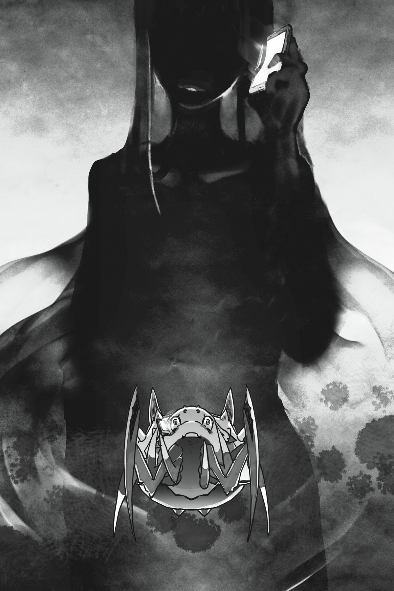

# Chương 5: Lần đầu chạm trán một Quản trị viên

*(First Encounter with an Administrator)*

---

### --- TRANG 77 ---

Nhờ tăng mấy cấp độ kia mà tôi có thêm 200 điểm kỹ năng, đã đến lúc sắm thêm một kỹ năng Tà Nhãn mới rồi.

Lần này, tôi quyết định chọn [Trọng Lực Tà Nhãn].

Nó giúp tăng tác động của trọng lực lên bất kỳ mục tiêu nào nằm trong tầm nhìn của tôi.

Giờ đây tôi có thể làm chậm chuyển động của đối thủ bằng [Trọng Lực Tà Nhãn], làm yếu chúng bằng [Nguyền Rủa Tà Nhãn], và cuối cùng là khóa chặt hoàn toàn chuyển động của chúng bằng [Tê Liệt Tà Nhãn].

Bộ ba combo Tà Nhãn siêu việt của tôi đã hoàn chỉnh!

Sắp xếp này hoàn toàn xoay quanh mục tiêu là giữ chân kẻ địch tại chỗ.

Về phần tấn công thì tôi đã có quá đủ các chiêu thức khác rồi.

Nếu cần thiết, tôi luôn có thể tậu đại một kỹ năng ma pháp nào đó chỉ với 100 điểm.

Hử? Anh hỏi tại sao ngay từ đầu tôi không làm thế luôn á?

Tôi hơi bị ám ảnh với vụ Tà Nhãn này rồi, cơ mà nếu nhìn vào các chỉ số của mình, hình như tôi thuộc kiểu chuyên về ma pháp đúng không nhỉ?

Vậy nghĩa là ngay từ đầu đáng lẽ tôi phải chỉ tập trung vào các kỹ năng ma pháp mới đúng sao?

Thôi nào, không có chuyện đó đâu.

Ít nhất thì cứ coi là không phải thế đi.

Tôi chắc chắn không phải cố chấp chọn nó chỉ vì thích cái ý tưởng sở hữu tám loại Tà Nhãn khác nhau cùng một lúc đâu.

Tôi không có thế đâu nhá, thật đấy!

Dù sao thì, tôi sẽ tạm thời tiết kiệm số điểm còn lại một thời gian.

Tôi không biết mình sẽ nhận được thêm bao nhiêu điểm thưởng khi tiến hóa nữa.

### --- TRANG 78 ---

Tôi sẽ điều chỉnh chiến lược của mình dựa vào lượng điểm đó khi tiếp tục hành trình.

Nếu có được một lượng điểm khổng lồ, biết đâu tôi thậm chí có thể nhắm tới những kỹ năng quá đắt đỏ từ trước tới nay, như [Lười Biếng] chẳng hạn.

Dùuu sao thì.

Sự hữu dụng của nó trong các trận chiến không phải là lý do duy nhất khiến tôi chọn [Trọng Lực Tà Nhãn] đâu.

Giờ thì, thử nghiệm chút nào. Kích hoạt Tà Nhãn!

Ui da! Não thông tin đang làm cái gì thế hả?!

Ý cô hỏi là cái gì là cái gì chứ? Tôi đang tự tăng trọng lực của bản thân đấy.

Nặng quá đi mất!

Thì tôi đã suy nghĩ kỹ rồi. Thứ tôi đang thiếu nhất lúc này là gì chứ? Tất nhiên là cơ bắp rồi!

Tuyệt thật, lại chuẩn bị diễn thuyết rồi đây.

Khi các chiến binh Z luyện tập dưới môi trường siêu trọng lực, họ đã trở nên đủ mạnh để đánh bại những kẻ thù siêu cấp mạnh mẽ xuất hiện sau đó!

Rồi rồi. Tôi hiểu ý cô rồi, cơ mà cái này làm cho việc lột vảy rồng trở nên hơi bị khó khăn đấy biết không.

Thì mục đích chính là để cơ thể quen dần bằng cách luôn giữ trạng thái kích hoạt liên tục mà.

Ý tưởng tuyệt vời! Chúc may mắn nhé, não cơ thể!

Tiếp theo hãy thử trọng lực gấp một nghìn lần xem sao!

Không đời nào, thế thì chết tôi mất!

Thế nên, vâng. Tôi quyết định thử tự áp dụng thêm trọng lực lên bản thân mọi lúc mọi nơi.

Nếu liên tục dùng nó lên chính mình, tôi cá là các chỉ số vật lý của mình sẽ tăng lên, chưa kể còn được cộng thêm điểm thuần thục Tà Nhãn nữa chứ.

Biết đâu nó còn giúp tăng cấp kỹ năng [Cự lực] hay gì đó tương tự nữa.

Vì kỹ năng Tà Nhãn này hiện tại mới ở cấp 1, tôi chỉ cảm thấy cơ thể nặng thêm một chút thôi, cơ mà tôi chắc chắn nó sẽ trở thành một gánh nặng thực sự một khi tăng cấp.

Đến lúc đó, nếu tôi tắt nó đi trong trận chiến và trở lại trọng lực bình thường, tôi sẽ có một khoảnh khắc kiểu "giải phóng giới hạn sức mạnh" cực ngầu!

Tuyệt cú mèo.

Chắc chắn tôi sẽ hét lên "GIẢI PHÓNG GIỚI HẠN!" hay gì đó tương tự khi làm thế.

Cơ mà, thực ra tôi không thể nói được, nhưng các bạn hiểu ý tôi mà.

Hả?! [Cảm nhận Không gian] của tôi đang phản ứng với thứ gì đó!

Một sự biến dạng trong không khí?

Tôi chưa từng trải qua chuyện này bao giờ, nhưng bằng cách nào đó, tôi biết chính xác chuyện gì đang xảy ra.

### --- TRANG 79 ---

Dịch chuyển tức thời.

Có thứ gì đó chuẩn bị dịch chuyển đến đây.

Tôi không có cách nào ngăn cản nó cả.

Với cấp độ [Ma pháp Không gian] hiện tại của tôi, ngay cả tự dịch chuyển bản thân còn chưa làm được, nói gì đến việc can thiệp vào khả năng dịch chuyển của kẻ khác.

Dựa vào sự biến dạng không gian mà tôi cảm nhận được, tôi đoán kẻ chuẩn bị dịch chuyển đến đây chắc chắn phải cực kỳ điêu luyện [Ma pháp Không gian].

Nghĩa là họ mạnh hơn tôi rất nhiều, ít nhất là ở khoản [Ma pháp Không gian].

Mối lo ngại lớn nhất chính là việc họ sử dụng ma pháp ngay từ đầu.

Điều đó đồng nghĩa với việc, không nghi ngờ gì nữa, kẻ sử dụng phải có trí tuệ ở cấp độ cực cao.

Cho đến nay, tôi chưa từng thấy một con quái vật nào sử dụng ma pháp cả.

Ngay cả con hỏa long tôi vừa đánh bại lúc trước cũng không phải ngoại lệ.

Nó có các kỹ năng ma pháp, nhưng chưa từng sử dụng chúng lấy một lần.

Chuyện đó cũng tự nhiên thôi.

Ma pháp đòi hỏi một quy trình kiến thiết thuật thức vô cùng phức tạp.

Người dùng cần có một mức độ trí tuệ nhất định mới có thể hoàn thành được nó.

Trong trường hợp của hỏa long, việc sử dụng các kỹ năng bẩm sinh để tạo ra hỏa cầu hiệu quả hơn nhiều so với việc cố gắng xây dựng các thuật thức ma pháp.

Có thể có một số loài quái vật dùng được ma pháp, nhưng thay vào đó chúng thường có sẵn những kỹ năng đơn giản và mạnh mẽ hơn nhiều để sử dụng.

Thế nhưng, thứ chuẩn bị dịch chuyển đến đây lại đang sử dụng một loại ma pháp cực kỳ phức tạp.

Điều đó có nghĩa là nó chắc chắn phải có lý do cụ thể để đến nơi này.

Nhưng đó có thể là gì chứ?

Tất cả những gì ở đây chỉ có... tôi.

Nói cách khác, nó đến đây chắc chắn là vì tôi.

Tôi không thể tưởng tượng nổi chuyện nó dịch chuyển đến đây chỉ là tình cờ.

Tất cả những suy luận này lướt nhanh qua tâm trí tôi chỉ trong vài giây nhờ [Gia tốc Tư duy].

Tôi vào tư thế phòng thủ.

Không khí nứt toác ra, và một người đàn ông xuất hiện.

Một người đàn ông toàn một màu đen.

Tôi không biết giải thích thế nào khác cả.

### --- TRANG 80 ---

Hắn mặc một bộ giáp đen bó sát, như thể nó là một phần cơ thể hắn vậy.

Phần mặt ít ỏi lộ ra ngoài của hắn cũng tối màu.

Mái tóc của hắn cũng thế.

Chỉ có đôi mắt hắn là mang một sắc đỏ đỏ rực ma mị.

Tôi biết ngay khoảnh khắc nhìn thấy gã này:

Tôi không thể thắng nổi.

Hắn ở một đẳng cấp hoàn toàn khác.

Vài có một thứ khác đã xác nhận sự nghi ngờ này.

`<Không thể Thẩm định>`

Chính là dòng chữ đó.

Thế nhưng, vì lý do nào đó, tôi không cảm thấy bản thân đang gặp nguy hiểm.

Thực ra, tôi còn cảm thấy một cảm giác thân thuộc kỳ lạ với người đàn ông này.

Và đồng thời, tôi cũng cảm thấy hơi bực bội với hắn.

Tại sao lại thế nhỉ?

Tôi chắc chắn chưa từng gặp gã đàn ông đen thui này bao giờ.

Tôi không hiểu vì sao mình lại có cảm xúc thế này với một kẻ kỳ lạ đột ngột xuất hiện từ hư không.

Rốt cuộc những cảm xúc này là thế nào chứ?

“*********?”

Người đàn ông lên tiếng.

Nhưng tôi không nhận ra đó là ngôn ngữ gì.

Không tự chủ được, tôi nghiêng đầu.

“+++++++++?”

Người đàn ông lại nói một câu khác.

Làm ơn nói tiếng Nhật được không hả?

Không thì tôi chịu chết chả hiểu gì đâu.

Tôi không nói được... cái tiếng của thế giới này đâu.

Người đàn ông nhíu mày.

Hửm.

Chà, hiện tại gã ta có vẻ không có ý thù địch.

Nhưng giờ tôi phải làm sao đây?

Tôi không hiểu gã nói gì, mà cho dù có hiểu đi nữa thì tôi cũng đâu biết nói.

Tôi có thể giao tiếp bằng chữ viết, nhưng tôi chỉ biết tiếng Nhật.

Đằng nào thì hai bên cũng chẳng thể hiểu nhau nổi.

Vấn đề nan giải đây.

Người đàn ông trông cũng có vẻ bối rối.

### --- TRANG 81 ---

Khi cả hai đang đứng trong bầu không khí im lặng ngượng ngùng, một thứ gì đó đột ngột rơi xuống mặt đất ngay giữa hai chúng tôi.

Đó là một chiếc điện thoại thông minh.

Hả?

Khoan đã.

Việc một chiếc điện thoại thông minh tồn tại ở đây đã đủ kỳ quặc rồi, nhưng làm thế nào nó lại xuất hiện trước mặt tôi như thế chứ?

Cái thứ này cứ thế hiện ra từ hư không mà kỹ năng [Phát hiện] của tôi không hề bắt được một tín hiệu nào!

“Alo? Quản trị viên D xin nghe.”

Một giọng nói đột ngột phát ra từ chiếc điện thoại.

Thực ra là hai giọng nói.

Một giọng nói tiếng Nhật, và giọng kia là một thứ tiếng tôi chưa từng nghe thấy bao giờ.

Không, khoan đã, đó có phải là thứ ngôn ngữ gã kia vừa nói lúc nãy không?

“******?!”

À, người đàn ông nghe có vẻ thực sự ngạc nhiên.

Nghĩa là thứ tiếng kia chính là ngôn ngữ gã vừa nói lúc nãy: ngôn ngữ của dị giới này.

“Đúng vậy. Tôi là D. Nhện tiểu thư, xin hãy chờ một lát.”

Ồ, được thôi.

Người ta đã bảo chờ thì tôi cứ chờ vậy.

Giọng nói từ điện thoại trò chuyện với người đàn ông bằng ngôn ngữ của thế giới song song này.

Đó là giọng nữ.

Một giọng nói rất hay, nhưng không hiểu sao lại khiến tôi cảm thấy bất an sâu sắc.

Cảm giác kiểu như thế đấy.

Cô ta nói bằng một tông giọng đều đều, không chút cảm xúc, nghe cũng khá là đáng sợ.

Chuyện gì đang xảy ra thế này?

Chỉ việc nghe thấy giọng nói của cô ta thôi cũng đủ khiến tôi run rẩy.

Sau mỗi câu nói mới, biểu cảm của người đàn ông lại thay đổi.

### --- TRANG 82 ---

### --- TRANG 83 ---

Những thay đổi đó khá nhỏ, nhưng tôi có thể thấy đôi lông mày của hắn nhíu lại hoặc mắt mở to ra.

Cuối cùng, cuộc trò chuyện dường như đã đi đến hồi kết. Người đàn ông thở dài một tiếng thật dài rồi quay người lại.

Sau đó, hắn sử dụng [Ma pháp Không gian] dịch chuyển đi mất tiêu, cứ thế mà đi.

Để lại tôi một mình với chiếc điện thoại thông minh bí ẩn.

“Cảm ơn vì đã chờ đợi. Tôi đã nói chuyện với người bạn kia của tôi rồi, thế nên hắn ta sẽ không làm phiền cô nữa đâu.”

Ồ, ra vậy.

Mà khoan, rốt cuộc cô là ai thế?

“Tôi là D.”

Ồ, ra vậy.

?!

Khoan, cái gì?!

Cô vừa mới đọc suy nghĩ của tôi đấy à?!

“Đúng vậy. Tôi đã đọc.”

Thế là xâm phạm quyền riêng tư của tôi đấy nhá!

“Chà, vì cô không nói được nên tôi buộc phải dùng biện pháp tạm thời thôi. Bình thường tôi cũng không rảnh đến mức đi đọc suy nghĩ của cô đâu.”

Bình thường á? Vậy nghĩa là cô đã theo dõi tôi suốt thời gian qua sao?

“Dùng từ 'theo dõi' nghe không lọt tai cho lắm. Tôi nghĩ dùng từ 'thưởng lãm' sẽ thích hợp hơn.”

Sao cũng được.

Đằng nào thì cô cũng là kẻ bám đuôi đúng không?

“Có lẽ vậy. Chỉ là tôi chưa bao giờ thấy chán khi xem cô đấu tranh cả.”

D... Giờ tôi mới nhớ ra.

Tôi đã nghe thấy cái tên đó khi nhận được kỹ năng [Trí Tuệ].

“Đúng vậy. Đó là phần thưởng cho những nỗ lực phi thường của cô. Tôi rất vui vì thấy cô đang tận dụng nó một cách hiệu quả.”

Vậy mục tiêu của cô ở đây là gì?

“Chỉ là để giải trí thôi.”

Hả?

“Đơn giản là để mua vui, không hơn không kém. Tôi không có động cơ hay mục đích sâu xa nào khác cả.”

Thật đấy à?

### --- TRANG 84 ---

“Đúng vậy. Dù sao thì, tôi cũng chính là tà thần độc ác nhất thế giới này mà.”

Mọi thứ nghe thật là vô lý, nhưng không hiểu sao tôi lại thấy cô ta không hề nói dối.

Cứ như thể tôi đang thực sự nghe thấy suy nghĩ của một vị tà thần coi tôi như món đồ chơi hay gì đó, nhưng lại không hề có ác ý với tôi.

Nhìn cái cách cơ thể tôi đang tự động run rẩy bần bật thế này, chắc là thâm tâm tôi cũng thực sự tin người đang nói chuyện đúng là một vị tà thần rồi.

“Tất nhiên rồi. Là một tà thần, không có gì khiến tôi vui sướng hơn là được nhìn mọi người vật lộn và đau khổ.”

Vậy toàn bộ thế giới này được tạo ra để phục vụ cho sự giải trí của cô sao?

“E là không phải vậy. Đối với thế giới này, tôi chỉ là một kẻ ngoài cuộc thôi.”

Thế nghĩa là sao?

“Tiếc là tôi không thể tiết lộ thêm nữa. Nếu biết trước mọi chuyện thì sẽ chán lắm.”

Vậy là cô định tiếp tục đùa giỡn với tôi chứ gì.

“Đúng thế. Vậy nên xin hãy tiếp tục mua vui cho tôi bằng cách vật lộn với tất cả những gì cô có nhé. Biết đâu đến lúc đó cô sẽ tìm thấy câu trả lời mà mình hằng tìm kiếm?”

Cái đồ đáng ghét này...!

“Chà, hẹn gặp lại lần sau nhé.”

Chiếc điện thoại thông minh biến mất.

Không để lại bất kỳ một dấu vết biến dạng không gian nào dù là nhỏ nhất.

Đó là lần đầu tiên tôi chạm trán với Quản trị viên D và vị Quản trị viên tên Hắc.
