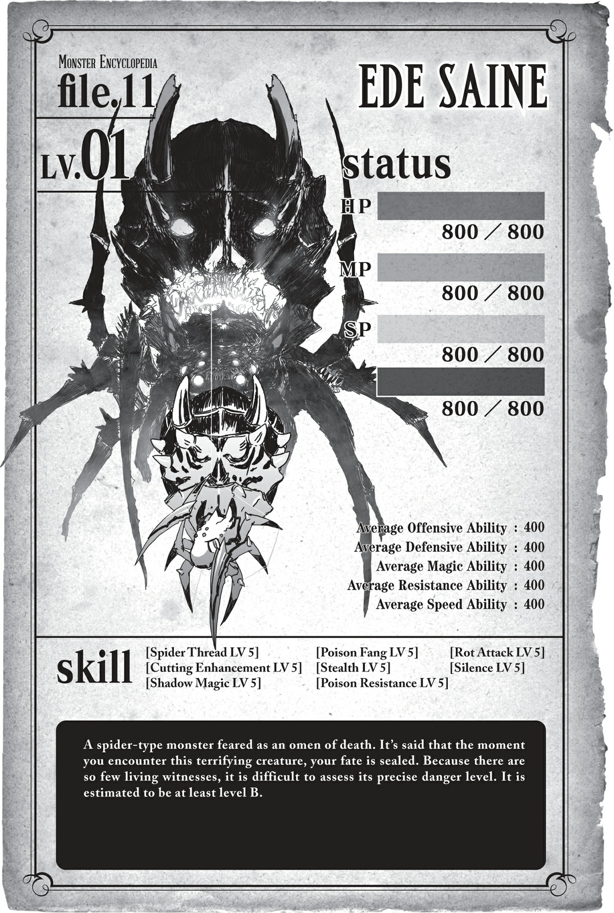
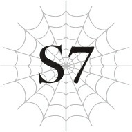

# Chương 7: Cuộc Chạm Trán Với Con Người
*(Encounter with Humans)*

---

### --- TRANG 124 ---

Tôi ăn.

Rồi ăn.

Và ăn tiếp.

Như kiểu đang kéo sợi chỉ vậy.

Thật chậm rãi và cẩn thận.

Nhưng điệu nhai của tôi trông giống như đang húp sùm sụp hơn.

`<Độ thông thạo đã đạt đến mức yêu cầu. Kỹ năng [No Nê LV 2] trở thành [No Nê LV 3].>`

`<Độ thông thạo đã đạt đến mức yêu cầu. Kỹ năng [Mở rộng Thần giới LV 4] trở thành [Mở rộng Thần giới LV 5].>`

Ngay sau khi lên tới Tầng Trên, tôi lập tức bắt tay vào xây dựng một cái tổ mới.

Có một khoảng không gian khá rộng rãi nằm rất gần lối vào Tầng Trung, nên tôi quyết định tạm thời chọn nơi đó làm lãnh địa của mình.

Ở Tầng Trung, tơ của tôi bị cháy rụi nhanh tới mức tôi thậm chí không thể dựng nổi một cái tổ đơn sơ, nên đây là cái tổ đầu tiên của tôi kể từ khi cái tổ cũ bị Địa Long Alaba thổi bay ở Tầng Dưới.

Aaaa, không gì sánh bằng cảm giác an toàn này!

Ở Tầng Trung thì siêu nóng, lại không có tơ bảo vệ, nên tôi còn lâu mới có được một giấc ngủ ngon lành.

Bây giờ, hãy thử so sánh điều đó với sự thoải mái đến kinh ngạc ở Tầng Trên xem!

Nhiệt độ thì dễ chịu và ấm áp, không quá nóng cũng không quá lạnh!

### --- TRANG 125 ---

Tôi muốn giăng bao nhiêu tơ tùy thích, thế nên tổ của tôi hoàn toàn chống đột nhập!

Đã vậy ở trên này lại không có quái vật mạnh, nên cuối cùng tôi cũng có thể đánh một giấc thật ngon lành!

A, thế này là nhất rồi.

Thế là, tôi đã dành ra vài ngày chỉ để lăn qua lăn lại và chẳng làm gì cả.

Nghe này, suốt thời gian qua tôi đã làm việc cực kỳ vất vả và chỉ suýt soát giữ được mạng sống, nên tôi hoàn toàn xứng đáng được tự thưởng cho mình một kỳ nghỉ ngắn chứ.

Tuy nhiên, tôi không thể cứ tiếp tục như thế này mãi được.

Không giống như trước đây, do hiện tại tôi sở hữu sự kết hợp tuyệt vời giữa [Uy Áp] và [Kẻ gieo rắc kinh hoàng], lũ quái vật chẳng dám bén mảng lại gần tôi nữa.

Và vì không có con quái vật nào dám mò đến tấn công nhà tôi, tôi cũng chẳng có gì để bỏ bụng.

Để đảm bảo nguồn thức ăn và tích lũy kinh nghiệm, tôi bắt buộc phải đi săn.

Chưa kể, tôi còn muốn mở rộng bản đồ Tầng Trên và tìm lối ra nữa.

Dù tôi chưa chuẩn bị gì để ra ngoài thế giới bên ngoài ngay lúc này, nhưng việc ít nhất tìm thấy một lối ra chắc chắn cũng chẳng hại gì.

Nhưng xét đến độ rộng lớn của Tầng Trên, tôi nghi ngờ việc mình có thể tìm ra nó dễ dàng như vậy, nên nếu có vô tình vấp phải một cái thì tôi cứ coi như đó là một sự may mắn đi.

Mục đích chính của việc đi săn là kiếm đồ ăn, theo sát sau đó là kiếm điểm kinh nghiệm.

Chỉ cần lên thêm một cấp nữa là tôi sẽ đạt cấp 20, nghĩa là tôi có thể tiến hóa.

Thế là tôi thong thả đi săn ở Tầng Trên trong vài ngày.

Nhưng chẳng thấy bóng dáng con quái vật nào quanh đây cả.

Hóa ra, hiện tượng kỳ lạ này là do sự hoành hành của một con quái vật bí ẩn nào đó.

Theo lời kể của một trong số ít những con ếch còn sống sót ở Tầng Trên:

"Ừ, đó là một sinh vật nguy hiểm sở hữu luồng hào quang siêu đáng sợ, lại còn dùng hàng đống chất độc và ma pháp nữa chứ. Không chạy trốn khỏi thứ đó thì có mà điên à?"

Hợp lý đấy.

"Hiệp hội Quái vật Tầng Trên Mê cung Lớn Elroe" đang xem xét tình hình vô cùng nghiêm trọng và dự kiến sẽ sớm thành lập một trung tâm ứng phó khẩn cấp gần đây để giải quyết vấn đề.

Đùa chút thôi. Hihi.

Tất nhiên "sinh vật nguy hiểm" đó chính là tôi rồi. Hí hí hí.

### --- TRANG 126 ---

KHÔNG CÓ MỘT CON QUÁI VẬT NÀO HẾT! BỌN CHÚNG CHẠY HẾT RỒI!

Ngay cái khoảnh khắc tôi bắt đầu dựng tổ ở khu vực này, lũ nhát gan đó đã vắt chân lên cổ chạy sạch sành sanh!

Ban đầu, tôi cứ nghĩ việc bắt quái vật ở đây sẽ dễ ợt, vì ít ra bọn chúng không thể lặn xuống dung nham trốn như ở Tầng Trung được. Nhưng tôi cũng có giới hạn của mình chứ bộ!

Tôi phải đi ròng rã suốt vài ngày đường rời xa tổ của mình thì mới tìm thấy quái vật! Cái quái gì thế này?!

Nhờ vậy mà tôi đã phải đi bụi suốt mấy ngày qua, cứ phải dựng mấy cái tổ tạm bợ dọc đường thay vì được về căn cứ của mình!

Tôi là dân du mục chắc?!

À thì, tôi đoán việc mình đang làm giống kiểu săn bắn hái lượm hơn là du mục, nhưng dẫu vậy.

Ư… Thật không thể tin nổi. Nghiêm túc đấy, làm sao lại thế được chứ.

Việc cứ phải cuốc bộ quay về tổ mỗi lần đi săn quả là một cực hình, thế nên tôi đã tập trung nâng cấp độ [Ma pháp Không gian] của mình với tốc độ bàn thờ.

Ma pháp Không gian cấp 9: [Dịch chuyển Cự ly dài].

Một phép thuật tuyệt vời cho phép bạn dịch chuyển tức thời đến bất kỳ địa điểm nào bạn từng đặt chân tới trước đây.

Kể từ khi học được phép này, vấn đề không thể quay về tổ dễ dàng đã được giải quyết triệt để.

Thêm vào đó, giờ đây nhờ khả năng di chuyển tức thời đến những nơi từng đi qua, phạm vi thám hiểm của tôi cũng được mở rộng đáng kể tương ứng.

Trong những chuyến đi ngày càng năng nổ của mình, tôi đã phát hiện ra một lối đi khổng lồ mà có lẽ ngay cả Mẹ cũng có thể đi qua lọt.

Tất nhiên, vì tôi đã tận mắt nhìn thấy Mẹ đi xuống Tầng Dưới bằng cả tám con mắt của mình, bà ta chắc chắn không có mặt ở trên này lúc này.

Thế nhưng, thứ tôi tìm thấy ở đây lại là một con Địa Phi Long.

Nó trông giống một con khủng long hơn là rồng, và sức mạnh thì ngang ngửa với mấy con lươn ở Tầng Trung.

Nhưng loại quái vật cấp lươn giờ đây đối với tôi chỉ là muỗi.

Tôi dễ dàng trói chặt nó bằng tơ và hút cạn sinh lực của nó bằng các Tà Nhãn của mình.

Trong tất cả các chỉ số của nó, chỉ có chỉ số thể lực là cao đến mức phi lý, nên chỉ riêng con đó thôi đã đủ để lấp đầy lượng tích trữ [No Nê] của tôi rồi.

Thế là, vì sau đó tôi không thực sự cần ăn uống gì nữa, tôi đã dựng luôn một cái tổ tạm thời ngay tại chỗ để bảo quan cái xác cho thật tốt.

### --- TRANG 127 ---

Kể từ đó, cứ mỗi khi đói bụng là tôi lại dịch chuyển đến chỗ đó để rỉa một miếng.

Hôm nay, khi thấy đói bụng và dịch chuyển về chỗ xác Địa Phi Long, tôi lại thấy có vài con người đang lảng vảng quanh đó.

Tôi đã siêêêu-cấp-kinh-ngạc luôn đấy.

Không kịp suy nghĩ, tôi đơ người ra tại chỗ và vô tình chạm mắt với một ông chú ăn mặc khá chải chuốt.

Ông ta trông có vẻ ngoài lạnh lùng, phong trần, kiểu người nhìn sẽ cực ngầu khi phì phèo điếu thuốc.

Với tư cách là một thiên thần thánh thiện như tôi, tôi vội vàng tắt các Tà Nhãn của mình.

Nếu tôi cứ tiếp tục nhìn ông ta với các Tà Nhãn đang kích hoạt, thế giới này đã mất đi một quý ông phong trần chỉ trong chớp mắt rồi.

Có vẻ như lũ con người đó cũng kinh ngạc không kém gì tôi.

Kỹ năng [Uy Áp] của tôi chắc chắn đã có tác dụng lên họ.

Họ đột ngột hét toáng lên rồi bỏ chạy bán sống bán chết, vậy nên tôi đoán họ đang trốn chạy khỏi tôi nhỉ?

Hửm. Tất nhiên thế vẫn tốt hơn là việc họ đột ngột lao vào tấn công tôi, nhưng dẫu vậy...

Trang phục của họ nhìn hơi giống các hiệp sĩ, vậy nên họ đáng lẽ phải là những chiến binh khá có thực lực đúng không?

Thế mà họ lại bị [Uy Áp] của tôi dọa cho khiếp vía rồi chạy mất dép.

Không biết có phải do tôi nhạy cảm quá không, chứ thế này nghĩa là tôi sẽ gây ra một vụ hỗn loạn cực kỳ kinh khủng nếu rời khỏi mê cung sao?

Ý tôi là, nếu cả những chiến binh dày dạn kinh nghiệm còn phản ứng như thế với tôi, liệu những người dân bình thường có lăn ra xỉu ngay tại chỗ khi nhìn thấy tôi không đây?

Tôi bắt đầu có cảm giác rằng dù mình có tiến hóa thành Arachne hay học được [Thần Giao Cách Cảm] hay gì đi nữa, thì mọi nỗ lực cũng sẽ đổ sông đổ biển hết thôi.

Dù thế nào thì tôi cũng chẳng thể hình dung được mọi chuyện diễn ra suôn sẻ cho nổi.

Việc đám hiệp sĩ đó bỏ chạy là điều tốt cho tôi, nhưng ngộ nhỡ họ lại quyết định liều mạng chiến đấu với tôi thì sao?

Ý tôi là, họ bỏ chạy có lẽ vì họ không quá mạnh, nhưng nếu tôi gặp phải những con người tự tin vào sức mạnh của mình, họ có thể sẽ cố gắng vượt qua nỗi sợ hãi để thách thức tôi.

Thậm chí còn có khả năng tồn tại một con người mạnh hơn cả tôi nữa kìa.

Dựa vào đám hiệp sĩ đó, con người có vẻ yếu hơn tôi tưởng tượng, nhưng

### --- TRANG 128 ---

tôi cảm giác sẽ rất nguy hiểm nếu vội vàng kết luận như vậy vào lúc này.

Ý tôi là, ban đầu tôi cũng yếu nhớt ra đấy thôi, thế mà giờ nhìn tôi xem. Việc một con người cũng có thể làm được điều tương tự hoàn toàn không phải là bất khả thi.

Trên thực tế, tôi sẽ không ngạc nhiên nếu sức mạnh giữa các cá thể người có sự chênh lệch một trời một vực.

Tôi chắc chắn rằng một dân làng bình thường và một người lính sẽ có các chỉ số hoàn toàn khác nhau, ví dụ thế.

Nhưng tôi thực sự chẳng biết gì về con người ở thế giới này cả, nên tất cả cũng chỉ là phỏng đoán đơn thuần mà thôi.

Cách tốt nhất để tìm hiểu thêm là tiếp xúc với con người, nhưng vấn đề là ngay từ đầu tôi đã không thể làm được việc đó rồi.

Ngay cả khi tôi cố gắng sử dụng [Thần Giao Cách Cảm], nếu dựa vào tiếng hét của đám hiệp sĩ kia, tôi nghĩ họ nói một ngôn ngữ hoàn toàn khác ở đây...

Nếu muốn nói chuyện với con người, tôi phải học ngôn ngữ của thế giới này, nhưng muốn học ngôn ngữ thì tôi phải tiếp xúc với họ, mà tiếp xúc nghĩa là tôi phải nói chuyện với họ... Aaa, đúng là một cái vòng luẩn quẩn không lối thoát.

Đúng vậy. Tôi có cảm giác rằng việc giao tiếp với con người sẽ là nhiệm vụ bất khả thi.

Vài ngày sau cuộc chạm trán với đám hiệp sĩ, tôi vẫẫẫn chưa tiến hóa được.

Trời ạ, xung quanh đây có quá ííít quái vật đi mà.

Cảm giác như tôi đang bị tắc nghẽn ngay trước vạch đích vậy, bạn biết không?

Nên tất nhiên tôi bắt đầu thấy bực bội vì sự thưa thớt của lũ quái vật rồi.

Hệ thống phòng thủ ở tổ của tôi đã hoàn hảo, xác Địa Phi Long vẫn còn làm thức ăn dự trữ, nên thứ tôi cần duy nhất lúc này chỉ là điểm kinh nghiệm mà thôi.

Bàn tiệc đã dọn sẵn rồi, thế điểm EXP của tôi đâu?!

Ơ khoan, hóa ra tìm kiếm cũng dễ dàng đấy chứ.

EXP, hay nói đúng hơn là một con quái vật.

Đó là một con rắn.

Thứ đó là một trong những loài quái vật mạnh hơn ở Tầng Trên, nên nếu hạ gục được nó, tôi sẽ lên cấp và có thể tiến hóa.

Nhưng có một vấn đề nho nhỏ.

Con rắn đang chiến đấu với một vài con người.

Có hai người đang trực diện đối đầu với con rắn.

### --- TRANG 129 ---

Cách đó một khoảng ngắn là hai người khác đang nằm bị thương.

Và một người nữa đang trị liệu cho hai người kia.

Tổng cộng là năm người.

Dựa vào tình hình mà tôi quan sát được bằng [Thiên Lý Nhãn], họ chắc là một nhóm mạo hiểm giả bị con rắn tấn công, tôi đoán vậy?

Hửm.

Tôi không thể sử dụng [Thiên Lý Nhãn] và [Thẩm định] cùng một lúc, nhưng chỉ nhìn thoáng qua, tôi cảm giác hình như con rắn mạnh hơn thì phải?

Vậy nên chỉ có hai người đó thì không thể đánh bại nổi con rắn sao...?

Ồ, vì đã có sẵn hai người bị đo ván nằm kia rồi, tôi đoán ngay từ đầu nhóm bọn họ chỉ có năm người thôi.

Trời ạ, hóa ra con người thực sự yếu hơn tôi nghĩ nhiều.

Aaa, tôi nên làm gì bây giờ?

Tôi có thể nhảy vào cướp con rắn đó, nhưng nếu làm vậy, tôi sẽ phải chạm mặt với lũ con người kia.

Sẽ rất phiền phức nếu họ lại hoảng loạn bỏ chạy giống như đám hiệp sĩ trước đó.

Nhưng nếu tôi cứ mặc kệ họ, có vẻ như đám người kia sẽ bị quét sạch mất.

Mà thật ra thì, chuyện đó cũng đâu có sao, đúng không?

Hay là tôi cứ đợi con rắn xử lý xong bọn họ rồi mới tự mình ra tay hạ gục con rắn nhỉ?

Bằng cách đó, tôi hoàn toàn không cần phải dây dưa gì với con người cả.

...Ừm, có vẻ như tôi không thể làm thế được, đúng không?

Dẫu sao thì kiếp trước tôi cũng là con người, nên nhìn cảnh này cứ thấy lấn cấn thế nào ấy.

Ừ thì tôi biết tính cách mình cũng chẳng tốt đẹp gì cho cam, nhưng ít ra tôi vẫn hiểu những đạo lý làm người cơ bản mà, đúng không?

Mặc dù việc tôi có hành động theo những đạo lý đó hay không lại là chuyện khác.

Chỉ là, tôi cũng không biết nữa. Tôi không thể đành lòng giương mắt nhìn họ chết chỉ vì thấy phiền phức, nên có vẻ như ngay cả tôi cũng còn sót lại một chút xíu lương tâm.

Vậy thì tôi sẽ cứu họ vậy.

Mấy người may mắn lắm mới gặp được một kẻ bao dung đại lượng như tôi đấy nhé.

Lao lên nào!

Tôi sẽ không diễn một màn anh hùng cứu mỹ nhân hay gì màu mè đâu.

Tôi chỉ cần giết chết con rắn này rồi biến lẹ khỏi đây thôi.

Tôi không muốn dây dưa ở lại phòng trường hợp tình hình trở nên tồi tệ.

Và thế là, anh Bạn Rắn ơi, tôi xin phép tiễn anh lên đường nhé.

### --- TRANG 130 ---

Tôi chỉ mất một chớp mắt để tiếp cận nơi mà mình vừa quan sát bằng [Thiên Lý Nhãn].

Tôi sử dụng [Cơ động Không gian] nhảy phóc lên ngay trên đầu con rắn.

Sau đó tôi vung lưỡi hái của mình. Tôi đã kích hoạt kèm theo [Tăng cường Cắt], cường hóa chỉ số, và cả [Tấn công Kịch độc] chồng lên nhau.

Chiếc lưỡi hái găm thẳng qua đỉnh đầu con rắn trước khi nó kịp nhận ra sự hiện diện của tôi.

Chỉ có thế, HP của con rắn lập tức tụt về 0.

Con rắn khổng lồ đổ rầm xuống đất.

Tôi rút chiếc lưỡi hái ra khỏi đầu con rắn rồi vẩy sạch máu.

Lại thêm một đứa nữa lên bảng đếm số.

Thật không thể tin nổi hồi trước tôi từng coi lũ này là quái vật cấp Boss đấy.

`<Độ thông thạo đã đạt đến mức yêu cầu. Cá thể Zoa Ele tăng từ LV 19 lên LV 20.>`

`<Tất cả các thuộc tính cơ bản đều gia tăng.>`

`<Nhận được phần thưởng tăng cấp độ thông thạo kỹ năng.>`

`<Độ thông thạo đã đạt đến mức yêu cầu. Kỹ năng [Kháng Ngất LV 3] trở thành [Kháng Ngất LV 4].>`

`<Nhận được điểm kỹ năng.>`

`<Điều kiện thỏa mãn. Cá thể Zoa Ele hiện đã có thể tiến hóa.>`

`<Có nhiều lựa chọn tiến hóa. Vui lòng chọn một trong các chủng tộc sau.
• Ede Saine
• Taratect Vĩ đại
• Orthocadinaht
>`

Tuyệt cú mèo! Cuối cùng tôi cũng lên cấp rồi!

Bây giờ tôi đã có thể tiến hóa.

Được rồi, nhìn sang đám mạo hiểm giả (hoặc gì đó tương tự), có vẻ như bọn họ vẫn đang đứng hình vì quá sốc.

Ờ thì tôi cũng không trách họ được.

Tôi đoán mình cứ xách con rắn này rồi dịch chuyển chuồn lẹ thôi nhỉ.

Á, cơ mà... hình như hai con người đang ngất xỉu đằng kia sắp

### --- TRANG 131 ---

tèo rồi.

Chất độc của con rắn đang tàn phá cơ thể họ một cách nghiêm trọng.

Cậu chàng trị liệu đang cố hết sức, nhưng tốc độ và uy lực phép thuật quá thấp. Cứ đà này, họ sẽ chết trước khi cậu ta kịp cứu chữa.

Hửm. Mà thôi, đã ra tay đến nước này rồi.

Nếu đã làm thì phải làm cho trót chứ lị.

Tôi dịch chuyển sang chỗ hai con người đang nằm đo đất.

Cậu chàng trị liệu ngạc nhiên đến mức luống cuống niệm chú hỏng luôn khi tôi đột ngột xuất hiện, nhưng dù sao thì ma pháp của cậu ta cũng chẳng có tác dụng mấy nên sao cũng được đi.

Tôi kích hoạt [Ma pháp Trị liệu].

Sau đó sử dụng phép giải trừ trạng thái bất thường và phép hồi phục HP lên từng người bọn họ.

Nhờ sử dụng nó rất nhiều trong lúc huấn luyện [Kháng Lửa], cấp độ kỹ năng [Ma pháp Trị liệu] của tôi đã tăng lên đáng kể.

Thế nên mấy vết thương và lượng chất độc cỏn con này chẳng là cái đinh gì.

Chứng kiến tôi ra tay cứu người, cậu chàng trị liệu mắt chữ A mồm chữ O kinh ngạc.

Aaa, tôi thực sự không muốn dây dưa sâu hơn thế này đâu nhé.

Sau vụ này thì tự lo lấy thân đi nhé, rõ chưa?

Tôi quay trở lại chỗ xác con rắn, định bụng lần này sẽ biến mất thật sự.

Thế rồi mắt tôi bỗng va phải một thứ vô cùng kỳ diệu.

Trái cây.

Nhìn nó hơi giống hồng sấy khô.

Ôi-hôôôôôô?!

Đồ ngọt?!

Đó là đồ ngọt đúng không?!

Là do đám người này đánh rơi trong lúc chiến đấu sao?!

Tôi lấy đống này được không?! Được đúng không?! Mặc kệ, tôi cứ lấy đấy!

Cuối cùng thì! Tôi cũng có đồ ngọt để ăn rồi!

Húúú! Tôi thậm chí còn thấy vui vì chuyện này hơn là việc lên cấp nữa kìa!

Tôi phấn khích đến mức suýt chút nữa là nhảy chân sáo quay lại chỗ con rắn.

Đám mạo hiểm giả (hoặc gì đó) vẫn đang ngơ ngác như mất hồn, thế nên tôi chộp lấy con rắn rồi dịch chuyển biến mất tiêu luôn.

Tổ ấm ngọt ngào của tôi đây rồi.

Được rồi, phải ăn thử loại trái cây vừa cướp được mới được.

Tiến hóa á? Dẹp đi, chuyện đó tính sau.

### --- TRANG 132 ---

Trước tiên, tôi phải tập trung toàn bộ năng lượng để tận hưởng món tráng miệng đầu tiên trong cuộc đời làm nhện của mình cái đã!

[Tăng cường Vị giác], mở hết công suất!

Và tại sao lại không bật luôn cả [Tăng cường Khứu giác] cho đủ bộ nhỉ!

Đầu tiên, tôi sẽ dành ra một lúc chỉ để ngắm nghía trân trọng nó.

Tiện thể [Thẩm định] thử luôn xem sao.

`<Quả Krikta sấy khô>`

`<Krikta: Loài thực vật sinh trưởng rộng rãi trên khắp lục địa Kasanagara. Nở hoa định kỳ và kết trái. Quả của nó có vị ngọt và giúp hồi phục một lượng nhỏ MP.>`

Ồ. Hóa ra loại quả này không phải là món ăn vặt bình thường.

Nó còn giúp hồi phục MP nữa cơ đấy.

Nếu đám con người kia mang theo đống này để hồi MP, thì việc tôi lấy đi có vẻ hơi quá đáng nhỉ.

Nhưng mà, tôi đã cứu mạng họ khi họ sắp chầu diêm vương rồi còn gì, thế nên tôi nghĩ họ chẳng có tư cách gì để phàn nàn nếu tôi lấy đi vài quả đâu.

Ổn cả thôi, ổn cả thôi. Cứ coi như đó là phí dịch vụ đi.

Giờ thì, hít một hơi thật sâu nào.

Phù... Khà. Được rồi!

Tôi ăn thử đây!

...Ngọt.

A, nó ngọt thật.

Ngọt lịm luôn.

So với những loại trái cây tôi từng ăn ở kiếp trước, nó hơi chát và không hẳn là quá ngon lành gì.

Và vì là đồ sấy khô nên tất nhiên là chẳng có chút nước nào rồi.

Nhưng dẫu vậy, nó vẫn ngọt.

Đây là lần đầu tiên tôi được nếm vị ngọt kể từ khi biến thành nhện.

Ngọt ngào quá.

Ngon quá đi mất.

Hạnh phúuuuuuc quá!

Tôi ăn thật chậm rãi và cẩn thận.

Nhấm nháp từng chút một hương vị đó.

Cho đến tận miếng cuối cùng.

Phù. Ngon thật đấy.

Đúng là không gì sánh bằng một món tráng miệng tử tế.

### --- TRANG 133 ---

Tôi nên tận hưởng trọn vẹn sự ngon lành đó mà không cần phải đắn đo suy nghĩ nhiều làm gì.

Tự dưng lại làm tụt cảm xúc của mình thì thật vô nghĩa.

Nếu thoát khỏi mê cung, tôi sẽ có thể kiếm được nhiều đồ ăn ngon lành thế này hơn nữa. Tôi thực sự phải tự thúc đít mình cố gắng tiến hóa thành Arachne mới được.

Dù cho giai đoạn đó hiện tại vẫn chưa nằm trong tầm tay, nhưng đã đến lúc tiến gần hơn một bước bằng cách tiến hóa ngay bây giờ.

Khác với lần tiến hóa ở Tầng Trung, lần này tôi đã chuẩn bị cực kỳ chu đáo.

Nơi ở thì an toàn và kiên cố, thức ăn dự trữ lại dồi dào.

Hoàn toàn không có vấn đề gì cả.

Tuy nhiên, nếu có một điều khiến tôi lo lắng, thì đó là tôi e rằng [Cấm kỵ] sẽ đạt cấp tối đa sau lần tiến hóa này.

Cấm kỵ... Ôi trời.

Tôi cảm giác có chuyện gì đó sẽ xảy ra khi nó đạt cấp tối đa, nhưng ngay cả với sức mạnh của [Trí Tuệ], tôi cũng chẳng biết đó là chuyện gì.

Chắc chắn là chuyện xấu rồi đúng không?

Mà đằng nào tôi cũng chẳng thể trốn tránh nó lâu hơn nữa, nên tôi đoán mình đành phải chấp nhận nó thôi, dù nó có là gì đi chăng nữa.

Tôi chỉ hy vọng nó không phải là cái chết tức tưởi hay một hình phạt vĩnh viễn không thể đảo ngược nào đó.

Hửm.

Ừ thì đáng sợ thật đấy, nhưng tôi lại nghĩ chắc nó cũng không đến mức tệ hại thế đâu.

Ý tôi là, mấy kỹ năng bí ẩn khác của tôi như [Kiêu hãnh] này nọ cho đến nay vẫn hoạt động rất tốt mà.

Biết đâu nó sẽ mang lại một đợt tăng sức mạnh khổng lồ mà chẳng kèm theo bất kỳ bất lợi nào thì sao.

Được rồi, tôi không nghĩ chuyện đó sẽ xảy ra đâu. Nhưng vì có vẻ như D rất thích nhìn tôi chật vật sinh tồn, tôi cá là nó sẽ không phải một hình phạt tử vong tức tưởi đâu.

Tôi nghĩ D muốn để tôi sống tiếp hơn để còn làm trò tiêu khiển cho nó.

Ủa? Khoan đã, nếu điều đó có nghĩa là tôi sẽ phải đối mặt với một kết cục còn tệ hơn cả cái chết thì sao?

...Tốt nhất là không nên nghĩ về chuyện đó.

Đằng nào tôi cũng chẳng thể làm gì được để thay đổi nó cả.

Nước đến chân thì nhảy thôi. Thực sự chẳng còn lựa chọn nào khác cả.

### --- TRANG 134 ---

Lần này, tôi có ba lựa chọn tiến hóa.

Taratect Vĩ đại sẽ đưa tôi quay trở lại nhánh Taratect thuần chủng gốc.

Tôi từng nhìn thấy một con như thế ở Tầng Dưới.

Tôi đoán bọn chúng chắc là rất mạnh, nhưng tôi hoàn toàn không có ý định đi theo con đường đó.

Lý do lớn nhất là tôi sẽ bị phình to ra.

Một trong những điều kiện tiến hóa thành Arachne là bạn phải thuộc chủng tộc nhện kích thước nhỏ hoặc trung bình, nên nếu tôi tiến hóa thành một con Taratect Vĩ đại to xác, tôi sẽ vĩnh viễn mất cơ hội tiến hóa thành Arachne.

Thế nên, loại Taratect Vĩ đại từ vòng gửi xe.

Chỉ còn lại hai lựa chọn. Ede Saine và Orthocadinaht.

`<Ede Saine: Điều kiện tiến hóa: Zoa Ele LV 20. Mô tả: Chủng tộc nhện nhỏ bị ghê sợ như điềm báo của cái chết. Sở hữu năng lực chiến đấu và ẩn mật cực kỳ cao.>`

`<Orthocadinaht: Điều kiện tiến hóa: Chủng tộc nhện sở hữu các chỉ số trên mức quy định và có kỹ năng ma pháp. Mô tả: Chủng tộc nhện chuyên về ma pháp. Sở hữu trí tuệ cao và có khả năng thực hiện các chiến thuật phức tạp như đặt bẫy.>`

Orthocadinaht là loại chuyên ma pháp, còn Ede Saine là cấp tiến hóa cao hơn của Zoa Ele.

Nhưng tôi không nghĩ Orthocadinaht sẽ hữu ích cho lắm.

Tôi đoán nó được mở khóa vì tôi sở hữu [Cực đỉnh Thần bí] và [Thiên lực], nhưng thành thật mà nói, đối với tôi đó có vẻ là một lựa chọn khá cùi bắp.

Đành rằng nó được mô tả là thông minh, nhưng đó là so với tiêu chuẩn của quái vật thôi.

Chứ tôi đã biết giăng bẫy từ cái thuở mới lọt lòng rồi cơ mà.

Đã vậy, Orthocadinaht còn không thể tiến hóa thêm được nữa.

Nghĩa là đó đã là điểm dừng của nhánh đó rồi.

Nhìn vào cây tiến hóa của mình, nó có vẻ không phải là một con quái vật quá mạnh mẽ gì, nên tôi không mấy ấn tượng.

Còn Ede Saine thì lại là chuyện khác.

Nó không phải là điểm cuối của nhánh tiến hóa, nhưng nếu đánh giá theo cây tiến hóa, nó dường như chỉ kém một bậc so với cấp độ sức mạnh của Mẹ.

Cây tiến hóa được sắp xếp theo cách mà bạn có thể phần nào biết được thứ hạng sức mạnh của quái vật dựa vào độ cao của cái tên được liệt kê.

Và cái tên này chỉ dưới một bậc so với một cấp tiến hóa có vẻ như ngang ngửa với Taratect Nữ Vương, chủng tộc mà tôi đoán chắc chắn là loài của mẹ tôi.

### --- TRANG 135 ---

Ede Saine.

Nó nằm ở vị trí cao hơn hẳn trong bảng xếp hạng sức mạnh quái vật so với hai lựa chọn tiến hóa còn lại.

Nên rõ ràng, Ede Saine là con đường duy nhất tôi phải chọn.

Trời ạ, nếu không có [Trí Tuệ] hiển thị cây tiến hóa cho tôi xem, có lẽ tôi đã chẳng biết đường nào mà lần rồi.

Cảm ơn Giáo sư Trí Tuệ nhiều nhé!

Nhân tiện, vì Arachne là một nhánh tiến hóa đặc biệt, nên nó nằm tách biệt hoàn toàn với phần còn lại của cây tiến hóa.

Điều kiện tiến hóa của nó là phải thuộc chủng tộc nhện nhỏ hoặc trung bình, sở hữu kỹ năng [Kiêu hãnh], và đạt cấp độ từ 50 trở lên.

Đúng là điên rồ mà.

Nên chắc tôi cũng điên rồi mới cố gắng đạt tới cấp độ đó.

`<Cá thể Zoa Ele sẽ tiến hóa thành Ede Saine.>`

Được rồi, bắt đầu tiến hóa nào!

Ngay lập tức, ý thức của tôi dần chìm vào bóng tối.

`<Độ thông thạo đã đạt đến mức yêu cầu. Kỹ năng [Cấm kỵ LV 9] đã trở thành [Cấm kỵ LV 10].>`

`<Điều kiện thỏa mãn. Kích hoạt hiệu ứng của [Cấm kỵ]. Thông tin đang được cài đặt.>`

`<Quá trình cài đặt hoàn tất.>`

...Chào buổi sáng.

……

Tự dưng thấy tâm trạng như hạch vậy.

Cấm kỵ sao?

Ờ, tôi đoán những thông tin này đúng là cấm kỵ đối với cư dân thế giới này thật.

Ý tôi là, nếu một người bản xứ biết được toàn bộ những thông tin này, họ chắc chắn sẽ phát điên lên mất, đúng không?

Nhưng mà, tại sau lại lôi tôi vào đống rắc rối này chứ?

Chuyện này chắc chắn là do D bày ra.

Đó là lời giải thích duy nhất.

### --- TRANG 136 ---

Trời ạ, đúng là đồ tồi.

Tại tên D đó mà tôi mới bị tái sinh vào cái thế giới đang trên đà sụp đổ này.

Bộ không còn thế giới nào khác để đầu thai vào hay sao?

Đành rằng một thế giới có kỹ năng và chỉ số thì rất giống game thật, nhưng ai mà ngờ được đằng sau nó lại ẩn chứa một bí mật bệnh hoạn đến thế chứ?

Đúng là nó rất kỳ lạ, nhưng bất kỳ ai cũng sẽ chỉ đơn giản mặc định rằng đó là cách thế giới này vận hành mà thôi.

Có ai bình thường mà lại nghĩ rằng cái hệ thống giống game nhảm nhí này thực chất được dựng lên để cứu thế giới cơ chứ?

Chắc chắn tên D đó phải là một game thủ hạng nặng siêu cấp lập dị mới có thể tạo ra một thứ như thế này.

Bây giờ khi đã biết toàn bộ sự thật, tôi không thể cứ tiếp tục sống vô tư như thể không có chuyện gì xảy ra được nữa.

Tôi bắt buộc phải hành động.

Nhưng tôi có thể làm được gì đây? Tàn sát một đống con người và quái vật sao?

Không đời nào.

Dù tôi có làm được hay không, thì Quản trị viên Gyuristodief chắc chắn sẽ không bao giờ cho phép điều đó xảy ra.

Nghĩ lại thì, người đàn ông da ngăm đen tôi gặp khi chiếc điện thoại thông minh của D xuất hiện chắc chắn là Quản trị viên Gyuristodief.

Lúc đó, D đã cấm ông ta can thiệp vào chuyện của tôi và đuổi ông ta đi, nhưng nếu tôi đi quá giới hạn, tôi cá là ông ta sẽ không để D ngăn cản mình lần nữa đâu.

Nếu không thì họ chắc chắn đã không để thế giới rơi vào tình cảnh bi đát như thế này rồi.

Nghĩa là con đường tàn sát không dành cho tôi.

Mà ngay từ đầu tôi cũng đâu có muốn làm trò đó.

Nếu vậy, chỉ còn duy nhất một con đường để tiến lên phía trước.

Tôi phải cải thiện các kỹ năng của mình và trở nên mạnh mẽ hơn nữa.

Chỉ số và kỹ năng thực chất chẳng qua là những sức mạnh tạm thời được ban cấp bởi hệ thống.

Nhưng tôi sẽ tìm cách thăng hoa thứ sức mạnh tạm bợ đó thành thực lực đích thực của bản thân.

Đến cuối cùng, có vẻ như tôi đang làm chính xác những gì D mong muốn.

Tôi nghĩ D có lẽ đã tái sinh tôi vào thế giới này khi biết trước mọi chuyện sẽ diễn ra thế này.

Hóa ra đó là lý do vì sao tôi sở hữu kỹ năng "n% I = W".

Tôi sẽ phải tiếp tục làm mọi thứ theo đúng kế hoạch của tên D đáng ghét đó.

Thật lòng mà nói, việc bản thân phải nhảy múa trong lòng bàn tay của D khiến tôi cực kỳ ngứa mắt.

Hỏi tôi tức giận đến mức nào ư?

### --- TRANG 137 ---

`<Độ thông thạo đã đạt đến mức yêu cầu. Nhận được kỹ năng [Phẫn Nộ LV 1].>`

Tức đến mức đó đấy.

Ứ hự, điên chết đi được!

Tôi ghét nhất là bị kẻ khác ép buộc làm bất cứ điều gì!

Nhưng dù có tức giận đến mấy, tôi vẫn bắt buộc phải làm theo.

Nếu không, tôi sẽ phải chết chung với cái mớ hỗn độn đang sụp đổ là thế giới này.

Cái đó thì cho tôi xin kiếu, cảm ơn.

Tôi biết đây sẽ là một con đường vô cùng chông gai, nhưng tôi không thể dễ dàng bỏ cuộc mà không thèm cố gắng lấy một lần.

Ý tôi là, có thể thế giới này sẽ không sụp đổ sớm như tôi nghĩ đâu.

Nhưng nếu tôi đặt cược mạng sống của mình vào một tia hy vọng mong manh như vậy, tôi sẽ tự tay cắt đứt con đường sống duy nhất của mình.

Kể cả khi đó là con đường do người khác vạch sẵn.

Có lẽ tôi còn phải cảm ơn D vì đã mở ra một con đường cho tôi nữa kìa.

Nhưng thừa biết cái tính siêu-ultra-hyper-mega-vặn-vẹo thối tha của tên khốn đó, tôi cá là D đang theo dõi tôi ngay lúc này và cười hô hố cho mà xem!

Thật tình, nếu đã có lòng mở cho tôi một con đường sống, thì ngay từ đầu đừng có đầu thai tôi vào cái thế giới sắp sụp đổ này chứ!

Ý tôi là, nếu phải chọn giữa việc đó với việc không được tái sinh chút nào, tôi vẫn sẽ chọn phương án này kèm theo một lời "cảm ơn rất nhiều", nhưng dẫu vậy!

Đáng lẽ tôi phải biết ơn, nhưng cảm giác bực bội lại chiếm trọn tâm trí hơn cả! Ơi là trời, tôi ghét cái cảm giác ngu ngốc này kinh khủng!

Nếu ngay cả cảm xúc này cũng nằm trong tính toán của nó, thì D thực sự là một tà thần.

Một tên tà thần đáng tởm thích lấy việc trêu đùa tâm trí người khác làm niềm vui.

Phù.

Được rồi, tôi thấy khá hơn một chút rồi đấy.

Nhưng trong người vẫn còn tích tụ cả một đống stress đây này.

Chắc phải trút giận lên đầu lũ quái vật thôi.

Tôi sẽ xuống Tầng Dưới để cày cấp.

Tôi sẽ không thèm than vãn hay sợ sệt con địa long ngớ ngẩn nào nữa.

### --- TRANG 138 ---

Tôi sẽ cày cấp cật lực bằng mọi giá.

Bằng cách đó, tôi có thể tích lũy đủ sức mạnh để vẫy tay chào tạm biệt cái thế giới này.

Có vẻ như mục tiêu tối thượng của tôi đã vượt qua cả Arachne để tiến xa thêm một bước nữa rồi.

---

---

### --- TRANG 139 ---

---

[◀ Chương trước: Chương S6: Ẩn náu](s6_hiding.md) | [Chương tiếp theo: Chương S7: Trận chiến tại thủ đô ▶](s7_battle_in_the_capital.md)
