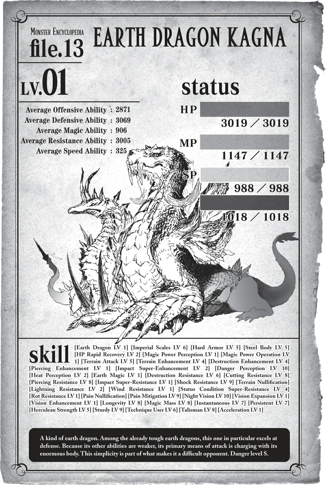

# Chương 8: Địa Long ở Tầng Dưới

*(The Earth Dragons of the Lower Stratum)*

---

### --- TRANG 151 ---

Tôi ăn.

Rồi lại ăn.

Và lại ăn.

Tôi không còn tốn công che giấu hành tung của mình nữa.

Tôi cắn ngập răng một cách thịnh soạn rồi hút sạch nội tạng của chúng.

Để có thể ngấu nghiến hết sạch không chừa lại gì.

`<Đã đạt đủ điểm thông thạo. Kỹ năng [No Nê LV 3] đã trở thành [No Nê LV 4].>`

`<Đã đạt đủ điểm thông thạo. Kỹ năng [Mở rộng Thần giới LV 5] đã trở thành [Mở rộng Thần giới LV 6].>`

Tôi đã càn quét điên cuồng ở Tầng Dưới.

Tôi đang cố gắng xả hết mọi cơn thịnh nộ tích tụ bên trong mình.

Quái vật yếu, quái vật mạnh, tôi săn lùng tất cả không phân biệt.

Trong quá trình đó, tôi đã có một cuộc tái ngộ không ngờ.

Địa Long Kagna.

Con địa long thứ hai tôi gặp ở Tầng Dưới.

Hử? Các anh muốn biết tôi có chiến với nó không á?

Đồng chí ơi, nhìn vào chỉ số của nó rồi hãy hỏi tôi câu đó nhé.

### --- TRANG 152 ---

`<Địa Long Kagna Cấp 26>`

| Chỉ số | Giá trị |
| :--- | :--- |
| **HP** | 4.198/4.198 (lục) |
| **MP** | 3.339/3.654 (lam) |
| **SP (vàng)** | 2.798/2.798 |
| **SP (đỏ)** | 2.995/3.112 |
| **Sức tấn công trung bình** | 3.989 (chi tiết) |
| **Sức phòng ngự trung bình** | 4.333 (chi tiết) |
| **Sức ma pháp trung bình** | 1.837 (chi tiết) |
| **Khả năng kháng tính trung bình** | 4.005 (chi tiết) |
| **Tốc độ trung bình** | 1.225 (chi tiết) |

**Kỹ năng:**
[Địa Long LV 2] [Long Lân Đế Vương LV 9] [Giáp Cứng LV 8] [Thân thể Thép LV 8] [Tự hồi phục HP nhanh LV 6] [Tốc độ hồi phục MP LV 2] [Giảm tiêu hao MP LV 2] [Cảm nhận Ma lực LV 3] [Thao tác Ma lực LV 3] [Tốc độ hồi phục SP LV 1] [Giảm tiêu hao SP LV 1] [Tăng cường Địa hình LV 8] [Tăng cường Hủy diệt LV 8] [Tăng cường Đâm LV 6] [Tăng cường Va chạm siêu cấp LV 5] [Tấn công bằng Ma lực LV 1] [Tấn công Địa hình LV 9] [Đánh trúng LV 3] [Cảm nhận Nguy hiểm LV 10] [Cảm nhận Nhiệt LV 6] [Thổ Ma pháp LV 2] [Kháng Hủy diệt LV 9] [Kháng Cắt siêu cấp LV 2] [Kháng Đâm siêu cấp LV 3] [Kháng Va chạm siêu cấp LV 6] [Kháng Sốc siêu cấp LV 4] [Vô hiệu hóa Địa hình] [Kháng Lửa LV 3] [Kháng Lôi LV 7] [Kháng Nước LV 3] [Kháng Gió LV 5] [Kháng Trọng lực LV 2] [Kháng Trạng thái bất thường siêu cấp LV 8] [Kháng Thối Rữa LV 3] [Vô hiệu Đau] [Giảm Đau siêu cấp LV 3] [Tăng cường Thị giác LV 3] [Dạ Nhãn LV 10] [Mở rộng Tầm nhìn LV 4] [Tăng cường Thính giác LV 1] [Sinh mệnh Tối thượng LV 2] [Tích lũy Ma lực LV 3] [Thân thể Bộc phát LV 1] [Sức bền LV 1] [Cự lực LV 9] [Kiên cố LV 2] [Khổ hạnh LV 2] [Hộ mệnh LV 1] [Gia tốc LV 1]

**Điểm kỹ năng:** 31.200

**Danh hiệu:**
[Kẻ diệt quái vật] [Kẻ tàn sát quái vật] [Long tộc] [Quán quân]

### --- TRANG 153 ---

Không đời nào, tuyệt đối không!

Với mớ kỹ năng đó, khả năng phòng ngự của thứ này quá sức hoàn hảo.

Nó cơ bản là một tòa lâu đài di động.

Phải thừa nhận là chỉ số của tôi cũng hơi lệch, nhưng các kỹ năng của nó hoàn toàn chuyên hóa về phòng ngự.

Bắt đầu với kỹ năng mặc định của loài rồng, [Long Lân Đế Vương], mang lại sức phòng ngự cực cao và khả năng triệt tiêu ma pháp.

Tiếp đó, bồi thêm [Giáp Cứng] và [Thân thể Thép] để nâng phòng ngự lên cao nữa.

Cả hai đều là kỹ năng kích hoạt liên tục chỉ đơn thuần để tăng chỉ số phòng ngự.

Nhờ có chúng, sức phòng ngự vốn đã cao ngất ngưởng của nó lại càng tăng vọt lên một tầm cao mới.

Rồi SAU ĐÓ, là cả một đống hỗn độn các kỹ năng kháng tính.

Tôi không nghĩ mình có thể làm xước da con quái này.

Thứ khó chịu nhất trong số các kỹ năng kháng tính kia là [Kháng Trạng thái bất thường siêu cấp].

Đó là phiên bản nâng cấp của kỹ năng Kháng Trạng thái bất thường mà con Hỏa Long sở hữu.

Vũ khí chính của tôi là các đòn tấn công gây trạng thái bất thường, vì thế đây là kịch bản tồi tệ nhất có thể xảy ra đối với tôi.

Đã vậy nó lại còn ở cấp 8, nên gần như không có trạng thái bất thường nào có thể tác động được lên nó.

Độc tố, Tê liệt, Nguyền rủa, tất tần tật mọi thứ.

Ồ phải rồi, hóa ra nguyền rủa cũng được phân loại là một dạng trạng thái bất thường.

Nghĩa là hầu hết các kỹ năng Tà Nhãn của tôi cũng sẽ vô dụng.

Ngay cả khi bỏ qua chuyện đó, việc chất độc không có tác dụng cũng là một cú đấm cực nặng.

Từ khi sinh ra cho đến nay, tôi luôn sống dựa vào độc.

Việc không thể dùng được nó quả là một cú sốc lớn.

Trước đây tôi từng hạ gục những quái vật có Kháng Độc, nhưng đây là lần đầu tiên tôi gặp một đối thủ có phòng ngự cao đến mức phi lý như thế này.

Không hẳn là tôi hoàn toàn không thể gây ra chút sát thương nào, nhưng bất kỳ vết thương nào tôi tạo ra cũng sẽ bị kỹ năng [Tự hồi phục HP nhanh] chữa lành chỉ trong chớp mắt.

Trạng thái bất thường không ăn thua.

Vậy còn tấn công vật lý thì sao? Ờ, cái đó lại càng bất khả thi hơn.

Sức tấn công ít ỏi của tôi không đời nào xuyên thủng được lớp phòng ngự như pháo đài vững chãi đó.

Tôi đoán [Hủ thực Công kích] có thể gây chút sát thương, nhưng bất kỳ vết thương nào mà đôi lưỡi hái của tôi tạo ra cũng chỉ như vết giấy cứa trên thân hình khổng lồ của Kagna mà thôi.

### --- TRANG 154 ---

Chưa kể [Hủ thực Công kích] giống như một quả bom tự sát, tôi chỉ có thể dùng nó đúng một lần cho mỗi bên lưỡi hái trái và phải.

Hạ gục một con quái vật thiên về phòng ngự như thế chỉ với hai đòn đánh á?

Ừm, mơ đi nhé.

Tính theo tỷ lệ phần trăm thì nó có khi còn gây hại cho tôi nhiều hơn là mục tiêu ấy chứ.

Ngay cả khi tôi có phá vỡ được phòng ngự của nó bằng cách đó để gây sát thương, vết thương vẫn sẽ nhanh chóng lành lại nhờ [Tự hồi phục HP nhanh].

Thật bất công khi một kẻ có phòng ngự cao như thế lại sở hữu cả kỹ năng hồi phục.

Nhờ vậy mà các đòn đánh từ [Trọng Lực Tà Nhãn] của tôi cũng chẳng mang lại nhiều ý nghĩa.

Nếu tấn công vật lý và trạng thái bất thường đều vô dụng, thì phép thuật là lựa chọn duy nhất của tôi.

Có lẽ tôi nên thấy may mắn vì nó không có kháng tính đối với loại ma pháp sở trường của tôi, [Ma pháp Hắc ám].

Nhưng nếu tôi cố bào máu của nó bằng ma pháp, khả năng hồi phục cùng phòng ngự cao của nó vẫn có thể giúp nó chống chịu được.

Trong trường hợp đó, nó có khi sẽ nhận được kỹ năng kháng ma pháp hắc ám ngay giữa trận chiến, và tốc độ hồi phục của nó lại bắt đầu vượt qua lượng sát thương tôi gây ra.

Nếu chuyện đó xảy ra thì coi như xong đời tôi.

Nhưng mà, dù sao thì chỉ số ma pháp của tôi cũng cao kinh hoàng, nên tôi nghĩ mình vẫn có thể bào mòn nó đến chết.

Vấn đề là nó có thể tiêu diệt tôi trước khi tôi kịp hoàn thành công việc đó.

Nhìn vào các kỹ năng của nó, tôi đoán chiến thuật của Kagna là sử dụng sức mạnh thô bạo từ thân hình khổng lồ của nó.

Đúng là nó có đòn phun thở từ kỹ năng [Địa Long] và một ít [Thổ Ma pháp] cấp thấp, nhưng ngoài những thứ đó ra, nó dường như không có kỹ năng thiên về tấn công nào đáng kể.

Thậm chí có thể nói đó là những lựa chọn tấn công tầm xa duy nhất của nó.

Nhưng khoan đã! Đừng hấp tấp thế.

Bởi vì nó quá khổng lồ, bản thân cơ thể nó đã là một vũ khí lớn rồi.

Ý tôi là, thử tưởng tượng xem.

Một con rồng khổng lồ lao thẳng vào tấm thân nhện nhỏ bé của tôi, muốn chà đạp tôi dưới chân nó.

Eo ôi.

Thêm vào đó, tốc độ của nó là 1.225, cao hơn nhiều so với hầu hết quái vật quanh đây.

### --- TRANG 155 ---

Chỉ là nó trông có vẻ thấp vì tất cả các chỉ số khác của nó quá cao mà thôi.

Tất nhiên, tôi luôn tự hào về tốc độ của mình, nên nó sẽ không thể đuổi kịp tôi đâu, nhưng mà vẫn đáng sợ lắm.

Đó là tất cả những giả định trong trường hợp chỉ có một đối thủ duy nhất.

`<Địa Long Gehre Cấp 24>`

| Chỉ số | Giá trị |
| :--- | :--- |
| **HP** | 3.556/3.556 (lục) |
| **MP** | 2.991/2.991 (lam) |
| **SP (vàng)** | 4.067/4.067 |
| **SP (đỏ)** | 3.562/3.845 |
| **Sức tấn công trung bình** | 3.433 (chi tiết) |
| **Sức phòng ngự trung bình** | 3.874 (chi tiết) |
| **Sức ma pháp trung bình** | 1.343 (chi tiết) |
| **Khả năng kháng tính trung bình** | 3.396 (chi tiết) |
| **Tốc độ trung bình** | 4.122 (chi tiết) |

**Kỹ năng:**
[Địa Long LV 2] [Long Lân Đế Vương LV 6] [Giáp Cứng LV 2] [Thân thể Thép LV 2] [Tự hồi phục HP nhanh LV 3] [Tốc độ hồi phục MP LV 1] [Giảm tiêu hao MP LV 1] [Cảm nhận Ma lực LV 3] [Thao tác Ma lực LV 3] [Tự hồi phục SP nhanh LV 3] [Giảm tiêu hao SP tối thiểu LV 3] [Tăng cường Địa hình LV 8] [Tăng cường Hủy diệt LV 9] [Tăng cường Cắt siêu cấp LV 8] [Tăng cường Đâm siêu cấp LV 4] [Tăng cường Va chạm siêu cấp LV 8] [Tấn công bằng Ma lực LV 1] [Tấn công Địa hình LV 8] [Cơ động Không gian LV 5] [Đánh trúng LV 10] [Né tránh LV 10] [Hiệu chỉnh Xác suất LV 7] [Cảm nhận Nguy hiểm LV 8] [Cảm nhận Hiện diện LV 10] [Cảm nhận Nhiệt LV 7] [Cảm nhận Chuyển động LV 8] [Thổ Ma pháp LV 2] [Kháng Hủy diệt LV 4] [Kháng Cắt LV 8] [Kháng Đâm LV 8] [Kháng Va chạm LV 9] [Kháng Sốc LV 5] [Vô hiệu hóa Địa hình] [Kháng Lôi LV 3] [Kháng Trạng thái bất thường siêu cấp LV 3] [Kháng Thối Rữa LV 1] [Vô hiệu Đau] [Giảm Đau LV 7] [Tăng cường Thị giác LV 7] [Dạ Nhãn LV 10] [Mở rộng Tầm nhìn LV 5] [Tăng cường Thính giác LV 5] [Tăng cường Khứu giác LV 4] [Tăng cường Vị giác LV 3] [Trường thọ LV 9] [Tích lũy Ma lực LV 1] [Di chuyển Tối thượng LV 2] [Vận May LV 1] [Cự lực LV 8] [Vững chãi LV 9] [Khổ hạnh LV 1] [Hộ thân LV 8] [Thần tốc (Skanda) LV 3]

**Điểm kỹ năng:** 31.000

**Danh hiệu:**
[Kẻ diệt quái vật] [Kẻ tàn sát quái vật] [Long tộc] [Quán quân]

### --- TRANG 156 ---

Tóm lại là, Kagna đang đi chung với một con rồng khác, tôi cũng chả biết nữa.

Thật đấy, cái quái gì thế này?

Không thể tin nổi.

Ai lại đi chơi đôi như thế chứ?

Dĩ nhiên tôi lập tức dùng [Dịch chuyển] chạy trốn ngay.

Rõ ràng là tôi chẳng còn lựa chọn nào khác rồi.

Ý tôi là, làm sao mà tôi thắng nổi trận đó?

Kagna là một pháo đài di động chưa đủ sao, Gehre với các chỉ số và kỹ năng [Cơ động Không gian] của nó còn xác nhận nó là một kẻ thiên về tốc độ nữa.

Chúng khác nào đang treo một tấm biển đề chữ: "NGƯƠI MUỐN CHẾT À?" trước mặt tôi đâu.

Không đời nào nhé.

Địa Long Gehre trông khá thon gọn và sắc sảo, tương tự như Alaba.

Nó to lớn, chắc chắn rồi, nhưng khác với vóc dáng đô con, dày cộp của Kagna, nó sở hữu một hình thể thanh thoát và có vẻ cực nhanh nhẹn.

Thêm vào đó, chỉ số tốc độ của nó là hơn 4.000.

Khuyến mãi thêm đống kỹ năng cảm nhận cao và [Né tránh] của nó, nghĩa là đánh trúng nó có lẽ sẽ cực kỳ khó khăn.

Thực ra tôi chỉ vô thức nhìn vào tốc độ của nó, nhưng Gehre cũng có phòng ngự khá cao đấy.

Dĩ nhiên là không bằng Kagna rồi, nhưng nó có các chỉ số cao, kỹ năng hỗ trợ, rất nhiều kháng tính, lại còn được khuyến cáo thêm kỹ năng [Tự hồi phục HP nhanh] nữa chứ.

Nên ngay cả khi tôi có đánh trúng được nó, nó có lẽ cũng chẳng hề hấn gì nhiều.

Đây là trò đùa quái đản gì vậy?

Và sức tấn công vật lý đó cũng không phải dạng vừa đâu.

Đặc biệt là mấy thứ trông như lưỡi đao ở chân trước của nó.

Tôi có cảm giác mình sẽ bị chém làm đôi nếu ăn trọn một đòn từ chúng.

Di chuyển vun vút ở tốc độ cao rồi vung vẩy những lưỡi đao đó... Eo ôi.

Và dĩ nhiên, nó cũng có đòn phun thở mặc định đi kèm.

### --- TRANG 157 ---

Dù vậy, phòng ngự của nó không cao như Kagna, nên tôi nghĩ các đòn tấn công của mình vẫn sẽ có tác dụng nếu tôi đánh trúng được nó.

Tốc độ của nó cao thật đấy, nhưng tôi cũng không phải dạng vừa, tôi có kỹ năng [Né tránh] và [Đánh trúng] cấp cao hơn mà.

Nếu tôi dùng chiến thuật một cách khôn ngoan, tôi có lẽ sẽ đánh bại được nó.

Đó là trong trường hợp nó chỉ đi một mình.

Nhưng nếu cả hai đi chung, Kagna có thể chặn đứng mọi đòn tấn công của tôi trong khi Gehre liên tục tấn công.

Một cặp đôi bù đắp hoàn hảo cho khuyết điểm của nhau, giống như sự kết hợp vô địch giữa giáo và khiên vậy.

Đấu một chọi một với từng đứa đã đủ mệt rồi, đằng này cả hai xuất hiện cùng lúc trong một sự kết hợp lý tưởng như thế á? Quên đi cho rảnh nợ.

Dù sao thì tôi cũng đã đánh dấu cả hai đứa rồi, nên tôi sẽ đợi chúng tách nhau ra trước khi hành động.

Đánh dấu là một trong những hiệu ứng của kỹ năng [Trí Tuệ]. Nó cho phép tôi đánh dấu các mục tiêu trên bản đồ của mình.

Miễn là chúng bị đánh dấu, tôi có thể tìm ra tung tích của chúng bất kể chúng đi đâu.

Dù vậy, nếu đó là một nơi tôi chưa biết, thông tin sẽ khá mơ hồ, kiểu như "ở đâu đó quanh đây".

Bản đồ Tầng Dưới của tôi vẫn chưa được lấp đầy, nhưng các dấu vết của Kagna và Gehre cứ dính chặt lấy nhau như sam.

Xem ra chúng sẽ không sớm tách nhau ra đâu.

Hơn nữa, khi đánh dấu một thứ gì đó, tôi có thể kiểm tra trạng thái của nó bất cứ lúc nào tôi muốn.

Nên nếu tôi để mắt tới nó, tôi có thể [Dịch chuyển] đến và tấn công nếu bắt gặp lúc chúng sơ hở.

Cơ mà tôi không nghĩ một cặp địa long lại hay có "sơ hở" đâu.

Nhân tiện, hóa ra việc chuẩn bị sẵn một phép thuật trước, sau đó dịch chuyển rồi lập tức tung phép thuật đó vào mục tiêu ngay trước mặt là chuyện bất khả thi.

Ngay cả khi bạn đã kiến tạo phép thuật sẵn từ trước, nó cũng sẽ tan rã ngay khi bạn dịch chuyển.

Đó là do bản chất của kỹ năng [Dịch chuyển] chứ không phải do khả năng kiến tạo phép thuật của người dùng, nên tôi đành chịu thôi.

Dù sao thì, cho đến khi hai tên đó tách nhau ra, tôi sẽ đi cày cấp ở chỗ khác.

Chắc vẫn còn ít nhất một con địa long khác ở Tầng Dưới, nên có lẽ tôi có thể xử lý con đó trước.

### --- TRANG 158 ---

Ví dụ như trả thù Alaba chẳng hạn.

Nghĩ lại thì, Alaba chính là lý do gốc rễ khiến tôi sợ hãi loài địa long ngay từ đầu.

Sẽ không tệ nếu tôi đánh bại nó để xua tan đi chấn thương tâm lý này.

Nếu một chọi một, tôi nghĩ mình có thể đánh bại được Kagna hoặc Gehre.

Trong trường hợp đó, vì Alaba có vẻ là một kẻ cô độc, tôi cũng có thể đánh bại nó chứ hả?

Hừm. Ý kiến không tồi chút nào.

Dù sao thì, lao vào trận chiến mà không chuẩn bị gì trước thì cực kỳ nguy hiểm, nên trước tiên tôi muốn xem qua chỉ số của nó đã.

Xem xét trường hợp của Kagna và Gehre, địa long không phải loại đối thủ mà bạn có thể cứ thế lao vào chiến đấu mà không có kế hoạch cụ thể.

Hơn nữa, nếu tôi nhớ không lầm thì cấp độ của Alaba còn cao hơn cả Kagna.

Tôi phải thu thập dữ liệu và vạch ra chiến thuật cái đã.

Điều đó đưa chúng ta trở lại hiện tại, tại Tầng Dưới.

Hiện tại tôi đang đứng gần địa điểm kỷ niệm nơi tôi lần đầu tiên rơi từ Tầng Trên xuống đây.

Tôi có thể dịch chuyển thẳng xuống đáy hố, nhưng lỡ đụng độ ngay với Alaba nếu nó ở đó thì đáng sợ lắm, nên tôi đã chọn một nơi cách đó một chút.

Hóa ra đó là một quyết định sáng suốt.

`<Baraggish Elroe Cấp 25>`

| Chỉ số | Giá trị |
| :--- | :--- |
| **HP** | 3.994/3.994 (lục) |
| **MP** | 3.011/3.011 (lam) |
| **SP (vàng)** | 3.926/3.926 |
| **SP (đỏ)** | 3.958/3.958 |
| **Sức tấn công trung bình** | 3.875 (chi tiết) |
| **Sức phòng ngự trung bình** | 3.821 (chi tiết) |
| **Sức ma pháp trung bình** | 2.999 (chi tiết) |
| **Khả năng kháng tính trung bình** | 3.295 (chi tiết) |
| **Tốc độ trung bình** | 3.827 (chi tiết) |

**Kỹ năng:**
[Long Lân Đế Vương LV 7] [Tự hồi phục HP nhanh LV 4] [Tự hồi phục MP nhanh LV 3] [Giảm tiêu hao MP tối thiểu LV 3] [Cảm nhận Ma lực LV 7] [Thao tác Ma lực LV 7] [Tự hồi phục SP nhanh LV 4] [Giảm tiêu hao SP tối thiểu LV 4] [Tăng cường Trạng thái bất thường siêu cấp LV 8] [Tăng cường Cường Axit LV 7] [Tăng cường Trọng lực siêu cấp LV 6] [Tăng cường Hủy diệt LV 9] [Tăng cường Đâm siêu cấp LV 4] [Tăng cường Va chạm siêu cấp LV 10] [Tăng cường Sốc siêu cấp LV 10] [Tấn công bằng Ma lực LV 7] [Tấn công bằng Kịch độc LV 10] [Tấn công bằng Tê liệt LV 6] [Tấn công bằng Cường Axit LV 8] [Tấn công Trọng lực siêu cấp LV 8] [Cơ động Không gian LV 1] [Ẩn mật LV 10] [Ngụy trang LV 8] [Vô thanh LV 10] [Vô hương LV 7] [Đánh trúng LV 10] [Né tránh LV 10] [Hiệu chỉnh Xác suất LV 8] [Cảm nhận Nguy hiểm LV 10] [Cảm nhận Hiện diện LV 8] [Cảm nhận Nhiệt LV 10] [Cảm nhận Chuyển động LV 10] [Trọng lực Ma pháp LV 5] [Ma pháp Bóng tối LV 4] [Kháng Hủy diệt LV 6] [Kháng Cắt LV 9] [Kháng Đâm LV 9] [Kháng Va chạm LV 9] [Kháng Sốc LV 5] [Kháng Thổ LV 8] [Kháng Hắc ám LV 1] [Kháng Trạng thái bất thường siêu cấp LV 9] [Kháng Thối Rữa LV 4] [Vô hiệu Đau] [Giảm Đau LV 9] [Tăng cường Thị giác LV 7] [Dạ Nhãn LV 10] [Mở rộng Tầm nhìn LV 7] [Tăng cường Thính giác LV 5] [Tăng cường Khứu giác LV 4] [Tăng cường Vị giác LV 3] [Trường thọ LV 9] [Tích lũy Ma lực LV 1] [Di chuyển Tối thượng LV 2] [Vận May LV 1] [Cự lực LV 8] [Vững chãi LV 9] [Khổ hạnh LV 1] [Hộ thân LV 8] [Thần tốc (Skanda) LV 3]

**Điểm kỹ năng:** 37.000

**Danh hiệu:**
[Kẻ diệt quái vật] [Sát thủ] [Kẻ tàn sát quái vật] [Quán quân]

### --- TRANG 159 ---

Gã này trông có vẻ là một rắc rối cực lớn đây.

Tôi đang ở một trong những lối đi cực rộng ở Tầng Dưới, nhưng thân hình dài thườn thượt khổng lồ của thứ này khiến lối đi trông thật nhỏ bé và chật chội. Nó là một con quái vật rắn khổng lồ, dễ dàng dài tới hàng chục feet.

Nó trượt đi một cách mượt mà đến khó tin so với kích thước khổng lồ của mình, không hề phát ra một tiếng động nào nhờ kỹ năng [Vô thanh].

### --- TRANG 160 ---

Ôi, tuyệt thật đấy.

Tên này còn tệ hơn cả Kagna hay Gehre nữa.

Tôi chắc chắn sẽ mất mạng nếu cố chiến với thứ này. Xin kiếu nhé.

Thật ra ý tôi là, không phải tôi hoàn toàn KHÔNG THỂ thắng, nhưng cơ hội thắng của tôi cùng lắm chỉ khoảng một nửa là cùng.

Dựa vào hình dạng của nó, tôi nghĩ nó có lẽ là một dạng tiến hóa của loài rắn ở Tầng Trên.

Lũ rắn vốn đã khá mạnh đối với Tầng Trên rồi, nên không có gì ngạc nhiên khi dạng tiến hóa của chúng lại càng đáng sợ hơn.

Tôi đứng quan sát từ khoảng cách vừa đủ dùng [Thẩm định] khi con rắn trườn đi nơi khác.

Nó đang hướng về phía cái hố sâu mà tôi chuẩn bị đi tới.

Sẽ là tin xấu nếu tôi đi theo nó rồi cuối cùng lại bị kéo vào một trận chiến, nên tôi nghĩ lúc này mình sẽ từ bỏ nhiệm vụ do thám Alaba.

Tôi đoán ở Tầng Dưới này vẫn còn những quái vật vượt quá tầm tưởng tượng của tôi. Có lẽ được nhắc nhở về điều đó cũng tốt.

Khi con rắn đã đi qua đủ lâu, tôi sẽ kích hoạt [Dịch chuyển] để trở về nhà.

Ngay cả với tôi và kỹ năng [Cực đỉnh Thần bí] của mình, việc sử dụng [Dịch chuyển] vẫn mất một chút thời gian.

Thứ đó có hàng đống kỹ năng cảm nhận, nên tôi sẽ đợi cho đến khi nó chắc chắn đã đi đủ xa để không phát hiện ra việc tôi đang sử dụng ma pháp.

Ầm!

Tôi có nghe thấy gì đó như là... tiếng đánh nhau thì phải?

Từ từ ghé mắt nhìn về hướng con rắn khổng lồ vừa đi, tôi có thể thấy nó đang chiến đấu với một thứ gì đó ở rấâât xa.

Đây là thời điểm hoàn hảo để sử dụng [Thị giác Viễn vọng]!

Hình ảnh cuộc tử chiến tuyệt vọng của con rắn khổng lồ được phóng to, lấp đầy tầm mắt tôi.

Rồi tôi nín thở.

Là một con rồng.

Di chuyển thoăn thoắt, thao túng đất cát... một con địa long.

Thân hình của con rắn uốn lượn với một tốc độ không ngờ so với kích thước khổng lồ của nó.

Nó dùng sức nặng khổng lồ cùng với lực hút của trọng lực để tông mạnh vào đối thủ với một lực đáng sợ.

Nhưng con rồng né tránh một cách dễ dàng, lướt đi trên mặt đất lẫn trên không trung.

Những ngọn giáo đất phóng vọt lên từ mặt đất, làm con rắn bị thương.

### --- TRANG 161 ---

Phòng ngự cao của nó đã ngăn những ngọn giáo đâm thủng lớp da, nhưng chúng chắc chắn vẫn đang gây ra sát thương.

Con rắn cố gắng né tránh những ngọn giáo, nhưng chúng cứ phóng lên từ mặt đất ở bất cứ nơi nào nó chạm vào. Với thân hình khổng lồ như thế, việc né tránh tất cả là bất khả thi.

Cách duy nhất để tránh những đòn tấn công từ con rồng điều khiển đất cát này là bay lên không trung.

Nhưng ngay khi tôi vừa nghĩ thế, đất đá từ trên trần nhà liền đổ ập xuống.

Dù sao thì đây cũng là một mê cung. Chúng tôi bị bao vây bởi đất đá ở mọi phía, và đối với con rồng này, tất cả chúng đều có thể dùng làm vũ khí.

Rồi con địa long cũng tự biến mình thành vũ khí, lao thẳng vào con rắn.

Những chiếc nanh, những bộ móng vuốt đó, và cả cái đuôi sắc bén như một thanh kiếm.

Con rắn hoàn toàn bị áp đảo, phó mặc cho số phận dưới tay con rồng.

Đối với tôi, việc ngắm nhìn cảnh tượng này diễn ra thật là đẹp đẽ.

Con rồng đó còn mạnh hơn cả những gì tôi tưởng tượng.

Đã có rất nhiều lần tôi nghĩ mình hoàn toàn không có cửa thắng.

Mẹ, D, Quản trị viên Gyuristodief.

Tuy nhiên, mặc dù tôi sợ hãi trước sức mạnh của họ, tôi chưa bao giờ khao khát nó.

Nhưng ngay lúc này, tôi thực sự đang khao khát sức mạnh của con rồng đó.

Tôi thậm chí muốn vượt qua nó.

Ngay cả tôi cũng không biết sự thúc giục này từ đâu mà ra.

Nhưng vì lý do nào đó, tôi cảm thấy mình cần phải chiến đấu với nó.

Lúc này tôi vẫn chưa đủ mạnh.

Nhưng đó không phải là một đỉnh cao vượt quá tầm với của tôi.

Nên tôi sẽ tiếp tục cày cấp và đón nhận thử thách này.

Con rắn khổng lồ trúng một đòn phun thở rồi ngã gục xuống đất.

Tôi biết quá rõ đòn phun thở đó.

Bởi vì, dĩ nhiên, chính tôi đã tự mình nếm trải nó.

Nhớ lại nỗi sợ hãi tôi đã cảm nhận lúc đó, cơ thể tôi lại run rẩy một lần nữa.

Nhưng lần này không chỉ có nỗi sợ. Một phần trong tôi đang run lên vì phấn khích.

Con rồng chà đạp lên xác của con rắn.

Tôi khắc sâu hình ảnh đầy uy lực đó vào trí óc mình trước khi dịch chuyển đi.

### --- TRANG 162 ---

Tôi muốn khắc ghi nó vào não bộ cho đến ngày tôi chính thức khiêu chiến với nó.

Sinh vật tôi phải vượt qua.

Cội nguồn của nỗi chấn thương tâm lý trong tôi.

Địa Long Alaba.

---

[◀ Chương trước: Đoạn phụ: Lão pháp sư và Kẻ thống trị](interlude_the_elderly_mage_and_the_ruler.md) | [Chương tiếp theo: Chương S8: Từ Bi ▶](s8_mercy.md)
