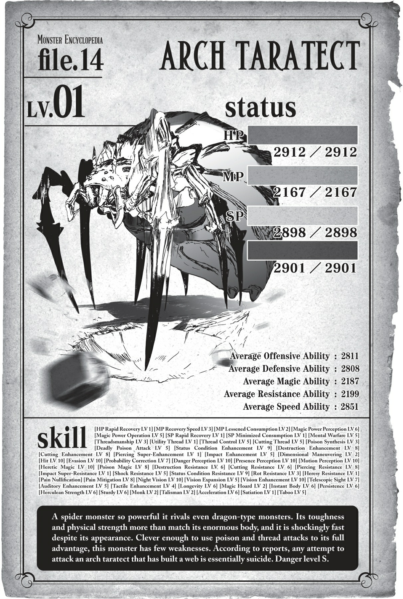

# Chương 9: Nhện đấu với Nhện

*(Spider vs. Spider)*

---

### --- TRANG 170 ---

Cú sốc Rồng!

Nghe có vẻ nực cười, nhưng tôi hoàn toàn bị rơi vào hội chứng hậu cú sốc rồng.

Khi về đến nhà, nỗi sợ hãi mới bắt đầu ập đến, và tôi phải mất đến nửa ngày trời mới hoàn hồn.

Nhìn thấy hai con địa long đi cùng nhau trong khi bình thường một con thôi đã đủ mạnh rồi... ừ thì cái đó cũng có tác động chút đỉnh, nhưng tôi vẫn không sao.

Nhưng Địa Long Alaba lại là một câu chuyện hoàn toàn khác.

Làm thế nào mà tôi đấu lại con đó được chứ?

Con rắn khổng lồ kia, con mà tôi đã nghĩ là quá mạnh so với mình, lại bị đè bẹp hoàn toàn mà chẳng tốn chút sức lực nào khi đối đầu với Alaba.

Đáng sợ ở chỗ nào ư? Tất tần tật luôn.

Những chuyển động nhẹ nhàng dễ dàng né tránh tất cả các đòn tấn công của con rắn.

Đúng là những chuyển động đó khá nhanh, nhưng nguy hiểm hơn nữa là chúng cực kỳ chính xác.

It thực hiện động tác né tránh tối ưu nhất tại mỗi thời điểm, kết hợp các kỹ năng của mình vào đó một cách mượt mà.

Khác với cách tôi càn quét qua mọi thứ bằng sức mạnh thuần túy từ kỹ năng, việc này giống như đang xem một bậc thầy võ thuật đã rèn luyện các chuyển động của mình qua nhiều năm trời.

Những động tác tuyệt diệu đó chẳng liên quan gì đến kỹ năng hay chỉ số cả. Đó là nghệ thuật thuần túy.

Mặt khác, nó còn có phương thức tấn công hiểm hóc phối hợp nhịp nhàng với những chuyển động đó.

Vừa né vừa công.

Không chỉ vậy, trên cả chiến thuật "bay lượn như bướm, châm chích như ong" hoàn hảo đó, còn có những đòn tấn công ma pháp ác mộng đồng thời truy đuổi đối thủ.

--- PAGE 171 ---

Sử dụng Thổ Ma pháp bên trong mê cung chẳng phải là quá gian lận sao?

Mê cung thì có tường đất, trần đất, chưa kể đến mặt đất nữa, biết không hả?

Nếu tất cả những thứ đó đều được biến thành vũ khí và đồng loạt ập vào bạn cùng lúc, thì đằng trời cũng không né được.

Vì tôi có [Tiên kiến], có thể tôi sẽ xoay xở được, nhưng tôi không tự tin mình sẽ trụ được lâu.

Tóm lại là những đòn tấn công ập đến từ mọi phía không có chỗ trốn, kết hợp với khả năng né tránh hoàn hảo dựa trên kỹ thuật thuần thục.

Quan trọng nhất là khả năng phán đoán của chính Alaba, thứ điều khiển tất cả nguồn sức mạnh đó.

Chưa kể, tuy tôi không có cách nào kiểm chứng vì con rắn chưa tung ra được đòn trúng đích nào, nhưng vì nó là một con địa long, tôi cá chắc là sức phòng ngự của nó cũng cực kỳ phi lý.

Không tìm ra nổi một điểm yếu nào.

Làm sao tôi có thể thắng được nó đây?

Tôi đơn giản là không thể hình dung nổi viễn cảnh mình chiến thắng nếu đấu tay đôi sòng phẳng với thứ đó.

Hừm.

Trong trường hợp đó, có lẽ mình nên nghĩ ra cách nào đó để biến nó thành một trận đấu không sòng phẳng?

Tôi tiếp tục tăng cấp trong vài ngày ở Tầng Dưới trong khi cố gắng nghĩ ra chiến thuật để đánh bại Alaba.

Hiện tại, tôi đang ở trong nhà của mình, nằm mai phục.

Một nhóm quái vật mà [Phát hiện] của tôi dò ra đang hướng thẳng về phía này.

Cân nhắc việc hầu hết quái vật ở Tầng Trên đều chạy trốn ngay khi nhìn thấy tôi, việc có kẻ đang tiếp cận tôi là vô cùng bất thường.

Chúng rõ ràng là cố tình đi đường này, nhắm thẳng vào tôi.

Nhưng tôi đoán là tôi biết lý do tại sao.

Và tôi cũng biết chính xác chúng là thứ gì luôn.

Nhóm quái vật xuất hiện.

Dẫn đầu là một con quái vật to lớn đến kinh ngạc.

--- PAGE 172 ---

`<Taratect Thượng cổ Cấp 31>`

| Chỉ số | Giá trị |
| :--- | :--- |
| **HP** | 4.466/4.466 (lục) +1.400 |
| **MP** | 3.182/3.182 (lam) +1.400 |
| **SP (vàng)** | 4.267/4.267 |
| **SP (đỏ)** | 4.262/4.262 +1.288 |
| **Sức tấn công trung bình** | 4.399 (chi tiết) |
| **Sức phòng ngự trung bình** | 4.315 (chi tiết) |
| **Sức ma pháp trung bình** | 3.004 (chi tiết) |
| **Khả năng kháng tính trung bình** | 3.101 (chi tiết) |
| **Tốc độ trung bình** | 4.237 (chi tiết) |

**Kỹ năng:**
[Tự hồi phục HP nhanh LV 5] [Tốc độ hồi phục MP LV 7] [Giảm tiêu hao MP LV 7] [Cảm nhận Ma lực LV 7] [Thao tác Ma lực LV 7] [Tự hồi phục SP nhanh LV 2] [Giảm tiêu hao SP tối thiểu LV 2] [Tăng cường Trạng thái bất thường siêu cấp LV 3] [Tăng cường Hủy diệt siêu cấp LV 2] [Tăng cường Cắt siêu cấp LV 4] [Tăng cường Đâm siêu cấp LV 8] [Tăng cường Va chạm siêu cấp LV 3] [Tăng cường Sốc siêu cấp LV 1] [Tấn công bằng Ma lực LV 6] [Ma đấu pháp LV 4] [Ý chí chiến đấu LV 7] [Tấn công bằng Kịch độc LV 10] [Tổng hợp Độc LV 5] [Tơ nghệ LV 5] [Tơ Đa Năng LV 3] [Điều khiển Tơ LV 10] [Niệm lực LV 2] [Cơ động Chiều không gian LV 8] [Đánh trúng LV 10] [Né tránh LV 10] [Hiệu chỉnh Xác suất siêu cấp LV 2] [Cảm nhận Nguy hiểm LV 10] [Cảm nhận Hiện diện LV 10] [Cảm nhận Chuyển động LV 10] [Ma pháp Dị giáo LV 10] [Ma pháp Độc LV 10] [Ma pháp Trị liệu LV 4] [Kháng Hủy diệt siêu cấp LV 1] [Kháng Cắt siêu cấp LV 2] [Kháng Đâm siêu cấp LV 2] [Kháng Va chạm siêu cấp LV 4] [Kháng Sốc LV 9] [Kháng Trạng thái bất thường siêu cấp LV 8] [Kháng Thối Rữa LV 6] [Kháng Ngoại đạo LV 5] [Vô hiệu Đau] [Giảm Đau siêu cấp LV 2] [Tăng cường Thị giác LV 10] [Thiên Lý Nhãn LV 2] [Dạ Nhãn LV 10] [Mở rộng Tầm nhìn LV 7] [Tăng cường Thính giác LV 7] [Tăng cường Khứu giác LV 2] [Tăng cường Xúc giác LV 7] [Sinh mệnh Tối thượng LV 2] [Tích lũy Ma lực LV 8] [Di chuyển Tối thượng LV 1] [Vận May LV 1] [Ngoan cường LV 2] [Kiên cố LV 2] [Khổ hạnh LV 7] [Hộ thân LV 8] [Thần tốc (Skanda) LV 1] [No Nê LV 4] [Cấm kỵ LV 7]

--- PAGE 173 ---

**Điểm kỹ năng:** 34.500

**Danh hiệu:**
[Kẻ Ăn Uế Tạp] [Kẻ Ăn Đồng Loại] [Kẻ diệt quái vật] [Người dùng Độc thuật] [Kẻ tàn sát quái vật] [Người dùng Tơ] [Thảm họa quái vật] [Kẻ diệt nhân tộc] [Quán quân]

Mạnh thế cơ à?!

Tại sao một con NHỆN lại có chỉ số cao hơn cả địa long chứ?!

Được rồi, ừ thì... đúng vậy.

Tôi đoán mình cũng đã lường trước được việc này.

Thứ này trông giống như một phiên bản màu nhợt nhạt và nhỏ hơn của Mẹ. Nó có lẽ chỉ còn cách một bước nữa là tiến hóa thành một thực thể như bà ta, nên dĩ nhiên nó không thể nào yếu được.

Đúng vậy.

Nhóm quái vật kéo đến tấn công tôi là nhện, giống hệt tôi.

Về mặt kỹ thuật, vì chủng tộc của tôi đã thay đổi thông qua tiến hóa, chúng tôi không thực sự thuộc cùng một gia đình. Nhưng ban đầu tôi cũng từng là một con Taratect, nên tôi đoán chúng giống như họ hàng gần vậy.

Phía sau con Taratect Thượng cổ có ba con Taratect Vĩ đại, kích thước nhỏ hơn con thủ lĩnh một cỡ.

`<Taratect Vĩ đại Cấp 29>`

| Chỉ số | Giá trị |
| :--- | :--- |
| **HP** | 2.845/2.845 (lục) +189 |
| **MP** | 2.101/2.101 (lam) |
| **SP (vàng)** | 2.833/2.833 |
| **SP (đỏ)** | 2.839/2.839 +786 |
| **Sức tấn công trung bình** | 1.766 (chi tiết) |
| **Sức phòng ngự trung bình** | 2.710 (chi tiết) |
| **Sức ma pháp trung bình** | 2.099 (chi tiết) |
| **Khả năng kháng tính trung bình** | 2.102 (chi tiết) |
| **Tốc độ trung bình** | 2.744 (chi tiết) |

**Kỹ năng:**
[Tự hồi phục HP nhanh LV 1] [Tốc độ hồi phục MP LV 2] [Giảm tiêu hao MP LV 1] [Cảm nhận Ma lực LV 6] [Thao tác Ma lực LV 5] [Tự hồi phục SP nhanh LV 1] [Giảm tiêu hao SP tối thiểu LV 1] [Tăng cường Hủy diệt LV 8]

--- PAGE 174 ---

[Tăng cường Cắt LV 8] [Tăng cường Đâm siêu cấp LV 1] [Tăng cường Va chạm LV 5] [Tăng cường Trạng thái bất thường LV 9] [Ý chí chiến đấu LV 4] [Tấn công bằng Kịch độc LV 5] [Tơ nghệ LV 2] [Tơ Nhện LV 9] [Điều khiển Tơ LV 5] [Tơ Cắt LV 5] [Tổng hợp Độc LV 2] [Cơ động Chiều không gian LV 2] [Đánh trúng LV 10] [Né tránh LV 10] [Hiệu chỉnh Xác suất LV 5] [Cảm nhận Nguy hiểm LV 10] [Cảm nhận Hiện diện LV 10] [Cảm nhận Chuyển động LV 10] [Ma pháp Dị giáo LV 10] [Ma pháp Độc LV 8] [Kháng Hủy diệt LV 6] [Kháng Cắt LV 6] [Kháng Đâm LV 8] [Kháng Va chạm LV 9] [Kháng Sốc LV 5] [Kháng Trạng thái bất thường LV 8] [Kháng Thối Rữa LV 3] [Kháng Ngoại đạo LV 1] [Vô hiệu Đau] [Giảm Đau LV 8] [Tăng cường Thị giác LV 10] [Thị giác Viễn vọng LV 7] [Dạ Nhãn LV 10] [Mở rộng Tầm nhìn LV 5] [Tăng cường Thính giác LV 4] [Tăng cường Khứu giác LV 4] [Trường thọ LV 6] [Tích lũy Ma lực LV 2] [Thân thể Bộc phát LV 6] [Sức bền LV 6] [Cự lực LV 6] [Vững chãi LV 6] [Khổ hạnh LV 1] [Hộ thân LV 2] [Gia tốc LV 6] [Phàm ăn LV 9] [Cấm kỵ LV 4]

**Điểm kỹ năng:** 29.500

**Danh hiệu:**
[Kẻ Ăn Uế Tạp] [Kẻ Ăn Đồng Loại] [Kẻ diệt quái vật] [Người dùng Độc thuật] [Người dùng Tơ] [Kẻ tàn sát quái vật]

Con này có lẽ là con mạnh nhất trong số những con Vĩ đại.

Đúng vậy, sau khi nhìn chỉ số của con Thượng cổ, con này so ra trông chẳng có gì to tát, nhưng nó vẫn khá là mạnh.

Chỉ số của nó thấp hơn con Hỏa Long ở Tầng Trung, nhưng nó lại sở hữu nhiều kỹ năng hơn nhiều.

Nếu chúng đấu một chọi một, con Hỏa Long có lẽ sẽ có lợi thế vì điểm yếu sợ lửa của loài nhện, nhưng nhìn chung, tôi sẽ nói thực lực của chúng đại khái ở cùng một đẳng cấp.

--- PAGE 175 ---

Vài hai con kia cũng có chỉ số tương tự, vậy nên về cơ bản, tôi đang phải đối phó với bốn con quái vật cấp rồng.

Trên hết, chúng còn có cả một bầy tiểu Taratect và vài con Taratect trưởng thành đang lượn lờ xung quanh nữa.

À, và thậm chí còn có vài con thuộc biến thể Độc hiếm gặp.

Ồ, có cả một vài con Tiểu Taratect Thứ cấp nữa! Ôi, hoài niệm ghê.

Chúng yếu dữ dội luôn.

Tôi cảm thấy chỉ cần đẩy nhẹ một cái là đủ để tiễn chúng lên đường rồi.

Nhìn xa xăm, tôi nghĩ về việc mình đã đi được bao xa kể từ khi còn là một trong số chúng.

Ồ, phải rồi.

Xin lỗi, tôi hơi lạc đề một giây, vì tôi không thực sự mong đợi một đám đông lớn thế này.

Nhưng tôi thừa biết chuyện này sẽ xảy ra.

Rằng sớm muộn gì một bầy Taratect cũng sẽ kéo đến tấn công tôi.

Tại sao ư?

Bởi vì tôi đang chủ động gây sự với sếp của chúng.

Mọi chuyện bắt đầu khi tôi đang chiến đấu với con Hỏa Long và ngạc nhiên khi thấy mình nghĩ về nó như một kẻ "phiền phức".

Thế là khi tất cả các [Phân thân Tư duy] của tôi hợp lực tìm kiếm nguồn gốc của sự kỳ lạ này, đó là lúc tôi phát hiện ra nó.

Về cơ bản, tôi đang bị kiểm soát.

Nói chính xác hơn, nó giống như giai đoạn sơ khởi của sự kiểm soát, hay nói cách khác là tôi bị vô thức cấy vào những suy nghĩ không phải của mình.

Hóa ra, vì Mẹ là "Nữ Vương" hay gì đó tương tự, bà ta có một kỹ năng cho phép kiểm soát con cái của mình.

Và thế là, tôi bắt đầu chịu ảnh hưởng từ kỹ năng đó, dù chỉ là một chút.

Hóa ra bà ta không kiểm soát tất cả con cái, mà chỉ những đứa đạt đến một mức độ sức mạnh nhất định. Và tôi đoán mình đã bước qua ranh giới đó từ lúc nào không hay.

Tôi nghĩ lý do bà ta không thể hoàn toàn kiểm soát tôi có lẽ là nhờ các chỉ số kháng tính cao của tôi, và thực tế là chủng tộc của tôi không còn là Taratect nữa.

Thật tình mà nói, tôi sẽ không bao giờ nhận ra nếu không có cảm giác kỳ lạ lúc đang đấu với Hỏa Long, và bản thân tôi cũng không hề có ý thức rằng mình đang kháng cự lại nó, nên tôi không thực sự chắc chắn tại sao nó lại không có tác dụng với mình.

Đó chỉ là những suy đoán tốt nhất của tôi thôi.

--- PAGE 176 ---

Dù sao thì, về cơ bản, bà ta đang cố thao túng tôi.

Nên dĩ nhiên tôi không thể cứ thế bỏ qua chuyện này được.

Đúng vậy. Tôi quyết định tung ra một đợt phản công nho nhỏ.

Vì Mẹ đang cố kiểm soát tôi, nghĩa là có một loại đường truyền tinh thần kết nối hai bên ở đó, dù chỉ là một chút.

Nên tôi đã tận dụng đường truyền đó để tiến hành hack ngược lại.

Tôi nghĩ mình cứ thử dùng [Phân thân Tư duy] xem sao, và đoán xem, nó hoạt động thật kìa.

Thế là hiện tại, ngoài tôi là não bộ chính ra, các [Phân thân Tư duy] khác đều đang làm việc cật lực để phản công ngược lại Mẹ, gặt hái được những phản hồi cực kỳ nồng nhiệt.

Nên gọi nó là gì đây nhỉ?

Kiểu như một loài ký sinh tinh thần hay virus linh hồn gì đó.

Chà, đại khái là các anh hiểu ý tôi rồi đấy.

Tôi cơ bản là đang nhấm nháp linh hồn của mẹ mình.

Nên rõ ràng là bà ta sẽ không chịu ngồi yên chịu trận.

Nghĩa là trong lúc các [Phân thân Tư duy] của tôi tiếp tục trận chiến tinh thần kịch tính chống lại Mẹ, bà ta đã phái một đội kiểu như SWAT đến để tiêu diệt tôi ở thế giới vật lý này.

Tôi có vẻ như đang giành chiến thắng trong trận chiến linh hồn này, nhưng nếu bà ta đích thân xuất hiện bằng xương bằng thịt, tôi chắc chắn sẽ thua.

Đó là lý do tại sao tôi xây nhà của mình ở khoảng không gian nằm giữa Tầng Trung và Tầng Trên, nơi Mẹ không thể vào được.

Bà ta đủ mạnh để dẫm bẹp một con Hỏa Long mà không cần suy nghĩ, nhưng vì thân hình quá khổng lồ, bà ta không thể chui vào một khu vực nhỏ hẹp như thế này.

Con Taratect Thượng cổ đang ở trước mắt tôi lúc này cũng to đùng đoành, nhưng xem ra nó vẫn có thể cố lách qua lối đi này bằng cách nào đó.

Giờ thì, chúng ta có một quân đoàn nhện khổng lồ ở đây, với bốn kẻ sừng sỏ cấp rồng dẫn đầu.

Nhìn từ ngoài vào, các anh chắc hẳn sẽ cho rằng tôi đang lâm vào tình cảnh ngập đầu trong nước sôi lửa bỏng.

Nhưng nghĩ mà xem. Nếu tôi đã biết bọn chúng sẽ đến, các anh thực sự nghĩ tôi sẽ chỉ ngồi đây chờ chết mà không chuẩn bị bất kỳ thứ gì sao?

Bọn chúng là nhện.

Và tôi cũng là nhện.

Dạo này tôi hay đi lang thang trong mê cung, nhưng sâu thẳm bên trong, tôi vẫn là kiểu thích chăng tơ rồi nằm chờ con mồi tự dẫn xác vào lưới, biết không hả?

Thế nên dĩ nhiên tôi sẽ không chịu ngồi im mà không giăng sẵn vài cái bẫy rồi!

--- PAGE 177 ---

Con Taratect Thượng cổ từ từ chuyển động.

Tôi dự đoán chuyển động của nó bằng [Tiên kiến].

Rồi né tránh.

Cặp nanh của con Thượng cổ sượt qua đúng vị trí tôi vừa đứng một phần nghìn giây trước.

Eo ôi!

Nhanh thế?!

Chà, tôi đoán đây là con quái vật có chỉ số tốc độ cao nhất mà tôi từng [Thẩm định].

Cộng thêm việc [Đánh trúng] của nó đã đạt cấp tối đa, và [Hiệu chỉnh Xác suất siêu cấp] ở cấp 2.

Nếu không nhờ bộ tứ combo [Gia tốc Tư duy], [Tiên kiến], [Né tránh] và [Hiệu chỉnh Xác suất] của tôi, cặp nanh đó có lẽ đã cắm phập xuyên qua người tôi rồi.

Chết tiệt, đáng sợ thật.

Nhưng dù nó có nhanh đến thế nào đi nữa, nó vẫn chậm hơn tôi.

Ngay cả khi con Thượng cổ sử dụng [Ma đấu pháp] và [Ý chí chiến đấu] để tăng cường toàn bộ chỉ số, tôi vẫn nhanh hơn nhiều.

Hơn nữa, cấp độ kỹ năng [Ma đấu pháp] và [Ý chí chiến đấu] của tôi đằng nào cũng cao hơn.

Thực tế, [Ma đấu pháp] của tôi thậm chí đã tiến hóa thành [Ma Thần Đấu Pháp].

[Ma Thần Đấu Pháp] dĩ nhiên là phiên bản mạnh mẽ vượt trội của [Ma đấu pháp].

Bên cạnh việc có hiệu ứng mạnh hơn hẳn phiên bản cấp thấp, nó thậm chí còn tăng tốc độ tăng trưởng của các chỉ số ma pháp khi lên cấp.

Nhờ đó, các chỉ số liên quan đến ma pháp vốn đã cao kinh hoàng của tôi nay đã đạt tới những cấp độ thực sự không thể đong đếm nổi.

Khi tôi kích hoạt đồng thời cả [Ma Thần Đấu Pháp] và [Long Lực], sức tấn công ma pháp cùng khả năng kháng tính của tôi dễ dàng đạt tới hàng vạn.

Hắc hắc hắc.

Sức mạnh vật lý của con Thượng cổ đúng là một mối đe dọa thật đấy, nhưng điều đó vô nghĩa nếu nó còn chẳng đánh trúng nổi tôi.

Con Taratect Thượng cổ phun ra một ít tơ.

Ồ, tốt nhất là không nên chạm vào thứ đó.

Tôi quá rõ về nó rồi.

Tơ nhện là rắc rối lớn đấy.

Nếu bị dính vào là coi như xong đời.

Chà, ngay cả khi bị dính thật, tôi vẫn có thể dùng [Dịch chuyển] để thoát thân nếu cần thiết, nhưng mà vẫn cứ là phải cẩn thận.

--- PAGE 178 ---

Một mạng lưới tơ bay thẳng về phía tôi.

Trong lúc né tránh nó, từ khóe mắt, tôi thấy những con Taratect Vĩ đại cũng bắt đầu hành động.

À, tôi nghĩ chắc mình nên nghiêm túc hơn một chút vậy.

Biết rõ rằng những cái bẫy mình giăng sẵn gần như đảm bảo chiến thắng 100%, đâm ra hơi khó để cảm nhận được bầu không khí căng thẳng nào.

Hơn nữa, đến thời điểm này tôi đã đủ mạnh để không còn phải lo lắng về việc bị bốc hơi chỉ vì ăn trọn một đòn đánh nữa rồi.

Các chỉ số vật lý cơ bản của tôi hiện tại vốn đã cao, lại thêm [Ma Thần Đấu Pháp], [Ý chí chiến đấu] và [Long Lực] đẩy chúng lên cao hơn nữa, thế nêêên...

Nếu thực sự muốn, tôi thậm chí có thể nâng chúng lên cao hơn nữa bằng [Phẫn Nộ], nhưng làm vậy thì hơi quá đà rồi, biết không hả?

Ý tôi là, kỹ năng [Phẫn Nộ] tăng các chỉ số vật lý của tôi lên một lượng khổng lồ.

Lớn đến mức nào ư? Chà, mới ở cấp 1 thôi mà nó đã tăng chỉ số gần bằng kỹ năng [Ý chí chiến đấu] cấp 9 của tôi rồi.

Đã vậy nó còn chẳng tiêu tốn MP hay SP nữa chứ.

Tuy nhiên, khi tôi sử dụng nó, tôi sẽ tự động rơi vào trạng thái bất thường [Điên Loạn].

Nhờ có [Vô hiệu Dị giáo], [Điên Loạn] không thể hoàn toàn nuốt chửng lý trí của tôi hay gì cả, nhưng tôi vẫn không thực sự muốn dùng nó thêm một lần nào nữa.

Không có nó thì tôi vẫn mạnh chán, và nói cho cùng thì đằng nào tôi cũng là kiểu chuyên ma pháp.

Việc gì tôi phải vứt bỏ ma pháp của mình để lao vào một trận giáp lá cà vật lý ngớ ngẩn chứ?

Dù sao thì, tính cả kỹ năng [Kiên trì] vào nữa, lượng HP thực tế của tôi dễ dàng vượt qua con số 10.000.

Không có thứ gì có thể thổi bay ngần ấy máu chỉ bằng một đòn đánh được đâu, hoặc ít nhất là tôi muốn tin là như thế.

Dù thế nào thì con Thượng cổ này chắc chắn là không thể rồi.

Đòn tấn công mạnh nhất của nó hẳn là [Tấn công bằng Kịch độc] cấp 10.

Và nó sử dụng [Tơ Đa Năng] để đảm bảo mục tiêu không thể đào tẩu.

Đúng là một combo hiểm hóc. Nếu tôi không có [Dịch chuyển], có khi ngay cả tôi cũng đi tong nếu bị dính chiêu.

Và tôi biết rất rõ mình đang nói gì mà, vì bản thân tôi cũng đã dùng loại combo đó cả đống lần rồi.

Nhưng như đã nói, tôi có [Dịch chuyển], nên có thể thoát ra dễ như bỡn.

--- PAGE 179 ---

Phải thừa nhận, các đòn tấn công vật lý từ một con quái vật khổng lồ như thế rất đáng sợ, nhưng vì tôi nắm thế thượng phong về tốc độ, nó thậm chí sẽ chẳng thể sượt qua người tôi.

Ngoài chuyện đó ra, mối đe dọa thực sự duy nhất là nếu cả bầy đồng loạt tổng tấn công tôi cùng lúc, nhưng tôi đã có những cái bẫy của mình để giải quyết việc đó rồi.

Giờ thì, hãy cùng thử nghiệm cái bẫy mới của tôi nào: "Chào mừng đến với phòng xông hơi".

Con Thượng cổ đang chuẩn bị bước chân vào đó rồi.

Kìa, sợi tơ tôi giăng sẵn từ trước đã chặn đứng bước tiến của nó.

Hắc hắc. Tôi đã làm cho sợi tơ mảnh đến mức gần như vô hình, rồi dán chặt nó xuống đất để đố ai mà phát hiện ra được!

Đó mới gọi là bẫy dính chứ!

Việc của tôi chỉ là dụ nạn nhân bước vào đó thôi.

Nhưng đây mới chỉ là bắt đầu.

Với chỉ số cao như của con Thượng cổ, nó có lẽ có thể bứt đứt đống tơ mỏng chăng trên sàn bằng sức mạnh cơ bắp thuần túy.

Và ngay cả khi không thể thoát ra, nó vẫn còn ma pháp để thực hiện các đòn tấn công tầm xa.

Vũ khí ưa thích của con Thượng cổ là [Ma pháp Độc], cũng là một trong những món tủ của tôi.

Tùy tình hình, nó thậm chí có thể biến thành một lô cốt cố định.

Mặc dù trong trường hợp của tôi, kháng độc của tôi đủ cao để đòn đó không gây ra bao nhiêu sát thương, nên chẳng có gì to tát cả.

Trong một trận chiến bình thường, ừ thì, một con quái vật cấp rồng đúng là rất kinh hoàng.

Nhưng lần này, nó đã gây sự nhầm đối thủ rồi.

Nói cho cùng, tôi đã biết hầu hết các kiểu tấn công của thứ này rồi.

Nghĩ mà xem.

Nghĩ về tất cả các chiến thuật tôi đã tích lũy qua thời gian mà xem.

Giăng tơ, chiến đấu bằng [Độc Nha], nã ma pháp.

Đó chính xác là phong cách chiến đấu của tôi.

Tôi chắc chắn con nhện này cũng chẳng khác gì.

Cả hai chúng tôi đều là quái vật nhện, và tôi kiếp trước cũng từng là một con Taratect mà.

Việc các chiến thuật của chúng tôi trùng khớp nhau là điều hoàn toàn tự nhiên.

Kiểu như: "Ta đã đi trước ngươi một bước và biết tỏng mọi nước đi của ngươi rồi!" đại loại thế.

Tôi thậm chí có thể đã giành chiến thắng trong một trận đối đầu trực diện sòng phẳng.

Không đời nào tôi lại đi đâm đầu vào một việc nguy hiểm như thế.

Tôi khẽ chạm vào con Thượng cổ đang bất động vì đống tơ của tôi.

Sau đó, tôi sử dụng [Ma pháp Chiều không gian]: [Dịch chuyển Diện rộng].

Đây là cái bẫy mà tôi nghĩ ra để dùng đối phó với Alaba.

--- PAGE 180 ---

Cuối cùng, tôi quyết định rằng nó sẽ không có tác dụng trước chỉ số kháng tính cao và kỹ năng [Long Lân Đế Vương] của loài rồng.

Nhưng một con Taratect Thượng cổ không có kỹ năng đó.

Và chỉ số kháng tính của nó cũng không cao đến mức có thể chống đỡ nổi uy lực ma pháp mạnh mẽ của tôi.

Con Thượng cổ bị dịch chuyển đi cùng với tôi.

Điểm đến của chúng tôi: ngay phía trên hồ dung nham ở Tầng Trung, nơi tôi đã chiến đấu với con Hỏa Phi Long.

Chào mừng đến với phòng xông hơi siêu nóng bỏng.

Oa ha ha ha!

Thấy cảnh tượng dung nham đỏ rực sôi sục này thế nào hả?!

Hẳn là kinh khủng lắm đối với một con nhện có điểm yếu sợ lửa nhỉ!

Đến cả tôi cũng đang nóng đến mức khó chịu đây này!

Nhưng chuyện này đối với con Thượng cổ chắc chắn phải tồi tệ hơn tôi rất nhiều.

Phía dưới là cả một đại dương dung nham, nên rơi xuống đó đồng nghĩa với việc chắc chắn cầm chắc cái chết.

Thân hình tôi nhỏ nhắn, nên có thể đáp xuống một trong những hòn đảo đá nhỏ rải rác xung quanh.

Nhưng cơ thể của con Thượng cổ dài tới khoảng năm mươi feet.

Không có khối đá nào bên dưới đủ lớn để một thực thể khổng lồ như thế đáp xuống cả.

Trên hết, chỉ cần ở trong môi trường này thôi là HP của nó cũng sẽ bị bào mòn dần rồi.

Tôi đã dành rất nhiều thời gian để cày kỹ năng [Kháng Lửa], còn con Thượng cổ thì hoàn toàn không có một tí kháng lửa nào.

Nhờ có [Tự hồi phục HP nhanh], máu của nó không thực sự sụt giảm nhiều, nhưng chắc chắn là vẫn đau lắm đấy.

Thành ra giờ đây kỹ năng [Tự hồi phục HP nhanh] của nó cơ bản là coi như vô dụng.

Đúng là nó đang dùng [Cơ động Chiều không gian] để nâng đỡ cơ thể khổng lồ của mình lơ lửng giữa không trung, nhưng hiện tại nó phải đối đầu với tôi, một đối thủ cực kỳ kỵ giơ, ngay trong một chiến trường rực lửa—điểm yếu chí mạng của nó.

Đúng là thế chiếu tướng mà.

Hắc hắc hắc. Hãy hối hận vì sự ngu ngốc của ngươi khi dám khiêu chiến với một con nhện ở đẳng cấp vượt trội hoàn toàn đi, rồi tan biến đi nhé!

Giờ thì, đến lúc dùng [Xích Lực Tà Nhãn] rồi!

[Xích Lực Tà Nhãn] là dạng tiến hóa của [Trọng Lực Tà Nhãn]. Giờ đây, thay vì chỉ kéo ghì đối thủ xuống, tôi có thể kéo nó theo bất kỳ hướng nào tôi muốn.

Và không chỉ kéo—tôi còn có thể đẩy bằng nó nữa.

Nếu tôi sử dụng lực đẩy này lên không gian xung quanh mình, tôi thậm chí có thể tạo ra một dạng kết giới phòng ngự bao bọc bản thân.

--- PAGE 181 ---

Mặc dù vậy, vì không khí và mọi thứ xung quanh cũng bị đẩy xa khỏi tôi, nên tôi không thể dùng theo cách đó quá lâu được.

Ngoài ra, tuy nó đã tiến hóa và có thêm nhiều chức năng hơn, nhưng sở trường mạnh nhất của nó vẫn là đẩy ghì xuống dưới.

Nên tôi nhắm thẳng lực đẩy hướng xuống đó vào con Thượng cổ và đẩy với tất cả sức bình sinh.

Đã thế nó còn đang chật vật giữ tấm thân đồ sộ lơ lửng trên không trung, nay tôi lại bồi thêm một lượng trọng lực khủng khiếp nữa.

Ngươi cứ tự nhiên rơi xuống đi nhé, được chứ?

Thôi nào, cùng lắm thì cũng chỉ chết là cùng chứ mấy.

Giờ thì, khẩn trương rơi xuống giùm tôi cái để còn cống hiến điểm kinh nghiệm (EXP) cho tôi nào.

Con Taratect Thượng cổ vẫn bằng cách nào đó chống đỡ được nhờ kỹ năng [Cơ động Chiều không gian].

Sau đó, nó phóng ra một sợi tơ hướng về phía trần nhà.

Thật luôn hả? Ngươi không thể cứ thế rơi xuống được à?

Làm như tôi sẽ để ngươi chạy thoát dễ thế không bằng.

Tôi sử dụng một ma pháp thuộc hệ [Hắc Ma pháp]: [Hắc Đạn].

[Hắc Ma pháp] là dạng tiến hóa cao hơn nữa của [Ma pháp Hắc ám], nằm ngay dưới [Ma pháp Vực sâu] một bậc.

Nó không mạnh mẽ bằng [Ma pháp Vực sâu], nhưng chắc chắn là dễ sử dụng hơn và sở hữu một phép tấn công đơn giản nhưng hiệu quả.

Cụ thể là cái này đây—[Hắc Đạn].

Đây là phiên bản nâng cấp của phép [Hắc ám Đạn] thuộc [Ma pháp Hắc ám], và đúng như tên gọi, nó bắn ra một quả cầu đen kịt.

Bên cạnh thuộc tính Hắc ám, phép này có vẻ như còn mang theo thuộc tính Sốc, nên nó sẽ phát nổ khi va chạm với mục tiêu và gây thêm sát thương.

Nhân tiện, vì đây là ma pháp cấp cao, sức công phá của nó mạnh hơn vẻ bề ngoài rất nhiều.

Quả [Hắc Đạn] bắn trúng ngay mông của con Thượng cổ khi nó đang phun tơ.

Cú sốc chấn động khiến sợi tơ bay chệch hướng, và HP của con Thượng cổ sụt giảm.

Được rồi, kết thúc việc này thôi nào.

Tôi nã liên tiếp một loạt [Hắc Đạn] không chút thương tiếc.

Liệu nó sẽ rơi xuống dung nham trước?

Hay nó sẽ cạn sạch HP trước đây?

Kết quả sẽ thế nào đây ta?

Con Thượng cổ đang cố hết sức bình sinh để sống sót.

--- PAGE 182 ---

Ồ phải rồi, nó đang cố gắng vô cùng.

Nó chống chịu các đòn tấn công của tôi, sử dụng [Ma pháp Trị liệu] để tự vá víu cơ thể, và thậm chí còn nhận được kỹ năng [Kháng Hắc ám] ngay giữa trận.

Phải công nhận con này gan lì thật.

Cố gắng tốt lắm, người bạn nhỏ.

Giờ thì chết giùm tôi cái đi được chưa hả?

[Hắc Ma pháp] của tôi đạt cấp 3 nhờ việc nã đạn liên tục, thế là tôi liền đem phép mới ra dùng thử.

Phép này có tên là [Hắc Thương].

Đây là phiên bản dạng thương của [Hắc Đạn], nên nó cũng gây thêm sát thương mang thuộc tính Đâm.

Cây [Hắc Thương] đâm xuyên qua tấm thân bầm dập tơi tả của con Taratect Thượng cổ.

Cuối cùng, con nhện khổng lồ có chỉ số vượt qua cả Địa Long cũng trút hơi thở cuối cùng.

Cấp độ của tôi tăng vọt lên 4 cấp cùng một lúc.

Tôi lột xác.

Được rồi, được rồi. Tốt nhất là nên thu gom cái xác trước khi nó rơi hẳn xuống.

Tôi chộp lấy cái xác đang rơi của con Thượng cổ rồi dịch chuyển trở về.

Nhà mình ơi, tôi về rồi đây!

Lát nữa tôi sẽ phải thưởng thức bữa ăn này mới được.

Chà, dùng từ "thưởng thức" thì hơi quá. Cơ thể của nó có độc, nên chắc chắn vị của nó sẽ cực kỳ kinh tởm.

Đúng vậy, chính xác là thế đấy. Đội trưởng của các ngươi vừa biến mất cùng ta và quay lại dưới dạng một cái xác không hồn.

Tôi hoàn toàn có thể hiểu được phản ứng hỗn loạn hoảng sợ của đám tàn quân nhện còn lại.

Được rồi, ngươi đó, người bạn Vĩ đại tốt bụng.

Xin lỗi nhé, ta biết ngươi đang bận đứng hình vì sợ hãi, nhưng ngươi có muốn ghé thăm phòng xông hơi luôn không?

Một con Taratect Vĩ đại, xin mời vào phòng xông hơi!

Kể từ đó, tôi chỉ đơn giản lặp lại chiến thuật tương tự như đã dùng với con Thượng cổ.

Tầng Trung, nơi từng gây cho tôi biết bao nhiêu gian nan khốn khổ, giờ đây lại đóng vai trò là chìa khóa cho cái bẫy vĩ đại nhất của tôi từ trước đến nay, quét sạch quân đoàn nhện không chút nương tay.

Tôi kết liễu toàn bộ cả ba con Taratect Vĩ đại bằng phương pháp tương tự, sau đó quét sạch lũ còn lại bằng cách nã ma pháp bừa bãi.

Chỉ số của lũ Taratect trưởng thành và mấy con râu ria khác chỉ suýt soát chạm mốc một ngàn.

--- PAGE 183 ---

Đối với tôi ở hiện tại, bọn chúng chẳng khác nào lũ tép riu.

Hử? Còn mấy con Tiểu Taratect Thứ cấp ấy hả?

Chúng lăn quay ra chết chỉ từ những làn sóng xung kích từ các đòn tấn công khác của tôi rồi, có sao không hả?

Con Thượng cổ, ba con Vĩ đại, lũ Taratect trưởng thành cùng mớ lâu la tạp nham đều bị hạ gục trước khi kịp nhận ra chuyện gì đang xảy ra.

Nhờ sự kết hợp giữa một vài con mồi lớn và một lượng lớn lũ tép riu, kết quả là tôi thu hoạch được một lượng điểm kinh nghiệm khổng lồ.

Nhờ vậy, tôi đang tăng cấp như điên cuồng ở đây đây.

Ha ha ha! Tôi không thể ngừng cười khúc khích được.

Với một mánh khóe hiểm hóc như thế này, tôi có thể đánh bại đủ loại con mồi lớn hơn mà không gặp bất kỳ vấn đề gì.

Chà, tôi đoán lần này mình cũng có vài lợi thế nhất định, nhưng dù sao đi nữa.

Quả đúng như câu tục ngữ xưa đã nói.

Cẩn tắc vô áy náy mà!

--- PAGE 184 ---
