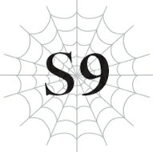

# Chương 10: Tôi Vẫn Chưa Biết Cái Biệt Danh Ngớ Ngẩn Đó

*(I Still Don’t Know the Stupid Nickname of “Nightmare of the Labyrinth” That I Got That Day)*

---

### --- TRANG 200 ---

Tôi hiện đang tích cực lên kế hoạch đánh bại Alaba để nhận về cơn mưa lời khen.

Hôm nay, tôi đã quay trở lại nơi đầu tiên mình chạm trán Alaba, ngay dưới đáy của cái hố khổng lồ đầy tiếng ong vo ve xung quanh.

Để làm gì á? Hỏi thừa thế, tất nhiên là để dọn dẹp sạch sẽ lũ ong rồi.

Xem nào, tôi đã suy nghĩ rất kỹ. Nếu tôi cứ thế đặt chân lên mặt đất để chiến đấu với Alaba, tôi sẽ không có lấy một cơ hội chiến thắng nào.

Đây không phải là một lối ẩn dụ phức tạp gì cả. Ý tôi theo nghĩa đen là nếu tôi chạm chân xuống đất khi đang đánh nhau với Alaba, tôi chắc chắn sẽ thua.

Bởi vì mặt đất chính là một trong những vũ khí của Alaba.

Bạn có tưởng tượng nổi cảnh những cây thương đất và đống gai góc đột ngột mọc lên từ ngay dưới chân mình không?

Không chỉ có thế, nó còn có thể chặn các đòn tấn công bằng những bức tường đất cùng những thứ tương tự nữa.

Vì vậy, tôi quyết định rằng mình sẽ không thể an tâm trừ phi ở cách xa mặt đất.

Tôi biết, tôi biết, các bạn sẽ hỏi thế thì tôi định làm thế nào chứ gì? Ồ, thì tôi chỉ cần lơ lửng trên không trung thôi! Quá hiển nhiên còn gì.

Thật may mắn cho tôi, tôi có kỹ năng [Cơ động Chiều không gian], thứ cho phép tôi chạy nhảy tự do giữa không trung.

Với kỹ năng này, tôi có thể thực hiện một trận chiến trên không ra trò ngay cả khi không có cánh.

Và còn nơi nào thích hợp hơn để tham gia vào kiểu chiến đấu đó hơn là trung tâm của một không gian rộng lớn, nơi tôi có thể duy trì khoảng cách an toàn với các bức tường?

Cái hố này đủ rộng để tôi giữ một khoảng cách kha khá giữa mình và các bức tường, vô hiệu hóa hiệu quả mối đe dọa từ Thổ Ma pháp của Alaba.

Đây chính là địa điểm hoàn hảo cho trận quyết chiến định mệnh của chúng tôi.

Tuy nhiên, có một vấn đề nhỏ.

Phải, các bạn đoán đúng rồi đấy: chính là lũ ong cứ vo ve ngu ngốc kia.

Điều cuối cùng tôi muốn là lũ ngốc này xen vào phá bĩnh khi tôi đang tập trung cao độ vào trận chiến với Alaba.

Vì vậy, với mục tiêu đôi đường đều lợi là loại bỏ chướng ngại vật kiêm cày điểm kinh nghiệm, hãy bắt đầu dọn dẹp lũ ong nào!

*PHẬP!*

Ơ, á?!

Tôi bị đâm rồi á?!

Từ phía sau lưng, tôi bị đâm lén từ sau lưng sao?!

Này này, chuông bắt đầu trận đấu còn chưa reo mà hả cái đồ khốn kia!

Đau, đau quá! Nhờ có [Giảm Đau] nên thực ra nó không đau đến thế, nhưng nó gợi lại những ký ức chấn thương tâm lý thực sự từ lần đầu tiên tôi bị đâm như thế này và suýt chết!

Tôi dùng tơ trói chặt con ong trên lưng mình rồi giật mạnh nó ra.

Ư. Đúng là phiền phức.

Giờ thì mày tới số rồi con ạ.

Ai mà ngờ một con ong ngu ngốc lại có thể thực hiện một đòn đánh lén bất ngờ lên tôi, ngay cả khi tôi đã bật kỹ năng [Phát hiện] cơ chứ?

Mặc dù nói vậy thôi, nhưng HP của tôi hầu như không sụt giảm chút nào, và nó đã lập tức hồi phục hoàn toàn nhờ [Tự hồi phục HP].

Nghĩ lại cũng điên rồ thật, trước đây cái đòn này suýt chút nữa đã tiễn tôi về chầu ông bà rồi đấy nhỉ?

Lúc đó nó đã khoét một cái hố lớn trên lưng tôi, và vì lúc đó tôi chưa có [Tự hồi phục HP] nên cơ hội sống sót duy nhất của tôi là tăng cấp để lột xác. Hoài niệm thật đấy…

*PHẬP!*

Lại nữa hả? Nghiêm túc đấy chứ?!

Vì bây giờ tôi còn có cả [Giảm Đau siêu cấp] nên nó hầu như chẳng đau đớn gì, nhưng điều đó không có nghĩa là nó bớt gây khó chịu!

Cứ ném chúng đi mãi thì phiền phức quá, nên lần này tôi chỉ cần dùng [Điều khiển Tơ] để băm vằn nó ra luôn.

Thế nhưng, nếu chuyện đó xảy ra hai lần thì chắc chắn sẽ có lần thứ ba đúng không?

Mà làm thế quái nào lũ chúng nó lại tiếp cận được sau lưng tôi mà không hề kích hoạt [Cảm nhận Nguy hiểm] thế nhỉ?

### --- TRANG 202 ---

Ồ, có lẽ là do chúng không thực sự được hệ thống ghi nhận là nguy hiểm chăng?

Về mặt kỹ thuật thì nó không gây ra sát thương thực tế đáng kể nào, nên tôi cũng khó lòng mà gọi đó là "nguy hiểm" được.

À, nếu thế thì có khi lũ ong này thậm chí còn không được coi là kẻ thù của tôi nữa rồi?

Ý tôi là, bây giờ chúng thực sự chỉ là lũ quái rác đối với tôi, nên nghĩ vậy cũng không sai…

*PHẬP!*

Thôi ngay đi nhé!

Nghiêm túc đấy, chuyện này hơi kỳ quặc đúng không?

Làm thế nào mà chúng có thể lẻn ra sau lưng tôi dễ dàng như vậy mà không cần có kỹ năng [Ẩn mật] hay gì cả?

Đành rằng tôi có hơi ngốc một chút, nhưng chuyện này vẫn rất kỳ lạ.

Nghĩ lại thì, ong không phải là thiên địch của nhện hay sao?

Liệu có một loại lợi thế ẩn nào đó nằm ngoài hệ thống thông thường đang hoạt động ở đây không?

Không, không thể nào đâu… Đúng chứ?

Dù sao đi nữa, có sát thương hay không thì chuyện này vẫn làm tôi ngứa mắt.

Được rồi, tôi thừa nhận là chúng cũng khá gan dạ khi dám lao vào tôi bất chấp việc tôi đang bật combo [Uy Áp] kết hợp với [Kẻ gieo rắc kinh hoàng], nhưng dù vậy, đây là lỗi của chúng tự chuốc lấy.

Nào, tiếp tục công cuộc dọn dẹp thôi!

Tôi nhảy vọt giữa không trung bằng [Cơ động Chiều không gian].

Tôi bắn ma pháp vào mọi con ong trong tầm mắt và dùng đôi lưỡi hái của mình để xắt nhỏ bất kỳ con nào dám bén mảng lại quá gần.

Chà. Ngày xưa tôi cần phải giăng cả một mê hồn trận mạng nhện mới đối phó nổi lũ này, thế mà bây giờ tôi hạ gục chúng dễ như ăn kẹo.

Ha-ha-ha-ha! Chiêm ngưỡng đi! Lũ ong này chỉ như rác rưởi trước mặt ta mà thôi!

Ồ? Tôi chưa từng thấy loài ong này bao giờ.

Theo [Thẩm định], nó được gọi là Finjicote Đại tướng.

Ồ-hô-hô. Đây chắc chắn là cấp bậc tiếp theo phía trên loài Finjicote Cấp cao rồi.

Trông có vẻ mạnh ngang ngửa một con rắn khổng lồ chăng?

Nhưng nó không phải là đối thủ của tôi ở thời điểm hiện tại.

Nghĩ lại thì, hồi mới rơi xuống cái hố này, hầu hết các chỉ số của tôi còn chưa lết nổi qua hàng chục.

Nếu gã này xuất hiện vào lúc đó, tôi chắc chắn đã gặp rắc rối to, ngay cả khi có căn cứ kiên cố hỗ trợ.

Nhưng đen cho mày rồi con ạ! Tao bây giờ đã tiến xa hàng vạn dặm so với kẻ yếu đuối ngày xưa!

Cụ thể là các chỉ số của tôi đã mạnh hơn khoảng một trăm lần!

Nghiêm túc đấy, chỉ cần nhìn vào các chỉ số thôi cũng thấy kinh ngạc trước mức độ thăng tiến sức mạnh của tôi.

Nếu tính cả các kỹ năng nữa, con số đó có khi còn vượt qua cả trăm lần ấy chứ.

Tốc độ phát triển đáng nể thật, tự tôi cũng phải khen mình một câu!

Vì thế, rất tiếc vì đã phá hỏng màn xuất hiện hoành tráng của mày, nhưng tao sẽ phải tiễn mày lên đường ngay tại đây thôi, ngài Đại tướng ạ.

Ồ, khoan đã, lại một con nữa kìa.

Tôi đoán là mình đang đến rất gần tổ của chúng rồi nhỉ?

Tôi thực sự nhìn thấy một vật thể gì đó ở phía trên đầu mình.

Thực ra, nó giống một tòa kiến trúc hơn là một vật thể.

Nghĩ cũng hợp lý thôi, vì lũ ong sống trong đó dài tới gần mười feet cơ mà.

Nó to khủng khiếp.

Không biết có con ong chúa nào ở trong đó không nhỉ…

Mà thôi, đằng nào tôi cũng sẽ giật sập cả cái tổ chết tiệt đó xuống, nên có hay không cũng chẳng quan trọng.

Lên đi, [Hắc Ma pháp]!

Tổ ong đổ sập xuống, kéo theo toàn bộ lũ ong xung quanh rơi theo.

Khi nó đang rơi xuống, tôi không nương tay dội thêm một cơn mưa ma pháp xuống để đảm bảo không bỏ sót con nào.

Ta nói, tôi giỏi quá đi mất đúng không?!

Giờ thì, đống đổ nát hoành tráng này có thể sẽ thu hút sự chú ý của Alaba, nên tốt nhất tôi nên chuồn lẹ.

Tôi vẫn chưa sẵn sàng để chiến đấu với nó lúc này.

Tôi dùng [Dịch chuyển] để từ cái hố trở về nhà.

Và khi vừa về đến nơi, tôi thấy một lũ người đang đi lại nhốn nháo xung quanh.

Cái gì cơ?

Ơ, lũ này từ đâu chui ra vậy?

Đừng nói với tôi là bọn họ biết tôi sẽ dịch chuyển về đây nên đã mai phục sẵn đấy nhé?!

Không, có vẻ là không phải rồi.

Dù sao thì bọn họ cũng đang hoàn toàn hoảng loạn sau sự xuất hiện của tôi cơ mà.

Mà chuyện này là sao thế hả?

Ồ, bọn họ ăn mặc hơi giống lũ hiệp sĩ mà tôi nhìn thấy trước đây, nên chắc đây là đồng bọn của chúng rồi.

Bọn họ đều là hiệp sĩ của một đất nước nào đó sao?

Hử?

Khoan đã, làm sao họ có thể mò được vào tận đây?

Chẳng phải tôi đã thiết lập mọi thứ để họ bắt buộc phải vượt qua đống tơ nhện của tôi mới đến được điểm này sao?

Khi đối phó với quân đoàn nhện, tôi đã gỡ tơ xuống để dụ chúng vào trong, nhưng tôi nhớ chắc chắn là mình đã giăng lại sau đó rồi mà.

Chờ một chút.

Tôi bắt đầu có một linh cảm chẳng lành.

Kích hoạt [Thiên Lý Nhãn].

Nhà của tôi… Áaaaa?!

Nó… nó… nó bị ĐỐT rồi?!

Thôi xong rồi. Xong hẳn rồi.

Nó đã biến mất.

Ngôi nhà mà tôi đã phải đổ mồ hôi sôi nước mắt để dựng nên.

Giờ chỉ còn là một đống tro tàn.

Không thể tin nổi.

Mặc dù đã bổ sung thêm [Kháng Lửa] vào tơ, nhưng có vẻ nó vẫn bị lửa khắc chế.

Khốn kiếp! Lũ này to gan thật đấy khi dám làm thế với tôi!

Tâm trí tôi lập tức quay ngược về khoảng thời gian tôi còn yếu ớt, khi ngôi nhà của tôi bị đốt cháy lần đầu tiên.

Mọi sự uất ức và bất mãn năm xưa lập tức ùa về cuồn cuộn.

Lúc đó, tôi còn quá yếu.

Tổ ấm yêu dấu bị cướp đoạt, và tôi chỉ biết cắm đầu bỏ chạy.

Nhưng bây giờ mọi chuyện đã khác rồi.

Tôi đã có đủ sức mạnh để bảo vệ lòng tự hào của mình.

Thế mà trong lúc tôi đi vắng, lũ người này đã chà đạp thô bạo lên nó.

Trong hoàn cảnh này mà KHÔNG nổi giận mới là lạ đúng không?

Chưa kể, sau khi đốt nhà tôi và xâm nhập gia cư bất hợp pháp, giờ lũ này lại còn đang lăm le muốn chống lại tôi nữa.

Lũ hiệp sĩ đã tuốt kiếm ra, chĩa thẳng mũi kiếm về phía tôi.

Nếu là ở Nhật Bản kiếp trước, hành vi này chắc chắn sẽ được cấu thành tội phòng vệ chính đáng, đúng chứ?

Tôi hoàn toàn có thể biện hộ rằng lũ này đã tấn công tôi trước, và tôi chỉ làm những gì cần phải làm để tự vệ thôi, đúng không?

Tổng cộng có ba mươi tư người.

Các chỉ số của họ cũng cao hơn lũ hiệp sĩ tôi gặp trước đó.

Trung bình chỉ số của họ vào khoảng 400.

Một số kẻ cấp cao thậm chí còn vượt qua mức 500.

Và có hai cá nhân mạnh hơn hẳn phần còn lại.

Nhìn lướt qua, tôi đoán một kẻ là kiểu chiến binh và kẻ còn lại là kiểu pháp sư.

Ồ, nhưng gã chiến binh kia lại có kỹ năng [Triệu Hồi] à?

Đó là dạng tiến hóa cấp cao của kỹ năng [Thuần thú] giúp quái vật tuân lệnh bạn.

Người sử dụng có thể triệu hồi quái vật đã thuần hóa từ một khoảng cách rất xa, thậm chí còn có thể sử dụng [Dịch chuyển] ở một mức độ hạn chế.

Hắn cũng có các kỹ năng như [Hợp tác] và [Chỉ huy], nên có lẽ hắn thiên về hướng người thuần thú hoặc người triệu hồi hơn là một chiến binh thuần túy.

Nhưng gã pháp sư kia thì chắc chắn là một pháp sư rồi.

Các kỹ năng và chỉ số của hắn hoàn toàn hét lên rằng: “Ta là một phù thủy!”

Dẫu vậy, chỉ số của hắn cao hơn rất nhiều so với những con người khác, và hắn sở hữu một bộ kỹ năng cực kỳ đồ sộ.

Ngoại hình hắn trông như đang ở ranh giới giữa trung niên và tuổi già, nhưng tôi đoán lão già này thực sự rất mạnh đấy…

Hửm? Cảm giác khó chịu gì thế này?

Ngay khi một luồng cảm giác kỳ lạ chạy dọc khắp cơ thể, tôi nhận thấy có điều bất thường trong bảng trạng thái của mình.

“Đang Tiến Hành Thẩm định”?

Dòng thông báo đột ngột xuất hiện ngay phía trên các chỉ số của tôi.

Nhìn vào đó, ngay cả các kỹ năng của tôi cũng đang nhấp nháy màu đỏ.

À, nghĩa là tôi đang bị Thẩm định sao?

Vậy ra cái cảm giác kỳ lạ tôi vừa trải qua chính là cảm giác khi bị Thẩm định à?

Eo ơi, tởm lợm thế.

Đừng có nhìn trộm nữa, đồ biến thái.

Nếu dòng chữ đỏ nhấp nháy hiển thị những gì đang bị Thẩm định, kẻ thực hiện chắc chắn phải có cấp độ rất cao.

Hừm. Kích hoạt quyền hạn kẻ thống trị. Từ chối Thẩm định.

`<Xác nhận sử dụng quyền hạn kẻ thống trị. Ngăn chặn ảnh hưởng từ kỹ năng [Thẩm định].>`

Tôi không ngờ mình lại phải sử dụng quyền hạn kẻ thống trị theo cách này.

Vì nó sử dụng đến trường thần giới của tôi, tôi luôn muốn tránh dùng nó hết mức có thể, nhưng tôi cực kỳ ghét việc chỉ số của mình bị kẻ khác dòm ngó.

Phá hoại tài sản, xâm nhập bất hợp pháp, và giờ lại còn nhìn trộm nữa.

Các người còn định chọc điên tôi đến mức nào mới chịu thỏa mãn hả?

Trước mắt, tôi sẽ nạp sẵn [Nguyền Rủa Tà Nhãn] vào cả tám mắt của mình.

Và kích hoạt… ngay bây giờ.

Ngay khi tôi vừa kích hoạt nó, mọi người bắt đầu ngã xuống chết hàng loạt.

…Tôi biết điều đó nghe thật khó tin, nhưng thề có Chúa, tôi cũng không biết chuyện gì đã xảy ra nữa.

Không phải là do bọn họ quá yếu ớt hay mong manh đâu.

Tất cả những gì cần thiết chỉ là một cái nhìn duy nhất của tôi.

Ý tôi là, khoan đã nào. Sao các người lại yếu đến mức này chứ?

Hả? Thật luôn đấy à?

Tôi, ờ… Hửm.

Chỉ là, các bạn biết đấy, ừm.

Thực ra tôi không hề có ý định giết ai cả, được chứ?

Đến cả tôi cũng còn giữ lại một chút lương tâm rách nát đấy nhé.

Ủa? Mà khoan đã, tôi có thứ đó thật không vậy?

Hừm. Nghĩ lại thì, tôi quả thực hiểu rõ các quy chuẩn đạo đức đạo nghĩa này nọ, nhưng ngay cả ở kiếp trước, tôi tuân thủ pháp luật chỉ vì cảm thấy việc vi phạm nó sẽ rất phiền phức mà thôi.

Tôi biết luật lệ, và tôi tuân theo chúng vì thấy không đáng để rước lấy rắc rối, chứ bản thân tôi đoán mình làm vậy chẳng phải vì cái gọi là lương tâm hay gì cả.

Ồ, ngoài ra có vẻ như tôi đã tăng cấp nhờ việc đó. Tăng liền hai cấp luôn mới ghẽ chứ.

Thật sao? Lũ yếu đuối này lại cho nhiều điểm kinh nghiệm đến thế à?

Tôi vừa vô tình giết chết tám người, nhưng mỗi người trong số họ lại mang về lượng kinh nghiệm còn nhiều hơn cả một con Taratect Vĩ đại.

### --- TRANG 207 ---

Ừm, wow.

Họ sở hữu một số lượng kỹ năng ngu ngốc thật đấy, nên tôi đã đoán họ có thể cho nhiều kinh nghiệm hơn chỉ số yếu ớt của mình biểu thị, nhưng tôi không ngờ nó lại NHIỀU ĐẾN MỨC NÀY.

Trời đất ơi. Lượng kinh nghiệm từ loài người quả thực quá sức quyến rũ.

Và vì đằng nào tôi cũng đã lỡ giết vài người rồi, nên tôi bắt đầu cảm thấy giết thêm vài đứa nữa cũng chẳng phải chuyện gì to tát cho lắm.

Bọn họ tấn công tôi trước mà… và dù sao thì ngay từ đầu tôi cũng chẳng mấy bận tâm đến chuyện đó… vả lại tôi hiện tại là một con quái vật cơ mà.

Giết bọn họ thì có làm sao đâu chứ?

Xem nào, mục tiêu lớn nhất trong đời tôi là được sống một cách kiêu hãnh.

Bất cứ kẻ nào dám chà đạp lên niềm kiêu hãnh đó và đe dọa đến mạng sống của tôi đều là kẻ thù cần phải bị tiêu diệt triệt để.

Ở thế giới này, ngay cả cha mẹ đẻ và anh chị em ruột của tôi còn là kẻ thù, nên chẳng có lý do thực tế nào để tôi nương tay không giết con người chỉ vì kiếp trước tôi cũng từng là con người cả.

Hơn nữa, loài người chính là bên đã thể hiện sự thù địch trước.

Tôi chỉ đang cố gắng sống yên ổn cuộc đời mình, thế mà họ lại mò vào đây đốt nhà tôi.

Nếu họ đã muốn đe dọa mạng sống của tôi và dẫm đạp lên lòng tự trọng của tôi, thì loài người chính là kẻ thù của tôi.

Vậy nên tôi thà vứt bỏ hết đống đạo đức ngu ngốc từ kiếp trước cho rảnh nợ.

Đầu tiên, phải chui ra khỏi lớp da cũ vừa mới lột cái đã.

Nghĩ lại thì, cảnh này trông có giống một buổi trình diễn thoát y không nhỉ?

Vớ vẩn thật.

A, trong lúc tôi đang bị phân tâm bởi ý nghĩ ngu ngốc đó, lại một tên ngốc khác lao thẳng về phía tôi.

Tôi có thể kết liễu hắn theo cách thông thường, nhưng có lẽ tôi sẽ dùng lũ này làm chuột bạch cho một thí nghiệm nhỏ xem sao.

Tôi bắt đầu kiến tạo ma pháp.

Phép thuật mà tôi đã nhìn thấy khi Alaba chiến đấu với con rắn khổng lồ trước đây.

Tôi dựa vào ký ức của mình để tái hiện lại vòng tròn phép thuật đó.

Sau đó, tôi kích hoạt ma pháp đã hoàn thành.

Phép thuật [Tường Địa hình] thuộc hệ Ma pháp Địa hình.

Hóa ra ngay cả khi không có kỹ năng, tôi vẫn có thể niệm phép nếu biết cách vận hành sao?

Chỉ có điều là việc sở hữu kỹ năng đồng nghĩa với việc hệ thống sẽ hỗ trợ bạn, nên việc niệm phép mà không có nó sẽ khó khăn hơn rất nhiều.

Nếu phải so sánh với thứ gì đó, tôi sẽ ví nó giống như việc đi bộ thay vì đi tàu hỏa.

Nếu đi bộ, bạn phải tự mình mò đường và đi bằng chính đôi chân của mình để đến đích, trong khi đi tàu hỏa sẽ tự động đưa bạn đến thẳng đó.

Rõ ràng, nếu hỏi cái nào dễ dàng hơn thì câu trả lời chắc chắn là tàu hỏa.

Nhưng đi bộ không phải là không thể đến nơi.

Đạt được một kỹ năng ma pháp đồng nghĩa với việc tự động có được khả năng kiến tạo ma pháp đó.

Sau đó, bạn chỉ cần kích hoạt cấu trúc ma pháp có sẵn.

Nói cách khác, nếu bạn biết cấu trúc ma pháp, bạn hoàn toàn có thể tự tay làm điều tương tự.

Ít nhất đó là cách suy luận của tôi. Và hóa ra nó thực sự hoạt động.

Có lẽ chuyện này phải cảm ơn kỹ năng [Cực đỉnh Thần bí] chăng?

Gã hiệp sĩ bị hất tung lên không trung bởi bức tường đất mọc lên ngay dưới chân hắn.

Chà. Kết cục của hắn trông thê thảm đến mức không tiện mô tả thành lời nữa.

Hãy yên nghỉ dưới dạng từng mảnh nhỏ nhé, người bạn.

Bây giờ khi đã vượt qua ranh giới đó một lần, tôi thực sự không còn cảm thấy việc giết người là chuyện gì to tát nữa nhỉ?

Nói thật thì chuyện này khiến tôi trông giống như loại người tồi tệ nhất vậy.

Nhưng tôi đâu còn là con người nữa, nên cũng chẳng sao cả.

Gã triệu hồi sư lúc này đang la hét om sòm.

Ồ? Trông như hắn ta đang triệu hồi thứ gì đó.

Một con chim, một con rùa, một con hổ và một con rồng?

Chà. Chắc chỉ là trùng hợp thôi, nhưng đội hình này trông giống Tứ Thánh Thú thật đấy.

Dù vậy, tôi phải nói là nếu đó thực sự là ý đồ của hắn, thì nó sai quá sai rồi.

Con chim thì màu đen thui lùi, con rùa thì trông chẳng khác gì một tảng đá di động khổng lồ. Chưa hết, con hổ không hiểu sao lại có màu hồng dạ quang dị hợm, còn con "rồng" thực chất chỉ là một con Thủy Phi Long trông giống cá nóc hơn là rồng.

Đúng là một lũ hàng nhái rẻ tiền.

Nhưng tôi đoán là chúng cũng khá mạnh đấy.

Chỉ tính riêng chỉ số thôi, chúng thậm chí còn mạnh hơn cả kẻ đã triệu hồi mình.

Chỉ số của con mạnh nhất trong số chúng vượt quá 800.

### --- TRANG 209 ---

Tuy nhiên, chúng sở hữu ít kỹ năng hơn loài người rất nhiều.

Con chim bắt đầu sử dụng Phong Ma pháp.

Ồ, nó biết dùng ma pháp sao?

Có lẽ việc được con người thuần hóa giúp nó thông minh hơn một chút chăng?

Tôi chưa có kỹ năng kháng tính đối với gió, và đòn này chắc cũng không gây ra quá nhiều sát thương, nên có lẽ tôi nên để nó đánh trúng để kiếm chút kháng tính xem sao…

Ui da. Hơi đau một tí đấy.

Có vẻ như chỉ chịu một đòn duy nhất là chưa đủ để nhận được kỹ năng kháng tính nhỉ?

Bây giờ các đòn tấn công hệ Phong và hệ Thủy đang đồng loạt bay về phía tôi.

Tôi cũng chưa có Kháng Thủy, nên tôi sẽ hứng luôn đòn đó vậy.

Ồ, con hổ đang lao tới kìa.

Để gã này đánh trúng cũng chẳng giúp tôi có thêm kỹ năng nào, nên hắn hoàn toàn vô dụng đối với tôi.

Tôi sử dụng phép [Thương Địa hình] mà tôi từng thấy Alaba sử dụng.

`<Độ thông thạo đã đạt đến mức yêu cầu. Nhận được kỹ năng [Thổ Ma pháp LV 1].>`

Ủa? Gì cơ?

Tôi rõ ràng đang sử dụng Ma pháp Địa hình cơ mà, sao kỹ năng tôi nhận được lại là dạng cấp thấp hơn của nó, Thổ Ma pháp?

Ồ, vậy ra việc sử dụng Ma pháp Địa hình vẫn chỉ giúp tích lũy điểm thông thạo cho Thổ Ma pháp thôi sao?

Hừm. Việc tái hiện lại ma pháp chưa học từ con số không giúp tích lũy điểm thông thạo là một phát hiện rất hữu ích, nhưng hóa ra kỹ năng nhận được lại là ma pháp cấp thấp nhất của hệ đó.

Mà thôi, sao cũng được.

Có thể học được một kỹ năng ma pháp mà không cần tốn điểm kỹ năng vẫn là một điểm cộng lớn.

Việc sở hữu kỹ năng chắc chắn giúp việc kiến tạo ma pháp trở nên dễ dàng hơn, đồng thời uy lực cũng sẽ mạnh hơn và chuẩn xác hơn.

Ồ, nếu vậy thì tôi cũng nên sao chép cả Phong Ma pháp của con chim kia nữa.

Tôi đã thấy nó thi triển vài lần rồi, nên tôi đã nắm được cấu trúc cơ bản của nó.

Nếu tôi học được Phong Ma pháp, tôi sẽ không cần phải bận tâm đến việc cày kháng tính lúc này nữa.

Điều đó đồng nghĩa với việc mày đã hết giá trị lợi dụng rồi, người bạn lông vũ ạ.

Tôi đánh gục nó bằng [Xích Lực Tà Nhãn].

Sau đó, tôi thử nghiệm Phong Ma pháp vừa học lên con cá nóc kia.

Ồ, hoạt động tốt đấy chứ.

### --- TRANG 210 ---

Nếu tôi cứ tiếp tục sử dụng nó, tôi chắc chắn sẽ sớm nhận được kỹ năng này thôi.

Vậy là chỉ còn lại con rùa đá kia đúng không?

Khả năng phòng thủ của nó quả thực rất cao, nhưng so với rồng đất thì…

Nó cũng có lượng SP cao đến ngu ngốc, nên tôi bắt đầu hút cạn nó bằng [Chú Oán Tà Nhãn].

Cảm ơn vì bữa ăn nhẹ nhé, bạn hiền.

Trong lúc tôi đang bận rộn với lũ "Tứ Thánh Thú" (cười), lũ hiệp sĩ đã bắt đầu tìm cách tháo chạy.

Tôi sẽ không để các người chạy thoát đâu, nguồn điểm kinh nghiệm quý giá của tôi ơi.

Tôi chủ yếu sử dụng Thổ Ma pháp và Phong Ma pháp để hạ gục họ, nhân tiện tích lũy điểm thông thạo luôn.

Đồng thời, tôi cũng sử dụng các Tà Nhãn để giảm bớt quân số của họ.

Hửm? Gã pháp sư kia đang cố gắng sử dụng phép dịch chuyển sao?

Và đó chẳng phải là câu phép dịch chuyển cấp cao [Dịch chuyển Quy mô lớn] sao?

Định đưa cả nhóm trốn thoát cơ đấy?

Lại còn nằm ngoài phạm vi hoạt động của Tà Nhãn của tôi nữa chứ?

Thế thì ta sẽ bắn tỉa ngươi bằng ma pháp vậy!

Ồ, gã triệu hồi sư đang đứng ra chặn các phát bắn của tôi.

Chà, ngươi cũng đặc biệt đấy chứ?

Gã triệu hồi sư tuyệt vọng triệu hồi hết con quái vật này đến con quái vật khác chỉ để làm bia đỡ đạn chắn ma pháp của tôi.

Sau đó, hắn uống một thứ gì đó, và MP của hắn bắt đầu từ từ phục hồi.

Đó là thuốc hồi phục MP sao?

Tôi không hề biết trên đời lại tồn tại một vật phẩm tiện lợi như vậy đấy.

Chậc, loài người quả thực chơi bẩn thật.

Tôi đã giải quyết xong toàn bộ lũ hiệp sĩ, nhưng hai gã này thực sự có thể trốn thoát được.

Thay vì lãng phí thời gian vào việc bắn tỉa từ xa, có lẽ tôi nên kết liễu họ bằng một đòn chí mạng uy lực lớn.

Tôi bắt đầu tăng tốc chạy. Ở khoảng cách này, một cú lao nhanh bằng chân còn nhanh hơn cả việc dịch chuyển.

Tôi dừng lại ngay trước mặt gã triệu hồi sư và pháp sư.

Kích hoạt [Hắc Thương].

Đây không còn là việc cày điểm thông thạo như lúc nãy nữa.

Tôi đang sử dụng ma pháp cấp cao nhất mà mình có thể thi triển ở thời điểm hiện tại.

Đầu tiên, tôi sẽ kết liễu gã pháp sư bằng đòn này.

Sau đó, tôi có thể thong thả xử lý gã triệu hồi sư sau.

Ồ khoan đã, gã triệu hồi sư đang dùng chính cơ thể mình để che chắn cho gã pháp sư kìa.

### --- TRANG 211 ---

Ngọn hắc thương đâm xuyên qua người gã triệu hồi sư và làm bị thương gã pháp sư, nhưng bọn họ vẫn kịp thời trốn thoát bằng phép [Dịch chuyển].

A, chán thế.

Bọn họ chạy mất rồi.

Mà thôi, cũng không phải chuyện gì quá to tát.

Tôi đã đánh dấu bọn họ rồi, nên tôi có thể xử lý họ bất cứ khi nào tôi muốn.

Hơn nữa, ngoài hai kẻ đã trốn thoát bằng phép [Dịch chuyển], có vẻ như còn có bốn người khác đã chạy thoát bằng đường bộ.

Nếu họ bỏ chạy, điều đó đồng nghĩa với việc họ đang hướng về phía lối ra.

Nếu tôi thả cho lũ này đi, họ sẽ dẫn đường thẳng đến lối ra của mê cung đúng không?

Vậy thì tôi sẽ cứ để họ dẫn đường đưa tôi đến với tự do ngọt ngào vậy.

Có lẽ sẽ mất vài ngày để đến được đó, nhưng nó vẫn nhanh hơn nhiều so với việc tôi cứ tự mình lang thang vô định.

Sau một thời gian dài chờ đợi, cuối cùng tôi đã biết lối ra của mê cung nằm ở đâu.

Điều đó có nghĩa là tôi cuối cùng cũng có thể ra ngoài rồi.

Mặc dù thành thật mà nói, sau cuộc chạm trán này, tôi nghĩ việc mình có thể tiếp xúc hòa bình với loài người là điều bất khả thi rồi.

Nhưng lần này chỉ là vì lũ người đó đã chọc giận tôi trước thôi. Tôi sẽ không vô cớ đi giết người vô tội vạ đâu.

Mặc dù bọn họ mang lại lượng kinh nghiệm cực kỳ ngon lành cành đào.

Nếu họ không chủ động gây sự với tôi, tôi cũng sẽ không đụng đến họ.

Nếu các người tấn công tôi, tôi sẽ đáp trả, nhưng nếu các người đối xử tôn trọng với tôi, tôi cũng sẽ làm điều tương tự với các người.

Tôi không biết khả năng mình nhận được sự tôn trọng từ con người là bao nhiêu, nhưng thôi kệ đi, nghĩ nhiều làm gì.

Dù sao thì nếu không thử bước ra thế giới bên ngoài một lần, sẽ chẳng có chuyện gì thay đổi cả.

Nhưng trước khi ra ngoài, có một việc tôi bắt buộc phải làm.

Bây giờ khi đã tăng cấp kha khá, đây là thời điểm hoàn hảo để thực hiện thử thách đó.

Để khiêu chiến với chấn thương tâm lý lớn nhất của tôi, Địa Long Alaba.

---

---

[◀ Chương trước: Chương đặc biệt: Cơn Ác Mộng Mê Cung](special_chapter_the_nightmare_of_the_labyrinth.md) | [Chương tiếp theo: Chương S9: Hướng Về Quê Hương Tộc Elf ▶](s9_to_the_home_of_the_elves.md)
