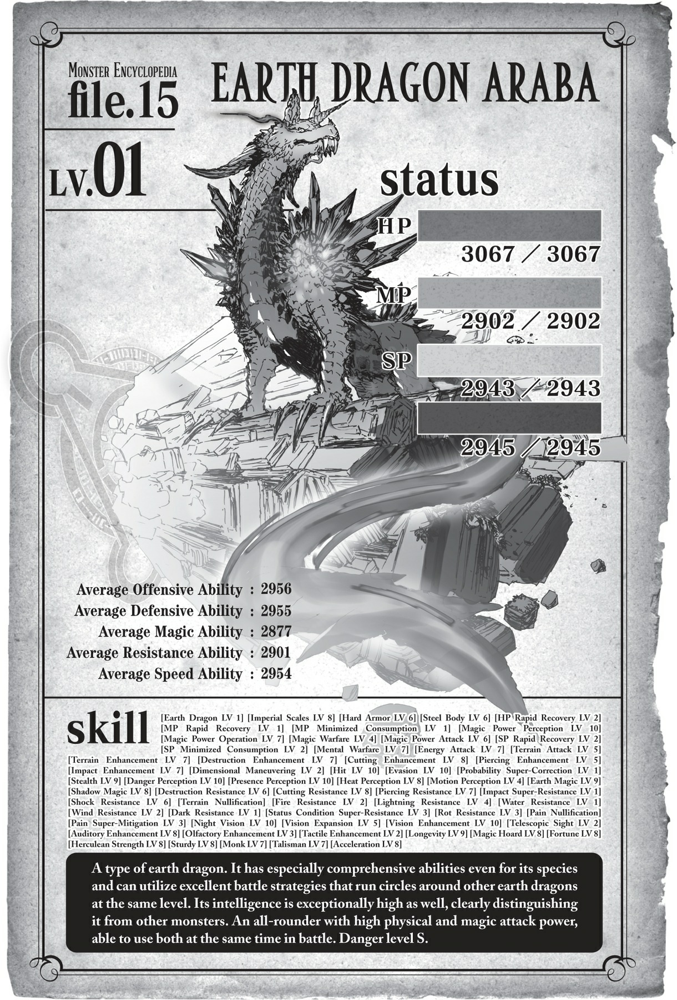
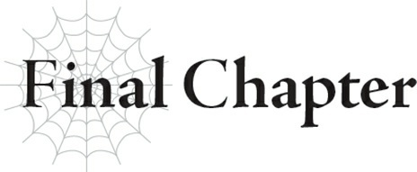

# Đoạn phụ: Hồi ức của Ma Vương về loài Địa Long

*(THE DEMON LORD’S MEMORIES OF THE EARTH DRAGON)*

---

### --- TRANG 247 ---

“Balto, ngươi từng chạm trán rồng bao giờ chưa?”

Câu hỏi đột ngột này khiến tôi bất giác nghiêng đầu thắc mắc ngay cả khi cất tiếng trả lời.

“Tôi chưa từng. Phi long thì rồi, nhưng rồng thì chưa.”

“Đúng thế, dĩ nhiên rồi.”

Ma Vương có vẻ hài lòng với câu trả lời của tôi.

Ngồi ngả ngớn trên ghế với hai chân gác lên bàn, cô ta hoàn toàn không có lấy một chút dáng vẻ thanh lịch nào.

Nhưng tôi hoài nghi liệu có kẻ nào còn sống trên đời dám mở miệng chỉnh đốn người này không, thế nên tôi chỉ đành nhắm mắt làm ngơ.

White ngồi lặng lẽ ở một góc phòng.

Không giống như Ma Vương, cô ta cư xử rất đúng mực. Nhưng bản chất kỳ dị vốn có kết hợp với tư thế ngồi hoàn hảo đó chỉ càng khiến cô ta trông bí ẩn hơn bội phần.

“Có chuyện gì khiến ngài đột nhiên hỏi vậy sao, Ma Vương đại nhân?”

Ngay khi vừa dứt lời, tôi đã lập tức hối hận.

Đây đâu phải lần đầu cô ta đột ngột hỏi một câu không đầu không đuôi như thế.

Tại sao tôi lại đi hỏi làm gì, trong khi bản thân đang muốn kết thúc cuộc trò chuyện này càng sớm càng tốt chứ?

“Hửm? Ồ, ta chỉ đang nghĩ ngợi chút về quá khứ thôi mà, heh. Thực ra ta từng đấu với Địa Long này nọ rồi đấy.”

Thật lòng mà nói, chuyện đó không khiến tôi ngạc nhiên cho lắm.

Rồng là loài đặc biệt tách biệt, ngay cả trong số các loài quái vật.

Thông thường, chỉ nhìn thấy một con thôi đã là cực kỳ hiếm hoi rồi, vậy mà Ma Vương lại thản nhiên nói rằng cô ta từng chiến đấu với một con.

### --- TRANG 248 ---

Nếu là ai khác nói câu đó thì thật hoang đường, nhưng với cô ta, chuyện đó lại có khả năng xảy ra cao đến mức đáng sợ.

“Địa Long là một lũ khá kiêu hãnh,” Ma Vương nhận xét.

“Lũ đó chắc chắn mang dòng máu samurai chảy trong huyết quản.”

Với ngài thì thế nào cũng được, nhưng chính xác thì samurai là cái gì?

Tôi tò mò thật đấy, nhưng nếu tôi hỏi câu đó, cuộc tán gẫu này sẽ chỉ càng kéo dài thêm.

Đối với tôi, chỉ cần nói chuyện với Ma Vương thôi cũng đủ để bị giảm thọ rồi.

Tôi phải kiềm chế bản thân không được hỏi những câu làm kéo dài cuộc đối thoại.

“Ta từng gặp rất nhiều loài rồng khác nhau, nhưng nghĩ lại thì Địa Long có lẽ là lũ đàng hoàng nhất.”

Ma Vương lại thản nhiên ném ra thêm một tuyên bố chấn động nữa.

Rất nhiều loài rồng khác nhau.

Có thật không vậy?

Điều đáng sợ là, một khi lời đó đã thốt ra từ miệng Ma Vương, thì rất có thể đó là sự thật.

Một lần nữa, tôi lại thấy hiếu kỳ, nhưng tốt nhất là không nên hỏi.

“Ối, xin lỗi nha. Ta lại lảm nhảm lan man rồi.”

“Dạ không sao.”

“Thế, ta có thể tin tưởng giao việc chuẩn bị cho cuộc tấn công vào làng Elf cho ngươi không?”

“Xin tuân lệnh, thưa Ma Vương đại nhân.”

### --- TRANG 249 ---

---

