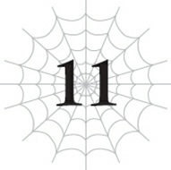

# Đoạn phụ: Kẻ thống trị và em gái

*(The Ruler and the Younger Sister)*

---

### --- TRANG 218 ---

“Khỏe chứ, cô em gái nhỏ?”

“Cô muốn gì?”

“Tôi chỉ đến để xem tình hình của cô thôi mà, dĩ nhiên rồi.”

“Xem xong rồi đấy. Phiền cô rời đi cho.”

“Ôi dào, làm gì mà lạnh lùng thế. Chúng ta không thể trò chuyện một lát trước đã sao?”

“Tôi không có gì để nói với cô cả.”

“Thế sao? Vậy mà tôi cứ ngỡ cô đang cần được an ủi, sau khi khóc lóc thảm thiết về việc giả vờ bị tẩy não để phản bội người anh trai yêu dấu của mình chứ.”

“Hừm! Đó không phải việc của cô. Cô cũng chỉ là chó săn của thần thôi!”

“Ồ? Chẳng phải giờ cô cũng cùng hội cùng thuyền với tôi sao? Tôi tin đó là lý do cô phản bội anh trai mình đấy.”

“Không đúng! Tôi không hề phản bội anh ấy!”

“Nhưng cô đang tuân lệnh Chủ nhân của chúng ta. Điều đó biến cô thành kẻ thù của toàn nhân loại rồi đấy, cô bé thân mến ạ.”

“Ư...!”

“Ái chà, chính là nó. Vẻ mặt đó. Đó là thứ tôi muốn thấy nhất đấy.”

“Cô thật tồi tệ.”

“Tôi xin nhận nó như một lời khen nhé, cảm ơn nhiều.”

---

