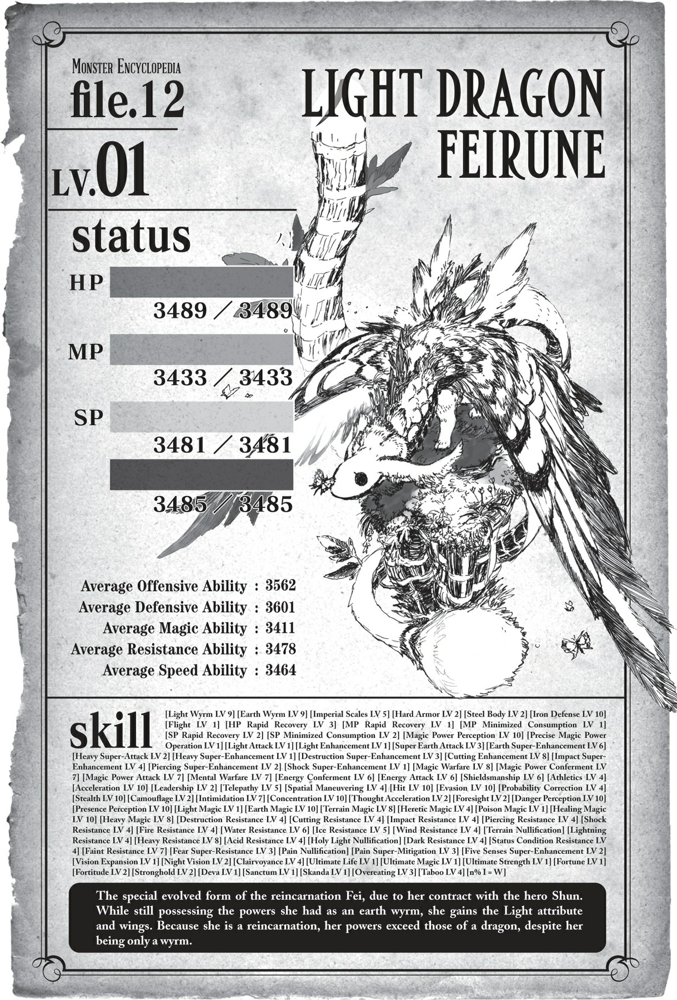

# Chương S7: Trận chiến tại thủ đô

*(Battle in the Capital)*

---

### --- TRANG 140 ---

Fei bay lượn trên bầu trời hoàng đô, cõng chúng tôi trên lưng.

Đường bay của cô ấy ổn định đến ngạc nhiên đối với một kẻ chỉ mới vừa tiến hóa và nhận được kỹ năng này.

Dù có ba người cưỡi trên lưng, cảm giác vẫn vô cùng an toàn.

Tuy nhiên, ở tốc độ này, bạn chắc chắn sẽ bị hất văng ra ngoài nếu không bám thật chặt.

Nghĩ đến việc cô ấy thậm chí còn chưa có cả kỹ năng [Phi hành Tốc độ cao], tôi thấy khá kinh hãi cho tương lai sau này.

Có lẽ tôi sẽ hoàn toàn không thể cưỡi cô ấy được nữa một khi cô ấy có được kỹ năng đó.

“Kìa rồi.”

Nheo mắt trước những luồng gió lốc mạnh mẽ, tôi nhìn về phía trước.

Ở đằng kia, tôi có thể nhìn thấy tòa lâu đài hiện ra từ bóng tối của màn đêm.

Anh Leston và những người khác nhiều khả năng đang bị giam cầm trong đó.

Cùng Fei tiếp cận lâu đài từ trên không, sau đó đột nhập.

Giải cứu đồng minh của chúng tôi rồi tẩu thoát.

Chiến thuật của chúng tôi đơn giản đến mức không thực sự được gọi là một kế hoạch, nhưng thực tế là chúng tôi không còn lựa chọn nào khác.

Nếu muốn thành công, chúng tôi sẽ cần tốc độ và sức mạnh để đột phá qua.

Về mặt lực lượng chiến đấu thì chúng tôi sẽ ổn thôi.

Có tôi là Anh hùng; anh Hyrince, người đã liên tục chiến đấu sát cánh cùng hoàng huynh Julius; và Katia, người không phải ngẫu nhiên mà được mệnh danh là thần đồng.

Thành thật mà nói, có lẽ không có nhiều người có thể ngăn cản ba người chúng tôi.

Theo thông tin của chúng tôi, Hugo và Sue đã rời lâu đài bằng ma pháp [Dịch chuyển].

Nếu lúc này Hugo đã quay trở lại Đế quốc Renxandt, thì sẽ không còn ai đủ mạnh để cản đường chúng tôi nữa.

### --- TRANG 141 ---

Những người duy nhất tôi lo lắng là Sophia và hai chiến binh mặc đồ đen kia.

Nếu cô gái bí ẩn đó có ở đây, chúng tôi có thể sẽ gặp rắc rối lớn.

Tôi chắc chắn đã có một linh cảm vô cùng tồi tệ về cô gái đó.

Không chỉ vì ma pháp không có tác dụng với cô ta. Có điều gì đó kỳ quái đến mức đáng ngại ở cô ta.

Đến mức cô ta thậm chí có thể còn nguy hiểm hơn cả Hugo.

Nếu cô ta vẫn ở đây, thì một trận chiến gian nan có lẽ đang đợi chúng tôi ở phía trước.

Nhưng đó chỉ là một chữ “nếu” lớn.

Tôi không biết tại sao mình không thể rũ bỏ được cảm giác lo âu này, bất chấp lực lượng ấn tượng của nhóm chúng tôi.

“Á! Fei! Cẩn thận!”

Như thể để xác nhận nỗi sợ hãi của tôi, có thứ gì đó đang lao nhanh về phía chúng tôi với tốc độ chóng mặt.

Fei vội vã né tránh, những chuyển động đột ngột của cô ấy khiến chúng tôi bị lắc lư dữ dội.

“Mọi người bám chắc vào!”

Nhận được tin nhắn Thần giao cách cảm của cô ấy, chúng tôi bám chặt lấy lưng Fei.

Đồng thời, cơ thể Fei nghiêng mạnh sang một bên.

Vật thể đang bay sượt qua đúng vị trí chúng tôi vừa ở đó chỉ vài tích tắc trước.

“Ma pháp tấn công tầm xa sao?!”

Thứ vừa bay qua là một đòn tấn công ma pháp giống như tia laser, để lại một vệt sáng dài phía sau.

“Không thể nào! Một đòn tấn công ma pháp có thể vươn tới độ cao này sao?!”

Anh Hyrince thốt lên kinh ngạc.

Chúng tôi đang bay ở độ cao rất lớn.

Tôi không biết chính xác là bao nhiêu, nhưng chắc chắn phải cách mặt đất hơn nửa dặm.

Lẽ ra từ dưới đó khó có thể nhìn thấy chúng tôi.

Đó là lý do tại sao chúng tôi lên kế hoạch đột nhập từ trên không vào ban đêm.

Thế mà, có kẻ đang bắn tỉa chúng tôi với độ chính xác đến phi lý.

“Đừng buông tay đấy!”

Fei lách nhẹ sang trái rồi sang phải, vẫn vững vàng tiến về phía trước.

Những chùm sáng quét sát sạt bên người Fei, bám đuổi theo tốc độ cao của cô ấy.

Cô ấy đang né tránh với ít chuyển động nhất có thể để tránh hất văng chúng tôi xuống, nhưng những đòn tấn công bay sượt qua ở cự ly gần đến đáng sợ.

### --- TRANG 142 ---

Độ chính xác cấp độ này là điều bất khả thi, bất kể tay thiện xạ đó có giỏi đến đâu đi chăng nữa.

Tỷ lệ trúng của một phép thuật sẽ càng thấp khi mục tiêu càng ở xa.

Tôi chắc chắn không thể bắn trúng từ khoảng cách hơn nửa dặm.

Chưa nói đến một mục tiêu đang di động như Fei trong điều kiện tầm nhìn hạn chế của ban đêm.

Thế mà, các động tác né tránh của Fei ngày càng trở nên dữ dội hơn.

Cô ấy không còn tâm trí đâu mà lo lắng cho chúng tôi nữa rồi.

Nói cách khác, nếu cô ấy không né tránh bằng tất cả sức lực của mình, cô ấy sẽ bị bắn trúng.

Một phần có thể là do chúng tôi đang ngày càng đến gần hơn, nhưng đây vẫn là một tay súng bắn tỉa chính xác đến mức không tưởng.

“Shun!” Anh Hyrince hét lên. “Chúng ta phải rút lui thôi! Nếu đối phương có một pháp sư mạnh đến mức này và biết chúng ta đang ở đây, thì chiến thuật của chúng ta đã thất bại hoàn toàn rồi!”

Đúng vậy thật, kế hoạch ban đầu của chúng tôi là đột nhập mà không bị phát hiện, rồi nếu bị phát hiện ở bên trong, chúng tôi sẽ rút lui với tốc độ tối đa khi kẻ địch vẫn còn đang bối rối.

Nhưng dự tính đó đã bay biến ngay khi chúng tôi gặp phải đòn tấn công phủ đầu này.

“Không, chúng ta phải đột phá qua thôi!”

Nếu rút lui ở đây, điều đó đồng nghĩa với việc anh Leston và những người khác sẽ phải chết.

Không đời nào tôi có thể để chuyện đó xảy ra.

Nếu bây giờ chúng tôi cụp đuôi bỏ chạy, tôi sẽ không bao giờ có thể tự gọi mình là Anh hùng nữa.

“Nhưng mà!”

“Hoàng huynh Julius sẽ không bao giờ bỏ cuộc trong một tình huống thế này! Tôi nói có sai không?”

Có lẽ nói như vậy với anh Hyrince là không công bằng.

Nhưng chúng tôi thực sự không thể rút lui vào lúc này.

“......Được rồi.”

Quả nhiên, anh Hyrince đã nhượng bộ.

Nhưng điều đó không giải quyết được vấn đề chính của chúng tôi.

Kẻ bắn tỉa vẫn đang tiếp tục tấn công chúng tôi, và vì bọn chúng đã biết chúng tôi ở đây, chúng tôi phải giả định rằng bọn chúng đã chuẩn bị đầy đủ để chặn đánh chúng tôi.

Trong khi chúng tôi lao đi vun vút giữa không trung, tôi kích hoạt [Thiên Lý Nhãn] để tìm kiếm nguồn gốc của những chùm sáng.

Pháp sư đó đang ở trên đỉnh bức tường thành của lâu đài.

### --- TRANG 143 ---

Ông ta chính là kiểu ông lão mà bạn sẽ hình dung ngay khi nghe thấy từ “pháp sư”.

“Fei, đưa chúng ta lại gần lâu đài hơn đi!”

“Rõ!”

Với [Thiên Lý Nhãn], tôi tiếp tục quan sát lão pháp sư.

Những phát bắn ma pháp được bắn ra đều đặn từ cây trượng của ông ta.

Nhưng ông ta thậm chí còn không hề đổ một giọt mồ hôi nào. Bất chấp uy lực khủng khiếp của các ma pháp, ông ta trông cứ như thể đang thi triển những ma pháp sơ cấp cơ bản nhất.

“Chết tiệt!”

Tôi và anh Hyrince đồng thời kích hoạt các kết giới phòng ngự theo tiếng thét hoảng hốt của Fei.

Kỹ năng đó gọi là [Phi Long Mạc], một kỹ năng giảm thiểu tác động của ma pháp tương tự như kỹ năng vảy đặc trưng của phi long và loài rồng.

Kỹ năng này rất tiện lợi, tạo ra một loại màng mỏng thậm chí có thể chống đỡ được một số đòn tấn công vật lý.

Tuy nhiên, bạn phải tiêu diệt một con phi long mới có thể nhận được nó, và nó cũng tốn một lượng điểm kỹ năng không hề nhỏ.

Trên hết, hiệu quả của nó yếu hơn so với [Phi Long Lân] nguyên bản, và tốn rất nhiều MP để kích hoạt, nên sự tiện lợi của nó đi kèm với cái giá rất đắt.

Lý do duy nhất tôi không sử dụng nó suốt thời gian qua là vì MP của tôi sẽ cạn kiệt rất nhanh.

Cả tôi và anh Hyrince đều sử dụng [Phi Long Lân], còn Fei thì sử dụng [Long Lân].

Với mức phòng thủ cỡ đó, chúng tôi sẽ ổn thôi ngay cả khi trúng một hoặc hai đòn.

Hoặc tôi đã nghĩ thế.

“Ư hự!”

Tôi cảm nhận được máu chảy dài trên má mình, đi kèm với đó là một luồng ớn lạnh chạy dọc sống lưng.

Chùm sáng đã xuyên thủng cả ba lớp phòng ngự và suýt chút nữa đã găm thẳng vào mặt tôi.

Tôi đã kịp né tránh bằng cách giật mạnh đầu sang một bên, nhưng nó vẫn sượt qua má tôi một chút.

Nó không gây ra nhiều sát thương vật lý.

Kỹ năng [Tự hồi phục HP] của tôi lập tức kích hoạt, làm lành vết thương.

Tuy nhiên, điều đó không thay đổi được sự thật là nó đã suýt bắn trúng tôi.

Nó xuyên qua tất cả các lớp phòng ngự của chúng tôi, hoàn toàn phớt lờ kháng tính của tôi.

### --- TRANG 144 ---

Nó không chỉ đơn thuần là một ma pháp ở khoảng cách xa đến không tưởng.

Đòn tấn công đó chắc chắn có đủ sức mạnh để giết chết tôi.

Với các chỉ số được gia tăng nhờ danh hiệu Anh hùng, một đòn trúng trực diện có lẽ sẽ không lấy mạng tôi ngay lập tức.

Nhưng còn những người khác thì sao?

Tôi chưa từng nghĩ mình lại sớm hối hận vì đã không nghe theo lời khuyên rút lui của anh Hyrince đến thế.

“Shun! Cậu chỉ cần lo cho bản thân mình thôi! Anh sẽ bảo vệ tiểu thư!”

Lời nói đáng tin cậy của anh Hyrince làm tan biến nỗi sợ hãi trong tôi.

Phải rồi. Anh Hyrince là một người phòng thủ đầy năng lực đã bảo vệ anh trai tôi suốt nhiều năm.

Nếu anh Hyrince nói anh ấy sẽ bảo vệ cô ấy, tôi chắc chắn anh ấy sẽ làm được.

Vì vậy, tôi sẽ tin tưởng anh Hyrince và làm bất cứ điều gì có thể.

“Fei, lao thẳng về phía trước đi!”

“Cái gì cơ?!”

Chúng tôi vẫn còn cách lâu đài một khoảng.

Khoảng cách đang dần thu hẹp, nhưng nếu chúng tôi cứ tiếp tục vừa né tránh vừa tiến lên, cuối cùng chúng tôi sẽ chạm giới hạn.

Độ chính xác của lão pháp sư cao hơn khả năng né tránh của Fei.

Chúng tôi có thể tạm thời xoay xở ở khoảng cách hiện tại này, nhưng càng đến gần, việc né tránh các đòn tấn công càng trở nên khó khăn hơn.

Trong trường hợp đó, lựa chọn duy nhất của chúng tôi là hoàn toàn từ bỏ việc né tránh ngay từ đầu.

“Ý cậu là sao khi bảo lao thẳng về phía trước chứ?!”

“Tớ sẽ lo liệu chuyện đó. Cứ tin tớ và lao lên đi!”

Fei ngập ngừng trong giây lát, rồi hạ quyết tâm và tăng tốc lao về phía trước.

“Đừng có đổ lỗi cho tớ nếu chuyện này khiến tất cả chúng ta mất mạng đấy nhé!”

Vận tốc của chúng tôi tăng lên nhanh chóng.

Cho đến tận bây giờ tôi mới nhận ra, nhưng có vẻ như Fei thực sự chưa quen với việc bay lượn, vì cô ấy chưa từng rèn luyện kỹ năng này chút nào.

Rõ ràng là bay thẳng còn khó hơn cả việc né tránh các đòn tấn công bằng chùm sáng.

Tốc độ của cô ấy nhanh hơn vô số lần so với khi cô ấy né tránh xung quanh trước đó.

Một chùm sáng khác lại bắn về phía chúng tôi.

Tôi kích hoạt phép thuật mà mình đã chuẩn bị sẵn.

Một trong những ma pháp của [Thánh Quang Ma Pháp], [Khiên Gương].

### --- TRANG 145 ---

Đó là một phép thuật phản đòn giúp đẩy lùi bất kỳ cuộc tấn công nào.

Một tấm ánh sáng trắng mỏng xuất hiện trước chùm sáng đang lao tới, chùm sáng va vào tấm chắn và bật ra theo một hướng khác.

“Á!”

Fei ré lên một tiếng khi chứng kiến cảnh [Khiên Gương] và chùm sáng va chạm ngay trước mắt mình.

Thông thường, phép thuật này đáng lẽ phải phản ngược đòn tấn công về phía đối thủ, nhưng rõ ràng nó chỉ có thể làm chệch hướng chùm sáng do uy lực quá lớn của đòn đánh.

Tôi và anh Hyrince vẫn đang duy trì các kết giới của mình, nhưng ngay cả như thế, tôi cũng chỉ có thể làm lệch hướng đòn tấn công.

Quả là một sức mạnh khủng khiếp.

Và giờ chúng tôi đang lao thẳng về phía pháp sư đang nắm giữ nó.

Chúng tôi không có cơ hội chiến thắng trong một trận chiến tầm xa.

Nếu không thể tiếp cận và ép đối phương vào thế cận chiến, chúng tôi sẽ bị trúng loại ma pháp đó ở cự ly trực diện.

Một chùm sáng khác lại lao tới, và tôi cản nó bằng cách tương tự.

Khi chúng tôi càng đến gần, sức nặng của các đòn tấn công va vào [Khiên Gương] của tôi càng tăng lên tương ứng.

Mỗi lần như vậy, tôi lại gia cố tấm khiên bằng một lượng MP mới, nhưng tôi có thể nhận ra nó sẽ không trụ được lâu nếu những đòn tấn công này cứ tiếp tục lao tới.

Bất chấp các đòn tấn công dồn dập không ngừng nghỉ, MP của lão pháp sư vẫn không có dấu hiệu cạn kiệt.

Thú thật, tôi rất muốn mắng cho lão già này một trận.

Nhưng ngay cả ma pháp mạnh mẽ và lượng MP khổng lồ đó vẫn có thể bị đánh bại nếu chúng tôi có thể tiếp cận đủ gần để ngăn ông ta thi triển ma pháp.

Và cơ hội đó đang hiển hiện ngay trước mắt tôi.

Theo nghĩa đen mà nói là như vậy.

Khoảng cách giữa chúng tôi và lão pháp sư hiện tại đã gần đến mức tôi không cần dùng đến [Thiên Lý Nhãn] cũng có thể nhìn thấy ông ta.

Ngay khi chỉ còn cách vài chục feet, tôi liền nhảy khỏi lưng Fei.

“Cái—?!”

Tiếng kêu thất thanh đầy kinh ngạc của Fei truyền đến tôi qua Thần giao cách cảm, nhưng tiếng nổ lớn của chùm sáng ma pháp va chạm vào [Khiên Gương] phía trước đã lấn át nó.

Vì tôi đã rời xa anh Hyrince và Fei, khả năng phòng ngự ma pháp của tôi đã bị giảm sút.

### --- TRANG 146 ---

Dẫu vậy, tôi vẫn dồn hết sức mạnh vào [Khiên Gương], đánh bật chùm sáng đi.

Sau đó, tôi mượn lực rơi tự do, vung kiếm chém xuống lão pháp sư.

“Hừm. Chà, ta cho là đòn vừa rồi cũng xem như đạt yêu cầu đấy.”

Tôi nghe thấy một giọng nói...

...nhưng nó lại phát ra từ bên cạnh tôi.

Đường kiếm của tôi chỉ chém vào không khí, và khi tôi quay người về phía nguồn phát ra giọng nói, tôi thấy lão pháp sư bằng cách nào đó đã di chuyển ra xa vài feet.

Đó là một ảo ảnh hay là thuật [Dịch chuyển] bằng [Ma pháp Không gian] quý hiếm?

Tôi không thể biết được, nhưng tôi chắc chắn không thể cứ đứng đây mà không phòng thủ.

Nhảy lùi lại sẽ là một quyết định tồi.

Nếu khoảng cách giữa chúng tôi tăng lên, điều đó sẽ mang lại lợi thế cho pháp sư.

Tôi chỉ có nước tiến lên phía trước thôi!

Suy nghĩ được tăng tốc bởi kỹ năng của tôi đưa ra kết luận này chỉ trong một tích tắc, vì vậy tôi quay người bước về phía lão pháp sư.

Thế nhưng, trái với ý muốn của tôi, đôi chân tôi lại bị ép phải lùi lại phía sau.

Bởi vô số ma pháp đang nã vào chúng.

“Hự... Ư!”

Loạt ma pháp dồn dập bắn vào chân tôi với tốc độ như súng liên thanh.

Xét riêng lẻ, những phát bắn này yếu hơn các đòn tấn công tầm xa bắn vào chúng tôi trước đó.

Nhưng số lượng của chúng quá nhiều!

Tôi dùng kiếm và [Khiên Gương] để đánh bật chúng đi, nhưng một vài phát vẫn xuyên qua kết giới găm vào người tôi.

Sát thương của mỗi phát bắn là không cao, nhưng tích tiểu thì thành đại.

Lực tác động đẩy tôi lùi lại một bước xa khỏi lão pháp sư, rồi lại một bước nữa.

“Yaaaah!”

Đột nhiên, anh Hyrince từ trên trời lao xuống giống hệt như tôi đã làm.

Thanh kiếm của anh ấy chém đôi bức tường thành lâu đài bên dưới.

Lần này, tôi nhìn thấy lão già biến mất.

Quay ngoắt người lại, tôi thấy ông ta đang đứng ở phía đối diện so với vị trí chỉ vài khoảnh khắc trước đó.

[Dịch chuyển]. Người ta nói rằng số người có thể sử dụng [Ma pháp Không gian] chỉ có thể đếm trên đầu ngón tay.

### --- TRANG 147 ---

Nó vẫn còn nằm ngoài tầm với của tôi, vậy mà lão pháp sư đáng sợ này lại có thể sử dụng nó một cách tự do.

Tôi và anh Hyrince cùng vào tư thế đối phó với ông ta.

Đồng thời, Fei lượn vòng trở lại, đe dọa lão pháp sư từ trên không trung.

Trên lưng cô ấy là Katia, người đã chuẩn bị sẵn sàng để thi triển ma pháp.

“Chao ôi... Thế này thì quá sức rồi. Các người giỏi lắm, các người thắng rồi. Lão già này rút lui đây.”

Nói đoạn, lão pháp sư dịch chuyển biến mất.

Tôi dò tìm các dấu vết hiện diện của ông ta, nhưng có vẻ như ông ta không dịch chuyển đến bất kỳ nơi nào gần đây.

“Ông ta thực sự rút lui rồi sao?”

“Nói đúng hơn là quyết định thả chúng ta đi thì có.”

Tôi đồng ý với anh Hyrince.

Nếu lão pháp sư đó thực sự dốc toàn lực, tôi không biết liệu chúng tôi có thể chiến thắng hay không, ngay cả khi tất cả cùng lao vào tấn công ông ta một lúc.

“Đó chính là Trưởng lão Ronandt. Pháp sư loài người mạnh nhất còn sống, và cũng là người hướng dẫn ma pháp của Julius.”

Đó chính là sư phục của hoàng huynh Julius sao?

Vị pháp sư mạnh mẽ mà anh Julius thường hay nói là “một kẻ lập dị”...

Ông ta quyết định tha mạng cho chúng tôi vì tôi là em trai của Julius sao?

“Có vẻ như... em vẫn còn một chặng đường dài phải đi.”

Tôi không biết tại sao ông ta lại quyết định để chúng tôi sống.

Nhưng tôi cảm giác như ông ta đã chỉ ra cho tôi thấy rằng luôn có người mạnh hơn mình.

Hugo, cô gái tên Sophia đó, rồi cả cô bé da trắng đã giết chết anh Julius—

—liệu tôi có bao giờ vượt qua được họ không?

“Đi thôi.”

Tôi lắc đầu, đè nén nỗi lo âu đang dâng trào trong lòng.

Fei đáp xuống trên đỉnh tường thành, để Katia leo xuống.

Không có dấu hiệu của bất kỳ ai khác xung quanh.

Nếu không có ai chạy đến xem nguyên nhân của tất cả tiếng ồn vừa rồi, điều đó có lẽ đồng nghĩa với việc có một cái bẫy đang chực chờ chúng tôi.

Nhưng chúng tôi vẫn phải đi tiếp.

“Fei, đợi ở đây nhé. Nếu có chuyện gì xảy ra, tớ sẽ báo cho cậu bằng Thần giao cách cảm.”

“Được rồi.”

Để Fei lại trên bức tường thành, chúng tôi bước vào trong bóng tối của tòa lâu đài.

### --- TRANG 148 ---

