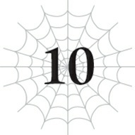

# Chương đặc biệt: Cơn Ác Mộng Mê Cung

*(The Nightmare of the Labyrinth)*

---

### --- TRANG 185 ---

Thật là một thời điểm tồi tệ.

Đó là ấn tượng đầu tiên của tôi khi được thông báo về nhiệm vụ này.

Tôi vừa nhận được lá thư báo tin đứa con của mình đã chào đời, và đang vô cùng háo hức được trở về nhà, thì mệnh lệnh điều động đột ngột ập đến.

Đã không thể ở bên cạnh vợ trong lúc cô ấy vượt cạn, giờ đây tôi thậm chí còn chưa được nhìn mặt con mình trước khi phải lên đường thực hiện nhiệm vụ.

Mặc dù cả đế quốc hiện đang chìm trong bầu không khí lễ hội mừng vị hoàng tử hằng mong đợi cuối cùng đã ra đời.

Kiếm Vương hiện tại vốn hiếm muộn con cái và gần như đã từ bỏ hy vọng, cho đến khi cuối cùng ngài cũng có được một mụn con trai.

Tên của đứa trẻ, Hugo, đã được công bố trên toàn quốc ngay sau khi chào đời. Thật dễ dàng để tưởng tượng Kiếm Vương hẳn đã vui mừng khôn xiết đến nhường nào.

Tôi cũng muốn ăn mừng sự chào đời của con mình theo cách tương tự, nhưng hoàn cảnh hiện tại chỉ khiến lòng tôi thêm trĩu nặng u sầu.

Dĩ nhiên, phần lớn là vì tôi không thể trở về gặp con, nhưng tính chất của nhiệm vụ lần này lại càng khiến trái tim tôi nặng nề hơn gấp bội.

Tôi được lệnh phải thuần hóa con quái vật bí ẩn vừa xuất hiện trong Mê cung Lớn Elroe.

Nếu không thể thuần hóa, tôi phải lập tức tiêu diệt nó.

Đó là chỉ chỉ thị dành cho tôi.

Yêu cầu này đến từ vương quốc nhỏ Ohts, nơi sở hữu một lối vào dẫn vào Mê cung Lớn Elroe.

Mê cung này về cơ bản là phương tiện duy nhất để di chuyển giữa các...

### --- TRANG 186 ---

...lục địa.

Ngoại lệ duy nhất là các điểm dịch chuyển, nhưng những người có thể sử dụng chúng chỉ có các nhân vật hoàng gia quan trọng hoặc những cá nhân cực kỳ giàu có.

Vương quốc Ohts đã cầu cứu đế quốc của chúng tôi do số lượng quái vật trong Mê cung Lớn Elroe bỗng gia tăng một cách kỳ lạ.

Đế quốc lập tức phái quân đội đồn trú gần biên giới nhất tiến vào Vương quốc Ohts.

Đơn vị này chủ yếu gồm con thứ hai và thứ ba của các gia đình quý tộc, nhưng thực lực của họ không hề kém cạnh bất kỳ đội quân nào khác.

Mọi người cứ ngỡ họ sẽ tìm ra nguyên nhân của sự bất thường rồi nhanh chóng khải hoàn trở về.

Và chuyện quả thực đã diễn ra như vậy.

Tuy nhiên, nó lại không theo cách chúng tôi mong đợi.

Đội quân đó thực chất đã tháo chạy trối chết về nước.

Họ chạy trốn khỏi một con quái vật bí ẩn dạng nhện.

Theo báo cáo, chỉ cần nhìn thoáng qua con quái vật là họ biết ngay nó có thể dễ dàng quét sạch toàn bộ bọn họ.

Nguyên nhân của cái gọi là đợt bùng phát quái vật thực ra là do tất cả những sinh vật xung quanh đều bỏ chạy khỏi con nhện này, khiến những con quái vật khác bị đẩy ra khỏi môi trường sống của chúng.

Đội quân điều tra báo cáo rằng con quái vật nằm ngoài khả năng của họ, và cần phải thành lập một lực lượng đặc biệt để đánh bại nó.

Ban đầu, báo cáo này bị chế giễu là hoàn toàn ngu ngốc.

Thế nhưng, bản báo cáo chi tiết bằng văn bản cùng lời chứng thực của người dẫn đường mê cung đi cùng họ đã xác nhận mức độ nguy hiểm của sinh vật này.

Ít nhất, mức độ nguy hiểm của nó là hạng A.

Thế nên nó thậm chí có thể đạt tới hạng S.

Nếu một con quái vật nguy hiểm như vậy thoát ra khỏi mê cung, thiệt hại sẽ là vô cùng thảm khốc.

Nhưng đồng thời, những tin đồn kỳ lạ cũng bắt đầu lan truyền.

Người ta phát hiện một con quái vật nhện cứu giúp con người trong Mê cung Lớn Elroe.

Một điều tra viên địa phương lập tức tìm kiếm nguồn gốc của tin đồn này.

Hóa ra đó là một nhóm mạo hiểm giả tuyên bố rằng họ đã bị một con Baladorado Elroe nguy hiểm tấn công ở Tầng Trên, đúng lúc đó con nhện bất ngờ xuất hiện đánh bại nó, và thậm chí còn chữa trị cho các thành viên đang hấp hối trong tổ đội của họ.

Thật là nhảm nhí hết sức.

### --- TRANG 187 ---

Đó là suy nghĩ của tôi về vấn đề này.

Là một người thuần thú, tôi hiểu biết về quái vật hơn nhiều so với người bình thường.

Quái vật có trí thông minh thấp, nhưng chúng không hoàn toàn vô tri.

Tuy vậy, chỉ có quái vật cấp độ huyền thoại mới có đủ ý chí và trí tuệ để thực hiện một hành động như thế.

Nếu câu chuyện này là thật, con quái vật nhện kia chắc chắn phải là một sinh vật cấp độ huyền thoại, và là một kẻ cực kỳ thông minh.

Không đời nào tôi có thể đánh bại một con thú như vậy.

Thế nhưng, nếu nó thực sự đã cứu người, thì có lẽ nó có thái độ thân thiện với nhân loại.

Phải chăng điều đó có nghĩa là tôi có thể thuần hóa được nó nếu gặp may mắn?

Và giờ đây, lượt của tôi đã đến.

Tôi đúng là chẳng có chút may mắn nào.

Nếu con quái vật nhện này thực sự là một sinh vật cấp huyền thoại như tin đồn, tôi nghi ngờ mình chẳng có lấy một cơ hội chiến thắng.

Ngay cả khi không phải như vậy, nó chắc chắn vẫn là một quái vật ít nhất thuộc hạng A.

Thuần hóa một con quái vật như thế là vô cùng khó khăn.

Để thiết lập giao ước bằng kỹ năng Thuần thú, người ta phải có được sự chấp thuận của quái vật hoặc ép buộc nó ký giao ước bằng sức mạnh thô bạo.

Quái vật hiếm khi chịu tự nguyện quy phục, vì vậy việc đánh bại chúng trước là cách phổ biến nhất.

Nên tôi sẽ phải làm cho con quái vật hạng A này bất động mà không được giết chết nó.

Trong tình thế mà việc chiến thắng thôi đã đủ gian nan, điều kiện này lại càng khiến thử thách nhân lên gấp bội.

Đặc biệt là khi đối đầu với một con quái vật có mức nguy hiểm tối thiểu là hạng A.

Nếu nó ở cấp độ cao hơn, thì ngay cả việc đánh bại nó thôi cũng đã cực kỳ gian khổ rồi.

Tôi cần phải mang theo viện trợ.

Thế nhưng.

“Hừm. Nghĩ đến việc một người như ta lại phải đi thám hiểm mê cung ở cái tuổi này? Thật là xui xẻo.”

Ngay bên cạnh tôi là pháp sư mạnh nhất đế quốc, Trưởng lão Ronandt.

### --- TRANG 188 ---

Ông ấy quả thực là một pháp sư phi thường, nhưng tính cách lại khá khó chiều.

Nói giảm nói tránh thì ông ấy vô cùng tùy hứng và ích kỷ.

Người đàn ông này sẵn sàng phớt lờ mệnh lệnh và mắng nhiếc những người xung quanh.

“Trưởng lão Ronandt. Nếu con quái vật này từ hạng S trở lên, chúng tôi sẽ rất cần đến sức mạnh của ngài. Xin ngài hãy kiên nhẫn chịu đựng một chút.”

“Ta biết chứ. Dù chuyện gì xảy ra, ta cũng sẽ giải quyết nó một cách dễ dàng. Hãy coi như sự an toàn của ngươi đã được đảm bảo.”

Ông ta thường khá vui vẻ và hài hước, nhưng vấn đề là thái độ đó không hề thay đổi ngay cả khi ở trên chiến trường.

Dù vậy, không thể phủ nhận thực lực của ông.

Ông được mệnh danh là pháp sư loài người mạnh nhất còn sống và sở hữu sức mạnh đủ để chứng minh cho danh xưng đó.

Tổ đội của chúng tôi cho nhiệm vụ này gồm có tôi, Trưởng lão Ronandt, ba mươi chiến binh từ đế quốc và bốn người dẫn đường.

Tôi đã muốn đưa người dẫn đường mê cung của đội trước đi cùng, nhưng ông ta thẳng thừng từ chối.

Ông ta nói mình không hề muốn đến gần thứ đó thêm một lần nào nữa.

Thật đáng tiếc, nhưng đành chịu thôi.

Tôi đoán mình nên trân trọng thông tin rằng ngay cả một người dẫn đường mê cung kỳ cựu và dày dạn kinh nghiệm cũng phải khiếp sợ con quái vật này đến thế.

Dù thông tin này chẳng mang lại chút an tâm nào.

Dù thế nào đi nữa, nhiệm vụ đầu tiên của chúng tôi là tìm ra con quái vật.

“Hừm. Đây không phải là nơi xác của con Địa Phi Long được tìm thấy sao?”

“Vâng, đúng là chỗ này.”

“Chà, chẳng có gì ở đây cả.”

Chúng tôi đã đến nơi được gọi là lối đi lớn.

Theo báo cáo, đây là địa điểm cuối cùng chạm trán con quái vật.

Tuy nhiên, dù đã tìm thấy chiếc tổ được cho là chứa xác của con phi long, bên trong lại trống rỗng.

À... nói một cách chính xác thì tôi đoán chẳng còn gì ngoài vài vật thể cứng và những thứ tương tự có vẻ như là tàn tích của một bữa ăn.

Tôi lại quan sát xung quanh đống mạng nhện.

### --- TRANG 189 ---

Đánh giá qua lớp bụi bám trên các sợi tơ và tình trạng bên trong, có khả năng chiếc tổ này đã bị bỏ hoang.

Không có dấu hiệu nào cho thấy nó được sử dụng gần đây.

“Có vẻ nó đã chuyển sang một cái tổ mới.”

“Ta hiểu rồi. Vậy thì ta đoán chúng ta phải lùng sục kỹ lưỡng nơi này thôi.”

“Rõ.”

Chúng tôi dành vài ngày tiếp theo để cẩn thiện tìm kiếm khu vực xung quanh.

Tuy nhiên, chúng tôi vẫn không thấy bất kỳ dấu hiệu nào của con quái vật được nhắc đến.

“Vẫn không có gì.”

“Thật kỳ lạ. Này các người dẫn đường, còn nơi nào trong khu vực này mà chúng ta chưa khám phá không?”

Bốn người dẫn đường suy nghĩ một lúc, cuối cùng một người lên tiếng.

“Có một con đường gần đây dẫn xuống Tầng Trung. Liệu có khả năng con quái vật đã đi xuống đó không?”

“Nhưng quái vật hệ nhện đáng lẽ phải sợ lửa chứ. Đó là lý do trước đây chúng ta chưa từng cân nhắc đến chuyện này.”

Điều đó nghe rất hợp lý.

Khả năng tuy thấp, nhưng không phải là bất khả thi.

Tầng Trung của Mê cung Lớn Elroe được biết đến như một địa ngục tràn ngập dung nham.

Nếu không có trang bị thích hợp, việc thám hiểm nơi đó là không thể.

Và xét theo lượng lương thực cùng sự kiệt sức sau đợt điều tra vài ngày qua, chúng tôi có lẽ nên sớm rút lui.

“Được rồi. Vậy chúng ta sẽ kiểm tra con đường dẫn xuống Tầng Trung này, và nếu vẫn không có gì ở đó, chúng ta sẽ rời khỏi mê cung.”

Những người dẫn đường đưa chúng tôi đến con đường được nhắc đến.

“Cái gì thế này?!”

Người dẫn đường đi đầu bỗng nhiên hét lên một tiếng rồi khựng lại trong một tư thế phi tự nhiên.

“Có chuyện gì thế?”

“Tôi không biết. Cái gì thế này? Tôi không thể cử động được...!”

“Khoan đã!”

Một người dẫn đường khác định tiến lại gần, nhưng Trưởng lão Ronandt đã ngăn anh ta lại.

“Hãy soi đèn lên và nhìn kỹ đi. Cực kỳ khó nhìn, nhưng có tơ nhện giăng ngang lối đi đấy.”

Theo lời của Ronandt, tôi cũng quan sát kỹ hơn.

### --- TRANG 190 ---

Quả nhiên, tôi chỉ có thể lờ mờ nhận ra những sợi tơ thỉnh thoảng phản chiếu ánh sáng.

“Cái gì vậy?”

“Có lẽ chúng ta đã tìm thấy con quái vật của mình rồi.”

Nhìn kỹ hơn, các sợi tơ được sắp xếp theo hình phóng xạ gọn gàng.

Đó chắc chắn là một mạng nhện.

“Ai đó hãy cắt đứt sợi tơ giải thoát cho cô ấy đi.”

Một người lính tiến lên định dùng kiếm để giải cứu người dẫn đường đang bị mắc kẹt.

Tuy nhiên...

“Ồ. Vậy là không thể cắt đứt sao?”

Trưởng lão Ronandt có vẻ ấn tượng.

Thanh kiếm do người lính chém xuống, cũng giống như người dẫn đường, đã dừng lại ngay khi chạm vào sợi tơ.

Người lính cố gắng giật lưỡi kiếm ra, nhưng nó không hề suy chuyển.

“Người dẫn đường, chịu đựng một chút nhé. Chuyện này có thể hơi nóng đấy.”

“Đ-được ạ.”

Trưởng lão Ronandt sử dụng Hỏa Ma pháp.

Ông điều khiển nó một cách điêu luyện để đốt cháy các sợi tơ xung quanh người dẫn đường mà không làm tổn thương cô ấy.

Ít nhất, đó là kế hoạch.

“Hửm? Nó không cháy sao?”

Dù có phải là ma pháp cấp thấp hay không, tơ nhện đáng lẽ phải cực kỳ dễ cháy, thế mà mạng nhện vẫn nguyên vẹn.

“Vậy thì ta sẽ tăng thêm hỏa lực.”

Ngọn lửa bùng lên từ người Trưởng lão Ronandt, bao trùm lấy sợi tơ.

Ánh sáng chói lòa lấp đầy lối đi tối tăm của hang động.

“Ồi, thế thì hơi quá tay rồi.”

Người dẫn đường đã trốn thoát được, mặc dù quần áo bị cháy sém một phần.

Vấn đề là ngọn lửa hiện đã lan rộng dọc theo lối đi.

“Ta lỡ tay mất rồi.”

“Đúng vậy. Nếu con quái vật ở trong đó, nó chắc chắn sẽ nổi giận.”

Trong trường hợp đó, chúng tôi có thể gạt bỏ mọi hy vọng rằng nó có thể thân thiện.

Đồng nghĩa với việc thuần hóa nó sẽ là điều hoàn toàn bất khả thi.

“Nếu may mắn, có lẽ cái mạng nhện này cũng đã bị bỏ hoang rồi.”

“Hy vọng là thế. Vì nó vẫn chưa xuất hiện, có thể hiện tại nó đang đi vắng, hoặc đã ngừng sử dụng cái tổ này hoàn toàn.”

### --- TRANG 191 ---

Được như vậy thì tốt quá.

Nếu những gì các mạo hiểm giả tuyên bố là đúng, con nhện này rõ ràng đi lại tự do xung quanh mê cung.

Và theo lời đồn, nó thậm chí có thể sử dụng [Dịch chuyển].

Tôi chưa bao giờ nghe nói về một con quái vật có khả năng sử dụng [Dịch chuyển], thứ ma pháp mà chỉ có một số ít con người mới làm chủ được.

Nếu điều đó là thật, nghĩa là cho dù hiện tại nó đi vắng, nó vẫn có thể dịch chuyển trở lại đây bất kỳ lúc nào.

“Tất cả chuẩn bị chiến đấu, luôn trong tư thế sẵn sàng,” tôi nói với các binh sĩ. “Chúng ta phải sẵn sàng cho mọi tình huống.”

“Ồ, không cần phải lo lắng quá mức như vậy đâu. Chỉ cần có ta ở đây, ngươi không cần phải sợ bất kỳ con quái vật nào.”

Bình thường, sự tự tin của Trưởng lão Ronandt sẽ mang lại cảm giác an tâm, nhưng trong hoàn cảnh này, nó chỉ giống như một ảo tưởng.

Sợi tơ cháy rụi, và ngọn lửa tắt lịm.

Khi ngọn lửa đã tắt, chúng tôi cẩn thận tiến bước dọc theo con đường.

Tàn tích cháy sém của các sợi tơ bao phủ một khoảng cách khá dài.

“Vậy là nó khó bén lửa, nhưng một khi đã cháy thì lại khá giòn.”

“Vâng, có vẻ là vậy. Lửa dường như đã lan đi khá xa.”

Tiếp tục đi dọc theo con đường có vẻ quá dài để được gọi là một cái tổ, chúng tôi đến một khu vực trống trải rộng lớn.

“Đây là gì thế?”

“Lối vào Tầng Trung,” một người dẫn đường trả lời.

Giờ nghĩ lại mới thấy, không khí ở đây tương đối nóng.

Con đường chúng tôi đang đi có vẻ dốc dần xuống dưới.

“Hửm?”

Có thứ gì đó ở đằng kia, xa hơn phía dưới.

Thật khó để xác định chính xác đó là gì do độ dốc đi xuống, nhưng có vài thứ to lớn đang nằm rải rác xung quanh.

“Mọi người, sẵn sàng chiến đấu.”

Quân lính nhanh chóng vào đội hình và thận trọng tiếp cận.

Tôi lùi lại phía sau cùng Trưởng lão Ronandt và những lính canh, rút một viên Đá Thẩm định từ túi áo ngực ra.

“Ồ. Một viên Đá Thẩm định sao? Lại còn là cấp 8 nữa.”

“Vâng, Thẩm định là thứ không thể thiếu đối với một người triệu hồi. Ngài cũng sử dụng nó chứ, Trưởng lão Ronandt?”

### --- TRANG 192 ---

“Đúng vậy. Ta có kỹ năng này ở cấp 8.”

“Thật vô cùng ấn tượng. Vì thường xuyên sử dụng Đá Thẩm định, tôi đã tích lũy đủ độ thành thục để tự mình đạt cấp 3, nhưng cấp 8 thì quả thực là một đẳng cấp khác biệt.”

“Ta đã nâng cấp nó trong nhiều năm nghiên cứu ma pháp. Chỉ đến tuổi này ta mới cuối cùng đạt tới cấp 8. Có lẽ đối với người thường, việc dành thời gian sử dụng Đá Thẩm định sẽ khôn ngoan hơn là tự mình nâng cấp kỹ năng.”

“Đối với người bình thường thì chắc chắn là vậy rồi. Thế thì, Thẩm định của ngài cho biết điều gì về thứ kia?”

Tôi chỉ tay về phía trước.

Nơi có xác của một con quái vật nhện khổng lồ.

“Có vẻ là xác của một con Taratect Thượng cổ.”

Taratect Thượng cổ.

Một loài quái vật huyền thoại xếp trên hạng S, chỉ kém Taratect Nữ Vương một bậc.

Mức độ nguy hiểm của nó là hạng S.

Và con này đã bị biến thành một cái xác nát bươm.

Không chỉ có vậy, còn có xác của ba con Taratect Vĩ đại gần đó.

Cùng với xác của vô số quái vật hệ Taratect khác, nhiều đến mức không thể đếm xuể.

“Và hãy nhìn kỹ xem. Ngươi có thấy không? Trông như thể nó đã bị ăn dở một phần.”

Tôi đã không chú ý từ khoảng cách này, nhưng rõ ràng Trưởng lão Ronandt thì có.

“Điều đó nghĩa là có thứ gì đó không chỉ đánh bại một con Taratect Thượng cổ, mà còn ăn thịt nó.”

Một làn sóng ớn lạnh chạy dọc sống lưng tôi.

Một sinh vật ăn thịt cả quái vật hạng S?

Liệu một loài thú như vậy có thực sự tồn tại trên đời?

Nếu chúng tôi đụng độ một sinh vật như thế...

...chúng tôi sẽ tiêu tùng.

Ngay cả khi có lực lượng siêu tinh nhuệ cùng vị pháp sư mạnh nhất của nhân loại, không đời nào có ai đánh bại được một con quái vật như vậy.

Chúng tôi nên rút lui ngay bây giờ.

Nhưng quyết định của tôi đã chậm mất một nhịp.

Hiện thân của cơn ác mộng dịch chuyển ngay trước mặt chúng tôi.

Con quái vật nhện xuất hiện trước xác của con Taratect Thượng cổ.

### --- TRANG 193 ---

So với con Taratect Thượng cổ khổng lồ, nó tương đối nhỏ bé.

Toàn thân nó có màu đen, ngoại trừ một hoa văn màu trắng trên lưng.

Đáng sợ thay, hoa văn đó trông giống hệt như một chiếc đầu lâu.

Trong số tám chiếc chân của nó, hai chân trước to hơn những chân khác và thon dần về phía đầu thành hình dạng những chiếc lưỡi hái.

Và tám con mắt màu đỏ của nó đang gườm gườm nhìn thẳng vào chúng tôi.

Cơ thể tôi run rẩy co rúm lại theo bản năng trước cảnh tượng đó.

Tôi có thể thấy những binh sĩ phía trước đang run bần bật bất chấp mệnh lệnh “sẵn sàng cho mọi tình huống.”

Nhưng tôi không thể trách họ.

Làm sao ai đó có thể không run sợ khi một thứ như vậy đột ngột hiện ra trước mặt mình?

Con quái vật trông giống như một chúa tể thống trị mọi thứ xung quanh.

Chỉ nhìn lướt qua nó thôi cũng đủ để khiến người ta run rẩy.

Quả đúng như những gì báo cáo đã mô tả.

Thậm chí không cần dùng Thẩm định, tôi cũng có thể nhận ra ngay lập tức.

Đó không phải là loại quái vật mà những kẻ như chúng tôi có thể làm gì được.

“Ư... ư ư ư?”

Nghe thấy một tiếng rên rỉ kỳ lạ, tôi quay sang bên phải và thấy Trưởng lão Ronandt đang nhìn chằm chằm vào con quái vật với đôi mắt trợn tròn, toàn thân run rẩy dữ dội.

Hóa ra ngay cả ông ta cũng trở thành nạn nhân của nỗi sợ hãi mà con quái vật này mang lại?

Sự kinh hoàng mà sinh vật kia gây ra cho chúng tôi không chỉ do ngoại hình của nó.

Nó chắc chắn phải có một kỹ năng liên quan đến [Uy Áp], nhưng tôi vẫn vô cùng sốc khi ngay cả một người mạnh mẽ như Trưởng lão Ronandt cũng không thể kháng cự nổi.

“Trưởng lão Ronandt?”

“Làm sao... Làm sao có thể như vậy được? Sức mạnh thế này, nguồn ma lực này... Không thể nào. Sinh vật này rốt cuộc là cái gì?”

“Trưởng lão Ronandt!”

“...Phải, phải. Ta xin lỗi.”

“Đã có chuyện gì xảy ra với ngài vậy?”

“Con quái vật đó... nó trông có vẻ thư thả, nhưng nó đang kích hoạt một lượng kỹ năng khổng lồ cùng một lúc. Không thể nào...”

Trưởng lão Ronandt chắc hẳn có thể nhìn thấy các kỹ năng đang hoạt động của con quái vật theo cách mà tôi không thể.

Nhìn cách ông ta lẩm bẩm một mình, ông ta dường như không còn tỉnh táo nữa.

### --- TRANG 194 ---

Nó không giống như tác động từ trạng thái sợ hãi, nhưng đây vẫn không phải là điềm lành.

Bởi vì con quái vật nhện, vốn trông khá bình tĩnh ban đầu, bắt đầu lộ rõ vẻ giận dữ.

Tệ rồi đây. Nó đang chuẩn bị chiến đấu.

Và các binh sĩ, cảm nhận được cơn giận đó, đã tự động thủ thế vũ khí.

Vô ích thôi. Đến nước này, tôi không thấy bất kỳ hy vọng kết bạn nào với sinh vật này nữa.

Đột nhiên, một cảm giác khó chịu kỳ lạ bao trùm lấy tôi.

Đây là... Thẩm định sao?

Nhưng là ai?

Liệu con quái vật đó đang Thẩm định chúng tôi?!

Làm sao có thể như vậy được?!

Tôi chưa từng nghe nói về một con quái vật biết sử dụng Thẩm định.

Để xác nhận, tôi sử dụng viên Đá Thẩm định của mình.

Nhưng kết quả Thẩm định khiến tôi chết lặng.

Chỉ số cao đến mức phi lý.

Một lượng kỹ năng khổng lồ.

Chúng tôi không có lấy một cơ hội đánh bại một thứ như thế này.

“Cái gì?!” Trưởng lão Ronandt hét lên.

Có vẻ như ông ta đã kích hoạt Thẩm định cùng lúc với tôi.

Miệng ông ta há hốc vì kinh ngạc.

“C-Cực đỉnh Thần bí?!”

Trưởng lão Ronandt dường như đặc biệt kinh ngạc trước một trong những kỹ năng mà con quái vật sở hữu, loài “Ede Saine”.

Bản thân tôi chưa bao giờ nhìn thấy hay nghe nói về kỹ năng/chủng tộc đó.

Nhưng đó vẫn chưa phải là tất cả.

Con Ede Saine này có nhiều kỹ năng tôi chưa từng thấy trước đây.

Thêm vào đó, có vài kỹ năng tôi biết nhưng chúng lại ở cấp độ cực cao.

Và sự kinh ngạc của tôi vẫn chưa dừng lại ở đó.

Chuyện xảy ra khi tôi mới xem được một phần danh sách kỹ năng.

Đột nhiên, kết quả Thẩm định biến mất, thay thế bằng dòng chữ `<Thẩm định bị chặn>`.

Thẩm định... bị chặn?

Tôi chưa từng nghe về chuyện như vậy bao giờ.

“Kh-khoan đã! Cho ta xem thêm nữa, thêm nữa đi!”

“Trưởng lão Ronandt!” Tôi khẩn thiết hét lên. “Làm ơn, ngài hãy tỉnh táo lại...”

### --- TRANG 195 ---

“...đi!”

Vị pháp sư dường như đã phát điên.

Đồng thời, tôi hét lớn với quân lính.

“Rút lui! Chúng ta không thể đánh bại thứ này đâu! Rút lui ngay lập tức!”

Nhưng tiếng hét đã quá muộn.

Tám người lính ở hàng đầu tiên đồng loạt gục xuống.

Tôi không biết chuyện gì đã xảy ra với họ.

Con Ede Saine dường như không làm gì cả.

Nó chỉ đứng yên đó, nhìn chằm chằm vào chúng tôi.

Thế mà, bấy nhiêu đó là đủ để khiến tám người đàn ông gục ngã không một tiếng động trong chớp mắt.

Loại kỹ năng gì thế này?

Vì tôi không thể xem hết toàn bộ kỹ năng của sinh vật này, tôi không biết điều gì đang gây ra chuyện đó.

Nhưng dù thế nào đi nữa, con quái vật không dừng lại ở đó.

Con Ede Saine bắt đầu làm một hành động kỳ lạ.

Trông như thể nó đang lột da của chính mình.

Cảnh tượng kỳ dị này khiến các binh sĩ kinh khiếp.

Một trong những người lính, bị nỗi sợ hãi lấn át khi thấy đồng đội ngã xuống, đã lao thẳng vào con Ede Saine.

Thế nhưng thanh kiếm của anh ta chưa bao giờ chạm tới sinh vật đó, thay vào đó nó bị gãy đôi trước một bức tường đất nhô lên từ mặt đất.

Khoan đã. Từ những gì tôi thấy trong danh sách kỹ năng, con quái vật dường như không hề có [Thổ Ma pháp].

Có một loại ma pháp tôi chưa từng nghe tên là [Ma pháp Vực sâu], nhưng tôi tin là mình đã xem qua tất cả các kỹ năng ma pháp khác của nó.

Và [Thổ Ma pháp] chắc chắn không nằm trong số đó.

“Cái gì?!” Ronandt gầm lên. “Nó tự tạo ra ma pháp từ con số không mà không cần sử dụng kỹ năng sao?!”

Tôi không tin vào tai mình nữa.

Chuyện đó thực sự có thể sao?

Ngay cả vị pháp sư loài người mạnh nhất còn sống cũng rõ ràng đang hoang mang.

Không, đây không thể là việc bình thường có thể làm được.

Đây không phải là lúc để giữ kẽ kỹ năng nữa.

Tôi phải tung ra tất cả các quân bài tẩy của mình nếu muốn có hy vọng sống sót.

Ngay cả khi đó, tôi cũng sẽ tự nhận là mình may mắn nếu có thể thoát khỏi đây.

### --- TRANG 196 ---

Triệu Hồi. Kỹ năng [Triệu Hồi] của tôi đang ở cấp 4.

Nói cách khác, tôi có thể triệu hồi tổng cộng bốn con quái vật đến nơi này.

Hy vọng tốt nhất của tôi là sử dụng các quái vật này để câu giờ cho các binh sĩ chạy trốn.

Nhưng tôi có thể cầm chân một con thú như vậy được bao lâu đây?

Các quái vật triệu hồi của tôi xuất hiện.

Kirekock, một điểu quái.

Rock Turtle, một thạch quy.

Feveroot, một hỏa hổ.

Suiten, một Thủy Phi Long.

Tất cả đều là những quái vật mạnh mẽ mà bình thường tôi sẽ không bao giờ sử dụng một cách khinh suất.

Ta xin lỗi, tất cả các ngươi. Tiến lên!

Khi ra lệnh cho các quái vật triệu hồi tấn công, tôi một lần nữa hét lớn bảo các binh sĩ rút lui.

[Phong Ma pháp] của Kirekock đánh trúng trực tiếp vào con Ede Saine.

Điều này ban đầu khiến tôi ngạc nhiên, nhưng khi lớp bụi do đòn ma pháp thổi lên tan đi, tôi đã hiểu tại sao.

Con Ede Saine hoàn toàn không hề hấn gì.

Đối với con quái vật đó, ma pháp của Kirekock thậm chí còn không đáng để nó phải né tránh.

Dù vậy, nó vẫn giúp chúng tôi câu được chút thời gian.

Nhờ đòn tấn công dẫn đầu của Kirekock, con Rock Turtle vốn chậm chạp đã tiến được đến hàng tiền tuyến.

Khả năng phòng ngự cực cao của Rock Turtle chính là điểm mạnh của nó.

Với lớp lá chắn đã vào vị trí, ba quái thú còn lại bắt đầu tung ra đòn tấn công.

[Phong Ma pháp] của Kirekock từ trên trời ập xuống, trong khi hơi thở phun nước của Suiten mang đến một luồng hơi nước nóng bỏng.

Feveroot lao vào tấn công ngay sau khi hai đòn đầu tiên trúng mục tiêu.

Tốc độ tuyệt vời và lực tấn công mạnh mẽ của nó được thể hiện rõ ràng khi nó nhảy xổ vào con Ede Saine.

Một ngọn thương bằng đất nhô lên từ mặt đất để chặn đường nó.

Không kịp phản ứng trước sự xuất hiện đột ngột đó, Feveroot bị ngọn thương đâm xuyên người.

Ngay sau đó, Kirekock rơi rụng từ trên không trung xuống.

Nhanh đến mức như thể có thứ gì đó vừa đánh gục nó.

Nó lao sầm xuống đất, phát ra một âm thanh ghê rợn khi lún sâu xuống mặt đất.

Chuyện gì đang xảy ra thế này?

### --- TRANG 197 ---

Cứ như vậy, Kirekock bị nghiền nát bởi một lực lượng vô hình.

Trong khi đó, Suiten vẫn tiếp tục phun nước.

Nhưng con Ede Saine có vẻ hoàn toàn dửng dưng.

Nó chậm rãi quay sang Suiten và bắn ra một câu chú [Phong Ma pháp].

Ban đầu là Thổ, và giờ là Phong sao?!

Khi tôi đang nhìn trong sửng sốt, [Phong Ma pháp] đã thổi bay đòn phun nước cùng với Suiten đi mất.

Chỉ còn lại Rock Turtle.

Nhưng nó không di chuyển. Nó không thể.

Thẩm định nó để xác định nguyên nhân của hành vi kỳ lạ này, tôi phát hiện ra nó hiện đã dính trạng thái bất thường [Tê liệt].

Không chỉ có vậy, tất cả các chỉ số của nó đang giảm xuống nhanh chóng.

Cả HP nữa. Chỉ trong vài khoảnh khắc ngắn ngủi, con Rock Turtle kiên cường đã bị rút cạn thành một cái vỏ rỗng.

Những thú triệu hồi của tôi, những người đã cùng tôi vượt qua biết bao thử thách gian nan, đều đã bị tàn sát sạch sẽ.

Thế nhưng, ngự trị trong tâm trí tôi lúc này không phải là sự đau buồn hay giận dữ.

Mà là nỗi sợ hãi. Thật đáng xấu hổ, và thật có lỗi với những con thú tội nghiệp đã hy sinh vì tôi.

Nhưng dù biết vậy, tôi vẫn không thể chống lại nỗi sợ hãi đang cuộn trào từ sâu thẳm bên trong mình.

Tôi muốn chạy trốn khỏi nơi này ngay lập tức.

Tuy nhiên, với tư cách là chỉ huy của lực lượng, tôi không thể trốn chạy trước khi cấp dưới của mình rút lui.

Các binh sĩ của tôi đã bắt đầu di tản trong khoảng thời gian ngắn ngủi mà các quái thú triệu hồi dùng mạng sống để đánh đổi.

Nhưng vẫn không đủ nhanh.

Họ đã đánh mạnh vào đầu Trưởng lão Ronandt để kéo ông ta tỉnh táo trở lại, và ông ta đã bắt đầu chuẩn bị ma pháp dịch chuyển diện rộng để sơ tán binh lính.

Dù vậy, vẫn cần thêm một chút thời gian nữa để tất cả binh lính rút về trong phạm vi tác dụng của phép [Dịch chuyển].

Chỉ còn lại vài giây ngắn ngủi. Nhưng trong những giây đó, một cơn ác mộng đã mở ra.

[Thổ Ma pháp] và [Phong Ma pháp] bay loạn xạ khắp nơi.

Chúng dường như được bắn ra một cách ngẫu nhiên, thế nhưng mỗi phát bắn lại cướp đi mạng sống của một...

### --- TRANG 198 ---

...người lính.

Những binh sĩ khác đột nhiên gục xuống mà không hề bị trúng bất kỳ đòn đánh nào.

Đó là cùng một kiểu tấn công bí ẩn đã hạ gục Rock Turtle.

Một đòn tấn công có khả năng rút cạn cả lượng HP cực lớn của Rock Turtle chỉ trong tích tắc.

Không thể chống cự nổi dù chỉ trong giây lát, các binh sĩ lần lượt ngã xuống.

Ma pháp bay thẳng về phía Trưởng lão Ronandt khi ông ta đang chuẩn bị ma pháp dịch chuyển.

Biết rằng MP của mình sẽ sớm cạn kiệt, tôi tiếp tục triệu hồi thêm quái vật để làm lá chắn cho Trưởng lão Ronandt.

Các đòn tấn công ma pháp ập tới dồn dập hết đợt này đến đợt khác.

Mỗi lần như vậy, tôi lại triệu hồi thêm một quái vật.

Tôi uống một lọ thuốc phục hồi MP, rồi lại một lọ nữa.

Tôi vừa triệu hồi vừa uống thuốc. MP của tôi dần phục hồi.

Tuy nhiên, lượng tiêu hao lại nhiều hơn lượng phục hồi.

Một câu thần chú, một lần triệu hồi, một câu thần chú, một lần triệu hồi.

Sau vô số lần lặp lại, tôi cuối cùng đã cạn kiệt quái thú để triệu hồi.

Thế nhưng, các đòn tấn công ma pháp vẫn không hề dừng lại.

Trái lại, chúng rõ ràng còn nhiều hơn trước đây.

Khi nhìn xung quanh tìm kiếm câu trả lời, tôi phát hiện ra chỉ còn tôi và Ronandt là hai người duy nhất còn sống sót.

“Trưởng lão Ronandt.”

“Chúng ta không còn lựa chọn nào khác. Ta sẽ ít nhất đưa cả hai chúng ta trở về an toàn.”

Ronandt cố gắng kích hoạt phép [Dịch chuyển], nhưng con Ede Saine đột ngột xuất hiện ngay trước mặt ông ta.

“Trưởng lão Ronandt!”

“Hả?!”

Một ngọn thương đen kịt bắn thẳng về phía ông ta.

Nó mang một lượng ma lực kinh hoàng, khiến những phép [Thổ] và [Phong] trước đó chỉ giống như trò đùa trẻ con.

Và nó hướng thẳng vào Trưởng lão Ronandt.

Ronandt đang quá tập trung vào việc kiến tạo ma pháp của mình nên không thể né tránh.

Còn tôi thì đã dùng hết sạch quái thú triệu hồi, chẳng còn gì để dùng làm khiên chắn.

Mọi chuyện tiếp theo diễn ra trong chớp mắt.

Tôi dùng chính cơ thể mình để chặn ngọn thương đen kịt đó.

Cơ thể tôi như nổ tung ra.

### --- TRANG 199 ---

Ngọn thương đen đâm xuyên qua người tôi rồi tiếp tục tấn công Trưởng lão Ronandt ở phía sau.

Cánh tay phải và một phần hông của Trưởng lão Ronandt bị thổi bay.

Việc tôi lao mình vào đường đạn chắc chắn đã làm lệch quỹ đạo của nó đi một chút.

Trưởng lão Ronandt lộ vẻ đau đớn dữ dội khi ông kích hoạt phép [Dịch chuyển].

Thế giới xung quanh tôi vặn vẹo. Tôi nhắm mắt lại theo bản năng, và khi mở mắt ra, chúng tôi đã không còn ở bên trong mê cung nữa.

“Hả?”

Mọi người xung quanh tụ tập lại trong sự bàng hoàng.

“Ai đó, hãy mang vật phẩm trị liệu hoặc dùng ma pháp trị liệu mau lên,” Trưởng lão Ronandt ra lệnh, khuôn mặt ông méo xệch vì đau đớn.

Đây hẳn là phòng nghiên cứu ma pháp của đế quốc. Ngay lập tức, một bầu không khí hỗn loạn bùng lên xung quanh chúng tôi.

“Ngươi phải ráng chịu đựng thêm một chút nữa.”

Trưởng lão Ronandt sử dụng [Ma pháp Trị liệu] lên tôi.

“Gần một nửa phần thân trên của ngươi đã bị phá hủy hoàn toàn. Ta kinh ngạc là ngươi vẫn còn sống đấy.”

“Hự...”

Tôi cố nói điều gì đó, nhưng tất cả những gì trào ra khỏi miệng chỉ có máu.

Cơ thể tôi bắt đầu phục hồi chậm rãi.

Chỉ số HP của tôi cũng dần thoát khỏi vùng đỏ nguy hiểm.

Khi Trưởng lão Ronandt phớt lờ vết thương của chính mình để chữa trị cho tôi, những trị liệu sư khác đã lao đến điều trị cho ông.

Tôi thở hắt ra một hơi, hoàn toàn kiệt sức.

Đã có quá nhiều sự hy sinh, nhưng chúng tôi đã sống sót.

“Cái danh 'pháp sư loài người mạnh nhất' thì có ích gì chứ? Ta đã không thể làm được gì cả, không một việc gì...”

Khi ý thức của tôi nhạt nhòa dần, giọng nói cay đắng của Ronandt vang vọng đầy khó chịu bên tai tôi.

---

