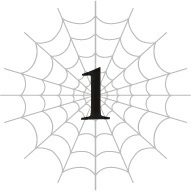

# Chương 1: Bầu Trời Xanh Bao La

*(Clear Blue Sky)*

---

### --- TRANG 9 ---

Nhìn lên phía trên, thứ tôi nhìn thấy không phải trần mê cung quen thuộc mà là bầu trời xanh bao la bất tận.

Khi cúi đầu xuống, thay vì những bức tường đá không màu sắc, xung quanh chỉ toàn là cảnh sắc rực rỡ đầy màu sắc.

À thì, hiện tại trông nó hơi mờ mịt một chút, nhưng mà kệ đi.

Ừ thì, đám mây bụi lơ lửng ngay phía trên đầu khiến tôi hơi khó nhìn rõ mọi thứ.

Nhưng dù thế nào, tôi chưa bao giờ nghĩ thế giới này lại có thể phong phú sắc màu đến thế.

Cảm giác như tôi có thể đổi nghề sang làm nhà thơ ngay lập tức được rồi đấy.

Tôi không nói đến mấy thứ sến sẩm đáng xấu hổ mà lũ trẻ tuổi teen hay viết đâu nhé. Ý tôi là thơ ca đích thực, đầy tính nghệ thuật cơ!

Nói trước cho rõ nhé, tôi không thực sự định làm thế đâu, nhưng tôi dư sức làm được nếu muốn.

Mà thôi, các người phải thông cảm nếu tôi có hơi phấn khích quá đà vào lúc này.

Nhưng coi nào, tôi cuối cùng, cuối cùng, và để tôi nhấn mạnh lại một lần nữa nhé, cuốiiii cùng—

—cũng đã thoát được ra khỏi Mê cung Lớn Elroe rồi!

Chuyện đó thực sự mất kha khá thời gian đấy.

Vì trong mê cung chẳng có sự khác biệt giữa ngày và đêm, tôi không biết chính xác đã bao lâu trôi qua kể từ khi tôi được sinh ra trong đó.

Nhưng có một điều chắc chắn: Đã cả một kỷ nguyên rồi.

Ý tôi là, tôi đã sống ở cái mê cung đó kể từ khi đầu thai sang thế giới này.

Như thế có gọi là lâu không hả?

Đủ lâu để tôi suýt chết nhiều lần đến mức chán không buồn đếm nữa rồi.

Họ nên viết một bản anh hùng ca về cuộc đời loài nhện tuyệt diệu của tôi.

Thề luôn, không đùa đâu.

---

### --- TRANG 10 ---

Mê cung Lớn Elroe là mê cung lớn nhất thế giới, đúng chứ?

Không phải nơi đó có hơi quá khắc nghiệt đối với một con quái vật nhện nhỏ bé, yếu ớt mới chào đời mà không có lấy một lời cảnh báo trước sao?

Ý tôi là, thứ đầu tiên tôi nhìn thấy trong cuộc sống mới này là cảnh anh chị em nhện của mình tàn sát và ăn thịt lẫn nhau ngay trước mắt. Eo ơi.

Và chính bậc sinh thành của chúng tôi cũng tham gia vào cuộc tàn sát đó!

Mẹ thật đáng sợ.

Sau đó, tôi đã phải chật vật chiến đấu với đủ loại quái vật trong mê cung, bị truy đuổi khắp nơi, bị con người phá hủy tổ ấm, trước khi cuối cùng phải chiến đấu với một con rồng thuộc loại mà bạn chỉ có thể tìm thấy ở hầm ngục cuối cùng của một trò chơi.

Ồ, nhưng tôi nghĩ xét về mặt quy mô, Mê cung Lớn Elroe thực chất chính là hầm ngục cuối cùng của thế giới này rồi.

Nhưng dù sao, chính nhờ môi trường khắc nghiệt đó mà tôi mới trở thành con nhện như ngày hôm nay.

Những ngày tháng địa ngục đó là thứ đã giúp tôi mạnh mẽ lên.

Chuẩn luôn. Thực ra, có khi tôi còn mạnh hơn cả những gì mình nghĩ nữa ấy chứ.

Ồ, phải rồi. Ngay lúc này đây, ngay trước mặt tôi là đống đổ nát đầy bụi bặm đang sụp đổ của một pháo đài.

Ban đầu nó vốn chỉ là một pháo đài nhỏ bé, vừa đủ để ngăn cản sự di chuyển của quái vật.

Tôi đoán việc con người muốn thực hiện một số biện pháp để ngăn quái vật thoát khỏi mê cung lớn nhất thế giới là điều dễ hiểu thôi.

Dù sao đây cũng không phải là game, nên chẳng có gì đảm bảo là lũ quái vật sẽ không rời khỏi hầm ngục của chúng cả.

Thế nên, ngay khi tôi trốn thoát khỏi mê cung, thứ đầu tiên tôi nhìn thấy là một bức tường chắn ngang đường.

Nếu quái vật thoát ra ngoài mê cung, chúng sẽ bị mắc kẹt bởi bức tường này, và binh lính đồn trú ở đó sẽ giải quyết chúng.

Ý tưởng đại khái chắc là thế.

Tôi đoán kế hoạch là vậy, bởi vì trong khi tôi đang ngửa mặt lên nhìn bức tường như một đứa ngốc, vài tên lính đã tấn công tôi.

Theo bản năng, tôi phản ứng bằng cách phóng ra một đống ma pháp, và thế là, ừm, kết cục như các người thấy đấy.

Vài mũi tên cũng bay về phía tôi nữa, nên khi né tránh chúng, tôi đã phản xạ bằng cách bắn vài phát Hắc Đạn về phía lũ cung thủ, các người hiểu chứ?

Chỉ có thế thôi mà cả lũ cung thủ lẫn pháo đài đều tan tành thành từng mảnh! Bùm!

---

### --- TRANG 11 ---

Úi chà!

Thôi, giờ là lúc giả vờ ngu ngơ vậy.

Tôi hoàn toàn không biết chuyện gì đã xảy ra ở đây cả.

Cái pháo đài đó tự dưng sụp đổ trong một tai nạn kỳ bí ngẫu nhiên nào đó thôi. Chẳng liên quan gì đến tôi hết nha.

Những nhân chứng khác duy nhất giờ đây đều đã sang thế giới bên kia đầu thai rồi, thế nên đây là một vụ án hoàn hảo. Thời hiệu truy cứu trách nhiệm hình sự chắc chắn sẽ hết lâu lắc trước khi các người tìm ra bất kỳ bằng chứng nào!

Hẹn không gặp lại nhé, lũ ngốc!

Tôi trốn khỏi hiện tr— Ý tôi là, tôi bỏ lại đống đổ nát của pháo đài đằng sau, cố gắng ẩn mình tránh khỏi những ánh mắt dòm ngó.

Dù gì tôi cũng là một con quái vật nhện mà.

Nếu có bất kỳ con người nào nhìn thấy tôi, kết cục chắc chắn sẽ không tốt đẹp gì đâu.

Đặc biệt là khi tôi chính là thủ ph— Hắng giọng, ý tôi là, khi tôi đang ở rất gần nơi xảy ra vụ tai nạn kỳ bí kia.

Trời đất ơi, sao có ai lại có thể làm ra chuyện tồi tệ đến thế chứ?!

Tôi rất dễ bị hiểu lầm là thủ phạm đấy nhé!

Tôi vô tội, tôi nói thật đấy!

Được rồi, tự kỷ ám thị đã hoàn tất.

Giờ thì ngay cả máy phát hiện nói dối cũng chẳng thể bắt bài tôi được nữa.

Nhưng nói nghiêm túc thì, vì tôi trông giống như một con nhện, đương nhiên là tôi không muốn bất kỳ con người nào nhìn thấy mình rồi.

Tôi cực kỳ nghi ngờ việc có kẻ lập dị nào đó trên đời nhìn vào cơ thể tôi và nghĩ: "Ồ, bạn mới kìa!"

Chắc là cũng có thể tìm được một hoặc hai người như thế sau khi tìm kiếm khắp thế giới này. Nhưng tôi đoán hầu hết con người sẽ phản ứng theo một trong ba cách: bỏ chạy, chiến đấu, hoặc đứng hình vì khiếp sợ.

Trong trường hợp của tôi, kỹ năng [Uy Áp] và danh hiệu [Kẻ gieo rắc kinh hoàng] đang làm rất tốt nhiệm vụ khơi dậy nỗi sợ hãi nguyên thủy đối với bất kỳ ai nhìn thấy tôi, nên ngay cả một đứa trẻ ngây thơ nhất chắc cũng không thể tỏ ra thân thiện được đâu.

Một cậu nhóc yêu thích côn trùng khổng lồ bằng cả trái tim có khi vẫn sẽ vừa khóc vừa chạy té khói ấy chứ.

Mà sao nhiều cậu con trai lại thích bọ cánh cứng với mấy thứ tương tự thế nhỉ? Tôi thật không hiểu nổi.

Nếu một cậu nhóc yêu bọ rơi vào hoàn cảnh giống tôi, liệu cậu ta có khóc

---

### --- TRANG 12 ---

ra những giọt nước mắt hạnh phúc không?

Vâââng, không đời nào đâu.

Chỉ cần tưởng tượng cảnh đó thôi cũng khiến tôi hơi nổi da gà rồi.

Thực ra, nó còn vượt xa mức đó và tiến thẳng đến mức kinh tởm luôn.

Nếu một người như vậy thực sự tồn tại, tôi rất sẵn lòng nhường chỗ của mình cho cậu ta.

Cậu ta chắc sẽ chết trong vòng vài ngày sau khi sinh ra thôi.

Nếu có gì xảy ra, chắc cậu ta sẽ nghẻo ngay lập tức ấy chứ.

Bởi vì Mẹ sẽ ăn thịt cậu ta.

Trong số tất cả những sinh vật nguy hiểm mà tôi từng thấy trong cuộc đời làm nhện của mình, đáng sợ nhất vẫn là Mẹ, người mà tôi đã chạm trán chỉ vài giây sau khi chào đời.

Đây đúng là cuộc sống ở chế độ khó (hard mode). Không có lượt chơi tiếp (continue).

Thế mà tôi vẫn đang ghi chép lại mọi chuyện ở thì hiện tại như thế này đây.

Đúng là quá phi thường, tự tôi cũng phải khen mình như thế.

Dù sao đi nữa, nhắc đến Mẹ, hiện tại tôi đang bị cuốn vào một trận chiến khá kỳ lạ với bà ấy.

Giờ tôi đã đánh bại được Địa Long Alaba, mục tiêu duy nhất còn lại tôi cần hoàn thành trong Mê cung Lớn Elroe là lật đổ Mẹ.

Nếu tôi có thể đánh bại Mẹ, người mà theo tôi biết là quái vật mạnh nhất trong mê cung, tôi sẽ trở thành ông trùm thực sự của mê cung này, cả trên danh nghĩa lẫn thực tế.

Miễn là mục tiêu tối thượng của tôi là trở thành một Quản trị viên, thì có lẽ việc tôi phải đánh bại Mẹ trước tiên là điều không thể tránh khỏi.

Có một điều chắc chắn là tôi sẽ nhận được cả đống EXP khổng lồ nếu đánh bại bà ấy.

Nhưng tôi không nghĩ mình có thể đánh bại bà ấy nếu đối đầu trực diện.

Ý tôi là, ngay cả các Taratect Thượng cổ, vốn dưới cấp Mẹ một bậc, cũng đã có chỉ số ngang ngửa với Alaba rồi.

Tôi có thể đánh bại chúng bằng cách dịch chuyển chúng cùng tôi vào Tầng Trung, một nơi đúng nghĩa là địa ngục đối với loài nhện vốn sợ nhiệt độ cao, nhưng đó sẽ là một trận chiến khó khăn hơn nhiều nếu tôi không dùng chiến thuật bẩn thỉu đó.

Và vì Mẹ còn mạnh hơn cả lũ đó, tôi thực sự nghi ngờ khả năng mình có thể đánh bại bà ấy trong một trận chiến công bằng.

Nếu không thể thắng một trận chiến công bằng, tại sao không biến nó thành một trận chiến không công bằng chứ?

Đó là lý do tại sao tôi hiện đang tiến hành một cuộc tấn công kỳ lạ nhắm vào Mẹ.

Tôi đoán nó giống như một đòn tấn công tầm siêu xa?

Nếu phải đưa ra một phép so sánh, tôi sẽ so sánh trận chiến này với cuộc đối đầu giữa một

---

### --- TRANG 13 ---

tay súng và một kiếm sĩ.

Tay súng sẽ thắng nếu gã giữ được khoảng cách.

Kiếm sĩ sẽ thắng nếu gã rút ngắn được khoảng cách đó.

Tôi không biết chính xác chỉ số của Mẹ thế nào, nhưng chúng chắc chắn cao hơn tôi.

Nếu phải đối đầu trực tiếp, tôi chắc chắn sẽ thua cuộc.

Nhưng chỉ cần tôi giữ được khoảng cách với bà ấy, tôi có cơ hội chiến thắng.

Và tại thời điểm này, tôi muốn nói rằng chiến thắng của tôi gần như đã được đảm bảo.

Bởi vì tôi đã ra ngoài Mê cung Lớn Elroe rồi.

Một sinh vật khổng lồ như Mẹ sẽ không bao giờ có thể thoát ra khỏi mê cung được.

Ý tôi là, lối ra mà tôi vừa chui ra cách đây không lâu quá nhỏ để bà ấy có thể lách qua.

Trên thực tế, với kích thước đó, chuyển động của bà ấy khá bị hạn chế ngay cả bên trong mê cung.

Bà ấy có thể di chuyển thoải mái ở những khu vực rộng rãi thuộc Tầng Dưới hoặc Tầng Trung, nhưng Tầng Trên lại có quá nhiều lối đi nhỏ hẹp để bà ấy có thể tự do di chuyển.

Đó chính là lý do tôi lập căn cứ ở Tầng Trên.

Để Mẹ không thể đến tấn công tôi.

Việc bà ấy phái đội quân nhện cùng lũ Taratect Thượng cổ và những thứ tương tự đuổi theo tôi chỉ chứng minh rằng bản thân bà ấy không thể tiếp cận tôi.

Chiến thắng của tôi đã được định đoạt ngay khi tôi quét sạch quân đội của bà ấy.

Giờ đây tôi đã tự do bên ngoài Mê cung Lớn Elroe, Mẹ không có cách nào đuổi theo tôi nữa.

Tôi chỉ việc đợi cho đến khi bà ấy không thể chống đỡ các đòn tấn công của tôi được nữa mà thôi.

Tất nhiên, tôi sẽ tranh thủ đi tham quan ngắm cảnh trong thời gian chờ đợi.

Vậy thì.

Giờ tôi đã hoàn thành một trong những mục tiêu lớn nhất đời mình, trốn thoát khỏi Mê cung Lớn Elroe… tôi sẽ làm gì tiếp theo đây?

Ban đầu, ý tưởng trốn thoát khỏi mê cung về cơ bản là để tránh xa hàng tá quái vật nguy hiểm sống ở đó.

Nhưng nếu thực sự nghĩ kỹ về chuyện đó, ngoài này lại có một mối đe dọa mới dưới dạng con người. Tôi không biết họ có bớt nguy hiểm hơn không nữa.

---

### --- TRANG 14 ---

Không biết từ lúc nào, mục tiêu của tôi đã chuyển từ "thoát khỏi nguy hiểm" sang "muốn có đồ ăn ngon".

Ý tôi là, tất cả những gì tôi được ăn trong cái mê cung ngu ngốc đó chỉ toàn là quái vật!

Mà hầu hết bọn chúng đều cực-kỳ-gớm-ghiếc nữa chứ!

Thôi nào! Muốn ăn đồ ăn ngon sau tất cả những chuyện đó là lẽ tự nhiên thôi, đúng không?!

Tuy nhiên, xem xét vẻ ngoài quái vật (theo nghĩa đen) của tôi, tôi sẽ bị tiêu diệt ngay khi vừa đặt chân vào khu định cư của con người.

Nghĩ lại thì, xem xét việc tôi đã phá hủy cái pháo đài đằng kia dễ dàng thế nào, tôi không biết họ có thực sự đánh bại tôi dễ dàng thế được không nữa.

Tôi chắc chắn có thể thử đột nhập vào thị trấn kiểu ăn trộm, ăn một đống đồ ăn rồi bỏ chạy, nhưng tôi không hào hứng thử làm chuyện mạo hiểm đó lắm.

Tốt nhất là cứ bám sát kế hoạch ban đầu là tránh xa con người cho đến khi tôi có thể tiến hóa thành một Arachne.

Xem nào, Arachne là một con quái vật có nửa thân dưới là nhện và nửa thân trên là người.

Tôi vẫn sẽ là quái vật, nhưng nửa thân trên là dạng người, nghĩa là tôi chắc chắn trông sẽ giống con người hơn bây giờ nhiều.

Với nửa thân trên là người, tôi có lẽ cũng nói chuyện được nữa, nghĩa là tôi có thể giao tiếp và thậm chí thiết lập quan hệ thân thiện với con người.

Tuy nhiên, con đường để trở thành Arachne còn rất dài và xa vời. Hơn nữa, tôi thậm chí còn không biết ngôn ngữ của thế giới này, nên tôi cũng không thể truyền đạt ý định của mình được.

Dù thế nào đi nữa, tôi vẫn chưa thể tiếp xúc với con người được.

Trước mắt, tôi sẽ phải tự tìm cách kiếm đồ ăn ngon cho mình thôi.

Tôi sử dụng [Cơ động Không gian] để phóng mình lên thật cao giữa không trung trước khi đưa mắt nhìn quanh.

Cách tôi không xa là một thị trấn của con người.

Các tòa nhà mang phong cách kiến trúc châu Âu thời Trung cổ mơ hồ mà người ta thường thấy trong các bối cảnh fantasy.

Nhìn thoáng qua, tôi không thấy máy móc hay bất kỳ thứ gì tương tự.

Đúng như tôi nghi ngờ từ các cuộc chạm trán với con người trong mê cung, nền văn minh ở đây có vẻ không phát triển cho lắm.

Dù sao thì, tôi sẽ phớt lờ thị trấn này.

Tôi chắc chắn chẳng có gì tốt lành khi cố gắng đi vào đó cả.

Phía bên trái là những bình nguyên rộng lớn.

---

### --- TRANG 15 ---

Phía bên phải cũng là những bình nguyên rộng lớn khác.

Băng qua các bình nguyên là một khu rừng, rồi cuối cùng là vài ngọn núi.

Vì Mê cung Lớn Elroe kết nối hai lục địa, không hiểu sao tôi cứ nghĩ nó sẽ dẫn ra gần đại dương cơ, nhưng lối ra tôi vừa đi dường như nằm sâu trong đất liền.

Hừm.

Rừng và núi sao?

Tôi cá là trong đó sẽ có đủ loại sản vật thiên nhiên phong phú. Chắc tôi sẽ đi xem thử thế nào.

Biết đâu lại có trái cây, nấm và những thứ tương tự thì sao.

Hầu hết quái vật trong mê cung đều kinh tởm, nhưng có lẽ thú hoang trên núi sẽ ngon lành hơn chăng.

Ngoài ra, tôi cũng hơi tò mò không biết bên kia những ngọn núi kia là gì.

Nếu có biển ở đó, tôi có thể kiếm được ít hải sản.

Xem xét việc lươn và cá trê ở Tầng Trung ngon lành thế nào, tôi cá là những sinh vật biển thực thụ sẽ còn ngon hơn nữa cơ.

Thôi, chẳng ích gì khi cứ lảng vảng mãi ở đây.

Đi thôi nào!

---

[Chương tiếp theo: Chương S1: Hướng Về Mê Cung Lớn Elroe ▶](s1_to_the_great_elroe_labyrinth.md)
