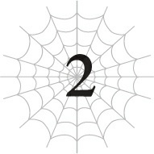

# Chương 2: Cuộc Chiến Linh Hồn Với Mẹ

*(Spirit Battle vs Mother)*

---

### --- TRANG 16 ---

Tôi là phân thân ma pháp số một trước đây.

Thực ra thì, ngay khi công việc lớn này kết thúc, đằng nào tôi cũng sẽ trở lại làm phân thân ma pháp mà thôi.

Nhưng trước hết, tôi phải hoàn thành nhiệm vụ này đã, các người biết đấy, đánh bại Mẹ.

—Số một! Đừng có đứng đần ra đó nữa—làm việc mau! Á á á?!

À, phân thân cơ thể trước đây vừa bị một đòn tấn công của Mẹ thổi bay mất tiêu rồi.

Ôi dào.

Ồ, đừng lo.

Cô nàng không chết được đâu.

Điều tồi tệ nhất Mẹ có thể làm lúc này chỉ là đập chúng tôi văng đi một chút mà thôi.

Trước hết, thực ra chúng tôi không hề chiến đấu ở thế giới thực.

Tôi đoán chúng tôi đang chiến đấu với linh hồn hay tinh thần của Mẹ chăng? Đại khái là giống như đang đánh nhau trong một giấc mơ vậy.

Xem này, Mẹ có kỹ năng [Điều khiển Đồng loại], kỹ năng này về cơ bản cho phép bà ta điều khiển bất kỳ đứa con nào của mình.

Và nó cũng đã bắt đầu gây ảnh hưởng đến cơ thể của chúng tôi.

Tôi lần đầu tiên nhận ra điều đó khi đang chiến đấu với Hỏa Long.

Vì lý do nào đó, tôi có cảm giác như cảm xúc của chính mình đang bị xáo trộn lung tung.

Khi điều tra nguyên nhân, tôi phát hiện ra mình đang nhận được thứ gì đó giống như tín hiệu sóng radio phát ra từ Mẹ.

Khi bạn nhận ra có ai đó đang đẩy mình, bạn sẽ đẩy lại, đúng không?

Đó là lý do tại sao tôi dò ngược lại tín hiệu dùng để kiểm soát tôi về phía bà ta, và giờ tôi đang tiến hành phản công ngược lại Mẹ.

Tất cả việc này được thực hiện bằng cách phái các [Phân thân Tư duy] của tôi vào chiến đấu dưới dạng các hình chiếu tinh thần.

---

### --- TRANG 17 ---

[Phân thân Tư duy] là kỹ năng tạo ra các bản sao ý chí của tôi.

Hãy cứ nghĩ về nó giống như thuật phân thân ninja vậy, có điều là phân thân ý thức chứ không phải cơ thể.

Tôi đoán vì chỉ có duy nhất một cơ thể, về mặt lý thuyết bạn có thể gọi đó là đa nhân cách.

Tuy nhiên, bằng cách giao cho mỗi phân khu tư duy này các vai trò khác nhau, chúng tôi đã có thể thực hiện công việc của nhiều người chỉ bằng một cơ thể duy nhất.

Cụ thể, một phân thân (là tôi) phụ trách ma pháp, một phụ trách vận động cơ thể, một phụ trách thu thập thông tin, vân vân.

Đại khái giống như một chiếc xe tăng có người lái, chỉ huy và pháo thủ vậy.

Một trong số các [Phân thân Tư duy] được để lại phụ trách cơ thể thực, còn những phân thân khác đều được phái đi tấn công Mẹ.

Ý tôi "những phân thân khác" chính là chúng tôi đây.

Hình bóng khổng lồ của Mẹ đang ở ngay trước mắt tôi.

Tuy nhiên, đây thực ra chỉ là dạng linh hồn. Đó không phải là cơ thể thực của bà ấy.

Thân xác linh hồn của Mẹ đã mất đi vài cái chân rồi.

À thì, vì chúng tôi đã xơi chúng chứ sao.

Ngay cả lúc này đây, vài phân thân linh hồn của tôi vẫn đang bám chặt vào cơ thể Mẹ, gặm nhấm ngấu nghiến.

Mẹ đang giãy giụa điên cuồng, rũ bỏ hoặc hất văng chúng ra.

Nhưng như tôi đã liên tục giải thích, đây là cơ thể linh hồn, không phải cơ thể vật lý thực sự của chúng tôi.

Có thể nói chúng giống như những mảnh vỡ linh hồn vậy.

Hơn nữa, cơ thể thực của chúng tôi sở hữu kỹ năng [Vô hiệu Dị giáo], một kỹ năng giúp triệt tiêu bất kỳ đòn tấn công nào gây tổn hại đến linh hồn.

Nói cách khác, dù thân xác linh hồn của Mẹ có tung bao nhiêu đòn tấn công trúng chúng tôi đi chăng nữa, bà ấy cũng không thể làm chúng tôi bị thương vì chúng tôi chính là linh hồn!

Xét cho cùng, điều này có nghĩa là chúng tôi có thể lao vào bà ấy mà không sợ chết.

Mẹ nào cơ? Chưa từng nghe danh luôn nhé!

Tôi thậm chí còn chẳng thấy ngứa ngáy tí nào, kể cả khi bà ấy giẫm đạp, cắn xé hay nã ma pháp vào tôi.

Tôi vô địch thiên hạ rồi, nói cho biết thế!

Ngay cả những đòn tấn công thừa sức tiễn tôi lên đường ngay lập tức ở thế giới thực cũng chẳng có nghĩa lý gì ở đây cả.

Dù vậy, do bà ấy mạnh hơn tôi rất nhiều, chúng tôi phải mất cả nhiều ngày trời chỉ để bào mòn bà ấy.

---

### --- TRANG 18 ---

Dù vậy, chúng tôi đang từng bước dồn bà ấy vào góc tường một cách chậm rãi nhưng chắc chắn.

Nếu các [Phân thân Tư duy] chúng tôi có thể đánh bại thân xác linh hồn của Mẹ, bà ấy cũng sẽ nghẻo ở thế giới thực luôn.

Dẫu sao thì, chúng ta vẫn đang nói về linh hồn cơ mà.

Bạn có thể thực sự nói một sinh vật vẫn còn sống nếu nó mất đi linh hồn không?

Tôi cá là chức năng duy trì sự sống trong cơ thể vật lý của bà ấy sẽ biến mất khi linh hồn tiêu biến.

Điều đó có nghĩa là tôi thắng.

Nếu không thể thắng bằng cách chiến đấu với bà ấy bằng xương bằng thịt, tại sao không đưa cuộc chiến lên mặt phẳng tâm linh chứ?

Đây không phải là chiến tranh tâm lý—đây là chiến tranh tâm linh.

Đây là một điểm then chốt.

Các đòn tấn công của tôi tuy yếu và không gây ra bao nhiêu sát thương, nhưng đòn của bà ấy thì hoàn toàn vô hại.

Chỉ cần tôi cứ gây sát thương từng chút một, trong khi bà ấy hoàn toàn không thể làm gì tôi, thì chiến thắng chắc chắn thuộc về tôi.

Trên hết, cơ thể thực của tôi đã rời khỏi Mê cung Lớn Elroe để bắt đầu hành trình ở thế giới bên ngoài.

Cơ thể khổng lồ của Mẹ không thể nào đến đó được.

Khoảnh khắc tôi bước ra khỏi mê cung chính là lúc tôi chiến thắng.

Bây giờ tôi chỉ việc nhẩn nha bào mòn linh hồn của Mẹ mà thôi.

Tôi chưa bao giờ mơ rằng mình có thể đánh bại một đối thủ mạnh mẽ như thế này bằng cách này.

Mặc dù tôi đoán chuyện này cũng đại khái giống như một giấc mơ thật.

—Số một! Ngươi vẫn đang lười biếng đấy à?!

Phân thân cơ thể trước đây quay lại, vừa đi vừa lầm bầm phàn nàn.

Dù đòn tấn công của Mẹ đã thổi bay cô ấy dữ dội thế nào, cô ấy vẫn hoàn toàn lành lặn.

Đa tạ, [Vô hiệu Dị giáo] vĩ đại.

Không có kỹ năng đó, tôi chắc chắn sẽ không có lấy một cơ hội mong manh nhất.

Sức mạnh linh hồn của Mẹ về cơ bản ngang bằng với sức mạnh thực của bà ấy.

Điều đó hoàn toàn hợp lý thôi.

Dẫu sao thì, chỉ số thực của bà ấy mạnh mẽ là nhờ vào sức mạnh linh hồn cơ mà.

Đúng là sức mạnh vật lý cũng có tác động, nhưng linh hồn mới là nguồn sức mạnh chủ yếu. Chẳng có gì đáng ngạc nhiên khi thân xác linh hồn—về cơ bản chính là bản thân linh hồn của bà ấy—cũng mạnh mẽ tương tự.

---

### --- TRANG 19 ---

Nói cách khác, năng lực thân xác linh hồn của chúng tôi cũng tương đương với cơ thể thực.

Nhưng trong trường hợp của chúng tôi, chúng tôi đã bị chia nhỏ thành nhiều mảnh bởi [Phân thân Tư duy], nghĩa là mỗi phân thân chỉ có một tỷ lệ phần trăm sức mạnh nhất định.

Thực tế là cuộc chiến này vẫn cực kỳ gian khổ dù kỹ năng [Vô hiệu Dị giáo] triệt tiêu mọi đòn tấn công nhắm vào chúng tôi chỉ càng chứng minh khoảng cách sức mạnh to lớn giữa Mẹ và cơ thể thực của chúng tôi.

Chúng tôi liên tục bị thổi bay, rồi lại lao vào bám chặt lấy bà ấy.

Chỉ sau khi lặp lại vòng tuần hoàn này suốt nhiều ngày trời, chúng tôi cuối cùng mới đạt đến thời điểm gây ra sát thương rõ rệt.

—Này, đừng có lờ tôi đi chứ!

Ư, phiền chết đi được.

Tôi cũng đâu có lười biếng đâu chứ.

—Này, phân thân cơ thể trước đây.

—Gì thế?

—Ngươi có thấy chuyện này kỳ lạ không?

Tôi không cần phải nói rõ là tôi đang ám chỉ chuyện gì.

Hành động của Mẹ có gì đó rất kỳ lạ.

Trong cuộc chiến linh hồn này, chỉ cần có [Vô hiệu Dị giáo], chúng tôi không cần lo lắng về việc bị tổn hại.

Chúng tôi biết rốt cuộc mình cũng sẽ đánh bại được Mẹ, kể cả có mất nhiều thời gian đi chăng nữa.

Kết cục quá rõ ràng rồi.

Như vậy thì dĩ nhiên Mẹ sẽ cố gắng phá hoại kế hoạch của chúng tôi.

Đòn phản công đầu tiên xuất hiện dưới hình thức một đội quân nhện do con Taratect Thượng cổ dẫn đầu mà bà ấy phái đi săn lùng cơ thể thực của chúng tôi, ở một khu vực quá nhỏ hẹp để bản thân bà ấy có thể tự chui vào.

Taratect Thượng cổ là những thuộc hạ đặc biệt mạnh mẽ của bà ấy, đủ sức đối đầu ngang ngửa ngay cả với rồng.

Bà ấy có lẽ nghĩ ngần đó là đủ để tiêu diệt cơ thể thực của chúng tôi rồi.

Nhưng thay vào đó, cơ thể thực của chúng tôi đã lật ngược thế cờ bằng vài chiến thuật khá bẩn thỉu, gậy ông đập lưng ông.

Chuyện đó thì tốt rồi.

Nhưng những chuyện xảy ra sau đó mới kỳ lạ kìa.

Vì các con Taratect Thượng cổ đã bại trận, Mẹ dĩ nhiên phải thực hiện một nước đi khác.

Nếu không, cứ đà này bà ấy sẽ chết chắc.

Thế nhưng, Mẹ lại không hề có biểu hiện muốn thử làm bất kỳ điều gì khác.

---

### --- TRANG 20 ---

Chuyện này xảy ra bất chấp thực tế là bà ấy vẫn còn rất nhiều thuộc hạ dưới quyền kiểm soát.

Kể từ khi ăn một phần thân xác linh hồn của Mẹ, tôi đã có thể nhìn qua đôi mắt của bà ấy.

Tôi không chắc đó là nơi nào trong mê cung, nhưng ở đâu đó có một quân đoàn nhện khổng lồ, bao gồm cả những con Taratect Thượng cổ.

Mẹ đang ở trung tâm của tất cả những thứ đó, hoàn toàn bất động.

Nhìn vào cảnh này, tôi có thể khẳng định lực lượng bà ấy phái đi săn lùng cơ thể thực của chúng tôi trước đây chỉ là một phần nhỏ trong số quân đoàn tay sai của bà ấy.

Tại sao bà ấy không phái số còn lại đi săn lùng cơ thể chúng tôi chứ?

Tôi thật không hiểu nổi.

Ý tôi là, cơ thể thực của chúng tôi rất mạnh, dù chính tôi tự nói thế thì hơi kỳ.

Đúng là chúng tôi chỉ đánh bại được lũ Taratect Thượng cổ nhờ sử dụng chiến thuật chơi bẩn, nhưng chúng tôi cũng từng chiến đấu công bằng và chiến thắng một đối thủ mạnh tương đương—không, thậm chí còn mạnh hơn—là Địa Long Alaba cơ mà.

Dù thế, nếu có từ hai con Taratect Thượng cổ trở lên đồng loạt tấn công cơ thể chính cùng lúc, chúng chắc chắn sẽ có cơ hội chiến thắng rất cao.

Thế mà Mẹ lại không làm vậy.

Mặc dù bà ấy sở hữu nhiều hơn hai con Taratect Thượng cổ rất nhiều.

Bà ấy cứ ngồi yên đó trong khi chiến đấu với các phân thân linh hồn của chúng tôi, giống như đang chờ đợi điều gì đó vậy.

Ừ thì, tôi cá chắc là nếu bà ấy phái một quân đoàn nhện đông đảo đến mức vô lý như vậy đi săn lùng cơ thể chính, nó sẽ dùng [Dịch chuyển] chạy té khói không chút do dự ngay lập tức thôi.

...Chờ một chút.

Có khi nào Mẹ cũng hiểu rõ điều đó không?

Bà ấy biết tôi hoàn toàn không ngại việc bỏ chạy khỏi một trận chiến mà tôi biết chắc mình không thể thắng?

Chuyện đó hoàn toàn có khả năng.

Mẹ và tôi đã kết nối với nhau thông qua kỹ năng [Điều khiển Đồng loại] của bà ấy ngay từ khoảnh khắc tôi chào đời.

Tôi không nghĩ bà ấy bận tâm chú ý đến từng đứa trong số hàng hà sa số con cái của mình, nhưng xét theo cách tôi hành động độc lạ từ trước đến giờ, có khi tôi đã lọt vào mắt xanh của bà ấy ở một thời điểm nào đó rồi.

Nếu Mẹ đã dùng kỹ năng đó để giám sát hành vi của tôi, tôi sẽ không ngạc nhiên nếu bà ấy đã quá quen thuộc với các kiểu hành xử của tôi lúc này.

Thực tế, có lẽ bà ấy đã dùng kiến thức đó để sắp xếp đội quân đầu tiên một cách cẩn thận, khiến tôi nghĩ rằng mình có cơ hội chiến thắng nếu

---

### --- TRANG 21 ---

chiến đấu hết mình.

Thật sự, nếu tôi chiến đấu với đội quân đó một cách công bằng sòng phẳng thay vì dùng trò bẩn, tôi có cảm giác tỷ lệ thua của tôi sẽ cao hơn tỷ lệ thắng một chút.

Nếu chỉ có lũ Taratect Thượng cổ, tôi nghĩ mình sẽ thắng.

Nhưng sau khi tính thêm cả đống lâu la đi theo nữa, cơ hội của tôi cực kỳ mong manh.

Nhưng cơ hội mong manh đó mới là mấu chốt.

Sẽ rất khó khăn, nhưng không đến mức tồi tệ tới mức tôi hoàn toàn không có cửa thắng.

Nếu nghĩ mình có cơ hội, tôi không thể ép mình bỏ chạy, kể cả khi tỷ lệ thất bại cao hơn nhiều.

Rốt cuộc, tất nhiên phe ta đã giành chiến thắng vô cùng dễ dàng.

Dù vậy, nếu Mẹ thực sự suy tính thấu đáo đến mức đó, thì bà ấy phải xảo quyệt hơn tôi tưởng rất nhiều.

Tôi sẽ nói chuyện đó khiến bà ấy thông minh ngang ngửa con người, hoặc thậm chí có khi còn thông minh hơn.

Trong trường hợp đó, sự bất động hiện tại của bà ấy cực kỳ đáng nghi.

Nếu bà ấy không hành động, các phân thân linh hồn chúng tôi sẽ đánh bại bà ấy mất.

Tại sao bà ấy cứ ngồi yên một chỗ như thế chứ?

Chỉ đơn giản là chờ thời, cứ như thể đang đợi chờ điều gì đó?

Không, không phải "cứ như thể". Chắc chắn là vậy rồi.

Nhưng bà ấy đang đợi cái gì chứ?

Như để chứng thực cho mối nghi ngờ âm ỉ của tôi, cơ thể vốn bất động của Mẹ từ trước đến nay đột ngột chuyển động, kéo theo cả đội quân nhện khổng lồ xung quanh.

Tất cả bọn chúng đều đồng loạt di chuyển cùng lúc.

Đội quân nhện chia thành nhiều phân đội, mỗi đội do các con Taratect Thượng cổ dẫn đầu trước khi phân tán đi các hướng. Đồng thời, Mẹ cũng bắt đầu di chuyển với tốc độ vượt xa mức có thể đối với thân hình đồ sộ của bà ấy.

Bà ấy gài bẫy được chúng tôi rồi.

Mẹ đã chờ đợi khoảnh khắc này.

—Liên lạc với cơ thể chính mau!

—Không được! Mẹ đang can thiệp vào đường truyền bằng cách nào đó rồi!

—Thật luôn hả?

—Không ổn rồi.

Tôi không biết bà ấy dùng kỹ năng gì, nhưng có vẻ như bà ấy đã tạm thời cắt đứt

---

### --- TRANG 22 ---

liên lạc giữa các phân thân linh hồn chúng tôi với cơ thể chính.

Giờ chúng tôi không thể báo cho cơ thể thực của mình biết là nó đang gặp nguy hiểm nữa!

Bây giờ mọi chuyện đã quá rõ ràng về việc bà ấy đang đợi cái gì rồi.

Khoảnh khắc cơ thể thực của chúng tôi bước ra ngoài.

Bây giờ bà ấy đang phân bổ quân lính khắp mê cung, những nơi mà cơ thể chính của chúng tôi sẽ dịch chuyển tới ngay khi gặp dấu hiệu rắc rối đầu tiên—chặn đứng các đường thoát thân của chúng tôi từ trước.

Sau đó, khi cơ thể của chúng tôi không còn nơi nào để trốn chạy, đích thân Nữ Vương sẽ dẫn đầu phần còn lại của đội quân đi săn lùng chúng tôi.

Từ dưới đáy vực sâu tối tăm, Mẹ bắt đầu lao vút lên trên với tốc độ kinh hoàng.

Và ngay khi tiếp cận trần mê cung, bà ấy mở cái miệng gớm ghiếc của mình ra.

Đòn tấn công hủy diệt vạn vật phóng ra: Hơi thở.

Một đòn giả Hơi thở sử dụng kỹ năng [Long Lực], có lẽ được bắt chước theo kiểu của những con rồng thực sự.

Tuy nhiên, chỉ vì nó không phải hàng thật không có nghĩa là nó yếu.

Trên thực tế, nó phát nổ với sức mạnh thậm chí còn kinh khủng hơn cả Hơi thở của rồng thật, đập tan trần mê cung dày cộp.

Đất trời rung chuyển cứ như thể thế giới bị đảo lộn vậy.

Những tảng đá khổng lồ to như thiên thạch trút xuống đáy vực như mưa trút nước.

Sau khi đống đổ nát ngừng rơi, nó mở ra bầu trời xanh bao la.

Nếu có thể, tôi chắc chắn sẽ gào lên: Đùa nhau chắc?!

Thật luôn hả Mẹ? Bà phá nát cả mê cung để chui ra ngoài luôn sao?

Cảm giác an toàn của tôi, sự tin tưởng chắc chắn rằng Mẹ quá to lớn để có thể rời khỏi mê cung, tan biến trong nháy mắt.

Mẹ đã thoát khỏi ranh giới chật hẹp của chiếc lồng mang tên Mê cung Lớn Elroe.

Và bây giờ, đương nhiên, bà ấy đang hướng thẳng về phía cơ thể thực của chúng tôi.

Kẻ vẫn hoàn toàn mù tịt, không hề hay biết bất kỳ chuyện gì đang diễn ra.
