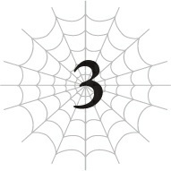

# Chương 3: Mẹ Tấn Công

*(Mother Attack)*

---

### --- TRANG 23 ---

Quyết định ngẫu nhiên hướng về phía những ngọn núi, tôi tận hưởng buổi đi dạo đầu tiên kể từ khi được tái sinh sang thế giới này.

Ở kiếp trước, tôi là một hikikomori danh dự chỉ rời khỏi nhà để đi học (dù sao thì tôi cũng chẳng nhớ mình từng đi đâu khác nữa). Nhưng ở kiếp này, tôi là một cô nhện non trẻ khỏe mạnh đang tận hưởng thế giới ngoài trời!

Vì từ trước đến nay tôi chưa từng rời khỏi Mê cung Lớn Elroe, nên về mặt kỹ thuật thì tôi cũng đã ru rú trong nhà suốt bấy lâu nay, nhưng đó đã là quá khứ xa xôi rồi!

Đi bộ siêu vui luôn ấy!

Hình như con người thực sự cần ánh nắng mặt trời để sống sót thì phải.

Không phơi nắng là không sản sinh ra vitamin D được đâu!

Mà chuyện đó cũng chẳng quan trọng với tôi, vì giờ tôi là nhện rồi!

Thế nhưng, chỉ cần tận hưởng chút ánh nắng ấm áp thôi cũng đủ làm cho mức năng lượng của tôi tăng lêêên đáng kể.

Thực sự khiến người ta nhận ra mặt trời vĩ đại thế nào mà.

Dù vậy tôi đoán mình cũng chẳng thực sự biết hành tinh này có gọi ngôi sao của nó là mặt trời hay cái gì khác không nữa.

Nói nhỏ bên lề nhé, ở đây cũng chỉ có một mặt trời mà thôi.

Tôi vẫn chưa biết ở đây có mặt trăng hay không nữa.

Có lẽ tôi sẽ biết khi đêm xuống, nhưng tôi không khỏi tò mò liệu ở đây có hai mặt trăng như một thế giới khoa học viễn tưởng hay kỳ ảo thứ thiệt không.

Được vậy thì tôi rất muốn chiêm ngưỡng đấy.

Các ngôi sao chắc cũng khác với Trái Đất, nên tôi cũng có chút tò mò về chuyện đó nữa.

Trời ơi, tôi ngóng chờ màn đêm quá đi mất.

Trong cuộc sống cũ, khi tất cả những gì tôi làm chỉ là chơi game, tôi chưa bao giờ tưởng tượng nổi mình lại có thể hứng thú với thiên nhiên thế này.

Nhắc đến thiên nhiên, Thẩm định hoạt động cực kỳ tốt trên những bông hoa xung quanh

---

### --- TRANG 24 ---

đây.

Tôi hơi bất ngờ khi nó hiển thị tên của từng loại cây một.

Nếu cấp độ Thẩm định của tôi mà vẫn còn thấp, chắc nó sẽ chỉ dán nhãn cho cả đống hỗn tạp này là "cỏ" mà thôi.

Dù sao thì, vì tôi đã tốn khá nhiều thời gian để tò mò Thẩm định mọi thứ, nên tôi vẫn chưa đi được xa như mong đợi.

Nhưng mà tôi đoán mình cũng đâu có gì phải vội.

Tận hưởng chuyến đi dạo thong thả của mình, tôi cuối cùng cũng băng qua bình nguyên và đến một khu rừng.

Ngay giây phút tôi tiếp cận, tôi nhận ra toàn bộ sinh vật sống trong khu rừng bắt đầu lập tức bỏ chạy tán loạn.

Phải rồi, phải rồi. Hầu như quên mất—tôi là một con quái vật nguy hiểm bò ra từ mê cung và các thứ các kiểu mà.

Tôi đoán việc các loài động vật bình thường muốn chạy trốn khỏi tôi cũng là điều dễ hiểu.

Cảm giác giống như vừa bị kéo tuột từ trên mây xuống mặt đất vậy. Được rồi, chuyện đó làm cụt hứng của tôi mất một chút.

Mà thôi kệ đi. Tôi rũ bỏ nó và bắt đầu khám phá khu rừng.

Lũ thú vật có thể đã chạy mất dép, nhưng cây cối thì hiển nhiên vẫn còn nguyên ở đây.

Phát hiện ra một loại trái cây nào đó mọc trong rừng, tôi Thẩm định nó rồi cắn thử một miếng.

Măm! Ngọt quá! Ngon quá đi! Cảm ơn mẹ thiên nhiên nhé! Trời ơi, tôi hạnh phúúúc quá.

Có khi tôi chỉ cần sống ở trong rừng, ăn trái cây qua ngày cho đến khi tiến hóa thành một Arachne luôn cho rồi.

Hửm? Đất đá vừa hơi rung chuyển một chút đúng không? Giống như một trận động đất cỡ khoảng cấp 3 ấy nhỉ?

Có vẻ như thế giới này cũng có động đất hả.

Tôi chưa từng cảm nhận được bất kỳ chấn động nào khi còn ở trong Mê cung Lớn Elroe, nên tôi hoàn toàn mù tịt.

Có lẽ động đất ở đây không xảy ra thường xuyên như ở Nhật Bản chăng? Tôi đoán Nhật Bản chắc là bị rung lắc hơi nhiều quá rồi.

---

### --- TRANG 25 ---

Suy nghĩ của tôi bị cắt ngang khi kỹ năng [Cảm nhận Nguy hiểm] reo lên một cách đáng báo động.

Cả người tôi cứng đờ lại, cảnh báo rằng tôi đang gặp nguy hiểm cực độ.

Đã lâu rồi tôi không cảm thấy nỗi sợ hãi tột cùng như thế này.

Cảm giác đặc biệt này có vẻ rất quen thuộc. Đó chính là nỗi sợ hãi tôi đã trải qua khi vừa mới chào đời.

Hả? Đùa tôi chắc? Ý tôi là, cái thứ đó làm sao có thể chui ra khỏi mê cung được chứ.

Nhưng tiếng chuông cảnh báo trong đầu tôi cứ ngày một lớn hơn sau mỗi giây.

Mọi giác quan của tôi đang gào thét rằng tôi không thể ở lại nơi này.

Phóng!

Tôi lập tức bỏ chạy trối chết với tốc độ tối đa, cố gắng kéo giãn khoảng cách với nguồn nguy hiểm càng xa càng tốt.

Ngay lập tức, tôi cảm nhận được một nguồn sức mạnh khổng lồ đang tập trung nhắm vào tôi từ phía xa đằng sau. Chuyện này không ổn rồi.

Tôi đổi hướng chạy, bẻ lái gấp sang một bên.

Sử dụng kỹ năng [Thần tốc (Skanda)] mà tôi có từ lúc sinh ra, tôi tiếp tục tăng tốc, chạy trốn bằng tất cả sức bình sinh.

Vài giây sau, khu rừng tôi vừa đứng lúc nãy... đã biến mất.

Ở rìa tầm mắt của mình, tôi nhìn thấy một luồng năng lượng đen kịt quét qua.

Nó tương tự như đòn phun thở (breath) của Alaba nhưng mang thuộc tính khác và mạnh mẽ hơn gấp bội.

Tôi đoán đó là thuộc tính Bóng tối.

Vài nó thậm chí còn mạnh hơn cả đòn phun thở dốc toàn lực của Alaba nữa.

Chưa kể, đòn này được phóng ra từ cách xa hàng dặm. Ấy vậy mà nó vẫn có thể quét sạch cả một góc rừng, rồi vẫn còn thừa năng lượng để gọt phăng đi một mảng của ngọn núi phía xa mà tôi đang hướng tới.

Hơi thở của Alaba đúng là đủ mạnh để phá hủy nhà tôi, chắc chắn rồi. Nhưng đòn này thậm chí còn không cùng một đẳng cấp.

Tôi mới chỉ được chứng kiến nguồn sức mạnh điên rồ này đúng một lần duy nhất trước đây. Đó là ở Tầng Trung, khi tôi nhìn thấy cả đàn phi long do Hỏa Long Rend dẫn đầu bị xóa sổ gần như hoàn toàn chỉ bởi một đòn tấn công duy nhất.

Tôi ngoảnh lại nhìn xem thứ gì đã tạo ra đòn tấn công đó.

Đúng như dự đoán, đó chính là con quái thú khổng lồ kia. Đây là lần thứ ba tôi nhìn thấy nó tận mắt. Lần đầu tiên là khi tôi vừa mới sinh ra.

---

### --- TRANG 26 ---

Lần thứ hai là khi tôi thấy con Hỏa Long đó bị đánh bại thê thảm.

Và lần thứ ba là ngay lúc này. Mẹ tôi, Taratect Nữ Vương, đang chĩa nguồn sức mạnh đáng sợ của bà ấy thẳng vào tôi.

Chạy đi! Chạy đi! Chạy mauuuuu!

Tôi không biết làm thế nào bà ấy chui ra được khỏi mê cung hay làm sao biết được tôi đang ở đâu, nhưng lúc này không có thời gian để lo nghĩ về chuyện đó nữa! Chỉ cần chạy thoát cái đã!

Ngay khoảnh khắc nhìn thấy Mẹ bằng xương bằng thịt, tôi nhận thức rõ ràng rằng mình hoàn toàn không có một cơ hội chiến thắng nào.

Tôi cứ nghĩ ở khoảng cách này thì không thể, nhưng bằng cách nào đó tôi vẫn Thẩm định được bà ấy. Có lẽ là do các Phân thân Tư duy của tôi vẫn còn đang kết nối với bà ấy.

`<Taratect Nữ Vương (Suy yếu) Cấp 89>`

| Chỉ số | Giá trị |
| :--- | :--- |
| **HP** | 20.557/20.557 (MAX 24.557) (lục) +0 (chi tiết) |
| **MP** | 18.301/18.301 (MAX 22.301) (lam) +0 (chi tiết) |
| **SP (vàng)** | 19.097/19.097 (MAX 23.097) (chi tiết) |
| **SP (đỏ)** | 19.991/19.991 (MAX 23.991) +0 (chi tiết) |
| **Sức tấn công trung bình** | 20.439 (MAX 24.439) (chi tiết) |
| **Sức phòng ngự trung bình** | 20.286 (MAX 24.286) (chi tiết) |
| **Sức ma pháp trung bình** | 17.977 (MAX 21.977) (chi tiết) |
| **Khả năng kháng tính trung bình** | 17.946 (MAX 21.946) (chi tiết) |
| **Tốc độ trung bình** | 20.400 (MAX 24.400) (chi tiết) |

**Kỹ năng:**
[Tự hồi phục HP siêu tốc LV 4] [Tự hồi phục MP nhanh LV 10] [Giảm tiêu hao MP LV 10] [Ma Thần Đấu Pháp LV 3] [Truyền Ma Lực LV 5] [Siêu công kích Ma lực LV 1] [Tự hồi phục SP nhanh LV 10] [Giảm tiêu hao SP tối thiểu LV 10] [Siêu tăng cường Hủy diệt LV 5] [Siêu tăng cường Va chạm LV 6] [Siêu tăng cường Cắt LV 3] [Siêu tăng cường Đâm LV 5] [Siêu tăng cường Sốc LV 5] [Siêu tăng cường Trạng thái bất thường LV 10] [Đấu Thần Đấu Pháp LV 9] [Truyền Năng lượng LV 10]

---

### --- TRANG 27 ---

[Truyền Chỉ Số LV 6] [Siêu công kích Năng lượng LV 3] [Thần Long Lực LV 6] [Long Mạc LV 2] [Tấn công bằng Kịch độc LV 10] [Tăng cường Tấn công Tê liệt LV 10] [Tấn công Dị giáo LV 7] [Tổng hợp Độc LV 10] [Tổng hợp Thuốc LV 10] [Thiên tài Tơ nhện LV 10] [Thần Kỹ Dệt Tơ] [Điều khiển Tơ LV 10] [Niệm lực LV 3] [Ném LV 10] [Bài xuất LV 10] [Cơ động Không gian LV 10] [Điều khiển Đồng loại LV 10] [Đẻ Trứng LV 10] [Tập trung LV 10] [Gia tốc Tư duy LV 9] [Tương Lai Nhãn LV 3] [Phân thân Tư duy LV 9] [Xử lý Tốc độ cao LV 10] [Đánh trúng LV 10] [Né tránh LV 10] [Hiệu chỉnh Xác suất siêu cấp LV 10] [Ẩn mật LV 10] [Che giấu LV 2] [Vô thanh LV 10] [Vô hương LV 1] [Hoàng Đế] [Ma pháp Dị giáo LV 10] [Ma pháp Bóng tối LV 10] [Ma pháp Hắc ám LV 10] [Hắc Ma pháp LV 4] [Ma pháp Độc LV 10] [Ma pháp Trị liệu LV 10] [Ma Vương LV 5] [No Nê LV 10] [Siêu kháng Hủy diệt LV 4] [Vô hiệu Va chạm] [Siêu kháng Cắt LV 4] [Siêu kháng Đâm LV 4] [Siêu kháng Sốc LV 4] [Kháng Lửa LV 2] [Kháng Lũ lụt LV 1] [Kháng Cuồng phong LV 1] [Kháng Địa hình LV 2] [Kháng Sét LV 1] [Kháng Thánh quang LV 9] [Kháng Thổ LV 8] [Siêu kháng Trọng lực LV 1] [Kháng Trạng thái bất thường] [Siêu kháng Axit LV 3] [Kháng Thối rữa LV 8] [Kháng Ngất LV 5] [Kháng Sợ hãi LV 8] [Kháng Ngoại đạo LV 9] [Vô hiệu Đau] [Vô hiệu Khổ đau] [Dạ Nhãn LV 10] [Thị giác Cự ly xa LV 1] [Siêu tăng cường Ngũ quan LV 10] [Mở rộng Nhận thức LV 8] [Mở rộng Thần giới LV 2] [Sinh mệnh Tối thượng LV 10] [Ma pháp Tối thượng LV 10] [Di chuyển Tối thượng LV 10] [Vận May LV 10] [Ngoan cường LV 10] [Kiên cố LV 10] [Thiên Nhân LV 10] [Thánh Vực LV 10] [Thần tốc (Skanda) LV 10] [Cấm kỵ LV 10]

**Điểm kỹ năng:** 164.500

**Danh hiệu:**
[Kẻ Ăn Đồng Loại] [Kẻ Ăn Uế Tạp] [Người dùng Độc thuật] [Kẻ diệt quái vật] [Người dùng Tơ] [Sát thủ] [Kẻ diệt con người] [Kẻ gieo rắc kinh hoàng] [Kẻ Vô tình] [Kẻ tàn sát quái vật] [Kẻ diệt Phi Long] [Kẻ diệt Rồng] [Quán quân] [Thiên tai Quái vật] [Quân Chủ] [Kẻ tàn sát con người] [Kẻ tàn sát Phi Long] [Thiên tai Nhân loại]

---

### --- TRANG 28 ---

Cái giống ôn dịch gì thế này? Chỉ số của bà ấy toàn bộ đều trên 20.000!

Tính toán trên mặt lý thuyết, tức là bà ấy mạnh gấp khoảng năm lần Alaba.

Thế này thì đánh đấm kiểu gì hả trời?

Thật tình, những chỉ số đó còn tệ hại hơn tôi tưởng tượng nhiều. Tôi đã chuẩn bị tinh thần cho việc chúng vượt mức 10.000 rồi, nhưng gấp đôi con số đó á?

Tôi đoán điểm sáng duy nhất ở đây là chỉ số của bà ấy vì lý do nào đó đã bị giảm sút. Mỗi chỉ số đều bị tụt mất khoảng 4.000 điểm.

Có lẽ là nhờ công lao cày cuốc chăm chỉ của các Phân thân Tư duy chăng? Nếu thế thì tôi chính là người đã làm giảm chỉ số của bà ấy nhiều đến vậy rồi.

Trời ơi, tôi có đỉnh quá không cơ chứ?

Nhưng tiếc thay, điều đó vẫn không có nghĩa là tôi có cơ hội chiến thắng. Dù đã bị suy yếu, chỉ số thấp nhất của bà ấy vẫn vượt xa chỉ số cao nhất của tôi.

Tôi phải bỏ chạy thôi. Lao vào một trận chiến nắm chắc phần thua chẳng khác nào tự sát. Và tôi thì tuyệt đối không muốn chết lãng xẹt như vậy.

Nếu bị dồn vào đường cùng thì được thôi, tôi sẽ quyết tử chiến hết mình, nhưng hiện tại tôi vẫn có cơ hội sống sót nếu chạy trốn.

---

### --- TRANG 29 ---

Khoảng cách giữa Mẹ và tôi vẫn còn khá xa.

Vì tốc độ của bà ấy cao hơn tôi, nên sớm muộn gì bà ấy cũng sẽ bắt kịp tôi trong một cuộc rượt đuổi, nhưng vẫn sẽ mất một khoảng thời gian để bà ấy thu hẹp khoảng cách.

Hơn nữa, đòn phun thở mạnh mẽ đó tuy đã chạm tới được vị trí của tôi bất kể khoảng cách mênh mông giữa hai bên, nhưng tôi chắc chắn mình sẽ nhận biết được khi nào bà ấy đang chuẩn bị một đòn tấn công quy mô lớn như vậy.

Tôi nghĩ việc thoát khỏi bán kính vụ nổ kịp thời cũng không phải là bất khả thi.

Dù sao thì, trong lúc chạy trốn khỏi Mê cung Lớn, tốt hơn hết tôi nên khẩn trương chuẩn bị thuật thức [Dịch chuyển Cự ly xa].

Không giống như [Dịch chuyển] tầm ngắn, [Dịch chuyển Cự ly xa] cần thời gian để chuẩn bị.

Ngay cả khi có kỹ năng [Cực đỉnh Thần bí], tôi vẫn cần vài phút.

Vài vì tôi phải tập trung vẽ một thuật thức cực kỳ phức tạp cho nó, tôi không thể sử dụng bất kỳ ma pháp nào khác cùng một lúc.

Nói chung, đây không phải là thứ tôi có thể sử dụng trong lúc chiến đấu.

Nhưng nó là ma pháp hoàn hảo để đào tẩu.

Tôi có thể dịch chuyển đến bất kỳ nơi nào tôi từng đặt chân tới trước đây, dù khoảng cách có xa đến đâu.

Chỉ cần tôi hoàn thành thuật thức, việc rút lui về Mê cung Lớn Elroe sẽ không mất tới một giây.

Lúc này, cảnh sắc ngoài trời thơ mộng bỗng trở nên nguy hiểm hơn bao giờ hết.

Tốt hơn hết là trốn vào mê cung phức tạp, an toàn trong một lối đi hẹp mà Mẹ không thể dễ dàng chui vào.

Tôi chỉ cần cầm cự vài phút cho đến khi ma pháp Dịch chuyển sẵn sàng.

Nhưng giờ tôi cảm nhận được Mẹ đang đuổi theo ngay sau lưng với tốc độ đáng kinh hãi. Nhanh khủng khiếp! Sao một thân hình khổng lồ như vậy lại có thể chạy nhanh đến thế chứ?!

Tôi liếc nhìn lại phía sau một chút. U oa. Di chuyển của bà ấy về cơ bản là đang gây ra thiên tai luôn rồi.

Mỗi khi chân bà ấy chạm đất, những mảng đất đá khổng lồ lại bay tứ tung. Những khu vực bà ấy đi qua đều bị tàn phá tan hoang, giống như vừa có một trận cuồng phong càn quét.

Chỉ riêng luồng gió tạo ra từ tốc độ của bà ấy thôi cũng đủ để san phẳng mọi thứ trên đường đi.

Mọi người biết mấy bộ phim quái vật nơi con quái thú giẫm đạp phá hủy đường phố và các tòa nhà chứ? Phải, cái này còn tệ hơn nhiều.

Mẹ lúc này về cơ bản chính là hiện thân của sự hủy diệt.

---

### --- TRANG 30 ---

Chỉ chạy ngang qua thôi mà cũng đủ tàn phá thế giới xung quanh sao? Chuyện này không đùa được đâu!

Nếu bà ấy dẫm trúng tôi dù chỉ một cái, thân xác nhỏ bé này chắc chắn sẽ tan thành mây khói!

Nhưng đây không phải là lúc đứng hình vì sợ hãi.

Bởi vì, nhìn cái miệng của Mẹ kìa, có vẻ như bà ấy đang chuẩn bị tích tụ thêm một đòn phun thở nữa.

Trong khi vẫn đang đuổi theo tôi với tốc độ tối đa.

Ơ, khoan đã nào. Có thực sự bắn được đòn phun thở đó khi đang di chuyển không vậy?

Bình thường không phải người ta phải đứng lại để tích tụ một đòn tấn công khủng khiếp như vậy rồi mới bắn ra sao?

Chơi gì kỳ cục, thế này bất công quá!

Trong cơn hoảng loạn, tôi đổi hướng chạy. Tôi cố gắng né khỏi quỹ đạo đường thẳng mà tôi đoán đòn phun thở sẽ bắn trúng.

Nhưng [Tương Lai Nhãn] kích hoạt, cho tôi thấy một viễn cảnh hãi hùng.

Thôi xong!

Tôi lập tức chuyển hướng lần nữa, từ bỏ việc chạy ngang mà phóng thẳng lên trời bằng [Cơ động Không gian].

Ngay lập tức, Mẹ nhảy vọt lên cao. Bà ấy phun thở quét qua khoảng không gian tôi vừa nhảy khỏi, rồi quét ngang.

Đòn phun thở tàn phá một vùng đất rộng lớn chỉ trong vài giây.

Ngay cả khi ở trên không trung, tôi vẫn bị sóng xung kích đánh trúng, khiến tôi xoay mòng mòng như chong chóng.

Dù vậy, ít nhất sát thương vẫn còn nhẹ.

Nếu tôi mà vẫn còn ở trên mặt đất thì chắc chắn đã ăn trọn đòn phun thở đó rồi. So với việc đó, tôi thà mất khoảng 30% HP còn hơn nhiều!

Nếu chỉ riêng sóng xung kích đã gây ra lượng sát thương khủng khiếp như vậy, thì một đòn trực diện chắc chắn sẽ làm tôi bốc hơi hoàn toàn!

Tôi cố gắng lấy lại thăng bằng trên không trung và tiếp tục chạy trốn.

Tôi không muốn lãng phí những giây phút quý giá để hạ cánh xuống mặt đất. Thực tế là mặt đất bên dưới cũng đã bị nổ tung thành từng mảnh rồi, nên dù muốn tôi cũng chẳng đáp xuống được.

Nếu đây là sức mạnh khi bà ấy bị suy yếu, thì tôi tuyệt đối không muốn chứng kiến hơi thở dốc toàn lực của Mẹ khi ở trạng thái bình thường đâu.

---

### --- TRANG 31 ---

Tôi liếc nhìn lại phía Mẹ.

Bà ấy đáp xuống bãi đổ nát tan hoang kia như thể không có chuyện gì xảy ra, cuốn lên một đám mây bụi khổng lồ.

Tôi khá chắc chắn là mình đã thấy mặt đất thực sự rung chuyển khi bà ấy đáp xuống.

Sau đó, bỏ qua phản lực của cú tiếp đất, bà ấy lập tức tiếp tục lao về phía tôi.

Một phần trong tôi không khỏi nghĩ rằng trông bà ấy ngầu lòi thật sự, lao thẳng về phía tôi với đám mây bụi bốc lên nghi ngút phía sau.

Cảnh này giống hệt như phim điện ảnh vậy.

Có điều đáng sợ hơn gấp trăm vạn lần.

Nhảy lên với thân hình khổng lồ đó, đáp xuống, rồi lại phóng đi mà không cần suy nghĩ lấy một giây? Làm sao có thể hung hãn đến thế cơ chứ?

Đây không phải kỹ xảo đồ họa máy tính CG đâu. Nó là hiện thực, và nó đang lao thẳng tới chỗ tôi đây này.

Tại sao tôi lại phải đối mặt với một tình huống có thể khiến cho cả các đạo diễn Hollywood cũng phải sợ đến tè ra quần thế này?!

Khoảng cách giữa hai bên đã rút ngắn chỉ còn phân nửa so với cách đây một phút.

Nói cách khác, bà ấy sẽ bắt kịp tôi trong vòng nửa phút nữa.

Thuật [Dịch chuyển] sẽ sẵn sàng chỉ vài giây trước thời điểm đó.

Chỉ cần tôi không làm hỏng chuyện này, tôi chắc chắn sẽ sống sót!

Nhưng nói nghiêm túc thì, tôi tốt nhất là đừng có làm hỏng.

Mẹ bắt đầu kích hoạt ma pháp trong lúc đang đuổi theo.

Tôi cũng đang chuẩn bị thuật thức trong khi chạy, nên có lẽ lần này tôi không có quyền phàn nàn.

Không được phàn nàn nhưng tôi vẫn cứ muốn phàn nàn đấy!

Nhìn biểu hiện bên ngoài, Mẹ đang sử dụng phép [Hắc ám Đạn] thuộc hệ Ma pháp Hắc ám.

Đó là một phép thuật rất đơn giản, cấp độ yếu nhất của Ma pháp Hắc ám.

Mọi chuyện sẽ chẳng có gì đáng nói nếu số lượng phát bắn và tầm xa của chúng không bất thường đến mức này.

Tầm bắn của ma pháp càng xa thì uy lực của nó càng giảm.

Nếu Mẹ muốn gây sát thương cho tôi từ khoảng cách vài dặm, bà ấy sẽ phải tiêu tốn một lượng MP khổng lồ. Và phải có năng lực ma pháp cực kỳ thâm hậu để thực hiện việc đó.

Dĩ nhiên, việc Mẹ làm được điều đó không có gì là bất ngờ cả.

Nhưng tôi vẫn thấy thật bất công khi bà ấy có thể bắn ra nhiều đạn đến mức như một cơn mưa đạn thế này!

---

### --- TRANG 32 ---

Tôi vừa lách người né tránh làn mưa đạn vừa tiếp tục lao về phía trước.

Kết quả là tốc độ của tôi bị chậm lại, và Mẹ bắt kịp tôi nhanh hơn rất nhiều.

Tôi đã cân nhắc việc cứ đâm đầu chạy mà chịu đòn trực diện.

Chỉ số phòng ngự ma pháp của tôi khá cao, và tôi cũng có [Thần Long Lực] để giải trừ ma pháp.

Nếu bị bắn trúng, có khi tôi còn chẳng mất giọt máu nào ấy chứ.

Tuy nhiên, vấn đề không nằm ở lượng sát thương, mà là thời gian tôi sẽ bị mất.

Khi một đòn tấn công bắn trúng bạn, ngoài sát thương ra, nó còn tạo ra phản lực chấn động nhất định.

Lỡ như nó làm tôi bị chậm lại thì sao?

Hoặc tệ hơn nữa, nếu nó làm tôi mất thăng bằng và ngã nhào, mọi thứ sẽ kết thúc chỉ trong tích tắc.

Né tránh là lựa chọn tốt nhất để loại bỏ các biến số không xác định ra khỏi phương trình. Tôi đã nghĩ đó là một quyết định đúng đắn.

Tuy nhiên, quyết định đó lại dựa trên một giả định sai lầm.

Tôi cứ tưởng loạt mưa đạn ma pháp này nhằm mục đích làm tôi chậm lại. Nhưng tôi đã nhầm to.

Nó chỉ là một đòn nghi binh.

Đến khi tôi nhận ra thì đã quá muộn.

Đòn phun thở thứ ba đã được tích tụ sẵn trong miệng Mẹ từ lúc nào.

Tôi hoàn toàn không có thời gian để né tránh trước khi đòn phun thở bắn ra.

Cơ thể tôi sắp sửa bị nuốt chửng bởi cơn sóng hủy diệt đang ập đến.

Ngay trước khi nó chạm vào người, ma pháp Dịch chuyển của tôi đã hoàn thành.

Tôi lập tức kích hoạt nó và trốn thoát về Mê cung Lớn Elroe trong gang tấc.

Tôi đã làm được. Nếu quá trình dịch chuyển chậm trễ dù chỉ một giây, tôi chắc chắn đã mất mạng.

Thực tế là, khoảng một phần tư cơ thể của tôi đã bị thổi bay.

Hai chân sau biến mất, và thậm chí mất đi một phần bụng.

Việc tôi vẫn còn sống sót chắc chắn là nhờ vào đặc tính cơ thể loài nhện hoặc là nhờ phước lành từ kỹ năng và chỉ số của mình.

Dù thế nào đi nữa, tôi không thể bỏ mặc bản thân như thế này được.

Tôi phải sử dụng [Ma pháp Trị liệu] để tự hồi phục cho mình ngay lập tức.

Ngay khi suy nghĩ đó lóe lên trong đầu, tôi kiểm tra lại xung quanh.

---

### --- TRANG 33 ---

Khu vực này là một kiểu điểm trung chuyển giữa Tầng Trung và Tầng Trên.

Tôi dịch chuyển đến đây vì tôi từng dựng một cái tổ ở đây.

Và giờ đây, đó là nơi mà một quân đoàn nhện khổng lồ đang nằm phục kích sẵn để chờ tôi.

---

[◀ Chương trước: Chương S2: Bước Chân Vào Mê Cung Lớn Elroe](s2_entering_the_great_elroe_labyrinth.md) | [Chương tiếp theo: Chương S3: Vượt qua Mê cung Lớn Elroe ▶](s3_navigating_the_great_elroe_labyrinth.md)
