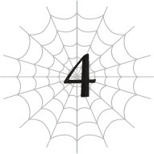
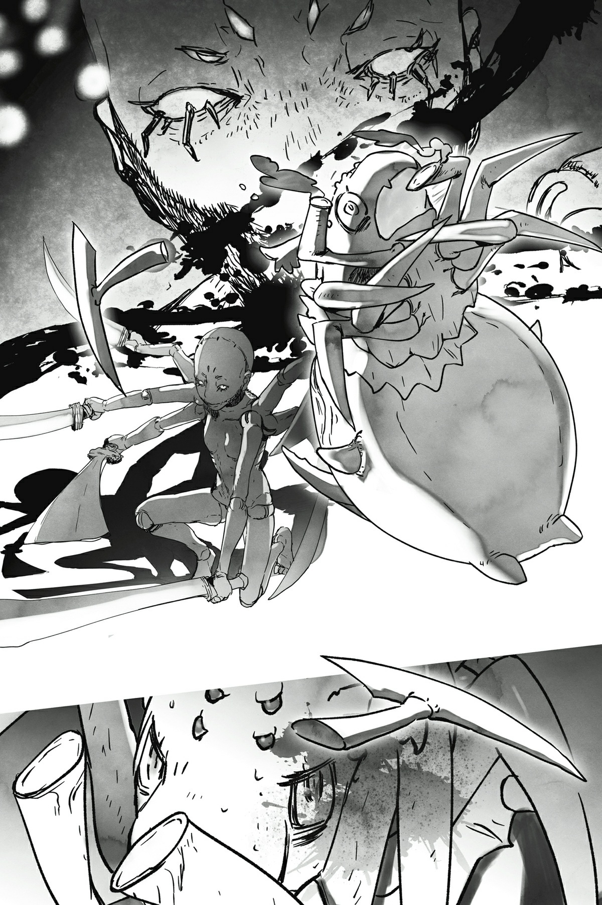

# Chương 4: Chạm Trán Tử Thần

*(A Brush with Death)*

---

### --- TRANG 34 ---

Cứ tưởng là đã dịch chuyển đến nơi an toàn, hóa ra lại có một ổ phục kích đang chờ sẵn tôi.

Đây chắc chắn là tác phẩm của Mẹ rồi.

Một quân đoàn nhện tình cờ lởn vởn ngay đúng vị trí cái tổ cũ của tôi thì tỉ lệ xảy ra cũng ngang ngửa với việc bị thiên thạch bay thẳng vào mặt vậy.

Chuyện này không thể nào là ngẫu nhiên được, đúng chứ?

Mà cái đáng sợ thực sự là, xét tới độ đen đui của tôi từ trước tới giờ, nếu nó có là ngẫu nhiên thật thì tôi cũng chẳng ngạc nhiên mấy đâu.

Nhưng dù sao thì tôi vẫn nghĩ khả năng cao hơn là Mẹ đã dự đoán được tôi sẽ dịch chuyển về đây, nên đã phái lực lượng của bà ấy đến mai phục sẵn từ trước.

Hình như tôi hơi đánh giá thấp bà ấy một chút rồi.

Về đầu óc chứ không phải cơ bắp.

Với cái thân hình khổng lồ kia của Mẹ, không đời nào bà ấy có thể rượt đuổi tôi khi tôi chạy loăng quăng trong các lối đi hẹp của Mê cung Lớn Elroe được.

Tất cả những gì bà ấy cần làm chỉ là đợi tôi mò ra ngoài mà thôi.

Bà ấy chắc chắn đã dự đoán được từng bước đi của tôi.

If không thì bà ấy làm sao có thể sắp xếp mọi thứ hoàn hảo đến mức này được chứ.

Khi tôi rời khỏi mê cung, bà ấy đã đích thân ra ngoài săn đuổi tôi.

Nếu bà ấy kết liễu tôi ngay tại đó thì coi như xong chuyện.

Tốc độ thuần túy của bà ấy cao hơn tôi, nghĩa là cách duy nhất để tôi cắt đuôi bà ấy là dùng [Dịch chuyển Cự ly xa].

Và tôi còn có thể trốn đi đâu ngoài việc quay lại Mê cung Lớn Elroe chứ?

Cụ thể hơn, nơi đầu tiên tôi có khả năng cao sẽ chạy trốn về nhất chính là cái chỗ từng là tổ cũ của tôi.

Gửi một quân đoàn tới đó mai phục sẽ là cách dễ dàng nhất để tóm gọn tôi khi tôi vừa đặt chân tới trong trạng thái không chút đề phòng

---

### --- TRANG 35 ---

ngay khi tôi vừa tới nơi.

Tóm lại, đó là tình hình hiện tại của tôi.

Từ chỗ sử dụng [Dịch chuyển] để tiêu diệt lũ Taratect Thượng cổ, tôi lại bị chính chiêu đó gậy ông đập lưng ông.

Xong đời tôi rồi.

Tôi thậm chí còn không kịp phản ứng để né cặp nanh của con Taratect Thượng cổ đang lao thẳng vào mặt mình.

Thực tế là thế này: Tôi đã lơ là cảnh giác ngay khi phép [Dịch chuyển] được kích hoạt, rồi đơ người ra mất một giây ngay khi nhận ra mình đang bị bao vây bởi một quân đoàn nhện, và những vết thương mà Mẹ gây ra cho tôi trước đó cũng làm chậm tốc độ phản ứng của tôi nữa.

Tất cả những yếu tố đó cộng lại đã khiến tôi không thể né tránh nổi.

Cặp nanh khổng lồ của con Taratect Thượng cổ cắm phập vào cơ thể nhỏ bé của tôi.

Nhưng chúng không xuyên qua được hoàn toàn.

Trông tôi thế này thôi chứ chỉ số phòng ngự của tôi cũng trên 2.000 đấy nhé.

Tôi vẫn chưa kịp [Thẩm định] con Taratect Thượng cổ đang ngoạm mình nên không biết chắc chắn, nhưng nếu nó giống với những con tôi từng chiến đấu trước đây, thì lực tấn công của nó có lẽ phải trên 4.000.

Nó có thể cũng đang sử dụng [Ý chí chiến đấu] và [Ma đấu pháp] để cường hóa đòn đánh nữa, cơ mà cấp độ kỹ năng của nó chắc không cao bằng của tôi đâu.

Cho dù nó có cắn thủng được cơ thể tôi và rứt ra một miếng thì đó cũng chưa phải là ngày tận thế.

Thế nhưng, lượng sát thương nhận vào chắc chắn sẽ vô cùng lớn.

Và đó là chưa kể đến những vết thương nghiêm trọng mà Mẹ đã gây ra cho tôi từ trước.

Thương thế của tôi tệ đến mức nếu không nhờ có [Giảm Đau siêu cấp], chắc tôi đã ngất xỉu từ đời thuở nào rồi.

Trên hết, tôi có thể cảm nhận được một thứ gì đó đang thấm vào cơ thể mình từ cặp nanh kia.

Tôi biết chính xác đó là cái gì, vì tôi cũng có chiêu tương tự.

[Tấn công bằng Độc]. Chính xác hơn là [Kịch độc].

Dù có khả năng kháng tính cao, tôi vẫn không thể vô hiệu hóa nó hoàn toàn.

Tôi phải thoát khỏi cặp nanh này nhanh lên, nếu không tôi sẽ bị chất độc thấm sâu vào người và chết mất.

Đấy là nếu như lượng sát thương thuần túy không kết liễu tôi trước.

Trong tình cảnh ngàn cân treo sợi tóc nhất cuộc đời mình, tôi bỗng trở nên bình tĩnh đến lạ kỳ và

---

### --- TRANG 36 ---

nhanh chóng kích hoạt ma pháp.

Cụ thể là [Thổ Ma pháp].

Một ngọn thương bằng đất đâm vọt lên từ mặt đất và đập mạnh vào đầu con Taratect Thượng cổ.

Tôi không mong đòn này gây ra nhiều sát thương.

Tất cả những gì tôi muốn là lực tác động của nó sẽ làm giãn cặp hàm đang găm chặt vào người tôi.

Đúng như kỳ vọng, đòn tấn công khiến con Taratect Thượng cổ lảo đảo, nới lỏng lực ngoạm chỉ trong một tích tắc.

Tôi chộp lấy cơ hội đó, bồi thêm ma pháp thẳng vào mặt con Thượng cổ rồi thoát khỏi móng vuốt của nó.

Ngạc nhiên thay, đòn tấn công dường như đã làm suy yếu con Thượng cổ nhiều hơn tôi nghĩ.

Tôi đoán là nó không có [Long Lân] hay thứ gì tương tự để chống đỡ ma pháp.

Kỹ năng đó chính là thứ từng ngăn tôi gây ra sát thương lớn cho loài rồng chỉ bằng một đòn tấn công duy nhất, nhưng tôi đoán khi không có nó, ngay cả các chỉ số ngang ngửa rồng cũng không thể bảo vệ một con Taratect Thượng cổ khỏi một đòn đánh mạnh.

Dù vậy, đó mới chỉ là về mặt phòng ngự.

Còn về mặt tấn công, con Thượng cổ sở hữu chỉ số và kỹ năng dễ dàng sánh ngang với Alaba hùng mạnh.

Nó có thể không có sức mạnh gây ra thảm họa hủy diệt như Mẹ, nhưng vẫn đủ để tàn phá nghiêm trọng một góc mê cung giống như những gì Alaba từng làm.

Và ở đây có tận năm sinh vật mạnh mẽ như thế.

Không phải thế này là hơi quá đà rồi sao?

Tôi đoán điều đó chỉ cho thấy Mẹ đang cố gắng giết tôi một cách nghiêm túc đến thế nào.

Và tôi phải thừa nhận là kế hoạch đó của bà ấy hiện tại đang tiến triển rất tốt.

Đòn phun thở của Mẹ đã thổi bay một phần cơ thể tôi, cặp nanh của con Thượng cổ cắm thủng lỗ chỗ phần còn lại, và giờ đây độc tố cũng đang ăn mòn tôi nữa.

Thành thật mà nói, tình cảnh này khiến người ta phải tự hỏi làm thế nào tôi vẫn còn sống được đến giờ phút này nữa kìa.

À, tôi biết tại sao rồi. Đó là nhờ kỹ năng [Kiên trì].

HP của tôi thực ra đã chạm mức 0 từ lâu rồi.

Thế nhưng, kỹ năng [Kiên trì] có thể dùng MP để thay thế cho HP.

Một khi MP cạn kiệt, tôi sẽ chết ngay lập tức.

---

### --- TRANG 37 ---

Nhờ có [Cực đỉnh Thần bí], MP của tôi tự hồi phục nhanh hơn tốc độ sụt giảm của nó, nên tôi không dễ chết như vậy đâu.

Tuy nhiên, điều đó không có nghĩa là vết thương của tôi sẽ sớm lành lại.

Kỹ năng [Kiên trì] thực chất chỉ đang lấy MP thế mạng cho HP để trì hoãn cái chết không thể tránh khỏi mà thôi.

If tôi phải nhận lượng sát thương lớn tới mức không thể di chuyển được nữa, tôi chắc chắn lũ Thượng cổ sẽ cày nát tôi nhanh hơn tốc độ hồi MP.

Tôi sẽ bị đập cho nhừ tử.

Hoặc có thể là bị nuốt chửng luôn.

Ngay cả [Kiên trì] cũng chẳng giúp ích được gì nếu như bản thân cơ thể tôi biến mất hoàn toàn.

Tôi đã ở rất gần ranh giới đó rồi.

Và tôi không có thời gian để nghĩ đến việc hồi phục, vì cả năm con Thượng cổ đang lao tới tấn công tôi.

Giờ thì tôi chẳng còn tâm trí đâu mà lo giữ hình tượng nữa.

Tôi né tránh lũ Thượng cổ đang lao tới và chạy trối chết.

Thay vì đáp xuống mặt đất đang bò lổm ngổm vô số nhện, tôi sử dụng [Cơ động Không gian] để tháo chạy giữa không trung.

Do bị mất đi một đống chân, tôi không thể đạt được tốc độ bình thường của mình.

Trong lòng đầy sợ hãi và bực bội, tôi dùng tơ của mình để chặn đứng lượng tơ khổng lồ đang bắn lên từ phía dưới.

Điểm đến của tôi là Tầng Trung.

Tuy tôi chẳng mấy mặn mà gì với nơi đó, nhưng quân đoàn nhện kia còn sợ cái nóng ở đó hơn cả tôi nhiều.

Môi trường rực lửa của Tầng Trung đúng là địa ngục đối với lũ nhện không có kháng tính.

Một con Thượng cổ hay Taratect Vĩ đại có lẽ còn chịu đựng được, chứ những con yếu hơn thế chắc chắn sẽ lăn ra chết chỉ vì đặt chân đến đó.

Thế nhưng, bọn chúng vẫn đi trước tôi một bước. Khi tôi đang lao nhanh về phía lối vào Tầng Trung, có thứ gì đó đã chắn ngang đường tôi.

Nó trông gần như một con búp bê.

Không, tôi nghĩ nó thực sự là một con búp bê.

Nó có một cái đầu nhẵn nhụi, không có mặt.

Một cơ thể vô cơ với các khớp xương hình cầu.

Vật cản đường này trông giống hệt như một ma-nơ-canh có thể tìm thấy ở bất kỳ trung tâm thương mại nào.

Tại nơi mê cung này, một thứ nhân tạo rõ rành rành như vậy trông thật lạc lõng đến kỳ lạ.

---

### --- TRANG 38 ---

Nhưng mọi chuyện sẽ trở nên hợp lý một khi bạn biết thứ gì ở bên trong.

[Thẩm định] tiết lộ cho tôi biết rằng con búp bê đó chứa đầy tơ bên trong, với một con nhện tí hon nằm ở chính giữa.

Và con nhện này là một con quái vật kinh hoàng sở hữu tất cả các chỉ số đều vượt quá 10.000.

Theo kết quả [Thẩm định], đây là một con Taratect Rối.

Nhưng tôi chưa từng nghe nói về một sinh vật như thế bao giờ.

Ngay cả cây tiến hóa mà [Trí Tuệ] cho tôi xem cũng không hề có con quái vật nào tên như vậy.

Nhưng bản năng mách bảo tôi rằng con quái vật bí ẩn này chắc chắn là một trong những quân bài tẩy của Mẹ.

Con búp bê hình người chuẩn bị sẵn những thanh kiếm trong tay.

Cả sáu thanh kiếm.

Dù trông giống con người, con búp bê đó lại có tới sáu cánh tay.

Nếu tính luôn cả chân thì tổng cộng là tám chi: y hệt một con nhện.

Trong lúc tôi đang bị phân tâm bởi cái quan sát ngớ ngẩn đó, sáu thanh kiếm đã lao thẳng về phía tôi.

Không thể né tránh, tôi cảm nhận rõ ràng hai chân trước của mình bị chém đứt phăng.

Lũ quái vật thì không nên dùng vũ khí chứ, khốn khiếp! Tôi chỉ muốn hét lên như thế.

Ta không biết ngươi cướp chúng từ con người hay tự mình chế tạo ra, nhưng như thế này là chơi không đẹp chút nào!

Một thanh kiếm thì còn đỡ, chứ đằng này lại là sáu thanh kiếm cùng lúc? Làm sao ta tránh nổi hả trời?

Tôi hầu như chưa từng thua bất kỳ ai về mặt tốc độ.

Ngoại lệ duy nhất là Mẹ; Địa Long Alaba mà tôi chạm trán từ sớm; và Hỏa Long Rend.

Với tốc độ đáng kinh ngạc, cùng sự hỗ trợ của [Gia tốc Tư duy Siêu cấp] và [Tương Lai Nhãn], tôi vẫn luôn tự hào về khả năng né tránh của mình.

Thế mà giờ đây tôi lại bị đánh bại ở ngay lĩnh vực mà mình tự tin nhất.

[Gia tốc Tư duy Siêu cấp] và [Tương Lai Nhãn] về mặt lý thuyết có thể lập tức tìm ra phương án né tránh tối ưu nhất, nhưng điều đó chỉ có tác dụng nếu cơ thể tôi thực sự thực hiện được nó trên thực tế.

Nếu đòn tấn công di chuyển nhanh hơn tốc độ phản ứng của cơ thể tôi, thì hiển nhiên không đời nào tôi né được.

Tôi nhanh chóng dùng ma pháp để đẩy lùi con búp bê ra sau, nhưng tình hình chỉ có tệ hơn mà thôi.

Con nhện rối ở phía trước mặt, năm con Thượng cổ ở ngay sau lưng.

---

### --- TRANG 39 ---

Đã thế, tôi còn mất đi một nửa số chân, cơ thể rách nát tơi tả khiến khả năng di động giảm xuống mức cực thấp.

Tôi có thể cảm nhận được cái chết đang cận kề, thậm chí còn rõ rệt hơn cả lần đối đầu với Alaba.

Tôi không muốn chết.

---

### --- TRANG 40 ---

---

### --- TRANG 41 ---

Tôi không muốn chết.

Tôi không muốn chết!

Tôi không thể bỏ cuộc dễ dàng thế này được!

Tôi sẽ giành giật lấy sự sống bằng mọi giá cho đến giây phút cuối cùng!

Nếu có phải chết ở đây, tôi cũng sẽ kéo theo nhiều đứa nhất có thể đi cùng!

Nửa điên cuồng vì tuyệt vọng, tôi vẫn cố giữ tỉnh táo để dội ra một cơn mưa ma pháp.

Mục tiêu chính của tôi là số lượng hơn chất lượng, nên các phép thuật không mạnh lắm.

Nhưng vì lũ nhện này không có kỹ năng [Long Lân], đòn tấn công vẫn sẽ gây ra sát thương tương đối.

Dù không lớn, tôi nghi ngờ việc chúng dám đâm đầu thẳng vào làn mưa đạn này.

Đúng như dự đoán, con nhện rối và lũ Thượng cổ đều khựng lại để phòng thủ.

Chúng dùng ma pháp, kiếm, hoặc bất cứ thứ gì có thể để gạt phăng các đòn tấn công của tôi.

Nhưng lũ nhện khác, những con thậm chí còn không thể chống đỡ nổi ma pháp cấp thấp nhất của tôi, bắt đầu ngã xuống hàng loạt khi ăn trọn đòn trực diện.

Ồ?

Biết đâu chiến thuật tuyệt vọng này thực sự có hiệu quả?

Trong khi vẫn ưu tiên giữ chân con nhện rối và lũ Thượng cổ ở khoảng cách an toàn, tôi bắt đầu nhắm bắn cả những con nhện khác nữa.

Đặc biệt là những con to xác trông có vẻ sẽ cho nhiều EXP.

Mấy con nhỏ rách việc thì đằng nào cũng tự chết vì dư chấn rồi.

Nhân tiện, tôi chuyển từ [Ngưng Trệ Tà Nhãn] vốn có vẻ không mấy tác dụng sang [Chú Oán Tà Nhãn].

Chỉ để lại một mắt cho [Tương Lai Nhãn], tôi áp dụng [Chú Oán Tà Nhãn] lên tất cả các mắt còn lại, hút cạn MP và các chỉ số khác từ kẻ địch.

Sau đó, tôi dùng lượng MP vừa được hồi phục đó để tiếp tục dội thêm một đợt ma pháp khác.

Một con Thượng cổ nổi điên, cố gắng lao qua làn mưa đạn bất chấp sát thương nhận vào, nhưng thay vì cố gắng phản công, tôi chỉ di chuyển né tránh.

Tôi tuyệt đối không thể mạo hiểm chuẩn bị các phép thuật khác trong khi một mình tự sản sinh ra chừng này ma pháp được.

Tôi có thể xua đuổi được chúng, nhưng không thể ngăn chặn hoàn toàn bước tiến của lũ Thượng cổ.

---

### --- TRANG 42 ---

Nhận thấy điều này, lũ Thượng cổ khác cũng bắt đầu lao lên, bất chấp việc phải nhận sát thương trong quá trình đó.

Tôi đã không câu giờ được nhiều như mong đợi.

Nếu như tôi có dù chỉ một [Phân thân Tư duy] ở đây, mọi chuyện có lẽ đã khác, nhưng giờ nghĩ về chuyện đó cũng chẳng ích gì.

Chỉ còn mình tôi thôi.

Tôi sẽ phải tự mình xoay xở việc này.

Tôi từ bỏ loạt mưa ma pháp liên hoàn và chuyển sang các phép thuật có uy lực cao hơn, nhắm thẳng vào lũ Thượng cổ đang lao tới.

Nhận ra rằng đòn này sẽ gây ra nhiều sát thương hơn mức chúng sẵn sàng chịu đựng, lũ Thượng cổ lại dừng lại để phòng thủ.

Tôi tận dụng cơ hội đó để kéo giãn khoảng cách giữa hai bên, đồng thời dùng các phép thuật yếu hơn một chút để quét sạch lũ nhện lâu la xung quanh.

Riêng con nhện rối thì di chuyển đến lối vào Tầng Trung, chỉ đơn giản là đứng đó để chặn đường trốn thoát của tôi.

Tôi cũng không biết thế này là tốt hay xấu nữa.

Nóng lòng, tôi kiểm tra lại chỉ số của mình.

Hiện tại tôi vẫn đang chống đỡ các đòn tấn công của lũ Thượng cổ bằng ma pháp và tơ nhện, nhưng tôi biết thừa mình không thể duy trì tình trạng này được lâu.

Với các chỉ số của lũ Thượng cổ, việc chúng xé toạc nỗ lực chống cự thảm hại của tôi chỉ là vấn đề thời gian.

Nhất là khi bọn chúng có tận năm con.

Và thời khắc đó ập đến quá nhanh.

Một cái vuốt sắc lẹm của con Thượng cổ găm trúng thân mình tôi.

Ngay khi tôi ngã xuống đất, nó đã đè chặt tôi xuống.

Không thể cử động, tôi nhìn lũ Thượng cổ còn lại đang tiến tới gần.

Đây thực sự là một cơn khủng hoảng nghiêm trọng.

Nhưng tôi vẫn còn một tia hy vọng cuối cùng.

Kiểm tra lại cơ thể rách nát của mình, tôi liếc nhìn vào một trong các mục trạng thái một lần nữa.

Điểm kinh nghiệm.

Tôi kiểm tra lượng điểm có được nhờ tiêu diệt lũ nhện khác trong lúc chống đỡ lũ Thượng cổ, rồi đối chiếu với lượng điểm cần để lên cấp.

Rất gần rồi.

Tôi đang ở gần con số mình cần một cách điên rồ, và cũng đang ở gần cái chết một cách đáng sợ.

Đây là một canh bạc, nhưng lựa chọn duy nhất còn lại là cái chết cầm chắc.

---

### --- TRANG 43 ---

Tôi phải thử thôi, bất kể cơ hội có mong manh đến thế nào.

Tôi nhanh chóng [Thẩm định] lũ Thượng cổ và khóa mục tiêu vào con có HP thấp nhất.

[Tử Vong Tà Nhãn], kích hoạt!

Đây là kỹ năng tôi có được khi tiến hóa thành chủng tộc hiện tại, Ede Saine.

Một đòn tấn công tức tử sử dụng thuộc tính [Hủ thực] gắn liền với cái chết.

Trong số các kỹ năng của tôi, hiện tại nó chỉ đứng sau [Ma pháp Vực sâu] về khả năng tiêu diệt.

Thế nhưng, cái giá phải trả là cực kỳ đắt: Tôi phải nhận một lượng sát thương phản phệ khổng lồ khi sử dụng nó.

Lượng sát thương đó sẽ đặc biệt nghiêm trọng đối với cơ thể đang tơi tả lúc này của tôi.

Tôi đoán cơ hội sống sót của mình là năm mươi - năm mươi.

Ngay cả khi tôi sống sót qua đòn tự hủy đó, vẫn còn một canh bạc năm mươi - năm mươi tiếp theo xem đòn đó có giết nổi con Thượng cổ hay không.

Sau đó nữa, là ván cược liệu lượng EXP nhận được có đủ để tôi lên cấp hay không.

Cơ hội để tôi thắng tất cả các ván cược này cao nhất chỉ là một phần tám.

<Điểm kinh nghiệm đã đạt đến mức yêu cầu. Cá thể Ede Saine đã tăng từ LV 29 lên LV 30.>

Có vẻ như tôi đã thắng rồi.

Đòn tấn công của tôi đã tiêu diệt con Thượng cổ, và lượng EXP thu được đã giúp tôi lên cấp.

Tôi trải qua quá trình lột xác, chữa lành hoàn toàn các vết thương.

Phần cơ thể bị khuyết thiếu được khôi phục, và những chiếc chân bị mất cũng mọc lại.

Tuy nhiên, HP của tôi không hồi phục hoàn toàn.

Hóa ra có một giới hạn cho việc hồi phục bằng cách lên cấp.

Dù vậy, đây vẫn là một bước ngoặt khả quan. Tôi thậm chí còn nhìn thấy cơ hội để vượt qua kiếp nạn này.

Tuy mong manh, nhưng nó thực sự tồn tại.

Con Thượng cổ trúng đòn [Tử Vong Tà Nhãn] của tôi rã ra thành cát bụi.

Biến cố này có vẻ làm con đang đè tôi xuống kinh ngạc, đủ để chân của nó hơi lỏng ra một chút.

Tôi sử dụng [Tơ Cắt] chém đứt chân kẻ giam cầm mình rồi thoát khỏi sự khống chế.

Đồng thời, tôi leo ngược lên cái chân đó và bám chặt vào thân mình con Thượng cổ.

Con Thượng cổ cố gắng hất tôi ra, nhưng tôi ghì chặt bằng những móng vuốt sắc nhọn và cắm ngập nanh vuốt vào người nó.

Ngay sau đó, nó quằn quại trong đau đớn dữ dội.

Con Thượng cổ nện mạnh người xuống đất hòng hất tôi ra, nhưng tôi

---

### --- TRANG 44 ---

vẫn bám chặt bằng ý chí kiên định, tiếp tục tiêm độc vào người nó.

Lũ Thượng cổ còn lại bất lực không thể can thiệp, vì chúng không thể tấn công tôi mà không đánh trúng luôn cả đồng bọn đang bị tôi bám vào.

Con Thượng cổ giãy giụa điên cuồng, tôi bám chặt lấy, còn lũ nhện khác đứng nhìn mà không thể làm gì được.

Kẻ duy nhất nhận ra tình hình là con nhện rối, điều mà đáng lẽ tôi phải lường trước từ đầu.

Nó lao tới, chuẩn bị sẵn sàng chém tôi làm đôi ngay cả khi việc đó đồng nghĩa với việc kết liễu luôn cả con Thượng cổ.

Nhưng đã quá muộn rồi.

Hết giờ.

[Dịch chuyển Cự ly xa], kích hoạt.

Lưỡi kiếm của con nhện rối chém sượt qua, nhưng cơ thể tôi đã biến mất ngay trước khi nó kịp chạm tới.

Phép thuật của tôi dịch chuyển tôi sang Tầng Trung, kéo theo cả con Thượng cổ xấu số.

Nói thật, với kỹ năng [Kháng Trạng thái bất thường] cao đến mức phi lý của con Thượng cổ, chất độc của tôi sẽ không bao giờ đủ để giết chết nó.

Việc cắn vào người nó bằng [Tấn công bằng Độc] thực chất chỉ là một cách để câu giờ mà thôi.

Trong những khoảnh khắc quý giá cướp được đó, tôi đã bắt đầu chuẩn bị phép [Dịch chuyển].

Mục tiêu của tôi trong tình cảnh đó không phải là quét sạch quân đoàn nhện.

Đến cuối cùng, mục tiêu duy nhất vẫn là sinh tồn.

Cơ hội sống sót của tôi nếu chiến đấu đến hơi thở cuối cùng gần như bằng không.

Bốn con Thượng cổ còn lại đã là một thử thách quá sức rồi, chưa nói đến con nhện rối vốn ở đẳng cấp hoàn toàn vượt trội so với tất cả bọn chúng.

Nói thật, tôi thậm chí còn không thể đánh bại thứ đó ngay cả trong một trận chiến tay đôi.

Tôi không hề có hứng thú tham gia vào một cuộc chiến nắm chắc phần thua.

Đó là lý do tại sao tôi tập trung toàn bộ nỗ lực của mình để trốn thoát.

Mặc dù tôi đoán mình cũng có được con Thượng cổ này làm quà lưu niệm mang về.

Tôi nhả răng nanh ra và vật lộn với con Thượng cổ ngay phía trên dòng dung nham.

Giờ thì thế trận đã đảo chiều.

Tôi sở hữu kháng nhiệt ở một mức độ nhất định, nhưng con Thượng cổ thì hoàn toàn không.

Thay vào đó, nó phải hứng chịu toàn bộ cơn thịnh nộ của tôi vì đã đẩy tôi vào tình thế thập tử nhất sinh như vậy.

---

### --- TRANG 45 ---

Vài phút sau, cái xác cháy đen của con Thượng cổ rơi tõm xuống dòng dung nham, bị đánh bại bởi cư dân Tầng Trên (tức là tôi).
