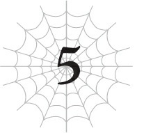
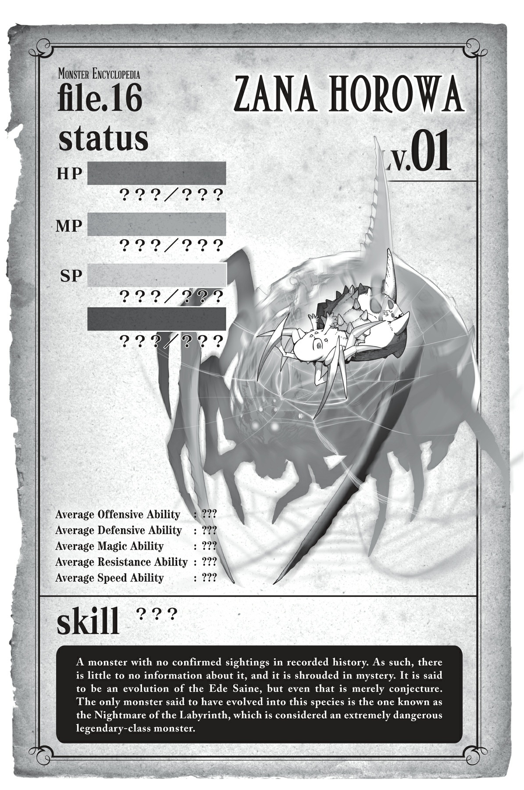

# Chương 5: Tiến hóa

*(Evolution)*

---

### --- TRANG 49 ---

Sau khi giải quyết xong con Taratect Thượng cổ, tôi kiểm tra lại xung quanh xem có an toàn hay không rồi mới thở phào nhẹ nhõm.

Tôi sống sót rồi!

Trời đất, đúng là một trận chiến kinh hoàng.

Tôi cứ tưởng việc bị Mẹ truy đuổi gắt gao đã đủ tệ rồi, vậy mà vừa chạy thoát cái là bị phục kích ngay lập tức sao?

Bà ấy thèm khát mạng sống của tôi đến mức nào vậy chứ?

Ý tôi là, rõ ràng bà ấy đang thật sự muốn lấy mạng tôi bằng mọi giá.

Nếu đây là một trò chơi, chắc chắn nó sẽ nhận phải những đánh giá cực kỳ tiêu cực vì độ khó quá phi lý.

Cảm giác giống như việc trùm cuối đột ngột xuất hiện ngay khi bạn vừa bước chân vào khu vực thực sự đầu tiên của game, và khi bạn bỏ chạy, bạn lập tức bị một đàn trùm phụ bao vây tấn công cùng một lúc vậy.

Thật không thể tin nổi.

Ở thời điểm này, sự kiệt sức tột cùng của tôi đã hoàn toàn lấn át niềm vui sướng khi sống sót.

Cả về mặt thể xác lẫn tinh thần.

Tôi chắc chắn đã cam chịu cái chết khá nhiều lần từ trước đến nay rồi, nhưng lần này là tình thế ngàn cân treo sợi tóc nhất.

Tôi thậm chí đã phải sử dụng [Tử Vong Tà Nhãn] — thứ mà tôi vốn coi là cấm kỵ vì đặc tính tự hủy của nó — cho một ván cược mà cơ hội sống sót của tôi thấp hơn rất nhiều.

Tôi đã từng trải qua không ít tình huống chỉ cần dính một đòn là mất mạng, nhưng chưa bao giờ giống như chuyện vừa xảy ra, khi cái chết bủa vây tôi từ mọi phía.

Tôi nghĩ lần cận kề cái chết nhất của mình trước đó là khi tôi rơi xuống Tầng Dưới và bị con ong đó chích, hoặc khi tôi chiến đấu với Alaba.

Việc chỉ còn cách cái chết đúng một đòn đánh có thể ập đến bất cứ lúc nào thật đáng sợ,

---

### --- TRANG 50 ---

nhưng việc bị dồn vào chân tường một cách từ từ mà không có lối thoát? Còn tệ hơn gấp bội.

Thật lòng đấy, xin đừng để chuyện đó xảy ra nữa.

Dù sao thì, cuộc khủng hoảng đó cũng đã qua, ít nhất là vào lúc này.

Vị trí hiện tại của tôi là một hồ dung nham nằm ở khoảng giữa Tầng Trung.

Vì điểm yếu sợ lửa của chúng, lũ nhện kia sẽ không đuổi theo tôi đến tận đây đâu. Hy vọng thế.

Ý tôi là, ngay cả HP của con Thượng cổ cũng bị giảm sút chỉ bằng việc đứng ở đây, nghĩa là bất kỳ con Taratect nào yếu hơn nó có lẽ sẽ bỏ mạng trong tích tắc.

Vấn đề lớn nhất là con nhện rối kỳ lạ mới xuất hiện kia.

Thứ đó thực sự có thể hoạt động được ở Tầng Trung.

Trời đất, cái thứ quái thai đó rốt cuộc là sao chứ?

Vì nó hoàn toàn không có trong sơ đồ tiến hóa từ Giáo sư [Trí Tuệ], nó chắc chắn là một dạng tiến hóa đặc biệt không nằm trong nhánh Taratect thông thường.

Có lẽ là một dạng đột biến chăng? Dù thế nào đi nữa, đó quả là một quân bài tẩy mà tôi ước gì bọn họ đừng bao giờ tung ra.

Nó có thể không đáng sợ bằng Mẹ, nhưng vì chỉ số của nó vượt mức 10.000, tôi chắc chắn không nghĩ mình có cơ hội chiến thắng trong một trận đấu trực diện.

Việc nó ngăn cản tôi bỏ chạy đã đủ tệ rồi, nhưng nếu thứ chủ động tấn công tôi lúc đó là nó thay vì lũ Thượng cổ, tôi chắc chắn đã gặp rắc rối lớn.

Nếu lũ Thượng cổ chặn lối đi trong khi con nhện rối kia ra đòn kết liễu tôi...

Ồ phải rồi, tôi tiêu đời là cái chắc.

Đó là tính toán sai lầm duy nhất của Mẹ.

Và chính sai lầm nhỏ nhoi đó đã cứu mạng tôi.

Dù sao thì đó vẫn là tình thế hiểm nghèo nhất mà tôi từng gặp phải.

Vậy giờ tôi nên làm gì đây?

Trước hết, tôi muốn biết Mẹ đang âm mưu trò gì.

Tôi đã cố gắng kết nối với các [Phân thân Tư duy] vẫn đang chiến đấu ác liệt với Mẹ ở mặt trạng thái tinh thần, nhưng dường như có một sự cản trở nào đó ở giữa chừng.

Mối liên kết của chúng tôi không bị cắt đứt hoàn toàn, nhưng có thứ gì đó đang gây nhiễu loạn giao tiếp.

Mối kết nối giữa tôi và Mẹ cũng đang mờ nhạt dần.

Suy đoán của tôi là Mẹ có thể theo dõi mọi hành động của tôi một cách hoàn hảo vì

---

### --- TRANG 51 ---

bà ấy đã sử dụng kỹ năng [Điều khiển Đồng loại] để giám sát tôi.

Chính khi lần đầu nhận ra tầm ảnh hưởng của kỹ năng đó, tôi đã quyết định dùng nó để phát động một cuộc phản công nhắm vào Mẹ. Việc nó vẫn đang kết nối chúng tôi lại với nhau là điều dễ hiểu.

Tôi đã lơ là cảnh giác về việc đó vì bà ấy không thể kiểm soát tôi, nhưng bà ấy hẳn đã có thể dùng nó để quan sát tôi.

Và nếu mối kết nối đó đang suy yếu như hiện tại, liệu điều đó có nghĩa là Mẹ cũng không thể nhìn thấy tôi nữa không?

Nếu đúng là vậy, thì bà ấy có thể sẽ tấn công lần nữa nếu mối kết nối phục hồi.

Bà ấy sẽ phát hiện ra tôi đang ở đâu.

Nhưng nói cách khác, điều đó có nghĩa là bà ấy có lẽ không biết tôi đang ở đâu vào lúc này. Có lẽ tôi có thể thư giãn một chút.

Tuy nhiên, tất cả những điều này chỉ là suy đoán lý thuyết, nên tôi tốt nhất là đừng quá tin tưởng vào nó.

Dù vậy, có lẽ điều này nghĩa là tôi không nên sử dụng [Thiên Lý Nhãn] để kiểm tra tình hình của Mẹ. Tôi sợ rằng nó sẽ thu hút sự chú ý của bà ấy.

Hiện tại, nếu tôi cứ bất động ở đây, ít nhất nó cũng giúp tôi câu giờ được vài ngày.

Nếu các [Phân thân Tư duy] của tôi có thể đánh bại Mẹ trong thời gian đó, thì mọi chuyện sẽ kết thúc.

Ngay cả khi không được, tôi cũng chẳng có cơ hội đánh bại bà ấy bằng xương bằng thịt. Chạy trốn là lựa chọn duy nhất của tôi.

Giờ thì tôi đã hiểu cảm giác của những tên tội phạm đang bị truy nã rồi.

Tôi sợ cảnh sát nhện lắm rồi.

Thôi, cứ tập trung vào những gì tôi có thể làm lúc này đã.

Khi tôi tiêu diệt con Thượng cổ lúc nãy, tôi đã lên cấp 30.

And giờ dòng chữ "Đủ Điều kiện Tiến hóa" đã xuất hiện trong bảng trạng thái của tôi.

Hê-hê-hê. Đúng thế rồi. Tôi lại có thể tiến hóa!

Đây chính là bước cuối cùng tôi cần trước khi đạt tới mục tiêu tiến hóa của mình, Arachne.

Tôi chỉ có một lựa chọn duy nhất: Zana Horowa.

Theo những gì tôi thấy trên cây tiến hóa, chủng tộc này đứng cùng đẳng cấp với Mẹ.

Tuy nhiên, xem xét các lần tiến hóa từ trước tới giờ, tôi đoán chỉ số của mình sẽ không đột ngột tăng vọt lên hay gì đâu.

Chỉ riêng việc tiến hóa sẽ không đột nhiên giúp tôi ngang hàng với Mẹ.

Có một điều chắc chắn là, ngay cả khi chủng tộc của chúng tôi ngang nhau, Mẹ vẫn đang ở cấp 89.

Tôi sẽ phải tiến hóa rồi cày cuốc lên tận cấp 89 mới có thể cạnh tranh nổi với mức đó.

---

### --- TRANG 52 ---

Dù vậy, nếu tôi tiến hóa, các chỉ số của tôi có lẽ sẽ tăng lên ít nhất là một chút, và biết đâu tôi còn nhận được thêm vài kỹ năng mới nữa.

Mặc dù tính đến thời điểm này, những kỹ năng duy nhất tôi nhận được từ tiến hóa toàn là mấy thứ như [Hủ thực Công kích] và [Tử Vong Tà Nhãn] — cực kỳ mạnh mẽ nhưng cũng tự gây ra hàng tá sát thương cho chính tôi!

Tôi sẽ hoàn không có khả năng tự vệ khi tiến hóa, nhưng tất cả các quái vật khác trong khu vực này đều đã bỏ chạy đi đâu hết trong lúc tôi nện con Thượng cổ ra bã rồi, nên chuyện đó không thành vấn đề.

Cách đây không lâu, việc tiến hóa ở đây là một rủi ro đe dọa tính mạng, nhưng giờ đây lũ quái vật đều tự giác cắm đầu chạy trốn khỏi tôi.

Điều đó hơi chán ở chỗ làm cho việc kiếm thức ăn trở nên khó khăn hơn, nhưng vào những lúc thế này, tôi thật sự biết ơn vì điều đó.

Bắt đầu tiến hóa thôi nào!

<Cá thể Ede Saine sẽ tiến hóa thành Zana Horowa.>

Vâng.

Ý thức của tôi... không hề bị mờ đi như mọi lần.

Hử?

Chuyện gì thế này?

Ồ, có lẽ là nhờ [Vô hiệu Kiệt sức]?

Đó là kỹ năng tôi nhận được cùng với danh hiệu [Kẻ Thống Trị Lười Biếng].

Nó không chỉ hóa giải các đòn tấn công thuộc tính Ngủ, mà còn ngăn chặn các tác động tiêu cực của việc thiếu ngủ.

Tôi có thể thức suốt hai mươi tư giờ một ngày, bảy ngày một tuần mà không phải chịu bất kỳ hình phạt nào.

Thêm vào đó, tôi vẫn có thể ngủ bình thường khi muốn. Quả là một kỹ năng cực kỳ tiện lợi.

Tôi đoán đây cũng là lý do vì sao tôi không bị ngất đi khi tiến hóa vào lúc này.

Vậy ra... đây là tiến hóa sao?

Cảm giác khá là kỳ lạ.

Không hề đau hay ngứa ngáy gì cả, nhưng giống như cơ thể tôi đang được tái cấu trúc từ trong ra ngoài vậy.

Cứ như thể tôi đang biến thành một thứ gì đó hoàn toàn khác biệt.

Nhưng thật kỳ lạ, cảm giác đó không hề tệ hay đáng sợ chút nào.

<Tiến hóa hoàn tất.>

<Chủng tộc đã thay đổi thành Zana Horowa.>

<Tất cả các chỉ số cơ bản đều gia tăng.>

---

### --- TRANG 53 ---

<Nhận được điểm thưởng thành thạo kỹ năng từ tiến hóa.>

Thế rồi cả đống kỹ năng của tôi thăng cấp liên tục.

Oa.

Tôi biết tiến hóa sẽ giúp cải thiện các kỹ năng của mình, nhưng việc nghe chúng được liệt kê ra hàng loạt thế này thực sự giúp tôi thấm thía mình đang sở hữu nhiều kỹ năng đến mức nào.

<Nhận được kỹ năng [Bất tử] do kết quả của tiến hóa.>

<Nhận được điểm kỹ năng.>

Hửm?

Hửmmmm?

Cho tôi xi-i-in lỗi?!

Tôi vừa mới nghe thấy cái gì thế kia?

Khoan đã.

Cô vừa bảo tôi nhận được cái gì cơ?

<Bất tử: Người sở hữu sẽ không còn phải chết bên trong hệ thống.>

Cáii gì cơơơ?!

Cô có chắc về chuyện đó không đấy?!

Làm sao mà chuyện này lại được phép xảy ra chứ?!

Cái cô D quái đản kia rốt cuộc là ngớ ngẩn đến mức nào mà lại thản nhiên trao cho tôi một kỹ năng như thế này chứ?!

Chúng ta đang nói về kỹ năng gian lận tối thượng mà con người đã khao khát theo đuổi suốt mọi không gian và thời gian đấy!

Ôi trời đất ơi! Giờ mới nói chuyện được chứ!

Nếu tôi không thể chết, chẳng phải điều đó có nghĩa là tôi có thể xông thẳng tới chỗ Mẹ nếu muốn sao?

Chúng ta đang nói về bất tử ở đây đấy!

Tôi có thể bị giẫm đạp, bị dính đòn phun thở, hay bị ma pháp thổi bay thành trăm mảnh, tôi vẫn sẽ không chết.

Tôi sẽ cứ tiếp tục tấn công như một con zombie.

Ngay cả một con quái vật vạn năng như Mẹ cuối cùng cũng sẽ cạn kiệt sức lực nếu phải chiến đấu với một kẻ địch không bao giờ chết.

Ha-ha-ha!

Ai mà ngờ được việc tiến hóa lại có thể giải quyết toàn bộ rắc rối của tôi một cách tình cờ như thế chứ?!

Nếu chỉ riêng việc tiến hóa thành chủng tộc này đã mang lại một kỹ năng bá đạo đến vậy, bảo sao nó được bảo là đứng cùng đẳng cấp với Mẹ.

Phù.

Dù sao thì, tôi tốt hơn nên ăn gì đó để hồi phục lượng thể lực đỏ đã mất trong quá trình tiến hóa.

Ngoạm lấy cái xác của con Thượng cổ, tôi mở bảng trạng thái của mình ra.

---

### --- TRANG 54 ---

`<Zana Horowa Cấp 1 Không tên>`

| Chỉ số | Giá trị |
| :--- | :--- |
| **HP** | 4.293/4.293 (lục) +1.800 (chi tiết) |
| **MP** | 13.292/13.292 (lam) +1.800 (chi tiết) |
| **SP (vàng)** | 2.873/2.873 (chi tiết) |
| **SP (đỏ)** | 1.445/2.873 +0 (chi tiết) |
| **Sức tấn công trung bình** | 2.833 (chi tiết) |
| **Sức phòng ngự trung bình** | 2.904 (chi tiết) |
| **Sức ma pháp trung bình** | 12.599 (chi tiết) |
| **Khả năng kháng tính trung bình** | 12.545 (chi tiết) |
| **Tốc độ trung bình** | 8.361 (chi tiết) |

**Kỹ năng:**
[Tự hồi phục HP nhanh LV 9] [Cực đỉnh Thần bí] [Ma Thần Đấu Pháp LV 3] [Truyền Ma Lực LV 8] [Ma lực Công kích LV 1] [Tự hồi phục SP nhanh LV 2] [Giảm tiêu hao SP tối thiểu LV 2] [Tăng cường Hủy diệt LV 7] [Tăng cường Cắt LV 5] [Siêu tăng cường Trạng thái bất thường LV 2] [Đấu Thần Đấu Pháp LV 1] [Truyền Năng lượng LV 6] [Long Lực LV 8] [Tấn công bằng Kịch độc LV 7] [Hủ thực Công kích LV 5] [Tấn công Dị giáo LV 6] [Tổng hợp Độc LV 10] [Tổng hợp Thuốc LV 8] [Thiên tài Tơ nhện LV 1] [Tơ Đa Năng LV 7] [Điều khiển Tơ LV 10] [Niệm lực LV 3] [Ném LV 10] [Bài xuất LV 4] [Cơ động Không gian LV 9] [Tập trung LV 10] [Gia tốc Tư duy LV 1] [Tương Lai Nhãn LV 1] [Phân thân Tư duy LV 8] [Xử lý Tốc độ cao LV 7] [Đánh trúng LV 10] [Né tránh LV 10] [Hiệu chỉnh Xác suất LV 7] [Ẩn mật LV 10] [Che giấu LV 3] [Vô thanh LV 9] [Bạo Vương LV 2] [Phán xét] [Hades] [Tha Hóa] [Bất tử] [Ma pháp Dị giáo LV 10] [Phong ma pháp LV 7] [Thổ Ma pháp LV 10] [Ma pháp Địa hình LV 3] [Ma pháp Bóng tối LV 10] [Ma pháp Hắc ám LV 10] [Hắc Ma pháp LV 5] [Ma pháp Độc LV 10] [Ma pháp Trị liệu LV 10] [Ma pháp Không gian LV 10] [Ma pháp Chiều không gian LV 5] [Ma pháp Vực sâu LV 10] [Kiên trì] [Kiêu ngạo] [Phẫn Nộ LV 4]

---

### --- TRANG 55 ---

[No Nê LV 8] [Lười Biếng] [Trí Tuệ] [Kháng Hủy diệt LV 6] [Kháng Va chạm LV 7] [Kháng Cắt LV 7] [Kháng Đâm LV 2] [Kháng Lửa LV 3] [Kháng Gió LV 4] [Kháng Đất LV 9] [Siêu kháng Trọng lực LV 2] [Vô hiệu Trạng thái bất thường] [Kháng Axit LV 7] [Kháng Thối rữa LV 8] [Kháng Ngất LV 6] [Siêu kháng Sợ hãi LV 1] [Vô hiệu Dị giáo] [Vô hiệu Đau] [Siêu giảm Đau LV 5] [Tăng cường Thị giác LV 10] [Thiên Lý Nhãn LV 8] [Chú Oán Tà Nhãn LV 7] [Ngưng Trệ Tà Nhãn LV 6] [Xích Lực Tà Nhãn LV 3] [Tử Vong Tà Nhãn LV 5] [Siêu tăng cường Ngũ quan LV 2] [Mở rộng Nhận thức LV 6] [Mở rộng Thần giới LV 7] [Thiên Lực] [Sinh mệnh Tối thượng LV 3] [Thuấn Thân LV 8] [Bền bỉ LV 8] [Ngoan cường LV 3] [Kiên cố LV 3] [Thần tốc (Skanda) LV 7] [Ma Vương LV 5] [Cấm kỵ LV 10] [n% I = W]

**Điểm kỹ năng:** 3.600

**Danh hiệu:**
[Kẻ Ăn Uế Tạp] [Kẻ Ăn Đồng Loại] [Sát thủ] [Kẻ diệt quái vật] [Người dùng Độc thuật] [Người dùng Tơ] [Kẻ Vô tình] [Kẻ tàn sát quái vật] [Kẻ Thống Trị Kiêu Hãnh] [Kẻ Thống Trị Kiên Trì] [Kẻ Thống Trị Trí Tuệ] [Kẻ diệt Phi Long] [Kẻ gieo rắc kinh hoàng] [Kẻ diệt Rồng] [Kẻ Thống Trị Lười Biếng] [Thiên tai Quái vật] [Quán quân]

Hửm.

Ừm, các chỉ số của tôi quả thực không gia tăng mạnh mẽ cho lắm.

Cũng giống như các lần tiến hóa trước, nó không khác biệt mấy so với một lần lên cấp bình thường.

Chỉ số ma pháp vẫn là khía cạnh duy nhất vượt quá 10.000, với tốc độ

---

### --- TRANG 56 ---

là thứ cao thứ hai kế đó.

Ngoại trừ [Bất tử], kỹ năng mới đáng chú ý nhất có lẽ là [Vô hiệu Trạng thái bất thường].

Hơn nữa, lúc nãy tôi bị phân tâm bởi [Bất tử] quá nên không nghe kỹ, nhưng có vẻ như khi tiến hóa tôi đã nhận được một danh hiệu gọi là [Quán quân].

Tôi nhận được kỹ năng [Kháng Trạng thái bất thường] đi kèm với nó, rồi tôi đoán tất cả các kỹ năng liên quan khác như [Kháng Độc] và [Vô hiệu Kiệt sức] đều đã bị gộp vào đó, khiến nó lập tức thăng thẳng lên cấp [Vô hiệu hóa] luôn.

`<Quán quân: Nhận được các kỹ năng [Tăng cường Hủy diệt LV 1] [Kháng Trạng thái bất thường LV 1]. Điều kiện nhận: được công nhận là một quán quân. Hiệu quả: áp đặt hiệu ứng thuộc tính Dị giáo "Sợ hãi" lên bất kỳ ai nhìn thấy người sở hữu. Giải thích: danh hiệu dành cho những người xứng đáng là quán quân.>`

Tốt lắm nhện con ơi! Giờ mày còn đáng sợ hơn trước nữa rồi!

Ở thời điểm này, chỉ cần nhìn thấy tôi thôi chắc cũng đủ để khiến một kẻ yếu tim (hoặc quái vật) ngất xỉu ngay tại chỗ.

Mà "được công nhận là một quán quân" nghĩa là sao chứ?

Được công nhận bởi ai cơ?

“Tất nhiên là bởi một quản trị viên rồi.”

Giọng nói ấy tuyệt đẹp nhưng lại mang lại cảm giác vô cùng bất an.

Tôi nhìn quanh và nhận ra có một chiếc điện thoại thông minh đang nằm ngay dưới chân mình.

Đó chính là nơi phát ra giọng nói vừa trả lời suy nghĩ nội tâm của tôi.

Cảnh tượng này trông quen quen. Thực tế là tôi mới chỉ nhìn thấy điện thoại thông minh ở thế giới này đúng một lần duy nhất, nên không thể sai được.

Đây chắc chắn là kẻ tự xưng "tà thần" D.

Ừm, cứ giả vờ như tôi không nhìn thấy gì đi.

Không hề nha. Tôi chẳng nhìn thấy gì hết. Tôi cũng không thèm nghe đâu.

“Alô? D đây.”

La la laaa...

Tôi không nghe thấy gì hết á.

“Ơ kìa, lạ chưa. Ai lại để cái nút tự hủy nhện này vào tay tôi thế nhỉ?”

Tôi xin lỗi! Xin hãy tha thứ cho tôi!

Mà khoan đã, cái nút đó là thế nào hả?!

Cô làm ra nó từ lúc nào thế?!

“Tôi đùa đấy. Tôi làm gì có thứ đó. Dù sao thì, nếu tôi thích, tôi chẳng cần công cụ nào cũng có thể biến cô thành một màn pháo hoa lộng lẫy được mà.”

Ơ... đáng sợ thật đấy.

---

### --- TRANG 57 ---

Câu đó chẳng làm tôi thấy khá hơn tí nào cả.

“Đừng lo lắng. Tôi sẽ không đời nào lãng phí một tài năng mới nổi đầy hài hước như cô đâu.”

Ồ, thật vậy sao?

Ôi trời, thật là vinh hạnh quá.

Vậy nhé, nói chuyện với cô vui lắm.

“Kích hoạt tự hủy nhé?”

Tôi xin lỗi!

“Thôi nào, tôi đùa đấy. Vui vẻ lên đi.”

Này, giọng của cô lúc nào cũng cứ đều đều một tông như thế thì ai mà biết được là cô đang đùa chứ.

“Ừ, nhiều người cũng nói thế lắm.”

Cô thực sự muốn cái gì hả?

“Tôi chỉ muốn chúc mừng cô thôi. Vì đã đạt được bất tử.”

Ồ. Cảm ơn.

Này, tại sao cô lại tạo ra một kỹ năng như thế chứ?

“Cô nghĩ mục tiêu cuối cùng mà con người hướng tới là gì khi họ đã thỏa mãn mọi thứ?”

Hả?

“Của cải, danh tiếng, sức mạnh, quyền lực, và tất nhiên là sự trẻ mãi không già hay bất tử. Đó là tất cả những gì con người luôn mong muốn, bất kể họ đến từ thế giới nào. Và nếu họ biết rằng mình thực sự có thể đạt được điều đó, cô nghĩ họ sẽ làm gì?”

Làm bất cứ điều gì để đoạt lấy nó, tôi đoán thế.

Ồ, hóa ra là vậy.

“Chính xác. Con người luôn thích đấu tranh vì một điều gì đó, ngay cả khi họ biết mình sẽ không bao giờ chạm tới được. Họ sẽ hy sinh mọi thứ. Rồi họ sẽ cố gắng, cố gắng nữa, để rồi cuối cùng bỏ mạng mà chẳng bao giờ có được thứ mình muốn. Và các quản trị viên chúng tôi sẽ vui vẻ tiếp nhận những thành quả lao động ngọt ngào đó của họ. Quả thực rất hiệu quả, cô có đồng ý không?”

Người đâu mà đáng sợ thế không biết.

“Thì tôi là tà thần mà.”

Thế thì tại sao cô lại để tôi có được nó?

“À, Zana Horowa vốn dĩ là một chủng tộc quái vật bất tử (undead). Tuy nhiên, tôi chưa từng nghĩ sẽ có cá thể nào thực sự tiến hóa thành nó cả.”

Này, khoan đã.

---

### --- TRANG 58 ---

Thế nghĩa là tôi không nên chọn nó sao?

“Không, tôi chắc chắn không nói thế. Chỉ là bước tiến hóa trước đó, Zoa Ele, đã rất hiếm gặp rồi, và nó còn được thiết kế để chết trước khi kịp tiến hóa nữa.”

Hả? Nghĩa là sao?

“Tiến hóa thành Zoa Ele sẽ nhận được [Hủ thực Công kích], cô nhớ chứ? Tuy nhiên, nó lại không đi kèm với [Kháng Thối rữa].”

Hả? Thật thế sao?

“Đúng vậy. Do đó, nếu một Zoa Ele bình thường sử dụng [Hủ thực Công kích], nó cũng sẽ chết ngay lập tức. Cô thật may mắn khi có sẵn [Kháng Thối rữa] đấy nhỉ?”

Trời đất!

Thật sao?

Thế thì tôi suýt chút nữa đã tự sát rồi.

“Nhờ có kháng tính đó, cô chỉ bị mất khả năng sử dụng chiếc lưỡi hái của mình. Bình thường thì cô đã mất mạng ngay tại chỗ rồi.”

Đúng là đồ lỗi mà.

“Đòn tấn công đó giết chết cả bản thân lẫn đối thủ. Đó là lý do vì sao Zoa Ele lại bị coi là biểu tượng của sự xui xẻo.”

À.

Thảo nào lại xui xẻo thế.

Mà nói thế thô lỗ quá đấy.

“Ede Saine cũng tương tự vậy, vì nó nhận được [Tử Vong Tà Nhãn] thậm chí còn mạnh hơn. Kiểu gì nó cũng sẽ chết trước khi tiến hóa.”

Đã có con nào từng tiến hóa thành Zana Horowa trước đây chưa?

“Chưa có một con nào cả. Cho nên mới cần phải chúc mừng cô chứ. Cô đã trở thành một con quái vật hoàn toàn độc nhất vô nhị rồi. Hoan hô, hoan hô.”

Nghe thì cũng tuyệt đấy, nhưng không hiểu sao nghe từ miệng cô thì tôi chẳng thấy vui vẻ gì cho cam.

“Sau khi tôi đã có lòng tốt chúc mừng cô thế này ư?”

Ý tôi là, nhìn vào những gì cô làm từ trước tới giờ... cô tự hiểu đi?

“Thì tôi là tà thần mà.”

Hừ.

Hết [Cấm kỵ] rồi đến [Bất tử] này nọ, cô thực sự là kẻ tệ hại nhất.

“Tôi ước gì cô dùng từ ngữ hoa mỹ hơn một chút. Ví dụ như có thể gọi tôi là hiện thân của ác ý chẳng hạn.”

Không đời nào tôi nói thế đâu.

Tuy nhiên tôi sẽ bảo cô là đồ xấu tính.

---

### --- TRANG 59 ---

“Cô không nghĩ hệ thống [Cấm kỵ] được thiết kế một cách xuất sắc sao?”

Chắc chắn là không rồi.

Tôi về cơ bản chỉ là một kẻ ngoài cuộc ở đây, nên nó chủ yếu khiến tôi thấy khó chịu, nhưng một cư dân bình thường của thế giới này chẳng phải sẽ phát điên ngay khi họ đạt cấp tối đa của [Cấm kỵ] sao?

“Tôi đoán những con người đạt cấp tối đa của [Cấm kỵ] trong quá khứ đều không có một kết cục mấy tốt đẹp.”

Ừ, tôi cũng nghĩ thế.

“Nhưng thế mới gọi là Cấm kỵ chứ.”

Trời ạ, cô bị làm sao thế?

Đúng là gieo nhân nào gặp quả nấy.

“Cô dường như không ở vị thế có thể đưa ra những nhận xét như vậy đâu.”

Ồ, phải rồi.

Tôi phải giải quyết Mẹ bằng cách nào đó, nếu không tôi sẽ không bao giờ được nhìn thấy ánh mặt trời nữa.

Ý tôi là theo nghĩa đen, tôi sẽ không thể bước ra ngoài.

“Vì cô dường như không tự ý thức được chuyện này, tôi có nên nhắc nhở cô rằng đòn tấn công này của cô không nằm trong hệ thống không?”

Ồ, thật vậy sao?

“Ít nhất thì tôi không nhớ là mình từng thiết lập một kỹ năng nào cho phép thực hiện những gì cô đang làm lúc này cả.”

Hử.

Well, đúng là tôi cũng cảm thấy mình không thực sự sử dụng kỹ năng để tấn công Mẹ bằng các [Phân thân Tư duy] của mình.

Khoan đã, thế nghĩa là tôi đang sử dụng một phần trường thần giới của mình sao?

“Chính xác là vậy.”

Hê-hê-hê.

Xem ra tôi sắp sửa trở thành thần thánh tới nơi rồi.

“Tôi rất mong chờ đấy.”

Ơ, tôi tưởng cô sẽ vặn lại tôi câu đó, chứ không phải thản nhiên hùa theo thế đâu...

“Không, tôi nói nghiêm túc mà. Tôi hy vọng một ngày nào đó cô sẽ chạm tới được lĩnh vực của chúng tôi.”

Thật sao?

“Ừ.”

Mục tiêu chính xác của cô là gì thế?

---

### --- TRANG 60 ---

“Tôi đã nói với cô trước đây rồi. Để giải trí.”

Ồ phải rồi.

Hình như cô nói thế thật.

“Hôm nay tâm trạng tôi khá tốt. Cô có muốn tôi chia sẻ một số thông tin cho cô không?”

Thật á?!

“Ừ. Trong phạm vi khả năng của mình, tôi rất vui lòng trả lời bất kỳ câu hỏi nào của cô về thế giới này.”

Oa, thật sao?

Hửm. Thế tôi nên hỏi gì đây nhỉ?

Vậy thì, trước hết, tại sao tôi lại đầu thai vào thế giới này?

“À, được rồi. Tôi sẽ giải thích chi tiết cho cô nghe nhé? Hãy bắt đầu từ đầu. Trước tiên, cô đã chết ở Nhật Bản trên Trái Đất. Cô vẫn đang theo kịp chứ?”

Vâng.

Vậy ra tôi thực sự đã chết rồi sao...?

Tôi cũng đoán được phần nào rồi.

“Nguyên nhân cái chết của cô thực chất có liên quan đến Anh hùng và Ma Vương của thế hệ trước.”

Hả?

Tại sao Anh hùng và Ma Vương ở thế giới này lại có ảnh hưởng đến Trái Đất chứ?

“Anh hùng và Ma Vương đời trước đều là những người sử dụng ma pháp vô cùng tài ba. Họ đã biến đổi [Ma pháp Chiều không gian] để tạo ra một phép thuật vượt qua ranh giới giữa các thế giới.”

Chuyện đó cũng làm được sao?

“Tất nhiên là được. Không có gì ngăn cản cả. Tuy nhiên, hệ thống không hỗ trợ cho bất kỳ kỹ thuật nào nằm ngoài bản thân nó. Cư dân của thế giới này đã quá quen với sự hỗ trợ của hệ thống nên không thể tự mình kiểm soát một cổ tự phức tạp như vậy. Kết quả là phép thuật đã phản phệ. Khi vượt qua các chiều không gian, nó đã phá hủy một phần trường MA. Sau đó, nó phá vỡ rào cản giữa các thế giới và thật không may, phát nổ ở Trái Đất, tại Nhật Bản, ngay trong một lớp học trung học phổ thông.”

Oa.

Đúng là gây họa cho người khác mà.

Phải ngu ngốc đến mức nào mới phá hủy một phần trường MA chứ?

Chưa kể còn làm tôi mất mạng nữa! Cảm ơn nhiều nha.

---

### --- TRANG 61 ---

“Đúng vậy. Cuối cùng tôi đã phải rà soát lại toàn bộ hệ thống của thế giới này, điều chưa từng được thực hiện kể từ khi nó được tạo ra.”

Hả?

“Tôi đã nói rồi, cô nhớ chứ? Tôi là người ngoài cuộc ở thế giới hiện tại của cô. Việc quản lý nó là nhiệm vụ của các quản trị viên khác. Đúng là tôi đã cung cấp bản thân hệ thống, nhưng tôi sẽ không làm gì thêm cả.”

Cô nói thế mà rõ ràng cô cứ can thiệp suốt đấy thôi.

“Tôi không có lựa chọn nào khác. Dù đó là hậu quả từ việc Anh hùng và Ma Vương của thế giới này làm loạn, những học sinh trung học vô tội kia vẫn bị giết và bị cuốn vào hệ thống. Bản thân tôi cũng chịu một phần trách nhiệm, nên tôi nghĩ với tư cách là người tạo ra hệ thống, đây là điều tối thiểu tôi có thể làm để giúp đỡ họ một chút.”

Hửm?

Một phần trách nhiệm?

Các học sinh trung học, số nhiều sao?

“Tính đến hiện tại, có hai mươi lăm người Trái Đất cũ đã đầu thai vào thế giới này. Toàn bộ lớp học đã bị hủy diệt tàn khốc, không một ai sống sót. Và linh hồn của những người thiệt mạng trong vụ nổ đó đã bị cuốn vào hệ thống thế giới này, vì vậy họ đều được đầu thai tại đây. Nếu cứ để mặc, linh hồn của họ sẽ bị tan rã. Đó là lý do tôi đã tự mình can thiệp và ban cho họ kỹ năng 'n% I = W'. Với kỹ năng này, họ sẽ có thể giữ lại sức mạnh, ký ức và những thứ tương tự của linh hồn mình. Sau đó, tôi tặng cho mỗi người một kỹ năng miễn phí dựa trên năng lực của họ, và rộng lượng đảm bảo rằng họ sẽ được tái sinh thành những chủng tộc có bước sóng tương đồng với linh hồn gốc. Nếu cô hỏi tôi, thì đó là điều tối thiểu tôi có thể làm.”

Oa, thật sao?

Vậy ra ngoài tôi ra vẫn còn những người khác...

Hửm?

Khoan đã, lớp chúng tôi có bao nhiêu người ấy nhỉ?

Có hai mươi nhăm học sinh đúng không?

Vậy nếu tính cả giáo viên chủ nhiệm thì là hai mươi sáu người.

Chẳng phải chúng ta đang thiếu mất một người sao?

---

### --- TRANG 62 ---

“Đúng vậy. Người đó chính là tôi.”

Khoan đã, cô á?!

Cáii gì cơơơ?

Cô từng ở trong lớp chúng tôi sao?

“Phải. Đó là lý do vì sao phép thuật mà Anh hùng và Ma Vương tạo ra lại tác động trúng ngay lớp học đó.”

Cái gì cơ?

Này, nhân tiện thì, tên của cô là gì thế?

“Bí mật nhé.”

Ơ, cái gì chứ?

Thôi nào, cô là ai vậy?

Tôi không nhớ trong lớp có ai giống cô cả...

“Thôi, đừng nói về tôi nữa. Điểm mấu chốt là toàn bộ sự việc xảy ra là vì tôi — quản trị viên tối cao của hệ thống — đang ở trong lớp học đó. Đó là lý do vì sao tôi chịu một phần trách nhiệm. Và thế là tôi đã can thiệp vào thế giới này vì nghĩa vụ.”

Ra vậy...

Thảo nào tôi lại có [Thần tốc (Skanda)] ngay từ đầu. Nhưng còn [Trí Tuệ] thì sao?

Tôi cứ có ấn tượng là cô đã hoàn thành cái "nghĩa vụ" đó ngay khi đưa tất cả chúng tôi đầu thai rồi chứ.

“Như tôi đã nói, đó là phần thưởng cho sự làm việc chăm chỉ của cô.”

Ồ, phải rồi.

Xem ra tôi nợ cô một lần rồi nhỉ.

Cảm ơn.

“Không có gì.”

Vậy cô trao cho tôi kỹ năng [Trí Tuệ] đó, để tôi đạt cấp tối đa của [Cấm kỵ], rồi bây giờ cô muốn tôi giải cứu thế giới sao?

“Tôi chưa từng nói lời nào như thế cả. Cô hoàn toàn tự do làm bất cứ điều gì mình muốn ở thế giới này. I sẽ không ngăn cản cô, cũng không chỉ đạo cô. Tôi chỉ đơn giản là một người quan sát mà thôi.”

Hy vọng là thế thật...

“Cô có vẻ không tin tưởng tôi nhỉ.”

Ý tôi là, dù sao cô cũng là "tà thần" mà.

“Cũng đúng thật.”

Ồ, tôi biết rồi.

Mà Anh hùng và Ma Vương rốt cuộc đã cố gắng làm gì với thứ ma pháp điên rồ đó thế?

“Tôi nghĩ có lẽ họ đang cố gắng đánh bại tôi.”

Tại sao chứ?

“Có vẻ như họ có xu hướng coi các quản trị viên là kẻ thù.

---

### --- TRANG 63 ---

Biết đâu có ai đó khác đang xúi giục họ chăng.”

Thế chẳng phải nghĩa là bọn họ ngu ngốc hết thuốc chữa sao?

Hừ.

Tôi không thể tin được mình lại chết chỉ vì một cặp bài trùng ngớ ngẩn gây ra một vụ tai nạn giao thông liên hoàn khổng lồ như thế.

Đúng là ngu xuẩẩẩn hết sức.

“Thôi thì tôi đã làm xong phần việc của mình rồi, nên bây giờ cô muốn làm gì sau khi đầu thai sang thế giới khác là tùy ở cô.”

Ồ, phải rồi.

Tôi đoán thế.

Cô biết đấy, làm vậy là khá tử tế đối với một tà thần rồi.

Thật lòng cảm ơn vì đã cứu mạng tôi nha.

“Đừng khách sáo.”

Thế cô nghĩ ai là kẻ đã xúi giục Anh hùng và Ma Vương?

“Nếu tôi nói cho cô biết phần đó thì còn gì vui nữa. Cô phải tự mình tìm hiểu thôi.”

Xì.

Cái đó mà cô cũng không chịu nói sao?

“Như thế mọi chuyện mới giải trí hơn chứ.”

Đồ xấu tính.

Mà nhân tiện, lúc nãy cô bảo là cô dựa trên bước sóng linh hồn hay gì đó để chọn chủng tộc tương đồng, nhưng... tôi lại là nhện đúng không?

“Đúng vậy.”

Thế linh hồn của tôi gần gũi với loài nhện nhất sao?

“Ừ, có vẻ như bước sóng khớp nhau khá tốt. Nhân tiện thì, hầu hết những người khác đều đầu thai làm con người.”

Cáii gì cơơơ?!

Tại sao lại là tôi?!

Tại sao tôi lại là nhện chứ?!

Tôi cũng muốn làm người mà!

Tại sao tôi lại phải chơi trò chơi sinh tồn ngay từ lúc mới lọt lòng thế này?!

“Tôi có thể hiểu được sự bực bội của cô, nhưng chính nhờ sinh ra là nhện mà cô mới có được một lợi thế đi trước cực kỳ lớn đấy. Nó không hẳn là điều tồi tệ đâu, cô có đồng ý không?”

Lợi thế đi trước?

“Chính xác. Những người khác hiện tại đều vẫn đang là trẻ sơ sinh.”

---

### --- TRANG 64 ---

...Ồ.

Ra vậy. Tôi đoán là tính từ lúc tôi sinh ra tới giờ cũng chưa lâu lắm.

“Có lý do đó, nhưng cũng là vì cô được sinh ra nhanh hơn con người rất nhiều. Tính theo lịch Trái Đất, cô ra đời sớm hơn bọn họ khoảng sáu tháng.”

Hửm.

Vậy là tôi có lợi thế đi trước nửa năm, và giờ tôi đã lớn như thổi trong khi bọn họ vẫn đang nằm trong nôi kêu "o-e o-e" sao?

“Đúng vậy đấy. Cô còn câu hỏi nào khác không?”

Có chứ, ngay từ đầu tại sao cô lại tạo ra một hệ thống phiền hà như thế này hả?

Với sức mạnh của cô, chẳng lẽ không có cách nào khác để giải quyết vấn đề mà không cần đến nó sao?

“Tôi có muốn giải quyết cái gì đâu. Tôi là tà thần cơ mà, cô nhớ chứ?”

Ừ, cũng đúng.

“Được rồi, tôi rất mong chờ xem những hành động thú vị tiếp theo của cô đấy.”

Hoặc cô có thể ngừng theo dõi tôi đi.

“Ồ, nhưng tôi vẫn sẽ xem chứ. Rất có thể là một tay cầm gói khoai tây chiên, tay kia cầm máy chơi game.”

Chà, nghe thảnh thơi quá nhỉ.

Cái gì cơ, cô vẫn đang ở Nhật Bản sao?

“Đúng vậy.”

Không công bằng chút nào!

“Khoai tây chiên này ngon lắm nha. Ồ, còn có cả loại kem mới vừa ra mắt nữa. Có lẽ lát nữa tôi sẽ ăn thử xem sao.”

Chết đi!!!

Kemmm...

“Tôi có vị sô-cô-la và va-ni. Cô nghĩ tôi nên ăn vị nào trước đây?”

Câm miệng và chết đi!

Đừng có kể lể với tôi về mấy món tráng miệng ngon lành đó nữa!

“Chắc là tôi nên nuông chiều bản thân một chút và ăn cả hai vị cùng lúc vậy.”

Gaaah!

“Được rồi, hôm nay đùa thế là đủ rồi. Tôi đang cổ vũ cô đánh bại bà ấy đấy nhé. Hy vọng cô sẽ sống sót để tiếp tục mua vui cho tôi.”

Chắc chắn rồi. Tôi sẽ không chết cho đến khi tát thẳng vào mặt cô và cướp lấy cây kem đó đâu!

---

### --- TRANG 65 ---

“Tôi rất mong chờ đấy. Vậy nhé, tạm biệt cô.”

Chiếc điện thoại thông minh tan biến.

Kẻ tự xưng là tà thần đó chỉ nói chuyện phiếm với tôi một lúc rồi rời đi.

Khi chiếc điện thoại đã biến mất, tôi dành một chút thời gian để thả lỏng sự căng thẳng trên cơ thể.

Tôi đã cố tỏ ra như đang trò chuyện thoải mái, nhưng thực chất tôi lại cực kỳ lo lắng.

D tự nhận mình là một tà thần.

Và chuyện có cái nút tự hủy nhện kia có thể là một trò đùa, nhưng việc cô ta có thể giết tôi bất cứ lúc nào là hoàn toàn có thật.

Kẻ "tà thần" đó có thể kết liễu mạng sống của tôi dễ dàng như việc bật TV bằng điều khiển từ xa vậy.

Vì lý do nào đó, D dường như đủ thích tôi để giữ cho tôi sống sót vào lúc này, nhưng điều đó có thể thay đổi bất cứ khi nào.

Đúng như lời D nói: Vận mệnh của thế giới, sự sống chết của người khác, tất cả những điều đó chỉ là trò tiêu khiển đối với bọn họ.

Việc lựa chọn có giết chóc hay không cũng vậy.

D không bận tâm, miễn là nó tạo nên một buổi trình diễn thú vị.

Và tôi không nghĩ D thực sự cho chúng tôi đầu thai vì nghĩa vụ như cô ta tuyên bố.

Nhiều khả năng, D làm vậy chỉ vì như thế sẽ thú vị hơn.

Ít nhất thì đó là suy đoán của tôi.

Tôi rất biết ơn vì D đã cho tôi đầu thai sau khi tôi qua đời.

Tuy nhiên, điều đó đồng nghĩa với việc những người đầu thai chúng tôi chẳng qua chỉ là món đồ chơi của D, bất kể chúng tôi có làm gì đi nữa.

Và điều đó khiến tôi thấy vô cùng khó chịu.

Thế nhưng tôi cũng chẳng thể làm được gì.

Tôi chắc chắn vị thần tàn nhẫn đó biết rõ tôi cũng cảm thấy như vậy.

Tôi dám cá là tên khốn đó đang cười thầm phấn khích.

---

### --- TRANG 66 ---
