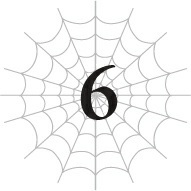

# Chương 6: Chiến tranh du kích

*(Guerrilla Warfare)*

---

### --- TRANG 66 ---

Tôi đã ở Tầng Trung được vài ngày rồi.

Đã đến lúc củng cố lại các kế hoạch của mình.

Trước hết, tôi chắc chắn sẽ không ngu ngốc đến mức lao vào tấn công trực diện Mẹ.

Ngay cả khi đã tiến hóa và có thêm kỹ năng Bất tử mới, tôi đơn giản là vẫn không nghĩ mình có thể đánh bại bà ấy.

Chỉ số của bà ấy vượt trội so với tôi nhiều đến mức ngay cả một cuộc tấn công kiểu zombie cũng chẳng ăn thua.

Trong trường hợp này, lựa chọn khôn ngoan nhất là chờ đợi cho đến khi các Phân thân Tư duy giải quyết xong mọi việc.

Hơn nữa, tôi nghe rất rõ D đã nói thế này:

“Tôi đang cổ vũ cô đánh bại bà ta đấy nhé. Tôi hy vọng cô sẽ sống sót và tiếp tục làm tôi vui vẻ.”

Sống sót.

D thừa biết tôi vừa nhận được kỹ năng Bất tử nhưng vẫn dùng từ “sống sót”.

Điều đó có nghĩa là ngay cả khi có kỹ năng Bất tử, việc chết đi không phải là không thể.

Chắc chắn phải có kẽ hở nào đó để kết liễu một kẻ sở hữu kỹ năng Bất tử.

Nếu không thì tôi không nghĩ D lại dùng cách diễn đạt như vậy.

Ví dụ điển hình nhất là tôi vẫn có thể bị phong ấn vĩnh viễn.

Tôi không muốn bị chôn vùi trong bê tông suốt cả đời hay đại loại thế đâu.

Có lẽ tôi chỉ nên coi Bất tử là phương án cuối cùng.

Trong trường hợp đó, vấn đề tiếp theo tôi cần giải quyết là con nhện rối kia.

Nhưng tôi nghĩ mình cũng chẳng thể thắng nổi thứ đó trong một trận chiến trực diện.

Có lẽ tôi có thể thử tận dụng điểm yếu của nó hay gì đó, giống như tôi từng làm với

---

### --- TRANG 67 ---

Alaba, nhưng tỉ lệ thắng vẫn sẽ không cao cho lắm.

Tạm thời gác chuyện đó lại đã.

Tôi sẽ tránh mặt Mẹ cùng con nhện rối kia, và thay vào đó sẽ nhắm vào phần còn lại của quân đoàn nhện.

Cụ thể, tôi sẽ ẩn nấp ở Tầng Trên, chờ đợi thời cơ và tiêu diệt từng đứa một.

Đây chính là chiến tranh du kích!

Tôi đoán là có thể có nhiều hơn một con nhện rối đáng ghét như vậy, nhưng chỉ cần tôi đảm bảo sẽ dịch chuyển đi ngay khi tình hình trở nên nguy hiểm, hy vọng tôi vẫn sẽ xoay xở được bằng cách nào đó.

Suy cho cùng, tôi thực chất chỉ đang câu giờ bằng những đòn tấn công nửa vời trong lúc chờ các Phân thân Tư duy đánh bại Mẹ.

Trông cậy cả vào các cậu đấy, các Phân thân Tư duy.

Tốt hơn hết tôi nên trốn khỏi Tầng Trung ngay bây giờ khi mối nguy hiểm đang cận kề.

Phải. Dù vẫn còn khá xa, nhưng Mẹ đã tiến vào Tầng Trung.

Điều đó có nghĩa là tôi không thể ở lại đây thêm nữa.

Nếu không thì tôi đã trốn biệt ở Tầng Trung bao lâu tùy thích rồi. Nhưng Mẹ sẽ không để tôi toại nguyện dễ dàng thế đâu.

Bà ấy thực sự giống như một bà mẹ tận tụy, ép cô con gái ru rú trong nhà của mình phải ra ngoài vậy.

Được rồi, được rồi, thưa Mẹ.

Con sẽ đi ra ngoài một chút.

Giờ thì tôi đã ở Tầng Trên.

Này, Tầng Trên. Lâu rồi không gặp nhỉ.

Do tôi ảo tưởng, hay là nơi này đã thay đổi một chút kể từ lần cuối tôi ở đây nhỉ?

Cụ thể là có một số lượng khổng lồ các quái vật nhện đang bò lổm ngổm khắp nơi.

Chắc chắn Mẹ đã đẻ trứng ở trên này.

Bà ấy có kỹ năng [Đẻ Trứng], tính năng đúng như tên gọi của nó.

Bà ấy có thể tự sinh con một mình bằng hình thức sinh sản vô tính.

Tôi tin chắc mình cũng được sinh ra theo cách đó.

Thông thường, lũ nhện con này sẽ đi loanh quanh ăn thịt lẫn nhau hoặc

---

### --- TRANG 68 ---

bị các quái vật khác xơi tái. Thế nhưng lần này, sự kiểm soát của Mẹ đã hợp nhất tất cả bọn chúng lại để đuổi theo tôi.

Bà ấy có lẽ không trông mong bọn chúng có thể giết được tôi, nhưng bà ấy có thể dùng chúng để xác định vị trí tôi xuất hiện.

Vậy thì tôi cũng xin nhận lòng tốt này vậy.

Các người thực sự nghĩ mình có thể bắt kịp tôi khi tôi có thể dùng [Dịch chuyển] sao?

Cuộc đi săn nhện bắt đầu nào!

Tôi chẳng sợ mấy con Taratect Thứ cấp mới sinh yếu ớt đâu!

Thực ra, ngay cả khi tôi chẳng làm gì, có khi chúng cũng tự lăn ra chết thôi.

Chúng yếu một cách lố bịch, y hệt như tôi ngày xưa.

Quá yếu luôn!

Yếu đến mức... tôi gần như thấy hơi tội lỗi.

Tôi không biết có bao nhiêu đứa được sinh ra trong một lần đẻ trứng, nhưng có bao nhiêu con thực sự sống sót đủ lâu để tiến hóa đây? Một hay hai? Hay thậm chí là không có con nào cả?

Điều đó nghĩa là tỉ lệ sống sót của tôi chắc chỉ chưa đầy 1%, vậy mà bằng cách nào đó tôi vẫn vượt qua được.

Mặc dù vậy, vì tôi có phần thưởng tái sinh dưới dạng kỹ năng [Thần tốc (Skanda)], tôi nghĩ trường hợp của mình không thực sự giống như thế.

Oa. Nghĩ về việc mình đã phải chật vật đấu tranh thế nào hồi đó làm tôi thấy hơi buồn. Đủ để tôi cảm thấy chút đồng cảm với lũ em trai em gái hay gì đó của mình.

Nhưng mà thôi, thế giới cá lớn nuốt cá bé mà. Tốt hơn là nên gạt nó đi và bắt đầu tàn sát thôi.

Hửm? Tàn nhẫn á?

Thôi đi, tôi làm gì còn lựa chọn nào khác chứ.

Trong lúc tôi dọn dẹp lũ Tiểu Taratect Thứ cấp với số lượng lớn, vài con Taratect trưởng thành nghe thấy tiếng động và chạy tới.

Tôi kết liễu chúng dễ dàng như nhau.

Đúng là một con Taratect trưởng thành có các chỉ số nhảy vọt, nhưng giờ chuyện đó chẳng là gì đối với tôi.

Vào lúc này, chỉ những con thuộc cấp Vĩ đại (Greater) trở lên mới có thể đối đầu với tôi.

Ngay cả khi đó, một con cấp Vĩ đại cũng không thể đánh bại tôi trừ khi có phép màu nào đó xảy ra.

Đúng là tôi từng bị sốc khi lần đầu nhìn thấy một con Taratect Vĩ đại ở Tầng Dưới, nhưng giờ điều duy nhất gây sốc là tôi đã mạnh hơn chúng bao

---

### --- TRANG 69 ---

nhiêu, nếu tôi tự cho phép mình tự mãn một chút.

Tiếp tục cuộc thảm sát trong khi ngẫm nghĩ những điều này, kỹ năng [Phát hiện] cảnh báo tôi về một thứ gì đó đang nhanh chóng tiếp cận.

Nó đang di chuyển với tốc độ cực nhanh và có vẻ ngoài cỡ bằng một con người.

Không nghi ngờ gì nữa. Đó chính là con nhện rối.

Ngay giây phút cảm nhận được điều đó, tôi lập tức bỏ chạy theo hướng ngược lại trong lúc chuẩn bị sẵn thuật thức [Dịch chuyển].

Sau đó, tôi dịch chuyển đi trước khi nó kịp đuổi kịp.

Cảnh vật xung quanh tôi biến đổi, và giờ tôi đã ở ngoài trời, nơi Mẹ suýt chút nữa đã giết tôi.

Nếu cứ tiếp tục ở trong mê cung, sớm muộn gì tôi cũng sẽ không còn chỗ để trốn nữa. Nhân cơ hội này, tôi nên mở rộng phạm vi hoạt động ra bên ngoài một chút, điều này cũng có điểm cộng là tăng số lượng điểm dịch chuyển tiềm năng.

Tôi đi lang thang ngoài trời một lúc trong khi chờ tình hình trong mê cung hạ nhiệt.

Sau đó, khoảng một ngày trôi qua, tôi dịch chuyển trở lại Tầng Trên và tiếp tục cuộc săn nhện.

Cứ thế lặp đi lặp lại.

Sau vài ngày thực hiện quy trình này, cuộc săn nhện của tôi đang tiến triển rất tốt đẹp.

Tôi đã hạ được một con cấp Thượng cổ (Arch), sáu con cấp Vĩ đại (Greater) và vô số những con cấp thấp hơn khác trong quá trình này.

Tôi đặc biệt tự hào khi có thể đánh bại dù chỉ một con cấp Thượng cổ.

Tôi nói thì to mồm thế thôi, chứ cấp Thượng cổ vẫn là những kẻ địch vô cùng mạnh mẽ.

Tôi có thể đối phó tốt với một con đơn lẻ, nhưng nếu có từ hai con trở lên, cơ hội chiến thắng của tôi sẽ tụt dốc không phanh.

Tôi không biết tổng cộng có bao nhiêu con cấp Thượng cổ khác, nhưng việc có thể loại bỏ dù chỉ một con khỏi cuộc chơi cũng là một thành quả lớn.

Ngoài ra, dựa trên việc con nhện rối liên tục đuổi theo tôi, tôi khá chắc chắn rằng chỉ có duy nhất một con.

Mỗi lần xuất hiện đều là cùng một cá thể đó, và tôi chắc chắn Mẹ sẽ không nương tay trong hoàn cảnh này, nên điều đó khiến tôi nghĩ đây có lẽ là con duy nhất mà bà ấy có.

Tất nhiên, ngay cả điều đó cũng có thể là một trong những trò lừa của Mẹ. Hoàn toàn có khả năng con thứ hai sẽ xuất hiện vào lúc tôi ít ngờ tới nhất hay đại loại vậy.

---

### --- TRANG 70 ---

Nếu chuyện đó xảy ra, ừ thì, tôi đoán mình chỉ còn nước chịu trói thôi.

Ý tôi là, tôi không nghĩ bà ấy có thể triệu hồi một con thứ hai xuất hiện đúng lúc hoàn hảo như vậy, và ngay từ đầu tôi cũng không tin là có con thứ hai tồn tại.

Nhưng dù chỉ có một con, tất cả những gì tôi có thể làm lúc này cũng chỉ là chạy trốn khỏi nó.

Đúng là cấp độ của tôi đã tăng lên vài lần trong cuộc đi săn nhện, nhưng bấy nhiêu vẫn chưa đủ để san lấp khoảng cách khổng lồ về chỉ số giữa chúng tôi.

Có lẽ nếu tôi đánh bại Mẹ, nó sẽ từ bỏ việc đuổi theo tôi, nhưng tôi có lẽ không nên quá trông chờ vào chuyện đó.

Nếu có gì thay đổi, nó thậm chí có thể nung nấu ý định trả thù mãnh liệt hơn nếu tôi đánh bại bà ấy, và nó sẽ truy sát tôi gấp đôi.

Nếu chuyện đó xảy ra, tôi sẽ phải tìm cách đối phó bằng cách nào đó, nhưng lúc này tôi vẫn chưa nghĩ ra được gì.

Trước mắt, tôi đoán mình chỉ cần tiếp tục tránh né Mẹ cùng con nhện rối, và tiếp tục tiêu diệt bớt lực lượng còn lại của bà ấy.

Đó là những diễn biến mới nhất trong mê cung. Trong khi đó, ở bên ngoài, tôi đã đi đến đại dương.

Hiện tại tôi đang di chuyển dọc theo bờ biển, mặc dù tôi vẫn chưa bắt gặp bất kỳ ngôi làng nhân loại hay thứ gì tương tự nào.

Tôi đoán là cuối cùng tôi sẽ tìm thấy một loại bến cảng hay làng chài nào đó nếu cứ tiếp tục đi dọc bờ biển, nhưng tôi không biết phải làm gì nếu chuyện đó xảy ra.

Tôi đoán có lẽ tôi sẽ tránh nó đi và tiếp tục di chuyển.

Ngoài ra, tôi vẫn không thể liên lạc được với các Phân thân Tư duy của mình.

Nhưng tôi vẫn cảm nhận được mối liên kết, nên tôi không nghĩ họ đã bị tiêu diệt hay gì cả.

Tôi chỉ cần tin tưởng rằng họ đang nỗ lực chiến đấu ở bên kia.

Nếu họ có thể đánh bại Mẹ, tình cảnh của tôi sẽ được cải thiện đáng kể.

Cho đến lúc đó, tôi chỉ việc tiếp tục bào mòn lực lượng của bà ấy và đảm bảo bản thân không bị giết.

Nếu tôi cứ tiếp tục câu giờ như thế này, tôi chắc chắn cuối cùng mình sẽ đánh bại được Mẹ.

Hiện tại, mọi thứ đang diễn ra đúng theo kế hoạch.

Đúng vậy, mọi thứ đang tiến triển tốt.

Ngay cả trong trường hợp xấu nhất, tôi vẫn có bảo hiểm dưới dạng kỹ năng Bất tử.

Tôi đã bất cẩn.

---

### --- TRANG 71 ---

Lúc đó, tôi tưởng mình đã luôn đề cao cảnh giác, nhưng giờ nghĩ lại, lẽ ra tôi nên cẩn mật hơn nữa.

Khi đó, tôi hoàn toàn không hề hay biết.

Khi D đề cập đến việc đánh bại “bà ta”, tôi chỉ đơn giản giả định rằng cô ta đang ám chỉ Mẹ.

Tôi thậm chí chưa bao giờ tưởng tượng được đó lại là một người hoàn toàn khác, và rằng bà ta đã đuổi sát ngay sau lưng tôi rồi.
