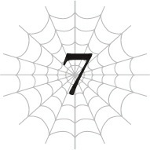

# Chương 7: Ma Vương tấn công

*(Demon Lord Attack)*

---

### --- TRANG 72 ---

Những con sóng nhẹ nhàng vỗ về khi tôi đang trôi nổi trên mặt nước.

Ánh mặt trời chói chang.

Biển xanh bao la.

Cảnh tượng này đủ sức khiến bất kỳ ai cũng muốn xuống bơi một chuyến, thế nên tôi tự bảo mình cứ thử xem sao.

Nhưng xui xẻo thay, hóa ra cấu tạo cơ thể nhện của tôi chỉ có thể nổi lềnh bềnh trên mặt nước mà thôi.

Thế là vì không thể bơi lội đàng hoàng, tôi chỉ đang trôi nổi vớ vẩn trên mặt biển.

Tôi cũng chẳng rõ mình đã kỳ vọng điều gì nữa.

Ý tôi là, thế này thì khác gì tôi đang nằm trên một cái phao bơi chứ.

Nếu thực sự cố gắng, tôi có thể lặn xuống một chút.

Nhưng chỉ cần mất tập trung một giây thôi là tôi lại lập tức nổi bần bật lên mặt nước ngay.

Như thế thì không thể gọi là bơi được.

Nhưng ở kiếp trước, dáng bơi uyển chuyển tuyệt mỹ dưới nước của tôi chắc chắn sẽ khiến các nàng tiên cá cũng phải tự hổ thẹn!

…Xin lỗi, đó là một lời nói dối trắng trợn.

Tôi thậm chí còn suýt soát mới thực hiện nổi tư thế nổi ngửa xác chết (dead man's float).

Đừng có xem thường sự lười biếng của tôi nhé!

Tôi còn chẳng nhớ nổi lần cuối mình bơi đàng hoàng trong hồ bơi là khi nào, chứ đừng nói đến biển cả!

Bầu trời xanh, biển xanh.

Và giờ tâm trạng tôi cũng xám xịt luôn rồi.

Không thể nào ooo.

Đã thế, trong lúc tôi đang trôi nổi trên mặt nước, có thứ gì đó đột nhiên tấn công tôi.

Đó là một con Thủy Phi Long (water wyrm), trông khá giống một con cá mập khổng lồ.

Tất nhiên, tôi đã dạy cho nó một bài học ngay trên địa bàn của nó, thế nên bây giờ vùng nước xung quanh tôi đã biến thành một biển máu.

---

### --- TRANG 73 ---

Và mùi máu đó chắc hẳn đã thu hút những con cá mập khác, bởi vì bây giờ có một bầy vây cá đang lượn vòng quanh tôi trên mặt nước.

Ư, phiền phức thật chứ. Tôi dùng ma pháp cho nổ tung tất cả bọn chúng, làm cho biển máu thậm chí còn loang rộng hơn.

Trời ạ, tôi đang làm cái quái gì thế này?

Tôi đến đây là để thư giãn một chút, để tạm quên đi những cuộc tấn công tàn khốc mà tôi đang nhắm vào quân đoàn nhện kia mà.

Thế mà bây giờ tôi lại đang thảm sát lũ Thủy Phi Long thay thế.

Tôi là kẻ khát máu hay gì à?

Ý tôi là, "Nhện Đại Chiến Cá Mập" nghe cùng lắm chỉ giống tên một bộ phim hạng B rẻ tiền mà thôi.

Tại sao một chuyến nghỉ dưỡng bãi biển tuyệt vời lại biến thành một trò lãng phí thời gian mệt mỏi về mặt cảm xúc khác thế này?

Không, tôi đoán mình không nên nói vậy. Lũ cá mập đó khá mạnh, nên tôi đã kiếm được một lượng EXP vô cùng ngon lành.

Tôi thậm chí còn lên được một cấp nữa chứ.

Dù vậy, ở thời điểm này, việc tăng lên một cấp đơn lẻ chẳng có ý nghĩa gì mấy.

Tôi còn không thể đến gần đẳng cấp của con nhện rối, chứ đừng nói đến Mẹ.

Chỉ riêng về mặt ma pháp thì tôi có lẽ có thể đấu tay đôi với con nhện rối, nhưng ở mọi chỉ số khác, nó đều mạnh hơn tôi rất nhiều.

Khoang cách về chỉ số vật lý của chúng tôi đặc biệt nghiêm trọng, ngoại trừ có lẽ là tốc độ.

Tôi nên làm gì đây?

Cuối cùng cũng có tín hiệu rồi!

Cái gì—?!

Trời đất, giật cả mình!

—Xin lỗi vì đã ngắt lời nhé bản thể chính, nhưng cậu phải chạy trốn ngay lập tức đi!

Hử?

Đã lâu lắm rồi tôi mới nghe lại giọng của phân thân ma pháp số một trước đây. Thế mà bây giờ cậu ta đột nhiên bảo tôi chạy trốn sao?

Tôi nhìn quanh, nhưng không thấy Mẹ ở đâu cả.

Cũng chẳng có dấu vết nào của con nhện rối. Thực tế là tôi chẳng nhìn thấy bất kỳ con quái vật nào xung quanh cả.

Tôi thực sự phải chạy trốn sao? Tôi đâu có cảm nhận được mối nguy hiểm nào đâu.

—Không có thời gian giải thích đâu! Được rồi, chắc là giải thích một chút vậy. Đại khái là, thực thể quái thai tồi tệ nhất từ trước đến nay đang lao thẳng về phía cậu đấy!

Hả?! Mẹ sao?!

---

### --- TRANG 74 ---

—Không! Chúng ta đã hoàn toàn sai lầm rồi. Chúng ta cứ nghĩ Mẹ là mạnh nhất, nhưng không phải đâu. Có một thứ còn đáng sợ hơn cả bà ấy nữa!

Khoan đã, cái gì cơ?

Tôi không hiểu nổi.

Có thứ gì đó còn mạnh hơn cả Mẹ sao?

Làm sao chuyện đó có thể tồn tại được chứ?

—Có đấy. Và thứ đó đang hướng thẳng về phía cậu ngay lúc này!

Thật khó để tin vào điều đột ngột này, nhưng nếu tôi có thể giao tiếp lại với các Phân thân Tư duy của mình, điều đó chắc chắn nghĩa là Mẹ đã khôi phục mối liên kết giữa chúng tôi để xác định vị trí của tôi.

Bà ấy hẳn phải làm vậy vì có lý do.

Hơn nữa, chính tôi lại là người đang cung cấp thông tin này cho bản thân.

Nếu tôi không tin tưởng chính mình, tôi còn có thể tin ai được đây?

Dù thế nào đi nữa, tốt nhất tôi nên chạy trốn trước đã.

Nhưng quyết định của tôi đã quá muộn màng.

Hoặc có lẽ, ngay từ đầu việc chạy trốn đã là bất khả thi rồi.

“****!”

Một tiếng nổ vang trời.

Và một giọng nói bằng cách nào đó vẫn truyền đến rất rõ ràng xuyên qua tiếng ồn.

Khi mọi thứ đột ngột rơi vào hỗn loạn, phần lý trí điềm tĩnh trong đầu tôi cố gắng phân tích chuyện gì vừa xảy ra.

Có thứ gì đó vừa xuất hiện ở đây.

Nó thậm chí còn không sử dụng dịch chuyển. Chỉ là nó di chuyển quá nhanh mà thôi.

Tiếng nổ đinh tai nhức óc kia chính là chấn động từ cú đáp của nó.

Mới chỉ vài giây trước, trong tầm mắt tôi hoàn toàn trống không, thế mà bây giờ có thứ gì đó đã lao tới từ ngoài phạm vi quan sát đó nhanh đến mức tạo ra một làn sóng xung kích mạnh mẽ.

Tốc độ không thể tin nổi.

Nó xuất hiện ngay trước mắt tôi, nhanh đến nỗi cứ như thể nó vừa bước ra từ các trang truyện tranh chiến đấu vậy.

Phải, ngay trước mặt tôi.

Sóng xung kích cực mạnh đã gây ra sát thương nghiêm trọng cho cơ thể tôi, cứ như thể vừa có một quả thiên thạch rơi ngay cạnh bên vậy.

Thế nhưng kẻ thù vừa xuất hiện kia lại vượt ngoài tầm hiểu biết thông thường đến mức tôi không còn lựa chọn nào khác ngoài việc phớt lờ lượng sát thương đó.

`<Thẩm định bị chặn>`

---

### --- TRANG 75 ---

Chuyện đó xảy ra lúc ban đầu.

Tuy nhiên, tôi thử lại một lần nữa, lần này bổ sung thêm sức mạnh của [Trí Tuệ] vào kỹ năng [Thẩm định] của mình.

Sau một chút kháng cự ban đầu, tôi có thể cảm nhận được rào cản đã bị phá vỡ, và cuộc Thẩm định đã thành công.

`<Taratect Thủy Tổ Cấp 139 Tên: Ariel>`

| Chỉ số | Giá trị |
| :--- | :--- |
| **HP** | 90.089/90.089 (lục) +99.999 (chi tiết) |
| **MP** | 87.655/87.655 (lam) +99.999 (chi tiết) |
| **SP (vàng)** | 89.862/89.862 (chi tiết) |
| **SP (đỏ)** | 89.855/89.855 +99.999 (chi tiết) |
| **Sức tấn công trung bình** | 90.021 (chi tiết) |
| **Sức phòng ngự trung bình** | 89.997 (chi tiết) |
| **Sức ma pháp trung bình** | 87.504 (chi tiết) |
| **Khả năng kháng tính trung bình** | 87.489 (chi tiết) |
| **Tốc độ trung bình** | 90.315 (chi tiết) |

**Kỹ năng:**
[Tự hồi phục HP siêu tốc LV 4] [Tự hồi phục MP nhanh LV 10] [Giảm tiêu hao MP LV 10] [Thao tác Ma lực Tỉ mỉ LV 10] [Ma Thần Đấu Pháp LV 10] [Truyền Ma Lực LV 10] [Truyền Phép LV 10] [Siêu công kích Ma lực LV 10] [Tự hồi phục SP nhanh LV 10] [Giảm tiêu hao SP tối thiểu LV 10] [Siêu tăng cường Hủy diệt LV 10] [Siêu tăng cường Va chạm LV 10] [Siêu tăng cường Cắt LV 8] [Siêu tăng cường Đâm LV 10] [Siêu tăng cường Sốc LV 10] [Siêu tăng cường Trạng thái bất thường LV 10] [Đấu Thần Đấu Pháp LV 10] [Truyền Năng lượng LV 10] [Truyền Chỉ Số LV 10] [Siêu công kích Năng lượng LV 10] [Thần Long Lực LV 10] [Thần Long Mạc LV 10] [Tấn công bằng Kịch độc LV 10] [Tăng cường Tấn công Tê liệt LV 10] [Tổng hợp Độc LV 10] [Tổng hợp Thuốc LV 10] [Thiên tài Tơ nhện LV 10] [Thần Kỹ Dệt Tơ] [Điều khiển Tơ LV 10] [Niệm lực LV 10] [Ném LV 10] [Bài xuất LV 10] [Cơ động Chiều không gian LV 10] [Liên hợp LV 10] [Chiến thuật gia LV 10] [Viễn Thoại LV 10] [Điều khiển Đồng loại LV 10] [Đẻ Trứng LV 10] [Triệu Hồi LV 10] [Tập trung LV 10] [Gia tốc Tư duy Siêu cấp LV 6] [Tương Lai Nhãn LV 6] [Phân thân Tư duy LV 4] [Xử lý Tốc độ cao LV 10] [Đánh trúng LV 10] [Né tránh LV 10] [Hiệu chỉnh Xác suất siêu cấp LV 10] [Ẩn mật LV 10] [Che giấu LV 10] [Vô thanh LV 10] [Vô hương LV 10] [Hoàng Đế] [Thẩm định LV 10] [Phát hiện LV 10] [Thăng Hoa] [Ma pháp Dị giáo LV 10] [Hỏa Ma pháp LV 8] [Thủy Ma pháp LV 10] [Lũ Lụt Ma Pháp LV 5] [Phong Ma pháp LV 10] [Cuồng Phong Ma Pháp LV 10] [Bão Tố Ma Pháp LV 10] [Thổ Ma pháp LV 10] [Ma pháp Địa hình LV 10] [Địa Chấn Ma Pháp LV 10] [Lôi Ma pháp LV 10] [Sét Ma Pháp LV 8] [Quang Ma pháp LV 10] [Thánh Quang Ma Pháp LV 2] [Ma pháp Bóng tối LV 10] [Ma pháp Hắc ám LV 10] [Hắc Ma pháp LV 10] [Ma pháp Độc LV 10] [Ma pháp Trị liệu LV 10] [Ma pháp Không gian LV 2] [Trọng Lực Ma Pháp LV 10] [Ma pháp Vực sâu LV 10] [Đại Ma Vương LV 10] [Uy Nghiêm LV 5] [Phẫn Nộ LV 9] [Bạo Thực] [Cướp Đoạt LV 8] [An Nghỉ LV 9] [Tha Hóa LV 4] [Vô hiệu Vật lý] [Kháng Lửa LV 5] [Vô hiệu Lũ lụt] [Vô hiệu Cuồng phong] [Vô hiệu Địa hình] [Vô hiệu Sét] [Kháng Thánh quang LV 8] [Vô hiệu Hắc ám] [Vô hiệu Trọng lực] [Vô hiệu Trạng thái bất thường] [Vô hiệu Axit] [Siêu kháng Thối rữa LV 7] [Vô hiệu Ngất] [Vô hiệu Sợ hãi] [Siêu kháng Ngoại đạo LV 6] [Vô hiệu Đau] [Vô hiệu Khổ đau] [Dạ Nhãn LV 10] [Thiên Lý Nhãn LV 10] [Siêu tăng cường Ngũ quan LV 10] [Mở rộng Nhận thức LV 10] [Mở rộng Thần giới LV 3] [Sinh mệnh Tối thượng LV 10] [Ma pháp Tối thượng LV 10] [Di chuyển Tối thượng LV 10] [Vận May LV 10] [Ngoan cường LV 10] [Kiên cố LV 10] [Thiên Nhân LV 10] [Thánh Vực LV 10] [Thần tốc (Skanda) LV 10] [Cấm kỵ LV 10]

**Điểm kỹ năng:** 0

**Danh hiệu:**
[Kẻ diệt con người] [Kẻ tàn sát con người] [Thiên tai Nhân loại] [Kẻ diệt Ma tộc] [Kẻ tàn sát Ma tộc] [Thiên tai Ma tộc] [Kẻ diệt Elf] [Kẻ tàn sát Elf] [Thiên tai Elf] [Kẻ diệt Quái vật] [Kẻ tàn sát Quái vật] [Thiên tai Quái vật] [Kẻ diệt Phi Long] [Kẻ tàn sát Phi Long] [Thiên tai Phi Long] [Kẻ diệt Rồng] [Kẻ tàn sát Rồng] [Kẻ Vô tình] [Kẻ Ăn Uế Tạp] [Kẻ Ăn Đồng Loại] [Sát thủ] [Người dùng Độc thuật] [Người dùng Tơ] [Người dùng Rối] [Chỉ huy] [Quán quân] [Quân Chủ] [Thần Thú Cổ Đại] [Kẻ Thống Trị Bạo Thực] [Ma Vương]

---

### --- TRANG 76 ---

Tôi sẽ thành thật nhé. Thà rằng tôi không biết thì hơn.

Sự tồn tại mang danh hiệu Ma Vương này.

Cô gái xuất hiện trước mặt tôi chính là Ma Vương và cũng là con nhện mạnh nhất trong tất cả.

“******, *******!”

Sinh vật quái dị dưới hình hài một cô gái trẻ này đang nói chuyện với tôi với vẻ khá thân thiện.

Nhưng dĩ nhiên rồi, tôi không biết ngôn ngữ của thế giới này.

Nên tôi hoàn toàn chẳng hiểu Ma Vương đang nói cái ôn gì.

“***********, ****************?”

Cô ta đang hỏi tôi điều gì đó.

Tôi có thể nhận ra điều đó thông qua tông giọng của cô ta, nhưng bản thân câu hỏi thì tôi chịu chết.

Dù sao thì, tôi phải đưa ra phản ứng nào đó, chí ít là để câu giờ.

Tôi nghiêng đầu, chỉ tay vào miệng mình, rồi xua tay một cách thận trọng.

Hy vọng việc này sẽ truyền đạt được rằng tôi không hiểu cô ta đang nói gì.

Có vẻ như cô ta không định tấn công tôi ngay lập tức.

Việc cô ta đang cố gắng giao tiếp là minh chứng cho điều đó. Hoặc tôi cứ tưởng là vậy.

“***. ***************.”

---

### --- TRANG 77 ---

Nhưng có vẻ như cô ta không thích phản ứng của tôi cho lắm.

Thái độ của Ma Vương thay đổi một cách rõ rệt.

Từ trạng thái trò chuyện thân mật sang tư thế sẵn sàng tấn công.

Dịch chuyển sao? Tôi sẽ không kịp mất.

Nếu tôi có thể câu thêm chút thời gian bằng cách trò chuyện, mọi chuyện có lẽ đã khác, nhưng bây giờ tôi sẽ bị giết trước khi kịp hoàn thành thuật thức vẽ vòng tròn ma thuật.

Đến cả việc cố gắng chống trả cũng vô ích.

Chỉ số của cô ta vượt trội hoàn toàn so với cả Mẹ.

Và hầu hết mọi kỹ năng trong danh sách dài dằng dặc đến điên rồ của cô ta đều đạt cấp tối đa.

Chưa kể đến đống kháng tính kia nữa.

Làm sao tôi có thể thắng nổi khi hầu hết các đòn tấn công thậm chí còn không có tác dụng chứ?

Tôi hoàn toàn không có lấy một cơ hội.

“***, ***********, ****.”

Ma Vương phẩy tay một cái.

Chỉ có vậy thôi. Cứ như thế, cơ thể tôi bị đập tan tành thành từng mảnh vụn.

---

### --- TRANG 78 ---

—Bản thể chính đã bị hạ rồi.

Trước những lời của tôi, các Phân thân Tư duy khác lập tức rơi vào hoảng loạn.

—Đừng lo. Tôi không biết cô ta đã dùng chiêu trò gì, nhưng vì chúng ta vẫn chưa biến mất, điều đó có nghĩa là bản thể chính vẫn chưa chết… Tôi nghĩ thế.

Thú thật, bản thân tôi cũng không thực sự biết tại sao chúng tôi lại chưa biến mất.

Đó là lý do tại sao tôi không còn cách nào khác ngoài việc nói một cách mơ hồ như vậy.

Không hoàn toàn loại trừ khả năng bản thể chính thực sự đã chết, và chúng tôi chỉ tình cờ sống sót vì đã bị cắt đứt một nửa liên kết với cơ thể.

Điều đó có nghĩa là bây giờ chúng tôi chỉ là những linh hồn không có thể xác sao?

Trong trường hợp đó, chúng tôi có thể biến mất bất kỳ lúc nào.

Chúng tôi không có cách nào biết được hệ thống sẽ phản hồi thế nào trước một tình huống bất thường như vậy, nhưng tôi nghi ngờ việc thế giới này có tồn tại linh hồn ma quỷ lảng vảng.

Chúng tôi nên làm gì đây?

Tất cả chuyện này bắt đầu ngay sau khi chúng tôi mất liên lạc với bản thể chính.

Chúng tôi đã rất lo lắng về những gì đang xảy ra với cơ thể mình, nhưng ngoại trừ việc thỉnh thoảng kiểm tra trạng thái liên kết, tất cả những gì chúng tôi có thể làm

---

### --- TRANG 79 ---

chỉ là tiếp tục tiến hành cuộc chiến linh hồn chống lại Mẹ.

Cuộc chiến đang diễn ra khá tốt đẹp.

Mọi thứ đã bắt đầu xoay chuyển theo hướng có lợi cho chúng tôi, và dù có thể chỉ là do tôi tưởng tượng, tôi vẫn có cảm giác rằng chúng tôi đang mạnh lên khi nuốt chửng thể linh hồn của Mẹ.

Giả thuyết đó có lẽ là chính xác.

Thể linh hồn của Mẹ về cơ bản chính là linh hồn của bà ấy.

Và sẽ không phải là phóng đại nếu nói rằng sức mạnh của các chỉ số, kỹ năng, v.v. ở thế giới này thực chất chính là sức mạnh của linh hồn.

Bằng cách ăn linh hồn của bà ấy, chúng tôi không chỉ làm giảm sức mạnh của bà ấy, mà còn hấp thụ nó cho chính mình.

Nhờ vậy, thời gian trôi qua càng lâu, chúng tôi càng bắt đầu giành được thế thượng phong.

Nhưng dĩ nhiên, Mẹ không chịu ngồi yên chịu trận như thế.

Tôi là người đầu tiên cảm nhận được điều đó.

Mẹ đang liên lạc với một thứ gì đó.

Giống như liên kết của chúng tôi với bản thể chính, bà ấy đang sử dụng kết nối của một kỹ năng để giao tiếp với ai đó.

Tôi không biết đó là ai.

Nhưng ngay khi nhận ra điều đó, tôi cảm thấy một nỗi bất an không thể tả xiết.

Và chẳng mấy chốc, nỗi sợ hãi của tôi đã trở thành hiện thực.

Tôi nhìn qua đôi mắt của Mẹ và nhìn thấy cô gái đó.

Ngay giây phút chạm mắt cô ta, dù không cần dùng đến Thẩm định, tôi vẫn có thể khẳng định chắc chắn rằng cô ta là một kẻ thù quái dị thực sự.

Hoặc có lẽ niềm tin mãnh liệt đó đến từ những ký ức trong phần linh hồn của Mẹ mà tôi đã ăn.

Dù thế nào đi nữa, tôi biết cô gái này còn mạnh hơn cả Mẹ.

Sau đó, Mẹ đã khôi phục lại kết nối với bản thể chính của chúng tôi để tìm ra vị trí của nó.

Và giờ đây, chúng ta đã quay trở lại hiện tại.

Tôi nghĩ quyết định cảnh báo cho bản thể chính của mình là đúng đắn.

Thế nhưng, đối thủ của chúng tôi đơn giản là quá đỗi vượt ngoài quy chuẩn thông thường.

Làm sao tôi có thể đoán trước được rằng cô ta có thể bắt chước việc Dịch chuyển chỉ bằng cách chạy bộ cơ chứ?

Tôi biết cô ta rất quái vật, nhưng chuyện này đã vượt xa trí tưởng tượng điên rồ nhất của tôi rồi.

---

### --- TRANG 80 ---

Tôi thậm chí còn không thể chạy trốn khỏi thứ đó, chứ đừng nói đến chuyện chiến đấu.

Có thể nói việc bản thể chính của tôi bị tiêu diệt là điều không thể tránh khỏi.

Vào khoảnh khắc đó, tôi đã chuẩn bị sẵn tinh thần cho cái chết.

Nhưng vì lý do nào đó, chúng tôi vẫn chưa chết.

Tôi không biết liệu thể xác của chúng tôi còn sống hay không, nhưng tôi không còn lựa chọn nào khác ngoài việc hy vọng là có.

Và nếu cơ thể của chúng tôi vẫn còn sống, thì nhiệm vụ của chúng tôi ở đây vẫn không thay đổi.

Thế hiện tại, nó chỉ càng trở nên khẩn cấp hơn mà thôi.

—Nghe đây, mọi người.

Tôi tập hợp các Phân thân Tư duy khác để thông báo về kế hoạch của mình.

—Chúng ta sẽ đánh bại Mẹ. Và sau đó, chúng ta sẽ đánh bại kẻ cai trị của bà ấy.

Tất cả những gì chúng ta có thể làm là tiếp tục cuộc tấn công tâm linh.

Vì chúng ta là các mảnh linh hồn, chúng ta được bảo vệ bởi [Vô hiệu Dị giáo], kỹ năng triệt tiêu bất kỳ đòn tấn công nào tác động trực tiếp lên linh hồn.

Do đó, chúng ta có thể đánh bại một đối thủ linh hồn mạnh hơn chúng ta rất nhiều.

Ngay cả khi đối thủ đó vượt trội hơn chúng ta cả một cái đầu.

Hoặc vượt trội hơn cả một cái đầu nhện, tôi đoán vậy.

Chúng ta không biết khi nào bản thể chính sẽ hồi phục, hoặc liệu cậu ấy có thể hồi phục được hay không. Nhưng chính vì thế, chúng ta phải làm bất cứ điều gì có thể!

Không một Phân thân Tư duy nào phản đối đề xuất của tôi.
