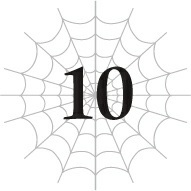

# Chương 10: Chơi đùa với búp bê

*(Playing with Dolls)*

---

### --- TRANG 98 ---

Dạo này, cuộc sống của tôi về cơ bản là cứ ra ra vào vào Mê cung Lớn Elroe liên tục.

Khi Ma Vương chuẩn bị đuổi kịp tôi, tôi sẽ dùng [Dịch chuyển] để quay lại mê cung và tranh thủ tiêu diệt bớt quân lực của Mẹ.

Sau đó, khi Ma Vương nhận được tín hiệu cầu cứu (SOS) từ Mẹ báo rằng tôi đang quậy phá tanh bành và lập tức quay đầu trở lại mê cung, tôi lại dịch chuyển ra bên ngoài.

Cứ thế lặp đi lặp lại.

Xem ra, ngay cả Ma Vương cũng chẳng thể nào bắt kịp tôi chừng nào tôi còn có [Dịch chuyển] và khả năng theo dõi vị trí của cô ta.

Tuy nhiên, chỉ cần sẩy chân một giây thôi là cô ta chắc chắn sẽ tóm được tôi ngay, đồng nghĩa với việc tôi phải kích hoạt [Vô hiệu Kiệt sức] để thức suốt ngày đêm.

Kỹ năng này giúp cơ thể tôi không bị suy kiệt dù không ngủ, nhưng việc thiếu nghỉ ngơi vẫn là một đòn tra tấn tinh thần khá nặng nề.

Hơn nữa, Ma Vương cũng không phải kẻ ngốc. Cô ta bắt đầu thực hiện các biện pháp để chấm dứt trò chơi mèo vờn chuột này.

Cụ thể là số lượng nhện rối đã tăng lên.

Nhện rối nằm dưới sự chỉ huy trực tiếp của Ma Vương, tách biệt hoàn toàn với Mẹ.

Ngoài một con mà Mẹ đã sở hữu từ trước, Ma Vương đã tung thêm mười con chết tiệt nữa vào cuộc.

Chỉ riêng một con thôi đã đủ đau đầu rồi, giờ tôi phải đối phó với tận mười một con sao?

Đùa nhau chắc—tha cho tôi đi chứ.

Một nửa số nhện rối mới đang canh gác trong Mê cung Lớn Elroe.

Năm con còn lại thì đang truy đuổi tôi ở bên ngoài, và tôi đã phải học bài học đó theo cách đau thương nhất.

---

### --- TRANG 99 ---

Ma Vương đang trên đường quay lại mê cung, thế nên tôi đã dịch chuyển ngược ra ngoài, để rồi phát hiện một con nhện rối đã phục kích sẵn ở đó từ đời nào.

Bằng cách nào đó, tôi vẫn giữ được mạng thoát thân và thậm chí còn [Thẩm định] thành công để đánh dấu vị trí của nó trên bản đồ, nhưng chỉ cần sai một li thôi là tôi đã đi bán muối rồi.

Thực tế là tôi đã nhận lượng sát thương lớn tới mức nếu không có [Bất tử] thì giờ này tôi đã mồ yên mạc đẹp.

[Bất tử] muôn năm!

Tuy nhiên, tình hình đang ngày càng tồi tệ hơn từng phút.

Ma Vương cùng đội truy vết nhện rối liên tục bám sát nút sau lưng tôi, còn ở trong Mê cung Lớn Elroe thì tôi lại phải đối phó với Mẹ cùng sáu con nhện rối khác.

Mẹ thì không còn mạnh như trước nữa, nhưng đồng thời, tần suất tôi chạm mặt lũ nhện rối ngày càng dày đặc hơn.

Cứ đà này, sớm muộn gì tôi cũng sẽ bị dồn vào góc tường không còn đường lui.

Thế nên bằng mọi giá tôi phải tiêu diệt bớt đám nhện rối trước khi điều đó xảy ra.

Hiện tại, nếu có đủ thời gian thì tôi hoàn toàn có thể đánh bại Mẹ, nhưng Ma Vương thì gần như vô địch, còn lũ nhện rối thì con nào con nấy chỉ số đều cao hơn tôi.

Rõ ràng là tôi bị áp đảo hoàn toàn rồi.

Nhưng tôi phải làm gì đó, nếu không thì tèo chắc.

Mà kẻ địch mạnh hơn tôi thì đã sao chứ?

Từ khi sinh ra ở cái xó này, tôi đã luôn phải chiến đấu với những kẻ thù mạnh hơn mình gấp bội rồi.

Giờ còn tỏ ra yếu đuối thì có ích gì nữa chứ.

Cho đến nay, tôi vẫn có thể đánh bại những kẻ thù mạnh hơn nhờ sự kết hợp giữa mưu trí và sự gan dạ chịu chơi.

Mưu trí để giăng ra đủ loại bẫy bằng tơ của mình, và sự gan dạ để không bao giờ đầu hàng dù tình thế có ngặt nghèo đến đâu.

Không hề ngoa khi nói rằng đây chính là hai thứ đã giúp tôi sống sót đến tận bây giờ.

Tôi cứ áp dụng những gì hiệu quả thôi.

Ở thời điểm hiện tại, nếu đấu tay đôi sòng phẳng thì tôi không có cửa thắng một con nhện rối.

Nhưng tôi vừa nghĩ ra một cái bẫy có thể giải quyết được chuyện này.

Dù sao thì đó cũng là những gì đang lẩn quẩn trong đầu tôi khi tôi chạy như điên như dại khắp nơi.

Vừa trốn chạy khỏi Ma Vương và đám nhện rối, vừa âm thầm bào mòn dần quân đội nhện.

---

### --- TRANG 100 ---

Và giờ đây, tôi đã bị dồn vào đường cùng.

Tại Tầng Trên của Mê cung Lớn Elroe.

Tôi đang ở trong một căn phòng nhỏ hình mái vòm, xung quanh là sáu con nhện rối bao vây.

Dưới mắt người ngoài, đây chắc chắn là một tình thế tuyệt vọng.

Mấy con búp bê kia chắc đang nghĩ chúng đã dồn tôi vào chân tường, nhưng tụi nó không biết rằng bản thân đã tự nhảy vào bẫy của tôi.

Tôi đã chơi trò đuổi bắt trong Mê cung Lớn Elroe lâu hơn thường lệ để dụ cả sáu con nhện rối tụ tập lại một chỗ thế này.

Trông thì có vẻ đám búp bê ngu ngốc kia đã chặn đứng đường thoát duy nhất của tôi, điều đó không sai, nhưng nếu chính cái lối đi đó bị khóa lại, tụi nó cũng sẽ không thể chạy thoát.

Thế nên: Thổ Ma pháp, kích hoạt!

Tôi bít kín lối thoát duy nhất bằng Thổ Ma pháp.

Giờ thì căn phòng nhỏ này đã hoàn toàn bị niêm phong.

Và tiếp sau đó, đến giờ biểu diễn của ma pháp khác rồi!

Ma pháp Không gian: [Lưu trữ Không gian]!

Về cơ bản thì phép này giống như loại kỹ năng Hộp Đồ dùng để cất giữ vật phẩm ở một chiều không gian khác, nhưng từ trước đến nay tôi đâu có nhu cầu mang vác đồ đạc gì nên nó toàn bị xếp xó đóng bụi.

Nhưng lần này, tôi đã trữ sẵn một chút bất ngờ ở bên trong.

Đó là cả một lượng nước biển khổng lồ.

Tôi xả đống nước biển đó vào căn phòng nhỏ, đồng thời hút ngược lượng không khí trong phòng vào không gian lưu trữ để thế chỗ.

Nước biển nhanh chóng đổ đầy phòng, nhấn chìm toàn bộ không gian trong nước.

Đúng như tôi dự đoán, đám nhện rối không biết bơi nên lập tức bị nổi lềnh bềnh và ép chặt vào trần nhà.

Vì một lý do nào đó, cấu trúc cơ thể của tôi có sức nổi cực kỳ lớn.

Ngay cả khi tôi cố lặn xuống dưới nước, tôi vẫn cứ bị đẩy ngược lên trên như cái phao.

Thế nên tôi mới tự hỏi, dù không cùng một chủng tộc chính xác, nhưng liệu các loài quái vật nhện khác có đặc tính tương tự hay không?

Để kiểm nghiệm giả thuyết của mình, tôi đã bắt một con Tiểu Taratect Thứ cấp từ quân đội nhện và đem ra biển thử nghiệm.

Đúng như dự kiến, nó nổi lềnh bềnh trên mặt nước y chang tôi.

Tuy điều đó không đảm bảo lũ nhện rối cũng sẽ hoạt động tương tự,

---

### --- TRANG 101 ---

nhưng có vẻ tôi đã thắng ván cược này rồi.

Đám nhện rối đang bất lực bị đẩy nổi lên áp sát trần nhà.

Bên cạnh việc bị sức nổi tự nhiên của loài nhện ép chặt vào trần, những sợi tơ mà chúng dùng để điều khiển các chi của con rối cũng bị thấm nước, khiến chuyển động của chúng bị cản trở phần nào.

Còn tôi thì đang ung dung đứng quan sát từ đáy phòng.

Hắc hắc hắc.

Đúng thế đấy. Để thực hiện chiến thuật này, tôi đã phải cắn răng bỏ ra một lượng lớn điểm kỹ năng để mua kỹ năng [Bơi]!

Giờ thì tôi đã có thể lặn xuống dưới nước một cách tương đối ổn thỏa.

Dù vậy, tôi cũng không thể bơi lội tung tăng tự do được vì cấp kỹ năng còn siêu thấp.

Nhưng bấy nhiêu đó là quá đủ để kế hoạch này thành công mỹ mãn rồi.

Giờ khi đám nhện rối đã không thể nhúc nhích, tôi bắt đầu nã Hắc Ma pháp vào tụi nó.

Tôi đã nhận ra khi chiến đấu với lũ Thủy Phi Long và Thủy Long rằng các loại ma pháp thuộc tính hắc ám không hề bị ảnh hưởng bởi nước.

Có vẻ như Ma pháp Hắc ám đánh trúng lũ nhện rối với uy lực y hệt như khi ở trên cạn.

Dù chỉ số của tụi nó có cao đến đâu, một khi không thể di chuyển thì đống chỉ số đó cũng chỉ để trưng bày mà thôi.

Và vì tôi có thể di chuyển dưới nước, tụi nó cũng không thể bắn trúng tôi bằng ma pháp của chính mình.

À khoan, tôi nói hớ mất rồi.

Do cấp kỹ năng [Bơi] của tôi quá thấp, tôi không thể di chuyển đủ nhanh để né hết tất cả ma pháp của tụi nó.

Nhưng không sao.

Kháng ma pháp của tôi rất cao, nên ngay cả các đòn ma pháp của nhện rối cũng không gây ra bao nhiêu sát thương cả.

Ấy chết, xin lỗi, tôi lại sai nữa rồi.

Thực tế là tôi đang nhận lượng sát thương khá thốn đấy chứ.

Ý tôi là, mấy đứa đó mạnh dã man con ngan luôn, các anh biết không?

Kể cả khi kháng ma pháp của tôi có cao đến đâu, tụi nó chắc chắn vẫn sẽ gây ra sát thương đáng kể rồi.

Nhưng thế vẫn ổn.

Việc dụ đám nhện rối dồn ma pháp tấn công tôi là một phần cực kỳ quan trọng của kế hoạch này.

---

### --- TRANG 102 ---

Nghe này, những kẻ sở hữu chỉ số vượt mức 10.000 có thể gây ra lượng sát thương khủng khiếp đến mức chẳng khác nào thiên tai đâu.

Nếu tụi nó cố ý, tôi tin chắc đám nhện rối hoàn toàn đủ sức làm sập cả căn phòng này.

Đó là lý do tôi muốn cho tụi nó một mục tiêu cụ thể để tấn công, khiến tụi nó không kịp nghĩ tới chuyện phá phòng.

Nói nôm na là tôi đang tự lấy mình làm mồi nhử.

Nếu đám nhện rối bình tĩnh lại một chút, tụi nó có lẽ sẽ ưu tiên phá hủy căn phòng trước.

Nhưng vì tôi đang lù lù ngay trước mắt, đã thế còn liên tục xả phép vào mặt tụi nó, thì tất nhiên tụi nó sẽ chỉ muốn tiêu diệt tôi trước mà thôi.

Nhất là khi tụi nó đang cuống cuồng hoảng loạn vì không thể hít thở.

Trong lúc tấn công lũ nhện rối, tôi thỉnh thoảng lại hút một chút không khí mà mình đã tích trữ trong không gian lưu trữ từ trước.

Nhờ vậy mà tôi không lo bị chết ngạt.

Nhưng còn đám con rối thì sao?

Tôi cá là tụi nó không thể thở dưới nước đâu.

Theo như tôi biết thì loài nhện làm gì có cái tính năng tiện lợi đó chứ.

Ý tôi là, chúng tôi có phải cá đâu.

Bình thường cơ thể của chúng tôi được thiết kế để thậm chí còn chẳng thể lặn xuống nước được mà.

Có thể chỉ số cao sẽ giúp dung tích phổi của tụi nó trâu bò hơn hay gì đó, nhưng không sinh vật thở bằng khí trời nào có thể sống thiếu không khí quá lâu cả.

Và tụi nó càng cử động nhiều thì lượng oxy tiêu hao càng nhanh.

Khi đã bị cuốn vào trận đấu súng ma pháp dồn dập với tôi, tụi nó sẽ cạn sạch dưỡng khí chỉ trong nháy mắt.

Tôi thậm chí còn chẳng cần phải bào hết HP của tụi nó bằng ma pháp.

Tất cả những gì tôi cần làm là thu hút sự chú ý của tụi nó và kiên nhẫn chờ tụi nó ngạt thở chết.

Cái giá phải trả là tôi phải hứng chịu kha khá đòn ma pháp của tụi nó, nhưng với kháng ma pháp cao cộng với kỹ năng [Kiên trì], tôi tính toán rằng mình hoàn toàn đủ sức trụ vững.

Kể cả khi lượng sát thương nhận vào vượt quá dự kiến, tôi vẫn còn lá bài tẩy cuối cùng là [Bất tử].

Và ngay cả khi tụi nó có thể tạm thời giết được tôi một lần, thì đến lúc đó bản thân tụi nó chắc chắn cũng đã kiệt sức hoàn toàn vì thiếu dưỡng khí rồi.

---

### --- TRANG 103 ---

Tôi không nghĩ lúc đó tụi nó còn đủ sức để phá hủy căn phòng này nữa, mà cho dù có phá được đi chăng nữa thì căn phòng cũng chỉ bị sập xuống mà thôi.

Với thể trạng suy kiệt của tụi nó lúc đó, sập phòng đồng nghĩa với việc bị chôn sống.

Dĩ nhiên tôi cũng sẽ bị chôn chung với tụi nó, nhưng vì tôi có [Bất tử] nên tôi sẽ không thực sự chết.

Trường hợp xấu nhất là tôi sẽ bị chôn vùi vĩnh viễn và mất đi ý thức mãi mãi, nhưng muốn chiến đấu với kẻ thù mạnh hơn nhiều lần thì tất nhiên phải chấp nhận rủi ro ở mức độ nhất định rồi.

Đám nhện rối rõ ràng mạnh hơn tôi, dù hiện tại trông tôi cứ như đang hành tụi nó ra bã vậy.

Thực tế là chính tôi cũng thấy ngạc nhiên vì mọi chuyện lại diễn ra suôn sẻ đến thế này.

Một con nhện rối bắt đầu huơ tay múa chân loạn xạ, điên cuồng chém vào trần nhà.

Nhưng khi nước đã thấm sũng vào các chi và những sợi tơ điều khiển, có vẻ nó không thể cử động bình thường được nữa.

Nó vung vũ khí chém vào trần nhà một cách chậm chạp, và vì đòn đánh không có chút lực nào nên thậm chí còn chẳng làm trầy xước nổi lớp đá trần.

Để cho chắc ăn, tôi tiếp tục bắn thêm ma pháp vào con nhện rối đang vùng vẫy đó để cản trở chuyển động của nó.

Sau đó, khi đám con rối dần bị ngạt nước, sự kháng cự của tụi nó chậm dần rồi cuối cùng dừng lại hoàn toàn.

Vì tiêu diệt được sáu kẻ thù mạnh hơn mình cùng một lúc, cấp độ của tôi lập tức tăng vọt lên nhanh chóng.

Dù vậy, tôi vẫn dùng [Thẩm định] lên từng con một để chắc chắn tụi nó đã trút hơi thở cuối cùng.

Cả sáu con đều đã biến thành xác chết.

Dù chỉ số của bạn có cao đến đâu, đôi khi cái chết vẫn có thể ập đến bất ngờ theo cách không thể lường trước như thế này đấy.

Lần này thần may mắn đã mỉm cười với tôi, nhưng tôi cũng phải tự nhắc nhở bản thân tuyệt đối không được coi thường bất kỳ đối thủ nào chỉ vì chúng yếu hơn mình.

Dù sao thì tôi cũng đã quét sạch một lũ kẻ thù phiền phức cùng một lúc thành công tốt đẹp.

Những đối thủ còn lại của tôi lúc này là: Ma Vương, Mẹ, và năm con nhện rối còn lại.

---

[◀ Chương trước: Chương S9: Những người tái sinh trong làng Elf](s9_the_reincarnations_in_the_elf_village.md) | [Chương tiếp theo: Chương S10: Những người tái sinh tụ họp ▶](s10_the_reincarnations_gather.md)
