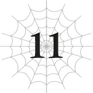
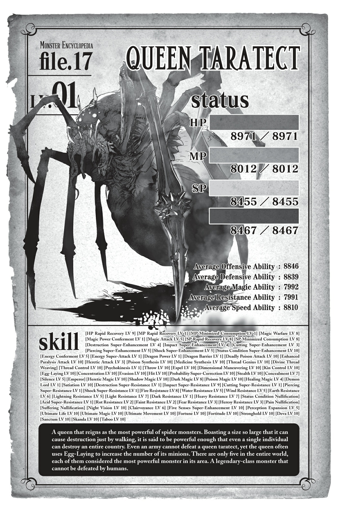

# Chương 11: Sát mẫu

*(Matricide)*

---

### --- TRANG 104 ---

Mọi chuyện hiện đang cực kỳ suôn sẻ!

Oa ha ha!

Kể từ khi tôi quét sạch cả lũ nhện rối đó cùng một lúc, tôi vẫn chưa thể ngừng cười được.

Sau đó, tôi cũng đã thành công tiêu diệt thêm một con nữa.

Ma Vương phát hiện ra việc tôi hạ sáu con nhện rối rất nhanh và đã lập tức có biện pháp đối phó.

Mụ ta đã phái con nhện rối cuối cùng còn lại trong mê cung đi làm nhiệm vụ phòng thủ.

Dĩ nhiên, tôi cũng dìm chết luôn con đó.

Chắc là Ma Vương đã kể cho nó nghe lũ kia bị hạ thế nào, bởi vì khi tôi tìm thấy nó, nó đã có sẵn kỹ năng [Bơi] rồi.

Nhưng chuyện đó cũng chẳng thay đổi được gì nhiều.

Tôi chặn lối thoát, xả đầy nước vào phòng, dùng [Dịch chuyển Cự ly ngắn] để thoát ra ngoài rồi đứng đợi.

Và rồi, anh đoán xem!

Căn phòng nhỏ sập xuống, và thế là xong! Một con nhện rối bị chôn sống!

Tôi đoán là chiêu cũ có lẽ sẽ không dùng được hai lần. Lần này tôi rút lui nhanh chóng để nó tự tìm cách phá hủy căn phòng và trốn ra ngoài.

Một khi tôi không còn ở trong phòng nữa, nó chẳng việc gì phải đứng đợi trong nước làm gì.

Theo lẽ tự nhiên, nó sẽ cố gắng thoát ra bằng cách phá vỡ tường hoặc trần phòng.

But điều nó không biết là tôi đã thực hiện một số công đoạn "tháo dỡ" trong phòng trước đó để đảm bảo nó sẽ sập xuống dễ dàng.

---

### --- TRANG 105 ---

Thế đấy, một căn phòng nhỏ đáng yêu mà đất đá sẽ đổ sập xuống khắp nơi nếu bạn chỉ cần chọc nhẹ vào tường.

Đó là một công việc dễ dàng với một chút can thiệp từ [Thổ Ma pháp].

Sau đó tôi chỉ cần dịch chuyển con nhện rối đang bị chôn đi chỗ khác, mang theo cả đống đất đá.

Thẳng vào dung nham của Tầng Giữa, dĩ nhiên rồi.

Trời ạ, không dễ chút nào đâu. Ngoài đống khối lượng khổng lồ cần dịch chuyển, tôi còn phải đối phó với kháng ma pháp của con nhện rối, nghĩa là MP của tôi giảm xuống dốốốc luôn.

Nhưng vì con nhện rối đã bị thương do vụ sập phòng, lại còn bị đất bao bọc, tôi đã kịp hoàn thành phép thuật trước khi nó bò ra ngoài.

Kính coong! Một phần nhện rối sốt dung nham, có ngay đây.

Để cho chắc ăn, tôi tự mình xuống Tầng Giữa để xác nhận con búp bê ngu ngốc đó đã chết chưa, và đoán xem? Không hiểu sao nó vẫn sống sót chui ra khỏi dung nham được!

Tôi đoán là toàn bộ đống đất đá tôi dịch chuyển cùng đã vô tình bảo vệ nó một chút.

Dù vậy, toàn thân nó đã bị thiêu rụi, tơ bên trong bị đốt cháy sạch, và vỏ bọc ma-nơ-canh đã bị carbon hóa xung quanh.

Có lẽ nếu cứ để mặc thì nó cũng chết thôi, nhưng dĩ nhiên tôi phải tự mình kết liễu nó để lấy số điểm kinh nghiệm ngon lành đó rồi.

Vậy là tôi đã đánh bại được bảy con nhện rối rồi.

Còn lại bốn con, nhưng tôi bắt đầu nắm được bí quyết hạ gục chúng rồi.

Tuy nhiên, có vẻ Ma Vương cũng đã nhận ra điều này. Hiện tại mụ ta đang cho bốn con cuối cùng đi chung với nhau.

Đồng thời đối phó với cả bốn con chắc chắn không dễ dàng gì, thế nên tạm thời tôi sẽ tránh mặt tụi nó.

Nhưng vì tụi nó hoạt động theo nhóm nên phạm vi tìm kiếm đã bị thu hẹp đáng kể.

Tôi tránh mặt tụi nó khá dễ dàng, đồng thời tranh thủ mở rộng phạm vi hoạt động ra bên ngoài.

Ma Vương vẫn bám sát nút tôi, nhưng chỉ cần tôi tiếp tục theo dõi mụ ta và trốn đi bằng [Dịch chuyển], mụ ta sẽ không đời nào bắt được tôi trừ phi xảy ra sự cố gì đó cực kỳ tồi tệ.

Tôi tiếp tục thám hiểm bên ngoài để mở rộng các điểm dịch chuyển, rồi lại nhảy về Mê cung Lớn Elroe để săn nhện mỗi khi Ma Vương đến quá gần.

---

### --- TRANG 106 ---

Tôi không thể làm gì được bản thân thực thể mạnh mẽ điên rồ là Ma Vương, nhưng chính lực lượng của mụ ta mới là bên đang bị bào mòn, chứ không phải tôi.

[Dịch chuyển] tiện lợi đến mức hơi đáng sợ.

Thực tế thì [Ma pháp Không gian] và [Ma pháp Chiều không gian] nói chung khá là lỗi.

Chỉ nhờ có chúng mà tôi mới có thể tiếp tục dắt mũi Ma Vương như thế này.

Chưa kể tôi cũng đã dùng chúng để đánh bại lũ nhện rối.

Trong khi đó, lực lượng tay chân của Mẹ đang cạn kiệt dần.

Mụ không còn một con Taratect Thượng cổ hay Taratect Vĩ đại nào dưới trướng nữa.

Vẫn còn một vài con Taratect trưởng thành thông thường, nhưng lũ đó thậm chí không còn được coi là mối đe dọa nữa.

Ma Vương dường như đã từ bỏ việc bố trí nhện rối trong mê cung, nghĩa là tôi có thể tự do quậy phá bao nhiêu tùy thích.

Kết quả là Mẹ là lực lượng chiến đấu thực sự duy nhất còn lại của Ma Vương trong Mê cung Lớn Elroe.

Vài ngay cả Mẹ cũng đang ngàn cân treo sợi tóc.

Tôi dùng tính năng đánh dấu của Giáo sư [Trí Tuệ] để [Thẩm định] mụ từ xa.

`<Taratect Nữ Vương (Bị suy yếu) Cấp 89>`

| Chỉ số | Giá trị |
| :--- | :--- |
| **HP** | 6.488/6.488 (lục) +0 (MAX 24.557) (chi tiết) |
| **MP** | 5.911/5.911 (lam) +0 (MAX 22.301) (chi tiết) |
| **SP (vàng)** | 6.134/6.134 (MAX 23.097) (chi tiết) |
| **SP (đỏ)** | 6.134/6.134 +0 (MAX 23.991) (chi tiết) |
| **Sức tấn công trung bình** | 6.456 (MAX 24.439) (chi tiết) |
| **Sức phòng ngự trung bình** | 6.447 (MAX 24.286) (chi tiết) |
| **Sức ma pháp trung bình** | 5.872 (MAX 21.977) (chi tiết) |
| **Khả năng kháng tính trung bình** | 5.869 (MAX 21.946) (chi tiết) |
| **Tốc độ trung bình** | 6.433 (MAX 24.400) (chi tiết) |

Tôi sẽ bỏ qua các kỹ năng này nọ, nhưng chỉ số của mụ đã giảm thê thảm.

Tất cả đều nhờ vào sự nỗ lực làm việc chăm chỉ của các Phân thân Tư duy của tôi.

Dĩ nhiên, chỉ số của mụ vẫn ở mức khoảng 6.000, nhưng so với con số ban đầu thì đúng là một sự sụt giảm khổng lồ.

---

### --- TRANG 107 ---

Hiện tại chúng chỉ còn gần một phần tư so với giá trị ban đầu.

Ý tôi là, giảm giá tận 70%? Đúng chất đợt xả hàng thanh lý giải thể cửa hàng luôn rồi!

Thực thể khổng lồ đó giờ đây đã có chỉ số thấp hơn cả lũ nhện rối.

Trái lại, tôi đã thăng cấp điên cuồng nhờ vào tất cả các trận chiến vừa qua.

Hiện tại tôi đã đạt cấp 24.

Như vậy là cực kỳ nhanh, xét đến việc tôi mới chỉ tiến hóa gần đây.

Có lẽ là do tôi đã liên tục hạ gục những con quái vật siêu mạnh ở khắp mọi nơi, từ Taratect Thượng cổ, Taratect Vĩ đại, cho đến dĩ nhiên là cả lũ nhện rối nữa.

Còn ở dưới biển, tôi đã đánh bại một đám Thủy Phi Long và thậm chí cả Thủy Long.

Điểm kinh nghiệm của tôi tăng vọt là điều hiển nhiên thôi.

Có chăng, điều đáng ngạc nhiên là chuỗi tàn sát ấn tượng này lại chỉ đưa tôi lên tới cấp 24 mà thôi.

Chắc là do sau khi tiến hóa quá nhiều lần thì việc tăng cấp cũng tốn thời gian hơn.

Dù sao đi nữa, nhờ đợt tăng cấp này, chỉ số của tôi hiện đã ngang ngửa hoặc thậm chí vượt trội hơn cả chỉ số hiện tại của Mẹ.

Sức công kích và phòng ngự ma pháp của tôi đã vượt quá 19.000.

Chẳng mấy chốc tôi sẽ cán mốc 20.000.

Thực tế thì MP của tôi đã chạm ngưỡng đó rồi.

Chỉ số cao tiếp theo là tốc độ ở mức 13.000.

Lại thêm một chỉ số nữa phá mốc 10.000 và giờ đã vượt xa lũ nhện rối.

Giờ thì nếu có con nào đuổi theo, tôi có thể chạy trốn bằng chân trần rồi!

Ồ, nhưng SP của tôi hơi thấp, chỉ khoảng 4.500. Nếu đấu một trận chiến tiêu hao bền bỉ thì chắc tôi sẽ thua mất.

Tôi đoán là dùng [Dịch chuyển] vẫn là lựa chọn tốt hơn.

HP của tôi là 7.500.

Sức tấn công vật lý và phòng ngự vật lý ở mức 5.000.

Những chỉ số vật lý và SP này tuy có hơi kém Mẹ một chút, nhưng tất cả các chỉ số khác của tôi đều cao hơn mụ.

Đặc biệt là các chỉ số liên quan đến ma pháp của tôi cao gần gấp ba lần của mụ.

Thật lòng mà nói, với chỉ số hiện tại, tôi nghĩ mình thậm chí có thể đánh bại một con nhện rối trong một trận đấu tay đôi sòng phẳng, hoàn toàn công bằng mà không cần giăng bẫy.

---

### --- TRANG 108 ---

Này, thế không phải nghĩa là tôi có thể đánh bại Mẹ sao, vì chỉ số của mụ còn thấp hơn cả nhện rối mà?

Đúng vậy! Đi chiến với mụ ngay lập tức thôi!

Mẹ à, tôi sắp sửa vượt qua bà một lần và mãi mãi rồi!

Mụ hiện đang ở Tầng Đáy của Mê cung Lớn Elroe.

Tôi chưa từng xuống đó, nên sẽ phải đi bộ thôi.

Cái hố khổng lồ nơi tôi có trận quyết chiến đỉnh cao với Alaba có một đường dẫn thẳng xuống Tầng Đáy.

Tôi trèo xuống cái hố đó cho đến khi cuối cùng chạm tới nơi sâu nhất của toàn bộ hầm ngục, Tầng Đáy.

Không giống như các tầng khác, Tầng Đáy chỉ là một không gian lớn duy nhất.

Không có các lối đi nhỏ, chỉ có một khu vực hình mái vòm khổng lồ.

Trần nhà có lẽ cao đến hàng trăm mét.

Nó rộng lớn đến mức bạn thậm chí không thể nhìn thấy điểm tận cùng bằng mắt thường.

Có lẽ tôi có thể thấy được bằng [Thiên Lý Nhãn].

Mẹ đang đứng lặng yên ngay trước mắt tôi.

Tận mắt chứng kiến mụ ở cự ly gần, tôi lại một lần nữa bị nhắc nhở về sự khổng lồ của mụ.

Lần đầu tiên tôi nhìn thấy mụ là ngay sau khi tôi chào đời.

Vào thời điểm đó, tất cả những gì tôi có thể làm trước sự xuất hiện đầy uy nghi của mụ chỉ là run rẩy trong sợ hãi.

Nói thật lòng thì ngay cả bây giờ tôi vẫn thấy sợ.

Chỉ riêng kích thước của mụ thôi đã vô cùng đáng sợ rồi.

Đó mới thực sự là một con quái vật khổng lồ đích thực.

Mỗi chiếc trong số tám con mắt khổng lồ của mụ trông to bằng cả cơ thể tôi.

Mụ chính là con quái vật lớn nhất mà tôi từng thấy từ trước đến nay.

Mụ có thể dẫm nát bét tôi chỉ bằng cách bước lên tôi bằng những chiếc chân khổng lồ đó.

Phải rồi. Đúng là một thực thể quái dị.

Nếu mụ không ở trong tình trạng suy yếu, không đời nào tôi dám thách đấu với cái thứ này.

Ngay cả lúc này, tôi bắt đầu nghĩ có lẽ mình đã hơi vội vã một chút.

Tám con mắt của mụ trừng trừng nhìn thẳng vào tôi.

Éc?! Đáng sợ quá đi mất!

Cố lên nào tôi ơi! Đừng có yếu đuối thế chứ!

Bây giờ tôi mới là người có chỉ số cao hơn mà!

---

### --- TRANG 109 ---

Không đời nào tôi có thể thua được!

Mẹ bước một bước nặng nề về phía trước, rồi nhấc một chiếc chân trước khổng lồ lên.

Không có chiêu trò cầu kỳ gì ở đây cả. Đây chẳng qua chỉ là một cú dậm chân bình thường.

Thế nhưng, đây là cú dậm của một bà Mẹ siêu khổng lồ cơ mà.

Toàn bộ sức nặng vật lý khổng lồ đó đang giáng thẳng xuống chỗ tôi.

Đành rằng chỉ số của mụ thấp hơn.

Nhưng điều đó đâu có nghĩa là cân nặng của mụ cũng giảm đi.

Tôi thậm chí không thể hình dung nổi mụ nặng bao nhiêu tấn nữa, nhưng tôi biết chắc một điều: Nếu mụ giẫm lên tôi với toàn bộ sức nặng đó, kết cục của tôi sẽ không hề tốt đẹp tí nào.

Tuy nhiên, tốc độ của tôi bây giờ đã nhanh hơn gấp đôi mụ.

Tôi có thể né tránh đòn này mà không gặp bất kỳ khó khăn nào.

Hoặc tôi đã tưởng là như thế.

Đến lúc tôi nhận ra chuyện gì đang xảy ra thì đã quá muộn.

Chân tôi không thể di chuyển được.

Không phải vì tôi bị đông cứng do sợ hãi hay gì cả.

Chúng chỉ đơn giản là bị dính chặt vào mặt đất, hoàn toàn không thể nhúc nhích.

Như thể bàn chân của tôi bằng cách nào đó đã bị gắn chặt vào sàn nhà.

Giật mình, tôi nhìn xuống.

Và rồi tôi nhìn thấy.

Tôi hoàn toàn không đứng trên mặt đất.

Thứ mà tôi nghĩ là mặt đất thực chất là tơ nhện, được giăng khắp một phần của sàn nhà.

Một loại tơ nhện có màu sắc và chất liệu giống hệt như mặt đất.

Không có kỹ năng nào của tôi có thể thay đổi màu sắc hay cấu trúc tơ của mình.

Nhưng Mẹ lại sở hữu một kỹ năng cấp cao hơn tôi để làm điều đó.

[Thần Kỹ Dệt Tơ].

Kỹ năng cấp cao nhất liên quan đến tơ nhện.

Kỹ năng mạnh mẽ nhất mà một con nhện có thể sở hữu.

Mụ đã bao phủ toàn bộ bề mặt sàn nhà bằng tơ được dệt thành hình dạng giống như tấm vải, rồi dùng kỹ năng [Che giấu] để ngụy trang sự thật rằng đó là tơ nhện.

Và ngay khi tôi bước lên, độ kết dính của nó được kích hoạt.

Nó trói chặt chân tôi, chỉ đơn giản như vậy.

Nói thật thì cái này khác quái gì nhựa bẫy chim đâu chứ.

Một cái bẫy đơn giản như thế mà tôi lại sập bẫy hoàn toàn.

Tôi không thể tin nổi mình lại bất cẩn đến mức này.

---

### --- TRANG 110 ---

Đáng lẽ tôi phải biết từ trước rồi chứ.

Cho dù kẻ thù có mạnh hơn thế nào đi nữa, vẫn có vô số cách để đánh bại chúng nếu bạn dụ chúng sập bẫy.

Đó là cách tôi liên tục đánh bại những đối thủ mạnh hơn từ trước đến giờ.

Nhưng lần này, tôi lại là kẻ bị sập bẫy.

Và mặc dù đối thủ đang ở trong trạng thái suy yếu, nhưng về cơ bản thì mụ vốn dĩ mạnh hơn tôi rất nhiều.

Cho dù chỉ số của mụ có thấp hơn bao nhiêu đi chăng nữa, các kỹ năng của mụ vẫn hoạt động cực kỳ mạnh mẽ.

Tôi không nên coi thường kẻ địch như thế.

Mụ chính là nữ hoàng trị vì của loài nhện, những kẻ chuyên gia về cạm bẫy.

Chiếc chân khổng lồ của mụ giáng xuống phía tôi với một tiếng gầm rú.

Tôi chỉ vừa kịp né tránh bằng cách cắt bỏ những chiếc chân bị dính chặt.

Tôi không biết dùng tơ đấu với tơ có phải là ý kiến hay nhất không, nhưng tôi đã dùng [Tơ Cắt] để cắt đứt chân của chính mình và thoát khỏi bẫy.

Tuy nhiên, dù tránh được đòn tấn công của Mẹ, việc tự làm tổn thương bản thân đã khiến HP của tôi tụt giảm nghiêm trọng.

Tôi nhanh chóng dùng [Ma pháp Trị liệu] lên các khớp nối nơi tôi vừa cắt chân.

Vì không thể đáp xuống sàn nhà, tôi dùng [Cơ động Chiều không gian] để chạy giữa không trung nhằm giãn khoảng cách giữa tôi và Mẹ.

Nhưng khi tôi vừa cố làm vậy, cơ thể tôi lại bị kéo ngược về phía mụ.

Mẹ đã há cái miệng khổng lồ của mụ ra và bắt đầu hút không khí vào.

Con cá trê ở Tầng Giữa cũng từng sử dụng kỹ thuật y hệt thế này.

Tôi đoán mụ đang sử dụng kỹ năng [No Nê] để hít vào một lượng lớn không khí và kéo đối thủ về phía mình.

Khi con cá trê làm vậy, tôi hầu như chẳng cảm thấy sức hút nào đáng kể.

Nhưng lần này, đối thủ là Mẹ, người có chỉ số và kích thước vượt trội không thể so sánh được với con cá trê.

Tôi bị thổi ngược lại cứ như thể bị bão táp quét qua, những luồng gió điên cuồng lôi kéo cơ thể tôi hướng thẳng về phía miệng Mẹ.

Đang chờ đón tôi ở bên trong chắc chắn là dạ dày hoặc là cặp răng nanh của mụ.

Tôi kích hoạt [Phong ma pháp] để triệt tiêu sức hút, sau đó dùng [Xích Lực Tà Nhãn] lên chính cơ thể mình để đẩy bản thân tránh xa khỏi Mẹ.

Tôi bận đối phó với sức hút đó đến mức không còn thời gian để hồi phục lại đôi chân của mình.

Nhưng ngay khi tôi đang tuyệt vọng chống chọi lại những luồng gió mạnh như bão cát, chúng đột nhiên dừng lại đồng loạt.

Ngay lập tức, một cảm giác lạnh sống lưng chạy dọc khắp cơ thể tôi.

---

### --- TRANG 111 ---

Tôi cố gắng tháo chạy, không hề có ý định che giấu sự sợ hãi của mình.

Chỉ vài giây sau, một thứ gì đó vô hình làm rung chuyển cả căn phòng lớn.

Đó chính là lượng không khí khổng lồ mà Mẹ vừa hít vào.

Mụ đã dùng kỹ năng [Bài xuất] để bắn nó ra dưới dạng một quả cầu nén.

Đó chỉ là không khí thông thường.

Nhưng thế là quá nhiều rồi.

Khối không khí nén đó làm rung chuyển cả Tầng Đáy với sức mạnh ngang ngửa đòn tấn công bằng hơi thở khổng lồ mà Mẹ từng dùng trước đây, va thẳng vào cơ thể tôi.

Tôi đã xoay xở để tránh bị trúng đòn trực diện.

Thế nhưng, toàn thân tôi vẫn đau đớn tột cùng.

Chỉ riêng làn sóng xung kích thôi cũng đủ gây ra cả tấn sát thương rồi.

Bất kể chỉ số có bị suy giảm hay không, Mẹ vẫn mạnh hơn bất kỳ con quái vật nào tôi từng thấy từ trước đến nay.

Tôi cố giữ thăng bằng giữa không trung để điều chỉnh lại tư thế.

Nhưng tôi không còn thời gian nữa, bởi vì ngay lúc đó sàn nhà đã bay thẳng lên phía tôi.

Hay đúng hơn, là đống tơ nhện được ngụy trang trông giống như sàn nhà.

Nó phóng thẳng về phía tôi bám đuổi quyết liệt.

Tôi cố gắng bay lên phía trên để thoát thân, để rồi chỉ biết chết lặng trước thứ đang lao xuống phía mình.

Trần nhà đang sụp xuống.

Hay đúng hơn, là đống tơ nhện được ngụy trang trông như trần nhà.

Không chỉ có sàn nhà.

Sàn nhà, những bức tường và cả trần nhà đều đã bị bao phủ bởi tơ nhện.

Và bây giờ tất cả mọi thứ đang khép chặt lại quanh tôi.

Tôi không còn đường nào để chạy nữa.

Cơn sóng thần bằng tơ nhện ập xuống, bao trùm lấy cơ thể tôi mà không cho tôi lấy một cơ hội để chống cự.

Vì lần này tôi đã bị quấn chặt hoàn toàn, tôi không thể đơn giản là cắt bỏ một chi để thoát thân nữa.

Để làm được điều đó lúc này, tôi sẽ phải tự băm nát cả cơ thể mình.

Nhưng nếu không trốn thoát, tôi sẽ bị nghiền nát.

Tôi có kỹ năng [Bất tử], nên tôi sẽ không chết, nhưng nếu tôi bị bất tỉnh, Ma Vương chắc chắn sẽ đuổi kịp tôi.

Đến lúc đó thì coi như tôi tèo thật.

Kể cả khi có [Bất tử], mụ ta vẫn có đủ cách để giải quyết tôi vĩnh viễn.

---

### --- TRANG 112 ---

Tôi cố gắng kiềm chế sự hoảng loạn và nghĩ cách thoát ra.

Nếu tôi không khẩn trương, Mẹ sẽ giẫm bẹp tôi mất.

Tôi dùng [Hắc Ma pháp] để thử phá vỡ đống tơ, nhưng nó hoàn toàn vô dụng.

Đống tơ này chắc chắn phải dai đến mức không tưởng mới có thể đứng trơ trơ không một vết xước trước sức tấn công ma pháp lên tới 18.000 của tôi.

Giờ tôi mới nhận ra việc trở thành nạn nhân của thứ tơ mà mình bấy lâu nay luôn dựa dẫm vào lại đáng sợ đến nhường nào.

Tôi cố gắng dịch chuyển, nhưng sự hoảng loạn khiến tôi không thể vẽ vòng tròn ma thuật một cách chuẩn xác được.

Chưa kể, vì đây là một phép thuật phức tạp, việc tạo ra vòng tròn ma thuật tốn khá nhiều thời gian.

Tôi nghi là Mẹ sẽ không rảnh rỗi mà tha cho tôi dù chỉ là trong khoảng thời gian ngắn ngủi đó đâu.

Đột nhiên, thuật thức ma pháp tôi đang dệt dở dang tan biến mất.

Tại sao chứ?!

Không, tôi không được hoảng loạn.

Đây không phải là lúc để nương tay hay giữ lại cái gì nữa!

[Hủ thực Công kích]!

Tôi truyền [Hủ thực Công kích] vào lưỡi hái của mình và chém đứt đống tơ.

Ngay cả tơ của Mẹ cũng yếu thế trước thuộc tính Hủ thực, thế nên tôi đã có thể chém đứt nó.

Tuy nhiên, cảm giác cứ như đang dùng một cây kéo cùn để cắt vải dày vậy.

Tôi dồn toàn bộ sức lực dùng lưỡi hái chém rách đống tơ, rồi dùng [Hỏa Ma pháp] để đốt cháy lớp tơ mỏng dính còn sót lại.

Vừa mới giải thoát được cơ thể tả tơi của mình khỏi đống dây trói, thứ chào đón tôi lại là chiếc chân của Mẹ.

Khi nó lao đến với tốc độ chóng mặt, nó choán hết toàn bộ tầm nhìn của tôi.

Không còn thời gian để né tránh nữa.

Tôi nghĩ mình đã nghe thấy tiếng động gì đó, kiểu như tiếng răng rắc, hay bép một cái.

Bằng cách nào đó tôi vẫn giữ được phần đầu nguyên vẹn thoát ra ngoài, trong khi phần còn lại của cơ thể bị nghiền nát bấy dưới chân Mẹ.

Chào mừng sự trở lại của cái đầu nhện lìa thân.

Tôi dùng [Niệm lực] để nhấc cái đầu của mình trôi nổi giữa không trung.

Nhưng việc kiểm soát nó vô cùng khó khăn. Tôi không thể di chuyển theo ý muốn.

Kích hoạt ma pháp lúc này cũng trở nên trầy trật vô cùng.

Lý do của tất cả những chuyện này chính là kỹ năng [Long Mạc] của Mẹ.

Đó là một kỹ năng tạo ra một kết giới có cùng thuộc tính với [Vảy Rồng] và các kỹ năng liên quan của nó.

---

### --- TRANG 113 ---

Nói cách khác, nó gây nhiễu loạn cho việc dệt ma pháp.

Về cơ bản thì nó giống như khắc tinh chí mạng của tôi vậy.

Thông thường, kỹ năng này chỉ tạo ra một kết giới xung quanh khu vực ngay sát cạnh người sử dụng, nhưng mụ đã mở rộng phạm vi của nó để ngăn tôi thi triển phép thuật.

Ngay cả khi có [Cực đỉnh Thần bí], tôi cũng không thể sử dụng những phép thuật phức tạp trong tình trạng thế này.

Đồng nghĩa với việc tôi không thể dùng [Dịch chuyển].

Tôi không thể chạy trốn.

Tôi chẳng còn lại gì ngoài một cái đầu lẻ loi.

Ma pháp của tôi đang bị phong tỏa một phần.

Tôi tiêu đời thật rồi.

Bất kể có cố gắng thế nào, tôi cũng không thể tìm thấy bất kỳ đường sống nào trong tình cảnh này.

Cơn sóng thần bằng tơ nhện lại một lần nữa ập xuống phía tôi.

Mẹ bắt đầu tích tụ hơi thở để kết liễu tôi một phát chí mạng.

Nếu tôi bị tiêu diệt vào lúc này, dù chỉ là tạm thời hay vĩnh viễn, tôi cũng sẽ không bao giờ có thể tỉnh lại được nữa.

Thật không thể tin nổi.

Đây là cái giá tôi phải trả cho sự ngây thơ khi nghĩ rằng mình có thể thắng trận chiến này mà không cần chuẩn bị gì cả chỉ vì chỉ số của mình cao hơn.

Sau bao nhiêu lần tôi đặt bẫy và đánh bại những kẻ khác, giờ đây tôi lại chính là kẻ bị sập bẫy.

Tôi đoán đây chính là quả báo nhãn tiền.

Sự trừng phạt cho thói kiêu ngạo tự đắc.

Đèn kéo quân về cuộc đời tôi bắt đầu chạy qua trước mắt.

Khi vừa sinh ra dưới hình dạng một con nhện, tôi đã phải tháo chạy khỏi cuộc tàn sát đẫm máu của Mẹ và các anh chị em ruột.

Tôi tự xây dựng một ngôi nhà, để rồi lại phải bỏ chạy khi con người thiêu rụi nó.

Con người rượt đuổi tôi cho đến tận khi tôi rơi xuống Tầng Dưới.

Và rồi tôi lại chạy trốn một lần nữa, lần này là khỏi Alaba.

Tôi chạy trốn khỏi sự kinh hoàng của Tầng Dưới bằng cách trốn lên Tầng Giữa.

Đến lúc quay trở lại được Tầng Trên, tôi đã vô cùng phấn khởi vì cuối cùng cũng không phải liên tục trốn chạy nữa.

Thế nhưng khi ra được bên ngoài thế giới thực, cuộc sống của tôi lại chỉ xoay quanh việc trốn chạy khỏi Mẹ và Ma Vương.

Ha ha. Nghĩ lại thì, phần lớn cuộc đời nhện của tôi đều là trốn chạy

---

### --- TRANG 114 ---

khỏi thứ này thế nọ.

Tôi không hề muốn trốn chạy. Hơn bất cứ điều gì, tôi muốn bản thân trở nên đủ mạnh mẽ để không bao giờ phải làm thế nữa.

Nhưng bất chấp những hy vọng đó, tôi vẫn dành cả đời mình để trốn chạy.

Vậy mà cuối cùng, tôi lại sắp chết vì tự mình đâm đầu thẳng vào một cái bẫy.

Nó ngớ ngẩn đến mức tôi sắp bật cười ra tiếng được luôn rồi.

Tôi chẳng có gì để mà tự hào cả.

Tôi không hề giống Alaba, kẻ đã ra đi trong mãn nguyện khi biết mình đã làm tất cả những gì có thể.

Tôi muốn được tiếp tục sống.

Tôi không muốn chết.

Vì thế tôi liên tục chạy trốn khỏi bất cứ thứ gì có khả năng giết chết tôi.

Tôi chỉ đứng lại chiến đấu khi không còn đường lui, hoặc khi tôi biết mình nắm chắc phần thắng.

Tôi chưa từng tự nguyện lao đầu vào một trận chiến hoàn toàn tuyệt vọng.

Tôi luôn chọn cách phòng thủ, không bao giờ khơi mào một trận chiến mà mình biết chắc là không thể thắng.

Ngay cả khi chiến đấu với Alaba, tôi cũng đã chuẩn bị cực kỳ kỹ lưỡng và chỉ khiêu chiến khi tự tin rằng mình chắc chắn sẽ thắng.

Nhưng lần này tôi lại lơ là những bước chuẩn bị đó.

Và Mẹ thì kiên định hơn nhiều so với những gì tôi dự đoán.

Tôi từng nghĩ Ma Vương ít nhất cũng có trí tuệ như con người vì mụ ta có thể sử dụng ngôn ngữ nói. Đáng lẽ tôi phải đoán được rằng thuộc hạ của mụ ta là Mẹ cũng sẽ khá thông minh, đặc biệt là khi xem xét những gì mụ đã làm cho đến nay.

Ấy thế mà, tôi lại đinh ninh rằng mình có thể hạ gục mụ chỉ vì chỉ số của mình cao hơn.

Đó chính là sai lầm chết người của tôi.

Và Mẹ đã không bỏ lỡ cơ hội đó, mặc dù linh hồn của mụ đang bị ngấu nghiến, một trải nghiệm chắc chắn mụ chưa từng nếm trải trước đây.

Tôi không nghi ngờ gì việc linh hồn bị cắn nuốt còn đáng sợ hơn nhiều so với những gì tôi có thể tưởng tượng.

Thế nhưng Mẹ không hề bỏ cuộc, ngay cả khi sức mạnh của mụ đang tiêu biến đi từng giây.

Mụ vẫn không ngừng đấu tranh, giành giật từng chút cơ hội chiến thắng cho đến khi nó cuối cùng nằm gọn trong tầm tay.

Nghĩ lại thì, đó cũng chính là cách tôi giành chiến thắng mỗi khi bị dồn vào chân tường suốt bấy lâu nay.

---

### --- TRANG 115 ---

những lúc đó.

Tôi chưa từng nghĩ rằng chúng tôi lại có điểm chung như vậy.

Nếu không phải vì thực tế tôi chính là nạn nhân hiện tại của mụ, tôi chắc đã cổ vũ kiểu: "Cố lên Mẹ ơi!" rồi.

Nhưng đến đây là hết rồi.

Sau ngần ấy lần trốn chạy, tôi lại sắp phải chết theo cách ngớ ngẩn và hụt hẫng nhất có thể.

Tôi không thể lật ngược thế cờ được nữa rồi.

Nhưng tôi sẽ không chịu khuất phục dễ dàng thế đâu!

Cứ tin đi, tôi sẽ tiếp tục chiến đấu cho đến hơi thở cuối cùng!

Ít nhất, tôi phải khiến Mẹ mãi mãi nhớ về tôi như một đối thủ mạnh mẽ đã khiến mụ phải chật vật đến tận phút chót!

Nếu làm được vậy, cuộc đời tôi xem ra cũng có chút ý nghĩa.

Giờ thì, đến lúc vùng vẫy vô vọng bằng tất cả những gì tôi có rồi...!

Tôi thích thái độ đó đấy!

Đột nhiên, một giọng nói vang lên trong đầu tôi.

Đó là một trong các Phân thân Tư duy của tôi, những người bấy lâu nay đang thực hiện trận chiến tâm linh với Mẹ.

Chắc cô ấy đã nhận ra tôi đang lâm vào tình cảnh ngặt nghèo nên đã quay trở lại cơ thể này để trợ giúp.

Nhưng chỉ một Phân thân Tư duy quay lại thì đâu thể thay đổi được cục diện gì chứ...

Ngay khoảnh khắc đó, một nguồn sức mạnh khổng lồ chưa từng thấy dâng trào khắp cơ thể tôi.

C-Cái quái gì thế này...?!

Chuyện gì vừa xảy ra vậy?!

Chứ anh nghĩ toàn bộ đống chỉ số bị sụt giảm của Mẹ đã đi đâu hả?

Phân thân Tư duy đi lạc của tôi, cựu não ma pháp số một, cất tiếng với giọng điệu cực kỳ đắc ý.

Nếu cô ấy có mặt, tôi cá chắc lúc này cô ấy đang nở một nụ cười đắc thắng tự mãn lắm.

Hắc hắc hắc. Trong cuộc chiến với thể linh hồn của Mẹ, bọn tôi đã bắt đầu cắn nuốt bà ấy. Thể linh hồn thực chất chính là linh hồn mà. Mà chỉ số với kỹ năng là sức mạnh của linh hồn đúng không? Thế nên việc ăn linh hồn của bà ấy giúp bọn tôi lấy được sức mạnh bà ấy đã mất là chuyện đương nhiên rồi đúng không hả?

---

### --- TRANG 116 ---

Ý cô là mỗi khi chỉ số của Mẹ giảm xuống thì chỉ số của tôi lại tăng lên sao?

Chíiiính xác!

Cựu não ma pháp số một reo lên đầy hân hoan.

Cùng lúc đó, tất cả các Phân thân Tư duy khác đang chiến đấu với Mẹ cũng đồng loạt quay trở về với tôi.

Và kết quả là, chỉ số của tôi tăng vọt lên cao một cách không tưởng.

Giờ thì, đến lúc phản công rồi!

Dưới sự chỉ huy của não ma pháp, tất cả các Phân thân Tư duy bắt đầu đồng loạt dệt ma pháp.

Các phép thuật được tạo ra hoàn toàn bỏ qua [Long Mạc] của Mẹ, xé toạc cơn sóng thần tơ nhện đang lao tới dễ dàng như xé giấy nháp.

Kế đó, đòn tấn công bằng hơi thở của Mẹ bị đối đầu trực diện bởi chính hơi thở của tôi, đẩy ngược đòn đánh của mụ và thổi bay mụ đi.

Ngay cả bản thân tôi cũng phải choáng váng trước sức mạnh của chính mình.

Hàng loạt phép thuật [Ma pháp Trị liệu] được kích hoạt cùng một lúc, tái tạo lại những chiếc chân bị mất của tôi chỉ trong chớp mắt.

Vẫn còn chưa hết bàng hoàng, tôi nhìn lại bảng chỉ số mới của mình.

`<Zana Horowa Cấp 24 Không tên>`

| Chỉ số | Giá trị |
| :--- | :--- |
| **HP** | 21.622/21.622 (lục) +0 (chi tiết) |
| **MP** | 29.618/29.618 (lam) +0 (chi tiết) |
| **SP (vàng)** | 17.097/17.097 (chi tiết) |
| **SP (đỏ)** | 4.111/17.097 +0 (chi tiết) |
| **Sức tấn công trung bình** | 21.153 (chi tiết) |
| **Sức phòng ngự trung bình** | 21.104 (chi tiết) |
| **Sức ma pháp trung bình** | 28.280 (chi tiết) |
| **Khả năng kháng tính trung bình** | 28.107 (chi tiết) |
| **Tốc độ trung bình** | 25.021 (chi tiết) |

---

### --- TRANG 117 ---

**Kỹ năng:**
[Tự hồi phục HP siêu tốc LV 6] [Cực đỉnh Thần bí] [Ma Thần Đấu Pháp LV 7] [Truyền Ma Lực LV 10] [Truyền Phép LV 2] [Siêu công kích Ma lực LV 2] [Tự hồi phục SP nhanh LV 10] [Giảm tiêu hao SP tối thiểu LV 10] [Siêu tăng cường Hủy diệt LV 6] [Siêu tăng cường Cắt LV 7] [Siêu tăng cường Đâm LV 4] [Siêu tăng cường Đâm LV 6] [Siêu tăng cường Va chạm LV 6] [Siêu tăng cường Trạng thái bất thường LV 10] [Đấu Thần Đấu Pháp LV 10] [Truyền Năng lượng LV 10] [Truyền Chỉ Số LV 7] [Siêu công kích Năng lượng LV 4] [Thần Long Lực LV 7] [Long Mạc LV 2] [Tấn công bằng Kịch độc LV 10] [Tăng cường Tấn công Tê liệt LV 10] [Hủ thực Công kích LV 6] [Tấn công Dị giáo LV 8] [Tổng hợp Độc LV 10] [Tổng hợp Thuốc LV 10] [Thiên tài Tơ nhện LV 10] [Thần Kỹ Dệt Tơ] [Điều khiển Tơ LV 10] [Niệm lực LV 7] [Ném LV 10] [Bài xuất LV 10] [Cơ động Chiều không gian LV 10] [Bơi LV 2] [Điều khiển Đồng loại LV 10] [Đẻ Trứng LV 10] [Tập trung LV 10] [Gia tốc Tư duy Siêu cấp LV 3] [Tương Lai Nhãn LV 3] [Tư duy Song song LV 9] [Xử lý Tốc độ cao LV 10] [Đánh trúng LV 10] [Né tránh LV 10] [Hiệu chỉnh Xác suất siêu cấp LV 10] [Ẩn mật LV 10] [Che giấu LV 2] [Vô thanh LV 10] [Vô hương LV 3] [Hoàng Đế] [Phán xét] [Hades] [Tha Hóa] [Bất tử] [Ma pháp Dị giáo LV 10] [Phong ma pháp LV 10] [Cuồng Phong Ma Pháp LV 1] [Thổ Ma pháp LV 10] [Ma pháp Địa hình LV 3] [Ma pháp Bóng tối LV 10] [Ma pháp Hắc ám LV 10] [Hắc Ma pháp LV 7] [Ma pháp Độc LV 10] [Ma pháp Trị liệu LV 10] [Ma pháp Không gian LV 10] [Ma pháp Chiều không gian LV 7] [Ma pháp Vực sâu LV 10] [Ma Vương LV 8] [Kiên trì] [Kiêu hãnh] [Phẫn Nộ LV 1] [Cướp Đoạt] [Bạo Thực] [Lười Biếng] [Trí Tuệ] [Siêu kháng Hủy diệt LV 5] [Vô hiệu Va chạm] [Siêu kháng Cắt LV 5] [Siêu kháng Đâm LV 5] [Siêu kháng Sốc LV 5] [Kháng Lửa LV 8] [Kháng Lũ lụt LV 1] [Kháng Cuồng phong LV 4] [Kháng Địa hình LV 5] [Kháng Sét LV 1] [Kháng Thánh quang LV 9] [Kháng Hắc ám LV 6] [Siêu kháng Trọng lực LV 4] [Vô hiệu Trạng thái bất thường] [Siêu kháng Axit LV 7] [Siêu kháng Thối rữa LV 5] [Kháng Ngất LV 8] [Siêu kháng Sợ hãi LV 2] [Vô hiệu Dị giáo] [Vô hiệu Đau] [Vô hiệu Khổ

---

### --- TRANG 118 ---

đau] [Viễn Nhãn LV 1] [Chú Oán Tà Nhãn LV 8] [Ngưng Trệ Tà Nhãn LV 7] [Xích Lực Tà Nhãn LV 5] [Tử Vong Tà Nhãn LV 5] [Siêu tăng cường Ngũ quan LV 10] [Mở rộng Nhận thức LV 8] [Mở rộng Thần giới LV 9] [Thiên lực] [Sinh mệnh Tối thượng LV 10] [Di chuyển Tối thượng LV 10] [Vận May LV 10] [Ngoan cường LV 10] [Kiên cố LV 10] [Thần tốc (Skanda) LV 10] [Cấm kỵ LV 10] [n% I = W]

**Điểm kỹ năng:** 164.500

**Danh hiệu:**
[Kẻ Ăn Uế Tạp] [Kẻ Ăn Đồng Loại] [Sát thủ] [Kẻ diệt quái vật] [Người dùng Độc thuật] [Người dùng Tơ] [Kẻ Vô tình] [Kẻ tàn sát quái vật] [Kẻ Thống Trị Kiêu Hãnh] [Kẻ Thống Trị Kiên Trì] [Kẻ Thống Trị Trí Tuệ] [Kẻ diệt Phi Long] [Kẻ gieo rắc kinh hoàng] [Kẻ diệt Rồng] [Kẻ Thống Trị Lười Biếng] [Thiên tai Quái vật] [Quán quân]

C-Cái... gì... cơ?

Chỉ số của tôi có gì đó không ổn rồi.

Đành rằng dạo gần đây chúng đã bắt đầu tăng lên một chút để bắt kịp đợt lạm phát sức mạnh của kẻ thù, nhưng cũng không thể nào đến mức này được.

Chưa kể, tôi còn nhận được vài kỹ năng kỳ lạ, và chúng đều đã tăng cấp vù vù này nọ nữa chứ.

Tôi chắc chắn chưa bao giờ có [Long Mạc], [Thần Kỹ Dệt Tơ], [Đẻ Trứng] hay mấy thứ tương tự. Không lẽ tôi đã sao chép chúng từ Mẹ bằng cách nào đó sao?

Một đống kỹ năng của tôi thậm chí còn đạt cấp tối đa luôn rồi.

Ngay khi tôi tưởng mình sắp xong đời đến nơi, đột nhiên tôi lại nhận được một đợt tăng sức mạnh khổng lồ.

Tôi cứ tưởng chuyện này chỉ xảy ra với mấy nhân vật chính trong truyện tranh shonen thôi chứ?

Như vậy nghĩa là bây giờ tôi cũng là nhân vật chính rồi sao?

Này, tôi biết cậu đang bối rối, nhưng có lẽ chúng ta nên dứt điểm Mẹ ngay bây giờ đi.

---

### --- TRANG 119 ---

Cựu não ma pháp số một kéo tôi trở về thực tại, nên tôi nhìn về hướng Mẹ bị thổi bay.

Ở đó, tôi thấy mụ đã bị tổn thương nặng nề bởi đòn hơi thở của tôi.

Mụ đang cố gắng đứng dậy, nhưng đôi chân dường như không còn đủ sức gánh vác trọng lượng khổng lồ đó nữa.

Trông có vẻ lúc này mụ thậm chí không thể đứng thẳng dậy nổi.

Từng sở hữu một sức mạnh áp đảo đến thế, giờ đây mụ chỉ còn nằm thoi thóp yếu ớt trên mặt đất.

Một người mẹ bị thương tích đầy mình, người bị chính đứa con ruột cướp đoạt mất sức mạnh.

Dĩ nhiên, không phải là tôi thực sự có bất kỳ hình ảnh hiền mẫu nào về mụ cả.

Tôi gọi mụ là Mẹ suốt thời gian qua, nhưng tôi chưa bao giờ coi mụ là phụ mẫu của mình.

Tất cả những gì tôi liên tưởng về mụ chỉ là nỗi sợ hãi tột cùng vào lần đầu tiên trông thấy mụ.

Có lẽ tôi chỉ là một đứa con gái bất hiếu, giống hệt như ở kiếp trước.

Nhắc mới nhớ, không biết bố mẹ tôi ở thế giới cũ giờ ra sao rồi nhỉ?

Việc tôi thậm chí không thể nhớ nổi khuôn mặt của họ nữa chắc chắn chứng minh tôi là một đứa con tồi tệ rồi.

Tôi tin chắc ngay cả những bậc phụ huynh thờ ơ như bố mẹ tôi cũng sẽ nghĩ vậy.

Mà thôi, ít nhất thì tôi cũng nên nói vài lời tiễn biệt phụ mẫu kiếp này của mình chứ.

Mẹ à, bà thực sự rất cừ.

Chỉ số của bà tất nhiên là rất ấn tượng rồi, nhưng điều thực sự đáng kinh ngạc là bà vẫn có thể dồn tôi vào góc chết trong tình trạng suy yếu như vậy.

Tôi sẽ không bao giờ lơ là cảnh giác chỉ vì đối thủ trông có vẻ yếu hơn mình nữa.

Đó sẽ là bài học đầu tiên và cũng là cuối cùng bà dạy cho tôi, thưa Mẹ.

Tạm biệt.

Các Phân thân Tư duy của tôi đồng loạt xả ma pháp cùng một lúc.

Cứ như thế, sinh vật mạnh mẽ nhất trong Mê cung Lớn Elroe đã trút hơi thở cuối cùng.

Tôi đã lật đổ Mẹ thành công tốt đẹp.

Hệ quả là, các Phân thân Tư duy vốn đang chiến đấu với linh hồn của mụ đều đã quay trở về với tôi.

Cùng lúc đó, sự kiểm soát của Mẹ lên tôi hoàn toàn biến mất, và sợi dây liên kết mơ hồ tôi từng cảm nhận trước đây cũng tiêu tán.

---

### --- TRANG 120 ---

Nói cách khác, không còn bất kỳ ai cố gắng kiểm soát tôi nữa, và mối liên kết của tôi với mạng lưới linh hồn loài nhện xoay quanh Mẹ cũng đã bị cắt đứt.

Ma Vương mới là cội nguồn thực sự của mạng lưới này, nhưng vì tôi chỉ nằm ở vùng rìa ngoài cùng, kết nối với mụ ta thông qua Mẹ, nghĩa là bây giờ tôi đã hoàn toàn bị ngắt liên lạc với Ma Vương.

Vấn đề là, điều đó đồng nghĩa với việc tôi không thể dùng các Phân thân Tư duy để tấn công linh hồn của mụ ta giống như đã làm với Mẹ nữa.

Không có kết nối thì tôi không thể phái các Phân thân Tư duy sang chỗ mụ ta.

Ngay cả khi chỉ số và kỹ năng của tôi đã tăng vọt nhờ hấp thụ sức mạnh của Mẹ, tôi vẫn còn cách đẳng cấp của Ma Vương một khoảng cách cực kỳ xa.

Ý tôi là, chỉ số trung bình của mụ ta ở mức khoảng 90.000 đấy.

Đành rằng vừa rồi tôi đã mạnh lên rất nhiều, nhưng vẫn chưa thấm tháp gì để thu hẹp khoảng cách khổng lồ đó.

Và sự chênh lệch đó chắc chắn không phải thứ có thể bù đắp được bằng bất kỳ cái bẫy nào.

Tôi không biết Ma Vương sẽ làm gì tiếp theo sau khi tôi đã tiêu diệt Mẹ cùng với rất nhiều thuộc hạ của mụ ta.

Nếu mụ ta cứ tiếp tục truy lùng tôi, sớm muộn gì tôi cũng sẽ phải chiến đấu với mụ ta.

Nói thật lòng thì tôi chẳng muốn đụng độ với cái thực thể quái dị đó tí nào. Ước gì mụ ta cứ để tôi yên cho rồi...

Trong lúc tôi đang nghiền ngẫm những chuyện này, cựu não ma pháp số một lên tiếng.

Này bản thể ơi, rảnh một chút không?

Ừ, có chuyện gì thế?

Thôi đi mà. Cậu vẫn chưa nhận ra sao?

Hửm?

Sau khi suy nghĩ một lát, một ý nghĩ chợt lóe lên.

Số lượng Phân thân Tư duy quay trở về có gì đó sai sai.

Bị thiếu mất một người.

Xem nào, cựu não thể xác kiểu như là... đi rồi.

Đi rồi? Đi đâu cơ?

Sang chỗ Ma Vương.

Hả, nói lại xem nào?

Ý tôi là, lúc chúng ta vẫn còn giữ kết nối giữa Mẹ và Ma Vương, não thể xác đã quyết định dùng đường truyền đó để sang tấn công mụ ta.

Cái gì cơ?!

Khoan đã, nhưng không phải kết nối của tôi với Ma Vương đã bị cắt đứt rồi sao?

---

### --- TRANG 121 ---

Ủa? Thế cựu não thể xác có thể quay lại được không?

Chịu thôi.

Ừm, tôi khá chắc là cô ấy không thể, đúng không?

Bởi vì, kiểu như, kết nối giờ mất tiêu rồi còn đâu.

Chắc thế rồi.

...Vĩnh biệt nhé, cựu não thể xác.

Tôi sẽ không bao giờ quên cô đâu.

Có vẻ như tôi đã bị mất đi một Phân thân Tư duy.

Nhờ có [Vô hiệu Dị giáo], tôi không nghĩ cựu não thể xác sẽ bị tiêu diệt.

Nhưng tôi cũng không nghĩ có cách nào để mang cô ấy trở lại khi cô ấy đã bám dính lấy Ma Vương và bị cắt đứt liên lạc với tôi.

Hoặc liệu chuyện đó có bao giờ khả thi hay không.

Tôi đoán có lẽ cô ấy sẽ quay lại nếu tôi đánh bại được Ma Vương, nhưng chắc tôi không trông chờ vào điều đó đâu.

Bởi vì tôi không nghĩ mình có thể làm được điều đó.

Xin lỗi nhé cựu não thể xác, nhưng khi đối đầu với Ma Vương, tôi vẫn sẽ trung thành với chiến thuật kinh điển đã được kiểm chứng qua thời gian: vắt chân lên cổ mà chạy.

Giờ khi đã hấp thụ toàn bộ sức mạnh từ Mẹ, tôi thậm chí có thể đánh bại một con nhện rối trong một trận đấu công bằng mà không gặp bất kỳ vấn đề gì. Chỉ cần tôi cẩn thận đề phòng Ma Vương, tôi nghĩ mình sẽ ổn thôi.

Nhưng đừng lo—tôi sẽ không bao giờ lơ là cảnh giác một lần nào nữa đâu.

---

### --- TRANG 122 ---

---

[◀ Chương trước: Đoạn phụ: Đồng minh tái sinh của các quản trị viên](interlude_the_administrators_reincarnation_allies.md) | [Chương tiếp theo: Đoạn phụ: Ma Vương ▶](interlude_demon_lord.md)
