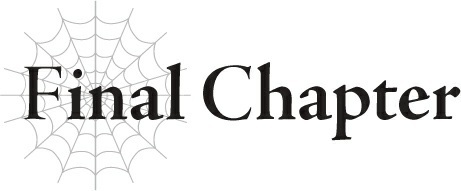
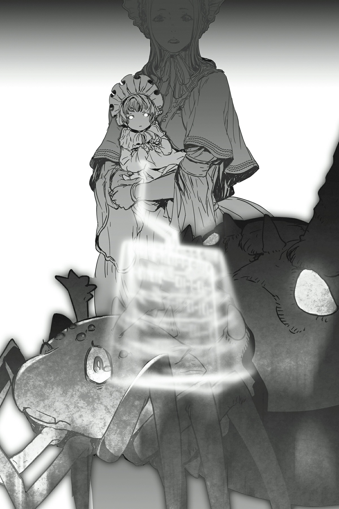

# Chương cuối: Cuộc chạm trán đầu tiên

*(First Encounter)*

---

Sau khi tiêu diệt Mẹ, tôi vừa thong thả dạo chơi bên ngoài vừa ra sức tránh mặt Ma Vương.

Tôi đã quét sạch hầu hết quân đội nhện của Mẹ trong Mê cung Lớn Elroe.

Tất cả những gì còn lại hiện tại chỉ là Ma Vương và bốn con nhện rối của cô ta.

Có vẻ như cô ta đã nhận định rằng việc để lũ nhện rối tự do hành động riêng lẻ là quá nguy hiểm, nên thay vào đó cô ta luôn giữ tụi nó bên cạnh.

Nhờ vậy, cô ta phải ghìm tốc độ của mình lại cho bằng với đám nhện rối, khiến việc bắt kịp tôi trở nên khó khăn hơn hẳn.

Thậm chí có vẻ như tôi đã cắt đuôi cô ta thành công luôn rồi.

Tôi đã mở rộng phạm vi di chuyển của mình đủ rộng để cô ta chẳng còn cách nào xoay xở.

Tôi cứ liên tục di chuyển ngày càng xa khỏi Ma Vương.

Và giờ đây, tôi đã bắt đầu đi trên một con đường chính.

Tôi đã cố gắng né tránh tất cả các con đường, làng mạc, thị trấn của con người để không bị phát hiện, nhưng chắc là có một thành phố lớn nằm gần đây hay gì đó.

Xung quanh hiện giờ có quá nhiều con đường đan xen đến mức tôi không thể né tránh chúng được nữa.

Tôi đành phải di chuyển dọc theo một trong các con đường đó, trong khi vẫn cố gắng giữ mình ngoài tầm mắt của con người.

Nếu cứ tiếp tục đi theo hướng này, tôi cảm giác mình chắc chắn sẽ đâm sầm vào một thị trấn lớn hay gì đó tương tự, nhưng lựa chọn thay thế duy nhất là đi ngược về hướng của Ma Vương.

Và chuyện đó thì tuyệt đối không được.

Lựa chọn duy nhất của tôi là phải chấp nhận khả năng bị phát hiện để tiếp tục đi xa hơn khỏi Ma Vương.

May mắn thay, lưu lượng giao thông ở đây khá thưa thớt, giúp tôi di chuyển một thời gian mà không bị con người phát hiện, nhưng có vẻ sự may mắn đó đã chạm giới hạn mất rồi.

--- PAGE BREAK ---

Có một cỗ xe ngựa ở phía trước.

Cuối cùng thì tôi cũng chạm trán với con người. Thật đáng tiếc.

Ngoài ra, dù chuyện này chẳng mấy quan trọng, nhưng kéo cỗ xe đó là những chú ngựa bình thường đến không thể bình thường hơn.

Vì đây là một thế giới giả tưởng, tôi sẽ chẳng ngạc nhiên nếu thấy phi long hay thứ gì đó tương tự kéo xe, nhưng thực tế lại quá đỗi bình thường đến mức tôi cảm thấy hơi hụt hẫng.

Dù sao thì, khi tôi tò mò ghé mắt nhìn cỗ xe, tôi nhận thấy có vẻ có gì đó không ổn.

Hửm? Hửửửm?

Các anh đang làm cái trò gì thế?

Ồ, hiểu rồi.

Một vụ cướp.

Họ đang bị tấn công à?

Tôi biết sớm muộn gì mình cũng chạm mặt con người, nhưng nằm mơ tôi cũng không ngờ cuộc gặp gỡ đầu tiên lại là hiện trường một cuộc ẩu đả với bọn cướp.

Vài người trông giống như hộ vệ đang chiến đấu với những kẻ trông giống như bọn cướp đường.

Có bốn hộ vệ và sáu tên cướp.

Ưm. Theo đánh giá của tôi thì hai bên có vẻ ngang tài ngang sức, nhưng nếu chỉ tính thuần túy về số lượng thì bọn cướp đang có lợi thế.

Ồ, một hộ vệ đã bị hạ gục rồi.

Bây giờ tôi nên làm gì đây?

Thực ra tôi không muốn dính líu vào chuyện này chút nào.

Tôi đang cố tránh bị phát hiện, đặc biệt là nếu muốn nằm ngoài tầm phủ sóng của Ma Vương.

Tuy thế, nếu tôi cứ trơ mắt đứng nhìn người ta bị tấn công ngay trước mặt, chắc sau đó tôi sẽ cảm thấy dằn vặt lắm.

Tôi không có ý định làm đồng minh của công lý hay gì đâu; chỉ đơn giản là tôi không muốn làm hỏng tâm trạng của mình thôi.

Tôi đoán là có lẽ mình vẫn còn giữ lại một chút la bàn đạo đức cơ bản từ kiếp trước.

Tuy nhiên, cùng lúc đó, thâm tâm tôi lại bảo rằng chuyện này phiền phức vãi chưởng.

Kiểu như, tại sao tôi lại phải ra tay cứu lũ người ngu ngốc đó chứ?

Chưa kể, ngay cả khi tôi cứu họ, về mặt định nghĩa tôi vẫn là một con quái vật.

Ngộ nhỡ tôi cứu họ xong rồi họ lại quay ngoắt lại tấn công tôi thì sao?

Ý tôi là, nếu họ dám làm càn như thế thì tôi cũng chẳng tha đâu, nhưng như vậy thì việc cứu họ ban đầu chẳng còn ý nghĩa quái gì nữa.

--- PAGE BREAK ---

Hay là tôi cứ đợi cho đến khi tất cả những người trong xe bị giết sạch, rồi sau đó mới xông vào xử đẹp bọn cướp nhỉ?

Đằng nào thì tôi cũng chắc chắn sẽ giết bọn đó thôi.

Dù sao thì con người cũng mang lại cả tấn điểm kinh nghiệm mà.

Tôi không muốn đi tàn sát dân thường vô tội hay gì đâu, nhưng sẽ thật lãng phí nếu bỏ qua những kẻ như bọn cướp này, những đối tượng mà tôi có thể danh chính ngôn thuận giết chết mà không cần áy náy, đúng không?

Tôi có thêm cả đống EXP. Tôi quá hớn hở.

Người dân không còn phải lo lắng về bọn cướp nữa. Họ cũng hớn hở.

Thấy chưa? Ngoại trừ bọn cướp bị tiêu diệt ra thì ai nấy đều hạnh phúc cả.

Lũ cướp đó chắc chắn phải chết.

Và rồi chui tọt vào trong bụng tôi.

Khi tôi ăn thịt lũ kỵ sĩ khốn kiếp đã đốt nhà tôi trong mê cung, tôi phát hiện ra rằng mùi vị của con người khác nhau tùy thuộc vào từng cá nhân.

Không biết có phải do tôi hoang tưởng không, nhưng hình như đứa nào trông ưa nhìn hơn thì ăn cũng ngon hơn hẳn.

Mấy tên cướp xấu đau xấu đớn này chắc vị chẳng ra gì đâu, nhưng dù thế nào thì chúng cũng sẽ giúp tôi lấp đầy bụng thôi.

Giờ vấn đề chỉ là có nên cứu những người trong cỗ xe kia hay không.

Ý tôi là, tôi cũng không biết nữa.

Do tôi nghĩ nhiều quá, hay thực sự việc giúp họ chẳng đem lại chút lợi lộc nào cả?

Ngược lại, bất lợi thì có cả rổ.

Nếu tôi không giúp, lợi ích là sẽ không có bất kỳ nhân chứng nào biết đến sự tồn tại của tôi, chưa kể tôi còn có thêm nhiều thức ăn hơn.

Bất lợi duy nhất là có lẽ sau đó tôi sẽ cảm thấy áy náy.

Hừm, hừm, hừm.

Ưm...

Được rồồồi.

Dù không mấy hứng thú, nhưng tôi đoán mình sẽ giúp họ vậy.

Xét về mặt khách quan thì không cứu sẽ có lợi hơn, nhưng những lúc thế này tôi phải hành động theo tiếng gọi của con tim thôi.

Dù sao thì việc phải hối hận sau này cũng phiền phức lắm.

Lên thôi.

--- PAGE BREAK ---

Bọn cướp đang quá tập trung vào trận chiến với các hộ vệ đến mức không hề nhận ra sự tiếp cận của tôi.

Quá tiện cho tôi.

Gã to xác ở giữa chắc là thủ lĩnh của chúng, tôi đoán vậy.

Dù sao thì chỉ số của hắn cũng là cao nhất.

Tôi nhanh như chớp lướt ra sau lưng hắn, rồi dùng một bên lưỡi hái đâm thẳng vào tấm lưng đang sơ hở hoàn toàn.

Lưỡi hái xuyên qua cơ thể hắn, đâm thủng tim.

Ồ, và dĩ nhiên tôi cũng đã bôi sẵn kịch độc lên đó rồi. Hắn chắc chắn đã chết ngay lập tức.

Khi tôi rút lưỡi hái ra, thân xác tên cướp đổ sụp xuống đất.

Hai tên khác còn đang há hốc mồm kinh ngạc chưa hiểu chuyện gì xảy ra, tôi liền vung lưỡi hái sang hai bên.

Bùm, chém ngọt cả hai làm đôi.

Giờ chỉ còn lại một nửa số tên cướp.

Tôi dùng Thổ Ma pháp bắn thẳng một phát vào đầu một trong ba tên còn lại.

Các anh biết đấy, tôi nghĩ mình khá có khiếu với Thổ Ma pháp.

Tôi sử dụng nó thành thạo hơn hẳn Phong Ma pháp, thứ mà tôi học được vào khoảng cùng thời điểm.

Dù sao thì, bốn tên đã nằm xuống, còn lại hai tên.

Một tên trong số đó cố gắng bỏ chạy.

Vô ích thôi, người anh em.

Tôi đã trói chặt anh bằng tơ của mình từ lâu rồi.

Khi hai tên cướp cuối cùng đã hoàn toàn bị bất động, tôi chuyển Tà Nhãn hướng về phía chúng.

HP, MP và SP của chúng bị hút cạn chỉ trong vài giây, và thế là tụi nó đổ rầm xuống.

Kết thúc chương trình rồi nhé các anh.

Nếu tôi là một hoàng tử hay kỵ sĩ gì đó, thì đây sẽ là phân đoạn tôi cất giọng lịch lãm: "Tiểu thư có bị thương ở đâu không?", và cô nương trẻ tuổi trong cỗ xe sẽ thẹn thùng: "Ôi, thật may mắn làm sao khi ngài lại tình cờ xuất hiện đúng lúc thiếp bị những kẻ xấu xa kia tấn công!" các thứ các thứ.

Eo ơi. Phát lợm giọng.

Lũ kỵ sĩ trắng đúng là thứ tồi tệ nhất.

Ưm. Thôi được rồi, lạc đề thế là đủ rồi.

Tôi đã đánh bại bọn trộm cướp.

Tôi đã cứu cỗ xe ngựa.

--- PAGE BREAK ---

Các hộ vệ đang chĩa kiếm vào tôi.

Và kết quả là thế này đây.

Chà, chà.

Tôi biết ngay mà.

Tôi biết thế nào chuyện này cũng xảy ra.

Dù sao thì, tôi nghĩ mình nên thấy mừng vì họ không lao vào tấn công tôi ngay lập tức.

Hoàn toàn không phải vì họ quá sợ hãi tôi đến mức không thể nhúc nhích đâu nhé.

Tôi chắc chắn họ đều là những người rất tốt, nên dù cực kỳ nghi ngờ nhưng họ vẫn ngần ngại tấn công kẻ vừa mới cứu mạng mình.

Như tôi đã nói đấy. Không phải tại họ sợ tôi đến mức đông cứng người đâu.

Không phải đâu nha, rõ chưa?

Hửm?

Ồ, nhìn kìa. Gã đầu tiên bị hạ gục hóa ra vẫn còn thở.

Ưm, đằng nào cũng đã giúp tới nước này rồi, tôi đoán mình nên tiện tay cứu luôn gã đó vậy.

Tôi tiến lại gần con người đang nằm bất động.

Tôi chỉ vừa mới dịch chuyển một chút, các hộ vệ khác đã lập tức cuống cuồng lùi lại thật xa cứ như gặp biến cố lớn.

...Tôi sẽ giả vờ như mình không nhìn thấy cảnh đó.

Ma pháp Trị liệu, kích hoạt.

Các vết thương của gã hộ vệ đang nằm gục lành lại trong nháy mắt.

Được rồi. Thế này thì gã chắc chắn sẽ không chết được đâu.

Thực ra, giờ nhìn kỹ lại, gã này ăn mặc trông giống một quản gia hơn là hộ vệ.

Không được huấn luyện chiến đấu mà vẫn liều mạng bảo vệ chủ nhân sao?

Ôi, thật đáng quý làm sao.

Bên cạnh các hộ vệ, vị phu nhân đang lo lắng quan sát từ bên trong cỗ xe cũng tỏ ra vô cùng kinh ngạc.

Xét đến việc một con quái vật vừa cứu bà ta khỏi bọn cướp, rồi giờ lại dùng Ma pháp Trị liệu cho thuộc hạ của bà ta, tôi đoán phản ứng đó cũng là hoàn toàn hợp lý.

Phù. Được rồi, việc của tôi ở đây thế là xong.

Chắc tôi sẽ làm một màn rút lui siêu ngầu thôi, chứ đứng thu dọn xác lũ cướp trước mặt mọi người thì trông kỳ cục chết đi được.

Ủa khoan, vị phu nhân kia đang vội vã bước ra khỏi cỗ xe.

Các hộ vệ của bà ta đều nhao nhao ngăn cản, giữ bà ta lại.

Nhưng tôi chẳng còn bận tâm đến chuyện đó nữa.

--- PAGE BREAK ---

Ánh mắt tôi đã hoàn toàn dán chặt vào thứ mà vị phu nhân đang ôm trong tay.

`<Chủng tộc: Con người ma cà rồng Cấp 1 Tên: Sophia Keren>`

| Chỉ số | Giá trị |
| :--- | :--- |
| **HP** | 11/11 (lục) (chi tiết) |
| **MP** | 35/35 (lam) (chi tiết) |
| **SP (vàng)** | 12/12 (chi tiết) |
| **SP (đỏ)** | 12/12 (chi tiết) |
| **Sức tấn công trung bình** | 9 (chi tiết) |
| **Sức phòng ngự trung bình** | 8 (chi tiết) |
| **Sức ma pháp trung bình** | 32 (chi tiết) |
| **Khả năng kháng tính trung bình** | 33 (chi tiết) |
| **Tốc độ trung bình** | 8 (chi tiết) |

**Kỹ năng:**
[Ma Cà Rồng Cấp 1] [Bất Tử Cấp 1] [Tự hồi phục HP Cấp 1] [Cảm nhận Ma lực Cấp 3] [Thao tác Ma lực Cấp 3] [Dạ Nhãn Cấp 1] [Tăng cường Ngũ quan Cấp 1] [n% I = W]

**Điểm kỹ năng:** 75.000

**Danh hiệu:**
[Ma Cà Rồng] [Chân Tổ]

Vị phu nhân đang bế một đứa trẻ sơ sinh.

Và kết quả Thẩm định của nó thực sự là một thứ gì đó cực kỳ chấn động.

Ý tôi là... liệu tôi có nhìn nhầm không?

Có quá nhiều thứ bất thường ở đây khiến tôi không biết phải bắt đầu từ đâu nữa, các anh hiểu không?

Ý tôi là, con bé là ma cà rồng, sở hữu một lượng điểm kỹ năng khổng lồ, và còn có một cái tên thứ hai hiển thị ngay dưới tên đầu tiên nữa...

À, hiểu rồi.

Đứa bé này có phải là thứ tôi đang nghĩ đến không?

Ý tôi là, thôi nào. Tôi đã biết ngay khoảnh khắc một cái tên đậm chất Nhật Bản như Negishi Shouko xuất hiện trong kết quả Thẩm định của con bé.

Đứa trẻ này là một người tái sinh, giống hệt như tôi.

--- PAGE BREAK ---

Đó chính là ngày đầu tiên tôi chạm trán một người bạn tái sinh ở thế giới này.

--- PAGE BREAK ---

# Lịch sử Vương quốc - Trục Thời gian

*(Timeline Kingdom History)*

---

*   **Năm 798**: Ronandt trở thành Trưởng pháp sư cung đình trẻ tuổi nhất lịch sử Đế quốc Renxandt.
*   **Năm 801**: Anh hùng Meicis tử trận tại Pháo đài Kusorion. Darresmeig được bổ nhiệm làm Anh hùng mới.
*   **Năm 803**: Anh hùng Darresmeig đánh bại Ma Vương Atomos.
*   **Năm 804**: Anh hùng Darresmeig mất tích.
*   **Năm 807**: Kiếm Vương Leigar thoái vị khỏi ngai vàng Đế quốc Renxandt và mất tích. Largis trở thành Kiếm Vương mới. Ronandt trở thành cố vấn của ông.
*   **Năm 829**: Sirius trở thành vua của Vương quốc Analeit.
*   **Năm 832**: Nhất hoàng tử Cylis của Vương quốc Analeit được hạ sinh bởi Hoàng hậu.
*   **Năm 833**: Nhất công chúa Leiresia của Vương quốc Analeit được hạ sinh bởi đệ nhất phi tần của nhà vua.
*   **Năm 834**: Nhị hoàng tử Julius của Vương quốc Analeit được hạ sinh bởi đệ tam phi tần của nhà vua.
*   **Năm 837**: Tam hoàng tử Leston của Vương quốc Analeit được hạ sinh bởi đệ nhị phi tần của nhà vua.
*   **Năm 840**:
    *   Nhị hoàng tử Julius trở thành Anh hùng. Cựu Anh hùng Darresmeig theo đó được cho là đã qua đời.
    *   Một cá thể Taratect non bất thường được nhìn thấy trong Mê cung Lớn Elroe. Một quả trứng phi long và tơ nhện được thu thập từ tổ của nó và dâng lên hoàng gia.
    *   Các hoạt động của ma tộc gia tăng.
*   **Năm 841**:
    *   Tứ hoàng tử Schlain của Vương quốc Analeit được hạ sinh bởi đệ tam phi tần của nhà vua.
    *   Nhị công chúa Suresia của Vương quốc Analeit được hạ sinh bởi Hoàng hậu.
    *   Đứa con đầu lòng của Công tước Anabald, Karnatia, ra đời.
    *   Nhất hoàng tử Hugo của Đế quốc Renxandt ra đời.
    *   Đệ tam phi tần của nhà vua băng hà.
    *   Quân đội Đế quốc do Ronandt dẫn đầu chạm trán "Cơn Ác Mộng Mê Cung" trong Mê cung Lớn Elroe.
    *   Cơn Ác Mộng Mê Cung và một con Taratect Nữ Vương thoát ra khỏi Mê cung Lớn Elroe.
    *   Ronandt tạm thời mất tích.
*   **Năm 842**:
    *   Cơn Ác Mộng Mê Cung xuất hiện ở Sariella.
    *   Lãnh thổ Sariella và Ohts nổ ra chiến tranh. Đế quốc và giáo hội Thần Ngôn Giáo hỗ trợ Ohts.
    *   Anh hùng Julius chiến đấu với Cơn Ác Mộng Mê Cung và thoát chết trong gang tấc nhờ sự giải cứu của Ronandt.
    *   Anh hùng Julius tạm thời trở thành đệ tử của Ronandt.
    *   Các vụ bắt cóc và buôn bán nô lệ diễn ra liên tiếp ở nhiều nơi.
*   **Năm 843**: Bầy Tàn tích của Cơn Ác Mộng được phát hiện trong Mê cung Lớn Elroe.
*   **Năm 844**: Nhất công chúa Leiresia kết hôn với nhất hoàng tử của Vương quốc Teresent và đi du học tại đó.
*   **Năm 845**:
    *   Kiếm Quỷ xuất hiện ở Đế quốc.
    *   Ronandt xua đuổi thành công Kiếm Quỷ.
*   **Năm 846**:
    *   Thần Ngôn Giáo triệt phá một tổ chức buôn người quy mô lớn.
    *   Hệ quả của sự kiện này là Anh hùng Julius kết nạp thêm Jeskan và Hawkin vào tổ đội của mình.
*   **Năm 847**: Schlain, Suresia và Karnatia trải qua nghi lễ Thẩm định.
*   **Năm 848**: Feirune nở ra từ quả trứng Địa Long.
*   **Năm 850**:
    *   Potimas, tộc trưởng tộc Elf, đến thăm vương quốc với tư cách đại sứ hữu nghị.
    *   Filimõs, con gái của Potimas, đi du học tại vương quốc.
    *   Anh hùng Julius bị sập bẫy của ma tộc và bị tấn công nhưng đã xoay xở trốn thoát thành công.
*   **Năm 851**:
    *   Schlain, Suresia, Karnatia và Filimõs nhập học Học viện Hoàng gia.
    *   Hoàng tử Hugo của Đế quốc và Thánh Nữ tương lai Yuri tiếp cận họ.
    *   Anh hùng Julius tiêu diệt một con Tàn tích của Cơn Ác Mộng trong Mê cung Lớn Elroe.
    *   Hoàng tử Hugo mưu toan ám sát Schlain.
    *   Một con Địa Long tấn công Học viện Hoàng gia.
*   **Năm 856**:
    *   Đại chiến Nhân - Ma bắt đầu.
    *   Anh hùng Julius tử trận.
    *   Một cuộc đảo chính xảy ra tại Vương quốc Analeit.
    *   Quốc vương Sirius băng hà.
    *   Tứ hoàng tử Schlain trốn chạy cùng người đồng hành là Tam hoàng tử Leston.
    *   Thần Ngôn Giáo tuyên bố Hoàng tử Hugo của Đế quốc Renxandt là Anh hùng mới.
    *   Cùng lúc đó, Nhị công chúa Suresia được công bố là vị hôn thê của Hugo.
    *   Đế quốc tuyên chiến với tộc Elf vì đã tham gia vào cuộc đảo chính của vương quốc và bắt đầu động binh.
    *   Quân đội Đế quốc và quân đội Ma Vương xâm lược làng Elf.
