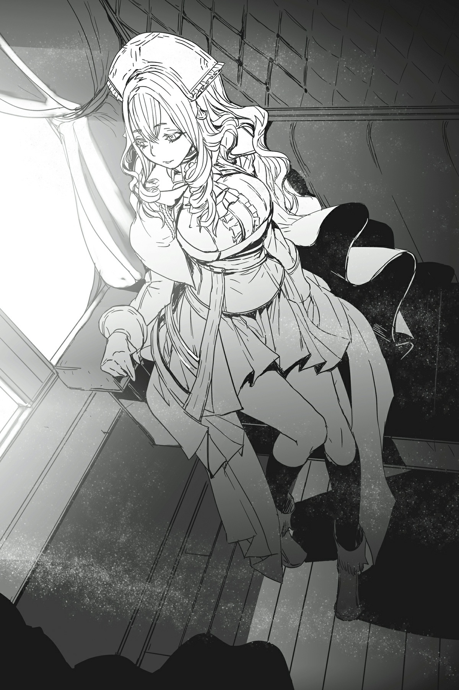

# Đoạn phụ: Chó săn của thần

*(God’s Hunting Dog)*

---

### --- TRANG 139 ---

Một thiếu nữ xinh đẹp đăm chiêu nhìn phong cảnh không ngừng biến đổi bên ngoài cỗ xe ngựa với gương mặt đượm vẻ u sầu.

Ngồi đối diện trực tiếp với tôi, Sophia Keren xinh đẹp đến mức ngay cả một cô gái như tôi cũng khó lòng rời mắt.

Dẫu tuổi đời vẫn còn khá trẻ, nhưng nét quyến rũ trên gương mặt cuốn hút ấy lại khiến cô ta trông trưởng thành hơn hẳn.

Cô ta đúng nghĩa là một đóa hồng gai quyến rũ chết người, và vẻ ngoài của cô ta cũng toát lên khí chất đó.

Thật khó tin là chúng tôi bằng tuổi nhau.

Thế nhưng, điều mà hầu hết mọi người không biết là cô ta thực chất lại cực kỳ trẻ con.

Tính cách của cô ta ích kỷ đến mức khó tin, mọi việc cô ta làm chỉ đơn thuần là để tự mua vui cho bản thân.

Có lẽ cô ta thừa hưởng tính cách này từ Chủ nhân.

Ngay cả lúc này, dù trông cô ta có vẻ u sầu và xa xăm khi nhìn ra ngoài cửa sổ, tôi dám chắc thứ duy nhất trong đầu cô ta là mình đang chán đến mức nào.

Sophia là kẻ ích kỷ, tùy hứng và chẳng bao giờ suy nghĩ thấu đáo.

Thế nhưng, cô ta lại cực kỳ mạnh mẽ.

Nói một cách ngắn gọn, tôi chỉ có thể mô tả cô ta như một mối họa.

Như thể đọc được suy nghĩ của tôi, Sophia quay sang nhìn.

"Có chuyện gì thế?" tôi hỏi bằng giọng đều đều.

"Tôi chán quá."

Hóa ra cô ta không hề đọc suy nghĩ của tôi.

Mà dù vậy, cô ta mong tôi làm gì để giải khuây cho cô ta chứ?

"Xin hãy kiên nhẫn một chút đi."

"Uầy. Nếu biết mất thời gian thế này, thà tôi tự chạy bộ đến đó cho xong."

---

### --- TRANG 140 ---

"Nếu muốn thì cô cứ tự nhiên."

Gương mặt cô ta nhăn nhó thấy rõ trước lời đáp cộc lốc của tôi.

Đúng là trẻ con.

Mà cái ý nghĩ chạy bộ nhanh hơn xe ngựa cũng đã đủ trẻ con rồi. Thật không thể tin nổi.

Hiện tại, chúng tôi đang đi cùng với đội tiên phong của quân đội hoàng gia Hoàng tử Hugo.

Dẫu về cơ bản chúng tôi là khách quý, nhưng trên danh nghĩa vẫn là những chỉ huy đi cùng quân đội.

Tại sao cô ta lại có thể nghĩ chạy bộ sẽ nhanh hơn chứ? Chúng tôi phải di chuyển đồng bộ với toàn quân.

Phải, tôi chắc chắn cô ta có thể tự mình di chuyển nhanh hơn.

Nhưng ngay cả khi cô ta đến đó sớm, cô ta vẫn sẽ phải đứng đợi phần còn lại của quân đội bắt kịp, và rồi cô ta vẫn sẽ chán mà thôi.

Bộ cô ta không nhận ra điều đó sao?

"Hửm. Cô ghét tôi lắm đúng không?"

"Dĩ nhiên là ghét rồi."

Sao lại phải hỏi một câu hiển nhiên thế nhỉ?

Gương mặt cô ta càng lúc càng xị ra sau câu trả lời của tôi.

Việc tính cách trẻ con của cô ta khiến cô ta không thể nhận thức được tình cảnh hiện tại của tôi chỉ càng làm tôi bực bội thêm.

Mặc dù tôi tự thấy mình đáng lẽ phải kiềm chế cảm xúc tốt hơn.

Tôi đã cố gắng hết sức để không biểu lộ điều gì ra mặt, nhưng lại chẳng thể ngăn được những suy nghĩ đắng cay dâng trào trong đầu.

Tôi phải cẩn trọng hơn mới được.

Có lẽ đó là lý do Chủ nhân giao cho tôi việc giám sát cô ta?

Không, tôi nghi ngờ ngay cả Chủ nhân cũng không đưa ra một quyết định lớn thế này chỉ vì một lý do vụn vặt như vậy.

"Làm ơn hãy cư xử nghiêm túc hơn chút đi. Cô cũng biết đây không phải trò chơi mà."

"Biết rồiiiii. Nhưng chán thì vẫn cứ chán thôi."

Hóa ra cô ta thực sự không hiểu gì cả.

"Vậy thì cô cũng nên giữ những lời than vãn đó cho riêng mình đi. Cô nghĩ các binh sĩ dũng cảm đang hành quân bên ngoài sẽ cảm thấy thế nào?"

---

### --- TRANG 141 ---

---

### --- TRANG 142 ---

Trong khi chúng tôi được ngồi xe ngựa, những binh sĩ đi cùng lại phải đi bộ.

Một số cưỡi thú cưỡi, nhưng phần lớn là bộ binh, họ phải mặc giáp nặng và mang theo vũ khí trên suốt chặng đường hành quân.

Nếu họ nghe thấy những lời phàn nàn nhỏ nhặt như vậy từ một người có đặc quyền ngồi trong xe ngựa, chắc chắn điều đó sẽ chỉ nuôi dưỡng lòng căm phẫn mà thôi.

"Hơn nữa, Ngài Wald cũng đang làm việc cật lực ngay lúc này đấy. Chúng ta không thể lãng phí thời gian vào những chuyện vụn vặt được."

Đồng đội kiêm người bạn chung của chúng tôi, Ngài Wald, đang túc trực bên cạnh Hoàng tử Hugo.

Nhiệm vụ của anh ta là giám sát hoàng tử đề phòng hắn ta có bất kỳ hành động nào đi ngược lại kế hoạch của chúng tôi.

"Ôi dào, anh ta chỉ đang tìm mọi cách để bù đắp cho sai lầm ngớ ngẩn của mình mà thôi. Cố gắng hết mình như thế trông cũng đáng yêu đấy chứ?"

"Làm ơn đừng bao giờ nói thế trước mặt anh ta."

Wald cực kỳ bận tâm về chuyện đó.

"Sai lầm" được nhắc đến là việc anh ta bị hơi thở của phi long thiêu cháy khi Anh hùng và đồng bọn trốn thoát.

Dĩ nhiên, việc thả họ đi ngay từ đầu đã nằm trong kế hoạch của chúng tôi, nên chuyện đó không thành vấn đề.

Thế nhưng, vì là người duy nhất trong số chúng tôi bị thương, anh ta có vẻ đã coi đó là một thất bại cá nhân ê chề.

Chắc chắn là càng nhục nhã hơn khi chuyện đó xảy ra ngay trước mặt người mà anh ta thầm yêu.

Cá nhân tôi thấy cái cách anh ta lăng xăng như một chú chó trung thành, sẵn sàng làm bất cứ điều gì dù phiền phức đến đâu chỉ để nâng cao giá trị của mình trong mắt cô ta, chỉ khiến tôi càng thêm coi thường anh ta.

Và đánh giá qua lời nhận xét vừa rồi, có vẻ như suy nghĩ của cô ta về anh ta chẳng hề thay đổi chút nào.

Liệu cô ta có bao giờ coi anh ta là một đối tượng yêu đương tiềm năng không nhỉ?

Bản thân tôi chưa từng có kinh nghiệm yêu đương, nên cũng chịu chẳng biết thế nào.

"Nhưng con phi long đó cũng là một người tái sinh mà. Có thua trận chiến đó thì tôi nghĩ cũng chẳng có gì phải xấu hổ."

Con phi long trắng đã can thiệp vào trận chiến của chúng tôi với Anh hùng và đồng bọn.

Theo lời Chủ nhân, sinh vật đó cũng là một người tái sinh.

Sophia đã xác nhận điều này khi chúng tôi tận mắt nhìn thấy nó, nên tôi hoàn toàn không chút nghi ngờ.

---

### --- TRANG 143 ---

"Dẫu vậy, chuyện đó chắc chắn vẫn rất khó chịu với anh ta. Và hiển nhiên anh ta không muốn tỏ ra bất tài trước mặt người mình thương rồi, thế nên cô hãy ý tứ một chút đi. Hơn nữa, chính cô chắc cũng chẳng muốn thua một người tái sinh khác đâu nhỉ?"

Chắc chắn rồi, những người tái sinh đều có tiềm năng trở nên cực kỳ mạnh mẽ.

Minh chứng sống đang ngồi ngay trước mặt tôi đây.

Dù sao thì Sophia cũng là một người tái sinh.

Tuy nhiên, người ta không thể lấy đó làm cái cớ cho thất bại của mình được.

"Ừ, chắc thế rồi."

Bản thân Sophia cũng là kẻ ghét thua cuộc, nên cô ta không hề phủ nhận quan điểm của tôi.

"Cô nghĩ nếu lúc đó cô trực tiếp đấu với Anh hùng thì có thắng được không?" cô ta đột nhiên hỏi.

Đó là một sự chuyển chủ đề khá đột ngột, dù không hoàn toàn nằm ngoài dự đoán.

Thế nhưng, tôi vẫn muốn né tránh câu hỏi này hơn.

"Tôi nghĩ nhiều khả năng mình sẽ thua. Lúc đó tôi chỉ làm chậm bước hắn ta từ xa mà thôi. Nếu đấu một chọi một, tỉ lệ thắng của tôi sẽ rất mong manh."

Khi chúng tôi giao chiến với Anh hùng, tôi đã phóng chakram vào hắn từ cự ly xa.

Lúc ấy, hắn vừa phải ôm một cô gái bất tỉnh một bên tay, vừa bị bao vây bởi binh lính, vậy mà vẫn có thể chống đỡ các đòn tấn công của tôi.

Dĩ nhiên, lúc đó tôi không thực sự có ý định giết hắn, nhưng tôi vẫn phải khen ngợi khả năng tự vệ của hắn trong tình huống như vậy.

Nếu tôi phải đối đầu trực diện với hắn mà không có các điều kiện bất lợi đó, tôi chỉ có thể cho rằng phần thắng sẽ không nghiêng về phía mình.

Dù tôi cũng không đến mức nói rằng mình hoàn toàn không có cơ hội.

"Hử. Vậy là cô thừa nhận mình sẽ thua à?"

Sophia nở một nụ cười hiểm độc.

Đây chính là lý do tôi cực kỳ căm ghét cô ta.

"Một người luôn phải phân tích chính xác thực lực của đối thủ. Thật là ngu xuẩn nếu đánh giá thấp sức mạnh của họ hay đánh giá quá cao bản thân."

"Nhưng cô không thấy khó chịu à?"

"Thế thì có gì sai sao?"

---

### --- TRANG 144 ---

Phải, tôi thừa nhận.

Việc Anh hùng mạnh hơn tôi đúng là rất khó chịu.

Thế nhưng, việc bị người phụ nữ này chỉ ra điều đó lại càng đáng ghét hơn gấp bội.

"Không, tôi đâu có bảo thế là sai. Ý tôi là, chẳng ai thích thua cuộc cả mà."

Đôi môi bóng bẩy của cô ta cong lên thành một nụ cười khi tiếp tục.

"Tôi chỉ muốn nhìn thấy cái bản mặt bực bội đó của cô thôi."

"Cô cũng ghét tôi ghê gớm đúng không?"

"Dĩ nhiên rồi."

Thật tình, cô ta đúng là một kẻ đáng ghét phiền phức.

---

[◀ Chương trước: Chương S6: Những bí mật đen tối của dị giới](s6_the_dark_secrets_of_the_other_world.md) | [Chương tiếp theo: Chương 7: Ma Vương tấn công ▶](07_demon_lord_attack.md)
