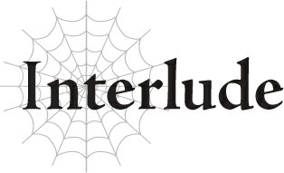

# Đoạn phụ: Lời thở dài của trợ lý Ma Vương tại cuộc họp một lần nữa

*(The Demon Lord’s Aide Sighs at a Meeting Again)*

---

### --- TRANG 26 ---

“Được rồi, bắt đầu cuộc họp thôi nào. Balto?”

“Tuân lệnh.”

Bằng đúng những từ ngữ đã sử dụng trước khi cuộc chiến bắt đầu, Ma Vương mở màn cuộc họp.

Tuy nhiên, các thành viên tham gia cuộc họp kể từ đó đã thay đổi.

Cụ thể là, số lượng của họ đã giảm đi.

Ban đầu có mười chiếc ghế...

Nhưng hiện tại ba trong số đó đang bỏ trống.

“Vậy thì, chúng ta bắt đầu bằng báo cáo tình hình từ các quân đoàn. Thống lĩnh của Quân đoàn 1, Ngài Agner, đã tử trận. Bản thân quân đoàn cũng chịu tổn thất nặng nề. Kể từ đó, chúng tôi đã phân bổ những người sống sót vào các quân đoàn khác.”

Tôi lật giở tài liệu trên tay để truyền đạt thêm thông tin về tình hình hiện tại của Quân đoàn 1.

Trùng hợp thay, tài liệu này cũng chứa đựng nguyên nhân dẫn đến sự sụp đổ của Quân đoàn 1.

Tuy nhiên, tôi không hề đề cập đến chuyện đó.

Mọi người ở đây đều đã biết nguyên nhân, và cả ý nghĩa đằng sau nó nữa.

Quân đoàn 1 đã bị tiêu diệt trong trận chiến với con người.

Thế nhưng, nó chắc chắn không phải bị hủy diệt bởi bàn tay con người.

Quân đoàn 1 khi đó đang tấn công một cứ điểm quan trọng: Pháo đài Kusorion.

Là pháo đài có lợi thế nhất về mặt địa hình bên phía con người, nó được xây dựng vô cùng kiên cố và được đồn trú bởi lực lượng tương xứng.

Đó chính là lý do tại sao chúng tôi đã phái những binh lính tinh nhuệ nhất của quân đội ma tộc đến để

---

### --- TRANG 27 ---

tấn công nơi đó.

Ban đầu, lực lượng của đôi bên có vẻ khá cân bằng.

Con người có lợi thế hơn vì họ có thể chiến đấu từ phía sau các công sự, nhưng dưới sự chỉ huy tài tình của Thống lĩnh Quân đoàn 1 Agner, quân đội của chúng tôi vẫn giữ vững thế trận bất chấp số lượng ít hơn.

Tuy nhiên, con người dần dần bắt đầu giành được thế thượng phong nhờ vào vị trí thuận lợi của họ. Rồi, ngay khi Quân đoàn 1 bắt đầu cân nhắc việc rút lui, thứ đó đã xuất hiện.

Quái vật cấp huyền thoại, thảm họa sống: Taratect Nữ Vương.

Chỉ trong chốc lát, chiến trường đã biến thành hình ảnh của chính địa ngục.

Taratect Nữ Vương chà đạp cả ma tộc lẫn con người, giáng những đòn tàn khốc lên cả hai đội quân.

Có chăng, con người có lẽ đã phải chịu tổn thất lớn hơn do pháo đài của họ bị phá hủy hoàn toàn, nhưng đó vẫn không phải là điều gì đáng để ăn mừng.

Tin đồn lan truyền trong giới loài người là ma tộc đã triệu hồi Nữ Vương ngỗ ngược kia trong một nỗ lực tuyệt vọng nhằm lật ngược tình thế vào phút chót.

Nhưng sự thật còn đen tối hơn thế nhiều.

Ngay từ đầu, con Taratect Nữ Vương đó đã được triệu hồi với ý định tiêu diệt cả hai đội quân cùng một lúc.

Nhằm loại bỏ Thống lĩnh Quân đoàn 1 Agner cùng binh sĩ của ông ta trong một lượt.

Chỉ khi tôi thu dọn đồ đạc của ông ấy sau trận chiến, tôi mới phát hiện ra bằng chứng cho thấy ông ấy đã bí mật cấu kết với tộc Elf.

Vì lý do nào đó, Ma Vương đã ra lệnh cho tôi đích thân xử lý những di vật của ông ấy.

Không lâu sau, tôi tìm thấy các kế hoạch liên quan đến việc cố gắng ngăn chặn chiến tranh với con người, sổ sách ghi chép lợi nhuận từ việc buôn lậu với tộc Elf, và nhiều bằng chứng buộc tội khác.

Tại thời điểm đó, tôi nhận ra lý do tại sao Ma Vương lại đặc biệt ra lệnh cho tôi tự mình đi lục soát hành lý của ông ấy.

Ma Vương đã biết Agner phản bội cô và đang hợp tác với tộc Elf.

Sau đó, cô ta sắp xếp để Taratect Nữ Vương xuất hiện đột ngột trên chiến trường và tình cờ giết chết ông ấy.

Nhưng cô ta không hề có ý định che giấu bất kỳ sự liên can nào của mình.

---

### --- TRANG 28 ---

Thực tế là, cô ta đã chủ ý dẫn dắt tôi đến những thông tin để tôi tự đi đến kết luận đó.

Điều này chỉ có thể mang một ý nghĩa duy nhất.

Cô ta đang tuyên bố rằng mình không có ý định tha thứ cho bất kỳ kẻ phản bội nào.

Làm sao có ai dám nổi loạn chống lại một Ma Vương có thể điều khiển quái vật huyền thoại theo ý muốn chứ?

“Vậy thì, xin mời báo cáo từ Quân đoàn 2.”

“Tuân lệnh.”

Sau khi kết thúc báo cáo chi tiết của mình về Quân đoàn 1, tôi nhường lời lại cho Thống lĩnh Quân đoàn 2, Sanatoria.

“Quân đoàn 2 hiện đang canh giữ từ khu vực gần Pháo đài Okun để đảm bảo rằng lũ Anogratch không rời khỏi pháo đài. Hiện tại, không có sự cố nào như vậy xảy ra, và chúng tôi không chịu bất kỳ thương vong nào.”

Sanatoria báo cáo một cách trôi chảy.

Quân đội của cô ấy đã không phải chịu một tổn thất nào trong trận chiến đó.

Đó là bởi vì cô ấy đã thả lũ quái vật tên là Anogratch vào pháo đài để chúng tàn phá nơi này.

Anogratch là một chủng tộc quái vật linh trưởng, chúng tạo thành những đàn lớn để trả thù nếu chỉ một đồng loại của chúng bị giết.

Đáng sợ hơn nữa, chúng không bao giờ ngừng tấn công cho đến khi kẻ sát hại đồng loại của chúng bị tiêu diệt hoặc toàn bộ đàn của chúng bị quét sạch.

Sanatoria đã tận dụng bản năng của chúng bằng cách gửi một con Anogratch bị bắt vào trong để nó bị con người trong pháo đài giết chết, từ đó khơi dậy cơn thịnh nộ của cả đàn.

Chẳng mấy chốc, một bầy đàn Anogratch khổng lồ đã áp đảo pháo đài, đè bẹp lực lượng phòng thủ một cách dễ dàng.

Quân đoàn 2 thậm chí còn không cần phải động một ngón tay.

Trên thực tế, bởi vì lũ Anogratch vẫn ở lại trong pháo đài, quân đội không thể di chuyển đi đâu cả.

Nếu lũ Anogratch bắt đầu di cư vào lãnh thổ của ma tộc, chúng chắc chắn sẽ gây ra thiệt hại.

Quân đoàn 2 phải ở lại gần Pháo đài Okun để đảm bảo điều đó không xảy ra.

Ít nhất, đó là câu chuyện chính thức.

Trên thực tế, đây chỉ là cái cớ để Sanatoria giữ quân đội của mình ở gần bên.

---

### --- TRANG 29 ---

Hầu hết các quân đoàn khác đều chịu tổn thất nặng nề trong trận chiến trước và hiện đang trong quá trình tái cơ cấu, khiến Quân đoàn 2 trở thành lực lượng duy nhất còn hoàn toàn nguyên vẹn.

Trong số các quân đoàn còn lại, Sanatoria nắm giữ lực lượng có sức mạnh lớn nhất.

Sức mạnh để đối đầu với Ma Vương.

“Này, anh có muốn phản bội Ma Vương và tham gia cùng tôi không?”

Ký ức về lời đề nghị của Sanatoria dành cho tôi đột nhiên hiện về trong tâm trí.

“Nếu chúng ta cứ tiếp tục đi theo vị Ma Vương đó, cuối cùng chúng ta sẽ chỉ bị vắt kiệt cho đến khi không còn lại gì. Nhưng nếu chúng ta bắt tay với tộc Elf để phối hợp một cuộc tấn công bất ngờ, chúng ta chắc chắn có thể hạ bệ ngay cả cô ta.”

Sau cái chết của Agner, có vẻ như tộc Elf đã thiết lập một mối liên hệ mới với Sanatoria.

Cùng với đó, cô ấy đã thừa kế ngọn cờ nổi loạn bằng cách bắt tay với tộc Elf.

Đáp lại lời mời của cô ấy, tôi đã khuyên cô ấy nên từ bỏ những ý nghĩ ngu xuẩn đó ngay lập tức, rồi quay lưng bước đi.

“Chắc chắn anh phải có cảm xúc gì đó về chuyện đã xảy ra với Bloe chứ, đúng không?”

Tôi nghiến răng trước những lời cuối cùng của cô ấy khi tôi rời đi.

Khi tôi lắng nghe báo cáo của các thống lĩnh lúc này, mắt tôi vô thức hướng về chiếc ghế của Thống lĩnh Quân đoàn 7.

Một chiếc ghế giờ đây đang trống rỗng.

Cách đây không lâu, em trai tôi, Bloe, đáng lẽ ra đã ngồi ở đó.

Nhưng điều đó sẽ không bao giờ xảy ra nữa.

Bloe đã chiến đấu trực diện với Anh hùng và tử trận.

Sau đó, ngay lập tức, Thống lĩnh Quân đoàn 10 White đã đánh bại Anh hùng.

Hơn nữa lại là một chiến thắng vô cùng dễ dàng.

Tôi thấy rõ ràng, và bất kỳ ai cũng nên thấy rõ, rằng White đã chủ ý để mặc cho Bloe chết.

Cô ta lặng lẽ đứng nhìn khi Bloe bị giết, mặc dù cô ta thừa sức hạ gục Anh hùng ngay lập tức.

Như thể cô ta đã chờ đợi cái chết của Bloe ngay từ đầu.

Không nghi ngờ gì nữa, em trai tôi bị giết là do Ma Vương đã lên kế hoạch cho việc đó.

---

### --- TRANG 30 ---

Không một ai có thể hiểu được nỗi đau mà tôi đã trải qua vào khoảnh khắc tôi nhận ra điều đó.

Cảm giác như có thứ gì đó đang sôi sục trong dạ dày tôi, vậy mà tôi không còn lựa chọn nào khác ngoài việc kìm nén nó xuống và tiếp tục phục vụ Ma Vương.

Suy cho cùng, không một ai trên thế giới này có thể chống lại cô ta.

Ngay cả khi Sanatoria đang bảo toàn thực lực quân đội của mình và cấu kết với tộc Elf, tất cả những điều đó cũng sẽ chẳng có ý nghĩa gì.

Bởi vì Ma Vương có sức mạnh để một tay tiêu diệt tất cả bọn họ.

Thế mà, một số kẻ không hiểu rõ tình hình bằng cách nào đó đã đi đến kết luận rằng Ma Vương rất yếu.

Cô ta vẫn chưa tham gia vào một trận chiến nào kể từ khi trở thành Ma Vương, dẫn đến những tin đồn rằng cô ta có thể không mạnh như vẻ bề ngoài. Vì lý do nào đó, một vài đồng nghiệp của tôi đã hoàn toàn tin sái cổ chuyện đó.

Sanatoria là một trong số họ.

Lý do Ma Vương không trực tiếp ra trận không phải là vì cô ta yếu.

Không, đó là bởi vì sức mạnh của cô ta quá lớn, biến bất kỳ trận chiến nào cô ta tham gia trở thành một cuộc tàn sát một chiều.

Và Ma Vương không muốn điều đó.

Cô ta muốn ma tộc chiến đấu và lấy đi càng nhiều mạng sống càng tốt khi làm điều đó.

Đó là lý do tại sao cô ta sử dụng quân đội thay vì tự mình ra tay, mặc dù sự thật là nếu cô ta thực sự muốn, cô ta có thể gạt bỏ mọi thứ khác và một mình dẫm nát toàn bộ kẻ thù.

Hơn thế nữa, chính vị Ma Vương đó lại có White dưới quyền, người có thể giết chết một Anh hùng ngay lập tức.

Tại sao tôi lại đi kiếm chuyện với một kẻ như thế chứ?

Để trả thù cho em trai tôi sao?

Cô ta đã để mặc cho nó chết, đúng vậy, nhưng Anh hùng mới là kẻ thực sự hạ sát nó.

Tôi không thể oán hận Ma Vương vì điều đó.

Nếu tôi làm cô ta phật ý, điều đó chẳng khác nào từ bỏ số phận của toàn bộ ma tộc.

Cuối cùng, tôi bắt buộc phải thề trung thành với Ma Vương.

So với vận mệnh của toàn bộ chủng tộc chúng tôi, cảm xúc cá nhân của tôi hầu như không đủ để làm lệch cán cân chút nào.

---

### --- TRANG 31 ---

Sanatoria đơn giản là không hiểu được điều đó.

“Tiếp theo, xin mời Thống lĩnh Quân đoàn 3.”

Giọng tôi lạnh lùng khi tôi hướng về phía Thống lĩnh Quân đoàn 3, Kogou.

Người đàn ông này đang bí mật hợp tác với Sanatoria.

Sanatoria đã cố gắng che giấu sự thật rằng cô ấy đang hợp tác với ông ta, nhưng cô ấy thực sự nghĩ rằng tôi sẽ không phát hiện ra sao?

Nếu vậy, cô ấy còn ngây thơ hơn tôi nghĩ.

“T-Tình hình hiện tại của Quân đoàn 3, ừm, là như sau...”

Kogou ấp úng qua bản báo cáo của mình.

Khả năng chiến đấu của ông ta khá cao, nhưng trí tuệ thì không có gì nhiều để nói.

Tôi chắc chắn Sanatoria chỉ đơn giản là dùng lời ngon ngọt để dụ dỗ ông ta hợp tác với cô ấy.

Có lẽ cô ấy thậm chí đã tận dụng tính cách hiền lành và sự chán ghét chiến tranh của ông ta.

Hầu như không buồn lắng nghe báo cáo của ông ta, tôi nhìn sang chiếc ghế của Thống lĩnh Quân đoàn 6.

Chiếc ghế này cũng đang trống rỗng.

Nếu cậu ta còn sống, người từng ngồi trên chiếc ghế này, Huey, có khả năng cũng sẽ hợp tác với Sanatoria.

Khi còn sống, Huey rất thân thiết với Sanatoria.

Nếu nghe tin Sanatoria đang hợp tác với tộc Elf, tôi không nghi ngờ gì việc cậu ta sẽ tham gia cùng cô ấy mà không chút do dự.

Đó là một thống lĩnh trẻ con, cả về ngoại hình lẫn tính cách.

Tôi nghe nói rằng quân đội của cậu ta đã chạm trán với lực lượng do Ronandt dẫn đầu, người được cho là pháp sư loài người mạnh nhất còn sống, và đã bị hạ gục bởi chính ma pháp của Ronandt.

Theo hiểu biết của tôi, cậu ta là thống lĩnh duy nhất cho đến nay tử trận thuần túy do sức mạnh của quân đội loài người chứ không phải vì những âm mưu của Ma Vương.

Tuy thế, điều đó không có nghĩa là Huey đặc biệt yếu hơn các thống lĩnh khác.

Mặc dù có phần chưa trưởng thành, sức mạnh và trí tuệ của cậu ta hoàn toàn xứng đáng với vị trí của mình.

Chỉ đơn giản là vì Ronandt thậm chí còn mạnh hơn và khôn ngoan hơn.

Thay vì nói xấu Huey vì đã thua trận, sẽ khôn ngoan hơn nếu khen ngợi Ronandt vì đã giành chiến thắng.

---

### --- TRANG 32 ---

Ngay cả khi cậu ta có sống sót, cân nhắc việc Sanatoria có thể đã lợi dụng cậu ta, có lẽ việc chết trên chiến trường sau khi thua cuộc trước một đối thủ lão luyện như vậy lại tốt hơn cho cậu ta.

“Quân đoàn 10 đã hoàn thành việc tái cơ cấu.”

Lời tuyên bố ngắn gọn kéo tôi trở lại thực tại.

White, Thống lĩnh Quân đoàn 10, đã đưa ra báo cáo cuối cùng.

Cô ta dường như không có ý định đưa ra bất kỳ chi tiết nào khác, vì cô ta không nói thêm lời nào sau câu nói ngắn gọn đó.

Tôi có rất ít thông tin về hành tung hay biên chế của Quân đoàn 10.

Nhiều khả năng, Ma Vương ra lệnh trực tiếp cho White, sử dụng quân đoàn đó theo cách riêng của mình.

Tôi nhìn White một lần nữa.

Thật sự, không có cách nào khác để miêu tả cô ta ngoài từ “trắng”.

Cô ta trông không giống một kẻ có thể quét sạch một Anh hùng một cách dễ dàng, nhưng bản thân Ma Vương là minh chứng cho thấy ngoại hình không liên quan gì đến sức mạnh.

Cô gái này là quân bài tẩy của Ma Vương, là thuộc hạ đắc lực nhất của cô ta.

“Được rồi. Có vẻ như các báo cáo đã kết thúc rồi nhỉ? Vậy thì chúng ta hãy đi vào chủ đề chính của ngày hôm nay thôi.”

Nhận thấy các báo cáo đã đến lúc dừng lại thích hợp, Ma Vương hắng giọng.

Không biết rõ nội tình, hầu hết các thống lĩnh đều có vẻ ngạc nhiên khi nghe Ma Vương tự ý lên tiếng.

Trong hầu hết các cuộc họp, cô ta phó mặc mọi thứ cho tôi và hầu như không nói lời nào.

Họ chắc chắn cảm thấy diễn biến này thật đáng ngờ.

“Nói ngắn gọn thế này, tôi chuẩn bị trực tiếp dẫn dắt quân đội của mình, cùng Quân đoàn 4, Quân đoàn 8, và Quân đoàn 10 đi tiêu diệt tộc Elf ngay bây giờ.”

Tuyên bố bất ngờ này làm chấn động các thống lĩnh đến tận xương tủy.

Không nghi ngờ gì nữa, Sanatoria và Thống lĩnh Quân đoàn 3 Kogou là những người hoang mang nhất trước tin tức này.

Suy cho cùng, hai người bọn họ đang bí mật cấu kết với tộc Elf mà.

“Phải đó, tôi hơi bị ngán lũ đó rồi, nên tôi nghĩ đã đến lúc cho chúng biến mất rồi đấy. Cho đến khi chúng tôi quay lại, các quân đoàn khác hãy lo tái cơ cấu và duy trì trị an đi nha. Và đảm bảo con người không có cơ hội tấn công chúng ta hay làm gì tương tự đó. Rõ chưa?”

---

### --- TRANG 33 ---

Giọng điệu của Ma Vương vẫn nhẹ nhàng như mọi khi.

Sanatoria và Kogou chắc hẳn đang hoảng loạn tột độ ở bên trong.

“Ồ, nhưng mà đừng có nghĩ tới chuyện tranh thủ lúc tôi đang bận đối phó với kẻ địch mà đâm sau lưng tôi nha? Vì cái trò đó không có tác dụng đâu nè.”

Như để giáng một đòn chí mạng vào ý định nổi loạn của họ, Ma Vương đưa ra lời cảnh báo cuối cùng với một nụ cười trên môi.

Sanatoria và Kogou tái mét mặt mày thấy rõ.

Thấy chưa? Đúng y như những gì tôi đã nói với các người.

Đừng có dại dột mà thử.

Ma Vương vượt trội hơn tất cả chúng tôi không chỉ về sức mạnh thuần túy mà còn về mọi mặt có thể tưởng tượng được.

Cô ta là một con quái vật theo những cách mà chúng tôi không bao giờ có thể đo lường nổi.

Không có cách nào để đánh bại cô ta.

Nếu vị Ma Vương đó đã nói rằng cô ta chuẩn bị hủy diệt thứ gì đó, thứ đó chắc chắn sẽ bị hủy diệt đến mức không thể nhận dạng.

Số phận của tộc Elf đã được định đoạt.
