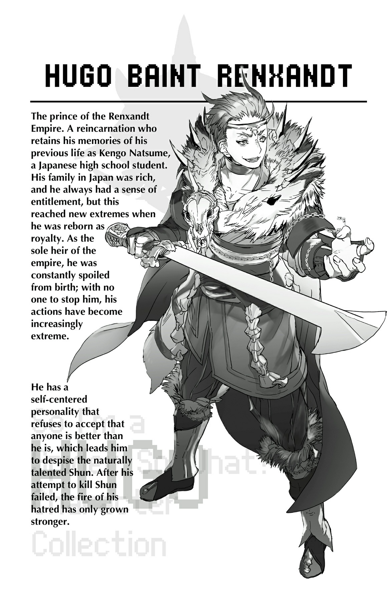

# Chương S10: Những người tái sinh tụ họp

Kudo dẫn chúng tôi vào một phòng ăn.

Cũng giống như phần còn lại của làng Elf, nơi này được xây dựng bên trong một cái cây lớn.

Cái cây này đặc biệt to lớn, nhưng bên trong vẫn chật chội vì xếp đầy bàn ghế.

Không hiểu sao nó làm tôi nhớ đến khu cắm trại ngoại khóa hồi học cấp hai.

Bên trong phòng ăn, bốn người bạn khác đang nấu nướng.

Một trong những cậu bạn chú ý đến chúng tôi và dừng tay.

Cậu ta nhìn Katia và tôi với vẻ hoài nghi, nhưng mắt trợn tròn khi nhận ra Fei.

Dù đã nhiều năm trôi qua, có vẻ nhiều người vẫn nhớ rõ cô ấy.

Tôi đoán điều đó có lẽ liên quan đến tính cách mạnh mẽ của cô ấy kiếp trước.

“Kudo, ba người kia có phải là...?”

“Phải, là họ đấy.”

Kudo gọi bốn người đang nấu nướng lại.

Mọi người đi về chỗ ngồi thường ngày của họ, trong khi Kudo dẫn ba chúng tôi lên phía đầu phòng ăn.

“Trước hết, tớ có thể nhờ các cậu tự giới thiệu lại một lần nữa không?”

“Tớ là Yamada Shunsuke.”

“Ooshima Kanata.”

“Còn tớ là Shinohara Mirei, rõ ràng quá rồi nhỉ.”

Ngay khi chúng tôi vừa dứt lời giới thiệu, cả căn phòng liền xôn xao bàn tán.

Không ngoài dự đoán, hầu hết ánh mắt trong phòng đều đổ dồn vào Katia.

“Shun và Kanata? Có thật là hai cậu không?”

Đó là cậu bạn đã nấu nướng lúc nãy.

“Ừ.”

--- PAGE BREAK ---

Ngay khi tôi trả lời, gương mặt cậu ta nở một nụ cười rạng rỡ.

“Mừng là gặp lại cậu, ông bạn!”

Nụ cười đó mang lại cho tôi một cảm giác rất quen thuộc.

Dù diện mạo đã khác, nhưng sự thân thiện chân thành đó thì tôi có thể nhận ra ở bất cứ đâu.

“Ogi?”

“Ừ, tớ đây. Sao cậu nhận ra được hay vậy?”

“Cậu là người duy nhất tớ biết có nụ cười ngốc nghếch như vậy đấy.”

Ogiwara Kenichi, hay còn gọi là Ogi, cười càng tươi hơn.

Cậu ấy là bạn từ hồi còn ở câu lạc bộ bóng đá.

Nhân tiện, biệt danh của cậu ấy được đặt theo họ vì tên thật của cậu dễ bị nhầm lẫn với Natsume Kengo, thân phận kiếp trước của Hugo.

Sau Ogi, những người khác trong lớp lần lượt tự giới thiệu.

Có những người tôi vô cùng nhớ thương, trong khi một số khác tôi phải thừa nhận là hầu như không nhớ nổi.

Tổng cộng có mười ba người tái sinh ở đây.

Nhiều hơn hai người so với con số mười một mà cô Oka đã nói trước đó.

Hai người mới là Tagawa Kunihiko và Kushitani Asaka.

“Hai cậu từng làm mạo hiểm giả à?”

“Dĩ nhiên rồi. Đã đến thế giới giả tưởng thì phải đi phiêu lưu chứ, đúng không?”

“Tớ không chắc về chuyện đó đâu...”

Tagawa và Kushitani hình như từng là lính đánh thuê trước khi đến đây.

Cụ thể, cha mẹ của cả hai đều thuộc các băng lính đánh thuê riêng, nên họ đã lớn lên bên nhau như thanh mai trúc mã.

Tuy nhiên, những băng lính đánh thuê đó đã bị xóa sổ trong một trận chiến chống lại ma tộc.

Sau đó, hai người họ quyết định chuyển từ lính đánh thuê sang mạo hiểm giả, tự mình bôn ba.

Trong cuộc hành trình, họ được tộc Elf liên lạc, và đó là lý do họ đến đây.

Họ chỉ mới đến làng gần đây.

“Khoan đã, sao kiếp này cậu lại thành mỹ nữ thế hả, Kanata?”

“Tớ cũng muốn biết tại sao đây.”

Katia sụ vai xuống bất lực.

Rõ ràng, cô là người duy nhất bị thay đổi giới tính.

--- PAGE BREAK ---

“Dù sao đi nữa, ít nhất cậu vẫn là con người. Tớ là quái vật luôn đây này!”

Fei bắt đầu kể về bản thân, và các cô gái lập tức vây quanh cậu ấy.

Không hiểu sao điều này dẫn đến việc họ chạm vào cánh của Fei rồi hét toáng lên thích thú.

Dù bằng cách này hay cách khác, cậu ấy luôn là trung tâm của các cô gái trong lớp.

Chẳng mấy chốc, các cô gái đều đã tụ tập quanh Fei, trong khi các chàng trai vây quanh Katia và tôi.

Trong số mười ba người ở đây, có năm nam và tám nữ.

Có vẻ các chàng trai hơi e dè vì số lượng nam bị áp đảo.

Chúng tôi bắt đầu trao đổi thông tin.

“Vậy là tên ngốc Natsume đó chuẩn bị đến tấn công chúng ta à?” Tagawa hỏi với vẻ hoài nghi.

“Ừ.”

Tôi gật đầu nghiêm nghị.

“Natsume hả...?”

Gương mặt Ogi hiện rõ vẻ mâu thuẫn phức tạp.

Cậu ấy từng là bạn thân của chúng tôi và cả Hugo.

Việc cậu ấy bị sốc khi biết một người bạn cũ thay đổi chóng mặt đến thế là điều tự nhiên.

Những cậu bạn khác cũng tỏ ra bàng hoàng, nhưng tôi có thể thấy qua nét mặt rằng họ không ngạc nhiên lắm.

Natsume của ngày xưa dù sẽ không làm gì điên rồ như Hugo hiện tại, nhưng cậu ta vốn luôn có tính khí hống hách và khó ưa.

Nhiều cậu bạn thầm ghét Natsume, dù họ không dám nói ra thành tiếng.

Đó có lẽ là lý do tại sao phần lớn các phản ứng đều kiểu như “Ừ, tớ tin ngay”.

“Tộc Elf không kể cho các cậu chuyện đang xảy ra ở thế giới bên ngoài sao?” Katia hỏi.

Ogi ngập ngừng một giây trước khi trả lời.

“Ừ. Họ cố gắng ít liên can tới chúng tớ nhất có thể.”

“Tớ hiểu rồi. Nhưng cái sự ngập ngừng kỳ lạ vừa rồi là sao thế?”

Lần này, Ogi liếc nhìn các cậu bạn khác.

“Ờ, xin lỗi nếu tớ tỏ ra kỳ lạ. Chỉ là, thật khó để tin một cô gái xinh đẹp như cậu lại chính là Kanata đấy, cậu hiểu chứ?”

Các chàng trai khác đều gật đầu đồng ý.

Vẻ mặt của Katia lúc này thật khó đoán.

--- PAGE BREAK ---

“Ừ, tớ đoán là vậy nhỉ.”

“Chết tiệt, tớ xin lỗi! Tớ biết cậu không tự chọn làm con gái hay gì cả, và tớ chắc chắn chuyện đó rất khó khăn với cậu! Chỉ là cậu bây giờ trông cứ như một người hoàn toàn khác vậy...”

Sự hoảng loạn của Ogi cho thấy rõ ràng cậu ấy lúng túng thế nào khi giao tiếp với Katia.

“Không sao đâu, ông bạn. Cứ nói chuyện với tớ bình thường như trước đây là được, ổn chứ?”

“Cậu nói thì dễ lắm...”

“Nếu chuyện đó làm cậu khó xử đến vậy, tớ sẽ sang bên hội con gái. Được chưa?”

“Không, làm ơn ở lại đây đi.”

Ogi cuống cuồng níu lại.

Lý do cậu ấy muốn cô ở lại quá rõ ràng.

Ý tôi là, Katia xinh đẹp đến mức ngỡ ngàng.

Tớ chắc chắn cậu ấy chỉ là phấn khích khi được nói chuyện với một người xinh đẹp như vậy thôi.

“Shun, cậu đi đến đây cùng với Kanata và Shinohara đúng không? Trời ơi, tớ ghen tị quá đi mất. Cậu có người đẹp ở cả hai bên tay luôn kìa!”

Ogi quay sang than thở với tôi.

Mặc dù một trong hai cô gái đó đang đứng ngay trước mặt chúng tôi.

“Nhưng một bên là Kanata, còn bên kia là... ờ thì... Shinohara mà.”

Ít nhất thì Tagawa cũng nói đỡ cho tôi.

“Với lại, là do tớ hoang tưởng hay tất cả những người tái sinh chúng ta đều đẹp mã hơn mức trung bình vậy?”

Nghe câu đó, tôi nhìn lại gương mặt của những người xung quanh.

Cậu ấy nói đúng thật: ai nấy trông cũng đều rất ưa nhìn.

Kiếp trước tôi trông khá mờ nhạt, và ngoại trừ những người nổi bật hẳn như Fei và Wakaba, hầu hết các bạn học khác của tôi cũng có ngoại hình bình thường tương tự.

Nhưng dù ở đây có đủ kiểu ngoại hình đa dạng, nhìn chung ai cũng đều xinh đẹp lộng lẫy.

Có lẽ vị thần tái sinh chúng tôi muốn ban cho cả bọn một đặc ân.

“Cậu nói đúng đấy. Vậy nên đừng có mà than thở nữa nhé?”

Katia thúc nhẹ Ogi đầy trêu chọc, và cậu ấy giơ tay vờ đầu hàng.

Trong một khoảnh khắc, cảm giác gần như chúng tôi đã trở lại cuộc sống kiếp trước.

Nhưng tất nhiên, đó chỉ là một ảo ảnh.

Đến giờ, tất cả chúng tôi đều đã trải qua cùng một khoảng thời gian ở thế giới này.

“Vậy là phần lớn các cậu về cơ bản đều bị tộc Elf bắt cóc và đưa đến đây à?”

--- PAGE BREAK ---

Giọng nói của Katia kéo tôi trở về thực tại. Trong khi tôi mải chìm đắm trong cảm xúc, chủ đề câu chuyện đã chuyển sang cách mọi người đến làng Elf.

Ogi và những người khác gật đầu.

“Hoàn cảnh của mỗi người có chút khác nhau, nhưng đúng vậy. Rất nhiều người trong chúng tớ bị cha mẹ bán lấy tiền. Tớ nghe nói Temarikawa đúng thật là đã bị bắt cóc đấy.”

Sự thật này khiến tôi cảm thấy hơi choáng váng.

Tôi luôn tin tưởng vào cô Oka và nỗ lực bảo vệ những người tái sinh của cô, nhưng giờ rõ ràng là việc này có một mặt tối.

Các bạn học của tôi bị giao dịch hoặc bị bắt giữ như nô lệ sao?

Ngược lại, Katia trông bình tĩnh một cách lạ thường.

“Cậu không thấy sốc sao?”

“Ý tớ là, có chứ. Nhưng tớ đã có nghi vấn từ trước rồi.”

Katia đã nghi ngờ cô Oka ngay từ đầu.

Cậu ấy chắc chắn đã đặt ra rất nhiều giả thuyết.

Bao gồm cả những việc mờ ám mà cô Oka có thể đã làm trong quá trình đó.

Tôi nhớ lại điều Sophia đã nói khi chúng tôi đối đầu với cô ta.

Cô ta đã nói với cô Oka: “Chính bản thân cô cũng đã giết không ít người đâu.”

Lúc đó, tôi biết hẳn phải có một lý do chính đáng, và tôi vẫn không tin rằng cô giáo của chúng tôi lại giết người vô cớ.

Nhưng đồng thời, tôi không thể phủ nhận rằng những mối nghi ngờ của tôi về cô Oka chỉ có tăng chứ không giảm.

Tôi muốn tin tưởng cô, nhưng tôi không thể, ít nhất là không hoàn toàn.

Chúng tôi có thực sự nên bảo vệ tộc Elf chút nào không?

Dĩ nhiên, nếu Hugo tấn công nơi này, tôi phải chiến đấu để bảo vệ những người tái sinh đang sống ở đây.

Hơn nữa, tôi cũng có những lý do của riêng mình để muốn đánh bại cậu ta.

Nhưng tôi phải làm gì sau đó đây?

Từ những gì nghe được cho đến nay, hầu như không một ai ở đây hài lòng với cuộc sống hiện tại.

Họ liên tục bị tộc Elf giám sát.

Dựa trên những gì họ kể và công việc họ làm lúc nãy, họ dường như đang sống tự cung tự cấp ở mức độ nào đó.

Họ trồng rau trên ruộng và nuôi gia súc lấy thịt.

Nếu họ cần thứ gì đó không thể tự kiếm được ở đây, tộc Elf sẽ cung cấp, nhưng phần lớn thì họ tự lo liệu mọi thứ.

--- PAGE BREAK ---

Hầu hết họ được đưa đến đây khi còn là trẻ sơ sinh hoặc quá nhỏ để nhận thức được thế giới xung quanh.

Ở độ tuổi đó, tộc Elf chăm sóc họ, nhưng sự hiện diện của họ dần ít đi, và giờ họ hiếm khi liên lạc ngoại trừ việc giám sát và cung cấp nhu yếu phẩm.

“Tớ đoán họ không muốn chúng tớ hoạt động quá nhiều,” Ogi nói.

Cậu ấy có lẽ đã đúng.

Tộc Elf không muốn những người tái sinh tăng cấp kỹ năng của họ.

Bởi vì cuộc chiến của họ với các quản trị viên mà cô Oka đã kể cho chúng tôi nghe.

Nhưng liệu đó có thực sự là lý do duy nhất?

Liệu điều đó có đủ để biện minh cho việc phạm tội để bắt giữ những người tái sinh và ép họ vào lối sống này không?

Chắc chắn phải có điều gì đó khác mà chúng tôi không biết.

Có phải cô Oka đang che giấu nó với chúng tôi không?

Và điều đó là tốt cho chúng tôi hay không đây?

Tôi không hề biết.

Nhưng ngay lúc này, tình hình của Hugo quan trọng hơn.

Một khi chuyện đó kết thúc, tôi sẽ phải đối chất với cô Oka một lần cho xong.

Ngay cả khi điều đó đồng nghĩa với việc chống lại tộc Elf.

Nỗi bất an gặm nhấm tôi khi nghe Ogi và những người khác nói.

Niềm phấn khởi khi hội ngộ những người bạn cũ kéo dài hàng giờ liền, và chúng tôi đã hàn huyên gắn kết lại tình bạn cho đến khi mặt trời lặn.

Điều này nghĩa là giờ tôi đã gặp mặt gần hết những người tái sinh.

Chỉ còn lại hai người là tôi chưa thấy mặt, ngoại trừ bốn người được cho là đã chết.

Một trong hai người đó là người bạn thân thiết của tôi và Katia, Sasajima Kyouya.

Khi cô Oka kể cho chúng tôi nghe về Sophia, cô ấy đã nói:

“Tên cô ta là Sophia Keren. Và ở kiếp trước, cô ta là Negishi Shouko. Cô ta là một trong những người tái sinh đã đứng về phía các quản trị viên.”

Một trong những người tái sinh đã đứng về phía các quản trị viên.

Chẳng phải điều đó có nghĩa là ngoài Sophia ra, còn có những người tái sinh khác cũng làm như vậy sao?

--- PAGE BREAK ---

Nghĩ lại thì, khi tôi hỏi cô Oka về Kyouya, cô ấy trắng trợn né tránh câu hỏi.

Có phải điều đó nghĩa là cậu ấy cũng là một trong số họ không?

Có phải cô đã biết về chuyện đó và giấu nhẹm thông tin đó với chúng tôi?

Nếu vậy, nó sẽ lý giải được rất nhiều điều.

Thật không may.

Tôi vẫn chưa nói chuyện này với Katia.

Tôi chắc chắn cậu ấy đã đi đến cùng một kết luận từ lâu trước tôi.

Và hiểu tính Katia, cậu ấy có lẽ đã suy nghĩ thấu đáo hơn cả tôi nữa.

Về lý do tại sao cô Oka lại giấu chúng tôi chuyện đó.

Cho đến tận bây giờ, tôi luôn tin rằng nếu cô Oka giữ bí mật, hẳn phải có một lý do chính đáng.

Tôi không nghĩ cô ấy sẽ che giấu chúng tôi bất cứ điều gì, trừ khi bắt buộc phải làm vậy.

Hẳn phải có một lý do nào đó mà cô không thể nói cho chúng tôi nghe, vì lợi ích của chính chúng tôi.

Nhưng sau khi nghe câu chuyện từ phía những người tái sinh khác, giờ tôi không chắc nữa.

Nếu tôi đã sai, và cô giấu thông tin này không phải vì chúng tôi mà là vì bản thân cô thì sao?

Có phải cô tránh kể cho chúng tôi nghe về Kyouya vì việc chúng tôi biết chuyện sẽ gây bất lợi cho cô?

Tôi rất muốn tin tưởng cô.

Nhưng càng lúc, tôi càng không chắc mình có thể làm vậy nữa hay không.

Liệu mọi mối nghi ngờ này có tan biến nếu tôi được gặp lại Kyouya không?

Này, Kyouya.

Cậu đang ở đâu vào lúc này? Cậu đang làm gì thế?

Nếu chúng ta gặp lại, đó sẽ là với tư cách bạn bè? Hay là kẻ thù?

Tất cả những câu hỏi đó đều không có lời giải đáp.

