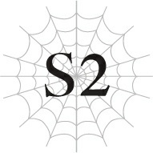
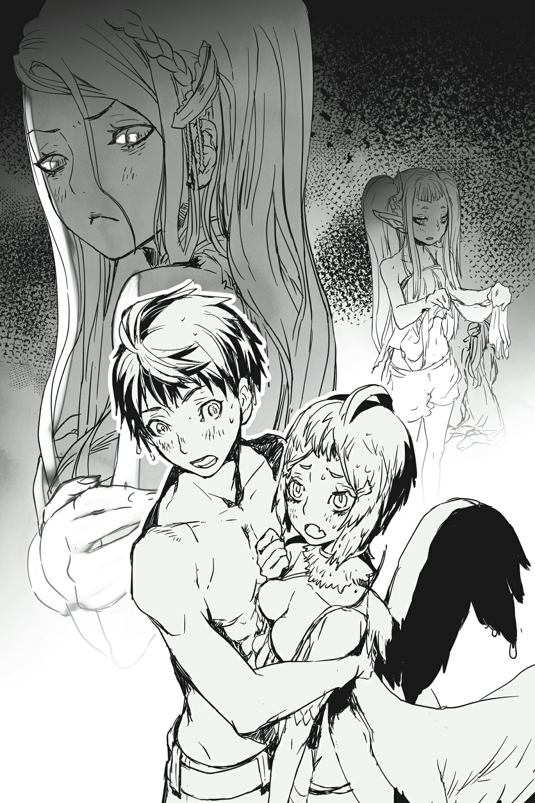

# Chương S2: Bước Chân Vào Mê Cung Lớn Elroe

*(Entering the Great Elroe Labyrinth)*

---

### --- TRANG 41 ---

“Ừ-ừm, này. Thật ra thì, tớ hơi không biết bơi...”

Sau khi Basgath đồng ý dẫn đường cho chúng tôi vào ngày hôm qua, cả nhóm đã hoàn tất khâu chuẩn bị và hiện đang sửa soạn tiến vào Mê cung Lớn Elroe.

Thay vì đi qua lối vào được canh phòng bởi pháo đài, hiện tại chúng tôi đang đứng bên bờ đại dương.

“Nghe cho kỹ đây. Nếu nhảy xuống từ vách đá này, sẽ có một lối vào Mê cung Lớn Elroe nằm dưới đáy biển phía dưới. Ở đây không có đứa ngốc nào không biết bơi chứ hả?”

Câu hỏi đó chính là nguyên nhân dẫn đến lời thú nhận đầy ngập ngừng của Fei.

Khi mọi người nhìn Fei với vẻ mặt không thể tin nổi, cô ấy thu mình lại vì ngượng ngùng.

Ngay cả Basgath có lẽ cũng chỉ nói đùa khi phát ngôn câu đó; tôi không nghĩ ông ta thực sự ngờ rằng trong nhóm chúng tôi lại có người không biết bơi.

Lúc này, ông ta đang gãi đầu một cách ngượng ngập.

Nhân tiện, tất cả chúng tôi hiện tại đều đang mặc đồ bơi.

Nghĩa là Basgath vốn đã báo trước việc cả nhóm phải bơi, vậy mà Fei vẫn nín nhịn cho đến tận phút chót mới chịu thừa nhận là mình không biết bơi.

“Cô không biết bơi thật đấy à?”

Anh Hyrince phá vỡ bầu không khí gượng gạo bằng một giọng điệu trầm ngâm.

“Ừm...”

Giọng của Fei nhỏ dần rồi chìm vào tiếng gió.

Chuyện này quả là... nằm ngoài dự đoán.

Ở cả kiếp này lẫn kiếp trước, Fei luôn tỏ ra là mẫu người có thể làm tốt mọi thứ.

Nhưng giờ nghĩ lại, đúng là tôi chưa từng thấy cô ấy bơi bao giờ.

---

### --- TRANG 42 ---

Dĩ nhiên, ở thế giới này không có những nơi bơi lội an toàn như hồ bơi, nên dù sao chúng tôi cũng hiếm khi có cơ hội bơi lội ở đây.

Kiếp trước ở trường trung học cũng có một hồ bơi, nhưng vì nam và nữ học các tiết bơi riêng biệt, tôi cũng chưa bao giờ nhìn thấy cô ấy bơi khi đó.

Tóm lại, tôi không có cách nào biết được trình độ bơi của cô ấy thực sự tệ đến mức nào.

“Fei, khả năng tốt nhất của cậu là thế nào?”

“Chịu thôi. Ở thế giới cũ của chúng ta, tớ thậm chí còn không bơi nổi tám mươi feet. Còn với cơ thể này thì tớ chưa thử lần nào.”

Đó không phải là một câu trả lời hữu ích cho lắm.

Như vậy nghĩa là cô ấy có thể bơi một chút, chỉ là không quá tám mươi feet thôi sao?

Nếu không thì cô ấy đã nói thẳng là mình hoàn toàn không biết bơi rồi.

Hơn nữa, với chỉ số của mình, tôi cá là cô ấy vẫn có thể xoay xở bơi được bằng cách nào đó.

Chỉ số của cô ấy thậm chí còn cao hơn cả của tôi.

Dù sao cô ấy cũng là rồng mà.

“Chúng ta nên làm gì đây?”

Anh Hyrince nhíu mày.

Fei là chiến binh mạnh nhất trong nhóm của chúng tôi.

Vì cả nhóm đang đi chiến đấu với Hugo, chúng tôi không thể chỉ để cô ấy lại đây được.

“Nếu cậu gặp khó khăn, tớ sẽ giúp cậu xuống dưới đó.”

Katia lập tức lườm tôi cháy mặt ngay khi tôi vừa dứt lời, nhưng chúng tôi còn biết làm thế nào khác được chứ?

Cơ thể của Fei rất nặng.

Mặc dù hiện tại cô ấy đang ở dạng người, nhưng trọng lượng của cô ấy vẫn bằng với khi ở dạng rồng.

Khi ở dạng này, cô ấy giải quyết vấn đề đó bằng cách sử dụng Trọng Lực Ma Pháp để điều khiển trọng lực.

Nhưng ở dưới nước, cô ấy có lẽ sẽ phải hủy bỏ ma pháp đó, vì cô ấy sẽ không thể kiểm soát nó một cách chính xác được.

Nếu chuyện đó xảy ra, tôi là người duy nhất có khả năng đỡ nổi trọng lượng của cô ấy, vì chỉ số của tôi là cao nhất.

Không ai khác ngoài tôi phù hợp để đảm nhận công việc đó cả.

Katia chắc hẳn cũng biết điều đó, nên có lẽ đó là lý do cô ấy chỉ đơn thuần lườm tôi chứ không nói lời nào.

Thành thật mà nói, tôi cảm thấy sẽ đỡ đáng sợ hơn nếu cô ấy chịu nói gì đó.

---

### --- TRANG 43 ---

“Fei, tốt hơn hết là cậu nên bơi như thể mạng sống của mình phụ thuộc vào nó đi.”

Katia chuyển cơn giận sang phía Fei.

Nó khiến tôi lạnh cả sống lưng, mặc dù luồng sát khí đó không nhắm vào mình.

Fei im lặng gật đầu, nhưng tôi khá chắc chắn là đã thấy mặt cô ấy hơi tái đi.

“Chà chà. Mấy đứa nhóc này liệu có ổn không đây?”

“Tôi không dám hứa chắc điều đó, nhưng chúng tôi cũng chẳng còn cách nào khác.”

Cái nhướn mày của Basgath cùng tiếng thở dài của anh Hyrince có chút ái ngại.

“Được rồi, các nhóc. Tập trung nào! Đại dương là lãnh địa của lũ Thủy Long. Nếu các cậu lơ là cảnh giác, chúng sẽ ngoạm các cậu đi trong nháy mắt đấy!”

Trước lời khiển trách của Basgath, chúng tôi dẹp bỏ cuộc tranh cãi nhỏ nhặt và nghiêm túc lại.

“Được rồi, đi thôi! Bám sát ta đấy, mấy đứa!”

Nói đoạn, Basgath nhảy xuống khỏi vách đá.

Những người còn lại trong chúng tôi lập tức nối gót theo sau.

Lao mình vào dòng nước, tôi nhanh chóng nhìn quanh.

Ngay bên cạnh, Fei đang khua khoắng chân tay một cách điên cuồng trong nỗ lực bơi lội tuyệt vọng.

Cô ấy có vẻ không bị chìm, nhưng cũng chẳng di chuyển được đi đâu cả.

Nắm lấy một tay của cô ấy, tôi kéo cô ấy đi cùng.

Không biết là do Trọng Lực Ma Pháp hay do tác dụng của nước, nhưng cô ấy hoàn toàn không có vẻ gì là nặng nề cả.

Kéo cô ấy tới lối vào chắc cũng không quá khó khăn.

Tôi bắt đầu bơi theo sau Basgath.

Chúng tôi lặn sâu dần, sâu dần. Sau khoảng ba mươi feet hoặc đại loại thế, lối vào Mê cung Lớn Elroe hiện ra trước mắt.

Basgath bơi vào cái hang đang há miệng trên vách đá trước tiên.

Theo sau ông lần lượt là anh Hyrince, cô Oka, Anna, và Katia.

Ngay lúc đó, tôi đột nhiên cảm nhận thấy một sự hiện diện ở phía sau lưng mình.

Lo sợ quay đầu lại, tôi nhìn thấy một sinh vật khổng lồ đang bơi về phía chúng tôi một cách thong thả.

Một con Thủy Long.

Ngoại hình của nó trông giống hệt như Quái vật hồ Loch Ness.

Ngay khi nhìn thấy chúng tôi, con Thủy Long lao thẳng tới không chút do dự.

“Ưm?!”

Fei chật vật tìm cách thoát thân, nhưng tất cả những gì cô ấy có thể làm chỉ là quẫy đạp điên cuồng trong nước mà không tiến thêm được bao nhiêu.

Tôi cũng cố gắng nhanh chóng kéo cả hai di chuyển đi nơi khác, nhưng rõ ràng con Thủy Long có lợi thế tuyệt đối trong việc di chuyển dưới nước.

---

### --- TRANG 44 ---

Cứ đà này, nó sẽ bắt kịp chúng tôi trước khi chúng tôi đến được lối vào.

Nếu nó tiếp cận được, mọi chuyện sẽ chấm hết.

Chiến đấu với một con Thủy Long trong khi phải nhịn thở dưới nước không khác nào tự sát. Chưa kể, vũ khí của tôi hiện tại đều đang nằm trong túi Lưu trữ Không gian của Basgath, nên tôi đang tay không tấc sắt.

Fei liếc nhìn tôi và nhận thấy sự hoảng loạn của tôi, liền quay người lại và há miệng ra.

Một luồng sáng rực rỡ phóng ra từ cổ họng cô ấy.

Đó là một đòn phun thở!

Luồng sáng rẽ nước lao thẳng về phía con Thủy Long.

Để tự vệ, con Thủy Long cũng đáp trả bằng một đòn phun thở của chính nó.

Đòn tấn công của Quang Phi Long và Thủy Long va chạm vào nhau, truyền đi những sóng chấn động dữ dội qua làn nước.

Rất may mắn, những con sóng đó đã đẩy Fei và tôi bay thẳng vào lối vào của mê cung.

Bị cuốn xoay vòng qua đường hầm chật hẹp, cơ thể chúng tôi va đập liên tiếp vào các vách đá.

Không muốn bị lạc mất nhau, tôi kéo Fei về phía mình và ôm chặt lấy cô ấy.

Cảm giác giống như chúng tôi đang lao đi trên một máng trượt nước hoàn toàn không có bất kỳ biện pháp an toàn nào vậy.

Để cố che chắn cho Fei khỏi cú va chạm, kết cục là tôi lại bị đập người mạnh hơn nhiều.

Bằng cách nào đó, chúng tôi đã đến được hang động ở cuối đường hầm.

Mở mắt ra, tôi thấy Basgath đang cầm một ngọn đuốc trên tay.

Cơ thể ông ấy bê bết những vết trầy xước.

Những người khác cũng bị trầy da xước vảy không ít.

Về cơ bản là chúng tôi bị cuốn đi với tốc độ cao qua một đường hầm khá dài, nên tôi đoán việc thiệt hại không nghiêm trọng hơn đã là một sự may mắn rồi.

---

### --- TRANG 45 ---

Dù sao thì nó vẫn tốt hơn nhiều so với việc phải chiến đấu với con Thủy Long kia.

Tuy nhiên, mặc dù các vết thương ngoài da khá nông, nhưng đồ bơi của chúng tôi đều đã bị rách vài chỗ.

Cô Oka với cơ thể trẻ con thì không sao, nhưng Katia và Anna đã bị đẩy vào một tình cảnh khá là... nhạy cảm.

Hơn nữa, Katia đang lấy tay che đi bộ đồ bơi bị rách của mình và lườm tôi cháy mặt.

---

### --- TRANG 46 ---

---

### --- TRANG 47 ---

“Ư, xin lỗi cậu.”

“Tớ không dám hỏi cậu xin lỗi vì chuyện gì đâu, nhưng trước tiên cậu buông tay ra được chưa?”

Trước những lời lạnh lùng của Katia, tôi mới nhận ra mình vẫn đang ôm chặt lấy Fei suốt từ nãy đến giờ.

Chợt nhận thức sâu sắc làn da mềm mại của cô ấy đang áp sát vào cơ thể mình, tôi vội vàng buông tay ra.

“X-x-xin lỗi!”

“Hửm. Mà thôi, cậu đã cứu tớ, nên coi như huề cả làng nhé.”

Tôi cúi đầu biết ơn trước sự lượng thứ rộng lượng của Fei.

“A phiền thật đấy! Khởi đầu thế này thì ta không dám nghĩ chặng đường còn lại sẽ ra sao nữa!”

Nói riêng thì, tôi hoàn toàn đồng ý với ông Basgath.

Dù sao đi nữa, vì cả nhóm đều đã trầy xước khắp người, tốt hơn hết là chúng tôi nên trị liệu các vết thương trước.

Chúng tôi cũng phải thay quần áo bình thường nữa, nhưng ưu tiên xử lý các vết thương trước thì tốt hơn đúng không?

Mặc dù các bạn nữ chắc chắn không muốn tiếp tục ở trong cái trạng thái này lâu hơn mức cần thiết.

“Mà, ít nhất thì chúng ta cũng đã vào được đây an toàn, đại khái là thế. Chào mừng đến với địa ngục trần gian của bọn ta, Mê cung Lớn Elroe.”

Thầm thở dài trước câu nói kịch tính của Basgath, tôi bắt đầu chuẩn bị sẵn sàng ma pháp trị liệu.

---

[◀ Chương trước: Chương 2: Cuộc Chiến Linh Hồn Với Mẹ](02_spirit_battle_vs_mother.md) | [Chương tiếp theo: Chương 3: Mẹ Tấn Công ▶](03_mother_attack.md)
