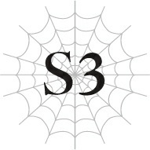

# Chương S3: Vượt qua Mê cung Lớn Elroe

Tôi không biết mình đang ở đâu.

Một khoảng không gian trống trải bao la.

Và có một người phụ nữ cô độc đang ở đó cùng tôi.

Cơ thể cô ấy đang biến mất, cứ như thể đang tan chảy vào không gian, chỉ còn lại một phần thân trên.

Cảnh tượng ấy thật xót xa làm sao.

Rồi, những lời nói máy móc tuôn ra từ miệng cô ấy.

“Độ thuần thục đã đạt đến mức yêu cầu.”

“Điểm kinh nghiệm đã đạt đến mức yêu cầu.”

“Độ thuần thục đã đạt đến mức yêu cầu.”

………

“Đau quá.”

Tôi bừng mở mắt và bật dậy.

Nhanh chóng, tôi kiểm tra xung quanh.

Một chiếc đèn tỏa ra ánh sáng mờ nhạt.

Những bức tường được nó chiếu sáng là đá tự nhiên, và mặt đất cũng đủ cứng để tôi cảm nhận được qua túi ngủ của mình.

Mê cung Lớn Elroe, Tầng Trên.

Giờ thì tôi đã nhớ ra mình đang ở đâu và vì sao rồi.

Đúng vậy. Chúng tôi đến mê cung này để băng qua giữa các lục địa.

--- PAGE BREAK ---

Chúng tôi đã ở trong này được hai ngày rồi.

Hiện tại đang là đêm. Chúng tôi thay ca nhau gác trong lúc ngủ.

Ngoại trừ cuộc tấn công của Thủy Long ngay lúc bắt đầu, hành trình xuyên qua mê cung của chúng tôi diễn ra khá suôn sẻ nhờ có ông Basgath dẫn đường.

Những con quái vật chúng tôi chạm trán từ trước đến nay không phải là vấn đề lớn.

Nhiều quái vật sống ở Tầng Trên của Mê cung Lớn Elroe có độc, điều này bình thường sẽ gây khó khăn, nhưng hầu hết thành viên trong nhóm đều có thể giải độc bằng [Ma pháp Trị liệu].

Hơn nữa, vì chỉ số của chúng tôi quá cao, lũ quái vật hiếm khi nào chạm được vào người chúng tôi trước khi bị nghiền nát.

Anh Hyrince, kỵ sĩ chống chịu của cả nhóm, đã bảo vệ chúng tôi bằng cách dụ lũ quái vật tập trung tấn công vào anh ấy.

Nhờ phần lớn vào anh ấy, chúng tôi đã có thể tiến bước mà không gặp phải trận chiến cam go nào.

Chúng tôi cũng từng lo lắng về hội chứng sợ mê cung, nhưng cho đến nay dường như chưa có ai mắc phải.

Trong mê cung không có ánh mặt trời, không cảm nhận được thời gian trôi qua, và bạn không bao giờ biết khi nào quái vật sẽ tấn công mình.

Phải đối mặt với việc này nhiều ngày liên tục khiến sức khỏe của nhiều người suy sụp do những tổn hại về thể chất lẫn tinh thần.

Tình trạng này được gọi chung là hội chứng sợ mê cung.

Thú thật, bản thân tôi cũng khá oải trong ngày đầu tiên bước vào mê cung.

Nhiệt độ ở đây không hẳn là nóng hay lạnh, nhưng không gian chật hẹp, và không khí có vẻ nặng nề.

Màn đêm tuyệt đối đến mức nếu không có ánh lửa từ đuốc của ông Basgath, chúng tôi thậm chí không thể nhìn thấy ngay trước mặt mình.

Lũ quái vật có thể đột ngột tấn công từ trong bóng tối.

Trong một môi trường luôn căng thẳng như vậy, sự mệt mỏi tích tụ nhanh hơn nhiều so với một ngày di chuyển bình thường bên ngoài.

Bạn không thể trách tôi khi cảm thấy có chút nản lòng khi biết mình sẽ phải tiếp tục thế này trong nhiều ngày tới.

Chúng tôi phải đến làng Elf trước khi Hugo tới đó.

Điều đó làm tôi muốn thoát khỏi mê cung càng nhanh càng tốt, nhưng việc vội vã như vậy có thể gây tử vong ở trong này.

Những người không thể giữ bình tĩnh và di chuyển với tốc độ hợp lý chắc chắn sẽ trở thành nạn nhân của hội chứng sợ mê cung trong chớp mắt.

--- PAGE BREAK ---

Ông Basgath đã giải thích tất cả điều này cho chúng tôi nghe trong ngày đầu tiên.

May mắn thay, nếu chúng tôi có thể băng qua mê cung trong thời gian ước tính, chúng tôi sẽ không gặp khó khăn gì trong việc vượt qua Hugo để đến làng Elf trước.

Chúng tôi không được nôn nóng.

Tôi lau những vệt mồ hôi đã khô trên trán.

Giấc mơ tôi vừa trải qua là thế nào chứ?

“Em không sao chứ?”

Cô Oka nhìn sang tôi hỏi thăm.

Ca gác đêm của chúng tôi được chia theo nhóm hai người.

Những người đang gác lúc này là cô Oka và ông Basgath.

Có vẻ như cô ấy gọi tôi vì thấy tôi rên rỉ khi tỉnh giấc.

“Em ổn ạ. Em chỉ vừa gặp một cơn ác mộng thôi.”

Tôi giấu đi sự lo lắng của mình bằng một nụ cười.

Dù sao thì cuối cùng đó cũng chỉ là một giấc mơ mà thôi.

“Đó có thể là một điềm báo xấu đấy.”

Lời nói của tôi vốn để né tránh chủ đề này, nhưng ông Basgath lại bắt thóp được nó.

“Điềm báo ạ?”

“Chuẩn rồi đấy. Cậu đã nghe nói về Cơn Ác Mộng của Mê cung chưa?”

“Dạ chưa, cháu nghĩ là chưa.”

Ông Basgath thường hay nói to, nhưng vì những người khác trong nhóm đang ngủ nên ông đang hạ giọng nói nhỏ.

Đương nhiên, tông giọng đó dễ dàng tạo nên một bầu không khí rùng rợn, giống như ông đang kể một câu chuyện ma vậy.

“Tôi biết đấy,” cô Oka lên tiếng. “Nó là để chỉ một con quái vật cấp truyền thoại đột ngột xuất hiện trong mê cung khoảng mười năm trước, đúng không?”

“Ta ngạc nhiên là cô bé biết đấy. Ta cứ nghĩ một đứa trẻ tuổi như cô sẽ không quen thuộc với câu chuyện xưa cũ như vậy.”

“Vâng, tôi chỉ tình cờ nghe nói về nó cách đây một thời gian thôi.”

Một quái vật cấp truyền thoại.

Thuật ngữ này dùng để chỉ một con quái vật được đánh giá là cao hơn mức độ nguy hiểm S, được cho là con người không thể nào đánh bại được.

“Cơn Ác Mộng là một tai họa sống của Mê cung Lớn Elroe, ngang hàng với chính Nữ Vương. Nếu cậu gặp ác mộng, điều đó có thể nghĩa là Cơn Ác Mộng sắp xuất hiện...”

“Nhưng chẳng phải nó đã chết rồi sao?” Cô Oka hỏi.

--- PAGE BREAK ---

“Người ta nói thế.”

“Ông không tin điều đó à?”

“Ờ. Họ nói nó bị tiêu diệt như bất kỳ quái vật thông thường nào, nhưng ta không tin. Một con thú như thế không dễ dàng ngã xuống đâu. Nếu cô hỏi ta, ta nghĩ nó vẫn còn sống ở đâu đó, đang rình mò và chờ đợi con mồi tiếp theo.”

“Nghe cứ như thể ông đã tự mình nhìn thấy nó vậy.”

“Phải, đúng thế đấy. Thật ra, chính ta là người đầu tiên phát hiện ra Cơn Ác Mộng.”

Vì lý do nào đó, ông Basgath ưỡn ngực đầy tự hào.

Chắc việc đó cũng đáng nể thật, có lẽ thế?

“Xem này, hồi đó có một sự cố quái vật bùng phát, thế nên một đội kỵ sĩ đã được cử vào để điều tra nguyên nhân và dọn bớt quái vật. Ta làm người dẫn đường cho họ. Hóa ra, lý do bùng phát là do Cơn Ác Mộng đã đuổi sạch lũ quái vật xung quanh ra khỏi nơi ở của chúng. Nhưng bọn ta không biết điều đó, thế nên mới đi thẳng vào sào huyệt của Cơn Ác Mộng. Ta sẽ không bao giờ quên khoảnh khắc đó. Giây phút hai bên chạm mắt, ta đã nghĩ đời mình thế là xong.”

Ông Basgath rùng mình khi nhớ lại ký ức đó.

“Nghe có vẻ như ông đã rất may mắn khi thoát chết trở về.”

“Ừ, về chuyện đó thì thế này. Cơn Ác Mộng có một vài tập tính kỳ lạ. Nếu cậu không tấn công nó, nó sẽ tha cho cậu đi. Thậm chí, nó còn có thể chữa lành vết thương cho cậu nữa.”

“Cái gì cơ ạ?”

“Khó tin đúng không? Ta nghe nói tổ đội được cử vào sau bọn ta để giết nó đã bị quét sạch trong chớp mắt. Chắc là họ đã chọc giận nó hay gì đó. Vậy mà, có những lúc nó lại giúp đỡ con người, cứ như là tùy hứng vậy. Đúng là một con quái vật bí ẩn và không thể lường trước được.”

Kiểu quái vật mâu thuẫn gì thế này?

Nó có thực sự là một con quái vật không vậy?

“Nhưng có một điều chắc chắn: Cơn Ác Mộng mạnh đến mức phi lý. Theo những gì ta thấy thì cậu có vẻ khá mạnh đấy, cậu nhóc, nhưng trên đời này luôn có người mạnh hơn cậu. Trong thế giới này, có những trận chiến mà cậu đơn giản là không thể thắng. Hãy nhớ lấy điều đó.”

Những lời này làm tôi nghĩ đến Sophia và Ronandt.

Tôi thậm chí còn không thể chạm được vào một ngón tay của hai người họ.

“Vâng, cháu biết. Luôn có những người mạnh hơn.”

Tôi siết chặt nắm tay.

Nếu chúng tôi tiếp tục đối đầu với Hugo, tôi có thể sẽ phải chiến đấu với hai người họ một lần nữa.

--- PAGE BREAK ---

Nếu chuyện đó xảy ra, liệu tôi có thể thắng không?

Không, tôi không thể suy nghĩ như thế được. Tôi phải thắng.

Để bảo vệ toàn bộ nhân loại và giữ cho thế giới không rơi vào cảnh hỗn loạn.

Tôi phải ngăn chặn Hugo, điều đó đồng nghĩa với việc tôi phải đánh bại hai người họ.

“Nghe có vẻ như cậu cũng có vài kẻ thù của riêng mình nhỉ. Nhưng đừng có quá lên gân lên cốt như thế, nghe chưa? Ai cũng có những việc họ làm được và những việc không thể. Có cố làm điều bất khả thi thì cũng chẳng thay đổi được gì đâu. Cứ tập trung vào những gì cậu có thể làm đi.”

Ông Basgath cố gắng trấn an tôi, dù tôi không thể đồng tình với ý kiến đó.

“Nhưng có những việc cháu bắt buộc phải làm.”

Nếu bạn trốn chạy khỏi những điều mình không thể làm, bạn sẽ không bao giờ có thể làm được chúng.

Được rồi, tôi thừa nhận điều đó.

Với tôi của hiện tại, tôi có lẽ không thể đánh bại Sophia hay Ronandt.

Nhưng tôi sẽ đánh bại họ.

Tôi sẽ tìm ra cách để chiến thắng.

Hơn nữa, tôi đâu có phải chiến đấu một mình.

Tôi còn có những người bạn có thể tin cậy.

“Thế à? Vậy thì cứ cố gắng hết sức đi, miễn là điều đó không giết chết cậu.”

“Cháu sẽ làm thế.”

“Được rồi. Rất nhiều người đã chết chỉ vì cố gắng làm những điều vượt quá khả năng của mình. Cậu biết đấy, để giết một người không cần tốn quá nhiều sức đâu. Nếu cậu chết vì cố đấm ăn xôi làm chuyện quá sức, chẳng phải điều đó có nghĩa là đáng lẽ cậu nên tự lượng sức mình trước sao?”

Lời khuyên nghiêm túc bất ngờ của ông Basgath khiến tôi ngạc nhiên. Rồi tôi chợt nhận ra.

Ông ấy chắc hẳn đã chứng kiến việc này xảy ra với nhiều người từ trước đến nay.

“Chiến đấu để bảo vệ điều gì đó là việc tốt, cậu nhóc ạ. Nhưng chạy trốn khỏi một kẻ thù mà cậu biết chắc mình không thể đánh bại không có gì là đáng xấu hổ cả. Nếu chết ở đó, cậu sẽ chẳng bao giờ có thể chiến đấu được nữa, đúng chứ? Nếu lần này không thắng được, cứ chạy đi, trở nên mạnh mẽ hơn rồi thử lại. Dù rằng trên đời này có vài thực thể mà cậu sẽ không bao giờ có thể chạm tới được, dù cho có cố gắng thế nào đi nữa.”

Một người dẫn đường dành toàn bộ thời gian của mình trong môi trường khắc nghiệt của mê cung.

Và người đàn ông này đã tiếp tục thực hiện nghĩa vụ của mình cho đến tận khi về già.

Ông ấy chắc chắn đã trải qua những chuyện mà tôi thậm chí không thể tưởng tượng nổi.

“Nhưng nếu cháu không được phép chạy trốn thì sao ạ?”

Tôi cẩn thận hỏi.

--- PAGE BREAK ---

Trận chiến mà chúng tôi đang hướng đến là một trận chiến không thể né tránh.

Vận mệnh của nhân loại có thể đang bị đe dọa.

Nếu chúng tôi thất bại, Hugo có khả năng sẽ đẩy thế giới lún sâu hơn nữa vào cảnh hỗn loạn.

Vì vậy, tôi không thể để mình thất bại hay bỏ chạy.

“Hả? Cứ mặc kệ chuyện đó mà chạy đi chứ. Cố gắng sinh tồn thì có gì sai? Nếu có ai đó cằn nhằn về chuyện đó, cứ bảo họ tự đi mà giải quyết.”

Câu trả lời của ông Basgath không thực sự hữu ích cho lắm.

“Ta đã nói với cậu rồi mà, đúng chứ? Có những việc cậu đơn giản là không thể làm được. Bất kỳ ai sống trên đời này cũng có giới hạn của mình cả. Nghĩ rằng bản thân có thể làm được mọi thứ không gì khác ngoài sự kiêu ngạo. Hoặc tốt nhất là lòng kiêu hãnh.”

Cả cô Oka và tôi đều mở to mắt trước những lời nói đầy cay đắng của ông Basgath.

“Tất nhiên ta không nói rằng việc trốn tránh trách nhiệm là tốt. Với tư cách là một người dẫn đường mê cung, ta sẵn sàng bảo vệ khách hàng của mình dù phải trả giá bằng mạng sống. Nhưng mỗi người đều có một hạn mức nhất định mà họ có thể gánh vác. Nếu những trách nhiệm đè nặng lên cậu vượt quá khả năng cậu chịu đựng được, cậu ít nhất cũng nên cân nhắc việc bỏ chạy. Cậu có chắc là mình không gánh vác nhiều trách nhiệm hơn mức cần thiết không, cậu nhóc?”

Tôi không thể lập tức trả lời.

Trách nhiệm.

Bởi vì tôi là Anh hùng.

Bởi vì tôi là một người tái sinh giống như Hugo.

Nếu giải thích theo cách đó thì thật dễ dàng để thuyết phục bản thân.

Nhưng nếu tự vấn liệu tất cả những trách nhiệm đó có nên đổ hết lên đầu tôi hay không, tôi lại không biết phải trả lời thế nào.

“Tất nhiên, nếu nó vượt quá tầm tay của cậu nhưng cậu vẫn muốn thử sức, ta cũng chẳng rỗi hơi mà đi ngăn cản làm gì. Ta chỉ đang nói cho cậu biết những gì ta tin tưởng thôi. Cuối cùng, điều quan trọng nhất vẫn là bản thân cậu muốn làm gì.”

Bản thân tôi muốn làm gì ư?

Câu trả lời đã quá rõ ràng rồi.

Tôi đã quyết định tiếp bước hoàng huynh Julius của mình.

Và Julius sẽ không bao giờ bỏ chạy.

Anh ấy là một Anh hùng thực thụ trong số các Anh hùng, người thực lòng mong muốn hòa bình thế giới hơn bất kỳ điều gì khác.

“Cảm ơn lời khuyên của ông. Nhưng cháu vẫn nghĩ mình không thể chạy trốn được. Dù sao thì cháu cũng là Anh hùng.”

Giọng tôi đanh thép và kiên định.

--- PAGE BREAK ---

Sophia và Ronandt rất mạnh, nhưng tôi không thể chần chừ vào lúc này.

Sau khi chúng tôi đánh bại Hugo, vẫn còn cuộc chiến với ma tộc đang chờ đợi phía trước.

Và cùng với chúng, là "cô bé màu trắng" đã sát hại Julius.

Một con quái vật đúng nghĩa, kẻ có thể dễ dàng đánh bại hoàng huynh mạnh mẽ của tôi một cách nhẹ nhàng.

Tôi sẽ phải chiến đấu với cô ta vào một ngày nào đó.

Vì vậy, tôi không thể dừng lại cho đến khi đủ mạnh mẽ để giành chiến thắng trong trận chiến đó.

Nếu có bất cứ điều gì, thì ý nghĩ bỏ chạy thật là nực cười.

“Cháu thực sự trân trọng sự quan tâm của ông. Nhưng đây thực sự là những gì cháu muốn làm.”

“Thế sao? Vậy thì ta sẽ không nói thêm lời nào nữa. Cố lên nhé, cậu nhóc.”

Tôi cúi đầu, và ông Basgath vỗ mạnh vào vai tôi đầy khích lệ.

Đau quá.

“Điều mình thực sự muốn làm... Đúng vậy. Tất nhiên rồi. Mình không được phép hối hận.”

Vì bị phân tâm bởi cú vỗ vai không thương tiếc của ông Basgath, tôi đã không nghe rõ cô Oka đang khẽ lẩm bẩm một mình.

Đã năm ngày trôi qua kể từ khi chúng tôi tiến vào mê cung.

Chúng tôi đã đi được khoảng một nửa chặng đường.

Vì nhóm của chúng tôi ít người và mọi người đều có chỉ số cao, chúng tôi đã có thể tiến về phía trước theo con đường ngắn nhất với tốc độ nhanh.

Dù vẫn có một khả năng nhỏ xảy ra hội chứng sợ mê cung, nhưng do ông Basgath là một người dẫn đường kỳ cựu, ông ấy đã điều tiết tốc độ của chúng tôi sao cho nhóm có thể tiến lên mà không quá gắng sức.

Tôi từng lo lắng quân lính Đế quốc có thể phục kích chúng tôi trên đường đi, nhưng theo ông Basgath, điều đó là bất khả thi.

Trước hết, Đế quốc có xu hướng né tránh mê cung, và việc cố gắng lập bẫy phục kích ở đây sẽ nguy hiểm hơn nhiều so với hiệu quả nó mang lại.

Với vô số nhánh đường như mạng nhện, bất kỳ ai lập kế hoạch đặt bẫy sẽ không có cách nào biết được chúng tôi sẽ đi theo con đường nào, đồng nghĩa với việc họ không biết phải chờ đợi ở đâu.

Do đó, kẻ thù duy nhất của chúng tôi trong mê cung chỉ có lũ quái vật.

Và cho đến nay, chúng không phải là mối đe dọa lớn.

Chúng tôi có anh Hyrince làm tiên phong chống chịu, cô Oka bọc hậu, còn Katia, Fei và tôi thay phiên nhau làm tiên phong hoặc hậu vệ.

--- PAGE BREAK ---

Vì ông Basgath là người dẫn đường của chúng tôi, ông ấy thường không trực tiếp tham gia chiến đấu.

Tuy nhiên, trong những lần hiếm hoi ra tay, ông ấy lại thể hiện sức mạnh đủ để tự mình đương đầu tương đương với các thành viên khác của chúng tôi.

Dù chúng tôi là một nhóm hỗn tạp, nhưng tôi thấy cả đội đã phối hợp với nhau khá tốt.

Ngoại trừ một người.

“Được rồi, dừng lại. Đến giờ nghỉ ngơi một chút rồi.”

Mọi người dừng lại theo tiếng gọi của ông Basgath.

Ông nhanh chóng xác nhận khu vực xung quanh an toàn, sau đó trải hành lý ra để chúng tôi có thể nghỉ ngơi.

Trong lúc những người khác thoải mái ngồi xuống nghỉ ngơi không chút bận tâm, chỉ có duy nhất một người gần như ngã quỵ xuống, thở dốc nặng nề.

“Tôi thực sự xin lỗi,” cô ấy thì thầm với tôi.

Tôi lắc đầu, nhẹ nhàng vỗ vai Anna.

Anna là một ma pháp sư xuất sắc.

Nhưng giữa tất cả những chiến binh cấp cao ở đây, cô ấy không tránh khỏi việc bị tụt lại phía sau.

Và vì các chỉ số của cô ấy thiên về ma pháp, nên thể chất của cô ấy rất yếu.

Nếu chúng tôi không nghỉ ngắn dọc đường, Anna sẽ không thể theo kịp tốc độ di chuyển của cả nhóm.

Vì cô Oka là một Elf vẫn đang trong tuổi lớn, các chỉ số thể chất của cô cũng rất thấp, nhưng cô ấy có thể sử dụng lượng ma lực dồi dào của mình để cường hóa cơ thể.

Dù trông giống như một đứa trẻ nhỏ, cô ấy lại rất thành thạo cận chiến.

Đây là sự khác biệt giữa Elf thuần chủng và bán Elf, hay cô Oka đơn giản là một trường hợp đặc biệt?

Có lẽ là vế sau, nhưng khoảng cách rõ rệt này đang tạo ra gánh nặng lớn cả về thể chất lẫn tinh thần đối với Anna.

Tâm trạng của cô ấy vốn đã căng thẳng, nay áp lực không muốn làm vướng chân chúng tôi trong chuyến hành trình lại càng làm gánh nặng của cô ấy thêm phần nặng nề.

Cô ấy đang bắt đầu có dấu hiệu của hội chứng sợ mê cung.

Cứ đà này, cô ấy có thể sẽ gặp nguy hiểm.

Ông Basgath đã nhận ra tình trạng của cô ấy và cố gắng điều tiết tốc độ của chúng tôi cho phù hợp, nhưng Anna vẫn đang tự gượng ép bản thân để cố theo kịp cả nhóm.

Có lẽ việc đưa cô ấy đi cùng là một sai lầm.

Nhưng nếu chúng tôi để cô ấy lại phía sau, tôi cũng sẽ không thể ngừng lo lắng cho cô ấy.

Tôi không nghĩ có bất kỳ câu trả lời nào hoàn toàn đúng trong hoàn cảnh này.

Tôi đã đồng ý cho Anna đi cùng, vì vậy tôi phải chịu trách nhiệm chăm sóc cô ấy.

--- PAGE BREAK ---

Dường như những người khác cũng hiểu điều đó, vì không ai lên tiếng phàn nàn điều gì.

Ông Basgath có thể không biết chi tiết câu chuyện, nhưng ông là một người chuyên nghiệp. Ông ấy sẽ dẫn đường cho chúng tôi bất chấp mọi chuyện.

Ông ấy sẽ không phàn nàn về việc một trong các khách hàng của mình di chuyển chậm chạp.

Người duy nhất có vẻ hơi không hài lòng là Katia.

Có lẽ sau này tôi nên tìm cách nói chuyện gián tiếp với cô ấy về việc này.

“Nào, chúng ta đã đi được khoảng nửa chặng đường trong mê cung rồi, vì vậy chúng ta cần quyết định xem sẽ đi theo lộ trình nào từ đây.”

Ông Basgath nói với tôi.

Tôi đành phải gác lại sự lo lắng cho Anna sau vậy.

“Có vài con đường ở phía trước. Có con đường ngắn nhất nhưng nguy hiểm nhất, con đường vòng tương đối an toàn, và con đường mập mờ hơn có thể nguy hiểm hoặc không. Cậu muốn chọn đường nào hơn?”

“Hmm. Lộ trình ngắn nhất nguy hiểm đến mức nào ạ?”

“Chà, có hai loại nhánh đường ở Tầng Trên. Có những nhánh đường thông thường, loại hẹp như lối đi chúng ta đang đứng đây. Và loại còn lại là nhánh đường lớn.”

Dừng lại một lát, ông đưa cho tôi một bình nước uống.

Tôi đón lấy nó một cách đầy biết ơn.

“Nhánh đường lớn, đúng như tên gọi của nó, cao và rộng hơn nhiều so với lối đi này. Cậu cứ tưởng tượng nó giống như một đại sảnh khổng lồ kéo dài vô tận vậy. Nó cũng tình cờ là con đường ngắn nhất, nhưng ở đó có những con quái vật nguy hiểm vượt xa loại đang lẩn trốn trong các nhánh đường thông thường. Quái vật cấp C nhiều vô kể. Thỉnh thoảng còn có cả quái vật cấp A nữa. Đó là một khu vực cực kỳ nguy hiểm.”

Cấp A.

Những con quái vật mạnh đến mức có thể cần cả một đội quân mới giải quyết được.

Thông thường người ta cho rằng quái vật cấp B là mức mạnh nhất mà một tổ đội nhỏ có thể tự mình đối phó.

Quái vật vốn có chỉ số cơ bản tốt hơn con người.

Để bù đắp cho điều đó, chúng ta phải mài giũa các kỹ năng, tập hợp đồng đội và sử dụng toàn bộ trí tuệ tập thể để phối hợp chiến đấu.

Đó là cách bạn giành chiến thắng trước một đối thủ có chỉ số cao hơn.

Nhưng phương pháp tiếp cận đó chỉ khả thi đối với những con quái vật từ cấp B trở xuống.

Quái vật cấp A lại là một câu chuyện hoàn toàn khác.

--- PAGE BREAK ---

Ngoài các chỉ số cao tự nhiên, chúng còn sở hữu một lượng kỹ năng vượt trội.

Kỹ năng là lợi thế lớn nhất của loài người, nhưng những con quái vật này cũng có thể sử dụng chúng thành thạo không kém.

Một số cá thể thậm chí còn có các kỹ năng đặc thù của quái vật, khiến chúng trở nên cực kỳ phiền phức khi đối đầu.

Một ví dụ điển hình cho quái vật cấp A ư? Một phi long cấp cao.

Giống như con quái vật có khả năng là cha mẹ của Fei, kẻ đã tấn công học viện.

Fei về mặt kỹ thuật cũng được phân loại là phi long cấp cao, nhưng vì việc là một người tái sinh dường như đã mang lại cho cô ấy lợi thế phụ trội, sức mạnh của cô ấy có lẽ gần với một con rồng thực sự hơn.

Nếu chúng tôi ở trên cạn, Fei thậm chí có thể đã đánh bại được con Thủy Long đã tấn công chúng tôi trước đó.

“Sự khác biệt về thời gian giữa con đường ngắn nhất và con đường vòng dài hơn, an toàn hơn là bao lâu ạ?”

“Để xem nào... Với tốc độ hiện tại của chúng ta, ta đoán chừng khoảng bốn ngày.”

Con số đó nhiều hơn tôi tưởng.

Đó chắc chắn là một quãng đường vòng khá lớn.

“Còn con đường cuối cùng ông nhắc tới thì sao ạ?”

“À. Về chuyện đó...”

Vì lý do nào đó, ông Basgath tỏ ra do dự.

Trong lúc tôi đang chờ đợi đầy mong mỏi, ông gãi đầu với vẻ mặt không mấy thoải mái.

“Nói thật lòng thì, ta không muốn đi đường đó chút nào.”

“Cách nói chuyện thật sự rất thẳng thắn đấy ạ. Có lý do cụ thể nào không ông?”

“Cơn Ác Mộng.”

“Dạ cháu chưa nghe rõ?”

“Khu vực đó từng là lãnh thổ của Cơn Ác Mộng. Hầu hết những người dẫn đường đều không thích đến gần nơi đó. Điềm gở lắm. Nhất là khi chính mắt ta đã nhìn thấy thứ đó... Ta không muốn đến gần chỗ đó nếu có thể tránh được.”

Cơn Ác Mộng.

Đó chính là con quái vật cấp truyền thoại mà ông ấy nhắc tới trước đó đúng không?

Nhưng chẳng phải sinh vật đó được cho là đã chết rồi sao?

“Tiện đây cháu hỏi, lộ trình đó có nhanh không ạ, hay...?”

“Nó chỉ dài hơn lộ trình ngắn nhất một chút thôi. Ít nhất thì ta nghĩ đường ngắn nhất vẫn nhanh hơn. Chắc chỉ chênh lệch khoảng một ngày hoặc tầm đó thôi.”

Có con đường ngắn đầy nguy hiểm, con đường vòng an toàn nhưng dài dòng, và con đường có phần mập mờ kia.

--- PAGE BREAK ---

“Nhưng Cơn Ác Mộng đã không còn nữa rồi đúng không ạ?”

“Đúng vậy, bản thân Cơn Ác Mộng thì đã biến mất.”

“Ý ông là sao ạ?”

Tôi nghiêng đầu.

Cách nói của ông ấy làm như thể vẫn còn thứ gì khác ở đó vậy.

“Bọn ta gọi nó là Tàn tích của Cơn Ác Mộng.”

“Tàn tích của Cơn Ác Mộng ạ?”

“Phải. Một con quái vật trông rất giống Cơn Ác Mộng. Nó đã được nhìn thấy khắp nơi ở Tầng Trên, nhưng thường xuyên nhất là ở con đường ta vừa nhắc tới.”

“Nó có phải là một quái vật đặc biệt mạnh không ông?”

“Ồ, nó mạnh chứ. Và cũng phiền phức lắm.”

Nếu ông Basgath đã nói vậy thì tình hình chắc chắn phải rất nghiêm trọng.

Tôi chắc chắn muốn tránh đụng độ với thứ như vậy.

“Tuy nhiên, nó có cùng tập tính kỳ lạ như Cơn Ác Mộng vậy. Nếu cậu không tấn công nó, nó sẽ không làm hại cậu. Nếu có chạm trán một Tàn tích của Cơn Ác Mộng, tốt nhất là đừng làm gì cả và cứ đợi cho nó đi qua.”

“Cái gì thế này...?”

Tôi không thể che giấu sự kinh ngạc của mình.

Liệu có thể gọi nó là quái vật không nếu nó có những tập tính lạ lùng như vậy?

Theo tôi nghĩ, quái vật phải là thứ mù quáng lao vào tấn công bất cứ thứ gì nó nhìn thấy chứ.

“Còn một điều nữa. Nó giăng những sợi tơ vô hình ở khắp mọi nơi. Nếu cậu cắt đứt nó hay làm gì đó tương tự, nó sẽ tấn công cậu.”

“Tơ ạ?”

“Đúng thế. Ta đoán ta chưa nhắc đến chuyện đó đúng không nhỉ? Cơn Ác Mộng là một quái vật nhện. Các Tàn tích của Cơn Ác Mộng cũng vậy.”

Nhện sao...?

“Sợi tơ của nó gần như không thể nhìn thấy bằng mắt thường, chưa kể còn siêu dính và dai, khiến việc thoát ra cực kỳ khó khăn nếu bị vướng vào. Thêm vào đó, bản thân con quái vật đó lại mạnh quá mức cần thiết. Ngày xưa, khi nhìn thấy mạng nhện, người ta chỉ việc đốt nó đi. Nhưng kể từ khi Tàn tích của Cơn Ác Mộng này xuất hiện, nếu nhìn thấy mạng nhện, người ta chỉ có nước bỏ chạy. Đó là con quái vật tồi tệ nhất trong toàn bộ Tầng Trên.”

Đúng là một con quái vật nguy hiểm.

Nó vừa mạnh lại vừa biết sử dụng những sợi tơ phiền toái như vậy sao?

Nghe cứ như thể một con quái vật sở hữu sự khôn ngoan của con người vậy.

--- PAGE BREAK ---

“Tôi nghĩ chúng ta tốt nhất không nên đi con đường đó.”

Anh Hyrince, người nãy giờ im lặng lắng nghe cuộc trò chuyện của chúng tôi, lên tiếng.

“Tôi từng đi cùng Julius và những người khác trong đội để tiêu diệt một Tàn tích của Cơn Ác Mộng một lần rồi. Bọn tôi đã chật vật giành được chiến thắng bằng cách nào đó, nhưng trận chiến thực sự suýt soát vô cùng. Nếu có thể tránh được thì tốt nhất nên tránh đi.”

Đến cả hoàng huynh Julius và tổ đội của anh ấy cũng gặp khó khăn với sinh vật đó sao?

Phải rồi, tôi đoán mình thà không đối mặt với thứ đó còn hơn.

Lộ trình đó coi như bị loại bỏ.

Giờ chỉ còn lại lộ trình ngắn nhất và lộ trình đi vòng.

“Được rồi mọi người. Chúng ta phải chọn giữa một con đường nhanh nhưng nguy hiểm và một con đường an toàn nhưng dài dòng. Mọi người có ý kiến gì không?”

Tôi quay sang hỏi các thành viên khác trong nhóm trong lúc họ đang nghỉ ngơi.

Trong thâm tâm tôi muốn lựa chọn lộ trình ngắn nhất.

Ngay cả khi chúng tôi có dư một chút thời gian, việc đến được làng Elf càng sớm vẫn là tốt nhất.

Nhưng con đường đó sẽ càng khắc nghiệt hơn đối với Anna, người vốn đang rất chật vật, khiến tôi khó lòng đưa ra quyết định.

“Cô nghĩ chúng ta nên chọn con đường ngắn nhất.”

Cô Oka phát biểu đầu tiên.

Tôi đã tận mắt chứng kiến sức mạnh của cô giáo chúng tôi đáng sợ thế nào rồi.

Thú thật, tôi chưa bao giờ nghĩ cô ấy lại có thể đánh ngất Hugo hoàn toàn như vậy.

Nếu chỉ xét riêng về năng lực ma pháp, cô ấy có lẽ còn mạnh hơn cả tôi.

Katia có vẻ muốn đồng tình.

“Nhưng chẳng phải sẽ rất nguy hiểm sao? Nếu nhiều hơn một quái vật cấp A xuất hiện cùng lúc, ngay cả chúng ta cũng có thể gặp khó khăn khi đối phó đấy.”

“À, ta sẽ không lo lắng về chuyện đó đâu,” ông Basgath thông tin cho cô ấy. “Quái vật cấp A gần như không bao giờ đi chung với nhau. Nếu chúng ta tình cờ chạm mặt một con, nó sẽ chỉ đi đơn lẻ thôi.”

“Nếu vậy thì tớ tin chúng ta hoàn toàn có thể xử lý được.”

Katia gật đầu đầy tự tin.

--- PAGE BREAK ---

Vì lớn lên cùng nhau, tôi rất hiểu Katia.

Tôi biết cô ấy có thực lực để chứng minh cho những lời khẳng định đó.

“Hmm. Tớ đoán tớ cũng bỏ phiếu cho con đường ngắn nhất. Quái vật không phải là vấn đề lớn đối với chúng ta.”

Fei cũng bỏ phiếu cho con đường ngắn nhất.

Cậu ấy có vẻ hơi quá lạc quan, nhưng tôi đoán với sức mạnh áp đảo của mình, cậu ấy có quyền làm vậy.

Dù sao thì Fei cũng là người mạnh nhất trong nhóm chúng tôi hiện tại.

“Tôi không biết nữa. Tôi nghĩ việc mạo hiểm không cần thiết là không khôn ngoan đâu.”

Anh Hyrince chọn con đường an toàn hơn.

Anh ấy có lẽ coi trọng sự an toàn của chúng tôi hơn cả sự tồn vong của làng Elf.

Hiện tại tỉ số đang là ba chọi một.

Vì ông Basgath giữ thái độ trung lập, nên chỉ còn lại tôi và Anna.

Nửa số thành viên trong nhóm đã thúc đẩy chọn con đường ngắn nhất, nhưng tôi cũng muốn nghe ý kiến của Anna.

“Cô nghĩ chúng ta nên làm gì, Anna?”

“Xin điện hạ đừng bận tâm đến ý kiến của tôi.”

“Không, ta muốn nghe. Cô cũng là một thành viên của nhóm mà. Nói đi—hãy cho ta biết cô nghĩ thế nào.”

Tôi gặng hỏi cô ấy một cách hơi kiên trì.

Anna ban đầu có chút ngập ngừng, suy nghĩ một lát rồi dường như đã đi đến một quyết định.

“Vậy thì xin hãy chọn con đường ngắn nhất.”

“Cô có chắc chắn không?”

Ý tôi thực sự muốn hỏi là: *Liệu cô có ổn không? Liệu cô có thể theo kịp không?*

“Chắc chắn ạ.”

Câu trả lời của cô ấy vô cùng kiên định.

Vậy thì tôi không cần phải nói gì thêm nữa.

“Quyết định chọn con đường ngắn nhất vậy.”

Dù biết rõ những mối nguy hiểm rình rập, chúng tôi vẫn quyết định tiến lên phía trước.
