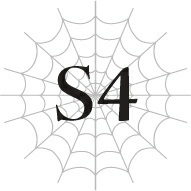
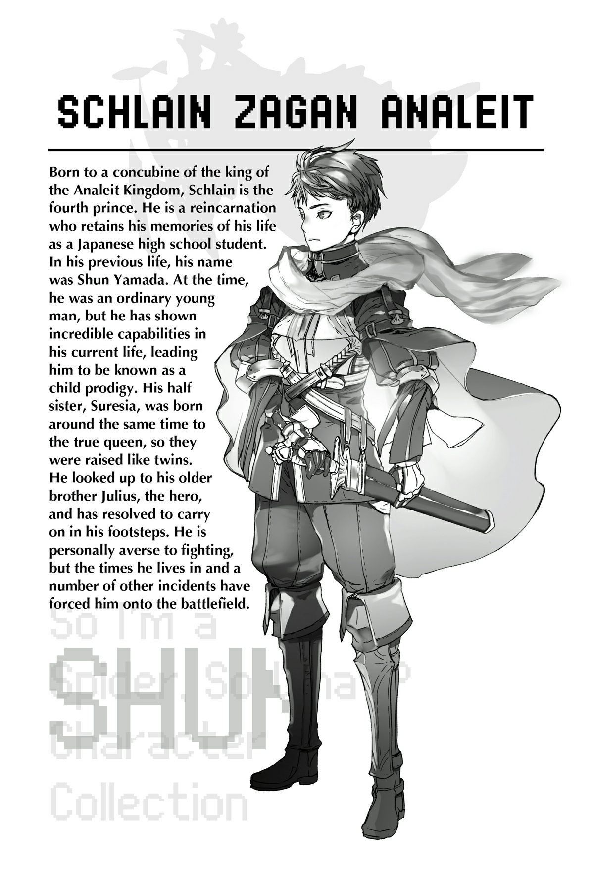

# Chương S4: Nỗi kinh hoàng của Mê cung Lớn Elroe

Một cảnh tượng mơ hồ và thiếu chân thực mở ra trước tầm mắt mờ ảo của tôi.

Cứ như thể tôi đang nhìn qua một màng lọc mỏng manh, giống như đang xem một bộ phim cũ.

Ánh đuốc yếu ớt chiếu sáng những người xung quanh tôi.

Vài người trong số họ là những gương mặt quen thuộc.

Tôi có thể nhìn thấy anh Hyrince và Thánh nữ Yaana.

Hai người đàn ông khác trông không mấy quen thuộc, nhưng người thứ ba... Chẳng phải đó là Goyef, con trai của ông Basgath sao?

Họ cứ bước đi đâu đó, cho đến khi chạm trán với một thứ.

Một con quái vật nhện: một Tàn tích của Cơn Ác Mộng.

Sau một trận chiến cam go, cả nhóm đã đánh bại được nó. Ngay khoảnh khắc đó, tôi có một viễn cảnh kỳ lạ về một cô gái.

Một cô gái mà tôi không thể nhìn rõ đường nét gương mặt, người chỉ có thể được mô tả bằng một màu trắng xóa.

Tôi bật dậy.

Đó là một giấc mơ sao?

Về lúc hoàng huynh Julius đánh bại một Tàn tích của Cơn Ác Mộng trong quá khứ chăng?

Tôi mơ thấy nó là vì cuộc trò chuyện với ông Basgath sao?

Hay là hoàng huynh Julius đang muốn nhắn nhủ tôi điều gì?

Ý nghĩ cuối cùng đó có lẽ chỉ là sự tự huyễn hoặc bản thân mà thôi.

Một cách vô thức, tôi chạm tay vào chiếc khăn choàng cổ màu trắng quấn quanh cổ mình, di vật của hoàng huynh.

--- PAGE BREAK ---

“Chúng ta chuẩn bị tiến vào nhánh đường lớn rồi đấy. Cảnh giác cao độ vào.”

Nói rồi, ông Basgath dẫn chúng tôi tiến lên phía trước.

Vừa bước qua ranh giới, tôi kinh ngạc nhìn dáo dác xung quanh.

Nơi này thật khổng lồ.

Dẫu đã được nghe giải thích từ trước, nhưng nó hoàn toàn khác biệt với những lối đi chật hẹp mà chúng tôi đã đi qua suốt thời gian qua.

Chiều rộng của nó dễ dàng lên tới ba trăm feet.

Trần hang trông cũng cao tương tự.

Đúng như ông Basgath nói, nơi này giống như một đại sảnh bao la hơn là một lối đi.

Nhưng sự ngỡ ngàng của tôi chỉ kéo dài trong thoáng chốc.

Tôi nhanh chóng định thần lại, cẩn thận quan sát xung quanh.

Không có dấu hiệu nào của quái vật ở gần đây.

Dù nhẹ nhõm phần nào, tôi vẫn giữ tinh thần cảnh giác khi cả nhóm tiếp tục di chuyển.

Lối đi này quá lớn.

Nhưng có nhiều tảng đá lớn và những thứ tương tự nằm rải rác xung quanh, làm cản trở tầm nhìn của chúng tôi.

Thứ gì đó có thể đang ẩn nấp trong bóng tối của những tảng đá kia.

Tôi không ngừng tìm kiếm bất kỳ dấu hiệu bất thường nào khi chúng tôi đều đặn tiến bước.

Đi được một lúc, ông Basgath bỗng dừng lại.

“Có chuyện gì thế ông?”

“Lạ thật đấy. Ta không nhìn thấy bất kỳ con quái vật nào cả.”

Giọng nói và nét mặt của ông Basgath không giấu nổi sự bối rối.

Chuyện đó thực sự tồi tệ đến thế sao?

“Thường thì quanh đây có nhiều quái vật lắm ạ?”

“Ừ. Lạ là đi đến tận đây rồi mà chúng ta vẫn chưa chạm mặt con nào.”

Ông lẩm bẩm thêm một câu nhỏ đến mức gần như không nghe thấy: “Giống hệt hồi bọn ta chạm trán Cơn Ác Mộng.”

Điều đó làm tôi cảm thấy bất an.

“Có cách nào chuyển sang lộ trình khác không ông?”

Có lẽ tốt nhất nên giả định rằng đang có chuyện gì đó bất thường xảy ra.

Trong trường hợp đó, chúng tôi cần phải thực hiện các biện pháp phòng ngừa.

“Có một lối rẽ nhỏ ở phía trước không xa. Chúng ta sẽ chuyển sang lộ trình khác ở đó.”

Ông Basgath dường như cũng đồng ý, ông không hề do dự khi vạch ra một kế hoạch thay thế.

Tất cả chúng tôi đều cảm nhận được trạng thái bất an của ông Basgath, và không ai lên tiếng phản đối.

Nhưng quyết định của chúng tôi có phần hơi trễ.

Thứ gì đó đã và đang tiến về phía này.

--- PAGE BREAK ---

Một con rồng.

Đầu tiên, chúng tôi thấy một cái bóng tựa như một con khủng long bạo chúa thon gọn.

Tuy nhiên, đôi tay của nó to lớn một cách kỳ lạ, và mỗi móng vuốt của nó đều lấp lánh như một thanh kiếm được rèn giũa hoàn hảo.

“Một con Địa Long. Khốn kiếp! Lại còn ở Tầng Trên nữa—chẳng lẽ nó vừa tiến hóa sao?!”

Ông Basgath tặc lưỡi.

Tất cả chúng tôi đều chuẩn bị sẵn sàng chiến đấu.

Thúc giục bản thân, tôi sử dụng Thẩm định lên đối thủ.

`<Địa Long Ekisa LV 2>`

| Chỉ số | Giá trị |
| :--- | :--- |
| **HP** | 2.808/2.808 (lục) |
| **MP** | 1.312/1.312 (lam) |
| **SP (vàng)** | 3.655/3.655 |
| **SP (đỏ)** | 2.032/3.645 |
| **Sức tấn công trung bình** | 2.498 (chi tiết) |
| **Sức phòng ngự trung bình** | 2.455 (chi tiết) |
| **Sức ma pháp trung bình** | 1.298 (chi tiết) |
| **Khả năng kháng tính trung bình** | 2.452 (chi tiết) |
| **Tốc độ trung bình** | 3.600 (chi tiết) |

**Kỹ năng:**
[Địa Long LV 1] [Long Lân Đế Vương LV 4] [Giáp Cứng LV 1] [Thân Thể Thép LV 1] [Tự hồi phục HP nhanh LV 1] [Tốc độ hồi phục MP LV 1] [Giảm tiêu hao MP LV 1] [Cảm nhận Ma lực LV 3] [Thao tác Ma lực LV 3] [Ma lực Công kích LV 1] [Tự hồi phục SP nhanh LV 2] [Giảm tiêu hao SP tối thiểu LV 2] [Địa hình Công kích LV 5] [Địa hình Tăng cường LV 5] [Tăng cường Hủy diệt LV 7] [Siêu tăng cường Cắt LV 6] [Siêu tăng cường Đâm LV 6] [Siêu tăng cường Va chạm LV 6] [Cơ động Không gian LV 3] [Đánh trúng LV 10] [Né tránh LV 10] [Hiệu chỉnh Xác suất LV 4] [Cảm nhận Nguy hiểm LV 7] [Cảm nhận Hiện diện LV 7] [Cảm nhận Nhiệt LV 7] [Cảm nhận Chuyển động LV 5] [Thổ Ma pháp LV 1] [Kháng Hủy diệt LV 2] [Kháng Cắt LV 5] [Kháng Đâm LV 5] [Kháng Va chạm LV 6] [Kháng Sốc LV 2] [Vô hiệu Địa hình] [Kháng Sét LV 7] [Siêu kháng Trạng thái bất thường LV 2] [Kháng Thối rữa LV 1] [Vô hiệu Đau] [Giảm Đau LV 4] [Dạ Nhãn LV 10] [Mở rộng Tầm nhìn LV 5] [Tăng cường Thị giác LV 5] [Tăng cường Thính giác LV 4] [Tăng cường Khứu giác LV 4] [Trường Thọ LV 7] [Ma Lượng Tích Trữ LV 1] [Di chuyển Tối thượng LV 1] [Vận May LV 1] [Cự lực LV 5] [Vững chãi LV 5] [Tu sĩ LV 1] [Hộ Phù LV 5] [Thần tốc (Skanda) LV 1]

**Điểm kỹ năng:** 19.500

**Danh hiệu:**
[Kẻ diệt quái vật] [Kẻ tàn sát quái vật] [Rồng] [Quán quân]

Chỉ số cao thật đấy.

Đặc biệt là tốc độ áp đảo của nó.

“Con này nhanh lắm, mọi người cẩn thận!” Tôi hét lớn.

Cùng lúc đó, con Địa Long lao vút về phía trước.

Chiếc khiên của anh Hyrince đỡ lấy móng vuốt của nó khi chúng giáng xuống.

“Hự?!”

Gương mặt anh nhăn nhó vì đau đớn.

Nhưng nhờ phản xạ nhanh nhạy của anh, con rồng bị khựng lại một nhịp.

Không chút chậm trễ, tôi và ông Basgath lập tức chém thẳng vào chân phải và chân trái của nó.

Katia và cô Oka cũng đồng thời giải phóng ma pháp tấn công.

[Hỏa Ma pháp] của Katia thiêu đốt mặt con rồng, còn [Phong Ma pháp] của cô Oka đánh ngã nó.

Con rồng rú lên đau đớn và ngã nhào ra sau.

Tuy nhiên, sát thương thực tế lại không đáng kể.

Thanh kiếm của tôi chém sâu được khoảng một nửa chân phải của nó.

Nhưng nhát chém của ông Basgath chỉ hầu như tạo ra một vết xước nhẹ trên chân trái của nó.

Ông không thể xuyên qua lớp phòng ngự vững chắc của nó.

Con rồng lại đứng dậy.

--- PAGE BREAK ---

Gương mặt nó không hề có vết bỏng nào, dù đã ăn trọn đòn tấn công trực diện từ Hỏa Ma pháp.

“Tình hình không ổn rồi,” ông Basgath lẩm bẩm.

Mồ hôi nhễ nhại trên trán ông.

Lòng bàn tay tôi cũng toát mồ hôi trước sức phòng ngự mạnh mẽ đến khó tin của đối thủ.

Tôi vốn định chém đứt lìa chân nó bằng đòn tấn công đó.

Thế nhưng, nhát kiếm của tôi lại quá nông.

Thậm chí, lực phản chấn suýt chút nữa đã khiến tôi tuột tay khỏi chuôi kiếm.

Ma pháp cũng hầu như không có tác dụng.

Kỹ năng [Long Lân Đế Vương] làm giảm đáng kể uy lực của ma pháp.

Katia và cô Oka là những ma pháp sư hàng đầu của chủng tộc họ.

Thế nhưng con Địa Long hoàn toàn không hề hấn gì trước các đòn tấn công của họ.

Dù vậy, không hẳn là nó không phải chịu chút tổn thất nào.

Đối thủ này không phải là bất bại.

Đột nhiên, con rồng bật nhảy khỏi mặt đất.

Dù không có cánh, nó vẫn di chuyển trên không trung một cách dễ dàng.

Nó đang sử dụng kỹ năng [Cơ động Không gian].

Và ánh mắt của nó đang khóa chặt vào Anna, người đang lùi lại bọc hậu ở phía cuối đội hình của chúng tôi.

Anna kích hoạt ma pháp.

Nhưng đòn tấn công hệ sét của cô ấy không hề gây ra sát thương nào.

Con Địa Long sở hữu kỹ năng [Kháng Sét].

Cộng thêm khả năng kháng ma pháp vốn đã cực cao, ma pháp hệ Lôi hoàn toàn không có cơ hội.

Anh Hyrince lao mình chắn giữa con rồng đang xông tới và Anna.

Chiếc khiên của anh chặn đứng móng vuốt của Địa Long.

Giống như lần trước.

Tuy nhiên, lần này con rồng không khựng lại mà chọn cách lùi lại lập tức.

Tốc độ của nó quá nhanh khiến chúng tôi không thể đuổi theo kịp để phản công.

“Sét không có tác dụng đâu—nó có kháng tính! Đất cũng thế! Hãy chuyển sang các thuộc tính khác! Katia, cậu cứ tập trung dùng ma pháp đi! Ông Basgath, ông cũng dùng ma pháp để quấy nhiễu nó nhé!”

Tôi nhanh chóng truyền đạt thông tin cho những người khác.

Nó cũng có khả năng kháng các đòn tấn công vật lý, nhưng chuyện đó thì chịu rồi, chúng tôi không thể làm gì khác.

--- PAGE BREAK ---

Nếu sức mạnh của ông Basgath còn không đủ để gây sát thương, thì chỉ có tôi và một người khác nữa mới có khả năng mài mòn HP của nó bằng các đòn tấn công vật lý.

“Hây da!”

Người đó chính là Fei, cô vừa đấm thẳng vào mặt con Địa Long.

Thân hình khổng lồ của nó văng ngược ra sau một cách khá hài hước, lăn lông lốc trên mặt đất.

Tôi chắc chắn mình không phải là người duy nhất đứng hình ngơ ngác mất một lúc.

Katia thường xuyên buộc tội tôi là kẻ gian lận, nhưng chẳng phải Fei mới chính là kẻ gian lận thực sự ở đây sao?

Con Địa Long đứng dậy, gầm lên một tiếng tức giận và lao thẳng về phía Fei.

Móng vuốt của nó vung mạnh về phía cô.

Fei đưa tay lên đỡ đòn.

Cánh tay cô lấp lánh ánh kim loại màu trắng, nhưng đó không phải là ảo ảnh.

Đó là kỹ năng [Thân Thể Thép], giúp hóa cứng cơ thể người dùng như kim loại.

Cộng thêm kỹ năng [Giáp Cứng] giúp tăng cường độ cứng cáp của da, khả năng phòng ngự của Fei thậm chí còn cao hơn cả những gì chỉ số hiển thị.

Bất kể có đang ở trong nhân dạng hay không, cô ấy vốn vẫn là một Quang Phi Long, loài vốn tiến hóa từ Địa Phi Long chuyên về phòng thủ.

Một con rồng có thể đối đầu trực diện với một con rồng khác.

Ngay cả con Địa Long dường như cũng ngạc nhiên khi đòn tấn công của mình bị chặn đứng hoàn toàn, khiến nó khựng lại một nhịp.

Nhìn thấy cơ hội này, cô Oka kích hoạt ma pháp.

Một cơn lốc xoáy bao trùm lấy Địa Long.

Ma pháp này không nhằm mục đích gây sát thương.

Nó được dùng để trói chân con rồng tại chỗ.

[Phong Trói Buộc], một ma pháp thuộc hệ [Bão Phong Ma pháp].

Con Địa Long quằn quại cố gắng thoát ra.

Với kỹ năng [Long Lân Đế Vương], nó sẽ không bị kìm chân lâu được.

[Hỏa Ma pháp] của Katia ập tới ngay sau đó.

Nó hòa quyện vào [Phong Trói Buộc] của cô Oka, tạo thành một vòi rồng lửa dữ dội quấn chặt lấy Địa Long.

Con Địa Long gầm rú đau đớn.

Anna bồi thêm bằng [Phong Ma pháp], còn ông Basgath sử dụng [Ma pháp Hắc ám].

Anh Hyrince tận dụng cơ hội để dùng [Ma pháp Trị liệu] hồi phục cho bản thân.

Đòn tấn công của Địa Long đã làm anh bị thương, ngay cả khi đã được khiên bảo vệ.

HP của con Địa Long đang giảm xuống đều đặn.

Nhưng rồi nó gầm lên một tiếng, giũ sạch vòi rồng lửa.

Ánh sáng tích tụ của đòn phun thở (breath) bắt đầu gom lại nơi khoang miệng của nó.

Trong lúc các đồng đội đang thở dốc để lấy lại sức, tôi bước lên chắn trước mặt họ.

Ma pháp của tôi va chạm trực diện với hơi thở của con rồng.

Phép thuật tôi sử dụng là ma pháp thuộc tính [Thánh Quang Ma Pháp] cấp 7.

Nó có cái tên trông chẳng ngầu chút nào là [Thánh Quang Pháo].

Thế nhưng, bất chấp cái tên có phần sến súa đó, uy lực của nó lại vô cùng mạnh mẽ.

Luồng ánh sáng chói lòa ép đòn phun thở của con rồng dội ngược lại vào trong họng.

Hàm của nó khép chặt lại trong một tiếng nổ lớn, và cơ thể con Địa Long từ từ đổ sụp xuống mặt đất.

HP của con rồng đã về mức 0.

`<Điểm kinh nghiệm đã đạt đến mức yêu cầu. Schlain Zagan Analeit đã tăng từ LV 28 lên LV 29.>`

`<Tất cả các chỉ số cơ bản đều tăng.>`

`<Nhận được phần thưởng tăng cấp độ thuần thục kỹ năng.>`

`<Nhận được điểm kỹ năng.>`

`<Điều kiện đã được thỏa mãn. Nhận được danh hiệu [Kẻ diệt Rồng].>`

`<Nhận được các kỹ năng [Huyết Mạch LV 1] [Long Lực LV 1] từ danh hiệu [Kẻ diệt Rồng].>`

`<[Huyết Mạch LV 1] đã được tích hợp vào [Huyết Mạch LV 6].>`

`<Độ thuần thục đã đạt đến mức yêu cầu. Kỹ năng [Huyết Mạch LV 6] đã trở thành [Huyết Mạch LV 7].>`

Có vẻ như tôi đã nhận được một danh hiệu nhờ đánh bại con rồng.

“Kẻ diệt Rồng sao? Chà, tớ đoán là giờ chúng ta đã trở thành những huyền thoại thực thụ rồi đấy.”

Katia khẽ cười.

Có vẻ như tất cả những ai tham gia vào trận chiến đều nhận được danh hiệu đó, chứ không chỉ riêng người tung ra đòn kết liễu.

“Phù. Vậy là chúng ta đã hạ được một con rồng... Nói thật lòng thì lúc đầu ta cũng không biết chuyện sẽ đi về đâu nữa.”

Ông Basgath thận trọng bước lại gần xác con Địa Long.

“Mấy đứa có phiền nếu ta nhận cái xác này không?”

“Dạ không, ông cứ tự nhiên ạ.”

Các bộ phận của quái vật có rất nhiều công dụng khác nhau.

Xác rồng lại càng được coi là đặc biệt quý giá.

Vì ông Basgath sở hữu một vật phẩm Lưu trữ Không gian, ông có thể mang theo cả những cái xác khổng lồ nhất.

Cái xác con rồng bị hút gọn vào trong chiếc túi của ông Basgath.

“Đó có phải là con quái vật nguy hiểm nhất trong nhánh đường lớn này chưa ông?”

“Đừng ngốc thế. Một con quái vật tầm cỡ thế này bình thường không bao giờ xuất hiện ở đây đâu. Quái vật khó nhằn nhất ở nhánh đường lớn này đáng lẽ chỉ là Địa Phi Long, kém con này một bậc. Nhiều khả năng là con này vốn là một con Địa Phi Long vừa mới tiến hóa.”

“Vâng. Cấp độ của nó khá thấp.”

“Chuẩn luôn. Ta cá là chúng ta không thấy con quái vật nào khác là vì tên này đã chạy lăng xăng quanh đây và ăn thịt sạch sẽ tụi nó rồi.”

Khi quái vật tích lũy đủ lượng kinh nghiệm lớn, đôi khi chúng sẽ tiến hóa.

Điều này đồng nghĩa với việc chúng sẽ trở thành một chủng tộc quái vật cấp cao hơn và cấp độ quay trở lại mức 1.

Và những con quái vật vừa mới tiến hóa thường trở nên rất đói và hung dữ.

Cấp độ của con rồng này rất thấp, và thanh SP của nó cũng đã bị giảm ngay từ khi bắt đầu trận chiến.

Điều đó có nghĩa là nhiều khả năng nó vừa mới tiến hóa cách đó không lâu.

“Kẻ diệt Rồng hả? Trước đây ta chỉ mới chiến đấu với phi long cùng với Julius và những người khác thôi. Đây sẽ là một món quà lưu niệm tuyệt vời để khoe với họ ở kiếp sau đây...”

Anh Hyrince nở nụ cười ảm đạm.

“Chúng ta giành chiến thắng được là nhờ anh đã chặn đứng đòn tấn công của nó mà.”

“Đỡ đòn là tất cả những gì ta có thể làm lúc đó. Nhưng ta đoán là mình đã hoàn thành tốt vai trò chống chịu rồi.”

“Vâng, rất xuất sắc ạ. Nhờ vậy mà cả nhóm không có ai bị thương cả. Cảm ơn anh.”

“Không cần phải khách khí thế đâu. Đó là việc của ta mà. Với lại, chính cậu mới là người kết liễu nó. Làm tốt lắm, nhóc.”

Anh Hyrince xoa đầu tôi hơi mạnh tay.

“Thôi mà anh, xin anh đấy!”

Tôi cười lớn trong khi né tránh bàn tay của anh ấy.

Hạ gục được một đối thủ mạnh mẽ, tất cả chúng tôi bắt đầu buông lỏng tinh thần một chút.

--- PAGE BREAK ---

Đột nhiên, một luồng khí lạnh chạy dọc sống lưng tôi.

Tôi quay ngoắt lại dáo dác tìm kiếm.

Một thứ khác đang đáp trả lại ánh nhìn của tôi.

Tám con mắt lấp lánh đang nhìn xuống chúng tôi từ trên đỉnh một tảng đá lớn.

Một con quái vật được biết đến với cái tên Tàn tích của Cơn Ác Mộng.

Nó đứng sừng sững ở đó, trên đỉnh tảng đá.

Những con mắt đỏ ngầu như máu của nó đang lạnh lùng khóa chặt vào tôi.

Kích thước của nó không phải là quá lớn.

Thế nhưng, sự hiện diện của nó lại áp đảo hơn bất kỳ con quái vật nào chúng tôi từng đối mặt trước đây.

Tôi không thể cử động nổi.

Những người khác cũng vậy.

Cứ như thể tất cả chúng tôi đều bị đóng băng tại chỗ, thậm chí không thể run rẩy.

Con quái vật nhện màu trắng đó dường như đang bóp nghẹt trái tim của chúng tôi bằng những móng vuốt của nó.

“Anh hùng?”

Đột nhiên, tôi nghe thấy một giọng nói vang lên.

Nhưng không phải dưới dạng âm thanh truyền qua không khí.

[Thần giao cách cảm].

Nó không hướng trực tiếp đến tôi.

Tôi chỉ vô tình nghe lỏm được cuộc hội thoại đang trên đường truyền đến một đối tượng khác.

“Anh hùng.”

Rồi, đột ngột, đối tượng đó cũng xuất hiện tại đây.

Không chỉ ở một chỗ. Mà ở khắp mọi nơi.

“Kẻ thống trị?”

“Kẻ thống trị.” “Kẻ thống trị.” “Kẻ thống trị.” “Kẻ thống trị.” “Kẻ thống trị.” “Kẻ thống trị.”

“Không thể thẩm định?”

“Không thể thẩm định.” “Không thể thẩm định.” “Không thể thẩm định.” “Không thể thẩm định.” “Không thể thẩm định.” “Không thể thẩm định.”

“Kẻ thống trị?”

“Kẻ thống trị.” “Kẻ thống trị.” “Kẻ thống trị.” “Kẻ thống trị.” “Kẻ thống trị.” “Kẻ thống trị.”

“Người tái sinh?”

“Người tái sinh.” “Người tái sinh.” “Người tái sinh.” “Người tái sinh.” “Người tái sinh.” “Người tái sinh.”

“Nhưng chúng yếu?”

“Yếu.” “Yếu.” “Yếu.” “Yếu.” “Yếu.” “Yếu.”

“Yếu. Yếu.” “Yếu. Yếu.” “Yếu. Yếu.” “Yếu. Yếu.” “Yếu. Yếu.” “Yếu. Yếu.”

Giọng nói thần giao cách cảm vang vọng khắp không gian xung quanh.

Sau đó, chúng xuất hiện trên sàn nhà, trên vách tường, trên trần hang, ở khắp mọi nơi.

Những đôi mắt đỏ ngầu, nhiều không đếm xuể.

Rồi một màu trắng xóa bao phủ hoàn toàn tầm nhìn của tôi.

Cảnh tượng kỳ quái này khiến dòng suy nghĩ của tôi hoàn toàn đình trệ.

Không, tôi phải suy nghĩ.

Chúng đang sử dụng ngôn ngữ cho một mục đích cụ thể nào đó—chắc chắn là vậy.

Và có một từ ngữ đặc biệt nổi bật lên.

“Các ngươi biết về người tái sinh sao?!”

Tôi lấy lại sự bình tĩnh và cất tiếng hỏi.

Đôi mắt ông Basgath trợn tròn kinh ngạc, nhưng dù có chuyện gì xảy ra đi nữa, tôi vẫn bắt buộc phải hỏi.

“Biết.” “Biết chứ.”

“Tất nhiên là biết.”

Câu trả lời vang lên ngay lập tức.

Chúng tôi đang thực sự giao tiếp với nhau.

Lũ sinh vật này không phải là loại quái vật thiếu đi trí tuệ.

“Tại sao các ngươi lại biết chuyện đó?”

“Chủ nhân.” “Chủ nhân.”

“Mẹ.” “Mẹ.”

“‘Chủ nhân’ đó là một người tái sinh sao?”

“Ngươi sẽ sớm biết thôi.”

“Ngươi sẽ sớm tìm ra thôi.”

“Sẽ tìm ra.”

“Sẽ biết.”

“Ý các ngươi là sao?”

“Tuyên cáo.”

“Tuyên bố.”

“Khởi đầu của sự kết thúc.”

“Thế giới bắt đầu.”

“Thế giới kết thúc.”

Những bóng trắng mờ ảo dần dần biến mất.

“Xin hãy đợi đã! Ý các ngươi là thế nào?!”

“Ngươi không cần biết.”

“Dù sao thì ngươi cũng sẽ chết.”

“Tất cả mọi người đều sẽ chết.”

“Chỉ cần nỗ lực mà sinh tồn đi.”

Như một ẩn ý ngầm, tôi có cảm giác như chúng đang nói: *Chúng ta sẽ để các ngươi sống cho đến lúc đó.*

Nói xong, lũ Tàn tích của Cơn Ác Mộng biến mất không dấu vết.

“Thằng ngu này!”

Nắm đấm của ông Basgath giáng thẳng vào mặt tôi.

Tôi cam chịu nhận cú đấm đó mà không hề phản kháng.

Ông Basgath định lao vào đấm tôi lần nữa, nhưng anh Hyrince đã kịp thời lao tới ôm chặt lấy và cản ông lại.

“Ta đã nói với cậu rồi cơ mà?! Nếu thấy một Tàn tích của Cơn Ác Mộng thì tuyệt đối không được manh động làm bất cứ việc gì cơ mà!”

Dù đang bị khóa chặt, ông Basgath vẫn gào lên trong cơn giận dữ tột độ.

Cứ cái đà này, ông ấy thậm chí có thể sẽ thoát khỏi sự kìm kẹp của anh Hyrince để lao vào tôi lần nữa.

“Thôi nào, thôi nào.” Cô Oka bước vào can ngăn. “Dù sao thì chúng ta vẫn an toàn vượt qua rồi mà, đúng không?”

Ông Basgath miễn cưỡng dừng việc vùng vẫy lại.

Ông ấy trông vẫn cực kỳ tức giận, nhưng ít nhất thì không có vẻ gì là sẽ tiếp tục bạo lực nữa.

“Cháu xin lỗi. Chỉ là cháu bắt buộc phải hỏi.”

“Ngay cả khi việc đó có thể giết chết cậu sao?!”

Ông Basgath lườm tôi đầy giận dữ.

Tôi không biết phải trả lời ông ấy thế nào.

--- PAGE BREAK ---

“Nếu cậu muốn chết thì đó là lựa chọn của riêng cậu, nhóc ạ. Nhưng đừng có lôi kéo những người khác vào cuộc. Muốn chết thì đi mà chết một mình đi.”

“Ông Basgath, ông nói thế hơi quá lời rồi đấy.”

Cô Oka lên tiếng trách móc ông, nhưng tôi nghĩ ông ấy nói đúng.

Tôi đã đưa ra một lựa chọn ích kỷ khi đối mặt với lũ Tàn tích của Cơn Ác Mộng nguy hiểm chỉ vì sự tò mò của bản thân.

Ông Basgath đẩy anh Hyrince ra.

Có lẽ nhận thấy ông ấy sẽ không ra tay nữa, anh Hyrince thả tay ra.

Ngay lập tức, ông Basgath lảo đảo bước về phía một tảng đá cách đó không xa, tựa lưng vào và ngồi sụp xuống đất.

Nhìn kỹ hơn, tôi nhận thấy sắc mặt của ông ấy đang tái mét.

Ông Basgath từng kể rằng mình đã chạm trán với Cơn Ác Mộng từ rất lâu về trước.

Có lẽ cuộc gặp gỡ đó đã để lại một chấn thương tâm lý sâu sắc trong lòng ông.

Nhìn quanh những người khác, tôi thấy Katia và Anna đã ngã quỵ xuống đất, còn mặt anh Hyrince thì có chút nhợt nhạt.

Ngay cả nét mặt của Fei cũng trở nên cứng đờ.

Cô giáo của chúng tôi là người duy nhất tỏ ra bình tĩnh.

“Mọi người không sao chứ?”

Tôi quay sang hỏi Katia và Anna trước.

“Tớ... hình như tớ không thể đứng dậy nổi vào lúc này.”

“Tôi thật đáng xấu hổ quá...”

Cả hai trông như thể sắp khóc đến nơi.

Nhìn lớp da gà nổi lên trên cánh tay họ, có vẻ như họ vừa thấy kinh tởm vừa thấy khiếp sợ.

Dẫu cho chúng có kích thước tương đối nhỏ so với các loài quái vật khác, chúng tôi về mặt cơ bản vẫn đang bị bao vây bởi một bầy nhện khổng lồ.

Việc các cô gái cảm thấy hoảng loạn là điều hoàn toàn dễ hiểu. Bản thân tôi cũng cảm thấy vô cùng bất an.

“Fei này, nếu chúng tấn công thì cậu nghĩ mình có chống đỡ nổi không?”

“Tớ... tớ không nghĩ vậy.”

Fei trả lời câu hỏi của tôi với giọng điệu không mấy chắc chắn.

“Nếu chỉ có một con thì chắc không thành vấn đề, nhưng với số lượng lớn như vậy thì tớ không dám chắc đâu.”

“Tớ cũng nghĩ thế.”

Nếu chỉ có một con đơn độc, ngay cả tôi cũng có lẽ xử lý được.

Dĩ nhiên tôi đã không sử dụng Thẩm định lên chúng, thế nên tôi không biết chỉ số chính xác của chúng ra sao, nhưng chúng chắc chắn phải mạnh mẽ ngang ngửa, nếu không muốn nói là vượt trội hơn con Địa Long kia.

Vì Fei có thể tự mình đối đầu với Địa Long, có lẽ cô ấy cũng có thể đánh bại một con Tàn tích của Cơn Ác Mộng.

Nhưng đó là giả định chỉ có duy nhất một con.

Còn trước một bầy đàn khổng lồ đến mức tôi thậm chí không thể đếm xuể, việc giành chiến thắng gần như là điều bất khả thi.

Chính vì vậy, việc tôi bất cẩn lên tiếng giao tiếp với Tàn tích của Cơn Ác Mộng trong hoàn cảnh đó là một hành động vô cùng liều lĩnh, đặt tính mạng của tất cả mọi người vào vòng nguy hiểm.

Tôi không có quyền oán trách cú đấm của ông Basgath.

Với tư cách là người dẫn đường, ông ấy chịu trách nhiệm giữ an toàn cho cả nhóm. Không đời nào ông ấy có thể nhắm mắt làm ngơ trước quyết định ích kỷ của tôi.

“Cô trông có vẻ bình tĩnh quá nhỉ?”

Sắc mặt đã bắt đầu hồng hào trở lại, Katia nhướng mày nhìn cô Oka.

“Hửm? Cô không nghĩ vậy đâu. Dù trông vẻ ngoài của chúng cũng khá đáng yêu, nhưng cô không thích giọng điệu của chúng chút nào.”

“Đáng yêu sao...?”

Chà. Hóa ra cô ấy thực sự nghĩ như vậy.

Cô Oka vốn luôn có sở thích khá khác người từ kiếp trước.

Lúc đó, tôi cứ tưởng cô ấy chỉ cố tình tỏ ra như vậy để gây chú ý, nhưng có vẻ như cô ấy thực sự thích nhện và mấy thứ tương tự.

Thật bất ngờ làm sao.

“Mà nhân tiện, cô nghĩ thế nào về những lời chúng vừa nói ạ?”

Những con Tàn tích của Cơn Ác Mộng chỉ nói bằng những câu đố lặp đi lặp lại.

“Cô không biết nữa. Chúng ta không có đủ thông tin.”

Trước hết, rốt cuộc những con quái vật mà chúng ta gọi là “Tàn tích của Cơn Ác Mộng” kia là gì?

Chúng dường như biết khá rõ về chúng tôi, điều đó có nghĩa là chúng phải sở hữu kỹ năng Thẩm định cấp cao.

Quan trọng hơn, chúng đủ thông minh để hiểu được ngôn ngữ của loài người.

Chưa kể đến khả năng ẩn mật tuyệt vời giúp chúng tụ tập với số lượng lớn như vậy mà chúng tôi không hề hay biết.

Chúng còn phối hợp với nhau cực kỳ ăn ý, thậm chí là sử dụng [Thần giao cách cảm] một cách thuần thục.

Làm sao những mảnh tàn tích đơn thuần lại có thể mạnh mẽ đến thế này?

Xem chúng là những con quái vật thông thường thì thật không hợp lý chút nào.

Rốt cuộc chúng là cái gì chứ?

Mối liên hệ giữa chúng và con quái vật được mệnh danh là “Cơn Ác Mộng” từng xuất hiện trước đây là gì?

“Khởi đầu của sự kết thúc. Tất cả mọi người đều sẽ chết...”

Những lời nói điềm gở mang đầy tính ác mộng đó.

Chúng cứ bám lấy tâm trí tôi, lặp đi lặp lại không ngừng.

--- PAGE BREAK ---

