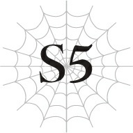

# Chương S5: Thoát khỏi Mê cung Lớn Elroe

Tôi đang đi dọc hành lang.

Tôi đến phòng học của mình, mở cửa và bước vào.

Hầu hết học sinh đã ở bên trong.

Một nhóm nam sinh đang cười đùa vui vẻ với nhau.

Ở trung tâm nhóm đó là Natsume.

Bên cạnh cậu ta, Sakurazaki nở một nụ cười gượng gạo.

Tôi không biết họ đang nói chuyện gì, nhưng tôi chắc chắn đó không phải là chuyện gì tốt đẹp.

Khi tôi đi về phía chỗ ngồi của mình, tôi thấy Hasebe đang ngồi ở bàn bên cạnh bàn tôi, đang mải mê trò chuyện với Temarikawa và Furuta.

Tôi đặt cặp lên bàn rồi đi về phía Kanata và Kyouya, hai người đang tán gẫu bên cửa sổ.

Từ khóe mắt mình, tôi thoáng thấy Wakaba đang lặng lẽ ngồi tại bàn của cô ấy.

Shinohara dường như vẫn chưa đến, vì vậy không có ai trêu chọc cô ấy cả.

Đột nhiên, tôi nhận thấy một mạng nhện trên khung cửa sổ đối diện với cửa sổ nơi Kanata và Kyouya đang đứng.

Vì lý do nào đó, tôi không thể rời mắt khỏi nó.

Khi cuối cùng tôi cũng quay đi, một cô gái đã đứng trước mặt tôi.

Trông cô ấy u ám và kỳ quái, gần giống như một bóng ma.

Thế nhưng, chỉ riêng đôi mắt của cô ấy là lấp lánh rực rỡ.

Đây là cô gái bị bí mật đặt biệt danh là Rihoko.

Bàn tay cô ấy vươn về phía tôi...

"Á?!"

--- PAGE BREAK ---

Tôi bật dậy mà không cần suy nghĩ.

Nhìn quanh, tôi biết mình vẫn đang ở trong Mê cung Lớn Elroe.

Đúng vậy. Đây không phải là trường trung học tôi từng học ở kiếp trước tại Nhật Bản. Đó là một mê cung ở dị giới, nơi đầy rẫy quái vật.

Vậy giấc mơ tôi vừa trải qua là gì chứ?

Nó có ý nghĩa gì không?

Kể từ khi chúng tôi tiến vào Mê cung Lớn Elroe, tôi liên tục gặp những giấc mơ kỳ lạ.

Đã lâu lắm rồi tôi mới mơ về kiếp trước của mình.

Đến thời điểm này, tôi hầu như không thể nhớ nổi khuôn mặt của mọi người khi đó trông như thế nào nữa.

Nếu tôi cố gắng hình dung ra Natsume, tất cả những gì tôi có thể nhìn thấy là khuôn mặt của Hugo.

Ngay cả ký ức về khuôn mặt của chính mình cũng bắt đầu trở nên mờ nhạt.

Nhưng tôi không thể quên được khuôn mặt của Rihoko, dù cho tôi có muốn đi chăng ý nữa.

Tôi chạm tay vào chiếc khăn quàng cổ màu trắng của Julius quanh cổ mình, cố gắng làm dịu tâm trí.

Vẫn còn một chút thời gian nữa để nghỉ ngơi.

Tôi phải ngủ lại để hồi phục thể lực.

Nhưng dù biết vậy, tôi vẫn trằn trọc thao thức suốt phần còn lại của đêm.

Sau cuộc chạm trán với các Tàn tích của Cơn Ác Mộng, hành trình sau đó diễn ra suôn sẻ đến bất ngờ.

Nhờ phần lớn vào việc con Địa Long vừa tiến hóa ngấu nghiến tất cả quái vật trong khu vực, chúng tôi hầu như không phải chiến đấu gì cả.

Nhiều khả năng, sự xuất hiện của các Tàn tích của Cơn Ác Mộng cũng liên quan đến việc lũ quái vật vắng bóng.

Nhưng chúng tôi không hề thấy bất kỳ dấu vết nào của các Tàn tích của Cơn Ác Mộng kể từ đó.

Và giờ đây, cuối cùng, chúng tôi đã gần đến lối ra của Mê cung Lớn Elroe.

“Một cái hố ạ?”

Tôi lặp lại lời của ông Basgath với vẻ hoài nghi.

“Ừ, đúng vậy đấy.”

Nhiều khả năng binh lính Đế quốc sẽ túc trực đón lõng chúng tôi ở lối ra chính của mê cung.

Để tránh họ, chúng tôi đang đi theo một con đường phụ để đến một lối ra khác nằm cách đó một khoảng.

Lối ra đó, hóa ra, là một cái hố.

--- PAGE BREAK ---

Ông Basgath vừa đi vừa giải thích.

“Có vài cái hố khổng lồ trong mê cung này, bọn ta gọi chúng là những cái hố vực. Tin đồn là nếu cậu đi xuống dưới hố đó, cậu sẽ xuống tới Tầng Dưới, nhưng hầu như chưa từng có ai trở lại cả. Vài người sống sót hiếm hoi kể rằng dưới đó có một số lượng quái vật nhiều đến không tưởng. Và tất cả chúng đều mạnh hơn nhiều so với bất kỳ thứ gì ở Tầng Trên này.”

Mê cung Lớn Elroe vẫn còn ẩn chứa rất nhiều bí ẩn.

Ngay cả ông Basgath cũng chỉ quen thuộc với Tầng Trên mà thôi.

Tầng Dưới…

Tôi chắc chắn không bao giờ muốn trải nghiệm một khu vực nguy hiểm như thế.

“Dù sao thì, một trong những cái hố này dẫn lên mặt đất. Đó là cái hố được tạo ra bởi một con quái vật cấp huyền thoại, kẻ hoàn toàn xứng đáng được gọi là kẻ cai trị mê cung này: Taratect Nữ Vương.”

Ông Basgath giải thích rằng vào khoảng thời gian khi chúng tôi vẫn còn là những đứa trẻ sơ sinh, con “Ác Mộng” khét tiếng đã chui ra khỏi mê cung.

Ví như thể đang phối hợp với nhau, Taratect Nữ Vương cũng đã phá hủy một mảng đá nền khổng lồ để thoát ra ngoài.

Sau đó, nó đã điên cuồng tàn phá dồn dập, san phẳng các khu rừng và thậm chí nghiền nát cả một ngọn núi.

May mắn thay, không có con người sống ở đó nên có rất ít thương vong, nhưng người ta nói rằng ngay cả cho đến tận ngày nay, bạn vẫn có thể nhìn thấy rõ những dấu tích của sự hủy diệt đó.

Điều này có chút khó tin, nhưng rõ ràng tất cả đều là sự thật.

Tưởng tượng cảnh sức mạnh đó hướng về phía một khu định cư của con người khiến tôi không khỏi rùng mình lạnh sống lưng.

Tôi đoán việc ông Basgath bị ám ảnh tâm lý sau cuộc chạm trán với Cơn Ác Mộng cũng là điều dễ hiểu, vì nó được xếp cùng đẳng cấp với Taratect Nữ Vương.

Nếu tôi đụng phải một sinh vật như thế, tôi có lẽ sẽ hoàn toàn đóng băng vì sợ hãi.

“Vấn đề là, cái hố này cũng là nơi cư ngụ của lũ quái vật tên là finjicote. Chúng là ong khổng lồ, và đã làm tổ ở đó. Bản thân chúng thì không phải là mối phiền toái lớn, nhưng sức mạnh thực sự nằm ở số lượng. Hơn nữa, cậu phải vừa chiến đấu với chúng vừa leo lên một bức tường thẳng đứng. Đó là lý do tại sao nó hiếm khi được sử dụng làm lối ra.”

Điều đó nghe rất hợp lý.

Cũng giống như lối vào nằm trong lãnh thổ của lũ Thủy Long, chắc chắn phải có lý do chính đáng khiến không ai sử dụng lối ra này.

--- PAGE BREAK ---

Nhưng mà, chúng tôi đã có Fei bên cạnh.

Nếu cưỡi trên lưng cậu ấy, chúng tôi có thể càn quét mở đường xuyên qua cả một bầy quái vật.

“Vậy là trông cậy cả vào cậu đấy.”

“Được thôi. Nhưng trước tiên, các cậu quay mặt đi chỗ khác giùm đi.”

Gần lối vào cái hố, chúng tôi quay lưng lại với Fei và chờ đợi.

Phía sau chúng tôi là tiếng sột soạt khi Fei cởi quần áo.

Vì cậu ấy sắp trở lại dạng rồng, nếu không cởi đồ ra, quần áo sẽ bị xé rách thành từng mảnh vụn khi cơ thể cậu ấy to lên.

Nhưng tất nhiên, trong mê cung làm gì có phòng thay đồ.

Đó là lý do tại sao chúng tôi phải quay đi chỗ khác trong khi cậu ấy trút bỏ xiêm y để biến hình.

Tuy nhiên, đâu có ai cấm chúng tôi lắng nghe.

Nhận ra ý đồ của tôi bằng cách nào đó, Katia lập tức bịt tai tôi lại.

Tôi cũng là một thanh niên trẻ khỏe mạnh mà. Ít nhất cũng phải cho tôi nghe chút tiếng động chứ...

Nhưng tôi có cảm giác mình sẽ bị mắng mỏ thậm tệ nếu nói ra điều đó, nên tôi đành giữ kín trong lòng.

“Xin lỗi vì đã để mọi người phải đợi.”

Giọng của Fei truyền vào tâm trí tôi qua [Thần giao cách cảm].

Quay lại, chào đón chúng tôi là Fei trong hình dạng rồng.

Ngay lập tức, chúng tôi trèo lên lưng cậu ấy.

Bây giờ khi đã nhìn thấy cậu ấy trong hình dạng con người, tôi mới sực nhớ ra Fei là một cô gái.

Có nghĩa là tôi đang ngồi trên lưng một cô gái.

Trước đây tôi chưa từng bận tâm về chuyện này, nhưng một khi đã ý thức được, tôi không khỏi cảm thấy ngượng ngùng.

“Bớt nghĩ đen tối đi được không? Hãy chú ý vào tình hình hiện tại của chúng ta đi chứ.”

Lại đọc được suy nghĩ của tôi một lần nữa, Katia chọc đúng tim đen.

Ý tôi là… cậu ấy nói đúng, dĩ nhiên rồi.

Nhưng tôi đâu có ý định đùa cợt hay gì đâu.

Một thanh niên đôi khi cũng không thể tự chủ được khi có vài ý nghĩ nhất định hiện lên trong đầu mà.

“Làm ơn đừng có cãi nhau kiểu tình nhân trên lưng tớ được không hả? Tớ hất hai cậu xuống bây giờ đấy.”

“Xin lỗi cậu.”

Giọng Fei nghe có vẻ đặc biệt ngán ngẩm.

Tôi tập trung lại vào việc trước mắt và để Fei bay lên.

Ngay khi chúng tôi tiến vào cái hố, vô số con ong bay về phía chúng tôi.

Chúng thực sự rất khổng lồ.

Nhưng theo những gì tôi thấy từ [Thẩm định], các chỉ số của chúng không cao cho lắm.

--- PAGE BREAK ---

Fei dễ dàng đánh đuổi chúng chỉ bằng móng vuốt và đuôi.

Những người còn lại chúng tôi dùng ma pháp để bắn hạ lũ ong đang vo ve xung quanh.

Chúng chắc chắn không phải là mối đe dọa lớn.

Nhưng số lượng áp đảo của chúng lại khá phiền phức.

“Ôi, đủ rồi đấy nhé!”

Fei dường như cũng cảm thấy vậy. Với một tiếng kêu đầy bực bội, cậu ấy há to miệng.

Sau đó, một luồng hơi thở rồng bắn ra từ miệng cậu ấy.

Thiêu rụi toàn bộ lũ ong xung quanh thành tro bụi.

Đòn tấn công đó có lẽ không mạnh như đòn tấn công của Taratect Nữ Vương đã phá vỡ trần đá, nhưng khi luồng hơi thở kết thúc, số lượng ong đã giảm đi trông thấy.

“Giờ thì thoát khỏi đây thôi!”

Khi lũ ong đã dọn sạch, Fei bay vút lên qua cái hố.

Chẳng mấy chốc, những vách đá xung quanh chúng tôi biến mất, thay vào đó là một bầu trời xanh bao la.

Cuối cùng, chúng tôi đã ra được bên ngoài.

Sau bao nhiêu ngày ròng rã, ánh nắng mặt trời chói chang đến mức tôi phải nheo mắt lại.

Chúng tôi đã thành công thoát khỏi Mê cung Lớn Elroe.
