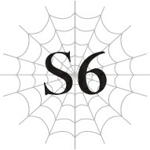
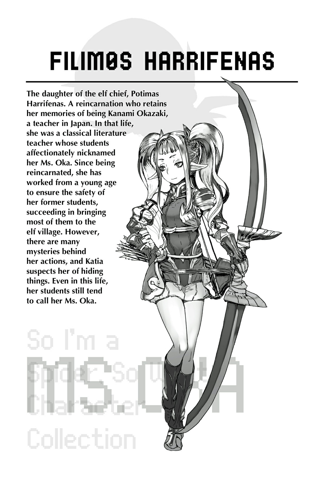

# Chương S6: Những bí mật đen tối của dị giới

“Cảm ơn ông vì tất cả mọi việc.”

Chúng tôi cúi đầu chào Basgath.

Sau khi thoát khỏi Mê cung Lớn Elroe, chúng tôi đã nghỉ lại một đêm tại căn cứ của Basgath.

Và giờ, vào lúc sáng sớm, chúng tôi chuẩn bị khởi hành đến làng Elf.

Đây là nơi chúng tôi chia tay Basgath.

“Đừng khách sáo,” Basgath gật đầu.

“Nhưng mấy đứa chắc chắn là để lão lấy hết các bộ phận của Địa Long chứ? Bán được cả gia tài đấy biết không.”

“Tất nhiên rồi ạ. Dù sao chúng cháu cũng không thể mang theo bất cứ thứ gì làm chậm hành trình. Xin ông hãy nhận nó như một lời cảm ơn vì sự giúp đỡ suốt thời gian qua.”

“Được rồi, vậy thì lão nhận,” người dẫn đường nói với một nụ cười rạng rỡ.

“Ông Basgath. Hay là ông có thể—?”

“Lão chỉ là một người dẫn đường bình thường thôi, cậu nhóc.” Basgath trả lời trước khi tôi kịp nói hết câu.

Ông ấy dường như biết tỏng những gì tôi định nói.

Basgath là một chiến binh dày dạn kinh nghiệm.

Điều đó đã được thể hiện rất rõ ràng trong suốt thời gian chúng tôi ở trong Mê cung Lớn Elroe.

Hơn nữa, ông có khả năng phán đoán cực kỳ nhạy bén nhờ vốn trải nghiệm phong phú của mình.

Thành thật mà nói, tôi rất muốn ông đi cùng chúng tôi.

Nhưng Basgath đã thẳng thừng từ chối từ trước.

“Công việc của người dẫn đường chỉ có thế thôi—đưa mọi người đi qua mê cung. Vả lại, lão cũng nghỉ hưu rồi. Không cần thiết phải để một lão già thế này xen mũi vào những chuyện không thuộc về mình nữa.”

Ông cười khẽ.

--- PAGE BREAK ---

Nhưng rồi khuôn mặt ông lại trở nên nghiêm nghị.

“Cậu nhóc. Đây chỉ là linh cảm thôi, nhưng lão nghĩ sắp có biến cố lớn xảy ra rồi. Tất nhiên lão không có bằng chứng. Nhưng nỗi sợ hãi đó đã đè nặng lên lão suốt vài năm qua. Rắc rối mà các cậu đang vướng vào lúc này có lẽ chỉ là điềm báo cho những gì sắp tới.”

Điều đó rất có lý.

Không chỉ là những gì đang xảy ra với Hugo.

Cuộc chiến quy mô lớn với ma tộc.

Danh hiệu Anh hùng được chuyển giao cho một người mới.

Thế giới dạo gần đây liên tục xảy ra quá nhiều biến động.

“Lão chỉ hy vọng việc dẫn đường cho các cậu tới đây sẽ giúp thế giới tốt đẹp hơn dù chỉ một chút. Như vậy lão sẽ cảm thấy mình đã hoàn thành xuất sắc bổn phận của mình rồi.”

Basgath chìa tay ra.

“Chúng cháu sẽ cố gắng hết sức để điều đó trở thành sự thật.”

Tôi nắm chặt tay ông để thực hiện một cái bắt tay vững chãi.

“Bổn phận của lão chỉ là dẫn đường qua mê cung. Nhưng lão nghĩ trọng trách của cậu lớn lao hơn nhiều, cậu nhóc. Chúc may mắn.”

Những lời này đã tiếp thêm cho tôi rất nhiều động lực.

Sau khi chia tay Basgath, chúng tôi tiếp tục cuộc hành trình đến làng Elf.

Di chuyển trên lưng Fei, chúng tôi sẽ mất khoảng hai ngày.

Chúng tôi đã tới một thị trấn nằm ở rìa khu vực có tên là Sariella.

Trước khi bước vào thị trấn, Fei biến trở lại dạng người và khoác lên mình một chiếc áo choàng rộng để che đi đôi cánh của mình.

Đó là sau khi cô ấy đã khép chặt chúng sát vào cơ thể.

Nếu không, đôi cánh của cô sẽ thu hút sự chú ý.

Thế giới này dù là thế giới fantasy, nhưng lại không có các chủng tộc như thú nhân hay bất cứ thứ gì tương tự.

Điều đó nghĩa là không có bất kỳ chủng tộc dạng người nào sở hữu đôi cánh.

Tôi hình dung nếu có ai đó vô tình nhìn thấy đôi cánh của Fei dưới lớp áo choàng, họ có lẽ sẽ tò mò hoặc nghi ngờ.

--- PAGE BREAK ---

Nhưng có vẻ như tình hình còn nghiêm trọng hơn tôi nghĩ.

“Người dân ở Sariella đều tôn thờ Nữ thần. Và trong các truyền thuyết, Nữ thần có đôi cánh màu trắng. Ai mà biết họ sẽ làm gì nếu nhìn thấy đôi cánh của Fei chứ?”

À.

Theo lời cô Oka, trong trường hợp tồi tệ nhất, họ thậm chí có thể tấn công Fei vì tội mạo danh Nữ thần.

Khả năng cao là họ sẽ làm ngược lại—nghĩa là cố gắng tôn thờ cô ấy—nhưng cô giáo của chúng tôi không muốn mạo hiểm.

Vì người dân ở vùng này tin tưởng sùng đạo Nữ thần, họ có cách suy nghĩ rất lập dị.

Chính vì thế, mối quan hệ của họ với Thần Ngôn Giáo cực kỳ căng thẳng, đến mức họ từng khơi mào chiến tranh với nhau trong quá khứ.

Bản thân tôi không theo Thần Ngôn Giáo, nhưng giáo phái này đã nắm giữ và quản lý Anh hùng suốt nhiều thế hệ.

Nếu họ phát hiện ra tôi là Anh hùng mới, tôi có thể bị kéo vào những cuộc xung đột không đáng có.

Vì vậy, tốt nhất là chúng tôi nên tránh gây chú ý nhiều nhất có thể.

Tôi không muốn bắt Fei phải chịu sự bất tiện như vậy, nhưng đó là lựa chọn duy nhất khi chúng tôi còn ở khu vực này.

Bởi vì với những gì tôi biết, tôi không thể không cảm thấy rằng tất cả các tôn giáo trên thế giới này đều cực kỳ mờ ám.

“Thế giới này về cơ bản được tạo ra như một phần của trò chơi giữa các vị thần.”

Đó là chuyện vào ngày trước khi chúng tôi khởi hành đến làng Elf.

Với lời mở đầu đó, cô Oka bắt đầu giải thích.

“Trước hết, vì chúng ta sẽ đưa Hyrince và Anna đến làng Elf, cô muốn nói cho họ biết về thân phận thật sự của chúng ta. Như vậy có được không, Shun và Katia?”

Ý cô là cô dự định sẽ tiết lộ chuyện chúng tôi đều là những người tái sinh.

Tôi lập tức gật đầu, nhưng Katia có vẻ kém thuyết phục hơn.

“Em xin phép được hỏi chuyện này có liên quan gì đến làng Elf không ạ?”

“Có chứ. Cô sẽ cố gắng giải thích lý do tại sao.”

Cô Oka kiên quyết gật đầu.

--- PAGE BREAK ---

Sau khi suy nghĩ một lát, Katia cũng gật đầu đồng ý.

“Shun, Katia, Fei và cô đều là người tái sinh. Chúng ta được sinh ra với ký ức về kiếp trước ở một thế giới khác.”

Ban đầu, Hyrince và Anna chỉ nhìn chúng tôi với vẻ bối rối.

Tuy nhiên, thật may mắn là khái niệm tái sinh vốn tồn tại ở thế giới này, nên sau khi nghe giải thích thêm, họ đã chấp nhận được chuyện đó.

“Tôi đoán điều đó giải thích được vài chuyện,” cuối cùng Hyrince lên tiếng.

“Nhưng… cô Oka đúng không? Chuyện đó thì liên quan gì đến những gì chúng ta đang thảo luận lúc nãy?”

“Nớ liên quan đến những tiên tri của tộc Elf và tâm nguyện của cô,” cô Oka trả lời.

“Đầu tiên, như cô đã nói với Shun, tộc Elf đã tìm kiếm và bảo hộ các người tái sinh từ lâu rồi. Lý do là sự kết hợp giữa những gì tộc Elf đã tiên tri và những gì cô khẩn cầu họ làm. Lẽ tự nhiên, tâm nguyện của cô là đảm bảo tất cả các người tái sinh đều được an toàn. Như các em đều biết, thế giới này rất nguy hiểm, đầy rẫy quái vật và thậm chí cả ma tộc thù địch. Thế giới cũ của chúng ta rất hòa bình, nên không ai trong chúng ta quen với việc chiến đấu. Đó là lý do khiến những người tái sinh gặp rất nhiều khó khăn để sinh tồn ở thế giới này. Cô đã bảo vệ họ bằng cách đưa họ đến sống an toàn trong làng Elf.”

Chuyện đó chắc chắn không hề dễ dàng như những gì cô nói.

Tìm kiếm những người tái sinh khắp thế giới mà không có lấy một manh mối nào để lần theo.

Vả lại như chính cô đã nói, thế giới này rất nguy hiểm.

Khi tôi vẫn còn là một đứa trẻ, cô Oka đã bôn ba khắp thế giới để tập hợp những người tái sinh.

Tôi chắc chắn rằng cuộc hành trình đó gian khổ vượt xa những gì tôi có thể tưởng tượng.

Nếu có gì chứng minh cho điều đó, thì chính là năng lực ma pháp xuất chúng của cô giáo chúng tôi.

“Tuy nhiên, kế hoạch của tộc Elf hơi khác một chút. Họ muốn đảm bảo rằng một số thực thể mạnh mẽ không thể lợi dụng những người tái sinh cho mục đích riêng của họ. Những thực thể này được gọi là các quản trị viên, nhưng các em cũng có thể gọi họ là các vị thần.”

Chuyện đó đột nhiên đẩy mọi thứ lên một quy mô lớn hơn nhiều, nhưng tôi đoán nó có liên quan đến tuyên bố của cô về việc thế giới này là một “trò chơi giữa các vị thần.”

“Chuyện này có vẻ đột ngột, nhưng cô xin phép hỏi mọi người một câu. Các em nghĩ ‘chỉ số’ là gì?”

“Nó đại diện cho sức mạnh của chúng ta đúng không ạ?”

“Đúng vậy. Nhưng tại sao các em nghĩ một thứ như thế lại tồn tại?”

“À, bởi vì Thần ngôn quy định như thế.”

Hyrince trả lời câu hỏi của cô Oka một cách tự nhiên.

--- PAGE BREAK ---

Nhưng Katia và tôi lập tức nhận ra ý nghĩa đằng sau những lời cô nói.

Những người sinh ra ở thế giới này có lẽ sẽ không bao giờ thắc mắc về điều đó.

Không phải chỉ số, hay "Thần ngôn", hay bất cứ thứ gì trong số đó.

Nó chỉ đơn giản là một thứ đã tồn tại đối với họ ngay từ khoảnh khắc họ được sinh ra.

Nhưng những người tái sinh chúng tôi biết về một thế giới mà những "chỉ số" này không hề tồn tại.

Đối với chúng tôi, việc có các chỉ số và những thứ tương tự có vẻ rất kỳ lạ.

“Đúng vậy. ‘Chỉ số’ thực sự được tạo ra bởi một vị thần. Bây giờ, các em có biết tại sao vị thần đó lại tạo ra nó không?”

Đối với câu hỏi đó, Hyrince không có câu trả lời.

“Ở thế giới cũ của chúng ta, chúng ta không hề nghe thấy bất kỳ ‘Thần ngôn’ nào. Cũng không có cấp độ, chỉ số, hay kỹ năng nào cả. Nếu em nỗ lực hết mình, em chắc chắn có thể nâng cao năng lực của bản thân, nhưng không phải dưới bất kỳ hình thức hiển thị bằng giá trị số nào. Đối với những người tái sinh chúng ta, việc có cấp độ, chỉ số, kỹ năng, vân vân thực sự là điều vô cùng bất thường.”

Hyrince có vẻ ngạc nhiên trước lời cô Oka.

Anh ấy luôn coi sự tồn tại của chúng là điều hiển nhiên, vì vậy nó chưa bao giờ có vẻ “bất thường” đối với anh.

“Theo lẽ thường, cấp độ, kỹ năng và chỉ số không cần thiết để một thế giới tồn tại. Thế giới cũ của chúng ta vẫn vận hành hoàn hảo mà không có chúng, điều đó là quá rõ ràng rồi.”

Đúng vậy. Ở Trái Đất, chúng tôi vẫn sống tốt mà không cần những thứ đó.

Tôi bắt đầu lờ mờ đoán ra lý do tại sao cô Oka lại khơi gợi chủ đề này.

Về cơ bản, các “quản trị viên” này đã tạo ra cấp độ, chỉ số, kỹ năng và những thứ tương tự vì một mục đích cụ thể.

Đó có lẽ là điều cô muốn hướng tới.

“Thưa cô Oka, mục tiêu của các vị thần khi tạo ra tất cả những thứ này là gì ạ? Để bắt mọi người phải chiến đấu với nhau sao?”

Rõ ràng là Katia cũng đã đi đến một kết luận tương tự.

Thậm chí, cậu ấy còn đi trước tôi một bước.

Để bắt mọi người chiến đấu…

Tôi chưa từng nghĩ đến chuyện đó.

Nhưng giờ khi nghe cậu ấy nhắc tới, tôi mới nhận ra rằng tất cả các kỹ năng ở thế giới này đều liên quan đến chiến đấu.

Như thể để khuyến khích mọi người chém giết lẫn nhau vậy.

--- PAGE BREAK ---

“Đúng vậy. Ở thế giới này, các em càng chiến đấu nhiều thì cấp độ, chỉ số và kỹ năng của các em càng tăng lên. Và nếu các em thua trận, các em sẽ chết. Càng có nhiều trận chiến xảy ra, càng có nhiều người phải bỏ mạng.”

Điều đó rất hợp lý.

Nhiều trận chiến đồng nghĩa với việc có nhiều thương vong.

Nhưng tôi không thể hiểu nổi tại sao cô lại giải thích một điều hiển nhiên đến vậy.

“Và khi một sinh vật sống chết đi, sức mạnh mà nó tích lũy được từ trước đến nay sẽ bị thu thập… bởi các quản trị viên.”

Thông tin này thực sự gây sốc.

Về mặt logic, dựa trên những gì cô đã nói cho đến nay, việc đây là lý do các quản trị viên tạo ra cấp độ, chỉ số, vân vân là điều hoàn toàn có lý.

Tuy nhiên, toàn bộ sự việc này phi lý đến mức tôi gần như không thể tin nổi.

“Các quản trị viên ép buộc mọi người phải chiến đấu để thu đoạt thêm sức mạnh cho bản thân họ. Đó là lý do tại sao nhân tộc và ma tộc lại bị đặt vào thế đối đầu sinh tử. Và tại sao họ lại có những đại diện được chỉ định dưới danh nghĩa Anh hùng và Ma Vương. Thành thật mà nói, khi cô nghe tin Shun trở thành Anh hùng, đất trời xung quanh cô như sụp đổ.”

Khi cô hướng chủ đề về phía tôi, tôi có thể nghe thấy tiếng tim mình đập thình thịch bên tai.

Anh hùng là một đại diện của nhân tộc, được lựa chọn bởi các quản trị viên?

Và là một phần trong kế hoạch ép buộc nhân tộc và ma tộc phải tàn sát lẫn nhau của họ?

“Thưa cô Oka, mức độ đáng tin cậy của tất cả thông tin này là bao nhiêu ạ?”

Katia đặt câu hỏi đó là hoàn toàn hợp lý.

Câu chuyện của cô rất nhất quán, nhưng xét đến tính chất giống như truyện cổ tích của nó, hoàn toàn có khả năng nó đã bị phóng đại hoặc thậm chí là do ai đó thêu dệt nên.

“Nó đã được truyền lại trong tộc Elf từ thời cổ đại.”

“Nhưng điều đó có nghĩa là nó chắc chắn đúng sao ạ?”

Tôi cũng không thể trách Katia khi giọng cậu ấy ngày càng trở nên lo ngại và bực dọc.

Chỉ vì tộc Elf đã tin vào điều đó từ lâu không có nghĩa là nó nhất định phải là sự thật.

“Thành thật mà nói, cô cũng không chắc chắn liệu toàn bộ chuyện này có đúng hay không. Tuy nhiên, cô có thể xác nhận rằng các thực thể được gọi là ‘quản trị viên’ là có thật. Cô đã tận mắt nhìn thấy một trong những thuộc hạ của họ. Hơn nữa, tộc Elf tin vào điều này rất nghiêm túc, đến mức họ sẵn sàng chấp nhận nguy hiểm để bảo vệ những người tái sinh.”

--- PAGE BREAK ---

Nếu cô Oka đã nhìn thấy một thuộc hạ của quản trị viên, thì tôi chắc chắn rằng các quản trị viên thực sự tồn tại.

Nhưng câu chuyện này thì có liên quan gì đến mong muốn bảo vệ các người tái sinh của tộc Elf?

Trước khi tôi kịp hỏi, cô Oka đã giải thích luôn.

“Những người tái sinh chúng ta đều sở hữu các kỹ năng mạnh mẽ và một lượng lớn điểm kỹ năng ngay từ khi sinh ra. Nếu được sử dụng đúng cách, họ thực sự có thể trở nên rất mạnh. Ví dụ như chúng ta chẳng hạn.”

Cô Oka nhìn chằm chằm vào Katia và tôi.

Katia, Fei—người lúc đó không ở cùng chúng tôi—và tôi chắc chắn đều có các kỹ năng và điểm kỹ năng dư thừa từ khi mới lọt lòng.

Chúng tôi chính là minh chứng sống cho việc những lợi thế này có thể giúp chúng tôi mạnh lên nhanh hơn rất nhiều so với những người xung quanh.

“Và khi một người trong chúng ta chết đi, các quản trị viên sẽ cướp đoạt tất cả sức mạnh đó. Tộc Elf lo sợ điều đó, vì vậy họ không muốn các người tái sinh có được quá nhiều sức mạnh. Thế nên chúng ta mới đi tập hợp các người tái sinh lại và cách ly họ để họ không rèn luyện thêm kỹ năng và chỉ số của mình.”

Tại sao tộc Elf lại tuyệt vọng ngăn cản các quản trị viên thu được sức mạnh đến thế?

Tuyệt vọng đến mức phải đi gom các người tái sinh từ khắp nơi trên thế giới…

“Nếu vậy thì, chẳng phải việc tiêu diệt tất cả chúng ta trước khi chúng ta trở nên quá mạnh sẽ tốt hơn sao ạ?”

Câu hỏi của Katia khiến lồng ngực tôi thắt lại.

Không quá ngạc nhiên nếu mọi chuyện diễn ra theo hướng đó sau những gì chúng tôi vừa nghe. Trên thực tế, điều đó có vẻ hợp lẽ thường hơn.

Theo những gì cô giáo giải thích cho đến nay, tộc Elf coi các “quản trị viên” này là kẻ thù.

Nếu họ lo lắng về việc những người tái sinh trở nên quá mạnh mẽ đến thế, việc đơn giản là loại bỏ họ trước khi họ có cơ hội sẽ dễ dàng hơn nhiều so với việc cách ly và giám sát họ.

Nhưng cho đến khi Katia lên tiếng, tôi thậm chí còn chưa bao giờ nghĩ đến khả năng đó.

“Không cần lo lắng đâu. Potimas, tộc trưởng của tộc Elf, đã đưa ra quyết định cuối cùng rằng phải giữ cho các người tái sinh được sống. Mặc dù ngay cả cô cũng không biết tại sao ông ấy lại quyết định như vậy.”

Sophia đã giết Potimas khi chúng tôi chạy trốn khỏi hoàng đô.

Ông ấy đã ở lại vương quốc với tư cách là đại sứ thiện chí của tộc Elf một thời gian, nhưng cho đến tận lúc đó tôi mới nghe nói ông ấy cũng chính là tộc trưởng của họ.

--- PAGE BREAK ---

Từ những gì cô Oka nói, tôi đoán điều đó có nghĩa là ông ấy nắm giữ quyền lực rất lớn.

Ông ấy đã chọn giữ cho các người tái sinh được sống, nhưng vì bây giờ ông ấy đã chết, chúng tôi sẽ không bao giờ biết được động cơ của ông ấy nữa.

“Cô chắc chắn rằng Potimas có những kế hoạch của riêng mình. Ông ấy là một người cực kỳ lý trí và thực dụng, nên cô nghi ngờ việc ông ấy chọn tha mạng cho các người tái sinh chỉ đơn thuần vì lòng tốt.”

Nghe có vẻ như cô Oka hẳn phải biết khá rõ về Potimas.

Điều đó cũng hợp lý thôi. Ông ấy là cha cô mà.

“Shun, làm ơn đừng lộ vẻ mặt như thế. Đúng vậy, Potimas là cha cô, nhưng bọn cô hầu như không có mối quan hệ gia đình nào cả. Ông ấy và cô chỉ đơn giản là đang lợi dụng lẫn nhau mà thôi. Vì vậy, dù nghe có vẻ tàn nhẫn, nhưng cô không quá đau buồn trước cái chết của ông ấy đâu.”

Tôi tự hỏi mình đang biểu lộ vẻ mặt thế nào.

Mặc dù nở một nụ cười gượng gạo, nhưng cô Oka trông vẫn có vẻ buồn bã trong mắt tôi.

“Quay lại vấn đề chính, mục tiêu của tộc Elf là lật đổ các quản trị viên. Để đạt được mục đích đó, họ dự định ngăn chặn cuộc chiến giữa nhân tộc và ma tộc, sau đó làm trung gian hòa giải để cải thiện mối quan hệ giữa hai chủng tộc. Không có chiến tranh, mọi người sẽ không chiến đấu, và họ sẽ không cần phải nâng cao kỹ năng cũng như chỉ số của mình. Điều đó đồng nghĩa với việc sức mạnh mà các quản trị viên thu thập được cũng sẽ bị suy yếu. Kế hoạch đó nghe có vẻ kéo dài lê thê đối với loài người, nhưng vì tộc Elf sống thọ hơn nhiều, nên họ có đủ thời gian và kiên nhẫn để thực hiện nó. Trên thực tế, cô được kể rằng họ đã từng ngăn chặn thành công trận chiến giữa Anh hùng và Ma Vương thế hệ trước bằng cách thức đó.”

Nhưng câu chuyện không chỉ dừng lại ở đó.

“Tuy nhiên, cuối cùng cả hai người họ đều biến mất. Tộc Elf nghi ngờ đó là tác phẩm của các quản trị viên. Và bây giờ, Ma Vương hiện tại dường như đang hợp tác với họ. Nếu không, chẳng có lý do gì để khơi mào một cuộc chiến quy mô lớn đến vậy.”

Tôi sẽ không bao giờ quên được biểu cảm của Hyrince vào khoảnh khắc đó.

Nó vừa là phẫn nộ, vừa là đau khổ, lại vừa là một thứ cảm xúc gì đó tôi không thể gọi tên chính xác.

Hyrince đã chiến đấu trong chính cuộc chiến đó.

Và tất cả đồng đội của anh, bao gồm cả Julius, đều bị sát hại ngay trước mắt anh.

Việc biết được tất cả chuyện này diễn ra chỉ đơn giản là để các “quản trị viên” nào đó thu thập thêm sức mạnh chắc chắn là điều cực kỳ khó nuốt trôi.

Ngay cả tôi cũng không thể chấp nhận được việc anh trai mình bị giết vì một lý do vô nghĩa đến vậy.

--- PAGE BREAK ---

Tôi không muốn tin rằng câu chuyện của cô Oka là thật.

Ý tôi là, sao chuyện đó có thể xảy ra được chứ?

Anh trai tôi luôn mong muốn hòa bình thế giới hơn bất kỳ ai.

Nhưng nếu những gì cô Oka nói là đúng, thì vai trò Anh hùng của anh là để dẫn dắt nhân loại vào chiến tranh.

Anh chỉ cầm kiếm lên để chấm dứt các cuộc chém giết.

Nhưng theo lời cô Oka, anh lại làm điều hoàn toàn ngược lại.

Anh đang chơi đúng theo kịch bản của các quản trị viên bằng cách tham gia vào cuộc chiến.

Tôi sẽ không tha thứ cho họ.

Tôi không thể.

Họ tồn tại cứ như thể chỉ để giày xéo lên đức tin của anh trai tôi vậy.

Nếu tất cả chuyện này là sự thật, tôi không thể để các quản trị viên nhởn nhơ ngoài vòng pháp luật như thế được.

Tôi chắc chắn Hyrince cũng có cùng cảm nhận.

Điều đó giải thích cho biểu cảm u ám của anh.

“Khi cô không ở học viện, cô đã đi hỗ trợ tộc Elf cố gắng ngăn chặn chiến tranh xảy ra. Bất kể lý do của họ là gì, cô vẫn nợ họ một ân tình lớn vì đã bảo vệ các người tái sinh. Nhưng tất cả những nỗ lực đó đều đổ sông đổ bể, vì cuộc chiến thực tế đã bắt đầu rồi.”

“Hóa ra đó là lý do cô vắng mặt thường xuyên như vậy…”

Cô Oka hiếm khi xuất hiện trên lớp ở học viện.

Và bây giờ chúng tôi đã hiểu tại sao.

Cô không muốn nói cụ thể những gì cô đã làm, nhưng hiểu tính cô, đó là vì cô không muốn chúng tôi biết cô đã phải trải qua những gì.

“Cô tin rằng các quản trị viên đã phát hiện ra những gì tộc Elf đang làm. Họ đã thanh trừng tên ma tộc âm thầm hợp tác với tộc Elf. Và rất có thể, mục tiêu của họ trong các biến cố gần đây là tiêu diệt Potimas, cũng như những người thuộc nhân tộc liên minh với tộc Elf, chẳng hạn như phụ hoàng của Shun và Leston.”

“Khoan đã cô! Chẳng phải Hugo mới là kẻ chịu trách nhiệm cho tất cả những chuyện đó sao?!”

Cách diễn đạt của cô Oka dường như chỉ ra rằng các quản trị viên đứng sau mọi chuyện xảy ra gần đây.

Rõ ràng, đó không phải là một sự nhầm lẫn.

“Điều này không thay đổi những gì Hugo đã làm, nhưng cô nghĩ cậu ta nhiều khả năng chỉ đang bị lợi dụng. Việc Sophia đi cùng cậu ta chính là bằng chứng.”

Sophia. Cô gái đã dễ dàng áp đảo chúng tôi.

Cô Oka hít một hơi thật sâu rồi tiết lộ sự thật:

--- PAGE BREAK ---

“Tên của cô ta là Sophia Keren. Và ở kiếp trước, cô ta là Negishi Shouko. Cô ta là một trong những người tái sinh đã đứng về phía các quản trị viên.”

--- PAGE BREAK ---

