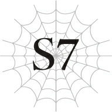
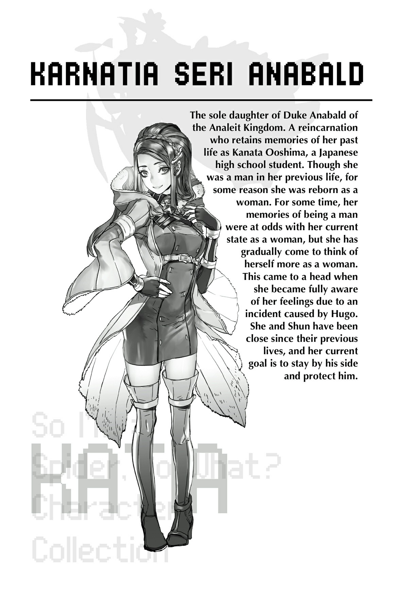

# Chương S7: Những người tái sinh

“Hãy dâng hiến kỹ năng! Đó là con đường dẫn đến cứu rỗi!”

Khi chúng tôi đi vào thị trấn để mua thức ăn và nhu yếu phẩm, một giọng nói vang lên hướng về phía chúng tôi.

“Người dân Sariella thờ phụng quản trị viên Sariel như vị thần của họ. Tốt nhất là các em nên tránh tiếp xúc với họ trừ khi thực sự cần thiết.”

Tôi đồng ý với lời khuyên thì thầm của cô Oka.

Người đàn ông đang la hét kia trông không được tỉnh táo cho lắm.

Nếu đây là việc của một kẻ được gọi là quản trị viên, thì quả thực chẳng mấy dễ chịu gì.

Tôi vẫn chưa hoàn toàn tin tưởng tất cả những gì cô Oka kể cho chúng tôi nghe.

Nhưng tôi cũng không có bằng chứng nào để bác bỏ nó.

Hơn nữa, nếu các thực thể siêu nhiên được gọi là quản trị viên thực sự tồn tại, điều đó sẽ giải thích được rất nhiều điều về hành vi của Sophia.

Sophia đã dùng từ “Chủ nhân”.

Vài có vẻ như cô ta đang hành động theo mệnh lệnh của kẻ đó.

Kẻ đó hẳn phải mạnh mẽ đến mức phi lý thì một người mạnh như Sophia mới tuân theo mệnh lệnh như vậy.

Nếu vậy, việc “chủ nhân” của cô ta về cơ bản là một vị thần của thế giới này cũng là điều dễ hiểu.

Nhưng nếu ngay cả Sophia mà tôi còn không thể đánh bại, thì làm sao tôi có thể chống lại một kẻ thậm chí còn mạnh hơn cô ta chứ?

Nếu một trong những thực thể đó nằm trong lực lượng tấn công làng Elf...

“Dâng hiến kỹ năng nghĩa là sao hả cô?”

Để xua đi những suy nghĩ đang xâm chiếm tâm trí, tôi đặt một câu hỏi cho cô Oka.

“Người ta nói rằng nó có hai ý nghĩa. Một là sử dụng một kỹ năng gọi là [Xóa Kỹ Năng] để tự xóa đi kỹ năng của chính mình.”

“Chuyện đó khả thi sao cô?”

“Hoàn toàn có thể. [Xóa Kỹ Năng] có thể nhận được mà không tốn bất kỳ điểm kỹ năng nào và nó sẽ xóa các kỹ năng trong vòng vài ngày. Một khi đã kích hoạt, nó sẽ không dừng lại cho đến khi xóa sạch toàn bộ kỹ năng của người dùng, vì vậy không thể dùng nó để chỉ loại bỏ một số mục tiêu cụ thể. Những kỹ năng đã bị xóa cũng không thể khôi phục lại được. Trừ phi tất nhiên là em tự luyện tập để nhận lại chúng.”

“Chuyện đó rốt cuộc có mục đích gì vậy cô?”

Tôi không hiểu tại sao một kỹ năng như thế lại tồn tại.

Chẳng có lợi ích gì khi mất đi kỹ năng của mình cả.

Ngay cả khi có thể lấy lại bằng cách luyện tập lần nữa, bạn cũng không thể lấy lại khoảng thời gian đã bỏ ra trước đó hoặc số điểm kỹ năng đã dùng để học chúng.

Nó giống như việc tự tay đổ sông đổ bể mọi nỗ lực của mình vậy.

--- PAGE BREAK ---

“Nói cách khác, nó chuyển hóa sức mạnh của em cho các quản trị viên.”

“À.”

Hóa ra là vậy.

Một cách để con người dâng hiến sức mạnh tích lũy của mình cho các quản trị viên.

Đó chính là mục đích của [Xóa Kỹ Năng]?

“Nghĩ lại thì, chẳng phải cô cũng từng xóa kỹ năng của Hugo một lần sao cô Oka?”

“Đúng vậy, nhưng đó là một dạng lỗi hệ thống, một phương pháp bí mật để xóa kỹ năng của người khác bằng cách trả một cái giá đắt. Khi cô dùng nó, cô sẽ mất đi vài kỹ năng của chính mình, đồng thời rơi vào trạng thái ngủ sâu suốt vài ngày sau đó. Trong trường hợp xấu nhất, nó thậm chí có thể lấy đi mạng sống của cả mục tiêu lẫn người sử dụng, vì vậy cô hy vọng mình sẽ không bao giờ phải dùng đến kỹ thuật đó lần nữa.”

“Em hoàn toàn không biết chuyện đó...”

Nghĩ lại thì, khi con Địa Long là phụ mẫu của Fei tấn công học viện, cô Oka đã không tham gia trận chiến.

Khả năng cao không phải vì cô không muốn, mà là vì cô không thể.

“Vào lúc đó, cô nghĩ đó là phương án tốt nhất. Cô thực sự tin rằng nếu mất đi toàn bộ kỹ năng, sự ngạo mạn của Hugo sẽ ngừng phát triển ngoài tầm kiểm soát. Giờ cô mới biết lẽ ra sau đó cô phải giúp em ấy lấy lại nhân tính, nhưng cô đã thất bại trong việc đó, và giờ kết quả là thế này đây. Cô quả là một giáo viên thất bại.”

“Đó không phải là lỗi của cô đâu ạ.”

Tôi biết lời này chẳng giúp ích được gì nhiều, nhưng đó là tất cả những gì tôi có thể nói.

Hugo mới là kẻ phải chịu trách nhiệm cho những hành động của mình.

“Cảm ơn em. Nhưng giờ cô đã biết mình phải làm gì rồi. Với tư cách là giáo viên, nhiệm vụ của cô là phải uốn nắn lại người học trò cũ đã đi quá xa khỏi con đường của mình.”

Ánh mắt của cô giáo chúng tôi tràn đầy quyết tâm cay đắng.

Cô định sẽ giết Hugo.

Tôi không biết phải trả lời thế nào trước điều đó.

“Vậy còn ý nghĩa thứ hai là gì thế cô?”

Tôi đổi chủ đề.

Dù trong lòng cảm thấy thật thảm hại vì không thể làm được gì hơn.

--- PAGE BREAK ---

“Cô cũng không hoàn toàn chắc chắn. Đại loại là dâng hiến kỹ năng để đưa bản thân đến gần hơn với thần giới.”

“Nghe đúng kiểu sùng bái tôn giáo thật đấy ạ.”

“Cô cũng nghĩ vậy.”

Vị linh mục tiếp tục hét lớn trên phố.

Khi một bầu không khí u ám bao trùm lấy chúng tôi, tôi không khỏi muốn nhanh chóng rời khỏi đây càng sớm càng tốt.

“Shun, tớ nói chuyện với cậu một lát được không?”

Khi trời đã khá muộn và chúng tôi chuẩn bị đi ngủ, Katia gõ cửa phòng tôi cùng với Fei đi theo sau.

Cô Oka đã ra ngoài để gặp gỡ các đồng minh của tộc Elf trong thị trấn.

Tôi từng nghĩ nên có ai đó đi cùng cô, nhưng cô khăng khăng muốn đi một mình.

Hyrince nói rằng nhiều khả năng những người cô gặp là thành viên thuộc thế giới ngầm của xã hội này.

Về bản chất, những kẻ như vậy sẽ không gặp bất kỳ ai mà họ không quen biết.

Anh ấy nói đó có lẽ là lý do cô Oka phải hành động một mình.

Tôi không thích ý nghĩ để cô giáo của mình dính dáng đến một lũ đáng nghi như vậy, nhưng cô bảo tôi rằng đôi khi người ta phải chấp nhận nhúng chàm để giải quyết công việc, và tôi đành phải miễn cưỡng tiễn cô đi.

“Có chuyện gì thế?”

Vì cậu ấy chọn thời điểm nói chuyện khi cô Oka vắng mặt, tôi có thể đoán được chủ đề là gì.

Rất có thể cậu ấy muốn thảo luận điều gì đó mà không muốn cô giáo của chúng tôi nghe thấy.

“Anh Hyrince, tôi vô cùng xin lỗi, nhưng tôi có thể xin phép nhờ anh ra ngoài một lát được không?”

Và có vẻ như cậu ấy cũng không muốn Hyrince biết về chuyện này.

--- PAGE BREAK ---

“Hừm. Được thôi. Tôi sẽ ra quán bar hay đâu đó giết thời gian vậy.”

“Cảm ơn anh rất nhiều.”

“Thôi nào, tôi không bận tâm đâu. Tôi chắc rằng những người tái sinh các cậu có những chuyện không muốn người ngoài nghe thấy mà, đúng không?”

Nói rồi, Hyrince luôn chu đáo rời khỏi phòng.

“Còn Anna thì sao?”

“Tớ bảo cô ấy đợi ở phòng rồi.”

Ngay khi Hyrince rời đi, Katia rũ bỏ sự trang trọng lịch sự và bắt đầu nói chuyện bằng tiếng Nhật.

“Trời đất, anh Hyrince chín chắn ghê á. Đúng là một cực phẩm nam thần!”

Fei lao xuống giường.

Giờ đây khi đã có thể biến thành dạng người, cô ấy có vẻ khá hài lòng khi được ngủ lại trên giường.

Khi cô ấy còn nhỏ hơn, thỉnh thoảng cô ấy chiếm một phần giường của tôi, nhưng sau khi lớn hơn, cô ấy không còn lựa chọn nào khác ngoài việc ngủ bên ngoài.

Được ngủ lại trên giường khiến tâm trạng cô ấy vô cùng phấn chấn.

Tuy nhiên, khuyết điểm duy nhất mà cô ấy than vãn là không thể lăn lộn thoải mái vì vướng đôi cánh.

“Vậy? Có chuyện gì thế?”

“Tất nhiên là về các người tái sinh khác rồi.”

Katia ngồi xuống cạnh Fei với vẻ mặt nghiêm nghị.

Có vẻ như cậu ấy dự kiến cuộc trò chuyện này sẽ kéo dài.

Tôi ngồi đối diện với cậu ấy và chuẩn bị lắng nghe.

“Lúc đó tớ không kể với các cậu, nhưng trước đây tớ đã hỏi cô Oka về những người tái sinh khác vài lần. Cô ấy bảo tớ rằng có mười một người đang được bảo hộ trong làng Elf. Cô ấy cũng đã liên lạc thành công với tám người khác, bao gồm cả chúng ta. Còn tung tích của sáu người còn lại thì hiện vẫn chưa rõ.”

Tôi nhớ mang máng cô ấy từng nói điều gì đó tương tự khi chúng tôi gặp nhau lần đầu.

“Chúng ta biết tám người cô ấy đã liên lạc hẳn phải bao gồm ba người chúng ta, cộng với Hugo và Yuri. Tớ không chắc về ba người còn lại. Cậu vẫn theo kịp chứ?”

“Ừ.”

“Vấn đề thực sự nằm ở sáu người mất tích cuối cùng. Cô Oka nói rằng bốn người trong số họ đã chết.”

Trước những lời của Katia, hơi thở của tôi nghẹn lại trong chốc lát.

Tất nhiên, không phải là tôi chưa bao giờ nghĩ đến khả năng đó.

Nhưng khi nghe nó trở thành hiện thực vẫn là một cú sốc.

--- PAGE BREAK ---

Tôi thường tự hỏi liệu tất cả những người tái sinh có sống sót được trong một thế giới đầy rẫy hiểm họa như ma tộc và quái vật hay không.

Từ những gì ít ỏi được nghe kể, tôi nhận ra rằng cô Oka đã phải trải qua muôn vàn khó khăn để tập hợp và giữ an toàn cho những người tái sinh chúng tôi.

Điều đó chỉ có thể có nghĩa là một số người trong chúng ta đã lâm vào tình cảnh nguy hiểm đến mức phải làm như vậy.

Nghĩa là cô ấy đã không thể đến kịp để giúp đỡ họ sao?

Bây giờ chúng tôi đã có câu trả lời, trực tiếp từ miệng của Katia.

“Những người đã chết là Hayashi Kouta, Kogure Naofumi, Sakurazaki Issei, và Wakaba Hiiro.”

Khi nghe thấy cái tên cuối cùng đó, Fei giật mình ngồi bật dậy.

Fei và Wakaba từng có một mối quan hệ khá căng thẳng.

Về cơ bản, Fei đã có những hành động đối với Wakaba tiệm cận mức bắt nạt.

Kiếp trước dưới danh nghĩa Shinohara Mirei, Fei là một cô gái xinh đẹp thu hút mọi ánh nhìn, giống như hình dạng con người hiện tại của cô ấy vậy.

Tuy nhiên, người duy nhất có ngoại hình thu hút sự chú ý hơn cô ấy chính là Wakaba.

Nếu câu chuyện chỉ có thế, Fei có lẽ đã không bắt nạt cô ấy.

Nhưng một đàn anh khóa trên mà Fei thầm thích vào thời điểm đó dường như lại thích Wakaba, vì vậy cô ấy đã bắt nạt cô gái đó chỉ vì lòng đố kỵ đơn phương.

Hầu hết những việc cô ấy làm đều khá nhẹ nhàng đối với việc bắt nạt, như tung tin đồn nhảm hay giấu đồ đạc của cô ấy.

Và vì Wakaba hiếm khi biểu lộ phản ứng gì nhiều, nên sự việc chưa bao giờ trở nên nghiêm trọng hơn.

Nhưng bắt nạt vẫn là bắt nạt.

Fei từng kể với tôi rằng cô ấy đã vô cùng hối hận về những hành động của mình sau khi được tái sinh.

Tôi không thể tưởng tượng nổi cô ấy cảm thấy thế nào khi biết người kia đã chết.

“Ồ, xin lỗi nhé. Tớ hơi... không biết phải diễn tả thế nào nữa...”

Ngay cả bản thân Fei dường như cũng không thể bộc lộ hết những cảm xúc phức tạp của mình.

Vừa để mắt đến cô ấy, tôi vừa nhìn sang Katia.

Fei không phải là người duy nhất có mối liên hệ với Wakaba.

Katia từng tỏ tình với Wakaba, để rồi nhận lấy một thất bại vẻ vang.

--- PAGE BREAK ---

Tôi nghĩ Katia cũng đã phần nào đoán trước được kết cục này, và sau đó, cậu ấy chỉ mỉm cười nói: “Tớ bị từ chối rồi,” nên tôi không nghĩ chuyện đó khiến cậu ấy quá đau lòng.

Nhưng dù vậy, Katia hẳn phải cảm thấy thế nào khi biết người mình từng thích nay đã không còn nữa?

“Katia, chẳng phải cậu...?”

“Tớ á? Ý tớ là, ừ, đó là một cú sốc. Nhưng tớ không biết nữa, cảm giác nó không thực tế cho lắm.”

Điều đó rất có lý.

Chúng tôi không có mặt ở đó để chứng kiến khoảnh khắc cô ấy qua đời hay bất cứ điều gì tương tự.

Nó chỉ đơn giản là thông tin gián tiếp được truyền đạt lại từ cô Oka.

Việc cảm thấy nó không thực tế có lẽ là điều tự nhiên.

Hơn nữa, chúng tôi đã ở thế giới này gần như bằng khoảng thời gian chúng tôi sống ở kiếp trước rồi.

Thành thật mà nói, ký ức của tôi về khuôn mặt của các bạn cùng lớp đang bắt đầu mờ nhạt đi.

Tôi vẫn nhớ khá rõ những người bạn thân thiết của mình, nhưng ngoài ra, tôi đang dần quên đi những người không để lại ấn tượng mạnh mẽ với tôi.

Trong số bốn người đã chết, tôi không thể nói là mình thân thiết với Wakaba hay Sakurazaki, nhưng họ vẫn để lại đủ ấn tượng để tôi nhớ đến.

Tuy nhiên, tôi hầu như không thể nhớ nổi khuôn mặt của Hayashi.

“Kogure hả? Tớ chỉ có thể hình dung ra cảnh cậu ấy khóc thôi.”

Trong số bốn người đó, tôi thân với Kogure nhất.

Cậu ấy là một kẻ mít ướt ngay cả khi đã là học sinh trung học, một người có thể hoảng sợ trước hầu như bất kỳ điều gì.

“Ừ nhỉ. Chỉ cần bị gọi tên phát biểu trong lớp thôi cũng đủ khiến cậu ấy bật khóc nức nở rồi đúng không? Nghĩ lại nhớ thật đấy.”

Giống như tôi, Fei có lẽ không nhớ nhiều về những người bạn cùng lớp mà cô ấy hiếm khi tương tác.

Tôi không bao giờ có thể quên Kogure, nhưng Fei có lẽ chưa từng nghĩ nhiều về cậu ấy cho đến khi cái tên này được nhắc đến lúc nãy.

Tôi không khỏi cảm thấy có chút chạnh lòng về điều đó.

“Cậu nghĩ cậu ấy khóc to nhất là khi nào? Khi cậu ấy bị giao nhiệm vụ chăm sóc thú nuôi chăng?”

“Đúng đúng. Cậu ấy kiểu: ‘Tớ không làm được đâuuu!’ Hay là lần thầy giáo tịch thu máy chơi game cầm tay của cậu ấy nhỉ?”

Chúng tôi dành một chút thời gian để hồi tưởng lại những lần khóc lóc thảm thiết nhất của Kogure.

--- PAGE BREAK ---

“A... nếu Icchi còn sống, tên Natsume ngu ngốc đó chắc chắn đã không đi xa đến mức này.”

Fei thở dài.

“Icchi” có lẽ là Sakurazaki Issei.

Cậu ấy là bạn thuở nhỏ của Natsume, tức Hugo trước đây, và thường là người kiềm chế cậu ta lại.

Ngay cả ở kiếp trước, Natsume đã có tính cách khá hung hăng, nhưng cậu ta chưa bao giờ tệ hại như bây giờ.

Cậu ta chưa bao giờ gây ra vụ việc nghiêm trọng nào, bởi vì Sakurazaki luôn có mặt để ngăn cản cậu ta.

Nếu cậu ấy cũng ở bên cạnh Hugo ở thế giới này, tương lai của chúng tôi có lẽ đã rất khác rồi.

“Cậu nghĩ Natsume có biết chuyện Icchi đã chết không?”

“Tớ không biết. Tớ đoán có khả năng cậu ta đã biết được từ cô Oka bằng cách nào đó.”

“Có lẽ là cậu ta biết thật, và đó là lý do cậu ta trở nên điên loạn như vậy. Thành thật mà nói, tớ khá chắc Natsume coi Icchi là người bạn thực sự duy nhất của mình.”

Fei từng khá thân thiết với Natsume và Sakurazaki.

Cô ấy hẳn phải có những suy nghĩ riêng về cách Natsume đang làm loạn lúc này.

“Tớ tự hỏi tại sao nữa. Sao mọi chuyện lại thành ra thế này? Tớ cứ nghĩ tất cả chúng ta đều hòa thuận khi còn ở Nhật Bản chứ.”

“Được tái sinh ở một thế giới khác sẽ thay đổi bất kỳ ai. Và Hugo tình cờ lại thay đổi theo chiều hướng tồi tệ hơn. Chỉ có vậy thôi.”

“Nhưng cậu đâu có thay đổi, Katia.”

“Cậu thực sự tin điều đó sao?”

Ánh nhìn chăm chú đột ngột của Katia khiến tôi hơi giật mình.

“Này, rốt cuộc cậu nhìn nhận tớ thế nào?”

“Nhìn nhận cậu thế nào?”

“Ý tớ là, trong mắt cậu, tớ là Katia? Hay tớ là Kanata?”

“Hả? Ý cậu là sao?”

Katia và Kanata là một và là cùng một người.

Tôi không biết cậu ấy đang muốn hỏi tôi điều gì.

Lần này Katia thở dài. “Ôi, bỏ đi. Tớ chỉ không biết là cậu thực sự nghĩ tớ chưa thay đổi, hay đó chỉ là điều cậu muốn tin thôi.”

“Hơ... tớ xin lỗi nhé?”

Katia dường như đang có tâm trạng không tốt, vì vậy tôi cố gắng xoa dịu.

Tuy nhiên, cậu ấy chỉ trông càng bực bội hơn khi thấy tôi xin lỗi mà không hề biết mình đã làm sai điều gì.

--- PAGE BREAK ---

Không thể chịu đựng được ánh nhìn sắc lẹm của cậu ấy lâu hơn, tôi quay mặt đi chỗ khác.

Thay vào đó, mắt tôi hướng về phía Fei, người rõ ràng đang cố nín cười.

“Cậu cười cái gì thế?”

Katia quay sang lườm Fei.

“Ồ, không có gì đâu! Tớ chỉ là một khán giả trong toàn bộ chuyện này thôi.”

Fei cười tinh quái, khiến cái nhíu mày của Katia càng sâu thêm.

Bầu không khí này thật sự không thoải mái chút nào.

“Nhưng... đó không phải là tất cả những gì cậu đến đây để nói đúng không?”

Tôi chuyển chủ đề để làm dịu bầu không khí.

Nếu Katia chỉ muốn kể cho chúng tôi về bốn học sinh đã chết, cậu ấy đã không đợi đến khi cô Oka vắng mặt.

Tôi chắc chắn có điều gì đó cậu ấy không muốn cô giáo nghe thấy.

“Đúng vậy. Các cậu tin câu chuyện của cô Oka đến mức nào?”

Dù trông vẫn có chút bực bội, Katia đi thẳng vào câu hỏi chính.

Cậu ấy đang hỏi liệu chúng tôi có nghĩ các quản trị viên là có thật hay không sao?

“Đến mức nào á? Tớ không nghĩ cô ấy đang lừa dối chúng ta. Chính cô ấy cũng nói rằng tất cả những chuyện về các quản trị viên về mặt khách quan chỉ là điều mà tộc Elf luôn tin tưởng từ trước đến nay thôi.”

Cô Oka khẳng định rằng các thực thể giống như thần được gọi là quản trị viên thực sự tồn tại.

Tuy nhiên, cô ấy có vẻ không hoàn toàn tin rằng họ đang sử dụng thế giới này để đoạt lấy sức mạnh như tộc Elf tin tưởng.

“Đối với tớ thì chuyện đó chắc chắn nghe giống như một thuyết âm mưu.”

Fei dường như cũng có cùng suy nghĩ với tôi.

“Ý cậu là cậu tin cô Oka nhưng không tin câu chuyện của tộc Elf về các quản trị viên. Đúng không?”

“Ừ, tớ nghĩ thế.”

Có một điều, nếu những kẻ tự xưng là quản trị viên này có thể cướp đoạt sức mạnh từ người chết, tớ không hiểu làm thế nào tộc Elf có thể chống lại họ.

Tộc Elf không mạnh hơn con người là bao. Nếu một sức mạnh thần thánh như vậy thực sự tồn tại, có lẽ họ chẳng thể làm gì được.

Đúng vậy, tộc Elf sống lâu hơn con người và rất thành thạo ma pháp.

Nhưng thành thật mà nói, đó là điểm khác biệt duy nhất.

Họ đâu có mạnh hơn con người gấp nhiều lần hay gì tương tự.

Làm sao họ có thể cạnh tranh được với những thực thể vượt xa tầm hiểu biết của con người chứ?

--- PAGE BREAK ---

“Nhưng chúng ta thực sự biết rằng có những sinh vật tự gọi mình là ‘quản trị viên’. Ngay cả khi họ không toàn năng như tộc Elf nói, họ vẫn thừa mạnh để có lý do khiến chúng ta phải khiếp sợ.”

Ít nhất đó là kết luận của tôi.

Cô Oka bảo họ có thật, và rồi có cả Sophia, người rõ ràng là một thuộc hạ của họ.

Sức mạnh của Sophia nằm ngoài tầm hiểu biết của tôi.

Nếu có thứ gì đó còn mạnh hơn cô ta, thì đó chắc chắn là thứ đáng sợ.

“Cậu cũng cảm thấy như Shun chứ, Fei?”

“Ừ, đại khái thế.”

“Tớ hiểu rồi.”

Katia nhắm mắt lại suy nghĩ một lát.

Như thể cậu ấy đang cân nhắc xem có nên tiếp tục chủ đề này hay không.

Cuối cùng, cậu ấy dường như đã đưa ra quyết định.

“Shun, Fei, cả hai cậu có tin tưởng cô Oka không?”

“Cậu không tin sao, Katia?”

Im lặng.

Tuy nhiên, biểu cảm phức tạp của Katia bộc lộ nội tâm của cậu ấy nhiều hơn bất kỳ lời nói nào.

“Tớ có thể hỏi tại sao không?”

Tôi không nghĩ Katia lại nghi ngờ cô Oka mà không có lý do chính đáng.

Vẻ mặt của cậu ấy cho thấy suy nghĩ này đã đè nặng lên cậu ấy rất nhiều.

Tôi không nghĩ Katia thực sự muốn nghi ngờ cô giáo của chúng tôi.

Chắc chắn phải có một số cơ sở thúc đẩy cậu ấy đề cập đến chủ đề này vào lúc này.

“Cô Oka đang che giấu điều gì đó. Cô ấy không nói dối, nhưng cô ấy cũng không nói cho chúng ta toàn bộ sự thật. Đó là cảm giác của tớ.”

Tôi đã mong đợi Katia sẽ có một lời giải thích cụ thể hơn, nhưng những lời của cậu ấy lại mơ hồ một cách ngạc nhiên.

Từ tông giọng của mình, cậu ấy dường như cũng nhận thức được điều đó.

“Vậy cậu nghĩ cô ấy đang giấu chuyện gì?” Fei gặng hỏi.

“Nếu tớ biết thì đã không có vấn đề gì rồi. Nhưng tớ chắc chắn có điều gì đó cô ấy không thể nói với chúng ta. Ý tớ là, cô ấy bảo sẽ kể hết mọi chuyện, nhưng vẫn còn quá nhiều điều cô ấy chưa giải thích.”

Điều này tôi cũng từng nghĩ tới.

Ví dụ, cô ấy chưa hề nói những người tái sinh đang được bảo hộ trong làng Elf là ai hay tình cảnh của họ thế nào.

Hay những người tái sinh khác mà cô ấy không thể che chở trong làng Elf hiện đang làm gì.

Cô Oka vẫn hầu như chưa kể cho chúng tôi nghe bất cứ điều gì về những người bạn tái sinh của mình.

--- PAGE BREAK ---

“Nếu cô ấy giấu chúng ta điều gì đó, tất nhiên tớ muốn tin là cô ấy có lý do chính đáng. Nhưng sự thật là sự thật. Tất cả chúng ta đều biết việc cùng là người tái sinh không có nghĩa là người đó có thể tin tưởng được, đúng không?”

Tôi biết Katia đang muốn nói gì.

Ví dụ như Hugo và Sophia đều là người tái sinh, nhưng họ lại đang làm việc cho kẻ địch.

Và có khả năng cậu ấy cũng đang nói về chính mình.

Hugo từng tẩy não Katia trong quá khứ và bắt cậu ấy chống lại chúng tôi.

Cậu ấy đang ám chỉ rằng ngay cả những người bạn nghĩ mình có thể tin tưởng cũng có thể quay lưng lại với bạn.

“Tớ không nói là các cậu không nên tin cô ấy. Chỉ là... đừng tin tưởng cô ấy quá mức. Tớ nghĩ chúng ta nên chuẩn bị tâm lý rằng cô ấy có thể phản bội chúng ta.”

Những lời của Katia giáng vào tôi như những tảng đá.

Ai mà biết được việc phải nghi ngờ cả những người mình nghĩ mình có thể tin tưởng lại đau đớn đến thế chứ?

Dù biết rằng Hugo đứng sau chuyện đó, việc bị tấn công bởi những đồng minh thân cận như Sue và Katia vẫn vô cùng đau lòng.

Sue và Yuri cũng vẫn đang nằm trong tay Hugo.

Chỉ nghĩ đến chuyện đó thôi đã đủ làm tôi nản lòng rồi. Nếu cô Oka cũng phản bội chúng tôi nữa thì...

Phản ứng duy nhất tôi có thể đưa ra trước lời cảnh báo của Karnatia chỉ là một tiếng thở dài nặng nề và một cái gật đầu lặng lẽ.

--- PAGE BREAK ---

