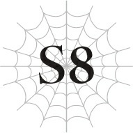

# Chương S8: Làng Elf

Sâu trong dãy núi của vùng Sariella là một hang động ẩn giấu.

Phía sau cùng của hang động là một căn phòng bí mật được ngụy trang sau một ngõ cụt.

Trong căn phòng bí mật thuộc hang động ẩn giấu khá khó tìm này, có một điểm dịch chuyển kết nối với làng Elf.

Nó được giấu kỹ đến mức nếu không có sự dẫn dắt của cô Oka, chúng tôi sẽ không bao giờ tìm ra được.

Ngay cả khi dùng [Thẩm định], tôi cũng không thấy bất kỳ manh mối nào về sự tồn tại của nó, thế nên tôi nghi ngờ rằng sẽ chẳng ai tìm được nơi này nếu không biết chính xác vị trí của nó.

“Tất nhiên, các em phải giữ bí mật về sự tồn tại của nơi này đấy nhé.”

Tất cả chúng tôi đều gật đầu.

Một kết giới mạnh mẽ bảo vệ làng Elf, khiến việc xâm nhập là bất khả thi trừ phi sử dụng một điểm dịch chuyển đặc biệt.

Nói cách khác, đây là một trong số ít những lối vào làng Elf. Nếu vị trí của nó bị lộ, nơi này có thể phải đón tiếp những vị khách không mời mà tới.

Nhiều khả năng, không một ai ngoài tộc Elf và những người thân tín của họ được phép biết về nơi này.

Có lẽ cô Oka cũng không được phép chỉ cho chúng tôi biết nó ở đâu.

Việc cô đưa chúng tôi đến đây dường như là bằng chứng cho thấy cô tin tưởng tất cả chúng tôi sâu sắc, nhưng lời cảnh báo của Katia vẫn vất vưởng trong tâm trí tôi.

Katia đã nói rằng chúng tôi không nên tin tưởng cô Oka quá mức.

Nhưng ít nhất dưới góc nhìn của tôi, cô ấy chắc chắn có vẻ tin tưởng chúng tôi.

Thật lòng mà nói, tôi không biết phải làm sao nữa.

Hiện tại, tôi vẫn đang ở trong trạng thái nước đôi, vừa tin tưởng cô giáo của mình nhưng đồng thời cũng ôm một chút hoài nghi.

“Nào, chúng ta đi thôi.”

Cô Oka kích hoạt điểm dịch chuyển.

--- PAGE BREAK ---

Ánh sáng ngập tràn căn phòng và bao trùm lấy tất cả chúng tôi, tầm nhìn của tôi bị bẻ cong trong thoáng chốc.

Khi mọi thứ trở lại bình thường, chúng tôi không còn ở trong hang động nữa.

Thay vào đó, cả nhóm đang ở trong một tòa nhà hình tròn.

Có vài vòng tròn dịch chuyển trên sàn nhà, giống như cái chúng tôi vừa sử dụng.

Tuy nhiên, chi tiết về tòa nhà này không quan trọng vào lúc này.

Bởi vì ngay khi vừa đến nơi, chúng tôi đã bị kiếm chỉ thẳng vào người.

Vài Elf đang chĩa mũi kiếm về phía chúng tôi.

“Xin hãy khoan đã! Tôi là người đưa họ đến đây!”

Cô Oka đứng chắn giữa chúng tôi và các Elf, những kẻ trông như sẵn sàng lao vào tấn công bất cứ lúc nào.

Thay vì ngôn ngữ loài người, cô Oka đang nói bằng ngôn ngữ của tộc Elf.

Chúng tôi từng học nó ở học viện, nên tôi ít nhiều có thể hiểu được.

Tuy nhiên, tôi chỉ có thể nói chậm rãi và bằng những cụm từ ngắn. Tôi nghi ngờ rằng mình sẽ không thể chen ngang vào một tình huống khẩn cấp như thế này.

“Tên?”

“Filimõs Harrifenas.”

Người đàn ông có vẻ là đội trưởng cộc lốc hỏi cô Oka.

“Con gái của tộc trưởng… Và tại sao cô lại đưa loài người đến đây?”

“Họ là những người tái sinh và là đồng đội của Anh hùng. Quân đội của Đế quốc hiện đang trên đường tới đây. Tôi đưa họ đến để giúp chúng ta chiến đấu.”

Lời giải thích của cô Oka dường như đã xoa dịu người đàn ông kia, nhưng anh ta vẫn không hạ kiếm xuống.

“Tôi hiểu rồi. Tuy nhiên, chúng tôi không thể cho phép loài người vào làng. Nếu họ muốn tham gia chiến đấu với tư cách là đồng minh của chúng ta, họ có thể chiến đấu bên ngoài kết giới.”

“Họ sẽ không làm chuyện đó đâu. Những người này là khách của tôi. Tôi sẽ không để họ bị đẩy ra ngoài nguy hiểm.”

“Con gái tộc trưởng. Tôi sẽ không lặp lại lần thứ hai đâu. Trục xuất họ qua điểm dịch chuyển ngay lập tức.”

Cô Oka và người đàn ông kia có vẻ đang đối đầu trực diện.

Rõ ràng, tộc Elf còn bài ngoại hơn tôi tưởng nhiều.

Cứ đà này, họ chắc chắn sẽ không cho chúng tôi vào làng.

“Lùi lại đi được chứ?”

Ngay khi bầu không khí căng thẳng tưởng như sắp bùng nổ, giọng của một người đàn ông vang lên từ phía lối vào.

--- PAGE BREAK ---

Ngay khi nhìn thấy người vừa lên tiếng, tất cả chúng tôi đều đông cứng lại.

“Ngài Potimas?”

Chỉ mình cô Oka thì thầm tên của người đàn ông kia với vẻ không tin vào mắt mình.

Thật vậy, người đang đứng trước mặt chúng tôi chính là Potimas, tộc trưởng của tộc Elf, kẻ dường như đã bị Sophia giết chết.

“Đúng vậy. Con đã quên mặt của cha mình rồi sao?”

Mặc dù lời nói có vẻ như đang đùa giỡn, nhưng gương mặt của Potimas lại cực kỳ nghiêm túc.

Nhưng cô Oka, anh Hyrince và tôi đều đã tận mắt chứng kiến ông ta chết.

Chúng tôi đã thấy Sophia ném cái đầu vừa mới bị chém lìa của ông ta xuống đất ngay trước mắt mình.

Cảnh tượng kinh hoàng đó chắc chắn không giống như là giả hay ảo ảnh.

“Con cứ nghĩ cha đã chết rồi chứ?”

“Muốn giết ta thì cần nhiều hơn thế đấy. Hạ kiếm xuống.”

Ông ta hướng về phía những người lính để ra lệnh.

Các binh sĩ trung thành tuân lệnh, hạ kiếm xuống và lùi lại một bước.

“Vậy thì. Chào mừng các người đến với làng của tộc Elf.”

Bất chấp những lời nói đó, vẻ mặt của ông ta trông chẳng có chút gì là hiếu khách cả.

Thành thật mà nói, tôi khá là cảnh giác với ông ta.

Một phần là vì sự kỳ quái khi một người mà tôi nghĩ đã chết đột nhiên xuất hiện ngay trước mắt, nhưng còn có điều gì đó ở ông ta rất kỳ lạ và đáng nghi theo cách mà tôi không thể gọi tên rõ ràng.

Hơn nữa, bất kỳ ai đột ngột [Thẩm định] người mà họ vừa mới gặp lần đầu đều có vẻ như đang coi thường người khác.

Đây là lần thứ hai tôi gặp người đàn ông này.

Lần đầu tiên là trước khi tôi vào học viện, khi ông ta xuất hiện để hộ tống cô Oka.

Thái độ của ông ta lúc đó cũng vô cùng tệ hại. Ông ta tự giới thiệu bản thân và cô Oka, rồi rời đi mà không thèm đợi câu trả lời từ tôi.

Khi ông ta nói, một cảm giác kỳ lạ đã bao trùm lấy tôi, nhưng lúc đó tôi chỉ cho rằng đó là phản ứng cơ thể do thái độ của ông ta khiến tôi cảm thấy không thoải mái mà thôi.

Sau đó, Katia đã nhận diện cảm giác kỳ lạ đó chính là sự khó chịu xảy ra khi có ai đó [Thẩm định] bạn.

[Thẩm định] người khác mà không có sự đồng ý của họ được coi là một hành vi cực kỳ vô lễ và vi phạm chuẩn mực xã giao.

Cộng thêm thái độ trịch thượng đó, rõ ràng ông ta không hề coi trọng chúng tôi.

--- PAGE BREAK ---

Giống như thể ông ta không thừa nhận chúng tôi là con người vậy.

Ngay cả bây giờ, ông ta có vẻ xem chúng tôi như những công cụ chiến tranh hơn là khách khứa, vì thế ánh nhìn của ông ta khiến tôi vô cùng khó chịu.

“Đi thôi. Ta sẽ chuẩn bị một buổi đón tiếp đạm bạc cho các người.”

Với những lời ngắn ngủi đó, Potimas quay lưng bước ra khỏi phòng.

Chúng tôi vội vã đi theo sau ông ta.

“Làm thế nào mà cha sống sót được vậy?”

Cô Oka hỏi câu hỏi mà tôi cũng đang thắc mắc.

“Có rất nhiều cách để tránh cái chết.”

Đây hầu như không thể coi là một câu trả lời.

Trong khoảnh khắc, tôi đã nghĩ đến việc [Thẩm định] ông ta ngay tại chỗ như một đòn trả đũa cho lần đầu tiên chúng tôi gặp mặt, nhưng việc khiến ông ta ghét mình trong tình cảnh này có vẻ không phải là một ý kiến hay.

“Còn quân đội Đế quốc thì sao ạ?”

“Chúng vẫn chưa đến được rìa ngoài của kết giới. Hiện tại, chúng đang hành quân xuyên qua khu rừng.”

Vừa nói, Potimas vừa bước ra ngoài tòa nhà.

Đi theo sau ông ta, cả nhóm chúng tôi đều không thốt nên lời khi nhìn thấy cảnh sắc bên ngoài.

Xung quanh chúng tôi là một khu rừng được cấu thành từ những cái cây khổng lồ đến mức tuổi đời của chúng có khi phải hơn ngàn năm.

Phần rễ của những cái cây khổng lồ này được đục đẽo để tạo thành những ngôi nhà.

Nhìn lại tòa nhà chúng tôi vừa rời khỏi, tôi nhận ra nó thực chất cũng là một cái cây khổng lồ.

Làng Elf không đơn thuần chỉ là một nhóm các ngôi nhà dựng trong rừng. Nó được xây dựng ngay bên trong chính những cái cây đó.

“Oa,” Katia vô thức thốt lên.

Cảm giác như thể chúng tôi đang bước chân vào thế giới của một câu chuyện cổ tích vậy.

Tuy nhiên, vô số ánh mắt lập tức lườm nguýt chúng tôi, kéo chúng tôi trở lại thực tại.

Từ trên các cành cây và trong bóng râm của những thân cây lớn, các Elf đang quan sát chúng tôi rất kỹ.

Tôi có thể cảm nhận rõ sự cảnh giác và ghê tởm trong ánh mắt của họ.

Nó như một lời nhắc nhở mới mẻ rằng chúng tôi không hề được chào đón ở đây, như thể đống kiếm chĩa vào chúng tôi lúc vừa đến vẫn chưa đủ vậy.

Lo lắng, tôi quay lại nhìn Anna.

--- PAGE BREAK ---

Đối với tôi, sự đón tiếp này cùng lắm chỉ hơi khó chịu một chút. Nhưng đối với Anna, một bán Elf, nơi này lại tràn ngập những ký ức đau buồn.

Việc bị nhìn chằm chằm đầy ác ý như thế này có thể dễ dàng khơi dậy những vết thương lòng trong cô.

Anna đang cố gắng tỏ ra cứng cỏi, nhưng đôi bàn tay cô lại đang run rẩy nhẹ.

Tôi tiến sát lại gần cô hơn, cố gắng che chở cô khỏi những ánh nhìn sắc lẹm đó.

Potimas rảo bước nhanh về phía trước, không thèm để ý đến chúng tôi.

Khi chúng tôi đi theo ông ta, cô Oka gặng hỏi về tình hình hiện tại.

“Cha có biết quân đội Đế quốc đông bao nhiêu không?”

“Khoảng tám vạn.”

Con số này khiến tôi vô cùng ngạc nhiên.

Gửi đi một đội quân lớn như vậy ngay giữa cuộc chiến giữa nhân loại và ma tộc liệu có thực sự an toàn không?

Không, chắc chắn là không rồi.

Vậy mà, đội quân đó đã lên đường và đang hành quân.

Nếu ma tộc biết được tin tức này, tôi nghi ngờ họ sẽ không bỏ qua cơ hội ngàn năm có một đó.

Tình hình này thậm chí còn tai hại hơn tôi tưởng.

“Rắc rối là ở chỗ Giáo hội đã cung cấp một lượng binh sĩ đáng kể cho họ. Việc họ công bố một Anh hùng giả mạo như Hugo cho thấy họ đang cấu kết chặt chẽ với Đế quốc.”

Nếu quân đội của Thần Ngôn Giáo đã bắt tay với Đế quốc, điều đó hẳn có nghĩa là Hugo hiện đã nắm chặt Giáo hội trong lòng bàn tay.

Rất có thể Yuri, người bị tẩy não, cũng đang đi cùng cậu ta.

“Nếu cuộc hành quân của chúng diễn ra suôn sẻ, cha nghĩ bao lâu nữa chúng sẽ tới nơi?”

“Ta đoán là ba ngày. Nếu chúng bị tấn công bởi những quái vật mạnh mẽ hay thứ gì tương tự thì lại là chuyện khác, nhưng tiếc là may mắn dường như đang đứng về phía chúng.”

Tôi nghiêng đầu thắc mắc trước lời phát biểu kỳ lạ của Potimas.

“Con quái vật cấp Huyền thoại đã đe dọa ngôi làng của chúng ta suốt nhiều năm qua, Taratect Nữ Vương, đang di chuyển. Do đó, tất cả những quái vật khác trong khu vực đều đã chạy trốn. Quân đội Đế quốc có lẽ sẽ gặp rất ít quái vật, nếu có, trên đường đi của chúng.”

Lại một Taratect Nữ Vương khác sao?

Người ta nói Taratect Nữ Vương sống ở Mê cung Lớn Elroe, nhưng trên thế giới còn có bốn con khác nữa.

Nghe có vẻ như một trong số đó sống ngay tại khu rừng nơi tộc Elf dựng nhà.

--- PAGE BREAK ---

Làng Elf nằm ở trung tâm của một khu rừng rộng lớn gọi là Rừng Lớn Garam.

Theo cô Oka, ngôi làng và kết giới bảo vệ nó có diện tích tương đương với các quận đặc biệt của Tokyo.

Và khu rừng, vì nó đủ lớn để che giấu ngôi làng ở trung tâm, dễ dàng có diện tích bằng tỉnh Hokkaido.

Có rất nhiều quái vật trong khu rừng lớn này, và Taratect Nữ Vương ngự trị với tư cách là loài mạnh nhất trong tất cả.

Không may là, vì Taratect Nữ Vương đã di chuyển và xua đuổi tất cả quái vật ở gần, điều này lại có lợi cho quân đội của Đế quốc.

Nếu Taratect Nữ Vương ở lại và chạm trán với quân đội Đế quốc, điều đó sẽ thuận lợi hơn nhiều cho tộc Elf.

Về phần tôi, tôi vừa tiếc nuối lại vừa nhẹ nhõm.

Chúng tôi đã thoáng thấy sức mạnh đáng sợ của Taratect Nữ Vương trên đường tới đây.

Khi chúng tôi rời khỏi Mê cung Lớn Elroe, tôi đã nhìn xuống và thấy nơi một con Taratect Nữ Vương từng phá vây thoát ra ngoài và điên cuồng tàn phá.

Sự tàn phá khủng khiếp đến mức nó đã thay đổi hoàn toàn cảnh quan địa hình mãi mãi.

Nếu thứ đó đụng độ với quân đội Đế quốc, họ nhiều khả năng sẽ phải chịu những thương vong thảm khốc.

Tộc Elf sẽ giành chiến thắng mà không cần phải chiến đấu chút nào.

Nhưng điều đó cũng đồng nghĩa với việc những người lính chỉ đang bị Hugo lợi dụng sẽ bị giết hàng loạt.

Thậm chí có thể có cả những người bị tẩy não trong số đó, giống như Yuri.

Khi nghĩ theo cách đó, tôi gần như cảm thấy vui mừng với kết quả này.

Tôi biết suy nghĩ đó ngây thơ đến nhường nào.

Nếu chúng tôi thực sự phải chiến đấu, đó sẽ là trận chiến một mất một còn, ngay cả khi những người lính kia có vô tội đi chăng nữa.

Nhưng một phần nào đó trong tôi vẫn không thể ngừng hy vọng rằng chỉ cần chúng tôi giải quyết được Hugo, mọi chuyện khác rồi sẽ ổn thỏa bằng cách nào đó.

Ít nhất, tôi có thể cứu những người bạn bị tẩy não của mình khỏi tay cậu ta.

Thậm chí ngoài Sue và Yuri ra, có thể vẫn còn những người khác đã bị tẩy não mà tôi không hề hay biết.

--- PAGE BREAK ---

Vừa suy nghĩ, tay tôi vừa tự động siết chặt thành nắm đấm.

“Đến nơi rồi.”

Potimas đi vào một ngôi nhà được xây dựng bên trong một trong những cái cây khổng lồ, cắt ngang cuộc trò chuyện.

Bên trong ngôi nhà là một chiếc bàn tròn lớn, tạo thành một dạng phòng hội nghị.

Ngay khi chúng tôi ngồi xuống theo hướng dẫn, các nhân viên phục vụ là người Elf bưng thức ăn lên bàn.

“Đây là các món ăn của tộc Elf, nhưng chúng cũng nên phù hợp với khẩu vị của loài người.”

Nghe lời Potimas, tôi cắn một miếng thức ăn.

Nó được nêm nếm thanh đạm và chủ yếu là rau củ, nhưng điều đó chỉ tổ tôn lên chất lượng tuyệt hảo của các nguyên liệu.

Thực ra, nó rất ngon.

Vì đã kiệt sức sau cuộc hành trình dài, cả nhóm chúng tôi đều cắm cúi ăn uống trong im lặng.

“Có vẻ các người đã thưởng thức nó một cách ngon miệng. Tốt.”

Thấy chúng tôi đã ăn xong, Potimas lại lên tiếng.

“Chúng ta đã chuẩn bị nơi ở cho các người. Ta sẽ đảm bảo các người có thể sinh hoạt ở đó cho đến khi quân đội Đế quốc tới.”

Họ có vẻ chuẩn bị rất chu đáo.

Gần như thể ông ta đã biết trước chúng tôi sẽ đến vậy.

Tôi cho là nhiều khả năng ông ta biết thật.

Tôi không biết ông ta lấy thông tin đó từ đâu, nhưng đó là lời giải thích hợp lý duy nhất.

Nếu không, làm sao họ có thể chuẩn bị chỗ ở và lượng thức ăn vừa vặn cho loài người với thời gian căn khớp hoàn hảo đến thế?

Ấy vậy mà, chúng tôi lại bị chào đón một cách gay gắt khi vừa mới đặt chân tới.

Là do thông tin chưa kịp truyền đến những người gác điểm dịch chuyển, hay tất cả chỉ là một màn kịch?

Dù là thế nào đi nữa, tôi cũng không thể đoán biết được ý đồ của Potimas.

Tất cả những gì tôi biết là ông ta trông cực kỳ khả nghi.

Có lẽ đó là lý do tại sao tôi không thể không nghi ngờ đề xuất tiếp theo của Potimas.

“Ngoài ra, ta tin rằng các người cũng muốn gặp những người tái sinh khác đúng không? Giờ đã muộn rồi. Ta sẽ sắp xếp để các người gặp họ vào ngày mai.”
