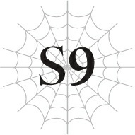

# Chương S9: Những người tái sinh trong làng Elf

Ngày hôm sau khi chúng tôi đặt chân đến làng Elf, cô Oka dẫn Katia, Fei và tôi đến một địa điểm nọ.

Thành thật mà nói, tôi thực sự không muốn để Anna lại một mình chút nào khi cô ấy đang phải chịu đựng những tổn thương tinh thần khủng khiếp liên quan đến nơi này.

Tuy nhiên, xem xét nơi sắp tới, chúng tôi nghĩ tốt nhất chỉ nên có những người tái sinh đi cùng nhau.

Khi tôi giải thích mọi chuyện với anh Hyrince, anh ấy tràn đầy tự tin bảo tôi cứ yên tâm tin tưởng vào anh ấy, thế nên chúng tôi đã để cô Anna và anh ấy ở lại.

Điểm đến của chúng tôi là một khu vực bảo hộ đặc biệt.

Nơi những người tái sinh được nuôi dưỡng để bảo vệ họ.

“Cô Okaaa ơi, sắp đến nơi chưa ạ?”

Fei than vãn.

Tôi nghĩ chúng tôi đã đi bộ một quãng đường khá dài.

Với các chỉ số cao ngất ngưởng của Fei, tôi không nghĩ cô ấy thực sự bị mệt đâu. Nhưng chẳng ai trong chúng tôi ngờ được nó lại xa đến thế. Tôi cũng không thể trách cô ấy khi cảm thấy hơi chán.

“Còn một chút nữa thôi. Làng Elf khá rộng lớn đấy. Các em chịu khó kiên nhẫn một chút nhé.”

Thẳng thắn mà nói, nó rộng đến mức tôi không biết liệu có nên gọi đây là một "ngôi làng" nữa hay không.

Nhưng tôi nghĩ điều đó cũng hợp lý khi biết rằng hầu hết dân số của cả một chủng tộc đều tập trung ở nơi này.

Nó đồ sộ đến nỗi phải mất cả ngày trời mới đi được từ đầu này sang đầu kia.

Nghĩ theo cách đó, khoảng cách đến khu vực của những người tái sinh thậm chí có vẻ vẫn còn ngắn chán.

--- PAGE BREAK ---

“Dù vậy, tớ vẫn không thể tin nổi là có một kết giới đủ lớn để bao phủ toàn bộ nơi này đấy. Chắc chắn phải cần đến ma pháp phi thường lắm.”

“Đúng vậy. Nhờ có kết giới này mà làng Elf chưa bao giờ bị tấn công cả.”

“Chính xác thì nó hoạt động thế nào ạ?”

“Cô xin lỗi. Bản thân cô cũng không biết nhiều về nó lắm.”

Thường thì tôi sẽ nghĩ cô Oka phải biết những chuyện này, nhưng có lẽ đây là vấn đề an ninh quốc gia.

“Những gì cô biết là nó mạnh đến mức ngay cả đòn tấn công của một Taratect Nữ Vương cũng không thể lay chuyển nổi. Trong lịch sử lâu dài của tộc Elf, kết giới này chưa từng bị phá vỡ một lần nào.”

Nó có thể chống đỡ một đòn trực diện từ Taratect Nữ Vương?

Điều đó khiến tôi ngạc nhiên, nhưng ngẫm lại thì cũng hợp lý.

Taratect Nữ Vương là quái vật thuộc cấp độ mạnh nhất.

Khi một con xuất hiện trong trận chiến giữa con người và ma tộc cách đây không lâu, nó đã giẫm đạp cả hai bên một cách vô phân biệt.

Và sức tàn phá của Taratect Nữ Vương đã vĩnh viễn thay đổi địa hình xung quanh lối ra của Mê cung Lớn Elroe đó.

Nếu một con quái vật tương tự sinh sống ở Rừng Lớn Garam, thì việc kết giới phải đủ mạnh để ngăn chặn nó là hoàn toàn hợp lý.

Nếu không, lịch sử của tộc Elf có lẽ đã chấm dứt từ lâu rồi.

“Xét việc có tuổi thọ cao như vậy, tộc Elf hẳn phải có một lịch sử khá lâu đời nhỉ? Chính xác thì nó kéo dài từ bao giờ thế ạ?”

“Cô cũng không rõ nữa. Nhưng theo những gì cô nghe được từ ông nội mình, người lớn tuổi nhất làng hiện đã năm trăm tuổi, thì kết giới này đã tồn tại từ thời ông nội của ông ấy rồi.”

“Oa, thật kinh ngạc.”

Tôi không thể tưởng tượng nổi việc sống qua ngần ấy trang lịch sử.

Trên thực tế, phần lớn lịch sử của thế giới này đã bị thất truyền.

Một phần là do sách vở thường bị hủy hoại trong các cuộc chiến liên miên giữa con người, và không giống như ở Trái Đất, giấy ở đây phân hủy rất nhanh.

Vì việc bảo quản sách rất khó khăn, lịch sử mà chúng tôi biết được chỉ là suy đoán từ số ít tài liệu còn sót lại hoặc được truyền miệng.

Và thật khó mà nói được bao nhiêu phần trăm trong số đó là sự thật, vì nhiều tài liệu có vẻ chứa đầy những câu chuyện hư cấu và cổ tích thần thoại.

--- PAGE BREAK ---

Trong trường hợp đó, tộc Elf có tuổi thọ cao có thể là những nhân chứng sống quan trọng của lịch sử.

Tuy nhiên, vì tộc Elf sống quá khép kín với phần còn lại của thế giới, hầu hết họ có lẽ chưa bao giờ bước chân ra khỏi làng Elf, nghĩa là họ có thể không biết nhiều về lịch sử của loài người.

“Cô có nghĩ Hugo bằng cách nào đó sẽ vượt qua được kết giới không?”

Kết giới đó đã bảo vệ làng Elf trong suốt một thời gian dài, đến mức nó giống như một phần của lịch sử vậy.

Hugo thực sự nghĩ rằng hắn có thể phá vỡ một thứ mạnh mẽ đến vậy sao?

Hắn biết điều gì đó mà chúng tôi không biết chăng?

“Cô không chắc nữa. Tuy nhiên, chỉ vì nó chưa từng bị phá vỡ trước đây không có nghĩa là chuyện đó bất khả thi. Chúng ta không được quá ỷ lại vào nó.”

Nghe giọng điệu thì có vẻ cô Oka đang mặc định rằng kết giới có thể bị phá vỡ.

Điều đó cho tôi ấn tượng rằng Hugo biết cách nào đó để phá giải nó.

Và cô Oka chắc chắn cũng biết chuyện đó.

Nếu không, cô đã chẳng bắt chúng tôi phải trải qua một hành trình nguy hiểm vượt Mê cung Lớn Elroe để đến bảo vệ ngôi làng này.

Chắc chắn không phải nếu cô nghĩ kết giới này là bất khả xâm phạm.

Tôi lại nhớ đến lời cảnh báo của Katia.

Cô Oka vẫn đang giấu giếm điều gì đó.

Đến nước này, tôi nghĩ Katia có lẽ đã đúng.

Rõ ràng có một ranh giới nào đó giữa những gì cô nói cho chúng tôi biết và những gì cô giữ lại cho riêng mình.

“Từ những gì cô kể, thật khó tưởng tượng nổi có con người nào phá vỡ được kết giới như thế. Cô có tin là Hugo sở hữu loại vũ khí bí mật nào đó không?”

Katia sắc sảo xen vào.

Dĩ nhiên rồi. Nếu tôi đã thấy rõ như vậy, thì đối với Katia nó còn rõ ràng gấp bội.

“Một lần nữa, cô cũng không biết. Tuy nhiên, hắn chắc chắn biết rằng có một kết giới bao quanh làng Elf. Chắc chắn ngay cả Hugo cũng không dẫn một đội quân lớn như thế đến đây nếu hắn không tự tin có thể phá vỡ kết giới. Cô nghi ngờ hắn hẳn đang có phương pháp nào đó trong đầu, dù việc nó có thực sự hiệu quả hay không lại là chuyện khác.”

Phân tích của cô rõ ràng là hợp lý.

Tôi không tìm thấy một kẽ hở nào trong lập luận đó.

Dù vậy, thế vẫn chưa đủ để xua tan hoàn toàn những nghi ngờ trong tôi.

--- PAGE BREAK ---

Katia cũng khẽ nheo mắt lại trong lúc cô Oka không chú ý.

Fei im lặng, không thể bắt kịp bầu không khí căng thẳng đang ẩn hiện giữa những câu đối thoại.

Tôi cũng giữ im lặng, sợ rằng nếu nói thêm gì nữa sẽ làm hỏng chuyện.

“A, đến nơi rồi!”

May mắn thay, ngay khi bầu không khí im lặng ngượng ngùng bắt đầu bao trùm, điểm đến của chúng tôi đã xuất hiện trong tầm mắt.

Tôi thầm thở phào nhẹ nhõm.

Mấy kiểu đấu trí đấu dũng này thực sự không phải sở trường của tôi.

Thay vì rậm rạp cây cối như phần còn lại của khu rừng, khu vực cô Oka chỉ vào lại là một khoảng sân sáng sủa được phát quang.

Ở hầu hết những nơi khác trong rừng, những tán lá và cành cây khổng lồ luôn che khuất cả bầu trời.

Nhưng riêng tại vùng này, thay thế cho cây cối, tất cả những gì đang sinh trưởng lại là rau củ.

Đó là một trang trại.

Đang làm việc trên cánh đồng là một vài cậu bé và cô bé, trạc tuổi chúng tôi.

Ở đó dường như còn nuôi cả gia súc, và có thêm vài người khác nữa đang chăm sóc chúng.

Nhận ra chúng tôi, một trong những cô gái dừng tay và bước lại gần.

“Cô Oka mừng cô đã trở lại.”

“Cảm ơn em.”

Cả hai trao nhau lời chào bằng tiếng Nhật.

Cô gái này thực sự là một người tái sinh.

Nhưng dù việc nghe thấy tiếng Nhật lẽ ra phải sưởi ấm lòng tôi, không hiểu sao bầu không khí xung quanh lại phảng phất một chút lạnh lẽo.

Lời chào của cô gái đó vô cùng cộc lốc.

Và nét mặt của cô Oka dường như cũng khá gượng gạo.

“Sao thế? Ba người này là nạn nhân mới à?”

Câu hỏi của cô gái càng làm bầu không khí trở nên lạnh lẽo hơn nữa.

“Nạn nhân? Dĩ nhiên là không phải rồi.”

“À, đó là ý kiến của cô thôi. Từ góc nhìn của tôi thì cô chắc chắn là kẻ xấu rồi... Nhưng thôi sao cũng được. Ba cậu kia, tên là gì thế? Ý tôi là tên kiếp trước ấy, không phải kiếp này.”

Lạnh lùng gạt phắt cô Oka sang một bên, cô gái quay sang phía chúng tôi.

Cậu ấy nhìn Katia và tôi, rồi chuyển sang vẻ mặt nghi ngờ khi thấy Fei.

“Tớ là Yamada Shunsuke.”

“Còn tớ là Ooshima Kanata.”

--- PAGE BREAK ---

“Tớ là Shinohara Mirei, cứ như là cậu không biết rồi ấy.”

“Hả?”

Cậu ấy nhíu mày, nhưng tôi không biết đó là vì Katia giờ đã là con gái, hay vì vẻ ngoài của Fei giống hệt ngày xưa.

“Khoan đã. Ooshima?”

“Đúng vậy.”

“Chà...”

Phản ứng của cậu ấy có vẻ là vô thức.

“Này nhé! Phản ứng kiểu gì thế hả?!”

“Cậu nói đúng, xin lỗi nhé. Tớ chỉ hơi ngạc nhiên thôi.”

“Rồi, giờ cậu đã biết bọn tớ là ai rồi, không định tự giới thiệu bản thân luôn sao?”

Trong khi Katia hơi dỗi, Fei khẽ nheo mắt xen vào.

“Cứ như là tớ không đoán ra từ cái thái độ đó vậy.”

“Cũng đúng. Hỏi tên người khác mà không xưng tên mình thì bất lịch sự quá nhỉ? Xin lỗi nhé. Tớ là Kudo Sachi.”

“Biết ngay mà.”

Fei thở dài có vẻ bực bội.

Kudo Sachi.

Cô bạn lớp trưởng của chúng tôi.

Chúng tôi không thân nhau lắm, nhưng cậu ấy rất nổi bật trong lớp vì tính tình bộc trực.

Vì cậu ấy cực kỳ nghiêm khắc về các nội quy, nên cũng có không ít kẻ thù.

Và vì kiếp trước Fei thường bày ra đủ thứ rắc rối, nên hai người họ cãi nhau như cơm bữa.

“Sao cậu trông giống hệt ngày xưa thế, Shinohara?”

Rõ ràng là Kudo đã nhận ra Fei trông rất giống kiếp trước của mình.

Đã qua một thời gian dài như vậy, nếu có ai đó quên mặt nhau thì cũng không lạ, nhưng có vẻ cậu ấy vẫn nhớ như in kẻ địch cũ.

“À, cậu biết đấy. Tớ đoán là ngay cả cái chết cũng không dìm hàng nổi nhan sắc của tớ đâu.”

“Làm ơn trả lời nghiêm túc hộ cái.”

Lời nói dối một trăm phần trăm của Fei càng lộ liễu hơn nhờ cái tạo dáng ngớ ngẩn đi kèm.

--- PAGE BREAK ---

Kudo lập tức dập tắt ngay.

Đúng là một màn đối đáp đầy hoài niệm.

“Nói nghiêm túc thì tớ cũng chả biết tại sao tớ lại trông thế này đâu, được chưa?”

Fei vẫn không chịu bỏ cái giọng đùa cợt, còn Kudo thì tiếp tục lườm cô đầy nghi ngờ.

“Mirei?”

“Hả? Đúng là cậu thật à?”

Một vài người khác nhận ra sự xuất hiện của chúng tôi, họ bỏ dở công việc và chạy đến chỗ Kudo để vây quanh bọn tôi.

Hai người trong số họ nhận ra vẻ ngoài của Fei và gọi cô.

“Hửm? Khoan đã, có phải Ai và Himi không?”

“Đoán chuẩn rồi!”

“Trời đất ơi, đúng là cậu rồi sao, Mirei?! Ôi, lâu quá rồi mới gặp!”

Gặp lại bạn cũ, mấy cô gái nhảy cẫng lên vì phấn khích.

Kiếp trước Fei là trung tâm của một nhóm nữ sinh nổi bật và có rất nhiều bạn bè.

Đã hơn mười năm trôi qua, vậy mà họ lập tức túm tụm lại và trò chuyện ríu rít như thể đó là điều tự nhiên nhất trên đời.

Thú thật, tôi nghĩ khả năng ngoại giao cỡ đó đúng là đáng nể thật.

“Dù sao thì chúng ta cũng đừng đứng ngoài này nữa. Mọi người ơi, hôm nay tạm nghỉ tay đi, vào trong nhà thôi.”

Kudo nói nửa câu đầu với chúng tôi, nửa câu sau với tất cả những người còn lại.

“Cô cũng vào chứ, cô Oka? Dù rằng ở đây chẳng ai chào đón cô đâu.”

Tôi không khỏi cảm thấy nhói lòng trước những lời cay nghiệt đó.

Ngay từ đầu đã thấy rõ là Kudo vô cùng ghét cô Oka, nhưng tôi không thể hiểu nổi tại sao thái độ cự tuyệt của cậu ấy lại gay gắt đến vậy.

Vì là lớp trưởng ở kiếp trước, Kudo từng làm việc nhiều với cô Oka, và tôi nhớ là họ khá thân thiết.

Hẳn là đã có chuyện gì đó xảy ra giữa họ ở thế giới này tạo nên một vết nứt lớn đến vậy.

Trong khi tôi còn đang phân vân lưỡng lự, Katia bình tĩnh quan sát toàn bộ cục diện, còn Fei thì nhìn thẳng vào cô Oka.

“Được rồi... cô hiểu. Vậy cô không làm phiền buổi hội ngộ của các em nữa, cô xin phép đi trước.”

Nói rồi, cô Oka nhanh chóng quay đi.

--- PAGE BREAK ---

Biểu cảm của cô trông như đang gượng cười để ngăn nước mắt rơi.

“Đi thôi.”

Phớt lờ cô giáo, Kudo bắt đầu bước đi.

Nhìn quanh, tôi thấy một vài bạn học khác đang nhìn cô Oka với biểu cảm rất phức tạp.

Nhưng chẳng một ai có ý định gọi cô lại.

Khi chúng tôi bắt đầu đi theo hướng ngược lại, tôi liếc nhìn bóng lưng cô Oka đang dần xa.

Tôi chưa bao giờ thấy cô trông nhỏ bé đến thế.

---

[◀ Chương trước: Chương 9: Nhện nước](09_water_spider.md) | [Chương tiếp theo: Chương 10: Chơi đùa với búp bê ▶](10_playing_with_dolls.md)
