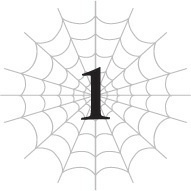

# Chương 1: Nhện và Ma cà rồng
*(The Spider and the Vampire)*

---

### --- TRANG 11 ---

Tôi nhớ về một lớp học cấp ba bình thường đến mức đáng kinh ngạc.

Rồi tôi nhớ lại khuôn mặt của từng học sinh ở đó.

Shouko Negishi...

Hừm. Hừửửm.

Ừmmm, tôi chịu, chẳng nhớ nổi cô nàng đó là ai.

Ý tôi là, tôi có thể nhớ mặt tất cả bạn học, ít nhiều là thế.

Nhưng mặt và tên của cô nàng này chẳng ăn nhập gì với nhau cả, hay đúng hơn là ngay từ đầu cái tên này nghe lạ hoắc lạ huơ.

Mà nói đi cũng phải nói lại, tôi chưa từng là kiểu người dành nhiều sự quan tâm cho những người xung quanh.

Tôi không thể ghép nổi cái tên nào vào khuôn mặt của phần lớn bạn học cả.

Mà tôi cũng chẳng cần phải làm vậy làm gì, vì tôi có bao giờ nói chuyện với họ đâu.

Thỉnh thoảng họ cũng cố bắt chuyện với tôi, nhưng khi tôi đông cứng người vì quá đỗi ngạc nhiên, họ lại đỏ bừng mặt lên, nổi giận đùng đùng rồi bỏ đi.

Bỗng dưng bắt chuyện với một kẻ lạc loài như tôi là sai lầm rồi nhé.

Chúng tôi sẽ đứng hình ngay lập tức vì không biết phải phản ứng thế nào đâu.

Mà thôi, dù cuộc đối thoại đó không đột ngột đi nữa, có lẽ tôi cũng sẽ hành xử y hệt thôi — nhưng mà vẫn tức chứ!

À, tôi nhớ được tên của cái tên chuyên làm phiền mình, nhưng chỉ thế mà thôi.

Còn Shouko Negishi thì chắc chắn là không biết rồi.

Nếu có cách nào để kiểm tra khuôn mặt gốc của cô nàng trông như thế nào, chắc tôi sẽ nhớ ra thôi, nhưng hiện tại rõ ràng là cô nàng trông đã hoàn toàn khác.

Ngay tại thời điểm này, tất cả những gì tôi có thể thấy là một người phụ nữ đang bế một đứa trẻ sơ sinh.

Xung quanh họ, đám hộ vệ đang canh gác với vẻ mặt đông cứng vì sợ hãi.

--- PAGE BREAK ---

Khoan đã, chuyện này đã xảy ra như thế nào ấy nhỉ?

Tôi đang trên đường chạy trốn khỏi mụ Ma Vương quái dị với đống chỉ số cao đến phi lý thì phát hiện ra một cỗ xe ngựa đang bị bọn cướp tấn công, phải không?

Nếu vờ như không thấy thì chắc sau đó tôi sẽ cảm thấy dằn vặt lắm, thế nên tôi mới đáp xuống một cách cực ngầu và quét sạch bọn cướp.

Tiện tay, tôi còn dùng Ma pháp Trị liệu cứu một hộ vệ bị bọn cướp đánh gục.

Thế rồi vị phu nhân này nhảy ra khỏi cỗ xe.

Và khi tôi Thẩm định đứa trẻ sơ sinh trong tay bà ta, tôi đã nhận được kết quả cực kỳ kỳ quặc.

Thế là chúng tôi kẹt lại ở đây.

Để xem nào, tôi đoán mình nên xem lại kết quả Thẩm định của đứa bé lần nữa...

`<Chủng tộc: Con người ma cà rồng Cấp 1 Tên: Sophia Keren / Shouko Negishi>`

| Chỉ số | Giá trị |
| :--- | :--- |
| **HP** | 11/11 (lục) (chi tiết) |
| **MP** | 35/35 (lam) (chi tiết) |
| **SP (vàng)** | 12/12 (chi tiết) |
| **SP (đỏ)** | 12/12 (chi tiết) |
| **Sức tấn công trung bình** | 9 (chi tiết) |
| **Sức phòng ngự trung bình** | 8 (chi tiết) |
| **Sức ma pháp trung bình** | 32 (chi tiết) |
| **Khả năng kháng tính trung bình** | 33 (chi tiết) |
| **Tốc độ trung bình** | 8 (chi tiết) |

**Kỹ năng:**
[Ma Cà Rồng Cấp 1] [Thân Thể Bất Tử Cấp 1] [Tự hồi phục HP Cấp 1] [Cảm nhận Ma lực Cấp 3] [Thao tác Ma lực Cấp 3] [Dạ Nhãn Cấp 1] [Tăng cường Ngũ quan Cấp 1] [n% I = W]

**Điểm kỹ năng:** 75.000

**Danh hiệu:**
[Ma Cà Rồng] [Chân Tổ]

--- PAGE BREAK ---

Hừm. Đúng vậy, dù nhìn thế nào thì nó vẫn hiển thị hai cái tên!

Và cái tên thứ hai nghe đậm chất Nhật Bản không thể lẫn đi đâu được!

Tôi tuy không biết cụ thể cô nàng này là ai, nhưng đứa trẻ sơ sinh này chắc chắn phải là một trong những bạn học cũ của tôi.

Con bé thậm chí còn sở hữu kỹ năng "n% I = W" nữa, nên không thể sai đi đâu được.

Theo những gì mà vị tà thần tự xưng D đã nói với tôi, tất cả học sinh có mặt trong lớp học cùng tôi ngày hôm đó đều được tái sinh sang thế giới này.

Đã một thời gian khá dài kể từ khi tôi tái sinh thành một con nhện, nhưng đây là lần đầu tiên tôi chạm trán một người tái sinh khác.

Chà, chẳng biết làm gì ngoài việc chấp nhận thực tế thôi.

Ý tôi là, tình cảnh này khá là kỳ lạ, nhưng tôi đoán nó giống như cảm giác vô tình gặp lại một đồng hương người Nhật khi đang đi du lịch nước ngoài vậy.

Trong lớp tôi chẳng thân với ai cả, nên cảm xúc của tôi khi gặp lại bạn học cũng chỉ dừng lại ở mức độ đó thôi.

Các anh còn muốn gì hơn nữa nào? Tôi là kẻ lạc loài mà.

Tạm thời gác chuyện con bé là bạn học tái sinh sang một bên đã.

Bởi vì ngoài chuyện đó ra, ở đây đã có sẵn một đống thứ kỳ lạ cần phải bóc tách rồi.

Đầu tiên là vấn đề chủng tộc của con bé là sao thế kia?

Làm thế nào mà vừa là con người vừa là ma cà rồng được chứ?

Điều này có nghĩa là trước đây con bé từng là người thường nhưng bị hút máu rồi biến thành ma cà rồng hay gì đó à?

Mặc dù tôi cũng không chắc các truyền thuyết về ma cà rồng ở thế giới này có hoạt động giống như trên Trái Đất hay không.

Tạm thời, tôi đoán mình nên dùng Thẩm định để kiếm thêm chút thông tin về chuyện này vậy.

`<Ma cà rồng: Kẻ thống trị màn đêm sống bằng cách hút máu của kẻ khác. Thành viên của chủng tộc này rất mạnh nhưng cũng phải gánh chịu nhiều điểm yếu. Nhiều ma cà rồng ban đầu thuộc về một chủng tộc khác và mang các đặc tính của chủng tộc gốc đó. Những cá thể thuần chủng sinh ra đã là ma cà rồng được gọi là Chân Tổ.>`

À ra vậy.

Tôi đoán ma cà rồng ở thế giới này cũng khá giống với những gì tôi biết.

Nhưng khoan đã.

Nó bảo những cá thể thuần chủng sinh ra đã là ma cà rồng thì được gọi là Chân Tổ đúng không?

Vì rõ ràng con bé có danh hiệu Chân Tổ sờ sờ ra đó, nên là...

Chuyện gì đang xảy ra thế này?

Đứa trẻ này sinh ra đã là ma cà rồng rồi sao?

Thế nghĩa là bố mẹ con bé cũng là ma cà rồng hay sao chứ?

--- PAGE BREAK ---

Nhưng theo Thẩm định, người phụ nữ đang bế đứa bé lại là một con người bình thường.

Tên của vị phu nhân đó là Seras Keren.

Trùng họ với nhóc hút máu kia.

Chỉ cần xâu chuỗi hai điều này lại, chắc chắn vị phu nhân này chính là mẹ của đứa bé rồi.

Mẹ con bé là người thường.

Vậy bố con bé là ma cà rồng sao?

Hay con bé mang hai chủng tộc là vì lai giữa người và ma cà rồng?

Chà, bố con bé có vẻ không đi cùng cỗ xe này, nên tôi chịu chẳng cách nào biết chắc được.

Những người còn lại ở đây cũng đều là con người cả.

Nghĩa là bí ẩn này vẫn chưa được giải quyết triệt để, nhưng nghĩ mãi cũng chẳng ra đâu nên tạm thời tôi cũng dẹp chuyện đó sang một bên luôn.

Điều kỳ lạ tiếp theo trong danh sách: Tại sao con bé lại có nhiều kỹ năng đến vậy?

Nó chỉ là một đứa trẻ sơ sinh, đồng nghĩa với việc còn chưa thể tự cử động được chứ đừng nói đến việc thu thập một đống kỹ năng như thế. Thế là thế quái nào?

Số kỹ năng của con bé còn nhiều hơn cả mấy con quái vật yếu đuối sống trong mê cung nữa đấy!

Lúc mới sinh ra, tôi chỉ có mỗi Nanh Độc, Tơ Nhện, Kháng Độc, Dạ Nhãn, Thần tốc và "n% I = W" thôi!

...Mà nghĩ lại thì, hóa ra lúc mới sinh tôi cũng có khá nhiều kỹ năng đấy chứ.

Nhưng mà vẫn thế thôi! Tôi khởi đầu với sáu kỹ năng, trong khi nhóc hút máu này lại có tận tám.

Chênh lệch hai kỹ năng.

Những hai kỹ năng cơ đấy!

Đó là một khoảng cách siêu lớn luôn, các anh biết không!

Thế này là không công bằng!

Ủa mà khoan đã.

Có phải một vài kỹ năng trong số này là đi kèm với danh hiệu không nhỉ?

Mỗi danh hiệu thường sẽ đi kèm với hai kỹ năng mà.

Thẩm định Danh hiệu, lên!

`<Ma Cà Rồng: Nhận được các kỹ năng [Tự hồi phục HP Cấp 1] [Dạ Nhãn Cấp 1]. Điều kiện nhận: Có kỹ năng [Ma Cà Rồng]. Hiệu quả: Thêm chủng tộc Ma Cà Rồng vào loài của người sở hữu. Giải thích: Danh hiệu trao cho kẻ đã biến thành ma cà rồng.>`

`<Chân Tổ: Nhận được các kỹ năng [Bất Tử Cấp 1] [Tăng cường Ngũ quan Cấp 1].`

--- PAGE BREAK ---

`Điều kiện nhận: Là ma cà rồng từ khi sinh ra. Hiệu quả: Triệt tiêu các tác động tiêu cực của việc làm ma cà rồng. Giải thích: Danh hiệu trao cho một Chân Tổ của loài ma cà rồng.>`

À há. Hóa ra con bé có bốn kỹ năng trong số đó là nhờ danh hiệu của mình.

Nhưng tôi đoán là con bé đã sở hữu cả hai danh hiệu Ma Cà Rồng và Chân Tổ ngay từ lúc mới sinh ra rồi, nên thực chất nó cũng chẳng khác biệt gì mấy.

Mà cả hai đều là những danh hiệu cực kỳ tuyệt vời đấy chứ.

Danh hiệu Ma Cà Rồng đi kèm với kỹ năng Tự hồi phục HP, một kỹ năng siêu tiện lợi.

Nó đã cứu mạng tôi không biết bao nhiêu lần rồi.

Được sở hữu nó từ khi mới lọt lòng thì sướng phải biết. Tôi đố kỵ đến mức muốn nguyền rủa đứa bé này luôn rồi đấy!

Nhưng danh hiệu Chân Tổ thậm chí còn điên rồ hơn.

Ý tôi là, ai lại cho phép triệt tiêu hết mọi điểm yếu của ma cà rồng như thế chứ?

Ma cà rồng trong các câu chuyện luôn có rất nhiều điểm yếu để con người còn có cơ hội đánh bại họ. Nếu loại bỏ hết đống điểm yếu đó đi, chẳng phải chúng ta sẽ có một phản diện hoàn toàn bất bại hay sao?

Nhưng tôi đoán sức mạnh ở thế giới này chủ yếu được quyết định bởi chỉ số, nên dù không có những điểm yếu kia, tôi không nghĩ có ai đó có thể hoàn toàn vô địch.

Dù vậy, một con ma cà rồng không có điểm yếu nghe vẫn thật đáng sợ.

Đầu tiên, hiệu quả đó có lẽ đồng nghĩa với việc con bé không cần phải hút máu để sinh tồn.

Hoặc có lẽ sữa mẹ cũng được tính là một thứ thay thế cho máu chăng?

Đằng nào thì sữa mẹ cũng được tạo ra từ máu của người mẹ cơ mà?

Chà, việc không phải hút máu đã là chuyện lớn rồi, nhưng điều đáng sợ hơn nữa là ánh nắng mặt trời không hề làm tổn thương con bé.

Ngay tại thời điểm này, nhóc hút máu sơ sinh kia đang thản nhiên tắm mình dưới ánh mặt trời mà không có vẻ gì là bận tâm.

Khả năng vô hiệu hóa tất cả các điểm yếu tự nhiên không phải là trò đùa đâu.

Và bên cạnh hiệu ứng danh hiệu cực kỳ ấn tượng đó, bạn còn nhận được hai kỹ năng điên rồ nữa.

`<Thân Thể Bất Tử: Gia tăng kháng tính đối với tất cả các thuộc tính ngoại trừ Hỏa, Quang và Hủ thực. Ngoài ra, mỗi ngày một lần, người sở hữu có thể sống sót sau bất kỳ đòn tấn công nào với 1 HP.>`

Thế nên ngoài việc tăng kháng tính cho hầu hết mọi thuộc tính, nó còn trao cho bạn một tấm vé hồi sinh miễn phí một lần mỗi ngày.

Được rồi, tôi cực kỳ muốn có kỹ năng này.

--- PAGE BREAK ---

Thật tiếc là nó không nằm trong danh sách kỹ năng mà tôi có thể học được.

Tôi đoán đây là một kỹ năng đặc biệt chỉ dành riêng cho một số chủng tộc nhất định hay đại loại thế.

Chứ một kỹ năng hữu dụng như vậy, đời nào tôi lại vô tình bỏ qua được.

Tăng cường Ngũ quan cũng rất hữu ích, tóm lại danh hiệu Chân Tổ đúng là quá bá đạo.

Mà-mà thôi kệ đi!

Dù sao tôi cũng có kỹ năng Bất tử rồi!

Tôi có thể sống sót sau bất kỳ đòn tấn công nào bao nhiêu lần tùy thích, chứ không phải chỉ có một cơ hội duy nhất mỗi ngày như con bé!

Tôi chả việc gì phải ghen tị cả!

Phù. Suýt chút nữa là tôi đã trở thành nạn nhân của con quái vật đố kỵ màu xanh lá rồi.

...Hừm. Nhưng giờ nhìn lại thì, tôi đoán hầu hết các kỹ năng này đều liên quan đến ma cà rồng.

Ý tôi là, ngay từ đầu thì một nửa trong số chúng đã đến từ các danh hiệu ma cà rồng rồi.

Được sinh ra làm ma cà rồng đúng là một món hời lớn mà.

Hử? Khoan đã.

Kỹ năng đặc biệt của người tái sinh của con bé này là gì nhỉ?

Tôi nhận được Thần tốc làm quà khuyến mãi cho việc tái sinh, vậy nên nhóc Dracula con ở đây chắc cũng phải có một cái chứ đúng không?

Trong số tám kỹ năng đó, nó không thể là bất kỳ kỹ năng nào trong bốn cái đi kèm với danh hiệu.

Và "n% I = W" là kỹ năng mà người tái sinh nào cũng có, nên cũng không phải nó.

Vậy chỉ còn lại Ma Cà Rồng, Cảm nhận Ma lực và Thao tác Ma lực, nhưng hai cái sau mà là kỹ năng khuyến mãi thì nghe phế quá.

Chúng tuy quan trọng, nhưng sau này rất dễ học được và không mang lại lợi thế lớn như kỹ năng Thần tốc của tôi.

Tôi thực sự nghi ngờ việc D lại chọn một thứ tầm thường như thế làm quà.

Vậy bằng phương pháp loại trừ, kỹ năng khuyến mãi tái sinh của con bé là...

Ma Cà Rồng?

Hử? Hừửửm?

Nghĩa là lý do đứa trẻ này là ma cà rồng là vì đó là kỹ năng con bé nhận được khi tái sinh sao?

Mô tả của danh hiệu Ma Cà Rồng có nói rằng chủng tộc này sẽ được thêm vào loài của bạn khi bạn nhận được kỹ năng.

Khoan. Thế thì chuyện đó có nghĩa là gì chứ?

--- PAGE BREAK ---

Vậy là hoàn toàn có khả năng bố của đứa bé này cũng là một người bình thường sao?

Trời ạ, nếu thế thì đúng là thảm họa.

Nhìn vào trang phục của vị phu nhân này và cỗ xe ngựa sang trọng của họ, bà ta hẳn phải là vợ của một nhân vật tầm cỡ nào đó.

Và con gái của họ lại là ma cà rồng.

Eo ôi, chuyện này chắc chắn sẽ không có kết cục tốt đẹp đâu.

Nhưng biết rõ tính cách thích cười trên nỗi đau của người khác như D, tôi sẽ chẳng ngạc nhiên nếu mọi chuyện được sắp đặt như vậy một cách cố ý.

Ý tôi là, tôi không thể khẳng định chắc chắn, nhưng nếu tôi nói đúng thì sau này đừng có mà đến khóc lóc với tôi nhé.

Dù sao chuyện đó cũng chẳng liên quan gì đến tôi cả.

Thực ra, điều tôi quan tâm nhất lúc này là điểm kỳ lạ thứ ba: số điểm kỹ năng đó!

Ý gì đây hả, 75.000 điểm á?

Lúc tôi mới sinh ra, tôi chỉ nhận được vỏn vẹn 100 điểm kỹ năng ít ỏi.

Nhiều hơn gấp 750 lần! 750 lần đấy!

Có thêm vài kỹ năng khởi đầu thì đã đành đi.

Tất nhiên, tôi có chút đố kỵ khi con bé vừa sinh ra đã có Tự hồi phục HP, Thân Thể Bất Tử và mọi thứ khác, nhưng bù lại tôi cũng được bắt đầu với các kỹ năng tiện lợi như Tạo Tơ và Thần tốc mà.

Nhưng còn số điểm kỹ năng kia? Thế này thì quá đáng lắm rồi nhé.

Với 75.000 điểm kỹ năng, bạn có thể học bất cứ thứ gì và mọi thứ lọt vào mắt xanh của mình!

Nếu tôi có nhiều điểm kỹ năng như vậy khi mới sinh ra, cuộc đời tôi chắc chắn đã dễ thở hơn nhiều rồi!

Thật là bất công.

Vô lý hết sức.

Thế giới này làm gì có thần thánh cơ chứ!

À khoan, có đấy chứ. Một vị thần tự xưng là tà thần với tính cách cực kỳ vặn vẹo.

Đồ khốn D kia! Ra đây lại là một trò chơi khăm khác của ngươi!

Lần này tôi nhất định phải biểu tình phản đối sự đối xử bất công này mới được!

Một bên là tôi, sinh ra làm một con nhện yếu đuối trong mê cung lớn nhất và nguy hiểm nhất thế giới.

Bên còn lại là đứa bé ma cà rồng này, sinh ra trong một gia đình quý tộc danh giá.

Nội chuyện đó thôi đã là một sự khác biệt một trời một vực rồi.

--- PAGE BREAK ---

Nhưng thôi kệ đi!

Dù sinh ra là quái vật, nhưng giờ tôi đã siêu mạnh rồi!

Ai thèm lớn lên trong nhung lụa cơ chứ?!

Chắc chắn không phải tôi rồi!

Mà nãy giờ tôi mải luyên thuyên phàn nàn về sự bất công của thế giới quá. Chứ đối với những người xung quanh, tôi chỉ là một con quái vật nhện đáng sợ đang nhìn chằm chằm vào một đứa trẻ sơ sinh.

Chuyện này kiểu gì cũng dẫn đến hiểu lầm cho xem.

Mà nãy giờ tôi đang dùng Gia tốc Tư duy, nên toàn bộ cuộc độc thoại nội tâm này thực chất chỉ diễn ra trong vài giây.

Dẫu vậy, vài giây đó hẳn là dài đằng đẵng đối với những con người này.

Tôi cứ nhìn chằm chằm vào đứa bé suốt lúc đó, và đứa bé cũng nhìn chằm chằm lại tôi.

Vị phu nhân Seras này đang tuyệt vọng cố nói với tôi điều gì đó, nhưng tiếc cho bà ta là tôi chẳng hiểu nổi một chữ bẻ đôi trong ngôn ngữ của thế giới này.

Nếu muốn nói chuyện thì làm ơn học tiếng Nhật trước rồi quay lại nói chuyện với tôi sau nhé.

Mà nói vậy thôi chứ tôi cũng đâu có nói được, nên đằng nào tôi cũng chỉ biết nghe thôi!

Và ngay cả khi tôi nói được đi nữa, với kỹ năng giao tiếp tệ hại của mình thì chúng tôi cũng chẳng đi đến đâu đâu!

Tôi là kẻ lạc loài, rõ chưa?

Và lũ lạc loài chúng tôi ghét nhất là bị làm trung tâm của sự chú ý.

Bị cả đứa bé, mẹ nó lẫn đám hộ vệ nhìn chằm chằm như thế này, tôi thực sự đang cảm thấy cực kỳ không thoải mái.

Một đứa bé đang thi đấu mắt trừng mắt dẹt với một con nhện, một phu nhân cố gắng giao tiếp với con nhện đó, và một đám hộ vệ đứng xung quanh canh chừng.

Cái tình huống tấu hài kỳ cục gì thế này?

Ước gì tôi biết được nút thắt của câu chuyện.

Thế này thì kỳ quặc quá rồi.

Thực sự là tôi chịu hết nổi rồi. Tôi chuồn đây.

Ừm. Tôi đi đây.

Vị phu nhân Seras hét lớn điều gì đó sau lưng tôi, nhưng tôi sẽ lờ đi luôn.

Tôi hy vọng nhóc hút máu sơ sinh, người hóa ra là bạn học tái sinh của tôi, sẽ có một cuộc sống an lành và hạnh phúc.

Và cầu mong D sẽ không trêu đùa con bé quá nhiều.

Ừ, chắc là sẽ ổn thôi.

Dù sao thì việc đó chắc chắn vẫn dễ thở hơn là tái sinh thành một con nhện.

--- PAGE BREAK ---

Các anh nhớ lại xem, lúc tôi mới sinh ra, thứ đầu tiên đập vào mắt tôi là cảnh tượng anh chị em của mình tàn sát ăn thịt lẫn nhau đúng không?

Tôi đã phải chật vật hết sức để sinh tồn, rồi cuối cùng lại bị nhắm vào bởi một mụ Ma Vương thực thụ.

Ha ha! Cuộc đời làm nhện của tôi đã điên rồ ngay từ ngày đầu tiên rồi!

...Ừm. Tôi chắc chắn con bé sẽ có một cuộc sống dễ dàng hơn tôi nhiều.

---

[Chương tiếp theo: Chương S1: Hai ngày trước trận chiến ▶](s1_two_days_before_the_battle.md)
