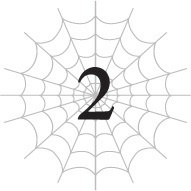

# Chương 2: Thị trấn
*(The Town)*

---

Tôi vừa nhồm nhoàm gặm một trong số những xác chết của bọn cướp mà tôi cuỗm theo.

Thực ra tôi không hề có ý định mang chúng theo, nhưng một trong số các Phân thân Tư duy của tôi đã nhặt chúng lên.

Rồi tống thẳng bọn chúng vào [Lưu trữ Không gian] bằng [Ma pháp Không gian].

Nghĩ lại thì tôi cũng không bận tâm lắm, nhưng tôi hơi bất ngờ khi các Phân thân Tư duy lại làm một việc mà tôi hoàn toàn không hề lên kế hoạch trước.

[Phân thân Tư duy] là một kỹ năng về cơ bản sẽ tạo ra các bản sao ý thức của tôi, kiểu như một chứng rối loạn đa nhân cách được cố ý tạo ra vậy.

Nhưng các bản sao có cùng quy trình suy nghĩ giống như tôi, nghĩa là có nhiều tôi hơn.

Tất cả bọn họ đều là tôi thật, không hề có sự phân biệt rạch ròi nào giữa người này với người kia.

Cùng với nhau, các bản sao phân tách này tạo nên tâm trí và ý thức của tôi.

Ít nhất, đó là những gì tôi từng nghĩ. Nhưng sau khi họ đi chiến đấu với Mẹ suốt một thời gian dài như vậy, hành vi của các Phân thân Tư duy lại bắt đầu làm tôi ngạc nhiên.

Việc nhặt mấy cái xác này là một ví dụ.

Tôi đã hoàn toàn có ý định để mặc đống xác ở đó, vậy mà các Phân thân Tư duy lại thu gom chúng như thể đó là điều tự nhiên nhất trên đời.

Và khi tôi hỏi tại sao họ lại làm vậy, câu trả lời nhận được là: \[Sao lại không làm thế chứ?\]

Các Phân thân Tư duy khác đều đồng ý, thành ra tôi là người duy nhất phản đối.

Tôi đang có sự bất đồng ý kiến với các Phân thân Tư duy của mình, những người đáng lẽ phải là chính tôi.

Chuyện này chưa từng xảy ra trước đây. Trước đó tôi cũng chẳng có lý do gì để nghĩ rằng chuyện này có thể xảy ra cả.

--- PAGE BREAK ---

Ý tôi là, việc bất đồng ý kiến với chính mình nghe thật phi lý, phải không?

Nhưng bằng cách nào đó, đó chính xác là những gì đã xảy ra.

Lẽ ra tôi phải vui mừng vì các Phân thân Tư duy đã đánh bại Mẹ và trở về, nhưng tôi không thể ngăn bản thân cảm thấy có chút bất an về sự thay đổi này.

Đó cũng là lý do chính khiến tôi chưa hề giao quyền kiểm soát cơ thể cho họ kể từ khi họ quay lại.

Vai trò của tôi trước đây là “não thông tin”: phân tích kẻ địch bằng [Thẩm định] và những thứ tương tự.

Não cơ thể chịu trách nhiệm di chuyển cơ thể, các não ma pháp chịu trách nhiệm về ma pháp, vân vân và vân vân.

Nhưng bây giờ, tôi đang tự mình di chuyển cơ thể.

Vì trước đây tôi từng tự làm mọi thứ chỉ với một ý thức duy nhất, nên cũng không phải là tôi đã quên cách làm.

Chỉ là việc chia sẻ công việc giữa các Phân thân Tư duy sẽ hiệu quả hơn nhiều thôi.

Hiện tại tôi đang hy sinh sự hiệu quả đó để tự mình làm mọi việc, giống hệt như những gì tôi từng làm trước khi có các Phân thân Tư duy.

Họ vẫn có thể tự mình sử dụng ma pháp, nhưng mọi việc khác chỉ có thể do tôi "thực sự" thực hiện mà thôi.

Các Phân thân Tư duy của tôi không hề phàn nàn về điều này.

Tôi đoán là họ đã hiểu rõ những gì tôi đang nghĩ rồi.

Có lẽ chính bản thân họ cũng nhận ra rằng mình đã thay đổi.

Nhưng tôi vẫn chưa thực hiện bất kỳ biện pháp nghiêm túc nào để tách biệt mình khỏi họ hay bất cứ điều gì tương tự cả.

Việc họ có thể nhặt cái xác đó thực chất cũng không quá đáng ngạc nhiên.

Nguyên tắc chỉ đạo chính của tôi luôn là không bao giờ để lại thứ gì và luôn ăn thịt những con quái vật mình đã tiêu diệt.

Dĩ nhiên cũng có một số ngoại lệ, chẳng hạn như khi hoàn cảnh rõ ràng không cho phép.

Đối với tôi, đây là một trong những trường hợp như vậy.

Tôi đã định thu gom xác bọn cướp, nhưng khi tôi bắt gặp một người bạn học tái sinh, mọi kế hoạch liền bay biến sạch.

Ý định ban đầu của tôi là làm cho có vẻ như tôi chỉ là một con quái vật tình cờ đi ngang qua, giết chết bọn cướp rồi cuỗm xác chúng đi.

Nhưng một trong số các hộ vệ mà tôi cứ ngỡ đã bị bọn cướp giết chết thực chất vẫn còn thoi thóp giữ được một hơi tàn, thế nên tôi đã lỡ tay cứu anh ta theo bản năng mất rồi.

--- PAGE BREAK ---

Kịch bản "quái vật qua đường" của tôi coi như đã đổ bể hoàn toàn từ thời điểm đó.

Tôi đánh bại bọn cướp rồi lại đi chữa trị cho một con người bị thương, chuyện đó chắc chắn đã làm lộ rõ việc tôi cố tình cứu họ rồi.

Chỉ riêng việc đó thôi đã là quá đủ để tạo nên vài lời đồn đại rồi, vậy mà tôi còn đi thi mắt trừng mắt dẹt với đứa bé ngốc nghếch kia nữa chứ.

Tôi đã gây chú ý quá mức cần thiết rồi.

Và càng nổi bật thì người ta lại càng có nhiều khả năng bàn tán về tôi hơn.

Nếu tin đồn lan rộng, nó thậm chí có thể lọt vào tai của Ma Vương.

Đó chính xác là lý do tại sao tôi quyết định vứt bỏ đống xác chết kia rồi co giò chạy biến trước khi làm điều gì đó khiến bản thân nổi bật hơn nữa.

Mặc dù lúc đó thì cũng đã quá muộn rồi.

Tôi đã gây chú ý bằng rất nhiều cách khác nhau. Nên đoán là thêm một hiện tượng kỳ lạ như xác chết biến mất một cách bí ẩn cũng chẳng tạo ra mấy sự khác biệt nữa đâu.

Nói đi cũng phải nói lại, các Phân thân Tư duy cũng không làm điều gì quá tệ hại hay gì cả.

Lý do duy nhất khiến tôi cảm thấy tồi tệ lúc này là đống xác của bọn cướp mà tôi đang ăn trông thật hôi hám và dơ dáy.

Chỉ thế thôi.

Trong lúc vừa ngậm ngùi ăn xác của ba tên Hôi Hám, Bốc Mùi và Dơ Dáy, tôi vừa nhìn chằm chằm vào một thị trấn lớn.

Mọi người thấy đấy, tôi đã nghĩ rằng nếu mình cứ đi theo một con đường đủ lớn cho xe ngựa chạy, sớm muộn gì tôi cũng sẽ vấp phải một thị trấn nào đó.

Nơi này lớn hơn tôi tưởng tượng một chút.

Cũng hơi bất ngờ khi nó lại nằm gần nơi tôi giải cứu cỗ xe ngựa kia như thế.

Tại sao mấy tên ngốc các người lại gây chuyện ở nơi gần thị trấn thế này làm gì cơ chứ?

Làm thế chẳng khác nào đang cầu xin người ta gọi lính gác đến tóm cổ cả.

Nếu tôi là các người, tôi sẽ thực hiện mấy phi vụ phạm pháp ở nơi xa văn minh nhân loại hơn một chút.

Mà thôi, chắc cũng chẳng quan trọng nữa, vì đằng nào thì các người cũng đã bị giết và tôi thì đang ăn thịt các người ngay lúc này rồi.

Dù sao thì, thị trấn này được bao bọc bốn bề bởi những bức tường trông khá kiên cố.

--- PAGE BREAK ---

Khi sống trong một thế giới tràn ngập quái vật nguy hiểm, tôi đoán là chẳng có cách nào sống yên bình nếu thiếu đi một lớp bảo vệ như vậy cả.

Để làm bằng chứng thì không có nổi một tòa nhà nào nằm bên ngoài tường thành cả.

Thông thường, khi có một thị trấn lớn như thế này, nhiều tòa nhà sẽ bắt đầu mọc lên bên ngoài tường thành khi thành phố mở rộng ra ngoài.

Nhưng tất cả các tòa nhà ở đây đều nằm gọn lỏn bên trong những bức tường thành.

Có lẽ họ sợ rằng quái vật sẽ tấn công trước cả khi họ xây xong bất cứ thứ gì trên vùng đất không được bảo vệ đó.

Hơn nữa, tôi nghĩ điều đó cũng giúp ngăn chặn những kẻ ngoài vòng pháp luật như những tên tôi đang nhai dở lúc này.

Có một tháp canh ở bốn góc, và những người lính cũng đang tuần tra dọc theo các bức tường thành.

Trời lúc này cũng siêu tối luôn. Tôi thực sự ấn tượng đấy!

Ý tôi là, tôi có kỹ năng [Dạ Nhãn] đã đạt cấp tối đa nên có thể nhìn thấy mọi thứ rõ mồn một, nhưng dù sao thì. Mấy người bình thường kia đâu phải là sinh vật hoạt động về đêm, nên họ khá là dũng cảm khi đứng gác đêm mà hầu như không có lấy một nguồn sáng nào.

Đúng vậy, hiện tại đang là ban đêm. Thật ra là lúc nửa đêm.

Khoảng thời gian mà tất cả những đứa trẻ ngoan nên được đắp chăn đi ngủ rồi.

Vì không có đèn đường hay bất cứ thứ gì tương tự ở thế giới này, các thị trấn sẽ trở nên cực kỳ tối tăm vào ban đêm.

Có vẻ hầu hết mọi người cũng đi ngủ khá sớm. Ngay khi mặt trời lặn, họ liền tắt đèn và đi ngủ luôn.

À thì, tôi đoán điều đó cũng hợp lý thôi. Không giống như Nhật Bản hiện đại, họ phải sử dụng lửa làm nguồn sáng, thứ chắc chắn chẳng hề rẻ chút nào.

Có lẽ việc tắt đèn đi ngủ sớm sẽ an toàn và tiết kiệm hơn nhiều.

Nên dù có rất nhiều người sống ở thị trấn này, nơi đây vẫn trở nên siêu tối tăm và yên tĩnh ngay khi màn đêm buông xuống.

Điều này thực sự làm nổi bật sự khác biệt giữa nơi đây và Nhật Bản.

Ở Nhật Bản lúc nào cũng sáng trưng, ngay cả vào ban đêm.

Nếu mọi người nhìn vào ảnh vệ tinh của Trái Đất ở nửa bán cầu đang là nửa đêm, quần đảo Nhật Bản lúc nào cũng được thắp sáng rực rỡ và vô cùng rõ ràng.

Vì đã quen với điều đó nên tôi không khỏi nghĩ thầm: *Trời ạ, tôi không ngờ ban đêm lại tối tăm đến mức này đấy.*

Nhưng vẫn chưa tối bằng bên trong mê cung đâu nhé!

Dù sao thì, ở trong đó làm gì có ánh trăng hay ánh sao đâu chứ.

--- PAGE BREAK ---

Ồ, nhân tiện thì, hóa ra nơi này có nhiều hơn một mặt trăng.

Khi lần đầu tiên nhìn thấy cảnh đó, tôi đã không khỏi có chút xúc động trước cảm giác đậm chất dị giới này.

Mà không biết chuyện đó có ảnh hưởng gì đến thủy triều các thứ ở đây không nhỉ?

Dù sao thì, mọi người có đoán được tại sao tôi lại quan sát thị trấn vào lúc nửa đêm thế này không?

Câu trả lời hiện đang lén lút di chuyển trong thị trấn kia kìa.

Một nhóm người mặc đồ đen từ đầu đến chân đang lẻn về phía dinh thự lớn nằm ở trung tâm thành phố.

Trông họ cứ như đang gào lên rằng: "Bọn tôi đang đi làm chuyện xấu đây!" vậy.

Nhóm người áo đen lọt vào dinh thự mà không hề phát ra một tiếng động nào.

Không phải là do hệ thống an ninh của dinh thự kém đâu nhé.

Có lính gác tuần tra xung quanh khuôn viên để canh gác, và tất cả các cửa ra vào lẫn cửa sổ đều được khóa chặt.

Nhà của thường dân ở thế giới này dường như hoàn toàn không có khóa, nên việc dinh thự đó lắp khóa ở mọi cửa ra vào và cửa sổ được coi là có độ bảo mật khá cao đấy.

Các lính gác cũng sở hữu kỹ năng [Dạ Nhãn], cùng với những kỹ năng khác như [Tăng cường Ngũ quan] và [Cảm nhận Hiện diện], nên họ là một hệ thống cảnh báo bằng người vô cùng hoàn hảo.

Tuy nhiên, nhóm người áo đen dễ dàng vượt qua họ vì kỹ năng của chúng đơn giản là vượt trội hơn hẳn.

Chúng được trang bị tận răng các kỹ năng che giấu hành tung như [Ẩn mật], [Che giấu], [Vô thanh] và [Vô hương].

Trên hết, tôi cũng chẳng biết phải giải thích thế nào, nhưng chuyển động của chúng chuyên nghiệp thực sự luôn.

Chúng lướt qua tầm mắt của lính gác bằng các động tác nhào lộn điệu nghệ một cách dễ dàng, bẻ khóa trong chớp mắt rồi lẻn vào trong.

Rõ ràng là chúng đã làm loại chuyện này rất nhiều lần rồi.

Chúng là những kẻ đâm thuê chém mướn chuyên nghiệp mà kỹ năng của chúng khiến bất kỳ tên trộm thông thường nào cũng phải xấu hổ.

Và trong nhà xe (hay tôi đoán là phòng để xe ngựa) của dinh thự mà chúng đang nhắm tới là một cỗ xe trông vô cùng quen mắt.

Đúng vậy. Chính là cỗ xe mà tôi đã nhìn thấy nhóc hút máu sơ sinh chiều nay.

Mọi người biết điều đó nghĩa là gì rồi đúng không?

Dinh thự khổng lồ này chính là nơi ở của bé con ma cà rồng kia!

--- PAGE BREAK ---

Trời đất, gia thế của đứa trẻ này giàu nứt đố đổ vách luôn.

Mà thực ra, không phải họ là quý tộc sao?

Từ những gì tôi thấy trước đó, tôi đoán cha của nhóc hút máu kia chính là người cai quản thị trấn này.

Tên của ông ta là John Keren.

Chủng tộc: Con người. Con người. Tôi phải nói lại hai lần vì nó rất quan trọng.

Mừng cho nhóc nhé, Dracula con! Nhóc là một ma cà rồng được sinh ra từ bố mẹ con người thông qua một kiểu đột biến quái dị nào đó!

A-ha-ha-ha!

Được rồi, thật ra chuyện này chẳng có gì đáng cười cả.

Tôi không biết ma cà rồng ở thế giới này thường bị đối xử thế nào, nhưng nếu một quý tộc quyền thế tự dưng lại đẻ ra một đứa trẻ ma cà rồng, nghe mùi rắc rối to trong tương lai rồi đây.

Thôi thì họ sẽ tự phải giải quyết chuyện đó thôi.

Tôi đâu thể cứ lảng vảng quanh đây để trông chừng họ mãi được.

Nhưng ngay lúc này, nếu tôi để mặc chuyện xấu xảy ra với họ ngay trước mắt mình, chắc chắn sau này tôi sẽ cảm thấy dằn vặt lắm.

Đó là lý do đã đến lúc tung ra chiêu thức mới của tôi rồi!

[Vạn Lý Nhãn] kết hợp với [Chú Oán Tà Nhãn]!

Trước đây khi chỉ có [Thiên Lý Nhãn], tôi có thể nhìn thấy những vật ở rất xa, nhưng không thể [Thẩm định] hay dùng Tà Nhãn lên chúng được.

Nhưng mọi người đoán xem! Giờ đây khi [Thiên Lý Nhãn] đã tiến hóa thành [Vạn Lý Nhãn], tôi hoàn toàn có thể kết hợp hai thứ đó với nhau!

Xem nào, hiện tại tôi vẫn đang ở trong khu rừng gần thị trấn.

Dù cách dinh thự xa đến thế, nhưng nếu kết hợp [Vạn Lý Nhãn] với Tà Nhãn, tôi có thể tấn công kẻ địch mà chúng hoàn toàn không có cơ hội đánh trả!

Đã vậy độ chính xác còn đạt mức tuyệt đối nữa chứ!

Nghĩ mà xem. Tà Nhãn tác động lên bất cứ thứ gì trong tầm mắt của tôi, nên không đời nào nó bắn trượt được cả.

Nghĩa là chỉ cần tôi nhìn thấy kẻ địch, tôi có thể tấn công chúng mà không trượt phát nào!

Đúng là đòn tấn công tầm xa tối thượng. Nghe ngầu lòi ra phết đúng không?

Này, tôi chỉ nói thế thôi nhé.

Dù sao thì, [Chú Oán Tà Nhãn] sẽ hấp thụ HP, MP và SP của nạn nhân, đồng thời liên tục làm giảm các chỉ số của chúng nữa.

Và vì khoảng cách là cực kỳ xa, chúng sẽ không thể chống trả.

Khá là tàn bạo, nếu chính tôi tự nhận xét như vậy.

Thật ra, với chỉ số Tấn công Phép thuật siêu cao của tôi, nó có thể giết chết con người gần như ngay lập tức.

--- PAGE BREAK ---

Vậy nên không cần dông dài nữa, tôi dùng đòn hiểm hóc này lên những kẻ đột nhập luôn.

Chúng đổ rạp xuống tại chỗ như thể vừa bị trúng một đòn tấn công bất ngờ.

Ý tôi là, thật ra thì đúng là như vậy đấy.

Tôi đã hút sạch HP, MP và SP của chúng chỉ trong nháy mắt.

Chà, chuyện tất cả bọn chúng lăn ra chết mà không có bất kỳ vết thương ngoài da nào chắc chắn trông sẽ rất bí ẩn đây.

Tôi cứ để mặc đống xác chết bí ẩn đó ở trong dinh thự thôi.

Việc đó chắc chắn sẽ gây ra một trận hỗn loạn lớn trong nhà vào sáng ngày mai cho xem.

Nhưng tôi không hề cố ý trêu đùa họ bằng cách để đống xác ở đó đâu nhé.

Tôi để lại đám xác chết khả nghi đó như một lời cảnh báo, để họ biết rằng mình đang bị nhắm tới.

Đúng vậy, có ai đó đang nhắm vào dinh thự này.

Tôi đã biết chuyện này không lâu sau khi đến thị trấn.

Khi tôi đang ngắm nhìn khu định cư đầu tiên của loài người mà tôi từng thấy ở thế giới này, cỗ xe ngựa chở nhóc hút máu đi tới. Dù sao thì cỗ xe cũng vừa bị tấn công ngay bên ngoài thị trấn mà.

Có một đám người trông rất khả nghi đang nhìn chằm chằm vào cỗ xe ngựa của họ.

Ánh mắt của chúng ẩn chứa một điều gì đó rất nguy hiểm.

Lúc đó tôi bỗng nảy ra suy nghĩ!

Có khi nào chính đám này là kẻ đã phái bọn cướp tấn công cỗ xe ngựa kia ngay từ đầu không?

Tai họa bất ngờ ập xuống đầu vợ con của lãnh chúa.

Sau đó, vị lãnh chúa chìm trong tuyệt vọng và lụi bại.

Và ẩn nấp trong bóng tối, một vài kẻ xấu sẽ hưởng lợi.

Tất cả những chuyện đó hiện lên rõ ràng trong tâm trí tôi như cốt truyện của một cuốn tiểu thuyết rẻ tiền vậy.

Dự đoán khá là hợp lý đúng không? Tôi quyết định để mắt tới đám nhân vật mờ ám này một chút.

May mắn thay, Ma Vương hiện tại đang ở [Tầng đáy] của [Mê cung Lớn Elroe] vì một lý do nào đó.

Thị trấn này nằm cách khá xa mê cung, và sẽ mất kha khá thời gian chỉ để đi từ [Tầng đáy] trở lại mặt đất.

Ít nhất cũng phải mất vài ngày nữa thì Ma Vương mới có khả năng bắt kịp tôi.

--- PAGE BREAK ---

Chắc cũng không có vấn đề gì nếu tôi lảng vảng quanh đây thêm một chút.

Tôi không nghĩ đó là lỗi của mình nếu có chuyện gì xảy ra với họ khi tôi không có mặt ở đây để trông chừng, nhưng tôi cũng không thể trơ mắt nhìn một quả bom hẹn giờ đang chực chờ nổ ngay trước mắt.

Ý tôi là, nếu họ bị giết sau khi tôi đã tốn công giải cứu họ khỏi bọn cướp kia, thì công sức của tôi coi như đổ sông đổ bể hết sao?

Đó là lý do tôi quyết định tiếp tục để mắt tới đám nhân vật cực kỳ khả nghi đó.

Đầu tiên, bọn chúng bắt đầu tổ chức một cuộc họp chiến lược tại nơi trông giống như một mật thất.

Thỉnh thoảng, dường như có kẻ trong số chúng liếc nhìn về phía tôi, nhưng chắc tôi chỉ tưởng tượng thôi. Đúng không nhỉ?

Và khi tôi tiếp tục quan sát chúng, điều kỳ lạ nhất đã xảy ra.

Chúng định đột nhập vào dinh thự ngay trong đêm!

Thú thật, tôi hơi bất ngờ khi bọn chúng lại hung hăng đến mức ra tay ngay trong ngày hôm đó luôn.

Có gan đấy; tôi công nhận điều đó.

Nhưng giờ chúng chết hết rồi, nên có gan cũng chẳng để làm gì nữa.

Dù sao thì, tôi đã tiêu diệt đám đột nhập đó, nhưng tôi vẫn chưa giải quyết được tận gốc vấn đề.

Vẫn còn vài kẻ ở trong sào huyệt.

Và một tên trong số đó dường như cũng có [Thiên Lý Nhãn].

Ngay khoảnh khắc đám đột nhập đổ rạp xuống chết, tên đó liền đi báo cáo cho một tên trông giống như đại ca của chúng.

Tôi không hiểu ngôn ngữ ở đây, nên dĩ nhiên tôi không biết hắn đã nói gì, nhưng tôi chắc chắn hắn đang báo cáo rằng nhóm đột nhập đã ngoẻo rồi.

Thế rồi tên đại ca mặc áo choàng trông có vẻ quan trọng kia dùng [Thần giao cách cảm] để liên lạc với một ai đó.

Tôi cũng kiểu như đánh chặn được tin nhắn đó nhờ Giáo sư Trí Tuệ hay đại loại vậy, nhưng đằng nào thì tôi cũng chả hiểu được gì.

Người hắn đang nói chuyện cùng nghe giọng vô cùng hợm hĩnh. Có lẽ tên đó là sếp của tên áo choàng chăng?

Điều đó nghĩa là tổ chức đang nhắm vào vị lãnh chúa này còn có nhiều chi nhánh khác bên ngoài thị trấn.

Nếu tôi tiêu diệt hết đám mưu đồ ở đây, chúng có thể sẽ gửi viện binh từ chi nhánh khác tới.

Thế nên việc tôi giết sạch đám ở thị trấn này cũng chẳng có ý nghĩa gì cả.

Đâu phải việc của tôi khi phải đối đầu với một tổ chức chống lãnh chúa hoành tráng nào đó chứ, đúng không?

Đó là lý do tôi để lại đống xác chết ở đó để báo cho lãnh chúa biết có kẻ đang nhắm vào gia đình ông ta.

Nếu biết mình đang bị nhắm tới, ông ta có lẽ sẽ đoán được thủ phạm bằng cách nhận diện danh tính của đám đột nhập hay gì đó.

Sau đó, việc bảo vệ gia đình thế nào là tùy thuộc vào ông ta thôi.

Đó là điều tốt nhất tôi có thể làm cho nhóc rồi đấy, nhóc con.

--- PAGE BREAK ---

Ngay cả khi xét về mặt kỹ thuyết thì chúng tôi có quen biết nhau ở kiếp trước, tôi nghĩ việc cứu mạng nhóc tận hai lần đã là quá đỗi tốt bụng rồi.

Thế nên như vậy là tốt lắm rồi.

Nếu một người sắp bị quái vật hay bọn cướp hay bất cứ thứ gì giết chết ngay trước mắt tôi, chắc chắn tôi sẽ cứu họ.

Tôi có đủ sức mạnh để làm điều đó, nên nếu ngoảnh mặt làm ngơ thì tôi sẽ thấy dằn vặt lắm.

Chuyện đó kiểu như khi mọi người thấy rác trên đất, và thùng rác lại ở ngay bên cạnh, thế nên mọi người nhặt lên vứt vào thôi.

Mọi người sẽ cảm thấy thỏa mãn một chút vì đã làm được một việc tốt trong ngày.

Nhưng tôi sẽ không rảnh rỗi đến mức chúi mũi vào những việc mà mình không nhìn thấy.

Nếu ai đó chết khi tôi không nhìn thấy, thì đó không phải lỗi của tôi.

Ý tôi là, mọi người sẽ làm gì nếu thấy rác trên đất, nhưng xung quanh lại chẳng có cái thùng rác nào cả?

Khả năng cao là mọi người sẽ để mặc nó ở đó thôi vì thấy phiền phức quá mà.

Nên dù gia đình nhóc hút máu có bị nhắm tới đi nữa, tôi cũng chẳng rảnh mà đi tiêu diệt cả tổ chức của kẻ địch đâu.

Việc đó quá tốn công sức.

Thế nên tôi sẽ giúp đỡ trong phạm vi mình nhìn thấy được, còn sau đó thì cứ để họ tự lo liệu đi.

Tôi không mềm lòng đến mức sẵn sàng cống hiến thời gian và sức lực của mình cho người khác miễn phí đâu.

Dốc hết sức lực chỉ để giúp một kẻ qua đường quả thực không đáng công.

Tôi chỉ sẵn sàng làm việc chăm chỉ nhất khi nó trực tiếp mang lại lợi ích cho bản thân mà thôi.

Ít nhất, đó từng là kế hoạch của tôi.

Nhưng ngay khi gã mặc áo choàng cởi mũ trùm ra, mọi thứ liền thay đổi hoàn toàn.

\[Một tên Elf...\] \[Một tên Elf...\] \[Một tên Elf...\] \[Một tên Elf...\] \[Một tên Elf...\] \[Một tên Elf...\]

Đôi tai của gã ta dài và nhọn.

Ồồồ, đó chính xác là chủng tộc fantasy kinh điển đây rồi!

Nhưng tôi là người duy nhất hào hứng.

Các Phân thân Tư duy khác chỉ đồng thanh thì thầm: \[Một tên Elf\] với sự đồng điệu tuyệt đối.

Đây không phải là sự thờ ơ; mà là... giận dữ? Thù địch? Căm ghét?

Cái quái gì thế này?

Tôi không hiểu tại sao các Phân thân Tư duy của mình lại trở nên căng thẳng như vậy.

Tại sao cảm xúc của họ lại đột ngột thay đổi như thế chứ?

Họ ghét Elf đến mức đó sao?

Tôi hoàn toàn không hiểu nổi tại sao lại như vậy nữa.

Nhưng các Phân thân Tư duy không hề thắc mắc về những cảm xúc đó. Thái độ của họ đối với tên Elf đó thực tế là ngập tràn sát khí.

\[Nếu tộc Elf có nhúng tay vào, chúng ta không thể nhắm mắt làm ngơ được.\]

\[Đồng ý!\] \[Không có ý kiến gì phản đối cả.\] \[Lên thôi!\]

Và giờ có vẻ như họ đang phớt lờ sự bối rối của tôi và tự đưa ra quyết định mà thậm chí chẳng buồn hỏi ý kiến tôi nữa.

Tôi thực sự chịu, chẳng hiểu nổi chuyện gì đang xảy ra cả.

Nhưng có vẻ như họ sẽ quay lưng lại với tôi nếu tôi lên tiếng phản đối mất.

Ma Vương còn đang ở tận [Tầng đáy] xa xôi, nghĩa là chúng tôi vẫn còn một khoảng thời gian trước khi mụ ta đuổi kịp.

Hơn nữa, giờ khi đã mở rộng tầm mắt và tìm được nhiều nơi hơn để chạy trốn, tôi có thể dịch chuyển đi ngay khi Ma Vương bắt đầu tiếp cận.

Chỉ cần tôi không lơ là cảnh giác, tôi khá chắc là Ma Vương sẽ không bắt được tôi đâu.

Nên việc tôi ở lại đây thêm một chút thực sự không phải là vấn đề lớn.

Dù vậy, cảm giác thật đáng sợ khi tôi không biết các Phân thân Tư duy của chính mình đang nghĩ gì.

Cứ như thể một phần trong tôi đang biến thành một người hoàn toàn khác vậy...

Thú thật, tôi thấy khá là rợn tóc gáy trước chuyện này.

Dẫu sao thì, tôi không nghĩ mình sẽ phản đối họ đâu.

Bởi vì tôi có linh cảm xấu về những gì có thể xảy ra nếu tôi làm vậy.

Và thế là, vì lý do gì đi nữa, tôi quyết định sẽ ở lại gần thị trấn này thêm một thời gian.

---

[◀ Chương trước: Đoạn phụ: Nửa đời bán Elf](interlude_the_half_elfs_half_life.md) | [Chương tiếp theo: Chương đặc biệt: Kẻ chủ mưu: Tộc trưởng tộc Elf ▶](special_chapter_the_conspirators_chief_of_the_elves.md)
